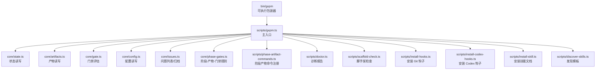
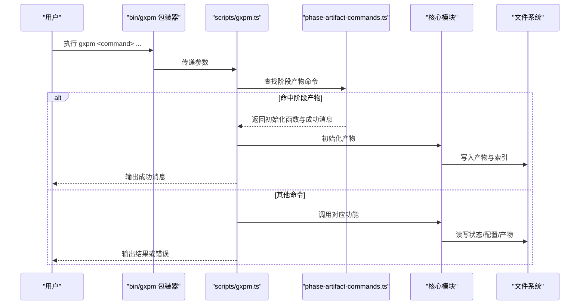
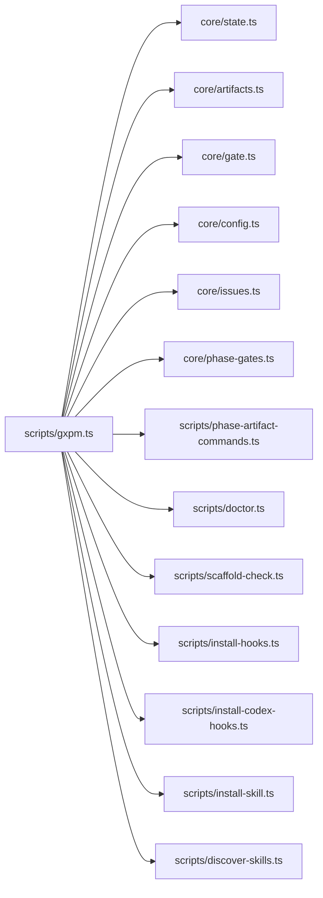

# CLI 命令参考

<cite>
**本文引用的文件**
- [bin/gxpm](file://bin/gxpm)
- [scripts/gxpm.ts](file://scripts/gxpm.ts)
- [scripts/phase-artifact-commands.ts](file://scripts/phase-artifact-commands.ts)
- [scripts/doctor.ts](file://scripts/doctor.ts)
- [scripts/scaffold-check.ts](file://scripts/scaffold-check.ts)
- [scripts/install-hooks.ts](file://scripts/install-hooks.ts)
- [scripts/install-codex-hooks.ts](file://scripts/install-codex-hooks.ts)
- [scripts/install-skill.ts](file://scripts/install-skill.ts)
- [scripts/discover-skills.ts](file://scripts/discover-skills.ts)
- [core/phase-gates.ts](file://core/phase-gates.ts)
- [core/artifacts.ts](file://core/artifacts.ts)
- [core/config.ts](file://core/config.ts)
- [package.json](file://package.json)
- [test/gxpm-cli.test.ts](file://test/gxpm-cli.test.ts)
- [test/version-cli.test.ts](file://test/version-cli.test.ts)
</cite>

## 目录
1. [简介](#简介)
2. [项目结构](#项目结构)
3. [核心组件](#核心组件)
4. [架构总览](#架构总览)
5. [详细组件分析](#详细组件分析)
6. [依赖分析](#依赖分析)
7. [性能考虑](#性能考虑)
8. [故障排查指南](#故障排查指南)
9. [结论](#结论)
10. [附录](#附录)

## 简介
本文件为 gxpm CLI 的完整命令参考，覆盖基础命令、项目管理命令、产物管理命令、配置管理命令与诊断命令。每个命令均给出语法、参数、使用示例、返回值说明，并解释命令间的关系与组合使用方式。同时提供别名、选项与环境变量支持说明，以及常见使用场景与实际输出示例。

## 项目结构
- 入口脚本通过可执行包装器调用核心脚本，核心脚本解析命令并分派到各子功能模块。
- 命令按功能域划分为：项目状态与流程（issue）、产物（artifact）、门禁钩子（gate）、配置（config）、工作树策略（worktree）、诊断（doctor）等。
- 阶段-产物-门禁规则由统一规则表驱动，阶段产物命令通过规则动态注册。

图表来源
- [bin/gxpm](file://bin/gxpm)
- [scripts/gxpm.ts](file://scripts/gxpm.ts)
- [core/state.ts](file://core/state.ts)
- [core/artifacts.ts](file://core/artifacts.ts)
- [core/gate.ts](file://core/gate.ts)
- [core/config.ts](file://core/config.ts)
- [core/issues.ts](file://core/issues.ts)
- [core/phase-gates.ts](file://core/phase-gates.ts)
- [scripts/phase-artifact-commands.ts](file://scripts/phase-artifact-commands.ts)
- [scripts/doctor.ts](file://scripts/doctor.ts)
- [scripts/scaffold-check.ts](file://scripts/scaffold-check.ts)
- [scripts/install-hooks.ts](file://scripts/install-hooks.ts)
- [scripts/install-codex-hooks.ts](file://scripts/install-codex-hooks.ts)
- [scripts/install-skill.ts](file://scripts/install-skill.ts)
- [scripts/discover-skills.ts](file://scripts/discover-skills.ts)

章节来源
- [bin/gxpm](file://bin/gxpm)
- [scripts/gxpm.ts](file://scripts/gxpm.ts)
- [package.json](file://package.json)

## 核心组件
- 主入口脚本负责命令解析、参数校验、错误处理与结果输出。
- 阶段-产物-门禁规则驱动阶段产物命令的动态注册与提示。
- 诊断脚本汇总运行时、仓库与技能安装状态，便于快速定位问题。
- 安装脚本提供 Git 钩子与 Codex 钩子的安装能力。

章节来源
- [scripts/gxpm.ts](file://scripts/gxpm.ts)
- [scripts/phase-artifact-commands.ts](file://scripts/phase-artifact-commands.ts)
- [scripts/doctor.ts](file://scripts/doctor.ts)
- [scripts/install-hooks.ts](file://scripts/install-hooks.ts)
- [scripts/install-codex-hooks.ts](file://scripts/install-codex-hooks.ts)

## 架构总览
CLI 命令的控制流从包装器进入主脚本，根据命令分支调用对应模块；阶段产物命令通过规则表动态匹配；门禁命令在 Git 钩子或手动场景下评估当前状态与所需产物。

图表来源
- [bin/gxpm](file://bin/gxpm)
- [scripts/gxpm.ts](file://scripts/gxpm.ts)
- [scripts/phase-artifact-commands.ts](file://scripts/phase-artifact-commands.ts)
- [core/artifacts.ts](file://core/artifacts.ts)
- [core/state.ts](file://core/state.ts)

## 详细组件分析

### 基础命令
- 版本查询
  - 语法: gxpm version | gxpm --version | gxpm -v
  - 参数: 无
  - 行为: 读取包版本并打印
  - 示例: 见测试用例
  - 返回值: 退出码 0；标准输出为版本号字符串
  - 章节来源
    - [scripts/gxpm.ts](file://scripts/gxpm.ts)
    - [test/version-cli.test.ts](file://test/version-cli.test.ts)

- 脚手架检查
  - 语法: gxpm check
  - 参数: 无
  - 行为: 检查主机配置、治理文档与技能生成（仅检查）
  - 返回值: 退出码 0 或 1；标准输出为通过信息或错误列表
  - 章节来源
    - [scripts/gxpm.ts](file://scripts/gxpm.ts)
    - [scripts/scaffold-check.ts](file://scripts/scaffold-check.ts)

### 项目管理命令（issue）
- 创建问题
  - 语法: gxpm issue create <issue-id> [--auto-id]
  - 参数:
    - <issue-id>: 问题标识符；可选 --auto-id 自动生成下一个可用 ID
  - 行为: 初始化问题状态至 triage 阶段
  - 返回值: 退出码 0；标准输出包含创建的 issueId、当前阶段与状态路径
  - 章节来源
    - [scripts/gxpm.ts](file://scripts/gxpm.ts)

- 查询状态
  - 语法: gxpm issue status <issue-id>
  - 参数: <issue-id>
  - 行为: 读取并打印当前阶段、更新时间与状态路径
  - 返回值: 退出码 0；标准输出包含字段
  - 章节来源
    - [scripts/gxpm.ts](file://scripts/gxpm.ts)

- 列表
  - 语法: gxpm issue list [--json] [--all] [--archived] [--recent N]
  - 参数:
    - --json: 以 JSON 输出
    - --all: 显示所有（含已归档/已落地）
    - --archived: 仅显示已归档
    - --recent N: 最近 N 条落地问题
  - 行为: 列出跟踪中的问题，支持过滤与格式化输出
  - 返回值: 退出码 0；标准输出为表格或 JSON
  - 章节来源
    - [scripts/gxpm.ts](file://scripts/gxpm.ts)

- 归档/取消归档
  - 语法: gxpm issue archive <issue-id> | gxpm issue unarchive <issue-id>
  - 参数: <issue-id>
  - 行为: 设置归档标志
  - 返回值: 退出码 0；标准输出包含操作确认
  - 章节来源
    - [scripts/gxpm.ts](file://scripts/gxpm.ts)

- 下一步建议
  - 语法: gxpm issue next <issue-id>
  - 参数: <issue-id>
  - 行为: 基于当前阶段与所需产物，给出下一步命令与提示
  - 返回值: 退出码 0；标准输出包含建议命令与提示
  - 章节来源
    - [scripts/gxpm.ts](file://scripts/gxpm.ts)
    - [core/phase-gates.ts](file://core/phase-gates.ts)

- 过往事件
  - 语法: gxpm issue history <issue-id> [--json]
  - 参数: <issue-id>；--json 可选
  - 行为: 输出事件时间线（创建、阶段转换、产物写入、门禁事件等）
  - 返回值: 退出码 0；标准输出为人类可读或 JSON
  - 章节来源
    - [scripts/gxpm.ts](file://scripts/gxpm.ts)

- 阶段转换
  - 语法: gxpm issue transition <issue-id> <phase>
  - 参数: <issue-id>、目标阶段
  - 行为: 校验并执行阶段转换，记录事件
  - 返回值: 退出码 0 或 1；标准输出包含转换前后阶段
  - 章节来源
    - [scripts/gxpm.ts](file://scripts/gxpm.ts)

- 组合使用示例
  - 创建问题 → 初始化阶段产物 → 转换到下一阶段 → 查看历史
  - 章节来源
    - [test/gxpm-cli.test.ts](file://test/gxpm-cli.test.ts)

### 产物管理命令（artifact）
- 列表
  - 语法: gxpm artifact list <issue-id>
  - 参数: <issue-id>
  - 行为: 列出该问题的所有产物类型、路径与写入时间
  - 返回值: 退出码 0；标准输出为表格
  - 章节来源
    - [scripts/gxpm.ts](file://scripts/gxpm.ts)
    - [core/artifacts.ts](file://core/artifacts.ts)

- 读取
  - 语法: gxpm artifact read <issue-id> <type>
  - 参数: <issue-id>、产物类型
  - 行为: 读取并打印产物 JSON
  - 返回值: 退出码 0；标准输出为 JSON
  - 章节来源
    - [scripts/gxpm.ts](file://scripts/gxpm.ts)
    - [core/artifacts.ts](file://core/artifacts.ts)

- 写入
  - 语法: gxpm artifact write <issue-id> <type> (--json <json> | --from <file> | --stdin)
  - 参数:
    - --json: 直接传入 JSON 字符串
    - --from: 从文件读取
    - --stdin: 从标准输入读取
  - 行为: 校验输入来源唯一性，解析 JSON，写入产物并更新索引
  - 返回值: 退出码 0；标准输出包含写入路径
  - 错误: 当未提供或提供多于一种输入来源时抛错
  - 章节来源
    - [scripts/gxpm.ts](file://scripts/gxpm.ts)
    - [core/artifacts.ts](file://core/artifacts.ts)

- 编辑
  - 语法: gxpm artifact edit <issue-id> <type>
  - 参数: <issue-id>、产物类型
  - 行为: 使用编辑器打开临时文件，保存后写回产物；失败保留临时文件
  - 返回值: 退出码 0；标准输出包含更新确认
  - 环境变量: 支持 EDITOR 或 VISUAL；默认 vi
  - 章节来源
    - [scripts/gxpm.ts](file://scripts/gxpm.ts)
    - [core/artifacts.ts](file://core/artifacts.ts)

- 产物类型
  - 支持类型见核心定义；非法类型会报错
  - 章节来源
    - [core/artifacts.ts](file://core/artifacts.ts)

### 阶段产物命令（自动注册）
- 注册机制
  - 通过阶段-产物-门禁规则动态生成命令映射，形如 “gxpm <phase> <task> <issue-id>”
  - 章节来源
    - [scripts/phase-artifact-commands.ts](file://scripts/phase-artifact-commands.ts)
    - [core/phase-gates.ts](file://core/phase-gates.ts)

- 常用命令
  - triage init <issue-id>: 初始化验收合同
  - plan init <issue-id>: 初始化实现计划
  - dispatch init <issue-id>: 初始化派发交接
  - implement verify <issue-id>: 初始化本地验证
  - local-verify ac-check <issue-id>: 初始化验收检查
  - ac-check self-review <issue-id>: 初始化自审
  - self-review ship <issue-id>: 初始化上船准备
  - ship pr-check <issue-id>: 初始化 PR 检查
  - pr-check verify <issue-id>: 初始化验证发现
  - verify qa <issue-id>: 初始化 QA 发现
  - qa land <issue-id>: 初始化落地发现
  - 章节来源
    - [scripts/phase-artifact-commands.ts](file://scripts/phase-artifact-commands.ts)
    - [core/phase-gates.ts](file://core/phase-gates.ts)

- 与门禁的关系
  - 每个阶段产物命令对应一个“必需产物”，用于门禁放行判断
  - 章节来源
    - [core/phase-gates.ts](file://core/phase-gates.ts)

### 门禁命令（Git 钩子）
- pre-commit
  - 语法: gxpm gate pre-commit <issue-id> --staged <files...>
  - 参数: <issue-id>；--staged 后跟被暂存的文件列表
  - 行为: 评估提交内容是否受保护路径影响；允许则记录通过事件，否则记录阻塞事件并退出非零
  - 返回值: 退出码 0 或 1；标准输出包含评估结果与原因
  - 章节来源
    - [scripts/gxpm.ts](file://scripts/gxpm.ts)
    - [core/gate.ts](file://core/gate.ts)

- commit-msg
  - 语法: gxpm gate commit-msg <msg-file> [--issue <id>]
  - 参数: <msg-file>；--issue 可选显式指定问题
  - 行为: 解析提交信息中的问题引用；若未找到且未显式指定则阻塞
  - 返回值: 退出码 0 或 1；标准输出包含评估结果
  - 章节来源
    - [scripts/gxpm.ts](file://scripts/gxpm.ts)
    - [core/gate.ts](file://core/gate.ts)

- pre-push
  - 语法: gxpm gate pre-push <issue-id>
  - 参数: <issue-id>
  - 行为: 检查所需产物是否存在；缺失则提示建议命令并阻塞
  - 返回值: 退出码 0 或 1；标准输出包含评估结果与提示
  - 章节来源
    - [scripts/gxpm.ts](file://scripts/gxpm.ts)
    - [core/gate.ts](file://core/gate.ts)

- post-merge
  - 语法: gxpm gate post-merge <issue-id>
  - 参数: <issue-id>
  - 行为: 若合并后应推进阶段，则自动初始化落地发现并转换阶段
  - 返回值: 退出码 0；标准输出包含转换结果
  - 章节来源
    - [scripts/gxpm.ts](file://scripts/gxpm.ts)
    - [core/gate.ts](file://core/gate.ts)

### 配置管理命令（config）
- 获取
  - 语法: gxpm config get <key>
  - 参数: <key>
  - 行为: 优先读取仓库配置，其次全局配置；打印键值与来源
  - 返回值: 退出码 0；标准输出包含键值与来源
  - 章节来源
    - [scripts/gxpm.ts](file://scripts/gxpm.ts)
    - [core/config.ts](file://core/config.ts)

- 设置
  - 语法: gxpm config set <key> <value> [--global]
  - 参数: <key>、<value>；--global 可选
  - 行为: 解析字面量（布尔/数字/字符串），写入对应作用域
  - 返回值: 退出码 0；标准输出包含设置详情与写入路径
  - 章节来源
    - [scripts/gxpm.ts](file://scripts/gxpm.ts)
    - [core/config.ts](file://core/config.ts)

- 列表
  - 语法: gxpm config list | gxpm config
  - 参数: --json 可选
  - 行为: 输出仓库与全局配置；--json 以 JSON 格式输出
  - 返回值: 退出码 0；标准输出包含两段配置
  - 章节来源
    - [scripts/gxpm.ts](file://scripts/gxpm.ts)
    - [core/config.ts](file://core/config.ts)

- 工作树策略
  - 语法: gxpm worktree policy [--json]
  - 参数: --json 可选
  - 行为: 解析工作树强制策略（来源优先级：仓库配置 > 用户消息 > AGENTS.md > 默认）
  - 返回值: 退出码 0；标准输出包含策略与来源
  - 章节来源
    - [scripts/gxpm.ts](file://scripts/gxpm.ts)
    - [core/config.ts](file://core/config.ts)

### 诊断命令（doctor）
- 语法: gxpm doctor [--json]
- 参数: --json 可选
- 行为: 汇总运行时（Bun、版本、仓库根）、技能安装（各主机）、仓库状态（Git、钩子、.gxpm 目录与问题数量）；--json 输出结构化报告
- 返回值: 退出码 0；标准输出为人类可读或 JSON
- 章节来源
- [scripts/gxpm.ts](file://scripts/gxpm.ts)
- [scripts/doctor.ts](file://scripts/doctor.ts)

### 安装与初始化命令（扩展工具）
- 安装 Git 钩子
  - 语法: gxpm-init --install-hooks --target <dir>
  - 参数: --target 指定仓库目录
  - 行为: 复制钩子文件，确保 core.hooksPath 指向 .githooks
  - 返回值: 退出码 0；标准输出包含安装与配置信息
  - 章节来源
    - [scripts/install-hooks.ts](file://scripts/install-hooks.ts)

- 安装 Codex 钩子
  - 语法: gxpm-init --install-codex-hooks [--scope user|repo] [--target <dir>] [--home <dir>] [--no-feature-flag]
  - 参数:
    - --scope: user 或 repo
    - --target: 仓库路径（scope=repo 时）
    - --home: 用户主目录（测试覆盖）
    - --no-feature-flag: 不自动启用 feature flag
  - 行为: 写入 hooks.json 并确保 feature flag；支持用户/仓库范围
  - 返回值: 退出码 0；标准输出包含安装路径、配置状态与提示
  - 章节来源
    - [scripts/install-codex-hooks.ts](file://scripts/install-codex-hooks.ts)

- 安装技能文档
  - 语法: gxpm-init --install-skill [--host codex|claude|all] [--root <dir>] [--home <dir>]
  - 参数: 与 install-skill 对应参数
  - 行为: 渲染模板并写入各主机全局目录
  - 返回值: 退出码 0；标准输出包含安装路径
  - 章节来源
    - [scripts/install-skill.ts](file://scripts/install-skill.ts)

- 发现模板
  - 语法: gxpm-init --discover-skills
  - 行为: 递归扫描仓库，列出所有 SKILL.md.tmpl 及其输出路径
  - 返回值: 退出码 0；标准输出为排序后的模板清单
  - 章节来源
    - [scripts/discover-skills.ts](file://scripts/discover-skills.ts)

## 依赖分析
- 命令到模块的依赖关系
  - 主入口依赖核心模块（状态、产物、门禁、配置、问题）与脚本工具（阶段产物命令、诊断、安装脚本）
  - 阶段产物命令依赖规则表与具体初始化函数
  - 门禁命令依赖状态与产物存在性判断
- 外部依赖
  - Bun 运行时与 Node 生态（文件系统、进程、路径）
  - Git 配置与钩子目录
  - 主机配置（Codex、Claude、Codex）

图表来源
- [scripts/gxpm.ts](file://scripts/gxpm.ts)
- [core/state.ts](file://core/state.ts)
- [core/artifacts.ts](file://core/artifacts.ts)
- [core/gate.ts](file://core/gate.ts)
- [core/config.ts](file://core/config.ts)
- [core/issues.ts](file://core/issues.ts)
- [core/phase-gates.ts](file://core/phase-gates.ts)
- [scripts/phase-artifact-commands.ts](file://scripts/phase-artifact-commands.ts)
- [scripts/doctor.ts](file://scripts/doctor.ts)
- [scripts/scaffold-check.ts](file://scripts/scaffold-check.ts)
- [scripts/install-hooks.ts](file://scripts/install-hooks.ts)
- [scripts/install-codex-hooks.ts](file://scripts/install-codex-hooks.ts)
- [scripts/install-skill.ts](file://scripts/install-skill.ts)
- [scripts/discover-skills.ts](file://scripts/discover-skills.ts)

章节来源
- [scripts/gxpm.ts](file://scripts/gxpm.ts)
- [core/phase-gates.ts](file://core/phase-gates.ts)

## 性能考虑
- 文件系统访问
  - 产物读写与索引更新为主要 IO 开销；建议批量写入与避免频繁小文件读取
- JSON 解析
  - 写入前解析 JSON，建议在调用方预校验；读取后解析 JSON，注意大文件开销
- Git 钩子评估
  - 预提交阶段仅扫描被暂存文件；建议配合增量检查减少开销
- 诊断报告
  - 一次性收集多项指标；建议按需调用（如 --json 仅在自动化场景使用）

## 故障排查指南
- 常见错误与提示
  - 未知命令: 抛出错误并终止；检查命令拼写与子命令
  - 缺少参数: 提示用法；补齐 <issue-id>、<type> 或输入来源
  - 非法产物类型: 提示无效类型；核对类型列表
  - 无效 JSON: 提示解析失败；修正输入或文件内容
  - 门禁阻塞: 提示原因与建议命令；先满足产物要求再尝试
- 诊断命令
  - 使用 doctor 快速检查运行时、仓库与技能安装状态；按提示修复
- 章节来源
  - [scripts/gxpm.ts](file://scripts/gxpm.ts)
  - [scripts/doctor.ts](file://scripts/doctor.ts)

## 结论
gxpm CLI 通过清晰的命令分层与规则驱动的阶段产物命令，提供了从问题创建、阶段推进到产物维护与门禁控制的完整工作流。结合诊断与安装工具，可快速搭建与维护开发环境。建议在团队内统一使用阶段产物命令与门禁策略，确保流程一致性与质量可控。

## 附录
- 命令别名
  - 版本查询: version、--version、-v
- 环境变量
  - EDITOR/VISUAL: artifact edit 使用的编辑器
  - GXPM_GATE_DISABLE: 在门禁阻塞时可临时绕过（见门禁命令行为）
- 实际输出示例
  - 版本查询: 见测试用例
  - 产物写入: 成功输出包含产物类型与写入路径
  - 诊断报告: 人类可读或 JSON 格式
  - 章节来源
    - [test/version-cli.test.ts](file://test/version-cli.test.ts)
    - [test/gxpm-cli.test.ts](file://test/gxpm-cli.test.ts)
    - [scripts/doctor.ts](file://scripts/doctor.ts)