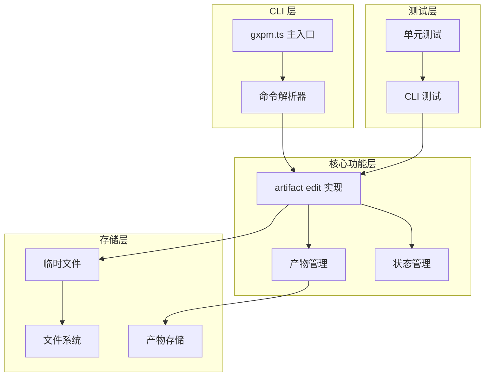
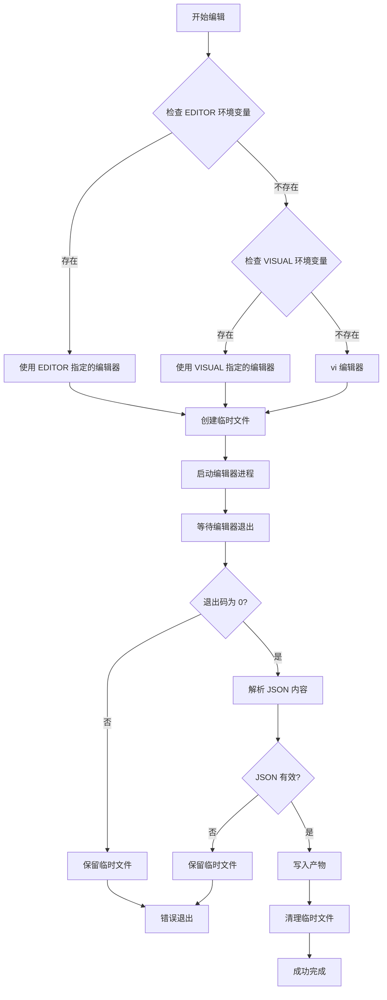
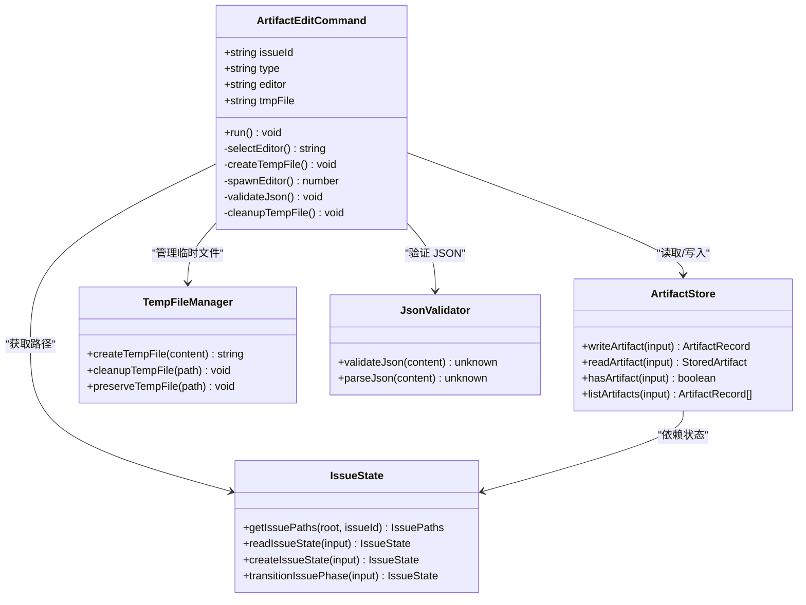
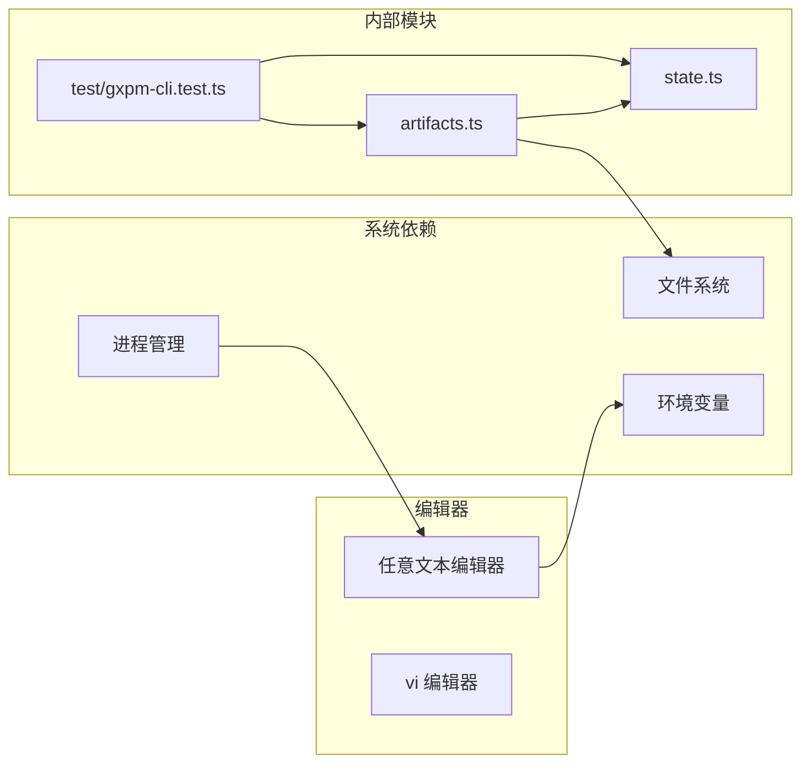

# artifact edit 编辑工具

<cite>
**本文档引用的文件**
- [scripts/gxpm.ts](file://scripts/gxpm.ts)
- [core/artifacts.ts](file://core/artifacts.ts)
- [test/gxpm-cli.test.ts](file://test/gxpm-cli.test.ts)
- [core/state.ts](file://core/state.ts)
- [core/phase-gates.ts](file://core/phase-gates.ts)
- [scripts/phase-artifact-commands.ts](file://scripts/phase-artifact-commands.ts)
</cite>

## 目录
1. [简介](#简介)
2. [项目结构](#项目结构)
3. [核心组件](#核心组件)
4. [架构概览](#架构概览)
5. [详细组件分析](#详细组件分析)
6. [依赖关系分析](#依赖关系分析)
7. [性能考虑](#性能考虑)
8. [故障排除指南](#故障排除指南)
9. [结论](#结论)

## 简介

artifact edit 命令是 gxpm 工具链中的一个核心功能，允许用户使用系统默认编辑器来编辑和修改问题（issue）相关的产物（artifact）。该命令提供了直观的交互式编辑体验，支持多种编辑器配置，并具备完善的错误处理和临时文件管理机制。

该工具特别适用于需要手动调整复杂 JSON 结构的问题产物，如验收合同、实施计划、验收检查等关键文档。通过集成系统默认编辑器，用户可以利用熟悉的编辑环境进行精确的内容修改。

## 项目结构

artifact edit 功能在项目中的组织结构如下：



**图表来源**
- [scripts/gxpm.ts:453-495](file://scripts/gxpm.ts#L453-L495)
- [core/artifacts.ts:57-91](file://core/artifacts.ts#L57-L91)
- [test/gxpm-cli.test.ts:216-278](file://test/gxpm-cli.test.ts#L216-L278)

**章节来源**
- [scripts/gxpm.ts:453-495](file://scripts/gxpm.ts#L453-L495)
- [core/artifacts.ts:1-169](file://core/artifacts.ts#L1-L169)
- [test/gxpm-cli.test.ts:216-278](file://test/gxpm-cli.test.ts#L216-L278)

## 核心组件

### 编辑器选择机制

artifact edit 命令实现了智能的编辑器选择策略：



**图表来源**
- [scripts/gxpm.ts:453-495](file://scripts/gxpm.ts#L453-L495)

### 临时文件处理

系统采用安全的临时文件管理策略：

- **文件命名规则**: `/tmp/gxpm-edit-{issueId}-{type}-{timestamp}.json`
- **自动清理**: 成功写入后自动删除临时文件
- **错误保留**: 编辑器或 JSON 解析失败时保留临时文件便于调试
- **路径固定**: 使用系统临时目录确保跨平台兼容性

### JSON 验证流程

JSON 验证采用两阶段检查机制：

1. **编辑器阶段**: 确保编辑器正常启动和退出
2. **解析阶段**: 验证 JSON 格式的正确性和完整性

**章节来源**
- [scripts/gxpm.ts:453-495](file://scripts/gxpm.ts#L453-L495)

## 架构概览

artifact edit 命令的完整架构设计如下：



**图表来源**
- [scripts/gxpm.ts:453-495](file://scripts/gxpm.ts#L453-L495)
- [core/artifacts.ts:57-125](file://core/artifacts.ts#L57-L125)
- [core/state.ts:70-85](file://core/state.ts#L70-L85)

## 详细组件分析

### 编辑器配置与选择

#### 环境变量优先级

编辑器选择遵循严格的优先级顺序：

1. **EDITOR 环境变量** - 最高优先级
2. **VISUAL 环境变量** - 次优先级  
3. **系统默认** - vi 编辑器

这种设计确保了用户可以灵活地指定编辑器，同时保持向后兼容性。

#### 编辑器行为模式

系统支持两种主要的编辑器行为模式：

1. **无操作模式** (`EDITOR=true`)
   - 编辑器直接退出（退出码 0）
   - 不修改任何内容
   - 保留原始草稿内容

2. **内容替换模式**
   - 编辑器保存修改后的 JSON
   - 替换原有的产物内容
   - 更新到最新版本

**章节来源**
- [scripts/gxpm.ts:453-495](file://scripts/gxpm.ts#L453-L495)
- [test/gxpm-cli.test.ts:216-236](file://test/gxpm-cli.test.ts#L216-L236)

### 临时文件生命周期管理

#### 创建阶段

临时文件创建时会：
- 生成唯一的文件名（包含时间戳）
- 写入初始内容（现有产物的 JSON 或空对象）
- 设置适当的文件权限

#### 执行阶段

编辑器执行期间：
- 继承标准输入输出流
- 支持交互式编辑
- 记录编辑器的退出状态

#### 清理阶段

清理策略分为：
- **成功路径**: 自动删除临时文件
- **失败路径**: 保留临时文件用于调试

**章节来源**
- [scripts/gxpm.ts:462-494](file://scripts/gxpm.ts#L462-L494)

### JSON 验证与错误处理

#### 验证流程

JSON 验证采用严格的标准：

1. **语法验证**: 确保 JSON 格式正确
2. **类型验证**: 验证数据结构的有效性
3. **完整性检查**: 确保所有必需字段存在

#### 错误恢复机制

系统提供多层次的错误恢复：

1. **编辑器错误**: 保留临时文件并提供调试信息
2. **JSON 解析错误**: 保留原始编辑内容
3. **文件系统错误**: 尽力清理但不中断程序

**章节来源**
- [scripts/gxpm.ts:477-487](file://scripts/gxpm.ts#L477-L487)
- [test/gxpm-cli.test.ts:260-277](file://test/gxpm-cli.test.ts#L260-L277)

### 产物管理集成

#### 读取现有产物

当目标产物已存在时：
- 读取现有的 JSON 内容
- 格式化为可编辑的格式
- 提供给编辑器进行修改

#### 写入更新内容

更新过程包括：
- 验证 JSON 的有效性
- 写入到产物存储
- 更新索引文件
- 记录事件日志

**章节来源**
- [core/artifacts.ts:57-91](file://core/artifacts.ts#L57-L91)
- [core/artifacts.ts:93-104](file://core/artifacts.ts#L93-L104)

## 依赖关系分析

### 外部依赖

artifact edit 命令依赖以下外部组件：



**图表来源**
- [scripts/gxpm.ts:453-495](file://scripts/gxpm.ts#L453-L495)
- [core/artifacts.ts:57-91](file://core/artifacts.ts#L57-L91)
- [test/gxpm-cli.test.ts:216-278](file://test/gxpm-cli.test.ts#L216-L278)

### 内部耦合关系

各组件之间的依赖关系：

- **主入口** ↔ **编辑器实现**: 单向依赖
- **编辑器实现** ↔ **产物存储**: 双向依赖
- **产物存储** ↔ **状态管理**: 单向依赖
- **测试模块** ↔ **所有组件**: 广泛依赖

**章节来源**
- [scripts/gxpm.ts:12-12](file://scripts/gxpm.ts#L12-L12)
- [core/artifacts.ts:1-8](file://core/artifacts.ts#L1-L8)

## 性能考虑

### 时间复杂度分析

- **编辑器启动**: O(1) - 启动外部进程
- **文件读取**: O(n) - n 为 JSON 内容大小
- **JSON 解析**: O(n) - n 为 JSON 内容大小
- **文件写入**: O(n) - n 为 JSON 内容大小

### 空间复杂度分析

- **内存使用**: O(n) - 存储 JSON 内容
- **磁盘使用**: O(n) - 临时文件和最终产物
- **并发处理**: 支持多实例同时运行

### 优化建议

1. **大文件处理**: 对于大型 JSON 文件，考虑分块处理
2. **缓存机制**: 缓存最近使用的编辑器配置
3. **异步操作**: 异步处理文件系统操作以提高响应性

## 故障排除指南

### 常见问题及解决方案

#### 编辑器无法启动

**症状**: 编辑器进程立即退出或无法找到

**诊断步骤**:
1. 检查 EDITOR 和 VISUAL 环境变量
2. 验证编辑器路径的可执行权限
3. 确认编辑器在当前环境中可用

**解决方案**:
```bash
# 设置 EDITOR 环境变量
export EDITOR=nano
# 或者
export EDITOR=vim
```

#### JSON 格式错误

**症状**: 编辑器退出但出现 JSON 验证错误

**诊断步骤**:
1. 检查临时文件内容
2. 验证 JSON 语法
3. 确认数据类型正确

**解决方案**:
- 修复 JSON 语法错误
- 使用在线 JSON 验证工具
- 检查特殊字符转义

#### 权限问题

**症状**: 无法写入临时文件或产物

**诊断步骤**:
1. 检查临时目录权限
2. 验证目标文件夹写入权限
3. 确认磁盘空间充足

**解决方案**:
```bash
# 检查权限
ls -la /tmp | grep gxpm
# 修复权限
chmod 755 /tmp
```

### 调试指导

#### 启用详细日志

添加调试标志来获取更多信息：
```bash
# 在编辑器中启用调试模式
DEBUG=1 gxpm artifact edit ISSUE-ID ARTIFACT-TYPE
```

#### 临时文件保留

系统会在错误情况下保留临时文件：
- 位置: `/tmp/gxpm-edit-{issueId}-{type}-{timestamp}.json`
- 包含: 编辑器保存的最终内容
- 用途: 便于手动检查和调试

#### 环境变量检查

验证关键环境变量：
```bash
echo "EDITOR: $EDITOR"
echo "VISUAL: $VISUAL"
echo "PATH: $PATH"
```

**章节来源**
- [scripts/gxpm.ts:472-486](file://scripts/gxpm.ts#L472-L486)
- [test/gxpm-cli.test.ts:260-277](file://test/gxpm-cli.test.ts#L260-L277)

## 结论

artifact edit 命令为 gxpm 工具链提供了强大而灵活的产物编辑能力。通过智能的编辑器选择机制、完善的临时文件管理和严格的 JSON 验证流程，该功能确保了用户能够安全、高效地编辑各种类型的问题产物。

### 主要优势

1. **用户友好**: 集成系统默认编辑器，降低学习成本
2. **可靠性强**: 完善的错误处理和恢复机制
3. **灵活性高**: 支持多种编辑器配置和工作流程
4. **安全性好**: 临时文件管理确保数据安全

### 最佳实践

1. **编辑器选择**: 根据个人偏好设置合适的 EDITOR 环境变量
2. **备份策略**: 在重要修改前备份现有产物
3. **格式验证**: 使用在线工具验证复杂的 JSON 结构
4. **权限管理**: 确保适当的文件系统权限

该工具为开发团队提供了一个标准化的问题产物管理解决方案，有助于提高工作效率和质量控制水平。