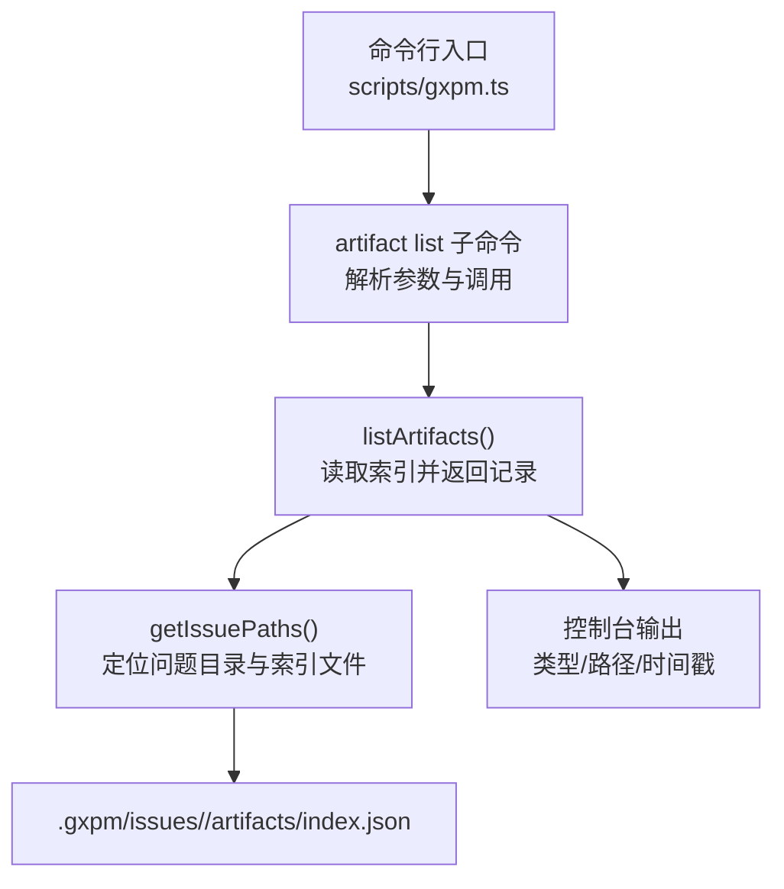
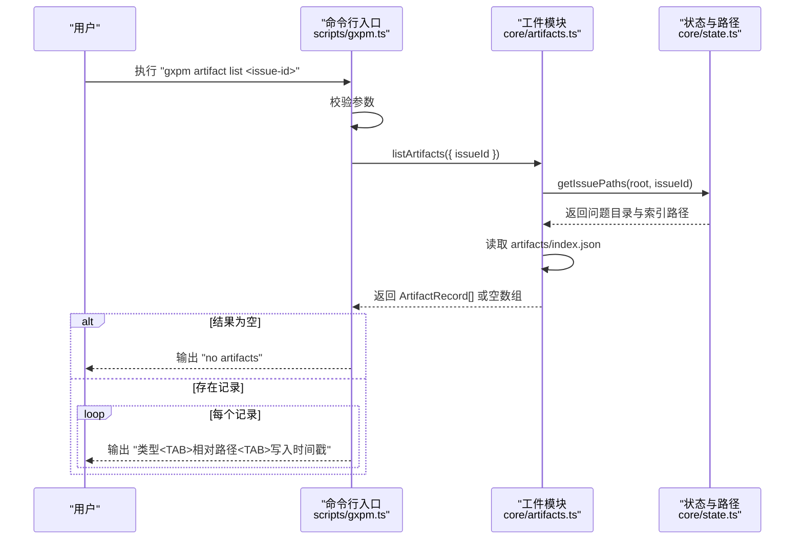
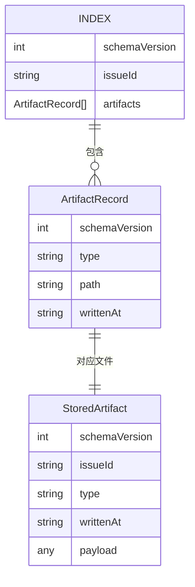
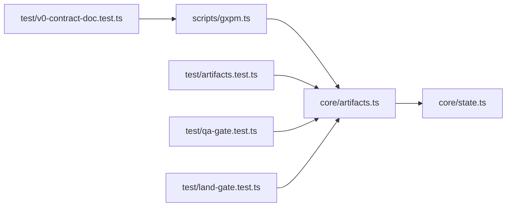

# 工件列表查看

<cite>
**本文档引用的文件**
- [scripts/gxpm.ts](file://scripts/gxpm.ts)
- [core/artifacts.ts](file://core/artifacts.ts)
- [core/state.ts](file://core/state.ts)
- [test/artifacts.test.ts](file://test/artifacts.test.ts)
- [test/qa-gate.test.ts](file://test/qa-gate.test.ts)
- [test/land-gate.test.ts](file://test/land-gate.test.ts)
- [test/v0-contract-doc.test.ts](file://test/v0-contract-doc.test.ts)
- [core/phase-artifact.ts](file://core/phase-artifact.ts)
- [scripts/phase-artifact-commands.ts](file://scripts/phase-artifact-commands.ts)
- [core/phase-gates.ts](file://core/phase-gates.ts)
</cite>

## 目录
1. [简介](#简介)
2. [项目结构](#项目结构)
3. [核心组件](#核心组件)
4. [架构总览](#架构总览)
5. [详细组件分析](#详细组件分析)
6. [依赖关系分析](#依赖关系分析)
7. [性能考量](#性能考量)
8. [故障排除指南](#故障排除指南)
9. [结论](#结论)
10. [附录](#附录)

## 简介
本文件面向使用者与维护者，系统性说明 artifact list 命令的功能、语法、参数、输出格式与行为边界，并结合仓库中的实现与测试用例，给出可操作的使用示例与排障建议。该命令用于列出指定 issue-id 下已写入的所有工件摘要，便于快速了解某议题在生命周期中产生的各类产物。

## 项目结构
围绕 artifact list 的关键文件与职责如下：
- 命令入口与分发：scripts/gxpm.ts
- 工件存储与索引：core/artifacts.ts
- 问题状态与目录结构：core/state.ts
- 行为验证与示例：test/artifacts.test.ts、test/qa-gate.test.ts、test/land-gate.test.ts、test/v0-contract-doc.test.ts
- 阶段工件初始化器：core/phase-artifact.ts、scripts/phase-artifact-commands.ts
- 阶段门规则与工件类型：core/phase-gates.ts

图表来源
- [scripts/gxpm.ts:203-216](file://scripts/gxpm.ts#L203-L216)
- [core/artifacts.ts:106-118](file://core/artifacts.ts#L106-L118)
- [core/state.ts:70-84](file://core/state.ts#L70-L84)

章节来源
- [scripts/gxpm.ts:203-216](file://scripts/gxpm.ts#L203-L216)
- [core/artifacts.ts:106-118](file://core/artifacts.ts#L106-L118)
- [core/state.ts:70-84](file://core/state.ts#L70-L84)

## 核心组件
- 命令定义与参数校验
  - artifact list <issue-id>：必需参数为议题 ID；若缺失则抛出用法错误。
- 数据读取与输出
  - 调用 listArtifacts 获取工件记录数组；
  - 若为空，输出“no artifacts”；
  - 否则逐条输出三列：类型、相对路径、写入时间戳（ISO 8601）。
- 工件记录结构
  - 类型：字符串，限定于预定义的工件类型集合；
  - 相对路径：指向问题目录下 artifacts/<type>.json；
  - 写入时间戳：ISO 8601 字符串。

章节来源
- [scripts/gxpm.ts:203-216](file://scripts/gxpm.ts#L203-L216)
- [core/artifacts.ts:28-33](file://core/artifacts.ts#L28-L33)
- [core/artifacts.ts:106-118](file://core/artifacts.ts#L106-L118)

## 架构总览
artifact list 的执行流程由命令入口分发到工件模块，最终通过标准输出打印结果。其数据来源是每个议题下的工件索引文件，该索引由写入工件时自动维护。

图表来源
- [scripts/gxpm.ts:203-216](file://scripts/gxpm.ts#L203-L216)
- [core/artifacts.ts:106-118](file://core/artifacts.ts#L106-L118)
- [core/state.ts:70-84](file://core/state.ts#L70-L84)

## 详细组件分析

### 命令语法与参数
- 语法
  - gxpm artifact list <issue-id>
- 参数说明
  - <issue-id>：必填。目标议题的标识符。
- 错误场景
  - 缺少 <issue-id>：抛出用法错误提示。
  - 议题不存在或未初始化：listArtifacts 会抛出“索引未找到”的错误。
  - 工件类型非法：写入阶段会抛出“无效工件类型”的错误（与 list 无直接关系，但影响可用工件集合）。

章节来源
- [scripts/gxpm.ts:203-216](file://scripts/gxpm.ts#L203-L216)
- [core/artifacts.ts:110-112](file://core/artifacts.ts#L110-L112)
- [core/artifacts.ts:163-168](file://core/artifacts.ts#L163-L168)

### 输出格式与显示结构
- 输出行数
  - 若无任何工件：仅一行“no artifacts”。
  - 若存在工件：每行三列，以制表符分隔。
- 列定义
  - 第一列：工件类型（artifact type）
  - 第二列：相对路径（artifact path），形如 artifacts/<type>.json
  - 第三列：写入时间戳（writtenAt），ISO 8601 格式
- 排版与顺序
  - 仓库实现按类型进行排序后输出，确保输出稳定有序。

章节来源
- [scripts/gxpm.ts:207-215](file://scripts/gxpm.ts#L207-L215)
- [core/artifacts.ts:142-146](file://core/artifacts.ts#L142-L146)

### 实际命令示例与输出示例
- 正常情况（存在多个工件）
  - 示例命令
    - gxpm artifact list GXPM-123
  - 预期输出要点
    - 多行，每行包含“类型<TAB>相对路径<TAB>时间戳”
    - 输出按类型排序
  - 参考测试用例
    - QA 阶段测试中展示了列出 verify-findings 与 qa-findings 的行为
    - 土地阶段测试中展示了列出 qa-findings 与 land-findings 的行为
- 空列表情况
  - 示例命令
    - gxpm artifact list GXPM-20
  - 预期输出
    - 仅一行：“no artifacts”
  - 参考测试用例
    - artifacts.test 中对空索引的断言

章节来源
- [test/qa-gate.test.ts:76-79](file://test/qa-gate.test.ts#L76-L79)
- [test/land-gate.test.ts:76-79](file://test/land-gate.test.ts#L76-L79)
- [test/artifacts.test.ts:30-32](file://test/artifacts.test.ts#L30-L32)

### 数据模型与索引结构
- 工件记录（ArtifactRecord）
  - 字段：schemaVersion、type、path、writtenAt
- 工件索引（index.json）
  - 结构：包含 artifacts 数组，元素为 ArtifactRecord
- 目录布局
  - 每个议题的工件索引位于 .gxpm/issues/<issue-id>/artifacts/index.json
  - 具体工件内容位于 .gxpm/issues/<issue-id>/artifacts/<type>.json

图表来源
- [core/artifacts.ts:28-41](file://core/artifacts.ts#L28-L41)
- [core/artifacts.ts:127-140](file://core/artifacts.ts#L127-L140)
- [core/state.ts:70-84](file://core/state.ts#L70-L84)

章节来源
- [core/artifacts.ts:28-41](file://core/artifacts.ts#L28-L41)
- [core/artifacts.ts:127-140](file://core/artifacts.ts#L127-L140)
- [core/state.ts:70-84](file://core/state.ts#L70-L84)

### 阶段工件与命令映射
- 阶段门要求的工件类型
  - 例如：verify → qa 需要 qa-findings；verify → land 需要 land-findings
- CLI 命令与工件类型的映射
  - 通过 PHASE_ARTIFACT_COMMANDS 将阶段命令与工件初始化器绑定
  - artifact list 仅读取现有工件，不参与初始化
- 参考
  - 阶段门规则与工件类型定义
  - 阶段工件命令注册与查找逻辑

章节来源
- [core/phase-gates.ts:101-117](file://core/phase-gates.ts#L101-L117)
- [scripts/phase-artifact-commands.ts:22-76](file://scripts/phase-artifact-commands.ts#L22-L76)
- [core/phase-artifact.ts:16-31](file://core/phase-artifact.ts#L16-L31)

## 依赖关系分析
- 命令入口依赖工件模块
  - scripts/gxpm.ts 在 artifact list 分支中直接调用 listArtifacts
- 工件模块依赖状态模块
  - listArtifacts 使用 getIssuePaths 解析议题目录与索引路径
- 测试覆盖
  - 对 listArtifacts 的行为、空列表与类型排序进行了验证
  - 对阶段工件命令与 artifact list 的组合使用进行了端到端验证

图表来源
- [scripts/gxpm.ts:203-216](file://scripts/gxpm.ts#L203-L216)
- [core/artifacts.ts:106-118](file://core/artifacts.ts#L106-L118)
- [core/state.ts:70-84](file://core/state.ts#L70-L84)
- [test/artifacts.test.ts:12-49](file://test/artifacts.test.ts#L12-L49)
- [test/qa-gate.test.ts:72-89](file://test/qa-gate.test.ts#L72-L89)
- [test/land-gate.test.ts:72-89](file://test/land-gate.test.ts#L72-L89)
- [test/v0-contract-doc.test.ts:29-40](file://test/v0-contract-doc.test.ts#L29-L40)

章节来源
- [scripts/gxpm.ts:203-216](file://scripts/gxpm.ts#L203-L216)
- [core/artifacts.ts:106-118](file://core/artifacts.ts#L106-L118)
- [core/state.ts:70-84](file://core/state.ts#L70-L84)
- [test/artifacts.test.ts:12-49](file://test/artifacts.test.ts#L12-L49)
- [test/qa-gate.test.ts:72-89](file://test/qa-gate.test.ts#L72-L89)
- [test/land-gate.test.ts:72-89](file://test/land-gate.test.ts#L72-L89)
- [test/v0-contract-doc.test.ts:29-40](file://test/v0-contract-doc.test.ts#L29-L40)

## 性能考量
- 时间复杂度
  - listArtifacts 仅读取并解析 artifacts/index.json，整体为 O(n)（n 为索引中工件数量）
- I/O 特征
  - 单次文件读取，I/O 成本主要取决于磁盘性能与文件大小
- 输出开销
  - 控制台输出为线性遍历，成本与工件数量成正比

## 故障排除指南
- 报错：索引未找到
  - 现象：命令抛出“索引未找到”的错误
  - 原因：议题尚未初始化或目录结构异常
  - 处理：先执行议题创建或检查 .gxpm/issues/<issue-id> 目录是否存在
- 报错：用法错误（缺少 <issue-id>）
  - 现象：提示用法错误
  - 处理：补全议题 ID 参数
- 输出为空
  - 现象：输出“no artifacts”
  - 原因：议题存在但尚未写入任何工件
  - 处理：先通过相应阶段命令初始化并写入工件，再运行 artifact list
- 工件类型非法
  - 现象：写入阶段抛出“无效工件类型”
  - 处理：确认工件类型属于预定义集合，避免拼写错误

章节来源
- [scripts/gxpm.ts:204-210](file://scripts/gxpm.ts#L204-L210)
- [core/artifacts.ts:110-112](file://core/artifacts.ts#L110-L112)
- [core/artifacts.ts:163-168](file://core/artifacts.ts#L163-L168)

## 结论
artifact list 提供了对单个议题工件集合的快速概览，其输出简洁明确，便于自动化脚本与人工审阅。通过与阶段工件命令配合，用户可在议题生命周期中高效追踪各阶段产物。建议在 CI 或本地工作流中结合该命令进行工件状态检查与审计。

## 附录

### 常见使用场景
- 查看当前议题的全部工件
  - gxpm artifact list <issue-id>
- 结合阶段命令使用
  - 先执行阶段工件初始化命令，再运行 artifact list 校验
- 与历史命令联动
  - gxpm issue history <issue-id> 可查看事件时间线，辅助核对工件写入时间戳

章节来源
- [scripts/gxpm.ts:203-216](file://scripts/gxpm.ts#L203-L216)
- [core/artifacts.ts:148-161](file://core/artifacts.ts#L148-L161)