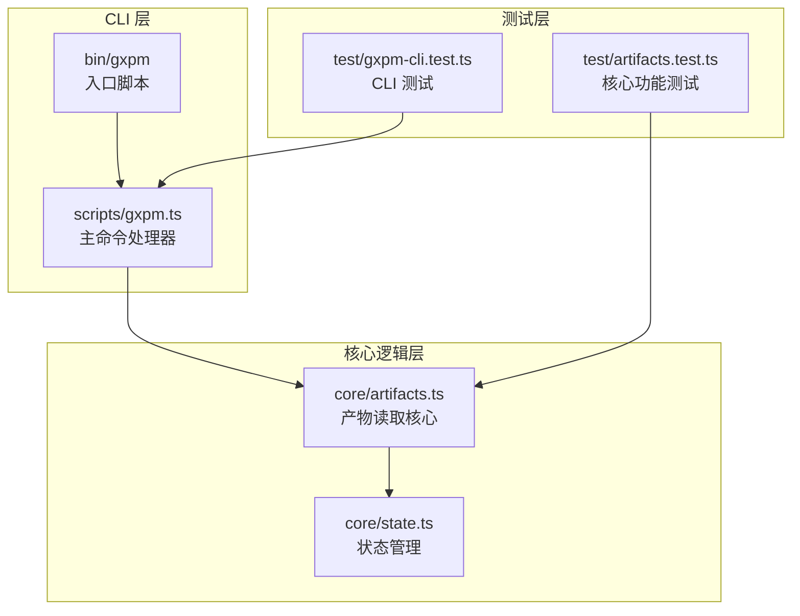
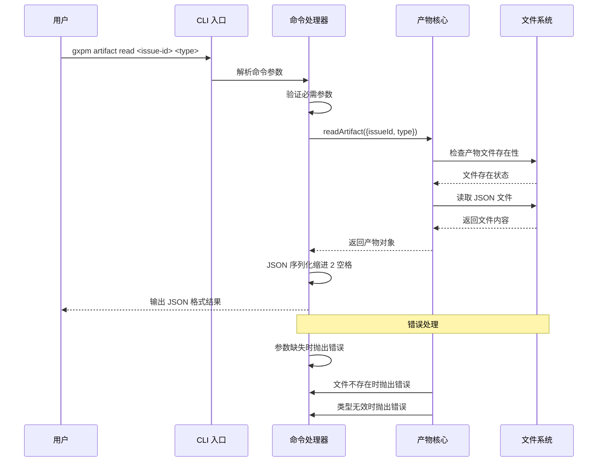
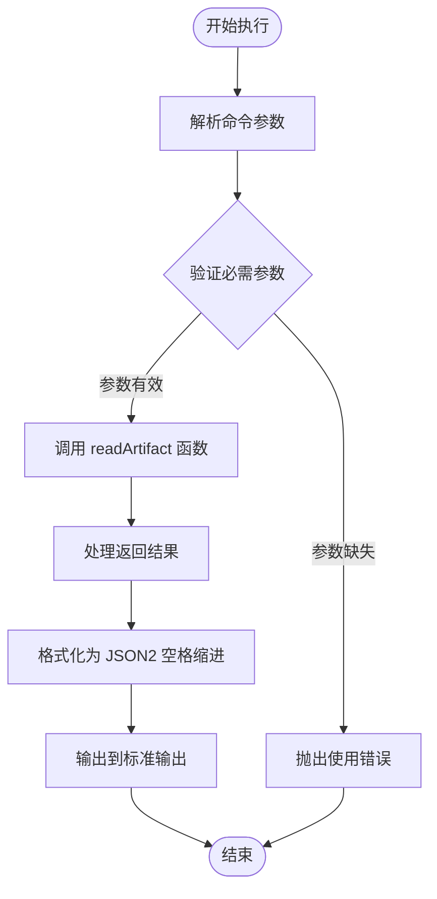
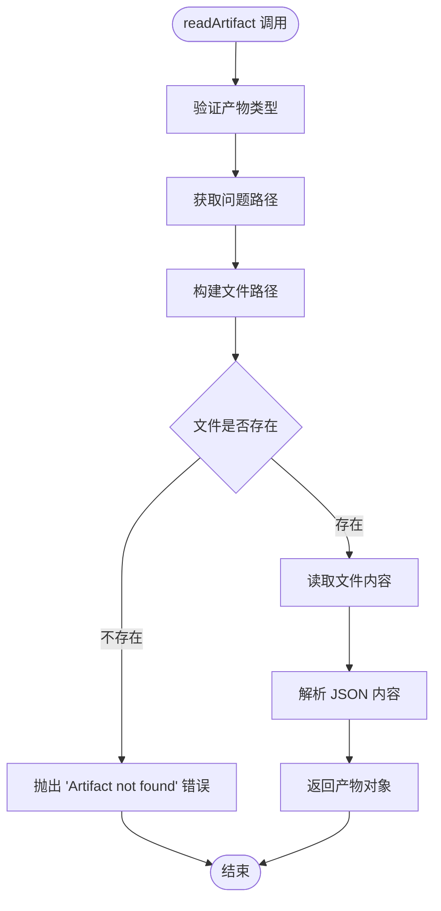
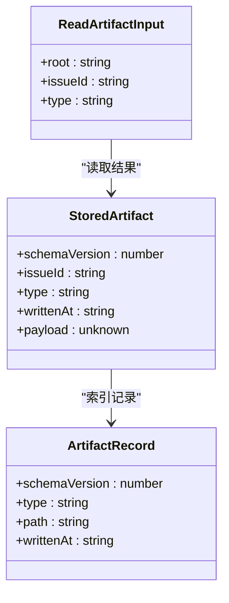
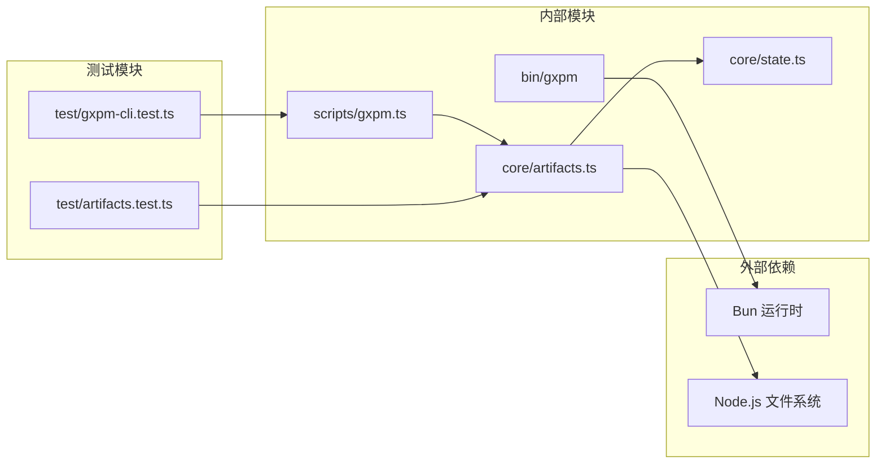
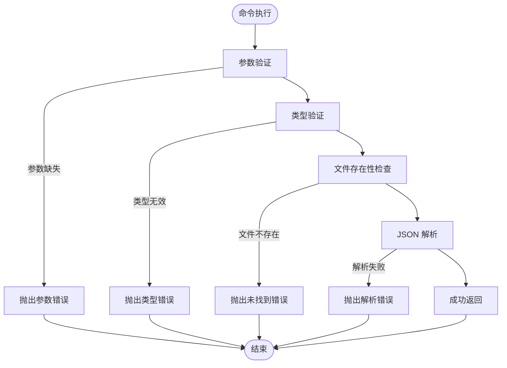

# artifact read 读取访问

<cite>
**本文档引用的文件**
- [artifacts.ts](file://core/artifacts.ts)
- [gxpm.ts](file://scripts/gxpm.ts)
- [gxpm-cli.test.ts](file://test/gxpm-cli.test.ts)
- [artifacts.test.ts](file://test/artifacts.test.ts)
- [phase-artifact-commands.ts](file://scripts/phase-artifact-commands.ts)
- [package.json](file://package.json)
- [bin/gxpm](file://bin/gxpm)
</cite>

## 目录
1. [简介](#简介)
2. [项目结构](#项目结构)
3. [核心组件](#核心组件)
4. [架构概览](#架构概览)
5. [详细组件分析](#详细组件分析)
6. [依赖关系分析](#依赖关系分析)
7. [性能考虑](#性能考虑)
8. [故障排除指南](#故障排除指南)
9. [结论](#结论)

## 简介

artifact read 命令是 gxpm 项目管理工具中的一个核心功能，用于读取和显示指定类型的产物（artifact）内容。该命令允许用户以 JSON 格式查看项目中特定问题（issue）的产物数据，支持多种产物类型，并提供完整的错误处理机制。

## 项目结构

gxpm 项目采用模块化架构设计，artifact read 功能主要涉及以下关键文件：



**图表来源**
- [bin/gxpm:1-18](file://bin/gxpm#L1-L18)
- [scripts/gxpm.ts:11-11](file://scripts/gxpm.ts#L11-L11)
- [core/artifacts.ts:1-8](file://core/artifacts.ts#L1-L8)

**章节来源**
- [package.json:1-25](file://package.json#L1-L25)
- [bin/gxpm:1-18](file://bin/gxpm#L1-L18)

## 核心组件

### 命令语法和参数

artifact read 命令的完整语法如下：
```
gxpm artifact read <issue-id> <type>
```

**必需参数：**
- `issue-id`: 问题标识符，格式为 `GXPM-XXXX`
- `type`: 产物类型，必须是预定义的受支持类型之一

**命令执行流程：**
1. 验证必需参数
2. 调用核心读取函数
3. 将结果以 JSON 格式输出到标准输出

### 支持的产物类型

系统支持以下 12 种产物类型：

| 类型名称 | 描述 |
|---------|------|
| `issue-intake` | 问题接收 |
| `triage-report` | 问题分类报告 |
| `acceptance-contract` | 接受契约 |
| `implementation-plan` | 实施计划 |
| `dispatch-handoff` | 派发交接 |
| `local-verify` | 本地验证 |
| `acceptance-check` | 接受检查 |
| `self-review` | 自我审查 |
| `ship-readiness` | 发运准备 |
| `pr-check` | PR 检查 |
| `verify-findings` | 验证发现 |
| `qa-findings` | 质量保证发现 |
| `land-findings` | 上线发现 |

**章节来源**
- [core/artifacts.ts:10-24](file://core/artifacts.ts#L10-L24)
- [scripts/gxpm.ts:218-224](file://scripts/gxpm.ts#L218-L224)

## 架构概览

artifact read 命令的完整执行流程如下：



**图表来源**
- [scripts/gxpm.ts:218-224](file://scripts/gxpm.ts#L218-L224)
- [core/artifacts.ts:93-104](file://core/artifacts.ts#L93-L104)

## 详细组件分析

### 命令处理器实现

命令处理器负责解析用户输入并调用相应的核心功能：



**图表来源**
- [scripts/gxpm.ts:218-224](file://scripts/gxpm.ts#L218-L224)

### 核心读取逻辑

核心读取函数实现了完整的文件操作和验证流程：



**图表来源**
- [core/artifacts.ts:93-104](file://core/artifacts.ts#L93-L104)
- [core/artifacts.ts:163-168](file://core/artifacts.ts#L163-L168)

### 数据结构定义

产物读取操作涉及以下核心数据结构：



**图表来源**
- [core/artifacts.ts:43-55](file://core/artifacts.ts#L43-L55)
- [core/artifacts.ts:35-41](file://core/artifacts.ts#L35-L41)
- [core/artifacts.ts:28-33](file://core/artifacts.ts#L28-L33)

**章节来源**
- [core/artifacts.ts:28-41](file://core/artifacts.ts#L28-L41)
- [scripts/gxpm.ts:218-224](file://scripts/gxpm.ts#L218-L224)

## 依赖关系分析

artifact read 命令的依赖关系图：



**图表来源**
- [bin/gxpm:17-17](file://bin/gxpm#L17-L17)
- [scripts/gxpm.ts:11-11](file://scripts/gxpm.ts#L11-L11)
- [core/artifacts.ts:1-8](file://core/artifacts.ts#L1-L8)

**章节来源**
- [scripts/gxpm.ts:11-11](file://scripts/gxpm.ts#L11-L11)
- [core/artifacts.ts:1-8](file://core/artifacts.ts#L1-L8)

## 性能考虑

artifact read 命令具有以下性能特征：

- **时间复杂度**: O(1) - 文件系统操作和 JSON 解析
- **空间复杂度**: O(n) - n 为产物文件大小
- **I/O 特性**: 单次文件读取操作
- **内存使用**: 与产物大小成正比

优化建议：
1. 对于大型产物文件，考虑分块读取策略
2. 实现缓存机制避免重复读取相同文件
3. 添加超时控制防止长时间阻塞

## 故障排除指南

### 常见错误及解决方案

| 错误类型 | 错误消息 | 可能原因 | 解决方案 |
|---------|---------|---------|---------|
| 参数错误 | "Usage: gxpm artifact read <issue-id> <type>" | 缺少必需参数 | 提供完整的 issue-id 和 type 参数 |
| 类型错误 | "Invalid artifact type: <type>" | 产物类型不在支持列表中 | 使用受支持的产物类型之一 |
| 文件不存在 | "Artifact not found: <type>" | 产物文件不存在 | 确认产物已被创建或检查问题 ID |
| 权限错误 | "Permission denied" | 文件权限不足 | 检查文件权限和目录访问权限 |
| JSON 解析错误 | "Unexpected token" | 文件内容不是有效 JSON | 验证文件完整性 |

### 错误处理机制

系统提供了多层次的错误处理：



**图表来源**
- [scripts/gxpm.ts:218-224](file://scripts/gxpm.ts#L218-L224)
- [core/artifacts.ts:93-104](file://core/artifacts.ts#L93-L104)
- [core/artifacts.ts:163-168](file://core/artifacts.ts#L163-L168)

**章节来源**
- [scripts/gxpm.ts:218-224](file://scripts/gxpm.ts#L218-L224)
- [core/artifacts.ts:93-104](file://core/artifacts.ts#L93-L104)

## 结论

artifact read 命令为 gxpm 项目管理工具提供了简洁而强大的产物读取功能。通过标准化的 JSON 输出格式和完善的错误处理机制，用户可以轻松地访问和调试项目中的各种产物数据。

该命令的主要优势包括：
- **简单易用**: 直观的命令语法和清晰的输出格式
- **可靠性**: 完整的参数验证和错误处理
- **一致性**: 标准化的 JSON 输出格式
- **可扩展性**: 支持多种产物类型和未来扩展

对于开发者而言，该命令不仅是一个实用的工具，也是理解 gxpm 项目管理流程的重要入口点。