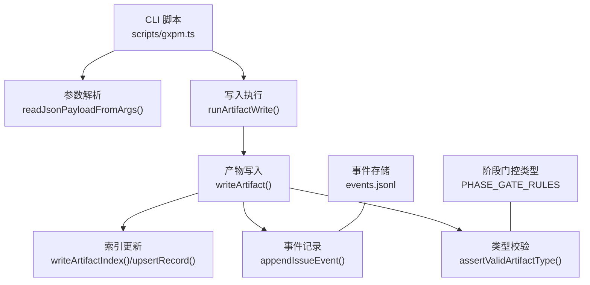
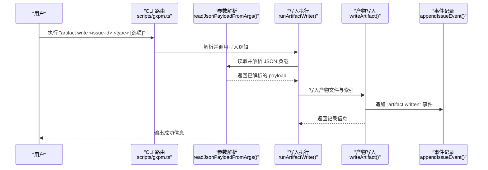
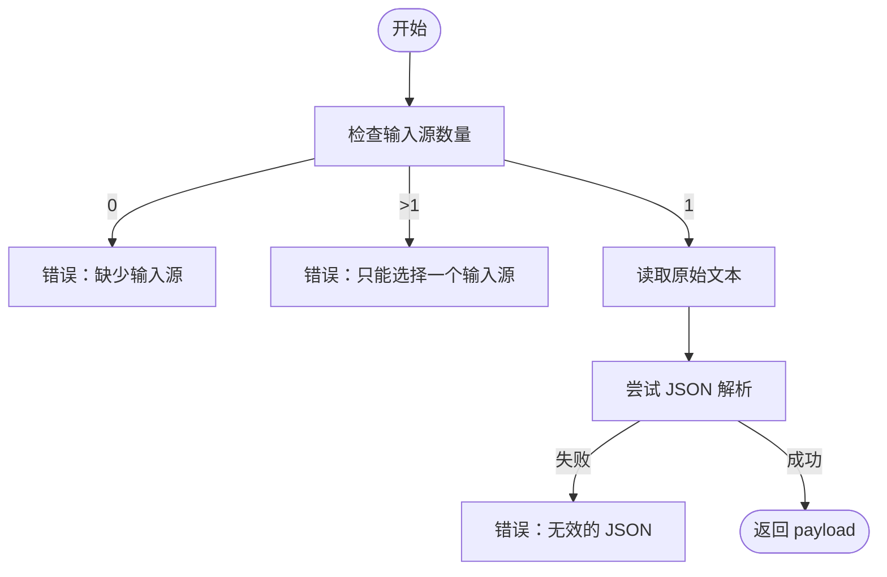
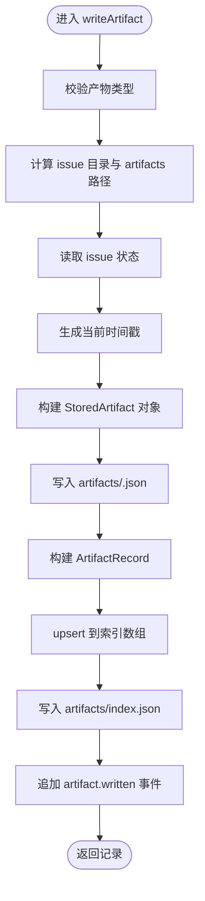
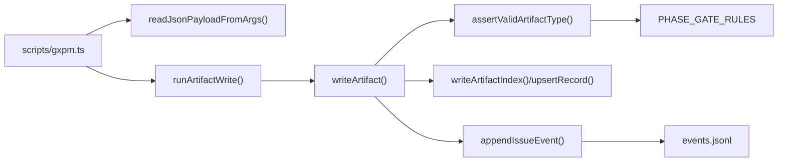

# artifact write 写入编辑

<cite>
**本文档引用的文件**
- [scripts/gxpm.ts](file://scripts/gxpm.ts)
- [core/artifacts.ts](file://core/artifacts.ts)
- [core/state.ts](file://core/state.ts)
- [core/phase-gates.ts](file://core/phase-gates.ts)
- [test/gxpm-cli.test.ts](file://test/gxpm-cli.test.ts)
- [test/artifacts.test.ts](file://test/artifacts.test.ts)
- [skills/gxpm/SKILL.md](file://skills/gxpm/SKILL.md)
</cite>

## 目录
1. [简介](#简介)
2. [项目结构](#项目结构)
3. [核心组件](#核心组件)
4. [架构总览](#架构总览)
5. [详细组件分析](#详细组件分析)
6. [依赖关系分析](#依赖关系分析)
7. [性能考量](#性能考量)
8. [故障排除指南](#故障排除指南)
9. [结论](#结论)
10. [附录](#附录)

## 简介
本文件面向使用者与维护者，系统性说明如何使用 `artifact write` 命令向指定 issue-id 写入新的产物（artifact）。内容涵盖：
- 三种输入方式：--json 参数、--from 文件、--stdin 标准输入
- 每种输入方式的语法、适用场景与注意事项
- 输入验证规则、错误处理策略与最佳实践
- 数据模型与事件记录机制
- 常见问题排查与建议

## 项目结构
围绕 artifact write 的相关代码分布在以下模块：
- CLI 入口与参数解析：scripts/gxpm.ts
- 产物读写与索引更新：core/artifacts.ts
- 事件记录与审计：core/state.ts
- 阶段门控与产物类型约束：core/phase-gates.ts
- 行为与用例验证：test/gxpm-cli.test.ts、test/artifacts.test.ts
- 使用示例与说明：skills/gxpm/SKILL.md

图表来源
- [scripts/gxpm.ts:497-534](file://scripts/gxpm.ts#L497-L534)
- [core/artifacts.ts:57-91](file://core/artifacts.ts#L57-L91)
- [core/state.ts:207-209](file://core/state.ts#L207-L209)
- [core/phase-gates.ts:32-99](file://core/phase-gates.ts#L32-L99)

章节来源
- [scripts/gxpm.ts:226-232](file://scripts/gxpm.ts#L226-L232)
- [core/artifacts.ts:10-26](file://core/artifacts.ts#L10-L26)
- [core/state.ts:70-85](file://core/state.ts#L70-L85)
- [core/phase-gates.ts:1-118](file://core/phase-gates.ts#L1-L118)

## 核心组件
- CLI 命令入口与路由
  - `artifact write` 子命令解析与调用
  - 参数校验与错误提示
- JSON 输入解析器
  - 支持 --json、--from、--stdin 三类输入
  - 单一输入源限制与错误处理
- 产物写入器
  - 类型校验、路径生成、索引更新、事件记录
- 事件系统
  - 将每次 artifact.written 记录到事件流，便于审计与回溯

章节来源
- [scripts/gxpm.ts:226-232](file://scripts/gxpm.ts#L226-L232)
- [scripts/gxpm.ts:503-534](file://scripts/gxpm.ts#L503-L534)
- [core/artifacts.ts:57-91](file://core/artifacts.ts#L57-L91)
- [core/state.ts:207-209](file://core/state.ts#L207-L209)

## 架构总览
artifact write 的端到端流程如下：

图表来源
- [scripts/gxpm.ts:226-232](file://scripts/gxpm.ts#L226-L232)
- [scripts/gxpm.ts:497-501](file://scripts/gxpm.ts#L497-L501)
- [scripts/gxpm.ts:503-534](file://scripts/gxpm.ts#L503-L534)
- [core/artifacts.ts:57-91](file://core/artifacts.ts#L57-L91)
- [core/state.ts:207-209](file://core/state.ts#L207-L209)

## 详细组件分析

### 命令行接口与路由
- 子命令定义
  - `artifact write <issue-id> <type> --json <json> | --from <file> | --stdin`
  - 必须提供 issue-id 与 type；type 必须是受支持的产物类型集合之一
- 错误提示
  - 缺少必要参数时抛出明确错误
  - 同时提供多个输入源或未提供任何输入源时抛错

章节来源
- [scripts/gxpm.ts:226-232](file://scripts/gxpm.ts#L226-L232)

### JSON 输入解析器
- 支持的输入方式
  - --json <json>：直接在命令行传入 JSON 字符串
  - --from <file>：从文件读取 JSON
  - --stdin：从标准输入读取 JSON
- 输入规则
  - 必须且仅能选择一种输入方式
  - 若 --from 缺少文件路径，将报错
  - 任意输入方式若 JSON 解析失败，将报错
- 失败场景
  - 未提供任何输入源
  - 提供了多个输入源
  - JSON 格式不合法

图表来源
- [scripts/gxpm.ts:503-534](file://scripts/gxpm.ts#L503-L534)

章节来源
- [scripts/gxpm.ts:503-534](file://scripts/gxpm.ts#L503-L534)

### 产物写入器
- 类型校验
  - 仅允许受支持的产物类型集合
  - 不合法类型将被拒绝
- 文件落盘
  - 生成 artifacts/<type>.json
  - 写入包含 schemaVersion、issueId、type、writtenAt、payload 的结构化对象
- 索引更新
  - 更新 artifacts/index.json，按类型去重并排序
- 事件记录
  - 追加一条 "artifact.written" 事件，包含 artifactType 与相对路径
- 返回值
  - 返回包含 schemaVersion、type、path、writtenAt 的记录对象

图表来源
- [core/artifacts.ts:57-91](file://core/artifacts.ts#L57-L91)
- [core/artifacts.ts:127-146](file://core/artifacts.ts#L127-L146)
- [core/artifacts.ts:148-161](file://core/artifacts.ts#L148-L161)

章节来源
- [core/artifacts.ts:57-91](file://core/artifacts.ts#L57-L91)
- [core/artifacts.ts:127-146](file://core/artifacts.ts#L127-L146)
- [core/artifacts.ts:148-161](file://core/artifacts.ts#L148-L161)

### 事件系统与审计
- 事件格式
  - 包含 schemaVersion、type、issueId、timestamp、payload
  - artifact.written 的 payload 包含 artifactType 与 path
- 存储位置
  - 每个 issue 的 events.jsonl 采用 JSON Lines 格式
- 审计用途
  - 可用于追踪产物写入历史、回溯变更

章节来源
- [core/state.ts:45-57](file://core/state.ts#L45-L57)
- [core/state.ts:207-209](file://core/state.ts#L207-L209)
- [core/artifacts.ts:148-161](file://core/artifacts.ts#L148-L161)

### 产物类型与阶段门控
- 受支持的产物类型集合
  - 通过常量数组定义，包含各阶段产物类型
- 阶段门控
  - 某些阶段转换要求特定产物存在
  - 产物类型与阶段门控命令存在一一映射关系

章节来源
- [core/artifacts.ts:10-26](file://core/artifacts.ts#L10-L26)
- [core/phase-gates.ts:32-99](file://core/phase-gates.ts#L32-L99)

## 依赖关系分析
- CLI 依赖参数解析器与写入器
- 写入器依赖类型校验、路径计算、索引更新与事件记录
- 事件记录依赖 issue 目录结构与事件文件

图表来源
- [scripts/gxpm.ts:497-534](file://scripts/gxpm.ts#L497-L534)
- [core/artifacts.ts:57-91](file://core/artifacts.ts#L57-L91)
- [core/artifacts.ts:163-168](file://core/artifacts.ts#L163-L168)
- [core/state.ts:207-209](file://core/state.ts#L207-L209)
- [core/phase-gates.ts:32-99](file://core/phase-gates.ts#L32-L99)

章节来源
- [scripts/gxpm.ts:497-534](file://scripts/gxpm.ts#L497-L534)
- [core/artifacts.ts:57-91](file://core/artifacts.ts#L57-L91)
- [core/state.ts:207-209](file://core/state.ts#L207-L209)
- [core/phase-gates.ts:32-99](file://core/phase-gates.ts#L32-L99)

## 性能考量
- I/O 模式
  - 产物写入与索引更新均为本地文件写操作，开销主要取决于 payload 大小与磁盘性能
- 并发与锁
  - 当前实现未显式加锁；在多进程并发写入同一 issue 的同类型产物时，后写入会覆盖先写入，建议避免并发写入
- 序列化成本
  - JSON 序列化与反序列化成本与 payload 复杂度成正比，建议保持 payload 结构简洁

## 故障排除指南
- 未提供任何输入源
  - 现象：命令立即报错，提示需要 --json/--from/--stdin 中的一种
  - 处理：选择并提供单一输入源
- 同时提供了多个输入源
  - 现象：报错，提示只能选择一个输入源
  - 处理：仅保留一种输入方式
- JSON 解析失败
  - 现象：报错，提示无效的 JSON
  - 处理：检查 JSON 语法与编码，确保为合法 JSON
- 产物类型非法
  - 现象：报错，提示无效的产物类型
  - 处理：确认 type 是否在受支持的类型集合内
- 未找到 issue 或状态异常
  - 现象：读取 issue 状态时报错
  - 处理：确认 issue 已创建且处于有效状态

章节来源
- [scripts/gxpm.ts:503-534](file://scripts/gxpm.ts#L503-L534)
- [core/artifacts.ts:163-168](file://core/artifacts.ts#L163-L168)
- [core/artifacts.ts:93-104](file://core/artifacts.ts#L93-L104)
- [test/gxpm-cli.test.ts:182-214](file://test/gxpm-cli.test.ts#L182-L214)

## 结论
artifact write 提供了三种灵活的输入方式，统一将 JSON 负载写入到指定 issue 的产物文件中，并自动维护索引与事件记录。通过严格的类型校验与错误处理，保证了数据一致性与可审计性。建议在自动化脚本中优先使用 --json 或 --from，在交互场景中结合 --stdin 以提升效率。

## 附录

### 三种输入方式详解与示例

- --json 参数
  - 语法：`gxpm artifact write <issue-id> <type> --json '<JSON>'`
  - 适用场景：脚本化、CI/CD、快速注入
  - 注意事项：需确保 JSON 字符串转义正确
  - 示例参考：[test/gxpm-cli.test.ts:155-164](file://test/gxpm-cli.test.ts#L155-L164)

- --from 文件
  - 语法：`gxpm artifact write <issue-id> <type> --from <file>`
  - 适用场景：从外部文件导入复杂 JSON
  - 注意事项：文件必须存在且可读
  - 示例参考：[test/gxpm-cli.test.ts:172-180](file://test/gxpm-cli.test.ts#L172-L180)

- --stdin 标准输入
  - 语法：`cat payload.json | gxpm artifact write <issue-id> <type> --stdin`
  - 适用场景：管道化处理、动态生成 JSON
  - 注意事项：确保输入为合法 JSON
  - 示例参考：[test/gxpm-cli.test.ts:198-204](file://test/gxpm-cli.test.ts#L198-L204)

### JSON 格式要求
- 顶层结构
  - 可为任意 JSON 对象或数组，无固定字段限制
  - 写入时会包裹为包含 schemaVersion、issueId、type、writtenAt、payload 的对象
- 字段说明
  - schemaVersion：版本号（固定为 1）
  - issueId：目标 issue 标识
  - type：产物类型（必须在受支持集合内）
  - writtenAt：写入时间（ISO 8601）
  - payload：用户提供的任意 JSON 结构
- 示例参考
  - 测试用例中 payload 的典型结构可参考：[test/gxpm-cli.test.ts:157](file://test/gxpm-cli.test.ts#L157)、[test/gxpm-cli.test.ts:170](file://test/gxpm-cli.test.ts#L170)

### 最佳实践
- 统一通过 CLI 写入产物，避免直接编辑内部 JSON 文件
- 在 CI/CD 中使用 --json 或 --from，减少交互依赖
- 使用 --stdin 时确保上游输出为合法 JSON
- 严格遵守产物类型集合，避免非法类型导致写入失败
- 审计与回溯：通过 events.jsonl 查看 artifact.written 事件

章节来源
- [skills/gxpm/SKILL.md:329-337](file://skills/gxpm/SKILL.md#L329-L337)
- [core/artifacts.ts:10-26](file://core/artifacts.ts#L10-L26)
- [core/state.ts:207-209](file://core/state.ts#L207-L209)