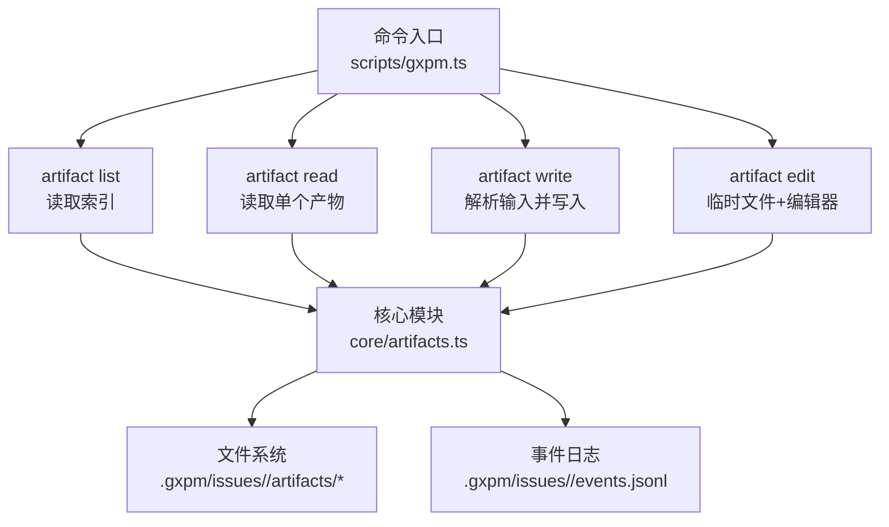
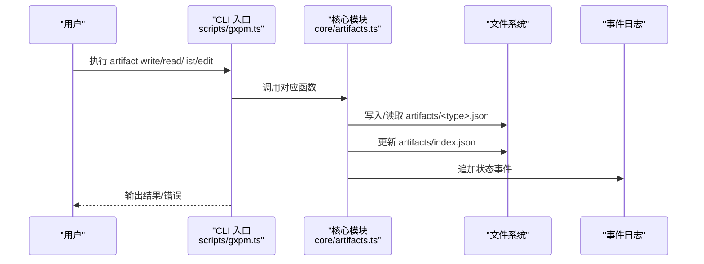
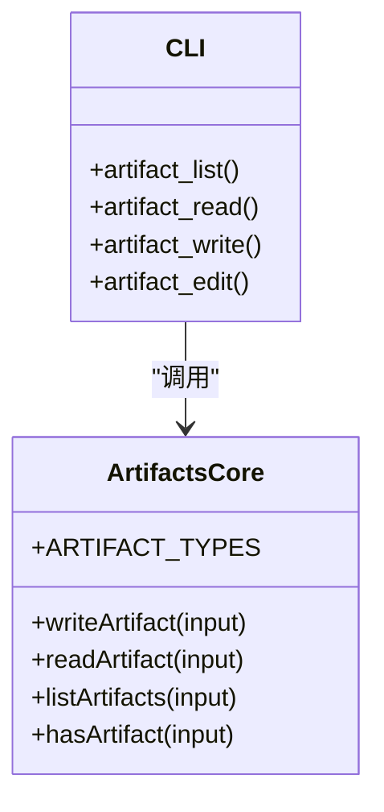

# 产物管理命令

<cite>
**本文引用的文件列表**
- [scripts/gxpm.ts](file://scripts/gxpm.ts)
- [core/artifacts.ts](file://core/artifacts.ts)
- [test/gxpm-cli.test.ts](file://test/gxpm-cli.test.ts)
- [test/artifacts.test.ts](file://test/artifacts.test.ts)
- [test/dispatch-gate.test.ts](file://test/dispatch-gate.test.ts)
- [test/qa-gate.test.ts](file://test/qa-gate.test.ts)
- [test/land-gate.test.ts](file://test/land-gate.test.ts)
- [scripts/phase-artifact-commands.ts](file://scripts/phase-artifact-commands.ts)
</cite>

## 目录
1. [简介](#简介)
2. [项目结构与定位](#项目结构与定位)
3. [核心组件](#核心组件)
4. [架构总览](#架构总览)
5. [详细组件分析](#详细组件分析)
6. [依赖关系分析](#依赖关系分析)
7. [性能与可靠性考量](#性能与可靠性考量)
8. [故障排查指南](#故障排查指南)
9. [结论](#结论)
10. [附录：命令速查与最佳实践](#附录命令速查与最佳实践)

## 简介
本文件系统性梳理产物（artifact）子命令组的功能与用法，覆盖以下命令：
- artifact list：列出指定问题下的所有产物清单
- artifact read：读取指定类型的产物内容
- artifact write：写入产物（支持从 JSON 字符串、文件或标准输入）
- artifact edit：在交互式编辑器中编辑产物 JSON

同时，文档解释产物的存储机制、JSON 格式要求与验证规则，并给出常见使用场景、输出示例与最佳实践建议。

## 项目结构与定位
产物管理命令位于 CLI 入口脚本中，通过命令分发逻辑调用核心模块完成具体操作；核心模块负责产物的读写、索引更新与事件记录。

图表来源
- [scripts/gxpm.ts:186-223](file://scripts/gxpm.ts#L186-L223)
- [core/artifacts.ts:106-125](file://core/artifacts.ts#L106-L125)

章节来源
- [scripts/gxpm.ts:186-223](file://scripts/gxpm.ts#L186-L223)
- [core/artifacts.ts:106-125](file://core/artifacts.ts#L106-L125)

## 核心组件
- 命令分发与参数解析：在 CLI 入口中根据子命令分派到对应处理函数
- 产物读写核心：封装了产物类型校验、文件写入、索引更新、事件记录等
- 产物类型集合：限定可用的产物类型，确保一致性与可追踪性

章节来源
- [scripts/gxpm.ts:186-223](file://scripts/gxpm.ts#L186-L223)
- [core/artifacts.ts:10-26](file://core/artifacts.ts#L10-L26)
- [core/artifacts.ts:57-91](file://core/artifacts.ts#L57-L91)
- [core/artifacts.ts:93-104](file://core/artifacts.ts#L93-L104)
- [core/artifacts.ts:106-118](file://core/artifacts.ts#L106-L118)

## 架构总览
产物管理命令围绕“索引 + 文件存储 + 事件记录”三要素构建，保证产物的可发现性、持久化与可审计性。

图表来源
- [scripts/gxpm.ts:186-223](file://scripts/gxpm.ts#L186-L223)
- [core/artifacts.ts:57-91](file://core/artifacts.ts#L57-L91)
- [core/artifacts.ts:93-104](file://core/artifacts.ts#L93-L104)
- [core/artifacts.ts:106-118](file://core/artifacts.ts#L106-L118)

## 详细组件分析

### artifact list
- 功能：列出指定问题下已存在的产物类型、路径与写入时间
- 语法：gxpm artifact list <issue-id>
- 参数：
  - issue-id：问题标识符（必填）
- 输入格式：无
- 输出：每行显示产物类型、相对路径、写入时间
- 错误：当问题不存在或索引文件缺失时抛出错误
- 使用示例（来自测试）：
  - 列出多个阶段产物类型，如 acceptance-contract、implementation-plan、dispatch-handoff 等

章节来源
- [scripts/gxpm.ts:186-199](file://scripts/gxpm.ts#L186-L199)
- [test/dispatch-gate.test.ts:77-81](file://test/dispatch-gate.test.ts#L77-L81)
- [test/qa-gate.test.ts:76-79](file://test/qa-gate.test.ts#L76-L79)
- [test/land-gate.test.ts:76-79](file://test/land-gate.test.ts#L76-L79)

### artifact read
- 功能：读取指定类型的产物 JSON 内容
- 语法：gxpm artifact read <issue-id> <type>
- 参数：
  - issue-id：问题标识符（必填）
  - type：产物类型（必填，必须为受支持的类型之一）
- 输入格式：无
- 输出：以缩进格式打印产物对象（包含 schemaVersion、issueId、type、writtenAt、payload 等字段）
- 错误：当产物不存在或类型非法时抛出错误
- 使用示例（来自测试）：
  - 读取 dispatch-handoff、qa-findings 等产物并验证内容

章节来源
- [scripts/gxpm.ts:201-207](file://scripts/gxpm.ts#L201-L207)
- [test/dispatch-gate.test.ts:83](file://test/dispatch-gate.test.ts#L83)
- [test/qa-gate.test.ts:81](file://test/qa-gate.test.ts#L81)
- [test/land-gate.test.ts:81](file://test/land-gate.test.ts#L81)

### artifact write
- 功能：向指定问题写入一个产物
- 语法：gxpm artifact write <issue-id> <type> --json <json> | --from <file> | --stdin
- 参数：
  - issue-id：问题标识符（必填）
  - type：产物类型（必填，必须为受支持的类型之一）
  - --json <json>：直接传入 JSON 字符串作为 payload
  - --from <file>：从文件读取 JSON 作为 payload
  - --stdin：从标准输入读取 JSON 作为 payload
  - 三者二选一，必须提供其一
- 输入格式：payload 必须是合法 JSON
- 输出：打印写入成功的记录（包含 schemaVersion、type、path、writtenAt）
- 错误：
  - 缺少输入源或多重输入冲突
  - JSON 解析失败
  - 产物类型不在允许列表内
- 使用示例（来自测试）：
  - 通过 --json 写入 acceptance-contract
  - 通过 --from 指定文件写入 triage-report
  - 验证非法类型与非法 JSON 的错误行为

章节来源
- [scripts/gxpm.ts:209-215](file://scripts/gxpm.ts#L209-L215)
- [scripts/gxpm.ts:434-471](file://scripts/gxpm.ts#L434-L471)
- [test/gxpm-cli.test.ts:150-214](file://test/gxpm-cli.test.ts#L150-L214)

### artifact edit
- 功能：在交互式编辑器中编辑产物 JSON
- 语法：gxpm artifact edit <issue-id> <type>
- 参数：
  - issue-id：问题标识符（必填）
  - type：产物类型（必填）
- 输入格式：无（使用临时文件承载当前 payload）
- 输出：成功后打印更新提示
- 行为细节：
  - 若产物存在，初始内容为该产物 payload 的 JSON 文本
  - 若产物不存在，初始内容为空对象
  - 编辑器由环境变量 EDITOR 或 VISUAL 决定，若未设置则默认 vi
  - 若编辑器返回非零退出码，会保留临时文件并报错
  - 保存后若 JSON 不合法，会报错并保留临时文件以便修复
  - 成功后写回产物并清理临时文件
- 使用示例（来自测试）：
  - 使用 EDITOR=true 模拟“不修改”场景，产物保持不变
  - 使用自定义编辑器替换内容并成功写回
  - 编辑器保存非法 JSON，报错并保留临时文件

章节来源
- [scripts/gxpm.ts:217-223](file://scripts/gxpm.ts#L217-L223)
- [scripts/gxpm.ts:390-432](file://scripts/gxpm.ts#L390-L432)
- [test/gxpm-cli.test.ts:216-278](file://test/gxpm-cli.test.ts#L216-L278)

## 依赖关系分析

图表来源
- [core/artifacts.ts:10-26](file://core/artifacts.ts#L10-L26)
- [core/artifacts.ts:57-125](file://core/artifacts.ts#L57-L125)
- [scripts/gxpm.ts:186-223](file://scripts/gxpm.ts#L186-L223)

章节来源
- [core/artifacts.ts:10-26](file://core/artifacts.ts#L10-L26)
- [core/artifacts.ts:57-125](file://core/artifacts.ts#L57-L125)
- [scripts/gxpm.ts:186-223](file://scripts/gxpm.ts#L186-L223)

## 性能与可靠性考量
- IO 模式：每次读写均涉及文件系统访问，建议批量操作时减少重复读取
- 并发安全：编辑器流程采用临时文件，避免并发写入冲突；但多进程同时编辑同一产物仍需谨慎
- 可靠性：写入前进行类型校验与 JSON 解析，失败即刻返回；索引与事件同步更新，便于回溯
- 大型 payload：建议通过 --from 指定文件，避免命令行长度限制与转义复杂度

[本节为通用指导，无需特定文件引用]

## 故障排查指南
- “无效产物类型”
  - 现象：写入或读取时报错，提示类型不在允许列表
  - 排查：确认 type 是否拼写正确且属于受支持类型集合
  - 参考：类型校验逻辑与允许列表
- “JSON 无效”
  - 现象：写入时报错，提示无效 JSON；或编辑器保存后报错
  - 排查：检查 JSON 结构、转义字符、编码格式；必要时使用 --from 指定文件
  - 参考：写入与编辑器流程中的 JSON 解析
- “产物不存在”
  - 现象：读取时报错，提示产物未找到
  - 排查：确认是否已写入；或检查 issue-id 是否正确
- “缺少输入源/多重输入冲突”
  - 现象：写入时报错，要求提供 --json/--from/--stdin 之一，或仅能选择其一
  - 排查：只使用一种输入方式，避免混用

章节来源
- [core/artifacts.ts:163-168](file://core/artifacts.ts#L163-L168)
- [scripts/gxpm.ts:434-471](file://scripts/gxpm.ts#L434-L471)
- [scripts/gxpm.ts:390-432](file://scripts/gxpm.ts#L390-L432)
- [test/gxpm-cli.test.ts:182-214](file://test/gxpm-cli.test.ts#L182-L214)

## 结论
产物管理命令提供了对问题生命周期中关键产物的统一管理能力：可枚举、可读取、可写入、可编辑。通过严格的类型校验与 JSON 解析，结合索引与事件记录，既保证了数据一致性，也提升了可观测性与可追溯性。建议在团队内统一产物类型与 payload 规范，配合编辑器与文件输入方式，形成高效可靠的产物维护流程。

[本节为总结性内容，无需特定文件引用]

## 附录：命令速查与最佳实践

### 命令速查
- 列出产物
  - 语法：gxpm artifact list <issue-id>
  - 示例：gxpm artifact list GXPM-123
- 读取产物
  - 语法：gxpm artifact read <issue-id> <type>
  - 示例：gxpm artifact read GXPM-123 acceptance-contract
- 写入产物
  - 语法：gxpm artifact write <issue-id> <type> --json <json> | --from <file> | --stdin
  - 示例：gxpm artifact write GXPM-123 acceptance-contract --json '{"criteria":[...]}'  
  - 示例：gxpm artifact write GXPM-123 triage-report --from ./payload.json
- 编辑产物
  - 语法：gxpm artifact edit <issue-id> <type>
  - 示例：gxpm artifact edit GXPM-123 issue-intake

章节来源
- [scripts/gxpm.ts:186-223](file://scripts/gxpm.ts#L186-L223)
- [scripts/gxpm.ts:434-471](file://scripts/gxpm.ts#L434-L471)
- [scripts/gxpm.ts:390-432](file://scripts/gxpm.ts#L390-L432)

### 最佳实践
- 统一产物类型：严格遵循受支持的类型集合，避免自定义类型导致后续工具链不兼容
- JSON 结构规范：约定 payload 字段命名与层级，便于自动化消费与展示
- 使用文件输入：大型或复杂 payload 建议使用 --from 指定文件，提升可维护性
- 编辑器策略：在 CI 环境中可通过环境变量控制编辑器行为，避免阻塞
- 版本与索引：留意 schemaVersion 与 artifacts/index.json 的更新，确保工具链兼容
- 事件审计：利用事件日志定位产物变更轨迹，便于问题复盘

章节来源
- [core/artifacts.ts:10-26](file://core/artifacts.ts#L10-L26)
- [core/artifacts.ts:57-91](file://core/artifacts.ts#L57-L91)
- [core/artifacts.ts:106-118](file://core/artifacts.ts#L106-L118)
- [scripts/gxpm.ts:390-432](file://scripts/gxpm.ts#L390-L432)