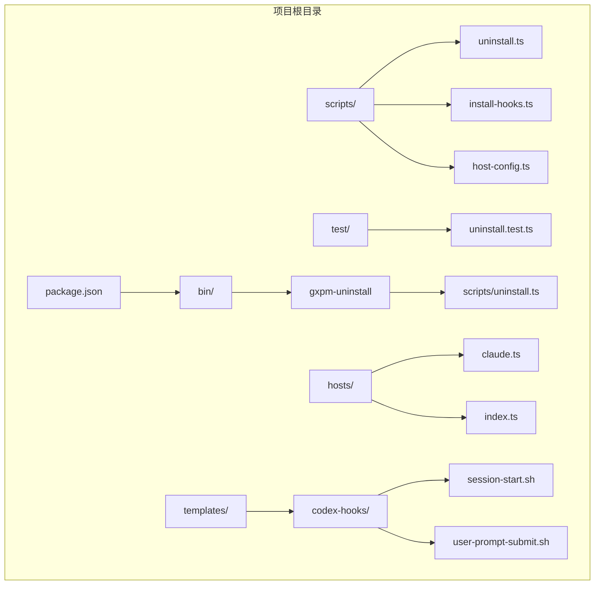
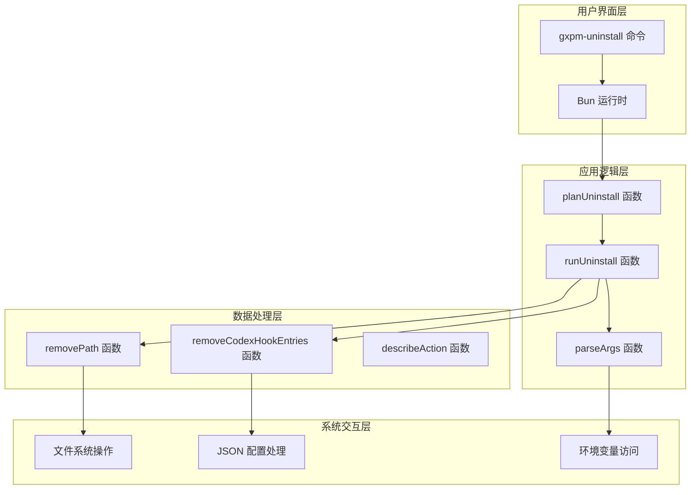
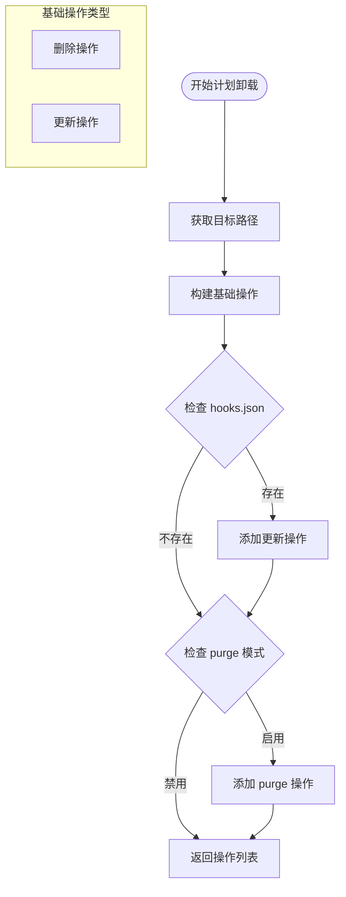
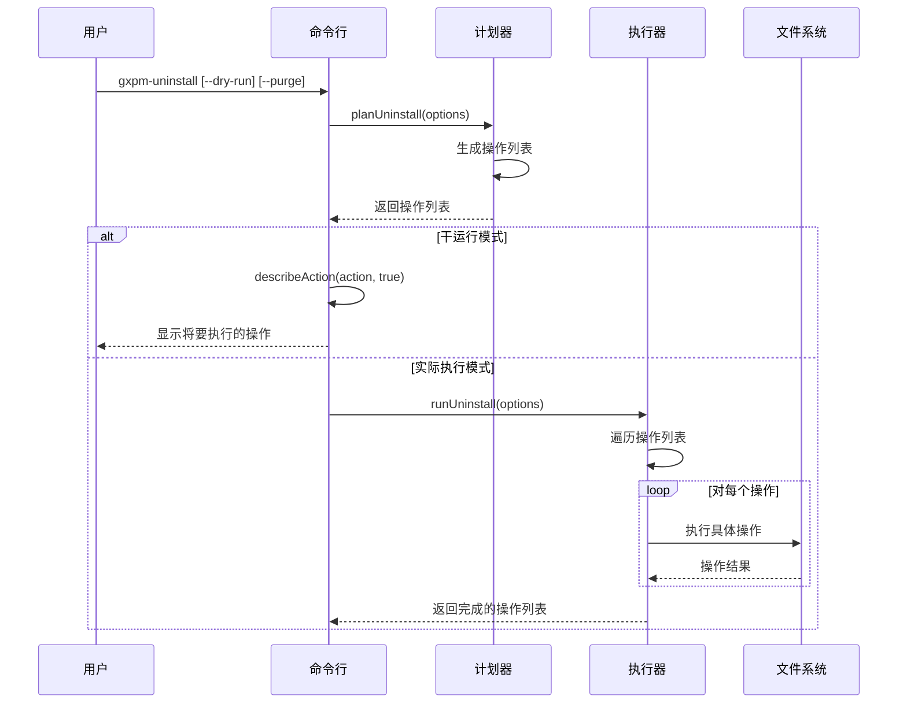
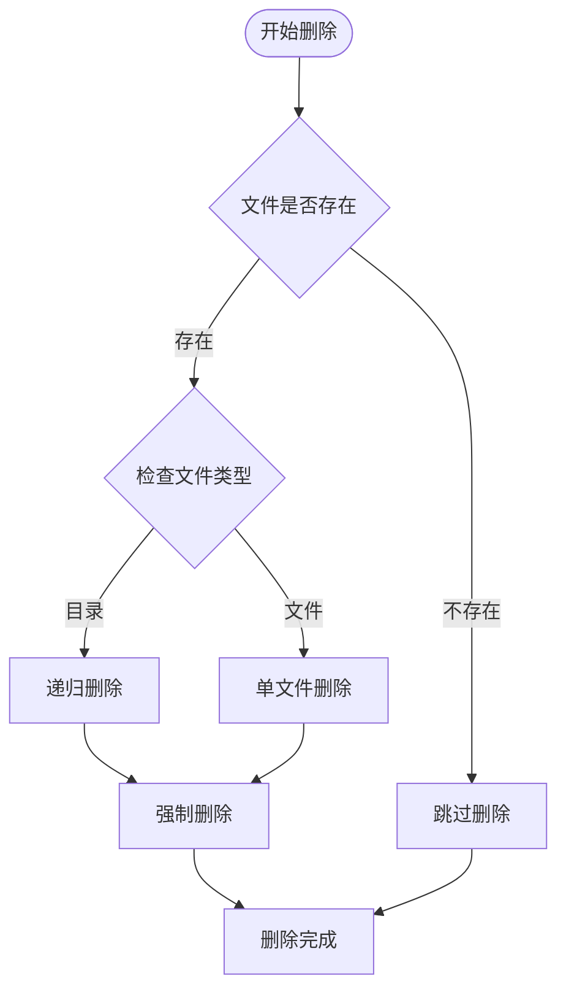
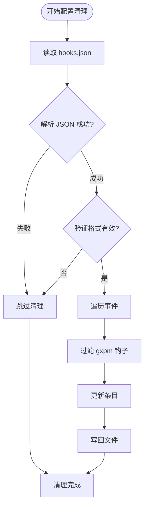
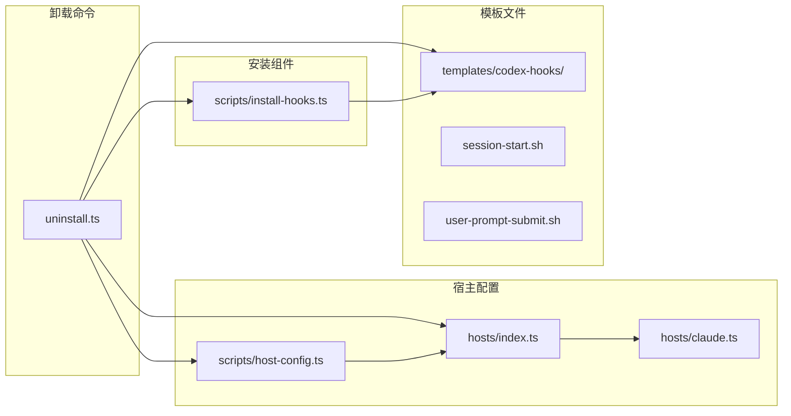

# 卸载清理命令

<cite>
**本文档引用的文件**
- [scripts/uninstall.ts](file://scripts/uninstall.ts)
- [test/uninstall.test.ts](file://test/uninstall.test.ts)
- [bin/gxpm-uninstall](file://bin/gxpm-uninstall)
- [package.json](file://package.json)
- [scripts/install-hooks.ts](file://scripts/install-hooks.ts)
- [hosts/claude.ts](file://hosts/claude.ts)
- [hosts/index.ts](file://hosts/index.ts)
- [scripts/host-config.ts](file://scripts/host-config.ts)
- [templates/codex-hooks/session-start.sh](file://templates/codex-hooks/session-start.sh)
- [templates/codex-hooks/user-prompt-submit.sh](file://templates/codex-hooks/user-prompt-submit.sh)
</cite>

## 目录
1. [简介](#简介)
2. [项目结构](#项目结构)
3. [核心组件](#核心组件)
4. [架构概览](#架构概览)
5. [详细组件分析](#详细组件分析)
6. [依赖关系分析](#依赖关系分析)
7. [性能考虑](#性能考虑)
8. [故障排除指南](#故障排除指南)
9. [结论](#结论)

## 简介

卸载清理命令是 gxpm 项目管理运行时中的一个重要功能模块，用于完全移除已安装的技能、Git 钩子和 Codex/Claude 集成配置。该命令设计为安全、可预测且可回滚的操作，确保用户能够彻底清理系统中与 gxpm 相关的所有痕迹。

gxpm 是第二代项目管理运行时，旨在替代 PMC 和 gstack，提供更强大的项目管理和工作流自动化能力。卸载清理命令确保用户可以完全移除这些功能，同时保持系统的整洁和安全。

## 项目结构

项目采用模块化架构，卸载功能位于 `scripts/uninstall.ts` 文件中，通过二进制入口点 `bin/gxpm-uninstall` 提供命令行接口。

**图表来源**
- [package.json:7-12](file://package.json#L7-L12)
- [bin/gxpm-uninstall:1-16](file://bin/gxpm-uninstall#L1-L16)
- [scripts/uninstall.ts:1-156](file://scripts/uninstall.ts#L1-L156)

**章节来源**
- [package.json:1-27](file://package.json#L1-L27)
- [bin/gxpm-uninstall:1-16](file://bin/gxpm-uninstall#L1-L16)

## 核心组件

卸载清理命令的核心组件包括以下关键部分：

### 主要功能模块

1. **计划卸载函数** (`planUninstall`)
   - 生成完整的卸载操作计划
   - 支持干运行模式预览操作
   - 处理不同类型的卸载目标

2. **执行卸载函数** (`runUninstall`)
   - 执行实际的文件删除操作
   - 支持安全的回滚机制
   - 处理异常情况和错误恢复

3. **参数解析器** (`parseArgs`)
   - 解析命令行参数
   - 验证参数有效性
   - 设置默认值

4. **动作描述器** (`describeAction`)
   - 生成人类可读的操作描述
   - 区分干运行和实际执行

**章节来源**
- [scripts/uninstall.ts:33-73](file://scripts/uninstall.ts#L33-L73)
- [scripts/uninstall.ts:125-142](file://scripts/uninstall.ts#L125-L142)
- [scripts/uninstall.ts:116-123](file://scripts/uninstall.ts#L116-L123)

## 架构概览

卸载清理命令采用分层架构设计，确保功能的模块化和可维护性。

**图表来源**
- [scripts/uninstall.ts:144-155](file://scripts/uninstall.ts#L144-L155)
- [scripts/uninstall.ts:58-73](file://scripts/uninstall.ts#L58-L73)
- [scripts/uninstall.ts:75-114](file://scripts/uninstall.ts#L75-L114)

## 详细组件分析

### 计划卸载组件

计划卸载组件负责生成完整的卸载操作列表，确保所有相关文件都被正确识别和标记。

**图表来源**
- [scripts/uninstall.ts:33-56](file://scripts/uninstall.ts#L33-L56)
- [scripts/uninstall.ts:46-49](file://scripts/uninstall.ts#L46-L49)
- [scripts/uninstall.ts:51-53](file://scripts/uninstall.ts#L51-L53)

#### Git 钩子清理

Git 钩子清理涉及多个标准钩子和 gxpm 特定钩子的处理：

| 钩子类型 | 文件名 | 作用 |
|---------|--------|------|
| 标准钩子 | pre-commit | 提交前验证 |
| 标准钩子 | commit-msg | 提交信息验证 |
| 标准钩子 | pre-push | 推送前验证 |
| 标准钩子 | post-merge | 合并后处理 |
| gxpm 钩子 | gxpm-pre-commit | gxpm 提交前钩子 |
| gxpm 钩子 | gxpm-commit-msg | gxpm 提交信息钩子 |
| gxpm 钩子 | gxpm-pre-push | gxpm 推送前钩子 |
| gxpm 钩子 | gxpm-post-merge | gxpm 合并后钩子 |

#### Codex 钩子脚本清理

Codex 钩子脚本清理专门处理 gxpm 相关的 Bash 脚本：

| 脚本名称 | 作用 | 触发事件 |
|---------|------|----------|
| gxpm-session-start.sh | 会话开始时注入上下文 | SessionStart |
| gxpm-user-prompt-submit.sh | 用户提交提示时处理问题状态 | UserPromptSubmit |

**章节来源**
- [scripts/uninstall.ts:17-31](file://scripts/uninstall.ts#L17-L31)
- [scripts/uninstall.ts:33-44](file://scripts/uninstall.ts#L33-L44)

### 执行卸载组件

执行卸载组件负责实际的文件系统操作，包含安全检查和错误处理机制。

**图表来源**
- [scripts/uninstall.ts:58-73](file://scripts/uninstall.ts#L58-L73)
- [scripts/uninstall.ts:144-155](file://scripts/uninstall.ts#L144-L155)

#### 文件删除策略

文件删除操作采用递归删除策略，确保完整清理：

**图表来源**
- [scripts/uninstall.ts:75-78](file://scripts/uninstall.ts#L75-L78)

#### Codex 配置清理

Codex 配置清理专门处理 hooks.json 文件中的 gxpm 条目：

**图表来源**
- [scripts/uninstall.ts:80-114](file://scripts/uninstall.ts#L80-L114)

**章节来源**
- [scripts/uninstall.ts:58-73](file://scripts/uninstall.ts#L58-L73)
- [scripts/uninstall.ts:75-114](file://scripts/uninstall.ts#L75-L114)

### 参数处理组件

参数处理组件负责解析和验证命令行参数，确保操作的安全性和正确性。

| 参数 | 类型 | 默认值 | 描述 |
|------|------|--------|------|
| --dry-run | 布尔值 | false | 预览模式，不执行实际操作 |
| --purge | 布尔值 | false | 彻底清理，包括用户状态目录 |
| --target | 字符串 | 当前工作目录 | 目标仓库路径 |
| --home | 字符串 | 用户主目录 | 用户主目录路径 |

**章节来源**
- [scripts/uninstall.ts:125-142](file://scripts/uninstall.ts#L125-L142)

## 依赖关系分析

卸载清理命令与其他组件的依赖关系如下：

**图表来源**
- [scripts/uninstall.ts:1-3](file://scripts/uninstall.ts#L1-L3)
- [hosts/index.ts:1-16](file://hosts/index.ts#L1-L16)
- [scripts/install-hooks.ts:1-106](file://scripts/install-hooks.ts#L1-L106)

### 关键依赖关系

1. **宿主配置依赖**
   - 卸载命令依赖宿主配置来确定正确的路径
   - Claude 和 Codex 宿主配置影响技能文件的位置

2. **安装组件依赖**
   - 卸载命令需要了解安装过程才能正确清理
   - 安装钩子的逆向操作确保完整性

3. **模板文件依赖**
   - Codex 钩子脚本模板定义了需要清理的具体文件
   - 会话开始和用户提示提交钩子需要被识别和移除

**章节来源**
- [hosts/claude.ts:1-17](file://hosts/claude.ts#L1-L17)
- [hosts/index.ts:1-16](file://hosts/index.ts#L1-L16)
- [scripts/install-hooks.ts:11-16](file://scripts/install-hooks.ts#L11-L16)

## 性能考虑

卸载清理命令在设计时充分考虑了性能和效率：

### 时间复杂度分析

- **计划阶段**: O(n) - n 为要处理的文件数量
- **执行阶段**: O(m) - m 为实际执行的操作数量
- **内存使用**: O(k) - k 为配置文件的大小

### 优化策略

1. **批量操作**: 将相关文件的删除操作合并，减少系统调用次数
2. **条件检查**: 在执行前进行存在性检查，避免不必要的操作
3. **增量更新**: 对于配置文件，只更新受影响的部分而非整个文件

### 错误处理优化

- **原子性**: 删除操作尽可能原子化，避免部分清理导致的状态不一致
- **回滚机制**: 支持干运行模式，允许用户预览操作而不执行实际更改
- **容错处理**: 对于无法处理的文件，记录错误但不影响其他操作的执行

## 故障排除指南

### 常见问题及解决方案

#### 权限问题

**问题**: 无权限删除某些文件或目录
**解决方案**:
- 使用管理员权限运行命令
- 检查文件的所有权和权限设置
- 确保用户对目标目录有写入权限

#### 文件锁定

**问题**: 文件被其他进程占用无法删除
**解决方案**:
- 关闭可能使用这些文件的应用程序
- 重启系统后重试
- 使用系统工具查看文件占用情况

#### 路径错误

**问题**: 指定的路径不存在或不正确
**解决方案**:
- 使用绝对路径而不是相对路径
- 验证路径的可访问性
- 检查路径中的特殊字符和空格

#### 配置文件损坏

**问题**: hooks.json 文件格式不正确
**解决方案**:
- 手动备份并修复配置文件
- 重新安装 gxpm 以重建配置文件
- 检查 JSON 格式的正确性

**章节来源**
- [test/uninstall.test.ts:48-93](file://test/uninstall.test.ts#L48-L93)

### 调试技巧

1. **使用干运行模式**: `gxpm-uninstall --dry-run --target <path>`
2. **检查日志输出**: 查看详细的执行步骤和结果
3. **验证清理结果**: 手动检查关键文件是否已被删除
4. **测试环境验证**: 在临时环境中测试卸载操作

## 结论

卸载清理命令是 gxpm 项目管理运行时的重要组成部分，提供了安全、可靠且可预测的清理机制。通过精心设计的架构和完善的错误处理，该命令确保用户能够完全移除所有与 gxpm 相关的功能，同时保持系统的稳定性和安全性。

该命令的主要优势包括：
- **完整性**: 能够识别和清理所有相关文件和配置
- **安全性**: 提供干运行模式和错误恢复机制
- **灵活性**: 支持不同的清理级别（标准清理 vs. 彻底清理）
- **可维护性**: 清晰的代码结构和完善的测试覆盖

未来可以考虑的改进方向：
- 添加更详细的清理进度报告
- 支持批量清理多个项目
- 提供更精细的清理选项
- 增加清理操作的审计日志
