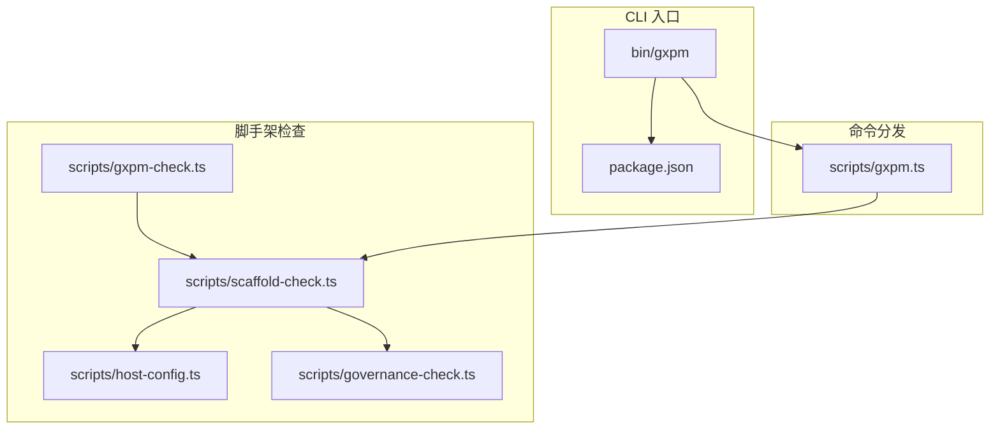
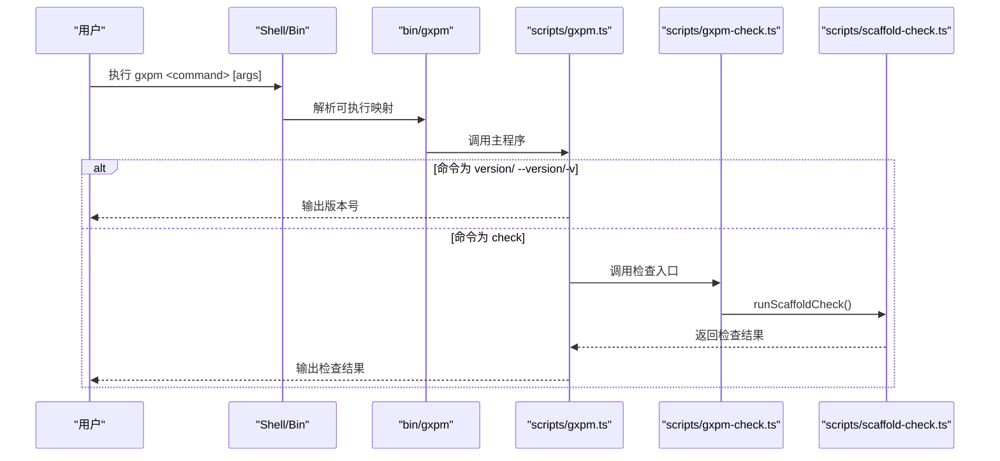
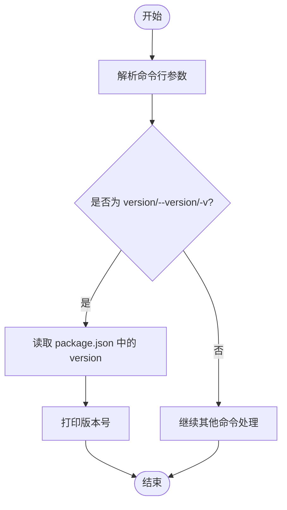
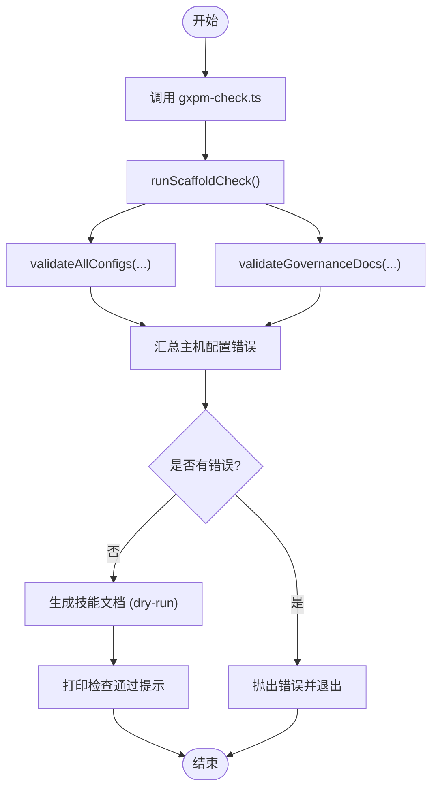
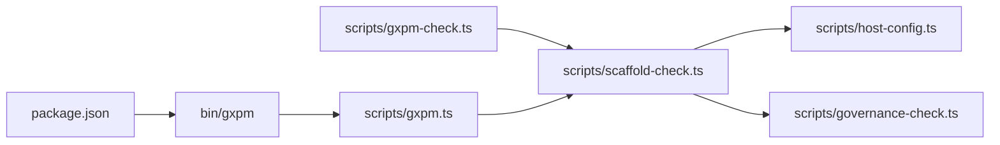

# 基础命令

<cite>
**本文引用的文件**
- [scripts/gxpm.ts](file://scripts/gxpm.ts)
- [scripts/gxpm-check.ts](file://scripts/gxpm-check.ts)
- [scripts/scaffold-check.ts](file://scripts/scaffold-check.ts)
- [scripts/host-config.ts](file://scripts/host-config.ts)
- [scripts/governance-check.ts](file://scripts/governance-check.ts)
- [bin/gxpm](file://bin/gxpm)
- [package.json](file://package.json)
- [README.md](file://README.md)
- [test/version-cli.test.ts](file://test/version-cli.test.ts)
- [test/gxpm-cli.test.ts](file://test/gxpm-cli.test.ts)
- [core/phase-gates.ts](file://core/phase-gates.ts)
</cite>

## 目录
1. [简介](#简介)
2. [项目结构](#项目结构)
3. [核心组件](#核心组件)
4. [架构总览](#架构总览)
5. [详细组件分析](#详细组件分析)
6. [依赖分析](#依赖分析)
7. [性能考虑](#性能考虑)
8. [故障排查指南](#故障排查指南)
9. [结论](#结论)
10. [附录](#附录)

## 简介
本章节聚焦 gxpm 的基础命令，特别是版本查询、脚手架检查与帮助相关的常用命令。重点覆盖以下内容：
- 版本查询命令：gxpm version、gxpm --version、gxpm -v 的行为与输出一致性
- 脚手架检查命令：gxpm check（以及其内部实现）如何进行治理文档与主机配置校验
- 帮助与使用建议：结合 phase gate 规则与项目文档，给出命令组合的最佳实践
- 实际命令行输出示例与常见使用场景，便于快速上手与日常验证

## 项目结构
与基础命令直接相关的关键文件与职责如下：
- 命令入口与分发逻辑：scripts/gxpm.ts
- 脚手架检查入口：scripts/gxpm-check.ts
- 脚手架检查实现：scripts/scaffold-check.ts
- 主机配置校验：scripts/host-config.ts
- 治理文档校验：scripts/governance-check.ts
- CLI 可执行入口：bin/gxpm
- 包元数据与二进制映射：package.json
- 使用示例与命令参考：README.md
- 行为测试：test/version-cli.test.ts、test/gxpm-cli.test.ts
- 阶段门禁规则（用于理解命令链）：core/phase-gates.ts

图表来源
- [bin/gxpm](file://bin/gxpm)
- [package.json](file://package.json)
- [scripts/gxpm.ts](file://scripts/gxpm.ts)
- [scripts/gxpm-check.ts](file://scripts/gxpm-check.ts)
- [scripts/scaffold-check.ts](file://scripts/scaffold-check.ts)
- [scripts/host-config.ts](file://scripts/host-config.ts)
- [scripts/governance-check.ts](file://scripts/governance-check.ts)

章节来源
- [bin/gxpm](file://bin/gxpm)
- [package.json](file://package.json)
- [scripts/gxpm.ts](file://scripts/gxpm.ts)
- [scripts/gxpm-check.ts](file://scripts/gxpm-check.ts)
- [scripts/scaffold-check.ts](file://scripts/scaffold-check.ts)
- [scripts/host-config.ts](file://scripts/host-config.ts)
- [scripts/governance-check.ts](file://scripts/governance-check.ts)

## 核心组件
- 版本查询命令
  - gxpm version：打印当前包版本
  - gxpm --version：别名，行为与 version 一致
  - gxpm -v：别名，行为与 version 一致
  - 行为由命令分发函数处理，读取 package.json 中的 version 并输出
- 脚手架检查命令
  - gxpm check：运行脚手架检查，校验主机配置与治理文档，通过后返回成功提示
  - 内部实现：scripts/gxpm-check.ts 直接调用 scripts/scaffold-check.ts.runScaffoldCheck
  - 校验内容：主机配置合法性、治理文档完整性与规范性
- 帮助与使用建议
  - README 提供本地命令示例与当前边界说明
  - phase-gates.ts 定义了阶段门禁命令链，可用于理解命令组合与过渡

章节来源
- [scripts/gxpm.ts](file://scripts/gxpm.ts)
- [scripts/gxpm-check.ts](file://scripts/gxpm-check.ts)
- [scripts/scaffold-check.ts](file://scripts/scaffold-check.ts)
- [scripts/host-config.ts](file://scripts/host-config.ts)
- [scripts/governance-check.ts](file://scripts/governance-check.ts)
- [README.md](file://README.md)
- [test/version-cli.test.ts](file://test/version-cli.test.ts)
- [test/gxpm-cli.test.ts](file://test/gxpm-cli.test.ts)
- [core/phase-gates.ts](file://core/phase-gates.ts)

## 架构总览
下图展示基础命令从用户输入到执行结果的整体流程。

图表来源
- [bin/gxpm](file://bin/gxpm)
- [scripts/gxpm.ts](file://scripts/gxpm.ts)
- [scripts/gxpm-check.ts](file://scripts/gxpm-check.ts)
- [scripts/scaffold-check.ts](file://scripts/scaffold-check.ts)

## 详细组件分析

### 版本查询命令（gxpm version）
- 语法与别名
  - gxpm version
  - gxpm --version
  - gxpm -v
- 参数
  - 无
- 行为
  - 读取项目根目录 package.json 的 version 字段
  - 将版本号输出到标准输出
- 输出示例
  - 正常输出：形如 0.1.0 的语义化版本字符串
  - 异常：当内部异常时，输出错误消息并以非零退出码结束
- 使用场景
  - 项目初始化后快速确认 gxpm 版本
  - CI 环境中验证安装是否正确
  - 与其他命令组合使用，形成“版本确认”步骤

图表来源
- [scripts/gxpm.ts](file://scripts/gxpm.ts)
- [package.json](file://package.json)

章节来源
- [scripts/gxpm.ts](file://scripts/gxpm.ts)
- [package.json](file://package.json)
- [test/version-cli.test.ts](file://test/version-cli.test.ts)

### 脚手架检查命令（gxpm check）
- 语法
  - gxpm check
- 参数
  - 无
- 行为
  - 调用脚手架检查入口脚本，执行以下校验：
    - 主机配置校验：validateAllConfigs 对所有主机配置进行合法性检查
    - 治理文档校验：validateGovernanceDocs 检查必需文档是否存在、内容是否符合规范
  - 若校验通过，生成技能文档（dry-run），返回“脚手架检查通过”的提示
- 输出示例
  - 成功：形如 “gxpm scaffold check passed (N hosts)” 的提示
  - 失败：抛出包含具体错误原因的异常，输出错误信息并以非零退出码结束
- 使用场景
  - 项目初始化后进行基础验证
  - 在 CI 中作为预检步骤，确保治理与主机配置符合要求
  - 修复问题后再次运行，确认修复生效

图表来源
- [scripts/gxpm-check.ts](file://scripts/gxpm-check.ts)
- [scripts/scaffold-check.ts](file://scripts/scaffold-check.ts)
- [scripts/host-config.ts](file://scripts/host-config.ts)
- [scripts/governance-check.ts](file://scripts/governance-check.ts)

章节来源
- [scripts/gxpm-check.ts](file://scripts/gxpm-check.ts)
- [scripts/scaffold-check.ts](file://scripts/scaffold-check.ts)
- [scripts/host-config.ts](file://scripts/host-config.ts)
- [scripts/governance-check.ts](file://scripts/governance-check.ts)

### 命令组合与最佳实践
- 项目初始化与基本验证
  - 步骤 1：确认版本
    - gxpm version
  - 步骤 2：运行脚手架检查
    - gxpm check
  - 步骤 3：查看阶段门禁命令链
    - 参考 phase-gates.ts 中的命令定义，按顺序完成各阶段产物初始化与过渡
- 常见组合
  - 版本确认 + 脚手架检查：gxpm version && gxpm check
  - 结合 README 示例命令：先创建问题、查看状态、列出产物等
- 注意事项
  - 严格遵循阶段门禁命令链，避免跳过必需产物
  - 在 CI 中将 gxpm check 作为必跑步骤，确保治理与主机配置合规

章节来源
- [README.md](file://README.md)
- [core/phase-gates.ts](file://core/phase-gates.ts)
- [test/gxpm-cli.test.ts](file://test/gxpm-cli.test.ts)

## 依赖分析
- 命令入口依赖
  - bin/gxpm 通过可执行映射指向 scripts/gxpm.ts
  - package.json 的 bin 字段定义了 gxpm 可执行名称与其入口
- 脚手架检查依赖
  - scripts/gxpm-check.ts 依赖 scripts/scaffold-check.ts
  - scripts/scaffold-check.ts 依赖 scripts/host-config.ts 与 scripts/governance-check.ts
- 命令分发依赖
  - scripts/gxpm.ts 根据命令参数分发到不同子功能（版本、检查、问题、产物、门禁等）

图表来源
- [bin/gxpm](file://bin/gxpm)
- [package.json](file://package.json)
- [scripts/gxpm.ts](file://scripts/gxpm.ts)
- [scripts/gxpm-check.ts](file://scripts/gxpm-check.ts)
- [scripts/scaffold-check.ts](file://scripts/scaffold-check.ts)
- [scripts/host-config.ts](file://scripts/host-config.ts)
- [scripts/governance-check.ts](file://scripts/governance-check.ts)

章节来源
- [bin/gxpm](file://bin/gxpm)
- [package.json](file://package.json)
- [scripts/gxpm.ts](file://scripts/gxpm.ts)
- [scripts/gxpm-check.ts](file://scripts/gxpm-check.ts)
- [scripts/scaffold-check.ts](file://scripts/scaffold-check.ts)
- [scripts/host-config.ts](file://scripts/host-config.ts)
- [scripts/governance-check.ts](file://scripts/governance-check.ts)

## 性能考虑
- 版本查询为 O(1) 操作，仅读取 package.json 并输出，开销极低
- 脚手架检查涉及文件系统读取与少量正则校验，通常在秒级内完成
- 建议在 CI 中缓存依赖与工具链，减少重复安装时间
- 对于大型仓库，治理文档校验可能受文件数量影响，建议保持治理文档简洁与集中

## 故障排查指南
- gxpm version 输出为空或报错
  - 检查 package.json 是否存在且包含合法的 version 字段
  - 确认运行目录为项目根目录
- gxpm check 报错
  - 主机配置错误：核对 scripts/host-config.ts 中的校验规则与配置项
  - 治理文档缺失：根据 scripts/governance-check.ts 的要求补齐必需文档
  - 修复后再次运行 gxpm check，确认通过
- 命令别名不生效
  - 确认 bin/gxpm 已正确安装并可执行
  - 检查 shell 的 PATH 设置，确保能找到 gxpm 可执行文件

章节来源
- [scripts/gxpm.ts](file://scripts/gxpm.ts)
- [scripts/scaffold-check.ts](file://scripts/scaffold-check.ts)
- [scripts/host-config.ts](file://scripts/host-config.ts)
- [scripts/governance-check.ts](file://scripts/governance-check.ts)
- [bin/gxpm](file://bin/gxpm)

## 结论
- 版本查询与脚手架检查是 gxpm 项目初始化与日常验证的基础能力
- 通过 gxpm version 快速确认环境，通过 gxpm check 确保治理与主机配置合规
- 结合 phase-gates.ts 的命令链与 README 的示例，可以形成稳定的命令组合与最佳实践

## 附录
- 常用命令清单
  - gxpm version / gxpm --version / gxpm -v：查询版本
  - gxpm check：脚手架检查
- 相关文件路径
  - 命令入口与分发：scripts/gxpm.ts
  - 脚手架检查入口：scripts/gxpm-check.ts
  - 脚手架检查实现：scripts/scaffold-check.ts
  - 主机配置校验：scripts/host-config.ts
  - 治理文档校验：scripts/governance-check.ts
  - CLI 可执行入口：bin/gxpm
  - 包元数据：package.json
  - 使用示例与命令参考：README.md
  - 行为测试：test/version-cli.test.ts、test/gxpm-cli.test.ts
  - 阶段门禁规则：core/phase-gates.ts