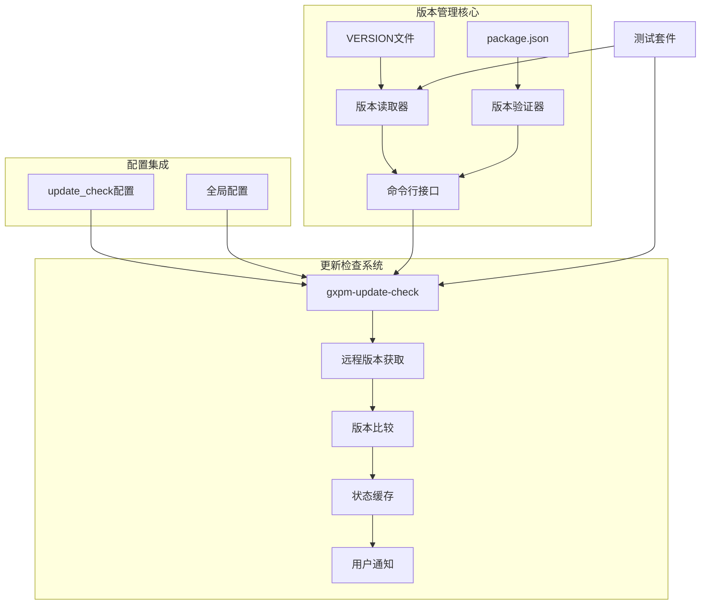
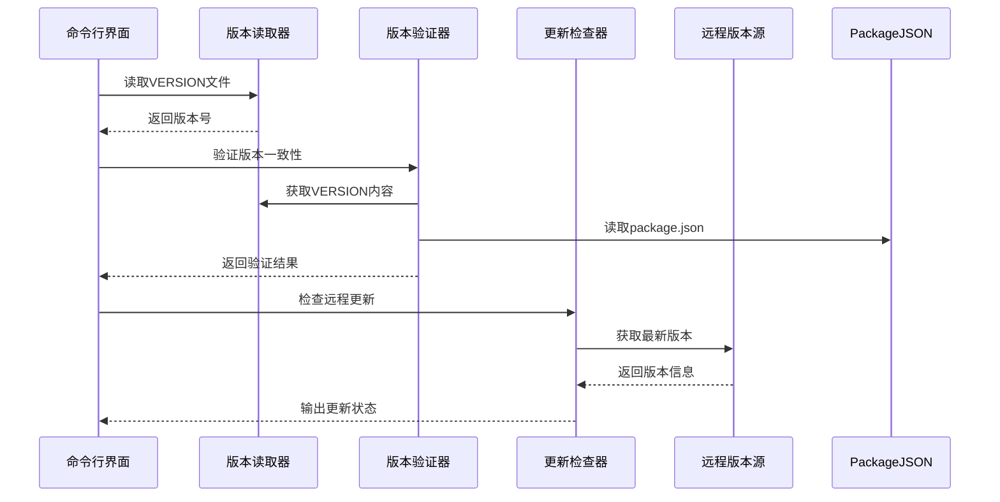
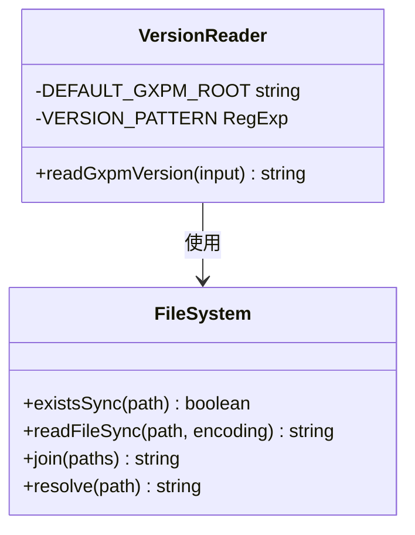
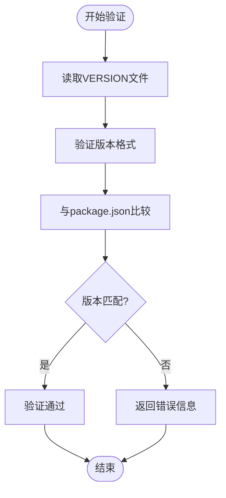
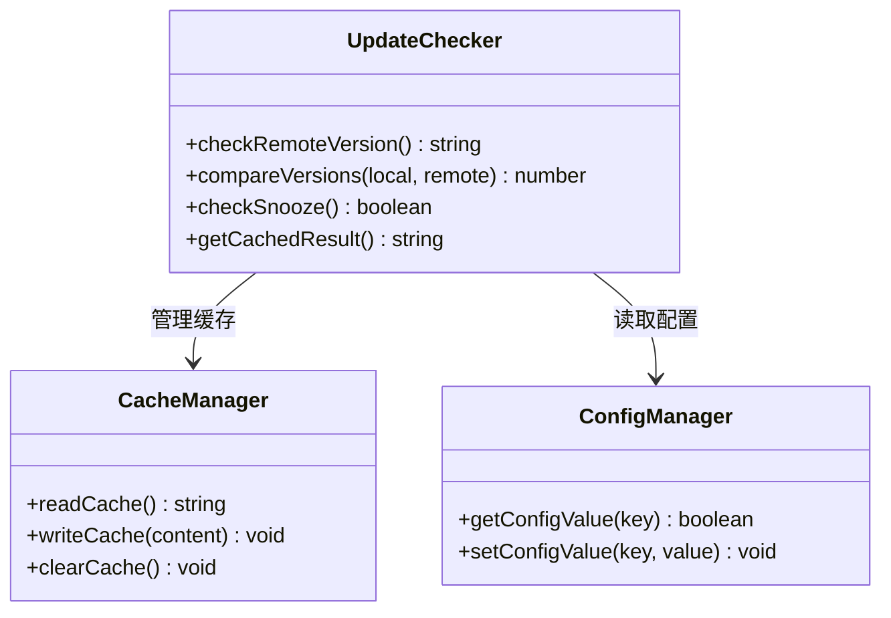
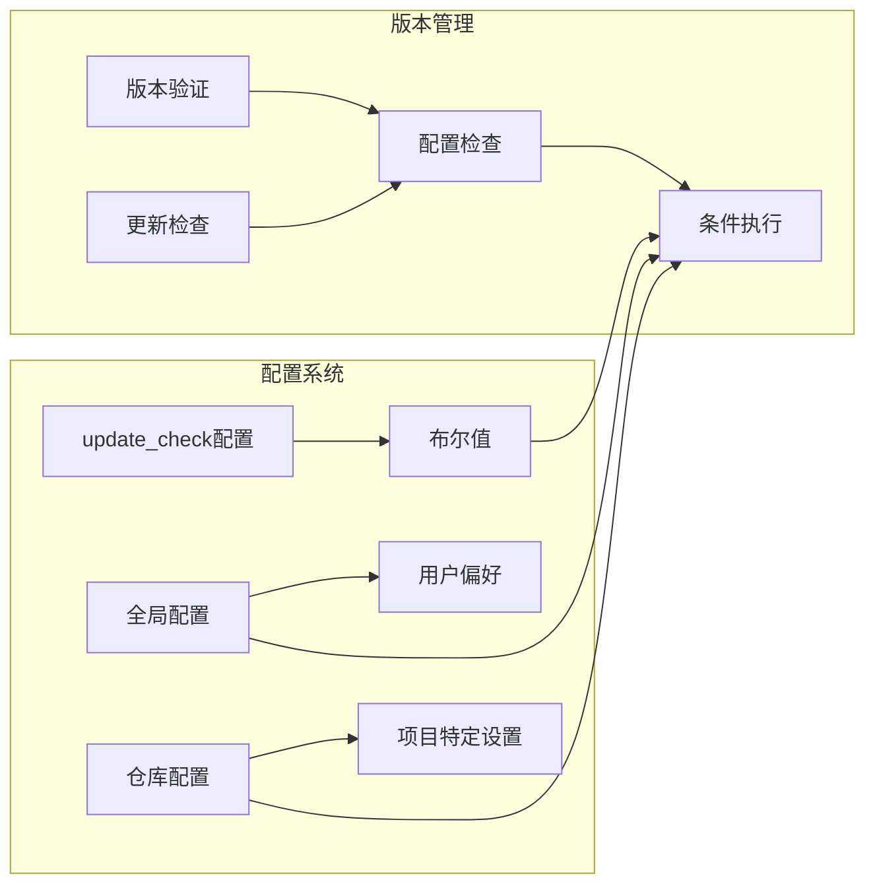
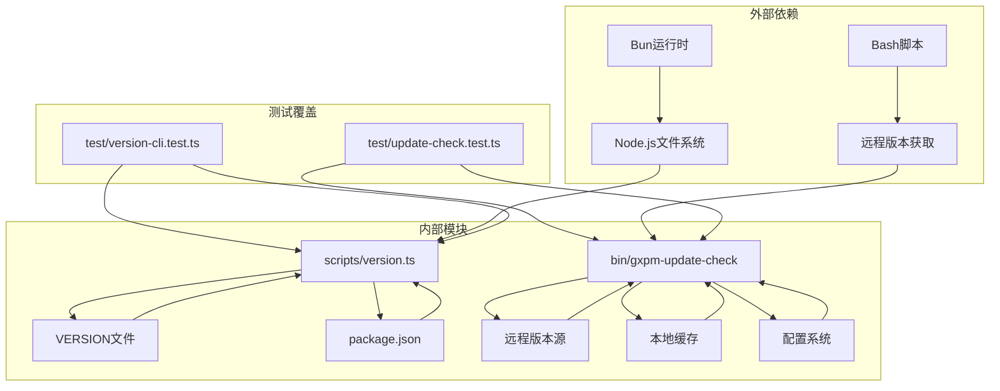

# 版本管理功能

<cite>
**本文档引用的文件**
- [package.json](file://package.json)
- [VERSION](file://VERSION)
- [scripts/version.ts](file://scripts/version.ts)
- [scripts/gxpm.ts](file://scripts/gxpm.ts)
- [bin/gxpm-update-check](file://bin/gxpm-update-check)
- [core/config.ts](file://core/config.ts)
- [core/state.ts](file://core/state.ts)
- [test/version-cli.test.ts](file://test/version-cli.test.ts)
- [test/update-check.test.ts](file://test/update-check.test.ts)
</cite>

## 目录
1. [简介](#简介)
2. [项目结构](#项目结构)
3. [核心组件](#核心组件)
4. [架构概览](#架构概览)
5. [详细组件分析](#详细组件分析)
6. [依赖关系分析](#依赖关系分析)
7. [性能考虑](#性能考虑)
8. [故障排除指南](#故障排除指南)
9. [结论](#结论)

## 简介

gxpm项目实现了完整的版本管理系统，包括本地版本控制、远程版本检查、版本验证和更新通知等功能。该系统采用四段式版本号格式（主版本.次版本.修订版本.构建号），通过VERSION文件和package.json的双重校验机制确保版本一致性。

## 项目结构

版本管理功能主要分布在以下模块中：

**图表来源**
- [VERSION:1-2](file://VERSION#L1-L2)
- [package.json:1-27](file://package.json#L1-L27)
- [scripts/version.ts:1-48](file://scripts/version.ts#L1-L48)
- [bin/gxpm-update-check:1-166](file://bin/gxpm-update-check#L1-L166)

**章节来源**
- [package.json:1-27](file://package.json#L1-L27)
- [VERSION:1-2](file://VERSION#L1-L2)
- [scripts/version.ts:1-48](file://scripts/version.ts#L1-L48)

## 核心组件

### 版本文件管理器

版本文件管理器负责处理VERSION文件的读取、验证和格式化工作。

**章节来源**
- [scripts/version.ts:7-18](file://scripts/version.ts#L7-L18)

### 版本验证器

版本验证器执行双重验证机制，确保VERSION文件与package.json中的版本保持一致。

**章节来源**
- [scripts/version.ts:20-47](file://scripts/version.ts#L20-L47)

### 更新检查器

更新检查器提供远程版本检查功能，支持强制更新、静音机制和缓存策略。

**章节来源**
- [bin/gxpm-update-check:1-166](file://bin/gxpm-update-check#L1-L166)

## 架构概览

版本管理系统采用分层架构设计，各组件职责明确且相互独立：

**图表来源**
- [scripts/gxpm.ts:43-46](file://scripts/gxpm.ts#L43-L46)
- [scripts/version.ts:20-47](file://scripts/version.ts#L20-L47)
- [bin/gxpm-update-check:84-96](file://bin/gxpm-update-check#L84-L96)

## 详细组件分析

### 版本读取器实现

版本读取器提供了简洁的API来访问项目版本信息：

**图表来源**
- [scripts/version.ts:7-18](file://scripts/version.ts#L7-L18)

版本读取器的核心特性：
- 支持自定义根目录参数
- 自动检测VERSION文件存在性
- 执行版本格式验证
- 提供详细的错误信息

**章节来源**
- [scripts/version.ts:7-18](file://scripts/version.ts#L7-L18)

### 版本验证器机制

版本验证器实现了严格的版本一致性检查：

**图表来源**
- [scripts/version.ts:20-47](file://scripts/version.ts#L20-L47)

验证规则包括：
- 四段式数字格式验证
- VERSION文件存在性检查
- package.json版本同步检查
- 错误信息收集和报告

**章节来源**
- [scripts/version.ts:20-47](file://scripts/version.ts#L20-L47)

### 更新检查系统

更新检查系统提供了完整的远程版本监控功能：

**图表来源**
- [bin/gxpm-update-check:46-82](file://bin/gxpm-update-check#L46-L82)

更新检查的关键功能：
- 远程版本获取和解析
- 版本比较算法
- 缓存机制和TTL管理
- 静音机制（snooze）
- 强制更新模式

**章节来源**
- [bin/gxpm-update-check:46-82](file://bin/gxpm-update-check#L46-L82)

### 配置集成机制

版本管理功能与系统配置深度集成：

**图表来源**
- [core/config.ts:67-71](file://core/config.ts#L67-L71)

配置选项说明：
- `update_check`: 控制是否启用远程版本检查
- 支持全局和仓库级别的配置覆盖
- 默认值为启用状态
- 运行时动态读取配置

**章节来源**
- [core/config.ts:67-71](file://core/config.ts#L67-L71)

## 依赖关系分析

版本管理系统的依赖关系清晰且模块化：

**图表来源**
- [scripts/version.ts:1-48](file://scripts/version.ts#L1-L48)
- [bin/gxpm-update-check:1-166](file://bin/gxpm-update-check#L1-L166)

**章节来源**
- [scripts/version.ts:1-48](file://scripts/version.ts#L1-L48)
- [bin/gxpm-update-check:1-166](file://bin/gxpm-update-check#L1-L166)

## 性能考虑

版本管理系统的性能优化策略：

### 缓存机制
- 更新检查结果缓存（60-720分钟TTL）
- 静音状态持久化
- 最近一次检查时间记录

### I/O优化
- 文件系统操作最小化
- 批量配置读取
- 条件性远程访问

### 内存管理
- 流式文件读取
- 及时的资源清理
- 避免不必要的对象创建

## 故障排除指南

### 常见问题及解决方案

**版本不一致错误**
- 检查VERSION文件格式是否正确
- 确认package.json版本与VERSION一致
- 验证版本格式为四段式数字

**更新检查失败**
- 检查网络连接和远程URL可达性
- 验证缓存文件权限
- 查看配置中update_check设置

**权限问题**
- 确认对~/.gxpm目录的写入权限
- 检查远程版本源访问权限
- 验证Bun运行时环境

**章节来源**
- [test/version-cli.test.ts:26-34](file://test/version-cli.test.ts#L26-L34)
- [test/update-check.test.ts:73-89](file://test/update-check.test.ts#L73-L89)

## 结论

gxpm项目的版本管理功能实现了以下目标：

1. **可靠性**: 通过双重验证机制确保版本一致性
2. **可用性**: 提供直观的命令行接口和配置选项
3. **可维护性**: 模块化设计便于扩展和维护
4. **用户体验**: 智能的缓存和静音机制减少干扰

该系统为项目提供了稳健的版本控制基础，支持持续集成和部署流程，同时保持了良好的性能表现和用户体验。