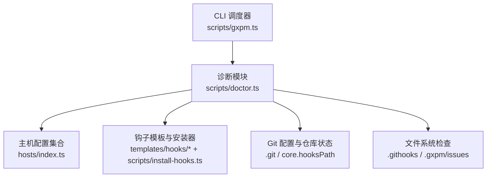
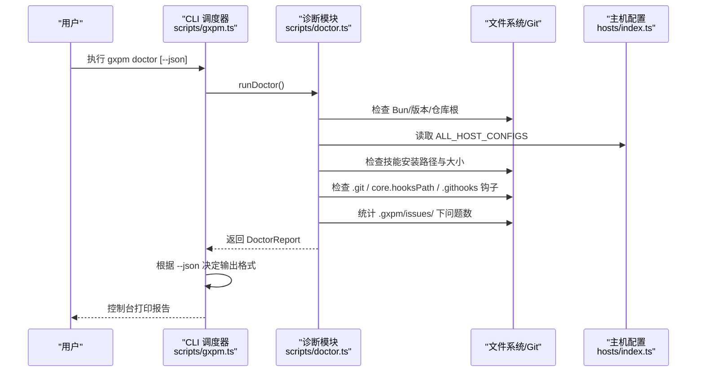
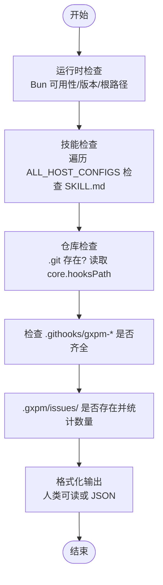
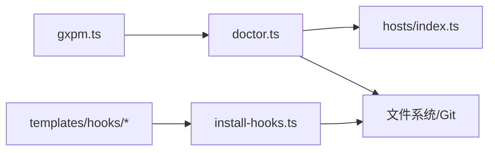

# 诊断命令

<cite>
**本文引用的文件**
- [scripts/doctor.ts](file://scripts/doctor.ts)
- [scripts/gxpm.ts](file://scripts/gxpm.ts)
- [test/doctor.test.ts](file://test/doctor.test.ts)
- [hosts/index.ts](file://hosts/index.ts)
- [hosts/claude.ts](file://hosts/claude.ts)
- [hosts/codex.ts](file://hosts/codex.ts)
- [scripts/install-hooks.ts](file://scripts/install-hooks.ts)
- [templates/hooks/gxpm-pre-commit](file://templates/hooks/gxpm-pre-commit)
- [templates/hooks/gxpm-pre-push](file://templates/hooks/gxpm-pre-push)
- [skills/gxpm/SKILL.md](file://skills/gxpm/SKILL.md)
</cite>

## 目录
1. [简介](#简介)
2. [项目结构](#项目结构)
3. [核心组件](#核心组件)
4. [架构总览](#架构总览)
5. [详细组件分析](#详细组件分析)
6. [依赖关系分析](#依赖关系分析)
7. [性能考量](#性能考量)
8. [故障排查指南](#故障排查指南)
9. [结论](#结论)
10. [附录](#附录)

## 简介
诊断命令（doctor）用于对当前工作环境进行系统健康检查与问题排查，覆盖运行时环境、技能安装状态、Git 仓库与钩子配置、以及本地问题跟踪目录等关键方面。通过该命令，用户可以快速定位配置缺失、路径错误或状态不一致等问题，并获得针对性修复建议。

## 项目结构
doctor 命令位于脚本层，由 CLI 分发器调用并输出人类可读报告或 JSON 结构化数据。其核心逻辑集中在诊断模块中，同时依赖主机配置信息以判断技能安装位置。

图表来源
- [scripts/gxpm.ts:66-75](file://scripts/gxpm.ts#L66-L75)
- [scripts/doctor.ts:51-61](file://scripts/doctor.ts#L51-L61)
- [hosts/index.ts:4-5](file://hosts/index.ts#L4-L5)
- [scripts/install-hooks.ts:50-103](file://scripts/install-hooks.ts#L50-L103)

章节来源
- [scripts/gxpm.ts:66-75](file://scripts/gxpm.ts#L66-L75)
- [scripts/doctor.ts:51-61](file://scripts/doctor.ts#L51-L61)
- [hosts/index.ts:4-5](file://hosts/index.ts#L4-L5)

## 核心组件
- 诊断报告 DoctorReport
  - runtime: 运行时环境检查结果（Bun 可用性、版本、仓库根路径）
  - skill: 技能安装检查结果（按主机枚举，包含安装路径与大小）
  - repo: 仓库与钩子检查结果（是否 Git 仓库、core.hooksPath、四类 gxpm 钩子是否齐全、.gxpm/issues/ 是否存在及跟踪的问题数量）

- 诊断流程
  - 运行时检查：检测 Bun 是否可用、读取 package.json 版本、确定 gxpm 仓库根路径
  - 技能检查：遍历 ALL_HOST_CONFIGS，检查每个主机的全局根目录下是否存在 SKILL.md
  - 仓库检查：判断 .git 存在性；读取 core.hooksPath；检查 .githooks 下四个钩子文件；统计 .gxpm/issues/ 下有效问题目录数量

- 输出格式
  - 默认输出：人类可读文本，包含各部分检查结果与修复建议
  - JSON 模式：通过 --json 输出结构化 JSON，便于自动化集成

章节来源
- [scripts/doctor.ts:7-34](file://scripts/doctor.ts#L7-L34)
- [scripts/doctor.ts:51-61](file://scripts/doctor.ts#L51-L61)
- [scripts/doctor.ts:156-210](file://scripts/doctor.ts#L156-L210)

## 架构总览
doctor 命令的调用链路清晰：CLI 接收参数，选择是否以 JSON 模式输出；内部调用 runDoctor 生成报告，再由 formatDoctorReport 格式化输出。

图表来源
- [scripts/gxpm.ts:66-75](file://scripts/gxpm.ts#L66-L75)
- [scripts/doctor.ts:51-61](file://scripts/doctor.ts#L51-L61)
- [scripts/doctor.ts:156-210](file://scripts/doctor.ts#L156-L210)
- [hosts/index.ts:4-5](file://hosts/index.ts#L4-L5)

## 详细组件分析

### 诊断模块（scripts/doctor.ts）
- 数据模型
  - SkillCheck：主机名、安装路径、是否已安装、文件大小（字节）
  - RepoCheck：当前工作目录、是否 Git 仓库、core.hooksPath、是否安装全部 gxpm 钩子、已安装钩子列表、.gxpm 目录存在性、跟踪问题数量
  - RuntimeCheck：Bun 可用性、版本、仓库根路径
  - DoctorReport：三部分汇总

- 关键函数
  - runDoctor：组装三类检查结果
  - checkRuntime：检测 Bun 与版本，读取 package.json
  - checkSkill：基于 ALL_HOST_CONFIGS 逐项检查 SKILL.md
  - checkRepo：检查 .git、core.hooksPath、.githooks 四个钩子、.gxpm/issues/ 计数
  - formatDoctorReport：生成人类可读报告，包含修复建议

- 错误处理
  - 多处 try/catch 防止文件系统异常导致崩溃
  - 对不存在的路径、非目录、权限不足等情况进行稳健处理

- 性能特征
  - 文件系统扫描与少量子进程调用（Bun 版本查询、git config），整体开销较小
  - 仅在必要时读取 package.json 与统计目录项

章节来源
- [scripts/doctor.ts:7-34](file://scripts/doctor.ts#L7-L34)
- [scripts/doctor.ts:51-61](file://scripts/doctor.ts#L51-L61)
- [scripts/doctor.ts:63-79](file://scripts/doctor.ts#L63-L79)
- [scripts/doctor.ts:81-93](file://scripts/doctor.ts#L81-L93)
- [scripts/doctor.ts:95-154](file://scripts/doctor.ts#L95-L154)
- [scripts/doctor.ts:156-210](file://scripts/doctor.ts#L156-L210)

### CLI 调度器（scripts/gxpm.ts）
- doctor 子命令解析
  - 识别 --json 参数决定输出模式
  - 调用 runDoctor 与 formatDoctorReport 或直接输出 JSON

- 与其他命令的关系
  - doctor 与 check 命令并列，均在主分支中处理
  - doctor 与 config、issue、artifact 等命令互不干扰

章节来源
- [scripts/gxpm.ts:66-75](file://scripts/gxpm.ts#L66-L75)

### 主机配置（hosts/index.ts、hosts/claude.ts、hosts/codex.ts）
- ALL_HOST_CONFIGS 提供所有主机的配置，doctor 以此确定技能安装路径
- claude 与 codex 的 globalRoot 不同，影响 SKILL.md 的查找路径

章节来源
- [hosts/index.ts:4-5](file://hosts/index.ts#L4-L5)
- [hosts/claude.ts:3-17](file://hosts/claude.ts#L3-L17)
- [hosts/codex.ts:3-18](file://hosts/codex.ts#L3-L18)

### 钩子模板与安装器（templates/hooks/*、scripts/install-hooks.ts）
- 四类 gxpm 钩子模板：pre-commit、commit-msg、pre-push、post-merge
- 安装器负责复制模板、创建顶层分发脚本、设置 core.hooksPath
- doctor 仅检查 .githooks 下的 gxpm-* 文件是否存在，不负责安装

章节来源
- [scripts/install-hooks.ts:11-16](file://scripts/install-hooks.ts#L11-L16)
- [scripts/install-hooks.ts:50-103](file://scripts/install-hooks.ts#L50-L103)
- [templates/hooks/gxpm-pre-commit:1-31](file://templates/hooks/gxpm-pre-commit#L1-L31)
- [templates/hooks/gxpm-pre-push:1-17](file://templates/hooks/gxpm-pre-push#L1-L17)

### 实际诊断输出示例
以下为典型输出片段（人类可读模式）：
- 运行时
  - ✓ bun 可用
  - ✓ gxpm <版本号> 在 <路径>
- 技能安装
  - ✓ claude → ~/.claude/skills/gxpm/SKILL.md (1234 字节)
  - ✗ codex → ~/.codex/skills/gxpm/SKILL.md
  - 修复建议：执行 gxpm-init --install-skill --host all
- 仓库状态（当前目录）
  - ✓ git 仓库
  - ✗ git core.hooksPath = <未设置>
  - ✗ 缺少 gxpm 钩子：gxpm-pre-commit, gxpm-pre-push
  - 修复建议：执行 gxpm-init --install-hooks --target .
  - · 尚无 .gxpm/issues/（执行 gxpm issue create <id> 开始）

JSON 模式示例字段
- runtime.bunAvailable
- runtime.gxpmVersion
- runtime.gxpmRepoRoot
- skill[].host
- skill[].installed
- skill[].bytes
- repo.isGitRepo
- repo.coreHooksPath
- repo.gxpmHooksInstalled
- repo.installedHooks[]
- repo.gxpmDirExists
- repo.issueCount

章节来源
- [scripts/doctor.ts:156-210](file://scripts/doctor.ts#L156-L210)

### 诊断流程图（算法实现）

图表来源
- [scripts/doctor.ts:51-61](file://scripts/doctor.ts#L51-L61)
- [scripts/doctor.ts:63-79](file://scripts/doctor.ts#L63-L79)
- [scripts/doctor.ts:81-93](file://scripts/doctor.ts#L81-L93)
- [scripts/doctor.ts:95-154](file://scripts/doctor.ts#L95-L154)
- [scripts/doctor.ts:156-210](file://scripts/doctor.ts#L156-L210)

## 依赖关系分析
- 组件耦合
  - doctor 依赖 hosts/index.ts 获取主机配置，耦合度低且稳定
  - 与文件系统和 Git 的交互集中在本地，避免外部服务依赖
- 外部依赖
  - Bun（用于 doctor 自身运行）、git（用于读取配置）
- 潜在循环依赖
  - 无循环导入；doctor 仅单向依赖 hosts 与文件系统

图表来源
- [scripts/doctor.ts:5-5](file://scripts/doctor.ts#L5-L5)
- [hosts/index.ts:4-5](file://hosts/index.ts#L4-L5)
- [scripts/gxpm.ts:29-29](file://scripts/gxpm.ts#L29-L29)
- [scripts/install-hooks.ts:50-103](file://scripts/install-hooks.ts#L50-L103)
- [templates/hooks/gxpm-pre-commit:1-31](file://templates/hooks/gxpm-pre-commit#L1-L31)

章节来源
- [scripts/doctor.ts:5-5](file://scripts/doctor.ts#L5-L5)
- [scripts/gxpm.ts:29-29](file://scripts/gxpm.ts#L29-L29)
- [scripts/install-hooks.ts:50-103](file://scripts/install-hooks.ts#L50-L103)

## 性能考量
- I/O 操作
  - 读取 package.json、stat 文件大小、readdir 统计目录项，均为轻量操作
- 子进程调用
  - 仅在检测 Bun 版本与读取 git config 时调用，频率低
- 建议
  - 在 CI 中使用 --json 模式减少解析成本
  - 避免在大型仓库中频繁运行（如每分钟），建议按需触发

## 故障排查指南
- 无法识别 gxpm doctor
  - 确认已安装 Bun 并在 PATH 中可用
  - 确认 CLI 正常安装，或直接运行脚本
- 技能未安装
  - 现象：技能主机显示未安装
  - 解决：执行 gxpm-init --install-skill --host all
- 仓库非 Git 或 core.hooksPath 未指向 .githooks
  - 现象：core.hooksPath 显示未设置或非 .githooks
  - 解决：执行 gxpm-init --install-hooks --target .，或手动设置 git config core.hooksPath .githooks
- 缺失 gxpm 钩子
  - 现象：缺少 gxpm-pre-commit、gxpm-pre-push 等
  - 解决：执行 gxpm-init --install-hooks --target .，或手动复制模板至 .githooks
- 无 .gxpm/issues/ 目录
  - 现象：显示尚无跟踪问题
  - 解决：执行 gxpm issue create <id> 创建首个问题

章节来源
- [scripts/doctor.ts:178-180](file://scripts/doctor.ts#L178-L180)
- [scripts/doctor.ts:199-201](file://scripts/doctor.ts#L199-L201)
- [scripts/install-hooks.ts:81-92](file://scripts/install-hooks.ts#L81-L92)
- [skills/gxpm/SKILL.md:382-397](file://skills/gxpm/SKILL.md#L382-L397)

## 结论
doctor 命令提供了对运行时、技能安装、Git 配置与问题跟踪目录的全面健康检查，输出清晰直观并提供修复建议。结合 --json 模式，可无缝接入自动化流水线与监控系统，帮助团队快速定位与解决问题。

## 附录

### 使用示例
- 人类可读报告
  - gxpm doctor
- JSON 结构化输出
  - gxpm doctor --json

章节来源
- [scripts/gxpm.ts:66-75](file://scripts/gxpm.ts#L66-L75)

### 测试覆盖点（参考）
- 技能缺失与已安装场景
- Git 仓库状态与钩子缺失/齐全
- .gxpm/issues/ 目录计数
- 非 Git 目录稳健处理

章节来源
- [test/doctor.test.ts:19-98](file://test/doctor.test.ts#L19-L98)