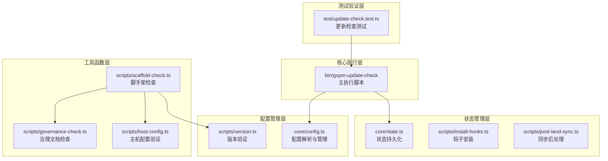
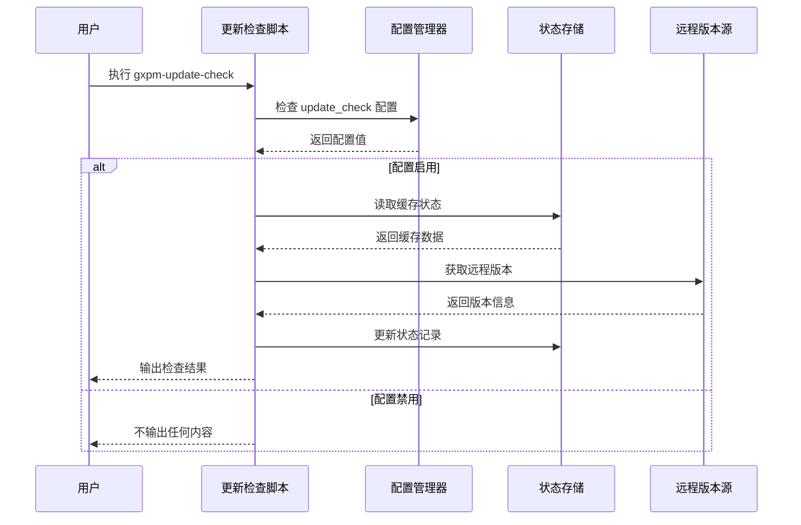
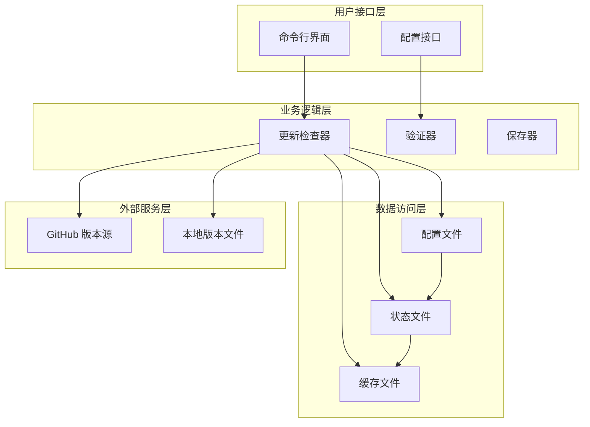
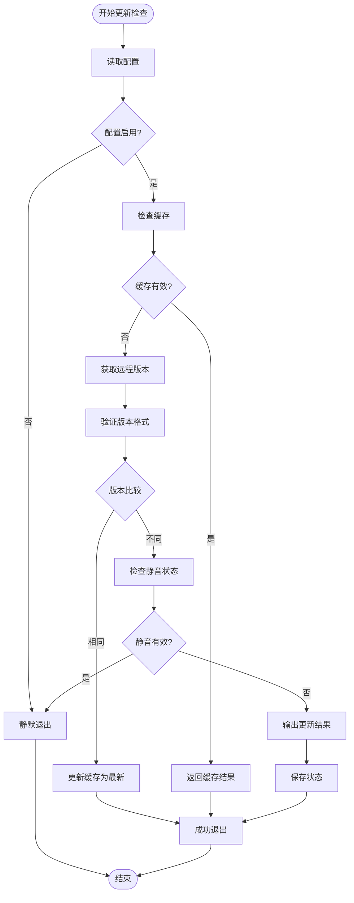
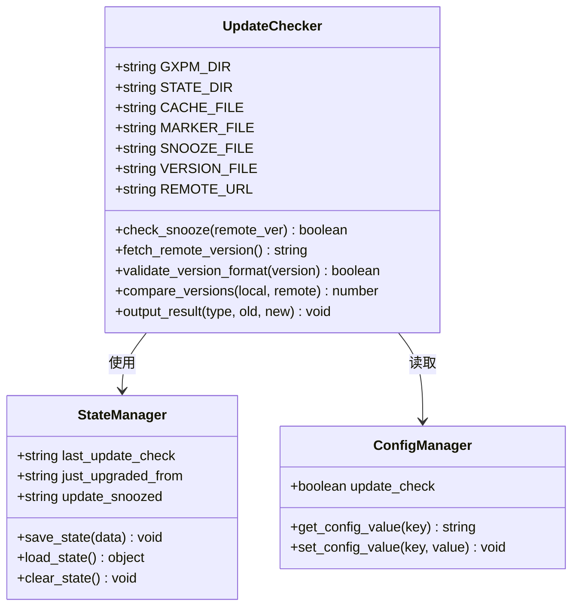
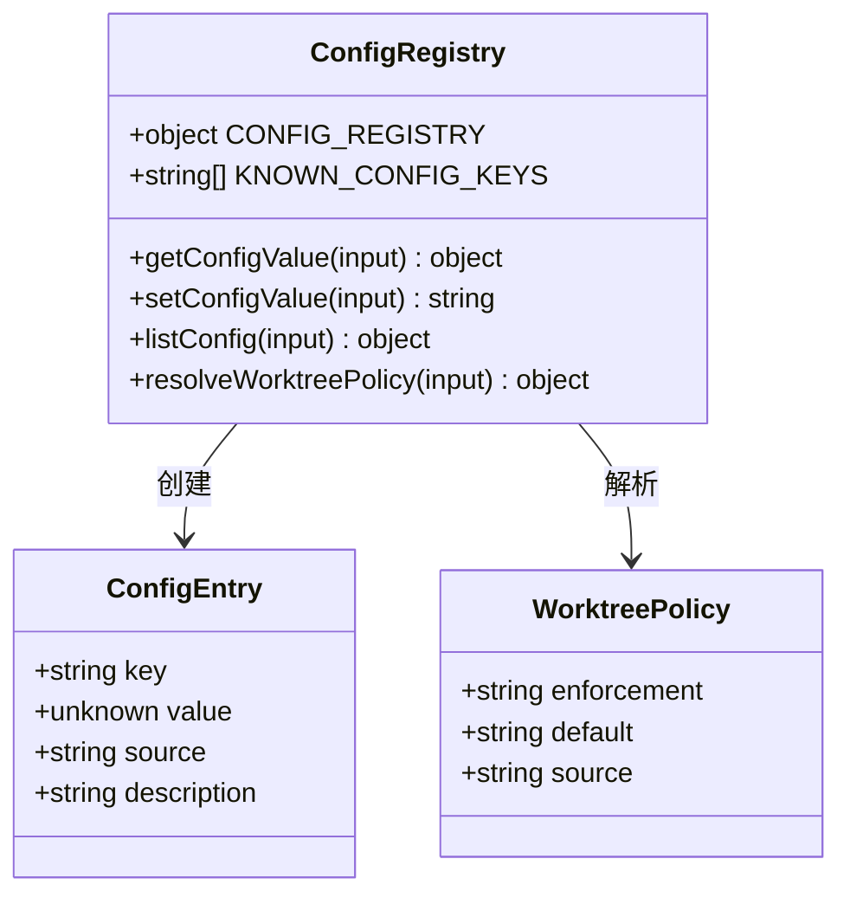
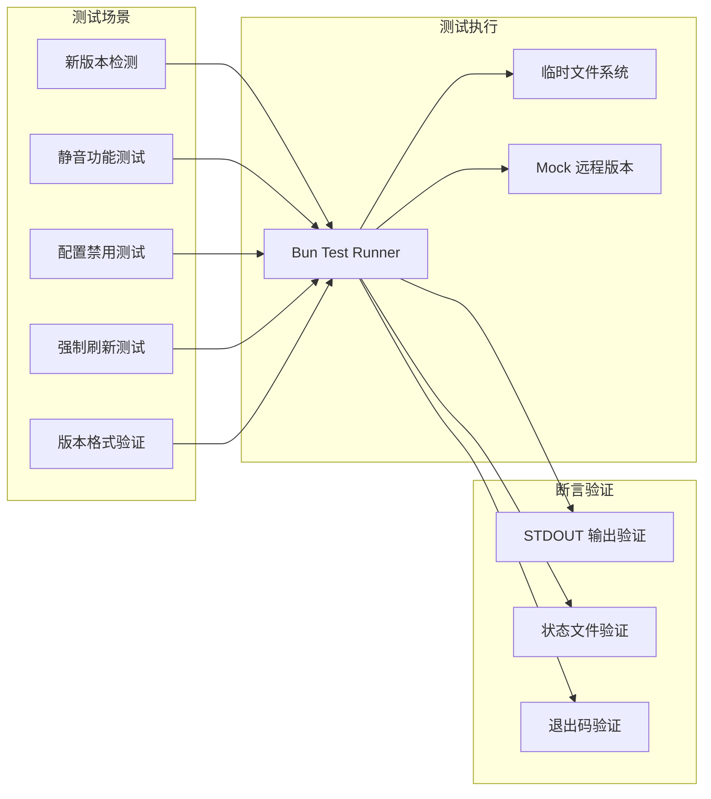
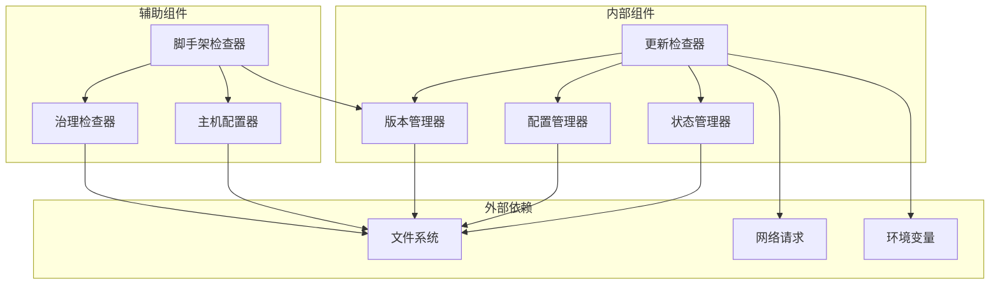
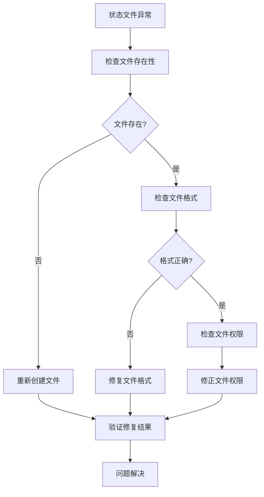

# 远程更新检查系统

<cite>
**本文档引用的文件**
- [package.json](file://package.json)
- [gxpm-update-check](file://bin/gxpm-update-check)
- [update-check.test.ts](file://test/update-check.test.ts)
- [config.ts](file://core/config.ts)
- [version.ts](file://scripts/version.ts)
- [scaffold-check.ts](file://scripts/scaffold-check.ts)
- [governance-check.ts](file://scripts/governance-check.ts)
- [host-config.ts](file://scripts/host-config.ts)
- [install-hooks.ts](file://scripts/install-hooks.ts)
- [post-land-sync.ts](file://scripts/post-land-sync.ts)
- [state.ts](file://core/state.ts)
- [index.ts](file://hosts/index.ts)
</cite>

## 目录
1. [简介](#简介)
2. [项目结构](#项目结构)
3. [核心组件](#核心组件)
4. [架构概览](#架构概览)
5. [详细组件分析](#详细组件分析)
6. [依赖关系分析](#依赖关系分析)
7. [性能考虑](#性能考虑)
8. [故障排除指南](#故障排除指南)
9. [结论](#结论)

## 简介

远程更新检查系统是 gxpm 项目管理运行时的核心功能之一，负责监控和通知用户关于新版本可用性的更新检查机制。该系统通过定期检查远程版本文件来确定本地安装是否需要升级，并提供智能的静音机制、强制刷新功能和状态持久化。

系统采用多层架构设计，包括 Bash 脚本层、配置管理层、状态管理和测试验证层，确保了高可靠性和可维护性。

## 项目结构

gxpm 项目采用模块化组织方式，远程更新检查系统主要分布在以下目录中：



**图表来源**
- [gxpm-update-check](file://bin/gxpm-update-check)
- [config.ts](file://core/config.ts)
- [version.ts](file://scripts/version.ts)
- [scaffold-check.ts](file://scripts/scaffold-check.ts)
- [update-check.test.ts](file://test/update-check.test.ts)

**章节来源**
- [package.json](file://package.json)
- [gxpm-update-check](file://bin/gxpm-update-check)

## 核心组件

### 主要组件概述

远程更新检查系统由以下核心组件构成：

1. **Bash 执行脚本** - 主要的更新检查逻辑实现
2. **配置管理系统** - 处理用户配置和偏好设置
3. **状态持久化层** - 管理检查结果和用户偏好
4. **版本验证工具** - 确保版本格式正确性
5. **测试框架** - 验证系统功能的完整性

### 组件交互流程



**图表来源**
- [gxpm-update-check](file://bin/gxpm-update-check)
- [config.ts](file://core/config.ts)

**章节来源**
- [gxpm-update-check](file://bin/gxpm-update-check)
- [config.ts](file://core/config.ts)

## 架构概览

### 整体架构设计

远程更新检查系统采用分层架构，每层都有明确的职责分工：



**图表来源**
- [gxpm-update-check](file://bin/gxpm-update-check)
- [config.ts](file://core/config.ts)
- [state.ts](file://core/state.ts)

### 数据流架构

系统的数据流遵循严格的单向原则，确保数据一致性和可预测性：



**图表来源**
- [gxpm-update-check](file://bin/gxpm-update-check)

**章节来源**
- [gxpm-update-check](file://bin/gxpm-update-check)

## 详细组件分析

### 更新检查脚本分析

#### 核心功能实现

更新检查脚本是整个系统的核心，实现了完整的版本检查逻辑：



**图表来源**
- [gxpm-update-check](file://bin/gxpm-update-check)

#### 静音机制实现

系统提供了智能的静音功能，允许用户暂时忽略特定版本的更新：

| 静音级别 | 持续时间 | 描述 |
|---------|---------|------|
| 1级 | 24小时 | 临时忽略当前版本更新 |
| 2级 | 48小时 | 中等程度的忽略 |
| 3级 | 7天 | 长期忽略更新 |

**章节来源**
- [gxpm-update-check](file://bin/gxpm-update-check)

### 配置管理系统

#### 配置键值定义

系统支持多种配置选项，通过统一的配置管理器进行处理：



**图表来源**
- [config.ts](file://core/config.ts)

#### 配置优先级层次

配置系统遵循严格的优先级顺序，确保配置的一致性和可预测性：

1. **仓库配置** - 最高优先级，覆盖所有其他配置
2. **全局配置** - 用户级别的默认配置
3. **环境变量** - 运行时的临时覆盖
4. **默认值** - 系统内置的默认行为

**章节来源**
- [config.ts](file://core/config.ts)

### 状态持久化机制

#### 文件系统状态管理

系统使用文件系统作为状态存储，确保跨会话的状态保持：

```mermaid
erDiagram
STATE_FILES {
string last_update_check
string just_upgraded_from
string update_snoozed
string config.json
}
CACHE_ENTRY {
string type
string old_version
string new_version
timestamp created_at
}
SNOOZE_ENTRY {
string version
number level
number epoch
timestamp expires_at
}
CONFIG_ENTRY {
string key
string value
string source
string description
}
STATE_FILES ||--o{ CACHE_ENTRY : contains
STATE_FILES ||--o{ SNOOZE_ENTRY : contains
STATE_FILES ||--o{ CONFIG_ENTRY : contains
```

**图表来源**
- [gxpm-update-check](file://bin/gxpm-update-check)
- [state.ts](file://core/state.ts)

**章节来源**
- [state.ts](file://core/state.ts)

### 测试验证框架

#### 单元测试设计

系统包含全面的测试套件，确保各个组件的功能正确性：



**图表来源**
- [update-check.test.ts](file://test/update-check.test.ts)

**章节来源**
- [update-check.test.ts](file://test/update-check.test.ts)

## 依赖关系分析

### 组件间依赖关系

远程更新检查系统的依赖关系相对简单，主要依赖于配置管理和状态持久化：



**图表来源**
- [gxpm-update-check](file://bin/gxpm-update-check)
- [config.ts](file://core/config.ts)
- [scaffold-check.ts](file://scripts/scaffold-check.ts)

### 外部依赖管理

系统对外部依赖的管理遵循最小化原则：

| 依赖类型 | 用途 | 版本要求 | 替代方案 |
|---------|------|----------|----------|
| Bash Shell | 脚本执行 | GNU Bash 4.0+ | Zsh (部分功能) |
| cURL | 网络请求 | 7.0+ | wget (备用) |
| Git | 版本控制 | 2.0+ | 无直接替代 |
| Node.js | 工具脚本 | 16.0+ | Bun (推荐) |

**章节来源**
- [gxpm-update-check](file://bin/gxpm-update-check)
- [package.json](file://package.json)

## 性能考虑

### 性能优化策略

远程更新检查系统在设计时充分考虑了性能因素：

1. **缓存机制** - 减少不必要的网络请求
2. **智能静音** - 避免重复的更新提示
3. **异步处理** - 非阻塞的检查过程
4. **资源限制** - 网络请求超时控制

### 缓存策略

系统采用多层次的缓存策略来优化性能：

| 缓存类型 | TTL 时间 | 触发条件 | 清除机制 |
|---------|---------|----------|----------|
| 最新状态 | 1分钟 | 成功检查 | 新版本发现 |
| 更新可用 | 12小时 | 发现新版本 | 强制刷新或静音过期 |
| 错误状态 | 5分钟 | 网络错误 | 重试成功 |
| 静音状态 | 24-168小时 | 用户选择 | 时间到期自动清除 |

## 故障排除指南

### 常见问题诊断

#### 配置相关问题

| 问题症状 | 可能原因 | 解决方案 |
|---------|----------|----------|
| 更新检查不工作 | update_check 设置为 false | 运行 `gxpm config set update_check true` |
| 版本格式错误 | VERSION 文件格式不正确 | 检查 VERSION 文件格式为 `x.y.z.w` |
| 权限不足 | 文件权限问题 | 检查 ~/.gxpm 目录权限 |
| 网络连接失败 | 网络代理问题 | 检查网络连接和代理设置 |

#### 状态文件问题



**图表来源**
- [gxpm-update-check](file://bin/gxpm-update-check)

### 调试方法

1. **启用详细日志** - 在环境中设置调试标志
2. **手动执行检查** - 使用 `--force` 参数强制检查
3. **检查状态文件** - 直接查看 ~/.gxpm 目录下的状态文件
4. **网络连通性测试** - 验证远程版本源的可达性

**章节来源**
- [gxpm-update-check](file://bin/gxpm-update-check)

## 结论

远程更新检查系统展现了优秀的软件工程实践，具有以下特点：

1. **模块化设计** - 清晰的组件分离和职责划分
2. **可靠性保证** - 完善的错误处理和恢复机制
3. **用户体验优化** - 智能的静音功能和配置灵活性
4. **可维护性** - 清晰的代码结构和全面的测试覆盖

系统通过合理的架构设计和实现细节，为用户提供了一个稳定、可靠的远程更新检查解决方案。其模块化的特性也为未来的功能扩展和维护提供了良好的基础。