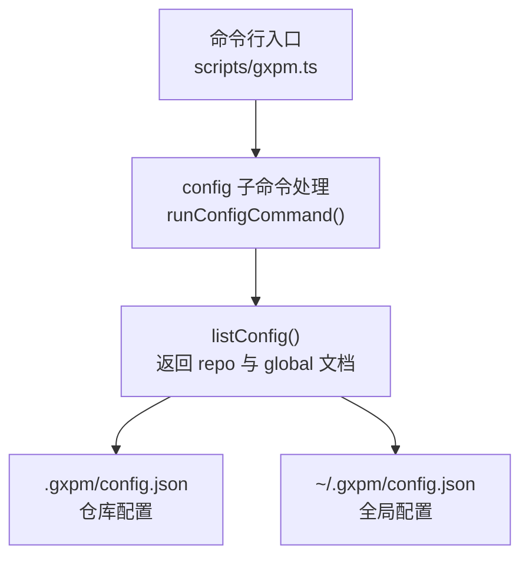
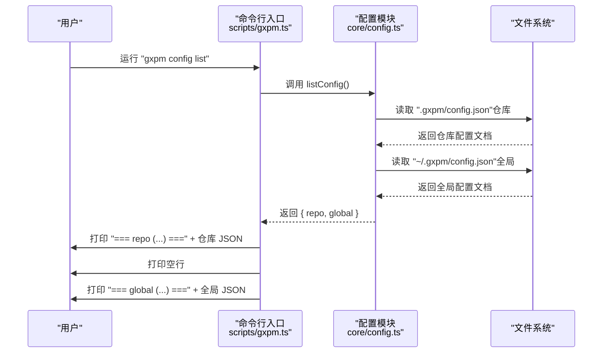
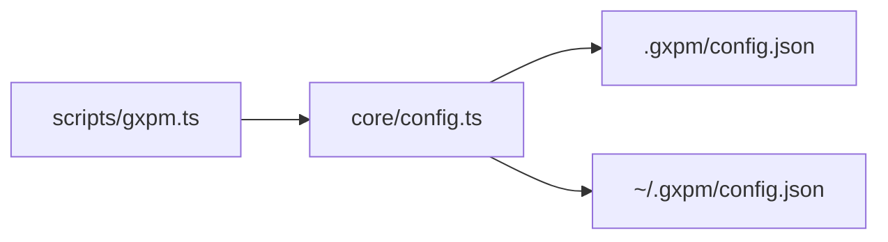

# 列出配置信息

<cite>
**本文档引用的文件**
- [core/config.ts](file://core/config.ts)
- [scripts/gxpm.ts](file://scripts/gxpm.ts)
- [test/config.test.ts](file://test/config.test.ts)
</cite>

## 目录
1. [简介](#简介)
2. [项目结构](#项目结构)
3. [核心组件](#核心组件)
4. [架构总览](#架构总览)
5. [详细组件分析](#详细组件分析)
6. [依赖关系分析](#依赖关系分析)
7. [性能考量](#性能考量)
8. [故障排查指南](#故障排查指南)
9. [结论](#结论)
10. [附录](#附录)

## 简介
本文件面向 gxpm 的配置子系统，聚焦于配置列表命令 gxpm config list 的使用与行为说明。内容涵盖：
- 如何查看仓库配置与全局配置的分层展示
- --json 参数的作用与输出格式
- 配置的默认值、覆盖规则与优先级机制
- 完整的配置输出示例（以路径形式呈现）

## 项目结构
与配置列表功能直接相关的文件与职责如下：
- core/config.ts：配置读写、键值解析、工作树策略解析等核心逻辑
- scripts/gxpm.ts：命令入口与 config 子命令的实现（包含 list、get、set）
- test/config.test.ts：配置行为的单元测试，验证覆盖规则与输出结构

图表来源
- [scripts/gxpm.ts:275-322](file://scripts/gxpm.ts#L275-L322)
- [core/config.ts:98-106](file://core/config.ts#L98-L106)

章节来源
- [scripts/gxpm.ts:49-52](file://scripts/gxpm.ts#L49-L52)
- [core/config.ts:43-50](file://core/config.ts#L43-L50)

## 核心组件
- 配置读取与合并
  - listConfig：同时读取仓库与全局配置文档，返回对象包含 repo 与 global 字段
  - getConfigValue：按“仓库 > 全局 > 未设置”的顺序查找指定键
- 命令行实现
  - runConfigCommand：根据子命令执行 get、set 或 list；list 默认打印两段 JSON，分别标注来源
  - --json：在 list 模式下输出统一的 JSON 对象，包含 repo 与 global 两个字段

章节来源
- [core/config.ts:98-106](file://core/config.ts#L98-L106)
- [core/config.ts:66-79](file://core/config.ts#L66-L79)
- [scripts/gxpm.ts:275-322](file://scripts/gxpm.ts#L275-L322)

## 架构总览
配置列表命令的工作流如下：

图表来源
- [scripts/gxpm.ts:307-319](file://scripts/gxpm.ts#L307-L319)
- [core/config.ts:98-106](file://core/config.ts#L98-L106)

## 详细组件分析

### 组件一：配置读取与输出（listConfig）
- 功能要点
  - 同时读取仓库与全局配置文档，返回对象包含 repo 与 global 两个字段
  - 若配置文件不存在或解析失败，对应字段为空对象
- 输出结构
  - 仓库配置：repo 字段
  - 全局配置：global 字段
- 使用场景
  - 用于命令行 list 模式下的分层展示
  - 也可用于 --json 模式下的统一 JSON 输出

章节来源
- [core/config.ts:98-106](file://core/config.ts#L98-L106)

### 组件二：命令行 list 子命令（runConfigCommand）
- 行为说明
  - 不带参数或子命令时，执行 list
  - 默认输出：先打印仓库配置段落，再打印全局配置段落
  - 支持 --json：输出统一 JSON 对象，包含 repo 与 global 两个字段
- 输出示例（以路径形式描述）
  - 仓库配置段落：打印仓库配置 JSON（路径：.gxpm/config.json）
  - 全局配置段落：打印全局配置 JSON（路径：~/.gxpm/config.json）
  - --json 模式：输出一个对象，包含 repo 与 global 两个字段，字段值为各自配置 JSON

章节来源
- [scripts/gxpm.ts:307-319](file://scripts/gxpm.ts#L307-L319)

### 组件三：配置覆盖规则与优先级
- 查找顺序（单键查询）
  - 仓库配置（.gxpm/config.json）优先
  - 其次是全局配置（~/.gxpm/config.json）
  - 最后为未设置
- 优先级链（工作树策略解析）
  - 1) 仓库配置（repo） > 全局配置（global）
  - 2) 用户消息（当前会话覆盖）
  - 3) AGENTS.md 中的 gxpm Config 区块
  - 4) 默认值：enforcement=optional, default=ask
- 测试验证
  - 单元测试覆盖了仓库优先于全局、AGENTS.md 解析、默认策略等场景

章节来源
- [core/config.ts:66-79](file://core/config.ts#L66-L79)
- [core/config.ts:146-195](file://core/config.ts#L146-L195)
- [test/config.test.ts:13-52](file://test/config.test.ts#L13-L52)
- [test/config.test.ts:87-159](file://test/config.test.ts#L87-L159)

### 组件四：AGENTS.md 配置区块解析
- 作用
  - 从 AGENTS.md 中提取以“## gxpm Config”为标题的配置区块
  - 识别形如 “key: value” 的行，并将其写入配置文档
- 关键点
  - 仅识别包含点号（.）的键名
  - 自动类型归一化（布尔、数字、字符串）
- 用途
  - 作为工作树策略解析的第三级来源

章节来源
- [core/config.ts:108-144](file://core/config.ts#L108-L144)
- [test/config.test.ts:54-85](file://test/config.test.ts#L54-L85)

## 依赖关系分析
- 命令入口对配置模块的依赖
  - scripts/gxpm.ts 通过导入 core/config.ts 的 listConfig、getConfigValue、setConfigValue 等函数实现命令功能
- 配置文件位置
  - 仓库配置：.gxpm/config.json
  - 全局配置：~/.gxpm/config.json

图表来源
- [scripts/gxpm.ts:21-25](file://scripts/gxpm.ts#L21-L25)
- [core/config.ts:43-50](file://core/config.ts#L43-L50)

章节来源
- [scripts/gxpm.ts:21-25](file://scripts/gxpm.ts#L21-L25)
- [core/config.ts:43-50](file://core/config.ts#L43-L50)

## 性能考量
- 文件读取开销
  - listConfig 会进行两次文件读取（仓库与全局），通常为毫秒级
- JSON 解析与序列化
  - 读取与打印 JSON 的成本与配置文档大小成正比
- 建议
  - 在 CI 环境中建议使用 --json 以便机器可读
  - 避免频繁调用导致不必要的磁盘 IO

## 故障排查指南
- 配置文件不存在
  - 现象：对应段落为空对象
  - 处理：首次运行时无需担心，后续可通过 set 写入
- JSON 解析错误
  - 现象：读取失败时返回空对象
  - 处理：检查配置文件格式是否正确
- 权限问题
  - 现象：无法读取或写入配置文件
  - 处理：确认 ~/.gxpm 与仓库根目录下的 .gxpm 目录权限
- 键不存在
  - 现象：单键查询返回未设置
  - 处理：确认键名拼写与层级结构（使用点号分隔）

章节来源
- [core/config.ts:52-59](file://core/config.ts#L52-L59)
- [core/config.ts:66-79](file://core/config.ts#L66-L79)

## 结论
- gxpm config list 提供了清晰的分层视图：仓库配置与全局配置分别展示
- --json 模式提供了统一的机器可读输出，便于自动化集成
- 覆盖规则明确：仓库优先于全局，且工作树策略解析遵循“配置 > 用户消息 > AGENTS.md > 默认”的优先级链

## 附录

### 使用示例（以路径形式描述）
- 查看所有配置（分层展示）
  - 命令：gxpm config list
  - 输出：先打印仓库配置 JSON（路径：.gxpm/config.json），再打印全局配置 JSON（路径：~/.gxpm/config.json）
- 查看所有配置（统一 JSON）
  - 命令：gxpm config list --json
  - 输出：一个包含 repo 与 global 两个字段的对象，字段值分别为各自配置 JSON
- 查看单个键值（参考）
  - 命令：gxpm config get <key>
  - 输出：键值与来源（仓库/全局/未设置）

章节来源
- [scripts/gxpm.ts:307-319](file://scripts/gxpm.ts#L307-L319)

### 配置层级与组织方式
- 层级结构
  - 仓库配置：.gxpm/config.json
  - 全局配置：~/.gxpm/config.json
- 组织方式
  - 采用 JSON 文档存储，支持任意嵌套键
  - 键名使用点号分隔表示层级（例如：worktree.enforcement）

章节来源
- [core/config.ts:35-41](file://core/config.ts#L35-L41)
- [core/config.ts:43-50](file://core/config.ts#L43-L50)

### 默认值与覆盖规则
- 默认值
  - 工作树策略默认：enforcement=optional, default=ask
- 覆盖规则（单键查询）
  - 仓库 > 全局 > 未设置
- 覆盖规则（工作树策略解析）
  - 1) 仓库配置（repo） > 全局配置（global）
  - 2) 用户消息（当前会话覆盖）
  - 3) AGENTS.md 中的 gxpm Config 区块
  - 4) 默认值

章节来源
- [core/config.ts:146-195](file://core/config.ts#L146-L195)
- [test/config.test.ts:87-159](file://test/config.test.ts#L87-L159)