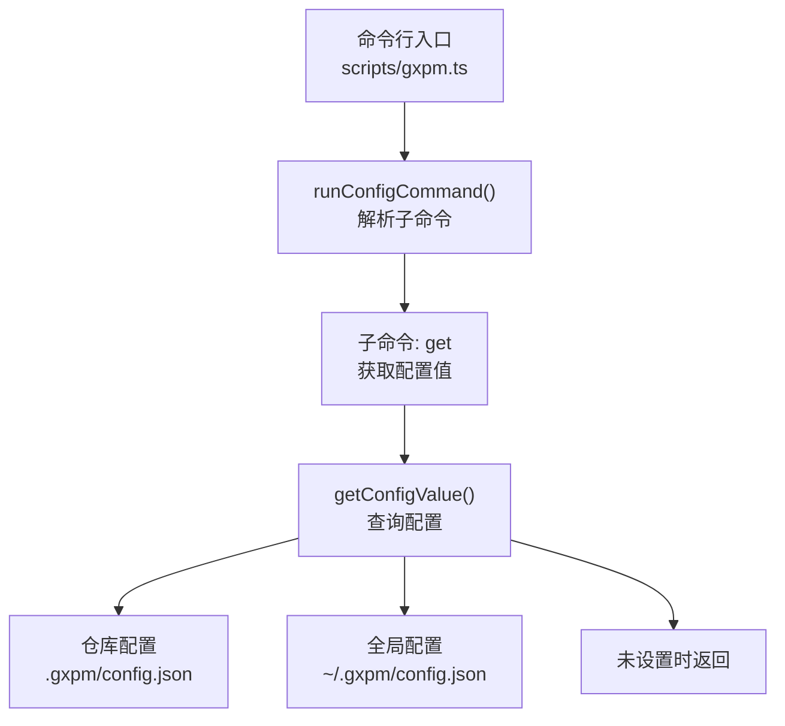
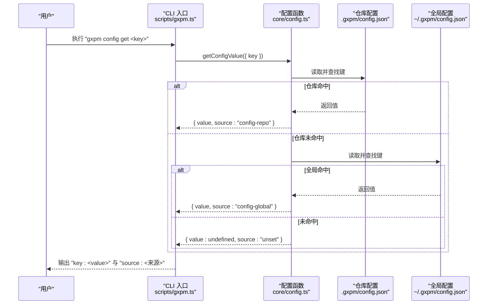
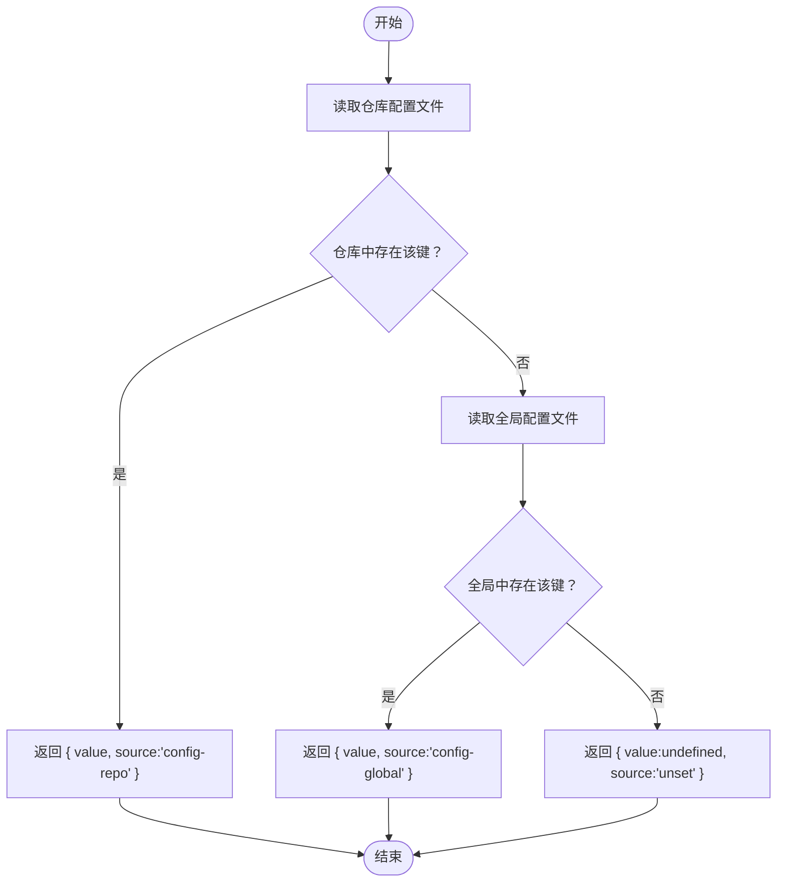
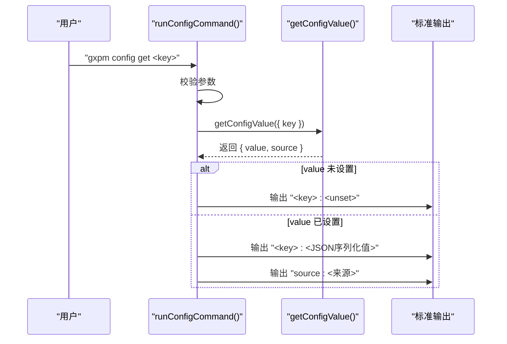
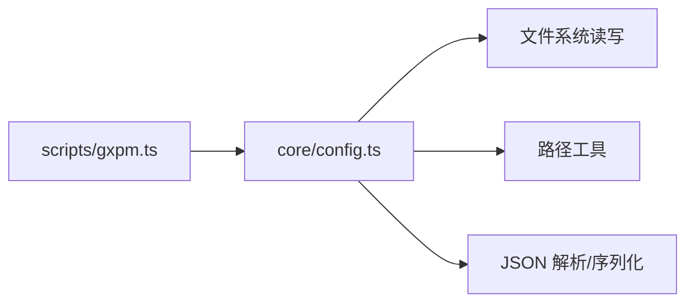

# 获取配置值

<cite>
**本文档引用的文件**
- [core/config.ts](file://core/config.ts)
- [scripts/gxpm.ts](file://scripts/gxpm.ts)
- [test/config.test.ts](file://test/config.test.ts)
</cite>

## 目录
1. [简介](#简介)
2. [项目结构](#项目结构)
3. [核心组件](#核心组件)
4. [架构总览](#架构总览)
5. [详细组件分析](#详细组件分析)
6. [依赖分析](#依赖分析)
7. [性能考虑](#性能考虑)
8. [故障排除指南](#故障排除指南)
9. [结论](#结论)
10. [附录](#附录)

## 简介
本文档详细说明 gxpm 配置子命令中“获取配置值”的使用方法，重点围绕命令 gxpm config get <key>。内容涵盖：
- 如何获取特定配置项的值
- 配置值的来源（仓库配置或全局配置）
- 配置的优先级与作用域
- 实际命令行示例与预期输出
- 配置值格式说明（字符串、数字、布尔值）与未设置配置项的处理方式

## 项目结构
与“获取配置值”功能直接相关的代码分布在以下位置：
- 核心配置逻辑：core/config.ts
- CLI 命令入口与解析：scripts/gxpm.ts
- 行为与边界测试：test/config.test.ts

图表来源
- [scripts/gxpm.ts:275-329](file://scripts/gxpm.ts#L275-L329)
- [core/config.ts:66-79](file://core/config.ts#L66-L79)

章节来源
- [scripts/gxpm.ts:275-329](file://scripts/gxpm.ts#L275-L329)
- [core/config.ts:66-79](file://core/config.ts#L66-L79)

## 核心组件
- 配置获取函数：getConfigValue
  - 功能：根据键名查找配置值，按“仓库配置优先于全局配置”的顺序进行查找，并返回值与来源。
  - 返回：包含 value 与 source 的对象；当未找到时 value 为 undefined，source 为 "unset"。
- CLI 子命令：config get
  - 功能：接收一个键名参数，调用 getConfigValue 并打印结果与来源；若未设置则输出占位标记。
  - 参数：必需键名；无额外选项。
- 配置值格式解析
  - 字符串：保持原样
  - 布尔值："true"/"false" 解析为布尔
  - 数字：整数字符串解析为数字
  - 其他：保持字符串

章节来源
- [core/config.ts:66-79](file://core/config.ts#L66-L79)
- [scripts/gxpm.ts:281-291](file://scripts/gxpm.ts#L281-L291)
- [scripts/gxpm.ts:324-329](file://scripts/gxpm.ts#L324-L329)

## 架构总览
下图展示了“获取配置值”的端到端流程：命令行输入经 CLI 解析后调用核心配置函数，核心函数按优先级从仓库配置与全局配置中查找，最终返回值与来源。

图表来源
- [scripts/gxpm.ts:281-291](file://scripts/gxpm.ts#L281-L291)
- [core/config.ts:66-79](file://core/config.ts#L66-L79)

## 详细组件分析

### 组件：配置获取函数 getConfigValue
- 输入：root（仓库根）、home（用户主目录）、key（点分路径键名）
- 查找策略：
  - 先读取仓库配置文件（.gxpm/config.json），按键路径查找
  - 若未找到，则读取全局配置文件（~/.gxpm/config.json），按键路径查找
  - 若仍未找到，返回未设置
- 键路径解析：使用点号分隔的层级路径，逐层访问嵌套对象
- 返回值：包含 value 与 source 的对象
  - value：查找到的值（unknown 类型）
  - source：来源标识，可能为 "config-repo"、"config-global" 或 "unset"

图表来源
- [core/config.ts:66-79](file://core/config.ts#L66-L79)
- [core/config.ts:202-210](file://core/config.ts#L202-L210)

章节来源
- [core/config.ts:66-79](file://core/config.ts#L66-L79)
- [core/config.ts:202-210](file://core/config.ts#L202-L210)

### 组件：CLI 子命令 config get
- 命令格式：gxpm config get <key>
- 行为：
  - 校验参数数量（必须提供键名）
  - 调用 getConfigValue 获取值与来源
  - 输出格式：
    - 若值未设置：输出 "key: <unset>"
    - 若值已设置：输出 "key: <JSON序列化的值>" 与 "source: <来源>"
- 作用域：
  - 仓库配置优先于全局配置
  - 未设置时不会抛错，而是输出占位标记

图表来源
- [scripts/gxpm.ts:281-291](file://scripts/gxpm.ts#L281-L291)

章节来源
- [scripts/gxpm.ts:281-291](file://scripts/gxpm.ts#L281-L291)

### 组件：配置值格式与未设置处理
- 支持的值类型：
  - 字符串：保持原样
  - 布尔值："true" 与 "false" 解析为布尔
  - 数字：整数字符串解析为数字
  - 其他：保持字符串
- 未设置处理：
  - 当键不存在时，返回 source 为 "unset"，value 为 undefined
  - CLI 将输出占位标记以便用户识别

章节来源
- [scripts/gxpm.ts:324-329](file://scripts/gxpm.ts#L324-L329)
- [scripts/gxpm.ts:284-289](file://scripts/gxpm.ts#L284-L289)

## 依赖分析
- CLI 依赖核心配置模块：
  - scripts/gxpm.ts 导入并使用 getConfigValue
  - 通过 runConfigCommand 分发子命令
- 核心配置模块依赖：
  - 文件系统读写：读取与写入 .gxpm/config.json
  - 路径工具：拼接仓库与全局配置文件路径
  - 键路径解析与赋值：支持点分路径的嵌套对象访问

图表来源
- [scripts/gxpm.ts:20-25](file://scripts/gxpm.ts#L20-L25)
- [core/config.ts:1-3](file://core/config.ts#L1-L3)

章节来源
- [scripts/gxpm.ts:20-25](file://scripts/gxpm.ts#L20-L25)
- [core/config.ts:1-3](file://core/config.ts#L1-L3)

## 性能考虑
- IO 开销：每次查询都会尝试读取仓库与全局配置文件，建议在批量查询场景中缓存结果
- 文件系统访问：读取 .gxpm/config.json 与 ~/.gxpm/config.json 属于轻量 IO，通常可忽略
- 键路径解析：按点分路径逐层访问，复杂度与键深度线性相关

## 故障排除指南
- 未找到键
  - 现象：输出 "key: <unset>"
  - 处理：确认键名是否正确，检查仓库或全局配置文件是否存在
- 权限问题
  - 现象：读取配置文件失败
  - 处理：确保对 .gxpm/config.json 与 ~/.gxpm/config.json 的读权限
- 配置文件损坏
  - 现象：读取 JSON 失败，返回空配置
  - 处理：修复或删除损坏的配置文件，使其符合 JSON 格式
- 值类型不符合预期
  - 现象：CLI 输出的值为字符串而非期望的布尔/数字
  - 处理：确认输入值是否为 "true"/"false" 或整数字符串

章节来源
- [core/config.ts:52-59](file://core/config.ts#L52-L59)
- [scripts/gxpm.ts:284-289](file://scripts/gxpm.ts#L284-L289)

## 结论
- gxpm config get <key> 提供了简单可靠的配置值查询能力
- 仓库配置优先于全局配置，未设置时会明确提示
- CLI 输出清晰，便于自动化与手工使用
- 建议在脚本中结合 --json 使用其他子命令以获取更完整的配置视图

## 附录

### 命令行示例与预期输出
- 查询已设置的字符串值
  - 示例：gxpm config get key.string
  - 预期输出：
    - key.string: "<字符串值>"
    - source:  config-repo 或 config-global
- 查询已设置的布尔值
  - 示例：gxpm config get key.bool
  - 预期输出：
    - key.bool: true/false
    - source:  config-repo 或 config-global
- 查询已设置的数字值
  - 示例：gxpm config get key.number
  - 预期输出：
    - key.number: <数字>
    - source:  config-repo 或 config-global
- 查询未设置的键
  - 示例：gxpm config get nonexistent.key
  - 预期输出：
    - nonexistent.key: <unset>

章节来源
- [scripts/gxpm.ts:281-291](file://scripts/gxpm.ts#L281-L291)

### 配置值格式说明
- 字符串：保持原样
- 布尔值：true/false（字符串形式）
- 数字：整数（字符串形式）
- 其他：字符串

章节来源
- [scripts/gxpm.ts:324-329](file://scripts/gxpm.ts#L324-L329)

### 优先级与作用域
- 优先级：仓库配置 > 全局配置 > 未设置
- 作用域：
  - 仓库配置：位于仓库根目录下的 .gxpm/config.json
  - 全局配置：位于用户主目录下的 ~/.gxpm/config.json
- 未设置：当键在仓库与全局均不存在时，返回 source 为 unset

章节来源
- [core/config.ts:66-79](file://core/config.ts#L66-L79)