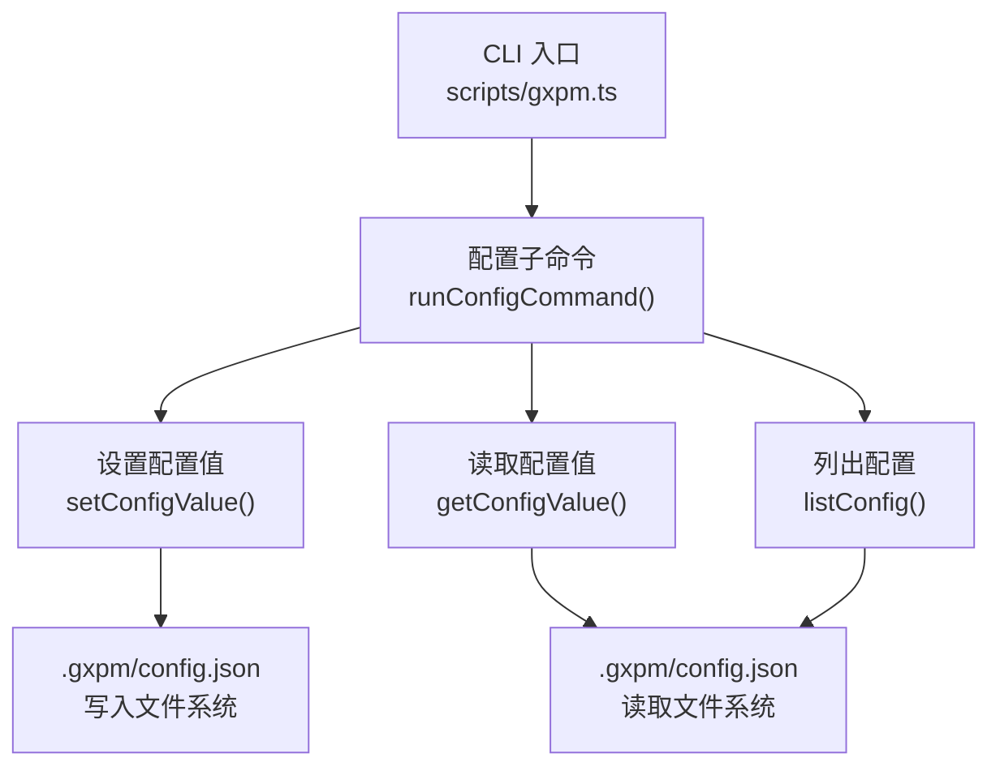
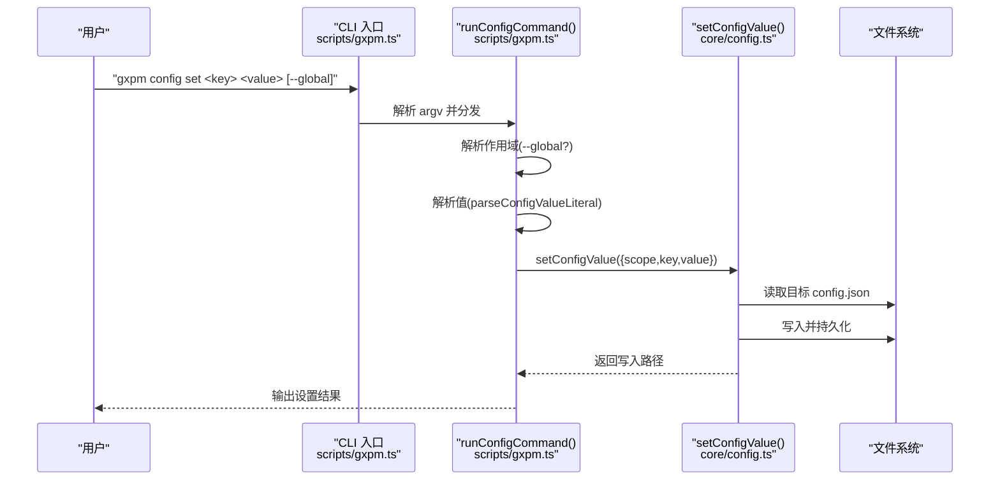
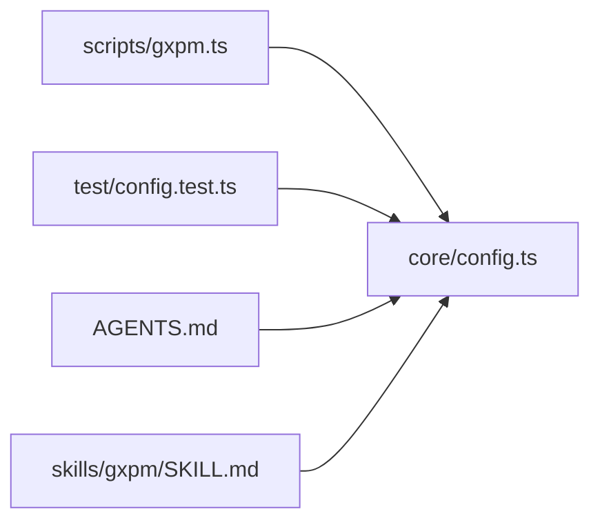

# 设置配置值

<cite>
**本文引用的文件列表**
- [scripts/gxpm.ts](file://scripts/gxpm.ts)
- [core/config.ts](file://core/config.ts)
- [test/config.test.ts](file://test/config.test.ts)
- [AGENTS.md](file://AGENTS.md)
- [skills/gxpm/SKILL.md](file://skills/gxpm/SKILL.md)
</cite>

## 目录
1. [简介](#简介)
2. [项目结构](#项目结构)
3. [核心组件](#核心组件)
4. [架构总览](#架构总览)
5. [详细组件分析](#详细组件分析)
6. [依赖关系分析](#依赖关系分析)
7. [性能考量](#性能考量)
8. [故障排查指南](#故障排查指南)
9. [结论](#结论)
10. [附录](#附录)

## 简介
本章节面向使用 gxpm 的用户与维护者，系统性说明配置设置命令 gxpm config set <key> <value> [--global] 的使用方式与行为边界。内容涵盖：
- 全局配置与仓库配置的区别及优先级
- --global 参数的作用与生效范围
- 各类数据类型（字符串、数字、布尔值）的设置要点
- 配置值的持久化机制与写入位置
- 错误处理与配置验证的相关信息

## 项目结构
与配置设置命令直接相关的代码分布在以下模块：
- CLI 入口与子命令分发：scripts/gxpm.ts
- 配置读写与解析：core/config.ts
- 行为与用例验证：test/config.test.ts
- 使用示例与策略说明：AGENTS.md、skills/gxpm/SKILL.md

图表来源
- [scripts/gxpm.ts:275-329](file://scripts/gxpm.ts#L275-L329)
- [core/config.ts:66-106](file://core/config.ts#L66-L106)

章节来源
- [scripts/gxpm.ts:275-329](file://scripts/gxpm.ts#L275-L329)
- [core/config.ts:43-106](file://core/config.ts#L43-L106)

## 核心组件
- 配置设置命令 runConfigCommand(subcommand="set")
  - 负责解析参数、选择作用域（仓库或全局）、调用 setConfigValue 并输出结果
- 配置写入 setConfigValue(input)
  - 根据 scope 决定写入路径（仓库 .gxpm/config.json 或全局 ~/.gxpm/config.json）
  - 将键值对写入 JSON 文档并持久化
- 配置读取 getConfigValue(input)
  - 优先读取仓库配置，其次读取全局配置，最后返回未设置
- 配置列表 listConfig(input)
  - 同时返回仓库与全局配置文档，便于对比与诊断

章节来源
- [scripts/gxpm.ts:275-329](file://scripts/gxpm.ts#L275-L329)
- [core/config.ts:66-106](file://core/config.ts#L66-L106)

## 架构总览
下图展示 gxpm config set 的端到端流程，包括参数解析、作用域判定、值解析与持久化。

图表来源
- [scripts/gxpm.ts:275-329](file://scripts/gxpm.ts#L275-L329)
- [core/config.ts:81-96](file://core/config.ts#L81-L96)

## 详细组件分析

### 命令语法与参数
- 语法
  - gxpm config set <key> <value> [--global]
- 参数说明
  - key：配置键，支持点号分隔的层级（例如 worktree.enforcement）
  - value：配置值，支持字符串、数字、布尔值
  - --global：可选标志，指定写入全局配置（默认写入仓库配置）

章节来源
- [scripts/gxpm.ts:293-305](file://scripts/gxpm.ts#L293-L305)

### 作用域与优先级
- 作用域
  - 仓库配置：写入当前仓库根目录下的 .gxpm/config.json
  - 全局配置：写入用户主目录下的 ~/.gxpm/config.json
- 优先级
  - 仓库配置优先于全局配置
  - 在策略解析等场景中，config.json（仓库/全局）优先于其他来源

章节来源
- [core/config.ts:43-50](file://core/config.ts#L43-L50)
- [core/config.ts:66-79](file://core/config.ts#L66-L79)
- [skills/gxpm/SKILL.md:299-309](file://skills/gxpm/SKILL.md#L299-L309)

### 值解析与类型处理
- 字符串
  - 未加引号的原始字符串按字符串存储
  - 若需要包含冒号或特殊字符，请使用引号包裹
- 数字
  - 匹配整数模式的字符串会被解析为数字
- 布尔值
  - 字面量 true/false 会被解析为布尔值
- 嵌套对象
  - 通过点号分隔的键名自动构建嵌套对象结构

章节来源
- [scripts/gxpm.ts:324-329](file://scripts/gxpm.ts#L324-L329)
- [core/config.ts:212-221](file://core/config.ts#L212-L221)

### 持久化机制与写入位置
- 写入逻辑
  - 读取目标 config.json（不存在则为空文档）
  - 将键值对写入对应层级
  - 递归创建目录并写回 JSON 文件（缩进格式化）
- 写入位置
  - 仓库配置：$REPO_ROOT/.gxpm/config.json
  - 全局配置：$HOME/.gxpm/config.json

章节来源
- [core/config.ts:52-64](file://core/config.ts#L52-L64)
- [core/config.ts:81-96](file://core/config.ts#L81-L96)

### 读取与验证
- 读取
  - getConfigValue(key) 返回值与来源（config-repo / config-global / unset）
- 列表
  - listConfig() 返回仓库与全局配置文档，便于比对
- 解析 AGENTS.md 中的 gxpm Config 段
  - 支持 worktree.enforcement 与 worktree.default 的解析

章节来源
- [core/config.ts:66-106](file://core/config.ts#L66-L106)
- [core/config.ts:114-144](file://core/config.ts#L114-L144)

### 错误处理与边界条件
- 参数校验
  - 缺少 key 或 value 时抛出错误提示
  - 未知子命令时抛出错误
- 值解析
  - parseConfigValueLiteral 仅识别 true/false 与整数模式
  - 其他情况按字符串处理
- 文件异常
  - 读取 config.json 失败时视为空文档，避免中断
  - 写入前确保目录存在

章节来源
- [scripts/gxpm.ts:281-322](file://scripts/gxpm.ts#L281-L322)
- [core/config.ts:52-64](file://core/config.ts#L52-L64)

### 使用示例与最佳实践
- 设置仓库级配置
  - gxpm config set worktree.enforcement required
- 设置全局配置
  - gxpm config set worktree.default use --global
- 查看配置来源
  - gxpm config get worktree.enforcement
- 列出所有配置
  - gxpm config list

章节来源
- [skills/gxpm/SKILL.md:315-322](file://skills/gxpm/SKILL.md#L315-L322)
- [AGENTS.md:33-38](file://AGENTS.md#L33-L38)

## 依赖关系分析
- CLI 依赖 core/config 提供的配置读写能力
- 配置读写依赖 Node.js 文件系统 API
- 测试覆盖了仓库/全局作用域、优先级与列表输出

图表来源
- [scripts/gxpm.ts:21-25](file://scripts/gxpm.ts#L21-L25)
- [core/config.ts:1-229](file://core/config.ts#L1-L229)
- [test/config.test.ts:5-11](file://test/config.test.ts#L5-L11)

章节来源
- [scripts/gxpm.ts:21-25](file://scripts/gxpm.ts#L21-L25)
- [test/config.test.ts:5-11](file://test/config.test.ts#L5-L11)

## 性能考量
- 单次 set/get 操作为 O(n) 层级查找，n 为键的层级深度
- 文件读写为磁盘 IO，通常开销较小
- 建议批量修改时尽量减少重复写入，必要时通过 listConfig 合理组织后再一次性写入

## 故障排查指南
- 问题：设置后读取不到或读取到错误值
  - 检查是否正确使用 --global
  - 使用 gxpm config list 对比仓库与全局配置
- 问题：值被解析为意外类型
  - 确认输入是否符合 true/false 或整数模式
  - 需要字符串时请使用引号包裹
- 问题：权限不足导致写入失败
  - 确认目标目录可写（仓库或用户主目录）
- 问题：AGENTS.md 中的配置覆盖预期
  - 注意策略解析优先级：config.json 优先于 AGENTS.md

章节来源
- [scripts/gxpm.ts:281-322](file://scripts/gxpm.ts#L281-L322)
- [core/config.ts:66-79](file://core/config.ts#L66-L79)
- [skills/gxpm/SKILL.md:299-309](file://skills/gxpm/SKILL.md#L299-L309)

## 结论
- gxpm config set 支持仓库与全局两种作用域，仓库优先级更高
- 值解析遵循最小语义化原则：true/false 与整数模式自动转换，其余按字符串处理
- 配置持久化采用 JSON 文件，分别位于仓库与用户主目录
- 建议在团队协作中优先使用仓库配置以保证一致性，并通过 list/get 辅助排错

## 附录

### 数据类型与示例
- 字符串
  - 示例：gxpm config set key "some string"
- 数字
  - 示例：gxpm config set timeout 3000
- 布尔值
  - 示例：gxpm config set debug true
- 嵌套对象
  - 示例：gxpm config set worktree.enforcement required

章节来源
- [scripts/gxpm.ts:324-329](file://scripts/gxpm.ts#L324-L329)
- [core/config.ts:212-221](file://core/config.ts#L212-L221)

### 优先级与来源
- 策略解析优先级（最高到最低）
  - 1) 仓库 config.json
  - 2) 全局 config.json
  - 3) 用户消息（当前对话）
  - 4) AGENTS.md 中的 gxpm Config 段
  - 5) 默认值

章节来源
- [skills/gxpm/SKILL.md:299-309](file://skills/gxpm/SKILL.md#L299-L309)
- [core/config.ts:153-195](file://core/config.ts#L153-L195)