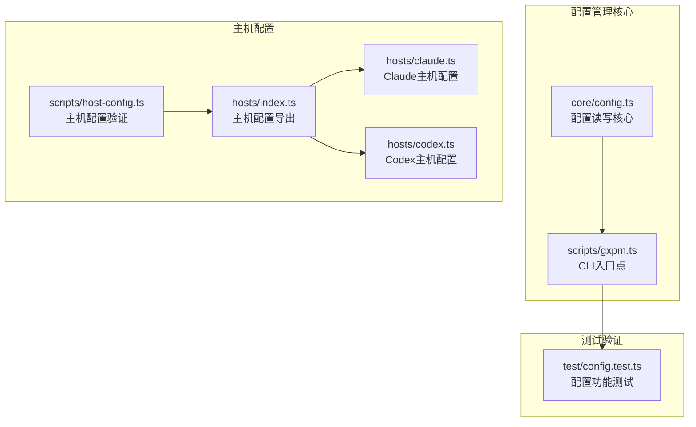
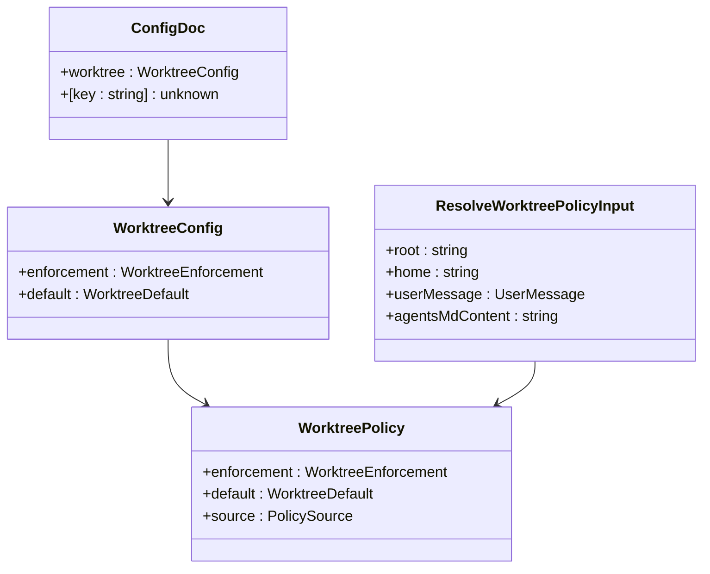
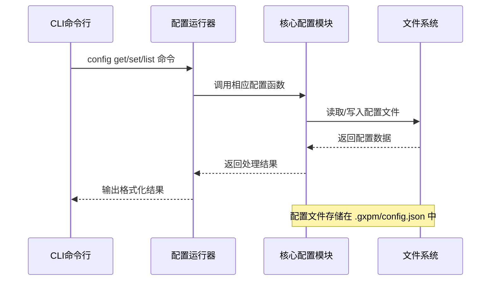
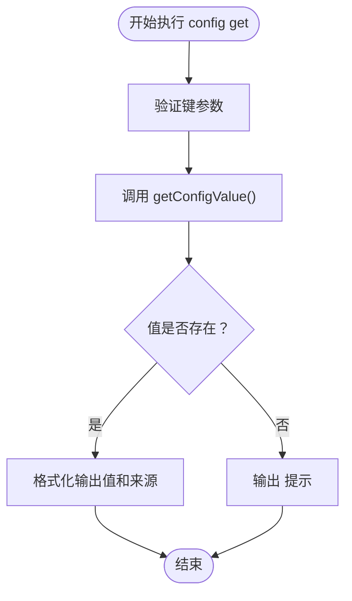
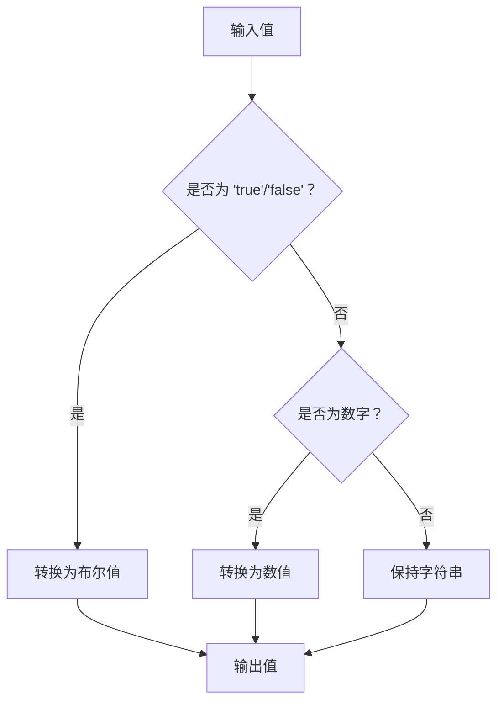
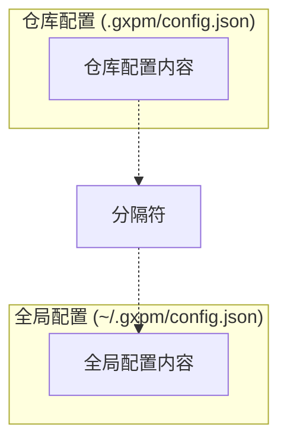
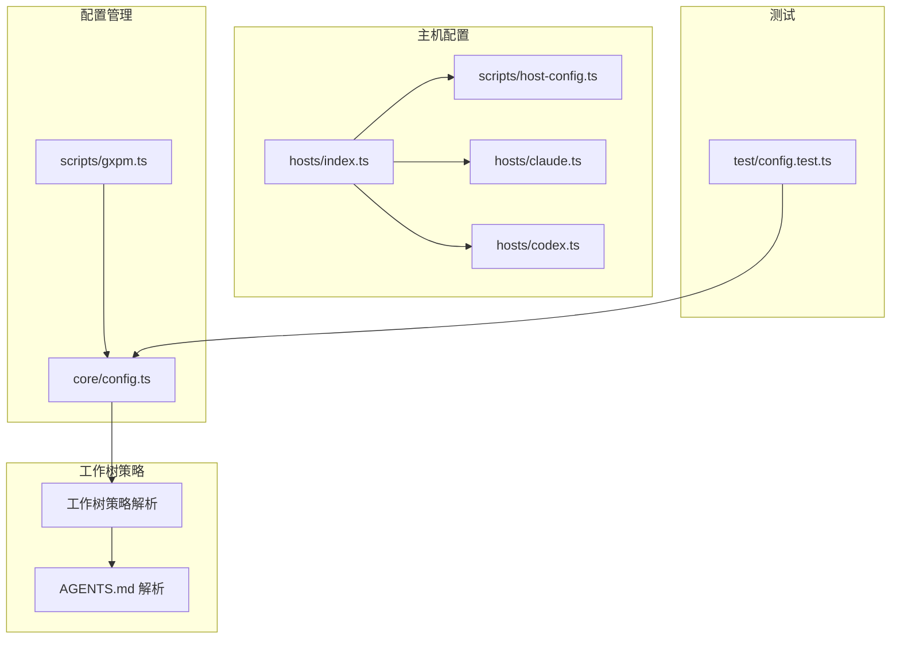

# 配置管理命令

<cite>
**本文档引用的文件**
- [core/config.ts](file://core/config.ts)
- [scripts/gxpm.ts](file://scripts/gxpm.ts)
- [test/config.test.ts](file://test/config.test.ts)
- [scripts/host-config.ts](file://scripts/host-config.ts)
- [hosts/index.ts](file://hosts/index.ts)
- [hosts/claude.ts](file://hosts/claude.ts)
- [hosts/codex.ts](file://hosts/codex.ts)
</cite>

## 目录
1. [简介](#简介)
2. [项目结构](#项目结构)
3. [核心组件](#核心组件)
4. [架构概览](#架构概览)
5. [详细组件分析](#详细组件分析)
6. [依赖关系分析](#依赖关系分析)
7. [性能考虑](#性能考虑)
8. [故障排除指南](#故障排除指南)
9. [结论](#结论)
10. [附录](#附录)

## 简介

本文件详细记录了 gxpm 项目中配置管理命令的功能和实现。配置管理命令提供了一个完整的配置系统，支持全局配置和仓库配置两种作用域，具有明确的优先级规则和层次结构。该系统主要用于管理工作树策略、主机配置等关键设置。

## 项目结构

配置管理功能分布在以下关键文件中：



**图表来源**
- [core/config.ts:1-229](file://core/config.ts#L1-L229)
- [scripts/gxpm.ts:275-329](file://scripts/gxpm.ts#L275-L329)

**章节来源**
- [core/config.ts:1-229](file://core/config.ts#L1-L229)
- [scripts/gxpm.ts:275-329](file://scripts/gxpm.ts#L275-L329)

## 核心组件

### 配置数据结构

配置系统基于 JSON 文档结构，支持嵌套键值对：



**图表来源**
- [core/config.ts:35-41](file://core/config.ts#L35-L41)
- [core/config.ts:8-12](file://core/config.ts#L8-L12)
- [core/config.ts:21-33](file://core/config.ts#L21-L33)

### 配置作用域和路径

配置系统支持两种作用域：

| 作用域 | 文件路径 | 描述 |
|--------|----------|------|
| 仓库配置 | `{repo-root}/.gxpm/config.json` | 项目特定配置，优先级最高 |
| 全局配置 | `{home-dir}/.gxpm/config.json` | 用户级配置，优先级较低 |

**章节来源**
- [core/config.ts:43-50](file://core/config.ts#L43-L50)

## 架构概览

配置管理采用分层架构设计，实现了清晰的关注点分离：



**图表来源**
- [scripts/gxpm.ts:275-329](file://scripts/gxpm.ts#L275-L329)
- [core/config.ts:66-106](file://core/config.ts#L66-L106)

## 详细组件分析

### config get 命令

`config get` 命令用于获取指定配置项的值，并显示其来源。

#### 功能特性

- 支持任意深度的嵌套键访问（如 `worktree.enforcement`）
- 自动检测配置项来源（仓库或全局）
- 当配置项不存在时返回 `<unset>` 提示

#### 执行流程



**图表来源**
- [scripts/gxpm.ts:281-290](file://scripts/gxpm.ts#L281-L290)
- [core/config.ts:66-79](file://core/config.ts#L66-L79)

#### 实际使用示例

```bash
# 获取工作树强制策略
$ gxpm config get worktree.enforcement
worktree.enforcement: required
source:  config-repo

# 获取未设置的配置项
$ gxpm config get nonexistent.key
nonexistent.key: <unset>
```

**章节来源**
- [scripts/gxpm.ts:281-290](file://scripts/gxpm.ts#L281-L290)
- [test/config.test.ts:13-20](file://test/config.test.ts#L13-L20)

### config set 呼叫

`config set` 命令用于设置配置项的值，支持全局和仓库两种作用域。

#### 功能特性

- 支持布尔值、数字、字符串自动类型转换
- 可通过 `--global` 参数选择全局作用域
- 自动创建必要的目录结构
- 返回写入的完整文件路径

#### 类型解析机制



**图表来源**
- [scripts/gxpm.ts:324-329](file://scripts/gxpm.ts#L324-L329)
- [core/config.ts:223-228](file://core/config.ts#L223-L228)

#### 实际使用示例

```bash
# 设置仓库级别的工作树默认行为
$ gxpm config set worktree.default use
set worktree.default = use (repo); wrote /path/to/repo/.gxpm/config.json

# 设置全局级别的工作树强制策略
$ gxpm config set worktree.enforcement required --global
set worktree.enforcement = required (global); wrote /home/user/.gxpm/config.json
```

**章节来源**
- [scripts/gxpm.ts:293-305](file://scripts/gxpm.ts#L293-L305)
- [test/config.test.ts:14-29](file://test/config.test.ts#L14-L29)

### config list 命令

`config list` 命令用于同时显示仓库配置和全局配置的内容。

#### 功能特性

- 同时显示两个作用域的配置内容
- 支持 `--json` 参数输出原始 JSON 格式
- 清晰的分隔标识便于区分配置来源

#### 输出格式



**图表来源**
- [scripts/gxpm.ts:307-319](file://scripts/gxpm.ts#L307-L319)
- [core/config.ts:98-106](file://core/config.ts#L98-L106)

#### 实际使用示例

```bash
# 标准格式输出
$ gxpm config list
=== repo (.gxpm/config.json) ===
{
  "worktree": {
    "enforcement": "required",
    "default": "use"
  }
}

=== global (~/.gxpm/config.json) ===
{
  "worktree": {
    "default": "skip"
  }
}

# JSON 格式输出
$ gxpm config list --json
{
  "repo": {
    "worktree": {
      "enforcement": "required",
      "default": "use"
    }
  },
  "global": {
    "worktree": {
      "default": "skip"
    }
  }
}
```

**章节来源**
- [scripts/gxpm.ts:307-319](file://scripts/gxpm.ts#L307-L319)
- [test/config.test.ts:42-52](file://test/config.test.ts#L42-L52)

## 依赖关系分析

配置系统与其他组件的依赖关系如下：



**图表来源**
- [core/config.ts:146-195](file://core/config.ts#L146-L195)
- [scripts/gxpm.ts:21-25](file://scripts/gxpm.ts#L21-L25)
- [scripts/host-config.ts:11-23](file://scripts/host-config.ts#L11-L23)

**章节来源**
- [core/config.ts:146-195](file://core/config.ts#L146-L195)
- [scripts/gxpm.ts:21-25](file://scripts/gxpm.ts#L21-L25)

## 性能考虑

配置系统在设计时考虑了以下性能因素：

### 文件I/O优化
- 使用同步文件操作确保配置读写的原子性
- 配置文件采用 JSON 格式，解析效率高
- 目录结构简单，避免深层嵌套

### 内存使用
- 配置文档在内存中以对象形式存储
- 支持大配置文档的渐进式加载
- 键值查找采用递归遍历，时间复杂度 O(n)

### 缓存策略
- 配置读取后不会缓存到内存中
- 每次读取都从磁盘重新加载，保证数据一致性

## 故障排除指南

### 常见问题及解决方案

#### 配置项不存在
**现象**: `config get` 返回 `<unset>`
**原因**: 配置项未设置或拼写错误
**解决**: 使用 `config set` 设置配置项，或检查键名拼写

#### 权限不足
**现象**: `config set` 报错权限不足
**原因**: 没有写入目标配置文件的权限
**解决**: 检查 `.gxpm` 目录的写权限，或使用管理员权限

#### JSON格式错误
**现象**: 配置文件损坏导致读取失败
**原因**: 手动编辑配置文件时格式错误
**解决**: 删除损坏的配置文件，系统会自动重建

#### 作用域混淆
**现象**: 配置未按预期生效
**原因**: 在错误的作用域设置了配置
**解决**: 明确区分仓库配置和全局配置的使用场景

**章节来源**
- [test/config.test.ts:13-52](file://test/config.test.ts#L13-L52)

## 结论

配置管理命令提供了完整、可靠的配置管理系统，具有以下特点：

1. **清晰的层次结构**: 支持仓库级和用户级配置，避免冲突
2. **明确的优先级规则**: 仓库配置优先于全局配置
3. **完整的功能覆盖**: 支持查询、设置、列表等基本操作
4. **强类型支持**: 自动类型转换，提升用户体验
5. **可扩展性**: 易于添加新的配置项和作用域

该系统为 gxpm 项目的配置管理提供了坚实的基础，支持工作流自动化和个性化定制需求。

## 附录

### 配置最佳实践

#### 工作树策略配置
- **仓库级别**: 适用于项目特定的工作流要求
- **用户级别**: 适用于个人开发习惯的默认设置
- **优先级**: 仓库配置总是优先于全局配置

#### 主机配置管理
- 使用 `--global` 参数管理跨项目的主机配置
- 为不同主机类型设置合适的安装策略
- 定期验证主机配置的有效性

#### 配置备份建议
- 定期备份 `.gxpm/config.json` 文件
- 在团队项目中共享标准的仓库配置模板
- 使用版本控制管理重要的配置变更