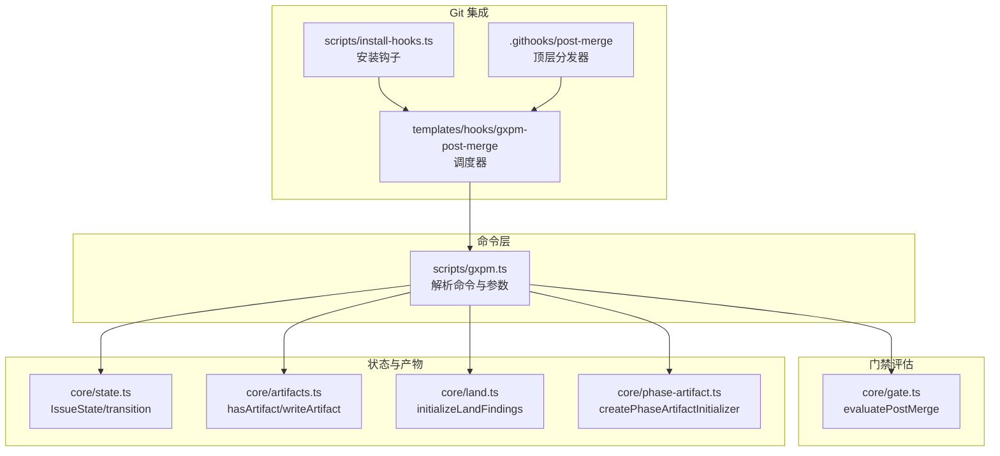
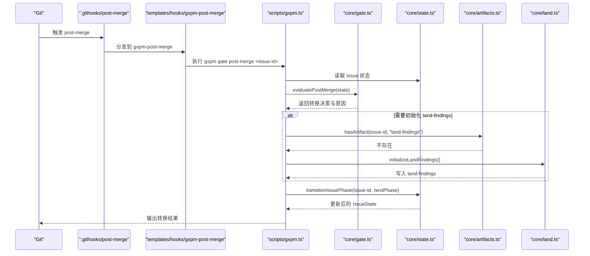
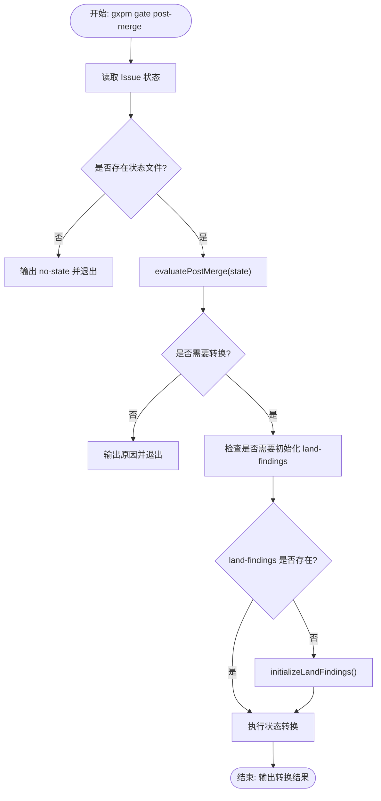
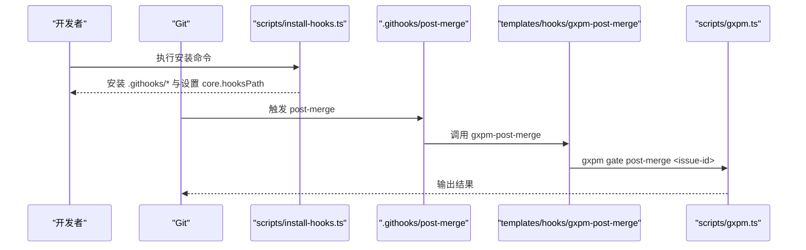
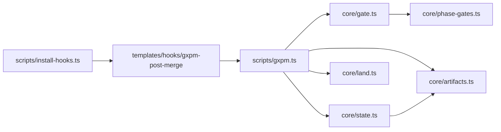

# 合并后门禁检查

<cite>
**本文引用的文件**
- [core/gate.ts](file://core/gate.ts)
- [scripts/gxpm.ts](file://scripts/gxpm.ts)
- [core/state.ts](file://core/state.ts)
- [core/phase-gates.ts](file://core/phase-gates.ts)
- [core/artifacts.ts](file://core/artifacts.ts)
- [core/land.ts](file://core/land.ts)
- [core/phase-artifact.ts](file://core/phase-artifact.ts)
- [scripts/install-hooks.ts](file://scripts/install-hooks.ts)
- [.githooks/post-merge](file://.githooks/post-merge)
- [templates/hooks/gxpm-post-merge](file://templates/hooks/gxpm-post-merge)
- [test/gate-cli.test.ts](file://test/gate-cli.test.ts)
- [test/land-gate.test.ts](file://test/land-gate.test.ts)
- [README.md](file://README.md)
</cite>

## 目录
1. [简介](#简介)
2. [项目结构](#项目结构)
3. [核心组件](#核心组件)
4. [架构总览](#架构总览)
5. [详细组件分析](#详细组件分析)
6. [依赖关系分析](#依赖关系分析)
7. [性能考量](#性能考量)
8. [故障排查指南](#故障排查指南)
9. [结论](#结论)
10. [附录](#附录)

## 简介
本文档聚焦于合并后门禁检查（post-merge gate）在 gxpm 工作流中的设计与使用，系统性说明 gxpm gate post-merge 命令的功能、参数、状态转换逻辑、自动初始化机制、与项目生命周期的关联，以及与 Git hooks 的集成方式和合并后的后续步骤。读者无需深入源码即可理解如何在合并完成后自动推进流程、确保产物完备与状态一致。

## 项目结构
围绕合并后门禁检查的关键文件与职责如下：
- 核心门禁评估：core/gate.ts 提供 evaluatePostMerge 与通用门禁类型定义
- CLI 命令入口：scripts/gxpm.ts 解析并执行 gxpm gate post-merge
- 状态机与事件：core/state.ts 定义 IssueState、状态转换与事件记录
- 阶段门禁规则：core/phase-gates.ts 定义阶段间必需产物与命令
- 产物读写：core/artifacts.ts 提供产物存在性判断与写入
- 特定阶段产物初始化器：core/land.ts、core/phase-artifact.ts
- Git hooks 集成：scripts/install-hooks.ts、.githooks/post-merge、templates/hooks/gxpm-post-merge
- 行为验证：test/gate-cli.test.ts、test/land-gate.test.ts



**图表来源**
- [scripts/gxpm.ts:665-691](file://scripts/gxpm.ts#L665-L691)
- [core/gate.ts:132-143](file://core/gate.ts#L132-L143)
- [core/state.ts:150-205](file://core/state.ts#L150-L205)
- [core/artifacts.ts:120-125](file://core/artifacts.ts#L120-L125)
- [core/land.ts:3-15](file://core/land.ts#L3-L15)
- [core/phase-artifact.ts:16-32](file://core/phase-artifact.ts#L16-L32)
- [scripts/install-hooks.ts:50-103](file://scripts/install-hooks.ts#L50-L103)
- [templates/hooks/gxpm-post-merge:1-22](file://templates/hooks/gxpm-post-merge#L1-L22)
- [.githooks/post-merge:1-9](file://.githooks/post-merge#L1-L9)

**章节来源**
- [README.md:29-46](file://README.md#L29-L46)
- [scripts/gxpm.ts:33-273](file://scripts/gxpm.ts#L33-L273)
- [core/gate.ts:8-143](file://core/gate.ts#L8-L143)
- [core/state.ts:28-205](file://core/state.ts#L28-L205)
- [core/phase-gates.ts:25-99](file://core/phase-gates.ts#L25-L99)
- [core/artifacts.ts:28-125](file://core/artifacts.ts#L28-L125)
- [core/land.ts:3-15](file://core/land.ts#L3-L15)
- [core/phase-artifact.ts:16-32](file://core/phase-artifact.ts#L16-L32)
- [scripts/install-hooks.ts:50-103](file://scripts/install-hooks.ts#L50-L103)
- [.githooks/post-merge:1-9](file://.githooks/post-merge#L1-L9)
- [templates/hooks/gxpm-post-merge:1-22](file://templates/hooks/gxpm-post-merge#L1-L22)
- [test/gate-cli.test.ts:89-107](file://test/gate-cli.test.ts#L89-L107)
- [test/land-gate.test.ts:10-89](file://test/land-gate.test.ts#L10-L89)

## 核心组件
- 合并后门禁评估函数 evaluatePostMerge：根据当前阶段返回是否需要自动状态转换及原因
- CLI 子命令 gxpm gate post-merge：解析参数、读取 Issue 状态、调用评估并执行自动初始化与状态转换
- 状态机 transitionIssuePhase：执行阶段转换并记录事件
- 产物检测与初始化：hasArtifact、writeArtifact、initializeLandFindings
- 阶段门禁规则：PHASE_GATE_RULES 定义阶段间必需产物与命令
- Git hooks 集成：安装与调度器在合并后触发 gxpm gate post-merge

**章节来源**
- [core/gate.ts:132-143](file://core/gate.ts#L132-L143)
- [scripts/gxpm.ts:665-691](file://scripts/gxpm.ts#L665-L691)
- [core/state.ts:150-205](file://core/state.ts#L150-L205)
- [core/artifacts.ts:120-125](file://core/artifacts.ts#L120-L125)
- [core/land.ts:3-15](file://core/land.ts#L3-L15)
- [core/phase-gates.ts:32-99](file://core/phase-gates.ts#L32-L99)
- [scripts/install-hooks.ts:50-103](file://scripts/install-hooks.ts#L50-L103)

## 架构总览
下图展示合并后门禁检查在整体系统中的交互路径：Git 合并完成后触发 post-merge 钩子，钩子解析出 issue-id 并调用 gxpm gate post-merge；该命令读取 Issue 状态，评估是否需要自动转换到下一阶段，并在必要时自动初始化必需产物，最后完成状态转换并记录事件。



**图表来源**
- [templates/hooks/gxpm-post-merge:17-19](file://templates/hooks/gxpm-post-merge#L17-L19)
- [scripts/gxpm.ts:665-691](file://scripts/gxpm.ts#L665-L691)
- [core/gate.ts:132-143](file://core/gate.ts#L132-L143)
- [core/state.ts:150-205](file://core/state.ts#L150-L205)
- [core/artifacts.ts:120-125](file://core/artifacts.ts#L120-L125)
- [core/land.ts:3-15](file://core/land.ts#L3-L15)

## 详细组件分析

### gxpm gate post-merge 命令
- 功能概述
  - 在合并完成后自动评估当前 Issue 的阶段，若满足特定条件则自动推进到下一阶段，并确保必要的产物已就绪
  - 若处于“qa”阶段，自动初始化 land-findings 产物后再转入“land”
  - 若已处于“land”，或非合并触发阶段，则不进行转换
- 参数
  - 必需：issue-id（Issue 编号）
  - 无额外标志位
- 行为与输出
  - 若未跟踪该 Issue，直接提示“no-state”并返回
  - 若不需要转换，输出原因并返回
  - 若需要转换，输出“transitioned …”并记录事件
- 自动初始化机制
  - 当从“qa”阶段转换到“land”且尚未存在 land-findings 时，自动调用 initializeLandFindings 初始化产物
  - 初始化幂等：重复执行不会产生冲突



**图表来源**
- [scripts/gxpm.ts:665-691](file://scripts/gxpm.ts#L665-L691)
- [core/gate.ts:132-143](file://core/gate.ts#L132-L143)
- [core/artifacts.ts:120-125](file://core/artifacts.ts#L120-L125)
- [core/land.ts:3-15](file://core/land.ts#L3-L15)

**章节来源**
- [scripts/gxpm.ts:665-691](file://scripts/gxpm.ts#L665-L691)
- [test/gate-cli.test.ts:89-107](file://test/gate-cli.test.ts#L89-L107)
- [test/land-gate.test.ts:63-88](file://test/land-gate.test.ts#L63-L88)

### 状态转换规则与自动处理
- 合并触发阶段
  - “qa”阶段：合并后自动转换到“land”
  - 其他阶段：不触发自动转换
- 自动初始化 land-findings
  - 仅当从“qa”阶段转换到“land”且 land-findings 不存在时才初始化
  - 初始化失败会阻止转换，直到产物存在
- 事件记录
  - 成功转换后记录“phase.transitioned”事件
  - 门禁通过/阻塞也会记录相应事件，便于审计

```mermaid
stateDiagram-v2
[*] --> triage
triage --> plan
plan --> dispatch
dispatch --> implement
implement --> local-verify
local-verify --> ac-check
ac-check --> self-review
self-review --> ship
ship --> pr-check
pr-check --> verify
verify --> qa
qa --> land : "合并后自动转换"
land --> [*]
```

**图表来源**
- [core/state.ts:11-24](file://core/state.ts#L11-L24)
- [core/gate.ts:132-143](file://core/gate.ts#L132-L143)

**章节来源**
- [core/gate.ts:132-143](file://core/gate.ts#L132-L143)
- [core/state.ts:150-205](file://core/state.ts#L150-L205)
- [test/gate-cli.test.ts:89-107](file://test/gate-cli.test.ts#L89-L107)

### 与 Git hooks 的集成
- 安装钩子
  - 使用 scripts/install-hooks.ts 将 gxpm-post-merge 与顶层分发器安装到 .githooks 目录，并设置 core.hooksPath
- 顶层分发器
  - .githooks/post-merge 作为 Git 顶层钩子，转发到 gxpm-post-merge
- gxpm-post-merge 模板
  - 从 MERGE_MSG 中提取 issue-id（如 GXG-NNN 或 GXPM-NNN），若对应 Issue 状态文件存在则调用 gxpm gate post-merge
- 运行环境
  - 钩子要求系统 PATH 中可找到 gxpm 命令；否则静默跳过



**图表来源**
- [scripts/install-hooks.ts:50-103](file://scripts/install-hooks.ts#L50-L103)
- [.githooks/post-merge:1-9](file://.githooks/post-merge#L1-L9)
- [templates/hooks/gxpm-post-merge:1-22](file://templates/hooks/gxpm-post-merge#L1-L22)
- [scripts/gxpm.ts:665-691](file://scripts/gxpm.ts#L665-L691)

**章节来源**
- [scripts/install-hooks.ts:50-103](file://scripts/install-hooks.ts#L50-L103)
- [.githooks/post-merge:1-9](file://.githooks/post-merge#L1-L9)
- [templates/hooks/gxpm-post-merge:1-22](file://templates/hooks/gxpm-post-merge#L1-L22)

### 与项目生命周期的关联
- Issue 生命周期
  - 从 triage 开始，经 plan、dispatch、implement、local-verify、ac-check、self-review、ship、pr-check、verify、qa，最终 land
- 阶段门禁规则
  - 每个阶段到下一阶段均需满足“必需产物”要求，例如 qa → land 需要 land-findings
- 合并后门禁的作用
  - 在合并完成后自动推进到下一阶段，减少人工干预
  - 保证关键产物在转换前就绪，避免阻塞

**章节来源**
- [core/state.ts:11-24](file://core/state.ts#L11-L24)
- [core/phase-gates.ts:32-99](file://core/phase-gates.ts#L32-L99)
- [test/land-gate.test.ts:33-61](file://test/land-gate.test.ts#L33-L61)

## 依赖关系分析
- 命令层依赖门禁评估与状态机
- 门禁评估依赖阶段规则与产物存在性
- 状态转换依赖事件记录与图谱更新
- 钩子层依赖命令层与 Issue 状态文件存在性



**图表来源**
- [scripts/gxpm.ts:665-691](file://scripts/gxpm.ts#L665-L691)
- [core/gate.ts:132-143](file://core/gate.ts#L132-L143)
- [core/state.ts:150-205](file://core/state.ts#L150-L205)
- [core/artifacts.ts:120-125](file://core/artifacts.ts#L120-L125)
- [core/phase-gates.ts:32-99](file://core/phase-gates.ts#L32-L99)
- [core/land.ts:3-15](file://core/land.ts#L3-L15)
- [scripts/install-hooks.ts:50-103](file://scripts/install-hooks.ts#L50-L103)
- [templates/hooks/gxpm-post-merge:1-22](file://templates/hooks/gxpm-post-merge#L1-L22)

**章节来源**
- [scripts/gxpm.ts:665-691](file://scripts/gxpm.ts#L665-L691)
- [core/gate.ts:132-143](file://core/gate.ts#L132-L143)
- [core/state.ts:150-205](file://core/state.ts#L150-L205)
- [core/artifacts.ts:120-125](file://core/artifacts.ts#L120-L125)
- [core/phase-gates.ts:32-99](file://core/phase-gates.ts#L32-L99)
- [core/land.ts:3-15](file://core/land.ts#L3-L15)
- [scripts/install-hooks.ts:50-103](file://scripts/install-hooks.ts#L50-L103)
- [templates/hooks/gxpm-post-merge:1-22](file://templates/hooks/gxpm-post-merge#L1-L22)

## 性能考量
- 评估与转换均为本地文件操作，开销极低
- 自动初始化幂等，避免重复写入
- 钩子层仅做轻量解析与转发，不引入显著延迟

## 故障排查指南
- 常见问题与处理
  - 未跟踪的 Issue：命令会输出“no-state”，请先使用 gxpm issue create 创建并跟踪该 Issue
  - 不在合并触发阶段：输出“phase=… is not a merge-trigger phase”，无需转换
  - 已处于 land：输出“already landed”，无需进一步动作
  - 产物缺失导致 land 阻塞：按提示初始化 land-findings 后再尝试转换
- 验证与测试
  - 使用测试用例参考行为：合并后 QA → Land 的自动转换、非触发阶段的无操作、land-findings 的初始化与校验

**章节来源**
- [test/gate-cli.test.ts:89-107](file://test/gate-cli.test.ts#L89-L107)
- [test/land-gate.test.ts:10-89](file://test/land-gate.test.ts#L10-L89)

## 结论
合并后门禁检查通过简洁的命令与钩子集成，实现了“合并即推进”的自动化流程。其核心在于：
- 明确的阶段转换规则与必需产物约束
- 在合并后自动初始化关键产物，确保转换顺畅
- 与 Git hooks 无缝衔接，降低人工干预成本
- 完整的事件记录，便于审计与复盘

## 附录

### 命令行示例
- 合并后自动转换（从 qa 到 land）
  - 示例：gxpm gate post-merge GXPM-123
- 合并后无转换（非触发阶段）
  - 示例：gxpm gate post-merge GXPM-124
- 初始化 land-findings 并随后转换
  - 示例：gxpm qa land GXPM-125；gxpm issue transition GXPM-125 land

**章节来源**
- [test/gate-cli.test.ts:89-107](file://test/gate-cli.test.ts#L89-L107)
- [test/land-gate.test.ts:63-88](file://test/land-gate.test.ts#L63-L88)