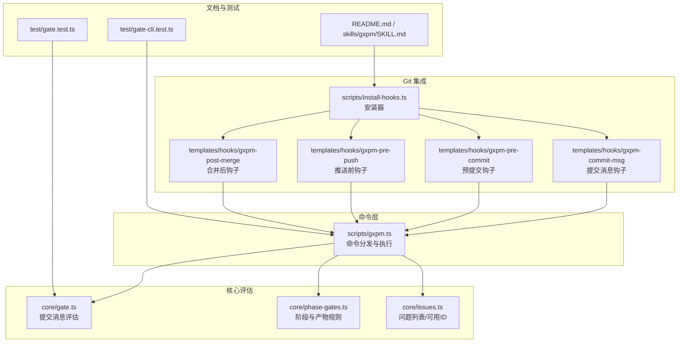
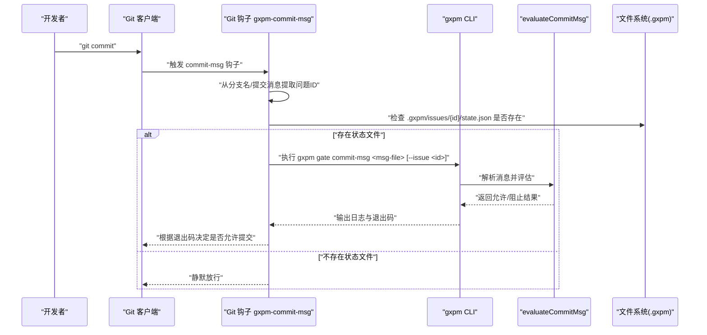
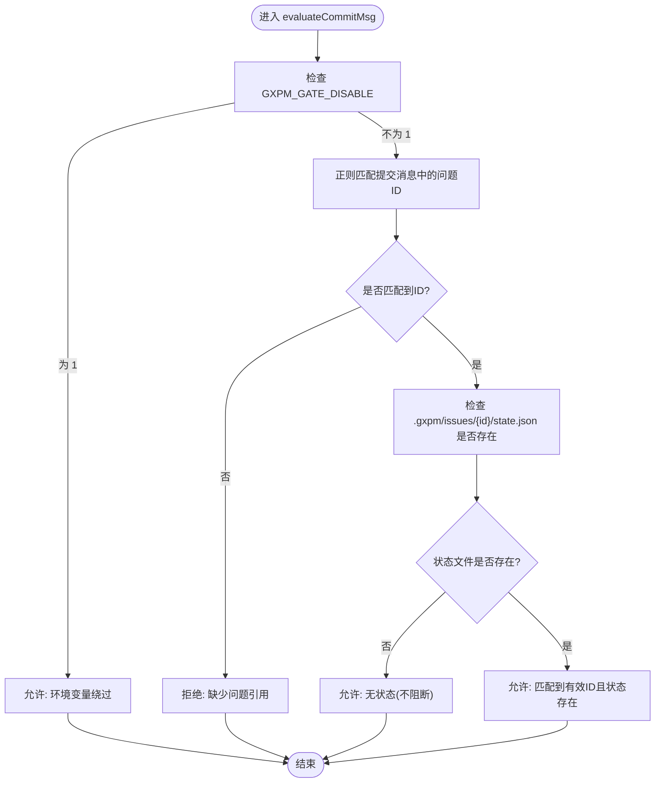
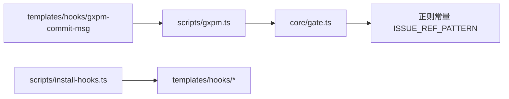

# 提交消息门禁检查

<cite>
**本文引用的文件**
- [core/gate.ts](file://core/gate.ts)
- [scripts/gxpm.ts](file://scripts/gxpm.ts)
- [test/gate-cli.test.ts](file://test/gate-cli.test.ts)
- [test/gate.test.ts](file://test/gate.test.ts)
- [core/phase-gates.ts](file://core/phase-gates.ts)
- [core/issues.ts](file://core/issues.ts)
- [README.md](file://README.md)
- [skills/gxpm/SKILL.md](file://skills/gxpm/SKILL.md)
- [scripts/install-hooks.ts](file://scripts/install-hooks.ts)
- [templates/hooks/gxpm-commit-msg](file://templates/hooks/gxpm-commit-msg)
- [templates/hooks/gxpm-pre-commit](file://templates/hooks/gxpm-pre-commit)
- [templates/hooks/gxpm-pre-push](file://templates/hooks/gxpm-pre-push)
- [templates/hooks/gxpm-post-merge](file://templates/hooks/gxpm-post-merge)
</cite>

## 目录
1. [简介](#简介)
2. [项目结构](#项目结构)
3. [核心组件](#核心组件)
4. [架构总览](#架构总览)
5. [详细组件分析](#详细组件分析)
6. [依赖关系分析](#依赖关系分析)
7. [性能考量](#性能考量)
8. [故障排查指南](#故障排查指南)
9. [结论](#结论)
10. [附录](#附录)

## 简介
本文件聚焦于 gxpm 提供的“提交消息门禁检查”能力，即 gxpm gate commit-msg 命令。该命令用于在 Git 提交流程中强制校验提交信息是否包含有效的项目问题标识符（例如 GXG-NNN 或 GXPM-NNN），并结合项目状态进行关联验证，确保每次提交都与受控的 issue 关联，从而维持交付过程的可追溯性与合规性。

此外，文档还涵盖：
- 命令参数与使用方式
- 提交消息格式要求与自动提取问题标识符的机制
- 与 Git hooks 的集成与配置方法
- 常见错误与处理建议
- 验证逻辑与测试用例映射

## 项目结构
与“提交消息门禁检查”直接相关的代码分布在以下模块：
- 核心评估逻辑：core/gate.ts
- CLI 入口与命令分发：scripts/gxpm.ts
- 钩子模板与安装器：templates/hooks/* 与 scripts/install-hooks.ts
- 相关规则与状态：core/phase-gates.ts、core/issues.ts
- 文档与示例：README.md、skills/gxpm/SKILL.md
- 测试用例：test/gate.test.ts、test/gate-cli.test.ts

图表来源
- [scripts/gxpm.ts:601-634](file://scripts/gxpm.ts#L601-L634)
- [core/gate.ts:82-100](file://core/gate.ts#L82-L100)
- [core/phase-gates.ts:1-118](file://core/phase-gates.ts#L1-L118)
- [core/issues.ts:1-120](file://core/issues.ts#L1-L120)
- [scripts/install-hooks.ts:11-28](file://scripts/install-hooks.ts#L11-L28)
- [templates/hooks/gxpm-commit-msg:1-17](file://templates/hooks/gxpm-commit-msg#L1-L17)
- [templates/hooks/gxpm-pre-commit:1-31](file://templates/hooks/gxpm-pre-commit#L1-L31)
- [templates/hooks/gxpm-pre-push:1-17](file://templates/hooks/gxpm-pre-push#L1-L17)
- [templates/hooks/gxpm-post-merge:1-22](file://templates/hooks/gxpm-post-merge#L1-L22)

章节来源
- [README.md:1-46](file://README.md#L1-L46)
- [skills/gxpm/SKILL.md:363-406](file://skills/gxpm/SKILL.md#L363-L406)

## 核心组件
- 提交消息评估函数：evaluateCommitMsg
  - 功能：校验提交消息是否包含有效的问题标识符（GXG-NNN 或 GXPM-NNN）
  - 触发条件：当环境变量 GXPM_GATE_DISABLE 不为 "1" 时生效
  - 返回值：GateVerdict 对象，包含 allowed、code、reason、details 等字段
- CLI 子命令：gate commit-msg
  - 参数：
    - 第一个参数：msg-file（指向 .git/COMMIT_EDITMSG 的路径）
    - 可选参数：--issue <issue-id>（显式指定问题 ID）
  - 行为：
    - 读取提交消息文件内容
    - 优先使用 --issue 显式指定的问题 ID；否则尝试从消息中正则提取（大小写不敏感）
    - 若未找到问题 ID，则拒绝提交
    - 若找到且存在对应 issue 的状态文件，则调用 evaluateCommitMsg 进行评估
- Git 钩子：gxpm-commit-msg
  - 自动从当前分支名或提交消息中提取问题 ID
  - 若匹配到有效 ID 且该 ID 对应的 .gxpm/issues/<id>/state.json 存在，则调用 gxpm gate commit-msg
  - 无问题 ID 或无状态文件时，静默放行

章节来源
- [core/gate.ts:82-100](file://core/gate.ts#L82-L100)
- [scripts/gxpm.ts:601-634](file://scripts/gxpm.ts#L601-L634)
- [templates/hooks/gxpm-commit-msg:1-17](file://templates/hooks/gxpm-commit-msg#L1-L17)

## 架构总览
下图展示了从用户执行 git commit 到提交消息门禁检查的端到端流程，包括 CLI 手动执行与 Git 钩子自动触发两种路径。

图表来源
- [templates/hooks/gxpm-commit-msg:1-17](file://templates/hooks/gxpm-commit-msg#L1-L17)
- [scripts/gxpm.ts:601-634](file://scripts/gxpm.ts#L601-L634)
- [core/gate.ts:82-100](file://core/gate.ts#L82-L100)

## 详细组件分析

### 提交消息评估逻辑
- 正则匹配规则：支持 GXG-NNN 或 GXPM-NNN（大小写不敏感）两种格式
- 环境变量绕过：当 GXPM_GATE_DISABLE=1 时，跳过门禁检查，直接允许
- 无状态处理：若未检测到问题 ID，或对应 issue 的状态文件不存在，按“缺少关联状态”的策略处理（在 CLI 层打印提示但不阻断）

图表来源
- [core/gate.ts:82-100](file://core/gate.ts#L82-L100)

章节来源
- [core/gate.ts:38-42](file://core/gate.ts#L38-L42)
- [core/gate.ts:91-97](file://core/gate.ts#L91-L97)

### CLI 命令：gxpm gate commit-msg
- 用途：手动执行提交消息门禁检查
- 参数：
  - 必填：msg-file（提交消息文件路径）
  - 可选：--issue <issue-id>（显式指定问题 ID）
- 行为：
  - 读取消息文件内容
  - 优先使用 --issue；否则从消息中提取问题 ID（大小写不敏感）
  - 若未提取到 ID，直接拒绝并退出码 1
  - 若提取到 ID 且存在对应状态文件，则调用 evaluateCommitMsg
  - 输出标准化日志，包含 code 与 reason

章节来源
- [scripts/gxpm.ts:601-634](file://scripts/gxpm.ts#L601-L634)

### Git 钩子：gxpm-commit-msg
- 作用：在 commit-msg 阶段自动拦截并执行门禁检查
- 自动提取策略：
  - 从当前分支名提取第一个匹配的 GXG/N 或 GXPM-NNN（大小写不敏感）
  - 从提交消息中提取第一个匹配的问题 ID
- 执行条件：当提取到有效 ID 且该 ID 对应的状态文件存在时，才调用 gxpm gate commit-msg
- 无状态或无 ID：静默放行，避免误阻塞

章节来源
- [templates/hooks/gxpm-commit-msg:1-17](file://templates/hooks/gxpm-commit-msg#L1-L17)

### 与项目状态的关联验证
- 有效性判断：仅当 .gxpm/issues/<issue-id>/state.json 存在时，才认为该问题被跟踪，进而允许门禁检查通过
- 无状态处理：若状态文件不存在，CLI 会输出“no-state”提示，但不会阻断提交（体现为允许通过）
- 环境变量绕过：GXPM_GATE_DISABLE=1 时，无论状态如何均允许

章节来源
- [scripts/gxpm.ts:620-625](file://scripts/gxpm.ts#L620-L625)
- [core/gate.ts:40-42](file://core/gate.ts#L40-L42)

### 与 Git hooks 的集成与配置
- 安装器：scripts/install-hooks.ts
  - 将四个钩子模板复制到目标仓库的 .githooks/ 目录
  - 若顶层钩子不存在，则创建分发器脚本，转发参数给 gxpm-* 钩子
  - 设置 git config core.hooksPath=.githooks
- 钩子模板：
  - gxpm-pre-commit：在预提交阶段检查受保护路径与阶段权限
  - gxpm-commit-msg：在提交消息阶段检查问题 ID 与状态关联
  - gxpm-pre-push：在推送前检查阶段所需的产物是否就绪
  - gxpm-post-merge：在合并后自动初始化 land-findings 并过渡到 land（当满足条件）

章节来源
- [scripts/install-hooks.ts:11-28](file://scripts/install-hooks.ts#L11-L28)
- [scripts/install-hooks.ts:50-103](file://scripts/install-hooks.ts#L50-L103)
- [templates/hooks/gxpm-pre-commit:1-31](file://templates/hooks/gxpm-pre-commit#L1-L31)
- [templates/hooks/gxpm-commit-msg:1-17](file://templates/hooks/gxpm-commit-msg#L1-L17)
- [templates/hooks/gxpm-pre-push:1-17](file://templates/hooks/gxpm-pre-push#L1-L17)
- [templates/hooks/gxpm-post-merge:1-22](file://templates/hooks/gxpm-post-merge#L1-L22)

## 依赖关系分析
- CLI 依赖核心评估模块：
  - scripts/gxpm.ts 通过导入 core/gate.ts 的 evaluateCommitMsg 执行门禁检查
- 评估逻辑依赖：
  - 正则常量 ISSUE_REF_PATTERN（定义在 core/gate.ts 内部）
  - 环境变量 GXPM_GATE_DISABLE（在 core/gate.ts 中检查）
- 钩子依赖：
  - templates/hooks/gxpm-commit-msg 依赖 gxpm CLI 与 .gxpm 状态目录的存在
- 安装器依赖：
  - scripts/install-hooks.ts 依赖 templates/hooks/ 下的钩子模板

图表来源
- [scripts/gxpm.ts:14-19](file://scripts/gxpm.ts#L14-L19)
- [core/gate.ts:38-42](file://core/gate.ts#L38-L42)
- [scripts/install-hooks.ts:58-79](file://scripts/install-hooks.ts#L58-L79)

章节来源
- [scripts/gxpm.ts:14-19](file://scripts/gxpm.ts#L14-L19)
- [core/gate.ts:38-42](file://core/gate.ts#L38-L42)
- [scripts/install-hooks.ts:58-79](file://scripts/install-hooks.ts#L58-L79)

## 性能考量
- 评估复杂度：evaluateCommitMsg 仅执行一次正则匹配与一次文件存在性检查，时间复杂度为 O(1)，空间复杂度为 O(1)
- CLI 调用开销：主要为文件读取与正则匹配，通常在毫秒级内完成
- 钩子执行：在 commit-msg 阶段短暂停顿，对整体提交体验影响极小

## 故障排查指南
- 常见错误与原因
  - missing-issue-ref：提交消息未包含有效的 GXG-NNN 或 GXPM-NNN 格式
  - no-state：未检测到问题 ID，或对应 issue 的状态文件不存在
  - disabled：设置了 GXPM_GATE_DISABLE=1，绕过了门禁检查
- 处理建议
  - 确保提交消息包含问题标识符，格式如 GXG-123 或 GXPM-456
  - 确认当前分支名或提交消息中包含正确的问题 ID
  - 若确实需要临时绕过，请谨慎设置 GXPM_GATE_DISABLE=1，并记录原因
  - 如需手动验证，使用 gxpm gate commit-msg <msg-file> [--issue <id>] 命令
- 相关测试参考
  - 单元测试覆盖了 missing-issue-ref、no-state、disabled 等场景
  - CLI 行为测试覆盖了带/不带问题 ID 的提交消息场景

章节来源
- [test/gate.test.ts:60-81](file://test/gate.test.ts#L60-L81)
- [test/gate-cli.test.ts:44-65](file://test/gate-cli.test.ts#L44-L65)

## 结论
gxpm gate commit-msg 通过“提交消息中的问题标识符 + 项目状态文件存在性”的双重约束，确保所有提交都与受控的 issue 关联。配合 Git 钩子自动拦截与 CLI 手动验证，形成“默认严格、可绕过、可审计”的门禁体系。遵循本文的参数说明、格式要求与集成步骤，可稳定地将该门禁嵌入团队的提交流程中。

## 附录

### 命令行示例
- 手动检查提交消息：
  - gxpm gate commit-msg <msg-file> --issue <issue-id>
- 常见格式要求
  - 提交消息必须包含至少一个如下格式的问题标识符之一：
    - GXG-NNN（例如：GXG-123）
    - GXPM-NNN（例如：GXPM-456）
- 环境变量
  - GXPM_GATE_DISABLE=1：临时绕过门禁检查（仅在特殊情况下使用）

章节来源
- [scripts/gxpm.ts:601-634](file://scripts/gxpm.ts#L601-L634)
- [core/gate.ts:38-42](file://core/gate.ts#L38-L42)
- [skills/gxpm/SKILL.md:388-406](file://skills/gxpm/SKILL.md#L388-L406)