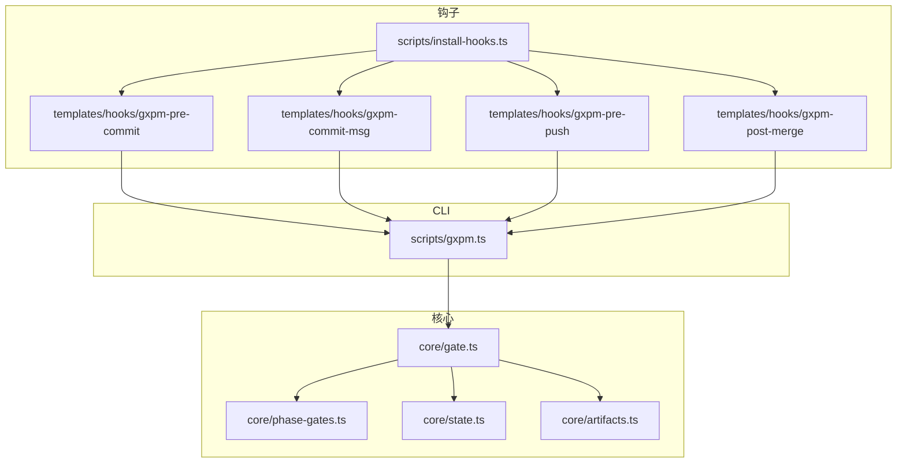
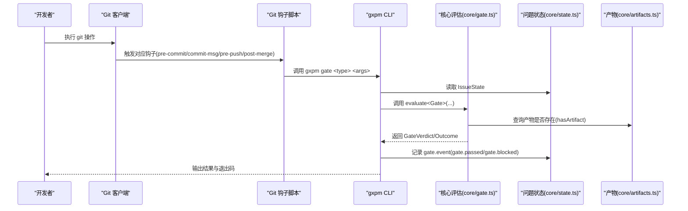
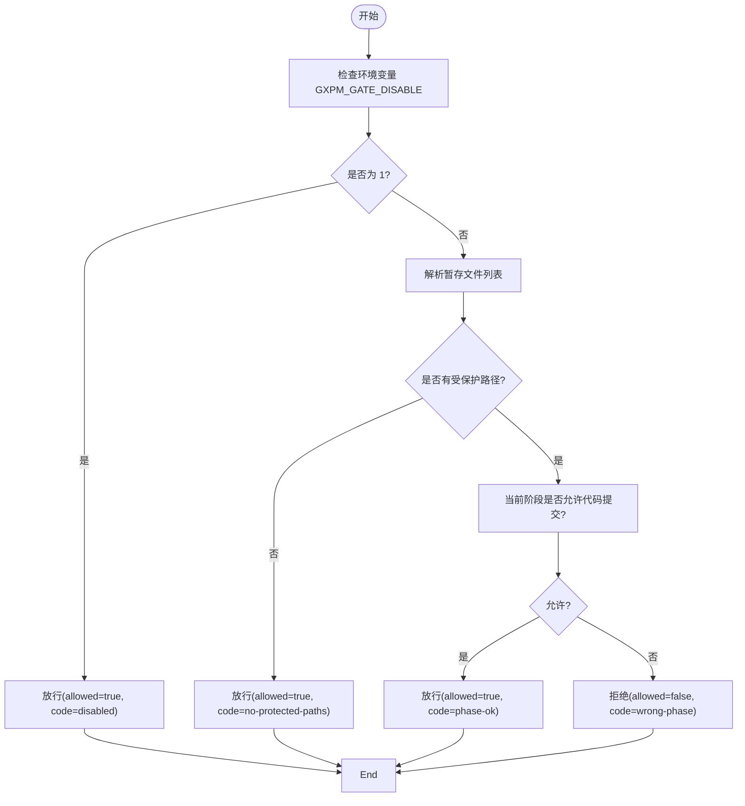
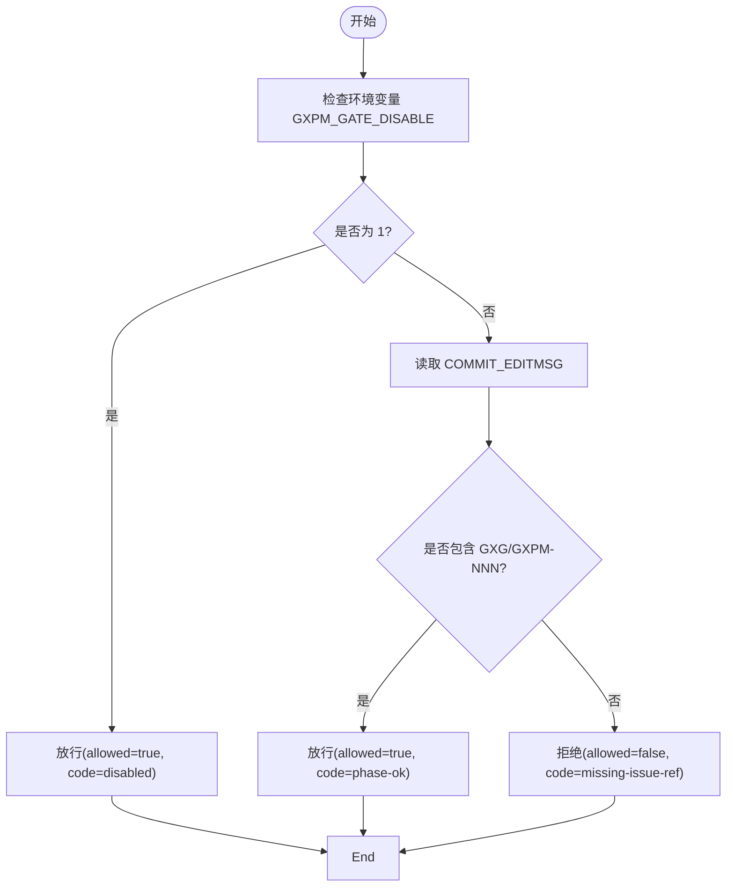
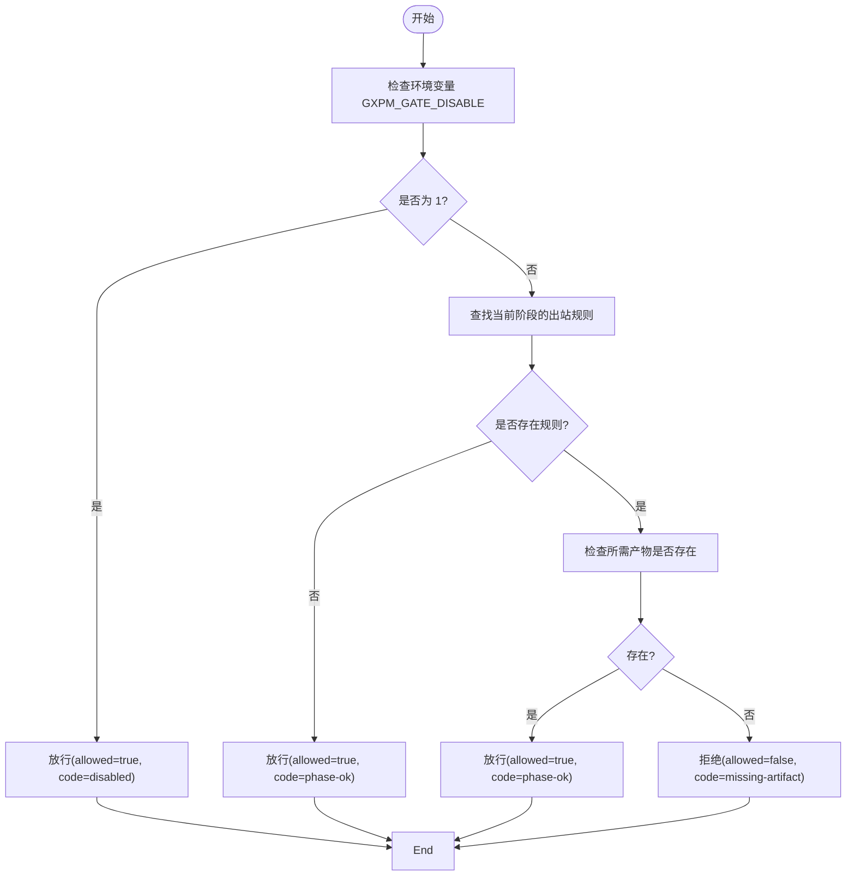
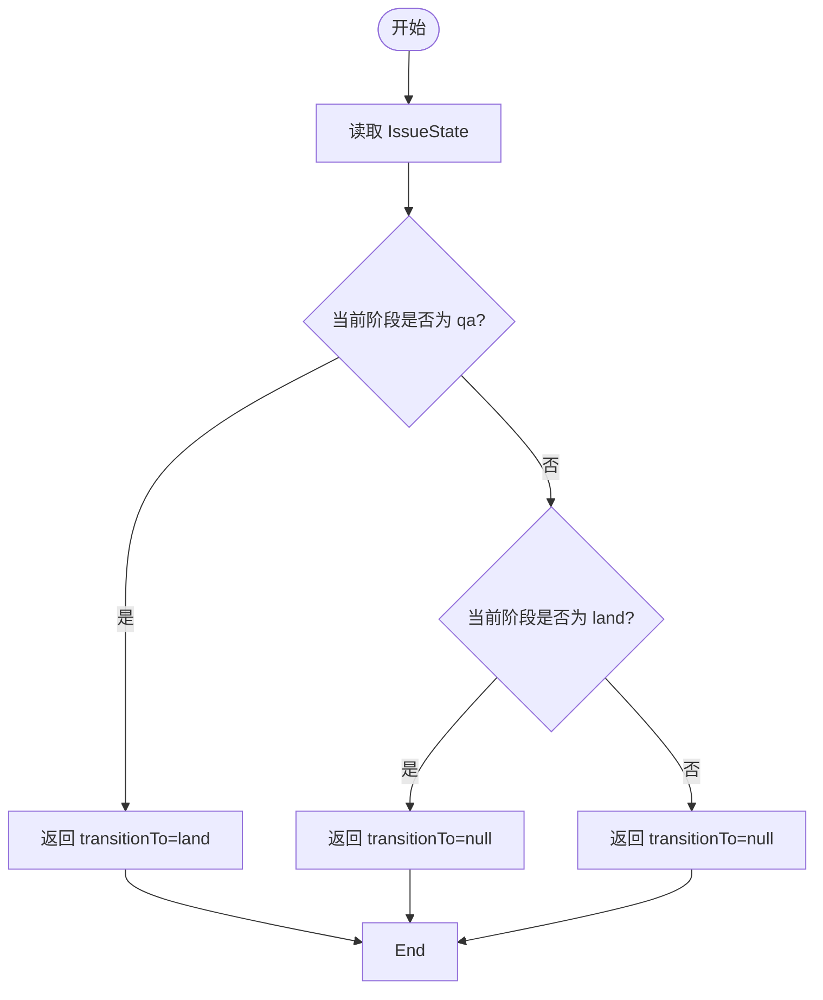
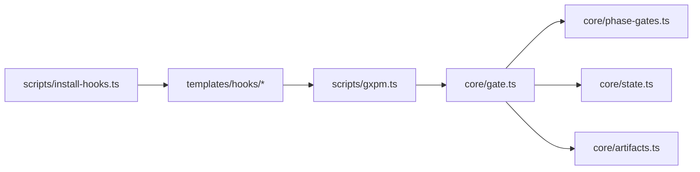

# 门禁检查命令

<cite>
**本文引用的文件**
- [core/gate.ts](file://core/gate.ts)
- [core/phase-gates.ts](file://core/phase-gates.ts)
- [core/state.ts](file://core/state.ts)
- [core/artifacts.ts](file://core/artifacts.ts)
- [scripts/install-hooks.ts](file://scripts/install-hooks.ts)
- [scripts/install-codex-hooks.ts](file://scripts/install-codex-hooks.ts)
- [templates/hooks/gxpm-pre-commit](file://templates/hooks/gxpm-pre-commit)
- [templates/hooks/gxpm-commit-msg](file://templates/hooks/gxpm-commit-msg)
- [templates/hooks/gxpm-pre-push](file://templates/hooks/gxpm-pre-push)
- [templates/hooks/gxpm-post-merge](file://templates/hooks/gxpm-post-merge)
- [scripts/gxpm.ts](file://scripts/gxpm.ts)
- [test/gate.test.ts](file://test/gate.test.ts)
- [test/gate-cli.test.ts](file://test/gate-cli.test.ts)
</cite>

## 目录
1. [简介](#简介)
2. [项目结构](#项目结构)
3. [核心组件](#核心组件)
4. [架构总览](#架构总览)
5. [详细组件分析](#详细组件分析)
6. [依赖关系分析](#依赖关系分析)
7. [性能考量](#性能考量)
8. [故障排除指南](#故障排除指南)
9. [结论](#结论)
10. [附录](#附录)

## 简介
本文件系统性地记录了门禁检查命令组“gate”的全部功能，涵盖以下子命令与对应的 Git 钩子：
- gate pre-commit：在提交前阻止对受保护路径的不合规修改
- gate commit-msg：在提交信息中强制包含问题标识（如 GXG-NNN 或 GXPM-NNN）
- gate pre-push：在推送前校验当前阶段是否具备下一阶段所需的“门禁产物”
- gate post-merge：在合并后自动推进到可落地阶段（如从 QA 自动进入 Land）

这些门禁规则通过 Git 钩子脚本与 gxpm CLI 命令协同工作，确保开发流程按阶段有序推进，并在必要时提供“豁免开关”。

## 项目结构
围绕门禁检查的关键文件组织如下：
- 核心逻辑：core/gate.ts、core/phase-gates.ts、core/state.ts、core/artifacts.ts
- 钩子安装与分发：scripts/install-hooks.ts、templates/hooks/*
- CLI 入口与门禁命令实现：scripts/gxpm.ts
- 测试用例：test/gate.test.ts、test/gate-cli.test.ts

图表来源
- [scripts/install-hooks.ts:11-16](file://scripts/install-hooks.ts#L11-L16)
- [templates/hooks/gxpm-pre-commit:1-31](file://templates/hooks/gxpm-pre-commit#L1-L31)
- [templates/hooks/gxpm-commit-msg:1-17](file://templates/hooks/gxpm-commit-msg#L1-L17)
- [templates/hooks/gxpm-pre-push:1-17](file://templates/hooks/gxpm-pre-push#L1-L17)
- [templates/hooks/gxpm-post-merge:1-22](file://templates/hooks/gxpm-post-merge#L1-L22)
- [scripts/gxpm.ts:242-260](file://scripts/gxpm.ts#L242-L260)
- [core/gate.ts:1-144](file://core/gate.ts#L1-L144)
- [core/phase-gates.ts:1-118](file://core/phase-gates.ts#L1-L118)
- [core/state.ts:1-200](file://core/state.ts#L1-L200)
- [core/artifacts.ts:1-169](file://core/artifacts.ts#L1-L169)

章节来源
- [scripts/install-hooks.ts:1-106](file://scripts/install-hooks.ts#L1-L106)
- [templates/hooks/gxpm-pre-commit:1-31](file://templates/hooks/gxpm-pre-commit#L1-L31)
- [templates/hooks/gxpm-commit-msg:1-17](file://templates/hooks/gxpm-commit-msg#L1-L17)
- [templates/hooks/gxpm-pre-push:1-17](file://templates/hooks/gxpm-pre-push#L1-L17)
- [templates/hooks/gxpm-post-merge:1-22](file://templates/hooks/gxpm-post-merge#L1-L22)
- [scripts/gxpm.ts:242-260](file://scripts/gxpm.ts#L242-L260)

## 核心组件
- 门禁类型与结果码
  - 门禁类型：pre-commit、commit-msg、pre-push、post-merge
  - 结果码：no-state、no-issue-id、no-protected-paths、wrong-phase、missing-artifact、missing-issue-ref、phase-ok、land-pending、already-landed、disabled
- 门禁评估函数
  - evaluatePreCommit：基于受保护路径与当前阶段判断是否允许提交
  - evaluateCommitMsg：校验提交信息是否包含问题标识
  - evaluatePrePush：校验当前阶段到下一阶段所需“门禁产物”是否存在
  - evaluatePostMerge：合并后根据阶段自动推进
- 阶段与产物规则
  - 受保护路径集合与阶段允许提交的集合
  - 阶段间转换规则与所需产物类型
- 状态与产物
  - IssueState：问题状态与阶段历史
  - Artifact：产物写入、读取、索引与存在性检查

章节来源
- [core/gate.ts:8-32](file://core/gate.ts#L8-L32)
- [core/gate.ts:48-143](file://core/gate.ts#L48-L143)
- [core/phase-gates.ts:4-23](file://core/phase-gates.ts#L4-L23)
- [core/phase-gates.ts:25-99](file://core/phase-gates.ts#L25-L99)
- [core/state.ts:28-43](file://core/state.ts#L28-L43)
- [core/artifacts.ts:10-26](file://core/artifacts.ts#L10-L26)

## 架构总览
门禁机制通过 Git 钩子脚本在本地触发 gxpm CLI 的 gate 子命令，CLI 再调用核心评估函数进行判定，并将事件写入问题状态文件。

图表来源
- [templates/hooks/gxpm-pre-commit:1-31](file://templates/hooks/gxpm-pre-commit#L1-L31)
- [templates/hooks/gxpm-commit-msg:1-17](file://templates/hooks/gxpm-commit-msg#L1-L17)
- [templates/hooks/gxpm-pre-push:1-17](file://templates/hooks/gxpm-pre-push#L1-L17)
- [templates/hooks/gxpm-post-merge:1-22](file://templates/hooks/gxpm-post-merge#L1-L22)
- [scripts/gxpm.ts:571-639](file://scripts/gxpm.ts#L571-L639)
- [core/gate.ts:48-143](file://core/gate.ts#L48-L143)
- [core/state.ts:139-148](file://core/state.ts#L139-L148)
- [core/artifacts.ts:120-125](file://core/artifacts.ts#L120-L125)

## 详细组件分析

### gate pre-commit
- 触发时机
  - 在执行 git commit 前，由 .githooks/pre-commit 调用 gxpm gate pre-commit
- 参数要求
  - 必须提供问题 ID（从分支名解析）
  - 支持 --staged 文件列表
- 验证规则
  - 若设置 GXPM_GATE_DISABLE=1，则直接放行
  - 若未检测到受保护路径被暂存，则放行
  - 若当前阶段不允许代码提交（非允许阶段），则拒绝
  - 否则放行
- 退出码与输出
  - 允许：退出码 0；输出“phase-ok”或“no-protected-paths”
  - 拒绝：退出码 1；输出“wrong-phase”，并列出命中受保护路径的文件
- 示例命令行输出
  - 允许：无错误输出，退出码 0
  - 拒绝：输出包含“wrong-phase”，并逐行打印受保护路径文件列表

图表来源
- [core/gate.ts:48-80](file://core/gate.ts#L48-L80)
- [core/phase-gates.ts:4-13](file://core/phase-gates.ts#L4-L13)
- [core/phase-gates.ts:15-23](file://core/phase-gates.ts#L15-L23)
- [scripts/gxpm.ts:571-639](file://scripts/gxpm.ts#L571-L639)

章节来源
- [core/gate.ts:48-80](file://core/gate.ts#L48-L80)
- [core/phase-gates.ts:4-13](file://core/phase-gates.ts#L4-L13)
- [core/phase-gates.ts:15-23](file://core/phase-gates.ts#L15-L23)
- [test/gate.test.ts:21-58](file://test/gate.test.ts#L21-L58)
- [test/gate-cli.test.ts:8-42](file://test/gate-cli.test.ts#L8-L42)

### gate commit-msg
- 触发时机
  - 在编辑提交信息后、正式提交前，由 .githooks/commit-msg 调用 gxpm gate commit-msg
- 参数要求
  - 提交信息文件路径（COMMIT_EDITMSG）
  - 问题 ID（从分支名解析）
- 验证规则
  - 若设置 GXPM_GATE_DISABLE=1，则直接放行
  - 提交信息必须包含问题标识（GXG-NNN 或 GXPM-NNN），否则拒绝
  - 否则放行
- 退出码与输出
  - 允许：退出码 0；输出“phase-ok”
  - 拒绝：退出码 1；输出“missing-issue-ref”

图表来源
- [core/gate.ts:82-100](file://core/gate.ts#L82-L100)
- [templates/hooks/gxpm-commit-msg:12-14](file://templates/hooks/gxpm-commit-msg#L12-L14)
- [scripts/gxpm.ts:641-679](file://scripts/gxpm.ts#L641-L679)

章节来源
- [core/gate.ts:82-100](file://core/gate.ts#L82-L100)
- [test/gate.test.ts:60-81](file://test/gate.test.ts#L60-L81)
- [test/gate-cli.test.ts:44-65](file://test/gate-cli.test.ts#L44-L65)

### gate pre-push
- 触发时机
  - 在执行 git push 前，由 .githooks/pre-push 调用 gxpm gate pre-push
- 参数要求
  - 问题 ID（从分支名解析）
- 验证规则
  - 若设置 GXPM_GATE_DISABLE=1，则直接放行
  - 若当前阶段无出站门禁规则（无下一阶段），则放行
  - 若缺少下一阶段所需的“门禁产物”，则拒绝
  - 否则放行
- 退出码与输出
  - 允许：退出码 0；输出“phase-ok”
  - 拒绝：退出码 1；输出“missing-artifact”，并提示所需产物类型与建议命令

图表来源
- [core/gate.ts:102-130](file://core/gate.ts#L102-L130)
- [core/phase-gates.ts:25-99](file://core/phase-gates.ts#L25-L99)
- [core/artifacts.ts:120-125](file://core/artifacts.ts#L120-L125)
- [scripts/gxpm.ts:681-719](file://scripts/gxpm.ts#L681-L719)

章节来源
- [core/gate.ts:102-130](file://core/gate.ts#L102-L130)
- [core/phase-gates.ts:25-99](file://core/phase-gates.ts#L25-L99)
- [test/gate.test.ts:83-110](file://test/gate.test.ts#L83-L110)
- [test/gate-cli.test.ts:67-87](file://test/gate-cli.test.ts#L67-L87)

### gate post-merge
- 触发时机
  - 在完成 git merge/pull 后，由 .githooks/post-merge 调用 gxpm gate post-merge
- 参数要求
  - 问题 ID（从 MERGE_MSG 或分支名解析）
- 验证规则
  - 若当前阶段为 qa，则自动推进到 land
  - 若当前阶段为 land，则不变更
  - 其他阶段不触发自动推进
- 退出码与输出
  - 允许：退出码 0；输出“transitioned … → land”或“not a merge-trigger phase”

图表来源
- [core/gate.ts:132-143](file://core/gate.ts#L132-L143)
- [scripts/gxpm.ts:721-759](file://scripts/gxpm.ts#L721-L759)

章节来源
- [core/gate.ts:132-143](file://core/gate.ts#L132-L143)
- [test/gate.test.ts:112-127](file://test/gate.test.ts#L112-L127)
- [test/gate-cli.test.ts:89-107](file://test/gate-cli.test.ts#L89-L107)

## 依赖关系分析
- 组件耦合
  - gxpm CLI 通过 runPreCommitGate/runCommitMsgGate/runPrePushGate/runPostMergeGate 分别调用 core/gate.ts 的评估函数
  - core/gate.ts 依赖 core/phase-gates.ts（受保护路径、阶段规则）、core/state.ts（读取 IssueState）、core/artifacts.ts（产物存在性）
  - 钩子脚本通过 .githooks/* 调用 gxpm CLI，形成“本地钩子 → CLI → 核心评估”的链路
- 外部集成点
  - Git 钩子路径由 scripts/install-hooks.ts 设置 core.hooksPath=.githooks
  - 可选 Codex 钩子通过 scripts/install-codex-hooks.ts 安装

图表来源
- [scripts/gxpm.ts:242-260](file://scripts/gxpm.ts#L242-L260)
- [core/gate.ts:1-144](file://core/gate.ts#L1-L144)
- [core/phase-gates.ts:1-118](file://core/phase-gates.ts#L1-L118)
- [core/state.ts:1-200](file://core/state.ts#L1-L200)
- [core/artifacts.ts:1-169](file://core/artifacts.ts#L1-L169)
- [scripts/install-hooks.ts:58-92](file://scripts/install-hooks.ts#L58-L92)
- [templates/hooks/gxpm-pre-commit:1-31](file://templates/hooks/gxpm-pre-commit#L1-L31)

章节来源
- [scripts/gxpm.ts:242-260](file://scripts/gxpm.ts#L242-L260)
- [core/gate.ts:1-144](file://core/gate.ts#L1-L144)
- [scripts/install-hooks.ts:58-92](file://scripts/install-hooks.ts#L58-L92)

## 性能考量
- 门禁评估均为轻量级操作：正则匹配、集合查询与文件存在性检查，通常在毫秒级完成
- 钩子脚本仅转发参数并调用 gxpm CLI，避免在 Git 本地钩子中引入重逻辑
- 建议
  - 将受保护路径模式保持精简，减少不必要的过滤开销
  - 使用 GXPM_GATE_DISABLE=1 临时绕过门禁时，仅在必要场景使用

## 故障排除指南
- 常见问题与排查步骤
  - 未安装钩子或 core.hooksPath 未指向 .githooks
    - 现象：钩子不生效
    - 处理：运行安装脚本，确认 core.hooksPath 已设置为 .githooks
  - 未检测到问题 ID
    - 现象：门禁无动作或直接放行
    - 处理：确保分支名包含 GXG/GXPM-NNN；或手动指定问题 ID
  - 提交被拒绝（wrong-phase/wrong-phase）
    - 现象：输出包含 wrong-phase 并列出受保护路径文件
    - 处理：切换到允许代码提交的阶段，或移除对受保护路径的修改
  - 推送被拒绝（missing-artifact）
    - 现象：输出包含 missing-artifact，并提示所需产物类型与建议命令
    - 处理：先生成所需产物，再执行 issue transition 到下一阶段
  - 提交信息未包含问题标识（missing-issue-ref）
    - 现象：输出包含 missing-issue-ref
    - 处理：在提交信息中添加 GXG-NNN 或 GXPM-NNN
  - 临时豁免
    - 方法：在命令前设置 GXPM_GATE_DISABLE=1
    - 注意：仅用于调试或紧急情况，不建议长期开启

章节来源
- [scripts/install-hooks.ts:58-92](file://scripts/install-hooks.ts#L58-L92)
- [test/gate.test.ts:21-127](file://test/gate.test.ts#L21-L127)
- [test/gate-cli.test.ts:8-107](file://test/gate-cli.test.ts#L8-L107)

## 结论
门禁检查命令通过“Git 钩子 + gxpm CLI + 核心评估 + 阶段规则 + 产物索引”的组合，实现了对代码提交、提交信息、推送与合并后的全流程约束与自动化推进。其设计以最小侵入的方式嵌入现有 Git 工作流，既保证了流程合规，又提供了必要的豁免能力与可观测事件记录。

## 附录
- 配置方法
  - 安装钩子：运行安装脚本，设置 core.hooksPath=.githooks，并在顶层钩子不存在时生成分发器脚本
  - 可选：安装 Codex 钩子（若使用 Codex），确保 feature flag 已启用
- 常用命令参考
  - 安装钩子：scripts/install-hooks.ts
  - 安装 Codex 钩子：scripts/install-codex-hooks.ts
  - 门禁命令：scripts/gxpm.ts 中的 gate 子命令入口
- 阶段与产物映射
  - 阶段规则与所需产物：core/phase-gates.ts
  - 产物类型定义：core/artifacts.ts
  - 问题状态结构：core/state.ts

章节来源
- [scripts/install-hooks.ts:58-92](file://scripts/install-hooks.ts#L58-L92)
- [scripts/install-codex-hooks.ts:30-95](file://scripts/install-codex-hooks.ts#L30-L95)
- [scripts/gxpm.ts:242-260](file://scripts/gxpm.ts#L242-L260)
- [core/phase-gates.ts:25-99](file://core/phase-gates.ts#L25-L99)
- [core/artifacts.ts:10-26](file://core/artifacts.ts#L10-L26)
- [core/state.ts:28-43](file://core/state.ts#L28-L43)