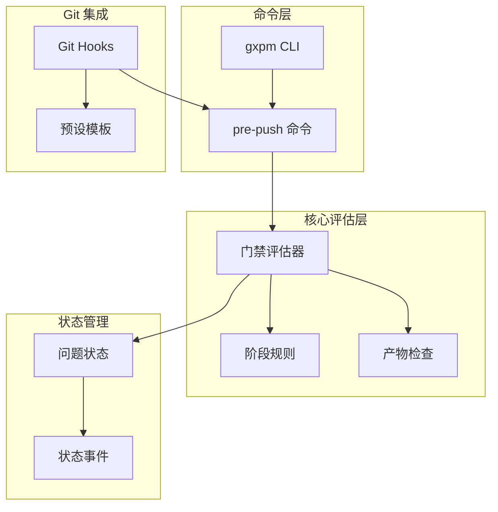
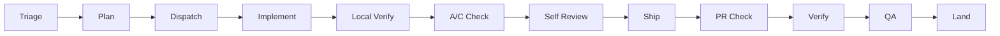
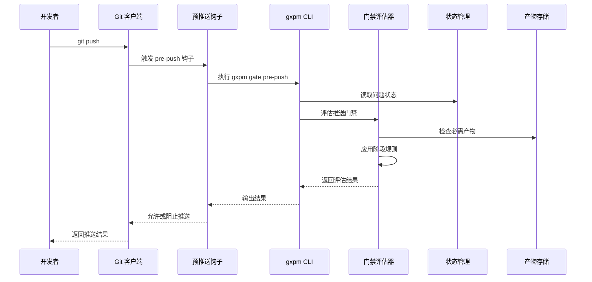
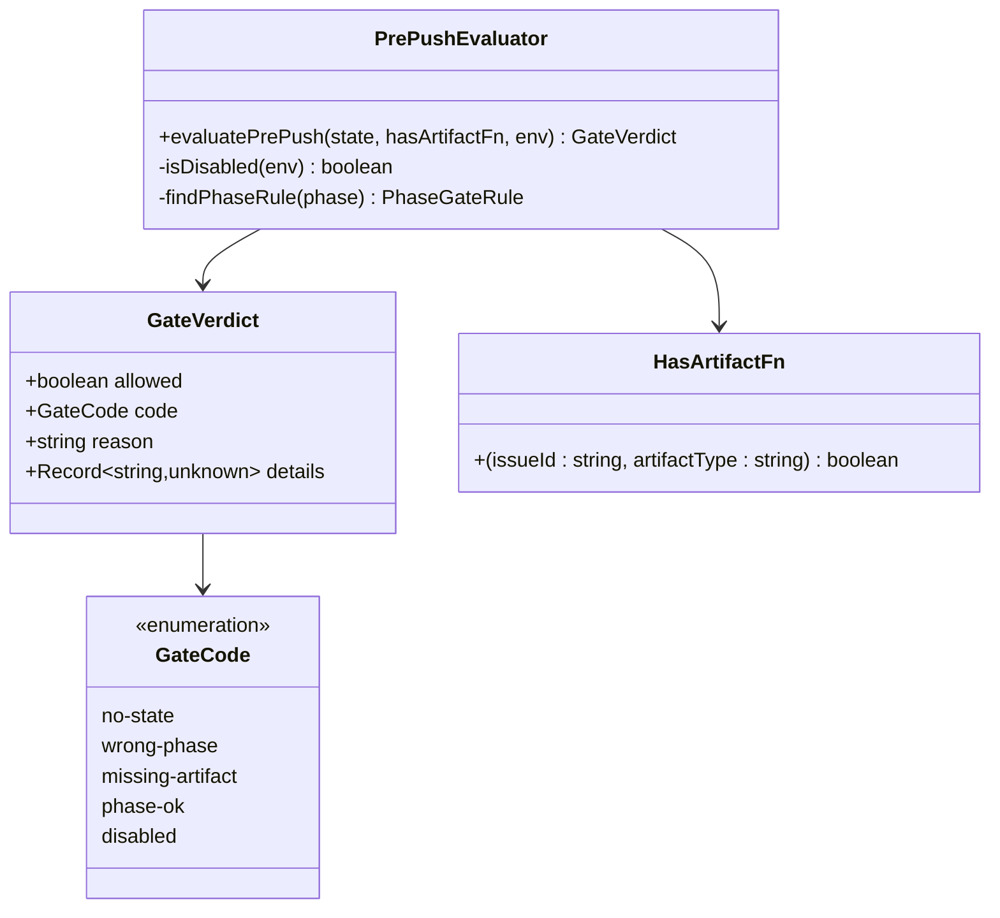
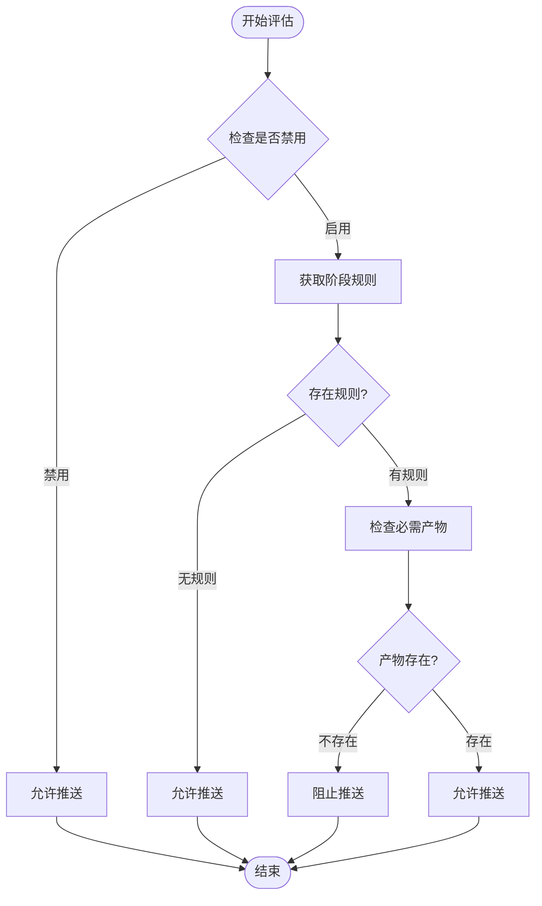
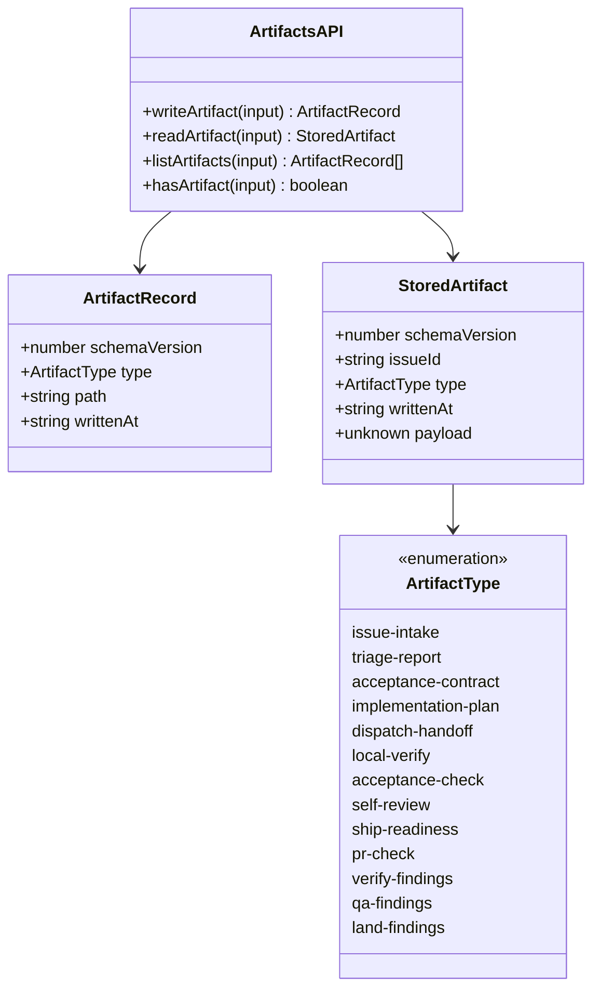
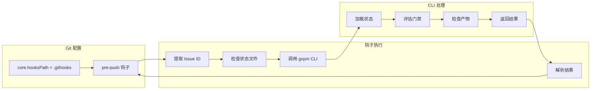
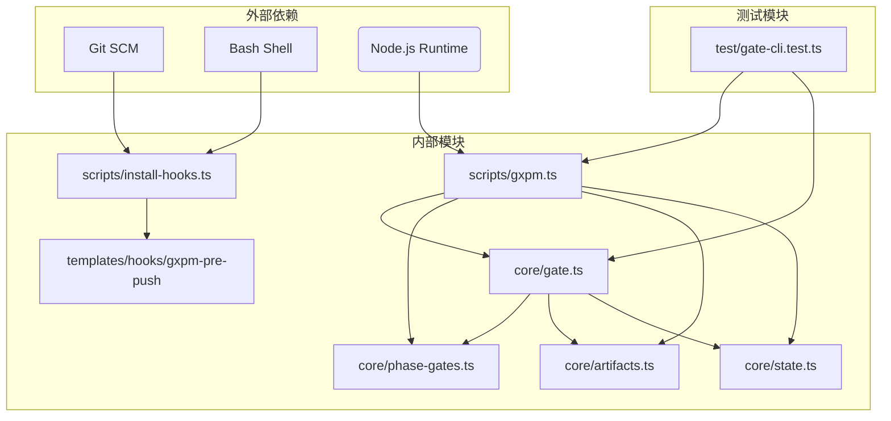

# 预推送门禁检查

<cite>
**本文档引用的文件**
- [core/gate.ts](file://core/gate.ts)
- [scripts/gxpm.ts](file://scripts/gxpm.ts)
- [core/phase-gates.ts](file://core/phase-gates.ts)
- [core/artifacts.ts](file://core/artifacts.ts)
- [scripts/install-hooks.ts](file://scripts/install-hooks.ts)
- [templates/hooks/gxpm-pre-push](file://templates/hooks/gxpm-pre-push)
- [test/gate-cli.test.ts](file://test/gate-cli.test.ts)
- [scripts/phase-artifact-commands.ts](file://scripts/phase-artifact-commands.ts)
- [core/dispatch.ts](file://core/dispatch.ts)
- [core/state.ts](file://core/state.ts)
</cite>

## 目录
1. [简介](#简介)
2. [项目结构](#项目结构)
3. [核心组件](#核心组件)
4. [架构概览](#架构概览)
5. [详细组件分析](#详细组件分析)
6. [依赖关系分析](#依赖关系分析)
7. [性能考虑](#性能考虑)
8. [故障排除指南](#故障排除指南)
9. [结论](#结论)

## 简介

预推送门禁检查是 gxpm 项目管理系统中的关键安全机制，用于在 Git 推送操作前验证代码变更的合规性。该功能通过 `gxpm gate pre-push` 命令实现，确保开发者在推送代码前满足所有必要的阶段转换规则和产物要求。

gxpm 的预推送门禁检查基于严格的阶段门禁规则，每个开发阶段都必须产生特定的产物文件才能推进到下一个阶段。这种设计确保了代码质量、合规性和可追溯性的完整性。

## 项目结构

gxpm 项目采用模块化的架构设计，预推送门禁检查功能分布在多个核心模块中：



**图表来源**
- [scripts/gxpm.ts:252-260](file://scripts/gxpm.ts#L252-L260)
- [core/gate.ts:102-130](file://core/gate.ts#L102-L130)
- [core/phase-gates.ts:32-99](file://core/phase-gates.ts#L32-L99)

**章节来源**
- [scripts/gxpm.ts:242-260](file://scripts/gxpm.ts#L242-L260)
- [core/gate.ts:1-144](file://core/gate.ts#L1-144)

## 核心组件

### 门禁类型定义

gxpm 定义了四种主要的门禁类型，每种都有特定的触发时机和验证逻辑：

| 门禁类型 | 触发时机 | 验证内容 |
|---------|---------|---------|
| pre-commit | 提交前 | 文件保护路径检查、代码提交权限验证 |
| commit-msg | 提交信息验证 | 问题标识符引用检查 |
| pre-push | 推送前 | 阶段转换规则验证、必需产物检查 |
| post-merge | 合并后 | 自动阶段转换（如 QA → Land） |

### 阶段门禁规则

阶段门禁规则定义了从一个阶段到下一个阶段所需的必要产物：



**图表来源**
- [core/phase-gates.ts:32-99](file://core/phase-gates.ts#L32-L99)

**章节来源**
- [core/gate.ts:8-27](file://core/gate.ts#L8-L27)
- [core/phase-gates.ts:25-30](file://core/phase-gates.ts#L25-L30)

## 架构概览

预推送门禁检查的整体架构由以下关键组件构成：



**图表来源**
- [templates/hooks/gxpm-pre-push:12-14](file://templates/hooks/gxpm-pre-push#L12-L14)
- [scripts/gxpm.ts:636-663](file://scripts/gxpm.ts#L636-L663)
- [core/gate.ts:102-130](file://core/gate.ts#L102-L130)

## 详细组件分析

### 预推送门禁评估器

预推送门禁评估器是整个检查流程的核心组件，负责执行具体的验证逻辑：



**图表来源**
- [core/gate.ts:22-27](file://core/gate.ts#L22-L27)
- [core/gate.ts:102-130](file://core/gate.ts#L102-L130)

#### 评估流程详解

预推送门禁评估的具体流程如下：



**图表来源**
- [core/gate.ts:106-129](file://core/gate.ts#L106-L129)

**章节来源**
- [core/gate.ts:102-130](file://core/gate.ts#L102-L130)

### 阶段门禁规则系统

阶段门禁规则系统定义了完整的开发流程和相应的产物要求：

| 阶段转换 | 必需产物 | 命令 | 下一阶段 |
|---------|---------|------|---------|
| Triage → Plan | acceptance-contract | gxpm triage init | plan |
| Plan → Dispatch | implementation-plan | gxpm plan init | dispatch |
| Dispatch → Implement | dispatch-handoff | gxpm dispatch init | implement |
| Implement → Local Verify | local-verify | gxpm implement verify | local-verify |
| Local Verify → A/C Check | acceptance-check | gxpm local-verify ac-check | ac-check |
| A/C Check → Self Review | self-review | gxpm ac-check self-review | self-review |
| Self Review → Ship | ship-readiness | gxpm self-review ship | ship |
| Ship → PR Check | pr-check | gxpm ship pr-check | pr-check |
| PR Check → Verify | verify-findings | gxpm pr-check verify | verify |
| Verify → QA | qa-findings | gxpm verify qa | qa |
| QA → Land | land-findings | gxpm qa land | land |

**章节来源**
- [core/phase-gates.ts:32-99](file://core/phase-gates.ts#L32-L99)

### 产物检查机制

产物检查机制确保每个阶段都产生了必要的输出文件：



**图表来源**
- [core/artifacts.ts:10-41](file://core/artifacts.ts#L10-L41)
- [core/artifacts.ts:120-125](file://core/artifacts.ts#L120-L125)

**章节来源**
- [core/artifacts.ts:106-125](file://core/artifacts.ts#L106-L125)

### Git 钩子集成

Git 钩子系统实现了自动化的门禁检查：



**图表来源**
- [scripts/install-hooks.ts:83-92](file://scripts/install-hooks.ts#L83-L92)
- [templates/hooks/gxpm-pre-push:9-14](file://templates/hooks/gxpm-pre-push#L9-L14)

**章节来源**
- [scripts/install-hooks.ts:11-16](file://scripts/install-hooks.ts#L11-L16)
- [templates/hooks/gxpm-pre-push:1-17](file://templates/hooks/gxpm-pre-push#L1-17)

## 依赖关系分析

预推送门禁检查涉及多个模块之间的复杂依赖关系：



**图表来源**
- [scripts/gxpm.ts:14-29](file://scripts/gxpm.ts#L14-L29)
- [core/gate.ts:1-8](file://core/gate.ts#L1-L8)

**章节来源**
- [scripts/gxpm.ts:14-29](file://scripts/gxpm.ts#L14-L29)
- [core/gate.ts:1-8](file://core/gate.ts#L1-L8)

## 性能考虑

预推送门禁检查在设计时充分考虑了性能优化：

### 评估算法复杂度
- **时间复杂度**: O(n)，其中 n 是阶段规则的数量
- **空间复杂度**: O(1)，只使用常量额外空间
- **I/O 操作**: 最多一次文件系统访问用于检查产物存在性

### 缓存策略
- 阶段规则在模块初始化时缓存
- 产物检查结果在单次评估中避免重复计算
- 环境变量检查使用快速字符串匹配

### 并发处理
- 门禁评估是纯函数，无副作用
- 支持并行执行多个门禁检查
- 错误处理不影响其他门禁的执行

## 故障排除指南

### 常见错误及解决方案

#### 1. 缺少必需产物
**错误表现**: `missing-artifact`
**原因**: 当前阶段需要的产物文件不存在
**解决方法**:
```bash
# 检查当前阶段需要的产物
gxpm issue next <issue-id>

# 生成必需的产物
gxpm <phase> init <issue-id>

# 验证产物是否存在
gxpm artifact list <issue-id>
```

#### 2. 阶段转换违规
**错误表现**: `wrong-phase`
**原因**: 在当前阶段无法进行代码提交
**解决方法**:
```bash
# 查看当前阶段状态
gxpm issue status <issue-id>

# 进入正确的阶段
gxpm issue transition <issue-id> <correct-phase>
```

#### 3. 门禁被禁用
**错误表现**: `disabled`
**原因**: 设置了环境变量 `GXPM_GATE_DISABLE=1`
**解决方法**:
```bash
# 检查环境变量
echo $GXPM_GATE_DISABLE

# 清除禁用设置
unset GXPM_GATE_DISABLE
```

#### 4. Git 钩子未正确配置
**错误表现**: 预推送检查未触发
**解决方法**:
```bash
# 重新安装 Git 钩子
bun run install-hooks

# 检查钩子配置
git config core.hooksPath

# 验证钩子文件
ls -la .githooks/
```

### 调试技巧

#### 1. 启用详细日志
```bash
# 使用调试模式运行
GXPM_DEBUG=1 gxpm gate pre-push <issue-id>

# 检查状态历史
gxpm issue history <issue-id>
```

#### 2. 手动验证门禁
```bash
# 手动运行门禁检查
gxpm gate pre-push <issue-id>

# 检查产物详情
gxpm artifact read <issue-id> <artifact-type>
```

#### 3. 验证阶段规则
```bash
# 查看阶段转换规则
gxpm issue next <issue-id>

# 检查当前阶段
gxpm issue status <issue-id>
```

**章节来源**
- [scripts/gxpm.ts:653-662](file://scripts/gxpm.ts#L653-L662)
- [test/gate-cli.test.ts:67-86](file://test/gate-cli.test.ts#L67-L86)

## 结论

预推送门禁检查是 gxpm 项目管理系统的重要组成部分，它通过严格的阶段门禁规则和产物检查机制，确保了代码质量和开发流程的规范性。该系统的设计具有以下特点：

### 核心优势
- **自动化程度高**: 通过 Git 钩子实现无缝集成
- **规则明确**: 清晰的阶段转换和产物要求
- **可扩展性强**: 模块化设计支持新阶段和产物的添加
- **用户友好**: 提供详细的错误信息和指导建议

### 最佳实践
1. **提前准备**: 在进入新阶段前确保所有必需产物已完成
2. **定期检查**: 使用 `gxpm issue next` 命令了解当前阶段的要求
3. **及时更新**: 遵循阶段转换顺序，不要跳过任何必要步骤
4. **充分利用工具**: 使用提供的 CLI 命令进行状态检查和问题诊断

### 未来发展
随着项目的演进，预推送门禁检查将继续完善，可能包括：
- 更智能的产物依赖分析
- 实时的阶段进度跟踪
- 更丰富的错误诊断信息
- 支持更多类型的产物检查

通过遵循本文档的指导和最佳实践，开发者可以有效地利用 gxpm 的预推送门禁检查功能，提高代码质量和开发效率。