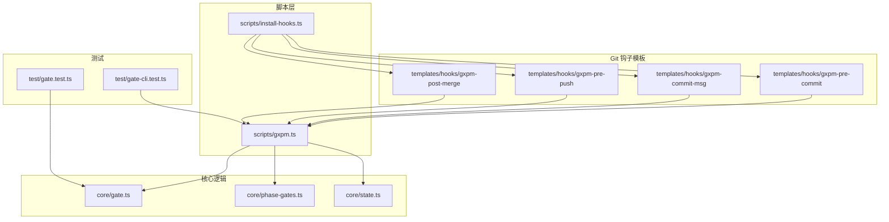
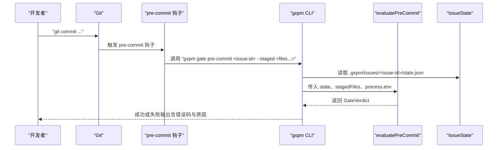
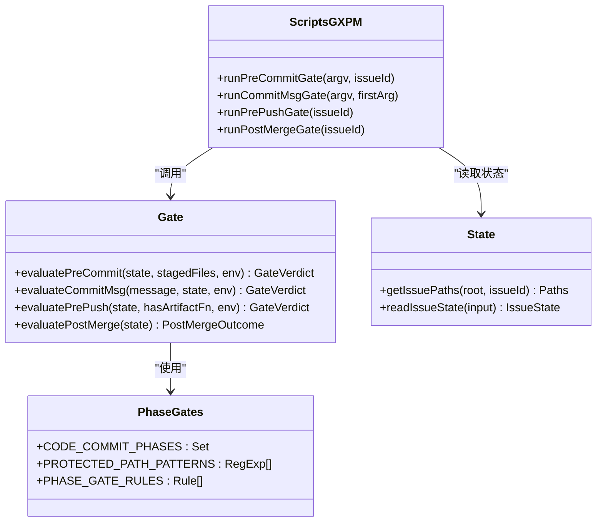

# 预提交门禁检查

<cite>
**本文引用的文件**
- [scripts/gxpm.ts](file://scripts/gxpm.ts)
- [core/gate.ts](file://core/gate.ts)
- [core/phase-gates.ts](file://core/phase-gates.ts)
- [core/state.ts](file://core/state.ts)
- [scripts/install-hooks.ts](file://scripts/install-hooks.ts)
- [templates/hooks/gxpm-pre-commit](file://templates/hooks/gxpm-pre-commit)
- [templates/hooks/gxpm-commit-msg](file://templates/hooks/gxpm-commit-msg)
- [templates/hooks/gxpm-pre-push](file://templates/hooks/gxpm-pre-push)
- [templates/hooks/gxpm-post-merge](file://templates/hooks/gxpm-post-merge)
- [test/gate-cli.test.ts](file://test/gate-cli.test.ts)
- [test/gate.test.ts](file://test/gate.test.ts)
</cite>

## 目录
1. [简介](#简介)
2. [项目结构](#项目结构)
3. [核心组件](#核心组件)
4. [架构总览](#架构总览)
5. [详细组件分析](#详细组件分析)
6. [依赖关系分析](#依赖关系分析)
7. [性能考量](#性能考量)
8. [故障排除指南](#故障排除指南)
9. [结论](#结论)
10. [附录](#附录)

## 简介
本文件系统性阐述 gxpm 预提交门禁检查（pre-commit gate）的设计与使用方法，覆盖以下要点：
- 命令：gxpm gate pre-commit 的功能、触发时机、参数与行为
- 校验规则：如何验证暂存文件、保护哪些路径、在不同阶段的允许/禁止策略
- 环境变量：如何通过环境变量禁用检查
- 错误输出格式与常见失败原因
- 与 Git hooks 的集成方式与最佳实践
- 实际命令行示例与故障排除建议

## 项目结构
围绕“预提交门禁检查”，本仓库的关键文件分布如下：
- 脚本入口与命令分发：scripts/gxpm.ts
- 门禁评估逻辑：core/gate.ts
- 阶段与受保护路径规则：core/phase-gates.ts
- 问题状态与事件记录：core/state.ts
- Git hooks 安装与模板：scripts/install-hooks.ts、templates/hooks/*
- 测试用例：test/gate-cli.test.ts、test/gate.test.ts

图表来源
- [scripts/gxpm.ts:242-260](file://scripts/gxpm.ts#L242-L260)
- [core/gate.ts:48-80](file://core/gate.ts#L48-L80)
- [core/phase-gates.ts:4-23](file://core/phase-gates.ts#L4-L23)
- [core/state.ts:70-84](file://core/state.ts#L70-L84)
- [scripts/install-hooks.ts:11-16](file://scripts/install-hooks.ts#L11-L16)
- [templates/hooks/gxpm-pre-commit:1-31](file://templates/hooks/gxpm-pre-commit#L1-L31)
- [templates/hooks/gxpm-commit-msg:1-17](file://templates/hooks/gxpm-commit-msg#L1-L17)
- [templates/hooks/gxpm-pre-push:1-17](file://templates/hooks/gxpm-pre-push#L1-L17)
- [templates/hooks/gxpm-post-merge:1-22](file://templates/hooks/gxpm-post-merge#L1-L22)
- [test/gate-cli.test.ts:8-42](file://test/gate-cli.test.ts#L8-L42)
- [test/gate.test.ts:21-58](file://test/gate.test.ts#L21-L58)

章节来源
- [scripts/gxpm.ts:242-260](file://scripts/gxpm.ts#L242-L260)
- [core/phase-gates.ts:4-23](file://core/phase-gates.ts#L4-L23)
- [scripts/install-hooks.ts:11-16](file://scripts/install-hooks.ts#L11-L16)

## 核心组件
- 预提交门禁评估函数：evaluatePreCommit
  - 输入：当前问题状态、暂存文件列表、环境变量
  - 输出：允许/拒绝、原因码、原因文本、可选详情
- 受保护路径集合：PROTECTED_PATH_PATTERNS
  - 匹配 apps/、server/、packages/、scripts/、tests/、supabase/、e2e/ 等目录
- 允许代码提交的阶段集合：CODE_COMMIT_PHASES
  - dispatch、implement、local-verify、ac-check、self-review、ship、pr-check、verify
- 环境变量开关：GXPM_GATE_DISABLE=1
  - 任何门禁均可被禁用，返回 allowed=true 且 code=disabled

章节来源
- [core/gate.ts:48-80](file://core/gate.ts#L48-L80)
- [core/phase-gates.ts:4-23](file://core/phase-gates.ts#L4-L23)
- [core/gate.ts:40-42](file://core/gate.ts#L40-L42)

## 架构总览
从用户执行 git commit 到门禁生效的端到端流程如下：

图表来源
- [templates/hooks/gxpm-pre-commit:24-30](file://templates/hooks/gxpm-pre-commit#L24-L30)
- [scripts/gxpm.ts:571-599](file://scripts/gxpm.ts#L571-L599)
- [core/gate.ts:48-80](file://core/gate.ts#L48-L80)
- [core/state.ts:70-84](file://core/state.ts#L70-L84)

## 详细组件分析

### 命令：gxpm gate pre-commit
- 功能概述
  - 在本地提交前校验是否允许对受保护路径进行代码变更
  - 若当前阶段不允许代码提交，则阻止本次提交；否则放行
- 触发时机
  - 由 Git 钩子 templates/hooks/gxpm-pre-commit 自动调用
  - 钩子会从当前分支名提取 issue-id，并仅当该 issue 已被跟踪时才执行
- 参数要求
  - 必需：issue-id
  - 可选：--staged 后跟多个已暂存文件路径
- 行为与规则
  - 若未找到对应问题状态文件，直接无状态放行（不阻断）
  - 若存在受保护路径的暂存文件：
    - 当前阶段允许代码提交则放行
    - 否则拒绝并返回错误码 wrong-phase
  - 若暂存文件均不在受保护路径，放行（错误码 no-protected-paths）
  - 若设置 GXPM_GATE_DISABLE=1，强制放行（错误码 disabled）

章节来源
- [scripts/gxpm.ts:571-599](file://scripts/gxpm.ts#L571-L599)
- [templates/hooks/gxpm-pre-commit:13-30](file://templates/hooks/gxpm-pre-commit#L13-L30)
- [core/gate.ts:48-80](file://core/gate.ts#L48-L80)
- [core/phase-gates.ts:4-23](file://core/phase-gates.ts#L4-L23)

### 验证规则详解
- 受保护路径匹配
  - 使用正则模式匹配以 apps/、server/、packages/、scripts/、tests/、supabase/、e2e/ 开头的路径
- 阶段允许策略
  - 允许代码提交的阶段集合：dispatch、implement、local-verify、ac-check、self-review、ship、pr-check、verify
  - 其他阶段（如 triage、plan、qa、land 等）禁止对受保护路径进行代码提交
- 提交信息规则（commit-msg gate）
  - 虽非 pre-commit，但与门禁配合：提交信息必须包含 GXG-NNN 或 GXPM-NNN 引用，否则拒绝
- 环境变量禁用
  - 设置 GXPM_GATE_DISABLE=1 可绕过所有门禁评估，返回 allowed=true

章节来源
- [core/phase-gates.ts:4-23](file://core/phase-gates.ts#L4-L23)
- [core/gate.ts:48-80](file://core/gate.ts#L48-L80)
- [core/gate.ts:82-100](file://core/gate.ts#L82-L100)
- [core/gate.ts:40-42](file://core/gate.ts#L40-L42)

### 错误输出格式
- 成功输出
  - 格式："[gxpm gate pre-commit] <错误码>: <原因>"
- 失败输出
  - 格式："[gxpm gate pre-commit] <错误码>: <原因>"
  - 当存在受保护路径命中时，逐行列出被拦截的文件
  - 提供 escape 指南：可通过设置 GXPM_GATE_DISABLE=1 绕过检查
- 典型错误码
  - wrong-phase：当前阶段不允许对受保护路径进行代码提交
  - no-protected-paths：暂存文件均不在受保护路径，无需拦截
  - disabled：因 GXPM_GATE_DISABLE=1 被绕过
  - no-state：未跟踪该 issue，无状态评估

章节来源
- [scripts/gxpm.ts:589-598](file://scripts/gxpm.ts#L589-L598)
- [core/gate.ts:48-80](file://core/gate.ts#L48-L80)

### 与 Git hooks 的集成
- 安装钩子
  - 使用安装脚本 scripts/install-hooks.ts 将四个 gxpm 钩子文件复制到 .githooks 目录，并确保 core.hooksPath 指向 .githooks
  - 若顶层钩子不存在，安装脚本会生成调度器脚本，按需转发参数
- 钩子模板行为
  - gxpm-pre-commit：从当前分支名提取 issue-id，若存在对应 state.json，则调用 gxpm gate pre-commit 并传入 --staged 文件列表
  - gxpm-commit-msg：从分支名或显式 --issue 推断 issue-id，调用 gxpm gate commit-msg
  - gxpm-pre-push：调用 gxpm gate pre-push
  - gxpm-post-merge：在合并完成后根据合并消息提取 issue-id，尝试自动过渡阶段

章节来源
- [scripts/install-hooks.ts:50-103](file://scripts/install-hooks.ts#L50-L103)
- [templates/hooks/gxpm-pre-commit:1-31](file://templates/hooks/gxpm-pre-commit#L1-L31)
- [templates/hooks/gxpm-commit-msg:1-17](file://templates/hooks/gxpm-commit-msg#L1-L17)
- [templates/hooks/gxpm-pre-push:1-17](file://templates/hooks/gxpm-pre-push#L1-L17)
- [templates/hooks/gxpm-post-merge:1-22](file://templates/hooks/gxpm-post-merge#L1-L22)

### 最佳实践
- 为每个功能分支命名包含 issue-id（如 GXPM-123），以便钩子自动识别
- 在 triage/plan 等阶段避免直接修改受保护路径代码，改用初始化命令生成必要工件后再进入允许代码提交的阶段
- 如确需绕过门禁，请明确设置 GXPM_GATE_DISABLE=1，并在后续恢复默认策略
- 使用 gxpm issue transition 严格遵循阶段流转，确保前置工件齐全

章节来源
- [core/phase-gates.ts:32-99](file://core/phase-gates.ts#L32-L99)
- [core/state.ts:150-205](file://core/state.ts#L150-L205)

## 依赖关系分析

图表来源
- [core/gate.ts:8-144](file://core/gate.ts#L8-L144)
- [core/phase-gates.ts:1-118](file://core/phase-gates.ts#L1-L118)
- [core/state.ts:70-148](file://core/state.ts#L70-L148)
- [scripts/gxpm.ts:571-691](file://scripts/gxpm.ts#L571-L691)

章节来源
- [core/gate.ts:8-144](file://core/gate.ts#L8-L144)
- [core/phase-gates.ts:1-118](file://core/phase-gates.ts#L1-L118)
- [core/state.ts:70-148](file://core/state.ts#L70-L148)
- [scripts/gxpm.ts:571-691](file://scripts/gxpm.ts#L571-L691)

## 性能考量
- 预提交门禁评估为轻量级操作：仅过滤受保护路径、查询当前阶段、读取一次状态文件
- 由于仅在本地执行，整体开销极低，不会显著影响提交速度
- 若大量暂存文件，建议仅添加必要的变更，减少不必要的门禁扫描

## 故障排除指南
- 常见失败场景与处理
  - wrong-phase：当前阶段不允许代码提交。请先完成前置工件或进入允许代码提交的阶段
  - no-protected-paths：暂存文件不在受保护路径，无需拦截。若误判，检查路径是否符合受保护规则
  - missing-issue-ref（commit-msg gate）：提交信息缺少 GXG-NNN 或 GXPM-NNN 引用。请在提交信息中包含正确的 issue 引用
  - no-state：未跟踪该 issue。请先创建并跟踪该 issue，或确认分支命名包含正确的 issue-id
  - disabled：检测到 GXPM_GATE_DISABLE=1。请移除该环境变量后重试
- 诊断步骤
  - 确认 .githooks 已正确安装且 core.hooksPath 指向 .githooks
  - 确认当前分支名包含有效的 issue-id
  - 确认 .gxpm/issues/<issue-id>/state.json 存在
  - 查看具体被拦截的受保护路径文件列表，定位问题文件
- 临时绕过
  - 通过设置 GXPM_GATE_DISABLE=1 绕过门禁，但不建议长期使用

章节来源
- [scripts/gxpm.ts:589-598](file://scripts/gxpm.ts#L589-L598)
- [test/gate-cli.test.ts:8-42](file://test/gate-cli.test.ts#L8-L42)
- [test/gate.test.ts:21-58](file://test/gate.test.ts#L21-L58)

## 结论
gxpm 预提交门禁检查通过“阶段 + 受保护路径”的双因子控制，有效防止在不合适的阶段对关键代码路径进行变更。结合 Git hooks 的自动化集成与清晰的错误输出，既保证了流程合规，又提供了良好的开发体验。建议团队在分支命名、阶段流转与工件准备上形成规范，最大限度降低门禁带来的摩擦。

## 附录

### 命令行示例
- 正常放行（允许代码提交的阶段）
  - 示例：在 implement 阶段对 server/ 下文件进行提交，门禁放行
- 被拦截（禁止代码提交的阶段）
  - 示例：在 triage 阶段对 server/ 下文件进行提交，门禁拒绝并提示错误码与原因
- 无状态放行
  - 示例：未跟踪的 issue-id，门禁无状态放行
- 绕过门禁
  - 示例：设置 GXPM_GATE_DISABLE=1 后执行 git commit，门禁被绕过

章节来源
- [test/gate-cli.test.ts:8-42](file://test/gate-cli.test.ts#L8-L42)
- [test/gate.test.ts:21-58](file://test/gate.test.ts#L21-L58)