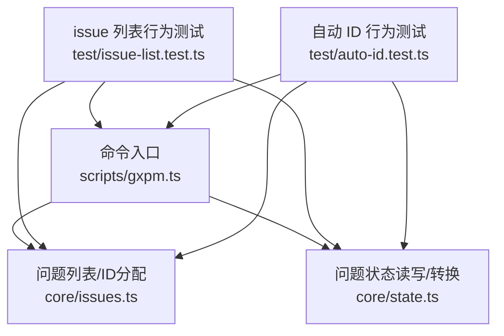
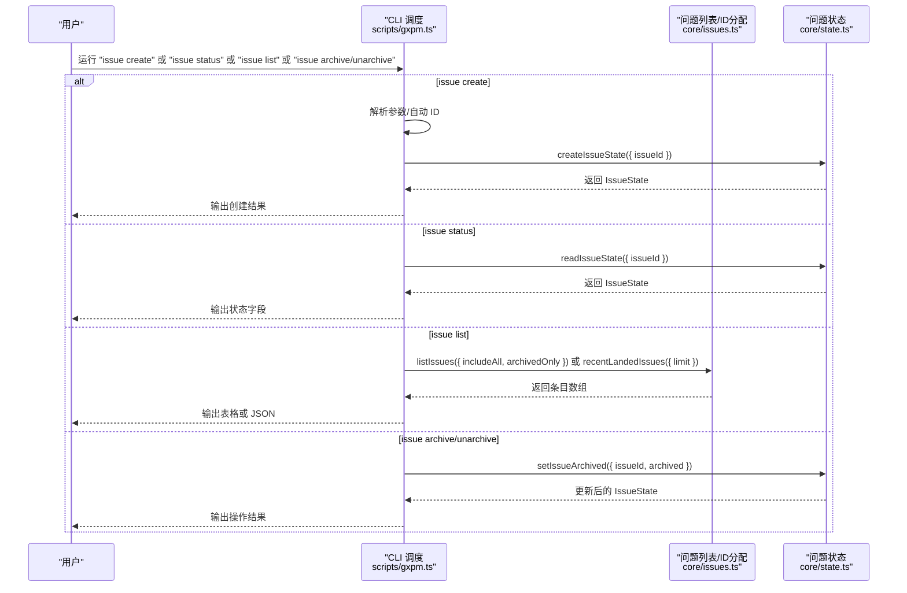
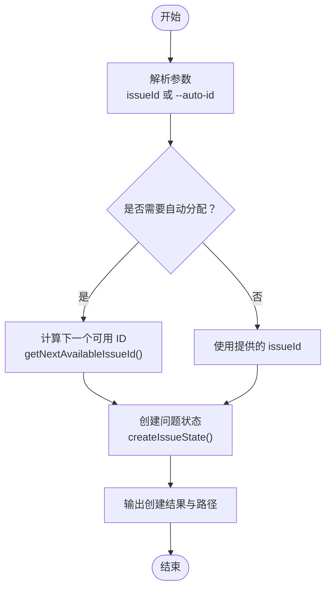
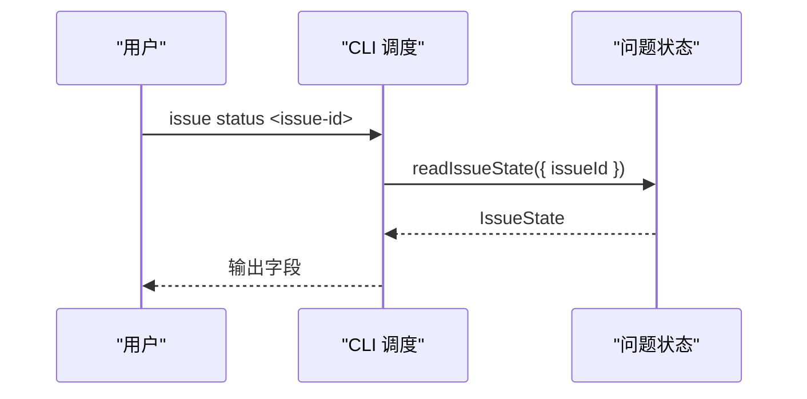
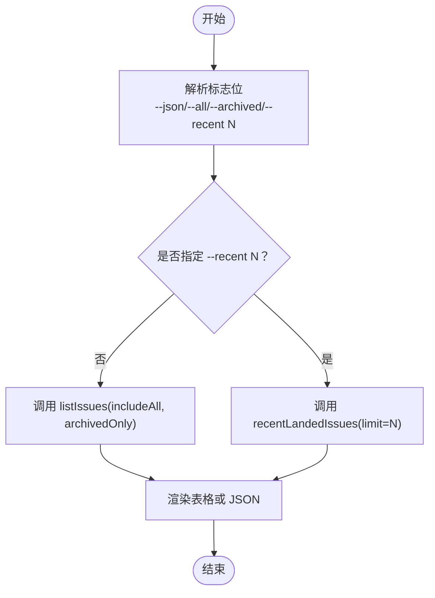
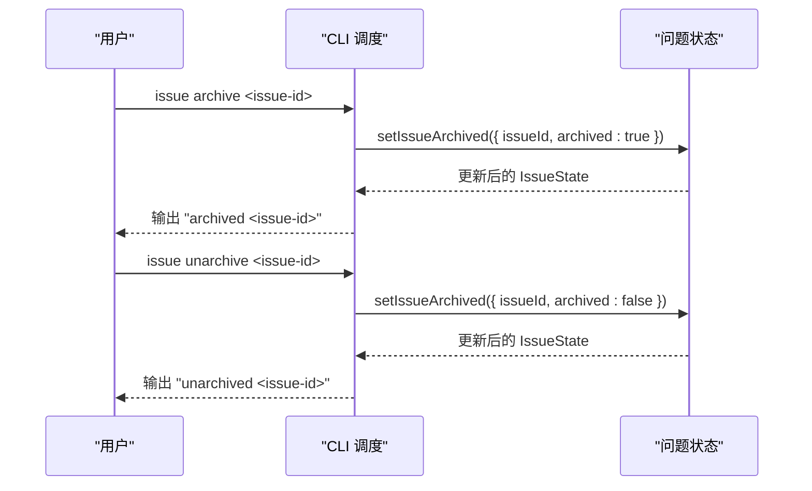
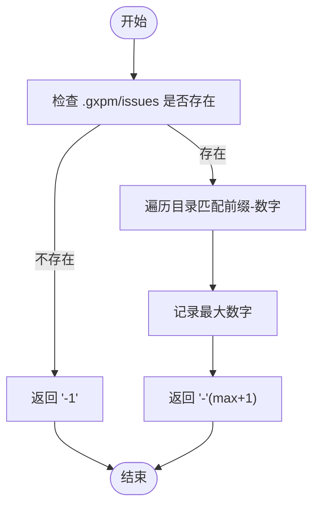
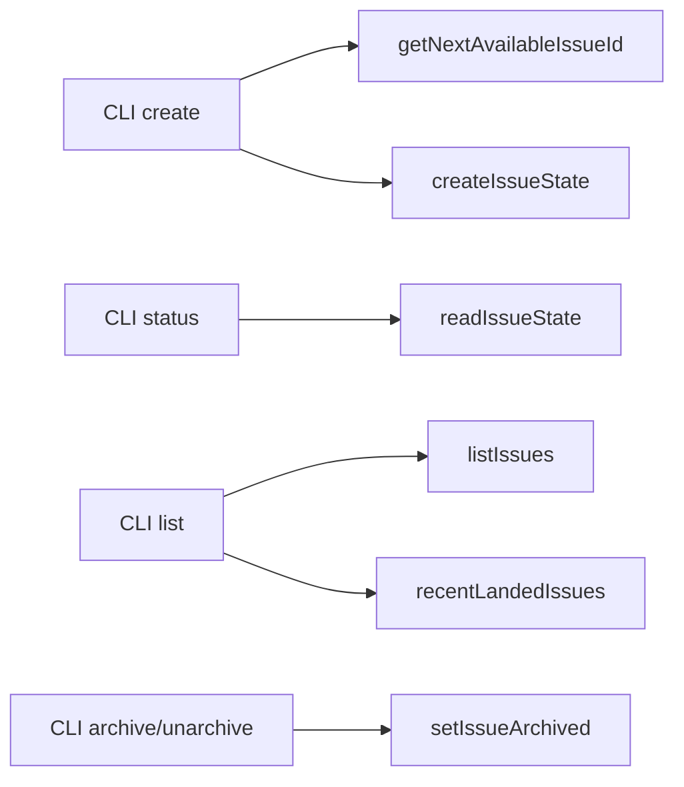

# 创建和管理

<cite>
**本文引用的文件**
- [scripts/gxpm.ts](file://scripts/gxpm.ts)
- [core/issues.ts](file://core/issues.ts)
- [core/state.ts](file://core/state.ts)
- [test/issue-list.test.ts](file://test/issue-list.test.ts)
- [test/auto-id.test.ts](file://test/auto-id.test.ts)
</cite>

## 目录
1. [简介](#简介)
2. [项目结构](#项目结构)
3. [核心组件](#核心组件)
4. [架构总览](#架构总览)
5. [详细组件分析](#详细组件分析)
6. [依赖关系分析](#依赖关系分析)
7. [性能考量](#性能考量)
8. [故障排查指南](#故障排查指南)
9. [结论](#结论)
10. [附录：命令参考与示例](#附录命令参考与示例)

## 简介
本文件面向使用 gxpm 的用户，系统性说明 issue 的创建与管理能力，包括：
- 手动指定 ID 与自动分配 ID 的两种创建模式
- 查看当前状态的命令
- 归档与取消归档的管理方式
- 完整命令语法、参数说明、使用示例与预期输出
- 常见使用场景与最佳实践

## 项目结构
围绕 issue 功能的关键文件与职责如下：
- CLI 入口与命令分发：scripts/gxpm.ts
- 问题状态与生命周期：core/state.ts
- 问题列表与 ID 分配：core/issues.ts
- 行为验证与示例：test/issue-list.test.ts、test/auto-id.test.ts

图表来源
- [scripts/gxpm.ts:77-201](file://scripts/gxpm.ts#L77-L201)
- [core/issues.ts:22-106](file://core/issues.ts#L22-L106)
- [core/state.ts:87-148](file://core/state.ts#L87-L148)
- [test/issue-list.test.ts:111-182](file://test/issue-list.test.ts#L111-L182)
- [test/auto-id.test.ts:78-103](file://test/auto-id.test.ts#L78-L103)

章节来源
- [scripts/gxpm.ts:77-201](file://scripts/gxpm.ts#L77-L201)
- [core/issues.ts:22-106](file://core/issues.ts#L22-L106)
- [core/state.ts:87-148](file://core/state.ts#L87-L148)
- [test/issue-list.test.ts:111-182](file://test/issue-list.test.ts#L111-L182)
- [test/auto-id.test.ts:78-103](file://test/auto-id.test.ts#L78-L103)

## 核心组件
- CLI 命令分发器：负责解析命令、子命令与参数，并调用对应核心函数或服务。
- 问题状态模块：提供创建、读取、阶段转换、归档标记等能力。
- 问题列表与 ID 分配模块：提供问题清单过滤、最近落地问题查询、下一个可用 ID 计算等。

章节来源
- [scripts/gxpm.ts:77-201](file://scripts/gxpm.ts#L77-L201)
- [core/state.ts:87-148](file://core/state.ts#L87-L148)
- [core/issues.ts:22-106](file://core/issues.ts#L22-L106)

## 架构总览
下图展示 issue 子命令从 CLI 到核心模块的调用链路与数据流。

图表来源
- [scripts/gxpm.ts:77-201](file://scripts/gxpm.ts#L77-L201)
- [core/issues.ts:22-106](file://core/issues.ts#L22-L106)
- [core/state.ts:87-148](file://core/state.ts#L87-L148)

## 详细组件分析

### 组件一：issue create（创建）
- 功能概述
  - 支持手动指定 issueId 或通过 --auto-id 自动分配下一个可用 ID。
  - 自动分配时会扫描 .gxpm/issues 目录，基于现有 ID 推导下一个编号，避免冲突。
- 关键流程
  - 参数解析：若未提供 issueId 或仅传入 --auto-id，则触发自动分配。
  - 自动分配：调用 getNextAvailableIssueId() 计算下一个可用 ID。
  - 创建状态：调用 createIssueState() 初始化问题状态与图谱、索引等。
  - 输出：打印创建成功的 issueId、初始阶段与 state.json 路径。
- 复杂度与性能
  - 自动分配的时间复杂度为 O(N)，其中 N 为 .gxpm/issues 下的目录数量；空间复杂度 O(1)。
- 错误处理
  - 若重复创建同一 issueId，会抛出“已存在”的错误。
  - 若未提供有效参数，抛出用法提示错误。

图表来源
- [scripts/gxpm.ts:77-94](file://scripts/gxpm.ts#L77-L94)
- [core/issues.ts:85-106](file://core/issues.ts#L85-L106)
- [core/state.ts:87-137](file://core/state.ts#L87-L137)

章节来源
- [scripts/gxpm.ts:77-94](file://scripts/gxpm.ts#L77-L94)
- [core/issues.ts:85-106](file://core/issues.ts#L85-L106)
- [core/state.ts:87-137](file://core/state.ts#L87-L137)
- [test/auto-id.test.ts:78-88](file://test/auto-id.test.ts#L78-L88)

### 组件二：issue status（查看状态）
- 功能概述
  - 读取指定 issue 的当前状态，输出关键字段（如 issueId、currentPhase、updatedAt、statePath）。
- 关键流程
  - 参数校验：必须提供 issueId。
  - 读取状态：调用 readIssueState() 获取 IssueState。
  - 输出：逐行打印字段值。
- 错误处理
  - 若 issueId 不存在或 state.json 缺失，抛出“未找到状态”的错误。

图表来源
- [scripts/gxpm.ts:96-106](file://scripts/gxpm.ts#L96-L106)
- [core/state.ts:139-148](file://core/state.ts#L139-L148)

章节来源
- [scripts/gxpm.ts:96-106](file://scripts/gxpm.ts#L96-L106)
- [core/state.ts:139-148](file://core/state.ts#L139-L148)

### 组件三：issue list（列出问题）
- 功能概述
  - 默认隐藏已归档与已落地的问题；支持 --all 显示全部；支持 --archived 仅显示归档；支持 --recent N 展示最近落地问题。
  - 输出格式：默认为表格，包含 ISSUE、PHASE、UPDATED、FLAGS；也可输出 JSON。
- 关键流程
  - 参数解析：识别 --json、--all、--archived、--recent N。
  - 数据获取：根据参数选择 listIssues 或 recentLandedIssues。
  - 渲染：无条目时输出友好提示；有条目时按宽度对齐输出。
- 过滤规则
  - 默认：排除 archived 且排除 currentPhase=land。
  - --all：包含 archived 与 land。
  - --archived：仅返回 archived 条目。
  - --recent N：忽略默认过滤，直接返回最近落地的 N 条。

图表来源
- [scripts/gxpm.ts:108-141](file://scripts/gxpm.ts#L108-L141)
- [core/issues.ts:22-79](file://core/issues.ts#L22-L79)
- [core/issues.ts:112-119](file://core/issues.ts#L112-L119)

章节来源
- [scripts/gxpm.ts:108-141](file://scripts/gxpm.ts#L108-L141)
- [core/issues.ts:22-79](file://core/issues.ts#L22-L79)
- [core/issues.ts:112-119](file://core/issues.ts#L112-L119)
- [test/issue-list.test.ts:149-182](file://test/issue-list.test.ts#L149-L182)

### 组件四：issue archive / unarchive（归档与取消归档）
- 功能概述
  - archive 将问题标记为归档，list 默认不再显示该问题。
  - unarchive 取消归档，恢复可见。
- 关键流程
  - 参数校验：必须提供 issueId。
  - 更新状态：调用 setIssueArchived({ issueId, archived: true/false }) 写回 state.json。
  - 输出：打印操作结果。
- 过滤影响
  - list 默认隐藏 archived；--all 可覆盖此行为。

图表来源
- [scripts/gxpm.ts:143-159](file://scripts/gxpm.ts#L143-L159)
- [core/state.ts:211-225](file://core/state.ts#L211-L225)
- [test/issue-list.test.ts:111-147](file://test/issue-list.test.ts#L111-L147)

章节来源
- [scripts/gxpm.ts:143-159](file://scripts/gxpm.ts#L143-L159)
- [core/state.ts:211-225](file://core/state.ts#L211-L225)
- [test/issue-list.test.ts:111-147](file://test/issue-list.test.ts#L111-L147)

### 组件五：自动分配 ID（getNextAvailableIssueId）
- 功能概述
  - 在空仓库返回前缀-1；否则扫描 .gxpm/issues 下匹配前缀的目录，取最大编号+1。
  - 支持自定义前缀（默认 GXPM）。
- 复杂度
  - 时间复杂度 O(N)，空间复杂度 O(1)。
- 行为验证
  - 测试覆盖空仓库、序列号、非匹配目录与不同前缀的场景。

图表来源
- [core/issues.ts:85-106](file://core/issues.ts#L85-L106)
- [test/auto-id.test.ts:10-38](file://test/auto-id.test.ts#L10-L38)

章节来源
- [core/issues.ts:85-106](file://core/issues.ts#L85-L106)
- [test/auto-id.test.ts:10-38](file://test/auto-id.test.ts#L10-L38)

## 依赖关系分析
- CLI 对核心模块的依赖
  - issue create 依赖 getNextAvailableIssueId 与 createIssueState
  - issue status 依赖 readIssueState
  - issue list 依赖 listIssues/recentLandedIssues
  - issue archive/unarchive 依赖 setIssueArchived
- 模块内聚与耦合
  - CLI 作为门面，职责清晰；核心模块内部职责单一，耦合度低。
  - 问题状态模块提供统一的状态读写接口，被多个命令复用。

图表来源
- [scripts/gxpm.ts:77-201](file://scripts/gxpm.ts#L77-L201)
- [core/issues.ts:22-106](file://core/issues.ts#L22-L106)
- [core/state.ts:87-148](file://core/state.ts#L87-L148)

章节来源
- [scripts/gxpm.ts:77-201](file://scripts/gxpm.ts#L77-L201)
- [core/issues.ts:22-106](file://core/issues.ts#L22-L106)
- [core/state.ts:87-148](file://core/state.ts#L87-L148)

## 性能考量
- 自动分配 ID 的线性扫描：在大型仓库中可能成为瓶颈。建议：
  - 控制 .gxpm/issues 目录规模，避免过多历史问题堆积
  - 合理使用归档与清理策略，减少无效条目数量
- list 的排序与渲染：默认按 updatedAt 降序，时间复杂度 O(M log M)，M 为条目数；可通过 --json 降低渲染开销。

## 故障排查指南
- “未找到状态”或“状态文件缺失”
  - 现象：执行 issue status 报错
  - 排查：确认 issueId 是否正确；确认 .gxpm/issues/<issueId>/state.json 是否存在
- “已存在”或“重复创建”
  - 现象：重复创建同一 issueId 报错
  - 排查：确保使用唯一 ID；必要时使用 --auto-id
- list 显示为空
  - 现象：默认 list 无输出
  - 排查：使用 --all 查看归档与落地问题；使用 --recent N 查看最近落地问题
- 归档后仍看不到
  - 现象：archive 后 list 仍不显示
  - 排查：确认未使用 --all；若需查看归档，请使用 --archived

章节来源
- [core/state.ts:139-148](file://core/state.ts#L139-L148)
- [core/state.ts:87-137](file://core/state.ts#L87-L137)
- [test/issue-list.test.ts:149-182](file://test/issue-list.test.ts#L149-L182)

## 结论
- issue create 支持手动与自动两种 ID 模式，自动分配安全可靠，适合批量创建。
- issue status 提供快速状态概览，便于日常跟踪。
- issue list 提供灵活的过滤与展示选项，满足不同视图需求。
- 归档/取消归档机制配合 list 的过滤，形成清晰的问题生命周期管理。

## 附录：命令参考与示例

### 命令总览
- issue create
  - 语法：gxpm issue create <issue-id> 或 gxpm issue create --auto-id
  - 说明：创建新问题；--auto-id 自动分配下一个可用 ID
  - 示例：创建手动 ID 与自动 ID 的示例可参考测试用例
  - 预期输出：打印创建成功与 state.json 路径
- issue status
  - 语法：gxpm issue status <issue-id>
  - 说明：查看当前状态字段
  - 预期输出：issueId、currentPhase、updatedAt、statePath
- issue list
  - 语法：gxpm issue list [--json] [--all] [--archived] [--recent N]
  - 说明：默认隐藏归档与落地；--all 显示全部；--archived 仅归档；--recent N 显示最近落地
  - 预期输出：表格或 JSON；无条目时输出友好提示
- issue archive
  - 语法：gxpm issue archive <issue-id>
  - 说明：将问题标记为归档；默认 list 不再显示
  - 预期输出：打印归档结果
- issue unarchive
  - 语法：gxpm issue unarchive <issue-id>
  - 说明：取消归档，恢复可见
  - 预期输出：打印取消归档结果

章节来源
- [scripts/gxpm.ts:77-201](file://scripts/gxpm.ts#L77-L201)
- [test/issue-list.test.ts:111-182](file://test/issue-list.test.ts#L111-L182)
- [test/auto-id.test.ts:78-103](file://test/auto-id.test.ts#L78-L103)