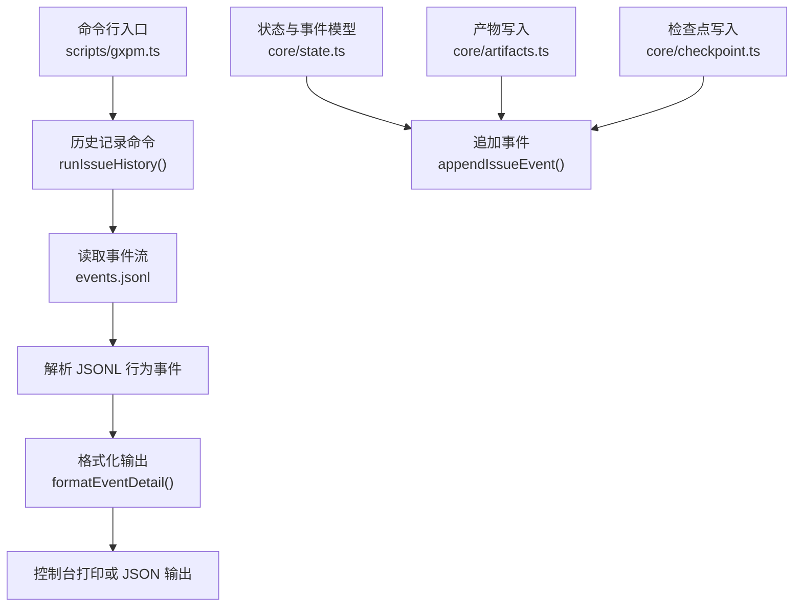
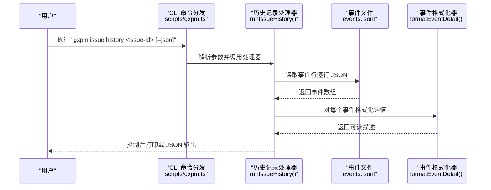
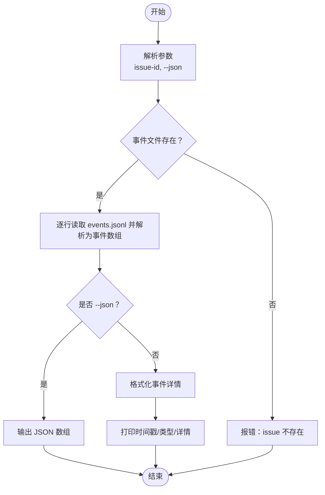
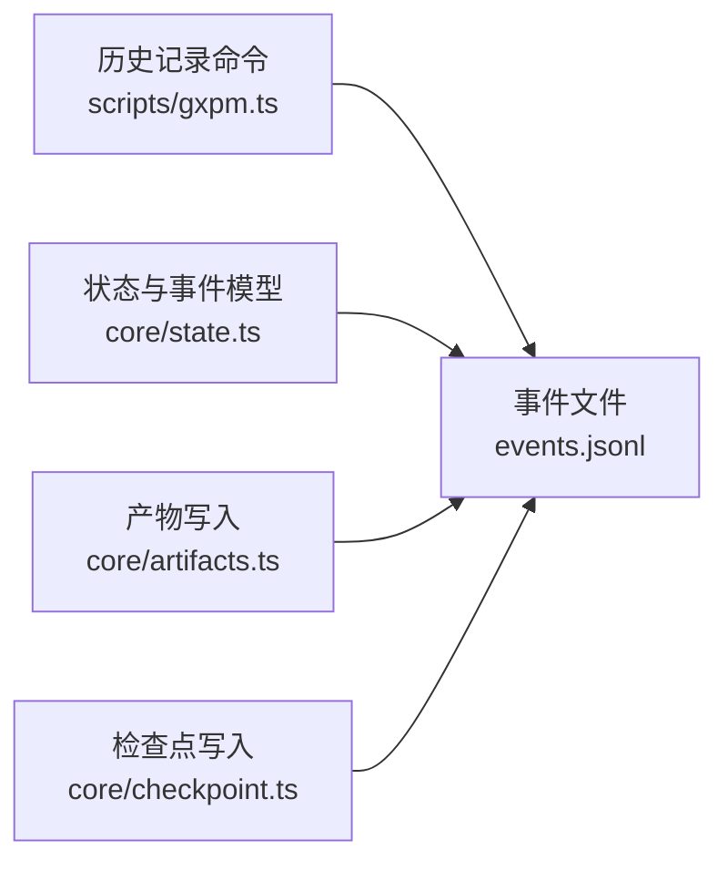

# 历史记录

<cite>
**本文引用的文件**
- [scripts/gxpm.ts](file://scripts/gxpm.ts)
- [core/state.ts](file://core/state.ts)
- [core/artifacts.ts](file://core/artifacts.ts)
- [core/checkpoint.ts](file://core/checkpoint.ts)
- [test/gxpm-cli.test.ts](file://test/gxpm-cli.test.ts)
- [test/artifacts.test.ts](file://test/artifacts.test.ts)
- [test/dispatch-gate.test.ts](file://test/dispatch-gate.test.ts)
- [test/checkpoint.test.ts](file://test/checkpoint.test.ts)
</cite>

## 目录
1. [简介](#简介)
2. [项目结构](#项目结构)
3. [核心组件](#核心组件)
4. [架构总览](#架构总览)
5. [详细组件分析](#详细组件分析)
6. [依赖关系分析](#依赖关系分析)
7. [性能考量](#性能考量)
8. [故障排查指南](#故障排查指南)
9. [结论](#结论)
10. [附录](#附录)

## 简介
本章节面向使用者与维护者，系统性说明 issue 历史记录功能（issue history 命令）的设计与使用方法。重点涵盖：
- 命令行用法与参数：--json 输出模式
- 事件时间线的显示格式：时间戳、事件类型、详细信息
- 历史事件的分类与含义：issue.created、phase.transitioned、artifact.written、checkpoint.written、gate.passed、gate.blocked
- 实际命令行输出示例与解读方法，帮助理解问题在生命周期中的发展轨迹

## 项目结构
与历史记录功能直接相关的模块与文件如下：
- CLI 入口与子命令分发：scripts/gxpm.ts
- 事件模型与事件追加：core/state.ts
- 产物写入事件：core/artifacts.ts
- 检查点写入事件：core/checkpoint.ts
- 行为验证与示例输出：test/gxpm-cli.test.ts、test/artifacts.test.ts、test/dispatch-gate.test.ts、test/checkpoint.test.ts

图表来源
- [scripts/gxpm.ts:331-379](file://scripts/gxpm.ts#L331-L379)
- [core/state.ts:207-209](file://core/state.ts#L207-L209)
- [core/artifacts.ts:148-161](file://core/artifacts.ts#L148-L161)
- [core/checkpoint.ts:101-110](file://core/checkpoint.ts#L101-L110)

章节来源
- [scripts/gxpm.ts:184-191](file://scripts/gxpm.ts#L184-L191)
- [scripts/gxpm.ts:331-379](file://scripts/gxpm.ts#L331-L379)
- [core/state.ts:45-57](file://core/state.ts#L45-L57)
- [core/artifacts.ts:148-161](file://core/artifacts.ts#L148-L161)
- [core/checkpoint.ts:101-110](file://core/checkpoint.ts#L101-L110)

## 核心组件
- 历史记录命令处理器：负责解析参数、读取事件、格式化输出
- 事件模型：统一的 StateEvent 结构，包含类型、时间戳、载荷
- 事件生成器：在关键动作发生时追加事件到事件流文件
- 事件格式化器：根据事件类型将载荷转换为可读的文本描述

章节来源
- [scripts/gxpm.ts:331-379](file://scripts/gxpm.ts#L331-L379)
- [core/state.ts:45-57](file://core/state.ts#L45-L57)
- [core/state.ts:207-209](file://core/state.ts#L207-L209)
- [core/artifacts.ts:148-161](file://core/artifacts.ts#L148-L161)
- [core/checkpoint.ts:101-110](file://core/checkpoint.ts#L101-L110)

## 架构总览
历史记录功能遵循“事件驱动”的设计：系统在关键操作（创建 issue、阶段迁移、写入产物、写入检查点、门禁通过/阻塞）时追加一条事件到事件流文件；历史命令从该文件读取所有事件，按时间顺序呈现。

图表来源
- [scripts/gxpm.ts:184-191](file://scripts/gxpm.ts#L184-L191)
- [scripts/gxpm.ts:331-379](file://scripts/gxpm.ts#L331-L379)
- [core/state.ts:207-209](file://core/state.ts#L207-L209)

## 详细组件分析

### 历史记录命令与参数
- 基本用法
  - gxpm issue history <issue-id>
  - gxpm issue history <issue-id> --json
- 参数说明
  - --json：以机器可读的 JSON 数组形式输出事件列表，便于自动化处理
- 错误处理
  - 当指定的 issue 不存在或事件文件缺失时，返回非零退出码并提示错误

章节来源
- [scripts/gxpm.ts:184-191](file://scripts/gxpm.ts#L184-L191)
- [scripts/gxpm.ts:331-379](file://scripts/gxpm.ts#L331-L379)

### 事件时间线显示格式
- 时间戳
  - 采用 ISO 8601 格式，显示为 “YYYY-MM-DDTHH:mm:ss.sssZ”
  - 在历史输出中会进行格式化：将 T 替换为空格，并去除毫秒部分，保留 Z 后缀
- 事件类型
  - 固定宽度对齐，便于列式阅读
- 详细信息
  - 根据事件类型，格式化载荷字段，提供上下文信息

章节来源
- [scripts/gxpm.ts:351-356](file://scripts/gxpm.ts#L351-L356)
- [scripts/gxpm.ts:359-379](file://scripts/gxpm.ts#L359-L379)

### 事件类型与载荷
- issue.created
  - 描述：issue 创建时触发
  - 载荷字段：initialPhase（初始阶段）
- phase.transitioned
  - 描述：阶段迁移时触发
  - 载荷字段：fromPhase（起始阶段）、toPhase（目标阶段）
- artifact.written
  - 描述：产物写入时触发
  - 载荷字段：artifactType（产物类型）、path（产物路径）
- checkpoint.written
  - 描述：检查点写入时触发
  - 载荷字段：checkpointPath（检查点 Markdown 路径）、resumePacketPath（恢复包相对路径）
- gate.passed
  - 描述：门禁通过时触发
  - 载荷字段（通用）：fromPhase、toPhase、requiredArtifact（所需产物）
  - 载荷字段（特殊）：gate、code（当存在 gate 字段时）
- gate.blocked
  - 描述：门禁阻塞时触发
  - 载荷字段（通用）：fromPhase、toPhase、missingArtifact（缺少产物）
  - 载荷字段（特殊）：gate、reason（当存在 gate 字段时）

章节来源
- [core/state.ts:45-57](file://core/state.ts#L45-L57)
- [core/state.ts:125-134](file://core/state.ts#L125-L134)
- [core/state.ts:193-202](file://core/state.ts#L193-L202)
- [core/state.ts:267-280](file://core/state.ts#L267-L280)
- [core/state.ts:284-298](file://core/state.ts#L284-L298)
- [core/artifacts.ts:148-161](file://core/artifacts.ts#L148-L161)
- [core/checkpoint.ts:101-110](file://core/checkpoint.ts#L101-L110)

### 事件生成与持久化
- 事件文件
  - 事件以 JSONL（每行一条 JSON）的形式存储于 issue 目录下的 events.jsonl
- 事件生成点
  - issue 创建：appendIssueEvent 写入 issue.created
  - 阶段迁移：appendIssueEvent 写入 phase.transitioned
  - 门禁判断：若满足条件写入 gate.passed，否则写入 gate.blocked
  - 产物写入：写入 artifact.written
  - 检查点写入：写入 checkpoint.written

章节来源
- [core/state.ts:207-209](file://core/state.ts#L207-L209)
- [core/state.ts:125-134](file://core/state.ts#L125-L134)
- [core/state.ts:193-202](file://core/state.ts#L193-L202)
- [core/state.ts:267-298](file://core/state.ts#L267-L298)
- [core/artifacts.ts:148-161](file://core/artifacts.ts#L148-L161)
- [core/checkpoint.ts:101-110](file://core/checkpoint.ts#L101-L110)

### 历史记录命令流程图

图表来源
- [scripts/gxpm.ts:331-379](file://scripts/gxpm.ts#L331-L379)

## 依赖关系分析
- 历史记录命令依赖事件文件的存在与正确格式
- 事件生成器分布在多个模块中，共同维护事件一致性
- 测试用例覆盖了典型事件类型，确保输出格式稳定

图表来源
- [scripts/gxpm.ts:331-379](file://scripts/gxpm.ts#L331-L379)
- [core/state.ts:207-209](file://core/state.ts#L207-L209)
- [core/artifacts.ts:148-161](file://core/artifacts.ts#L148-L161)
- [core/checkpoint.ts:101-110](file://core/checkpoint.ts#L101-L110)

章节来源
- [scripts/gxpm.ts:331-379](file://scripts/gxpm.ts#L331-L379)
- [core/state.ts:207-209](file://core/state.ts#L207-L209)
- [core/artifacts.ts:148-161](file://core/artifacts.ts#L148-L161)
- [core/checkpoint.ts:101-110](file://core/checkpoint.ts#L101-L110)

## 性能考量
- 事件文件为纯文本 JSONL，读取与解析成本低，适合小到中等规模的历史记录
- 若事件量极大，建议使用 --json 输出后由外部工具进行流式处理与索引
- 事件格式化为纯字符串拼接，开销极小

## 故障排查指南
- 问题：执行历史命令返回错误，提示 issue 不存在
  - 排查：确认 issue-id 是否正确；确认事件文件是否存在
  - 参考：命令参数校验与错误提示
- 问题：--json 输出为空或解析失败
  - 排查：检查 events.jsonl 是否为有效 JSONL；确认事件文件未被意外删除或损坏
  - 参考：事件文件读取与解析逻辑
- 问题：某些事件未出现在历史中
  - 排查：确认对应操作是否成功触发事件生成；核对事件类型与载荷字段

章节来源
- [scripts/gxpm.ts:331-379](file://scripts/gxpm.ts#L331-L379)
- [core/state.ts:207-209](file://core/state.ts#L207-L209)

## 结论
issue 历史记录功能通过事件驱动的方式，完整记录了问题生命周期中的关键节点。命令行提供了人类可读与机器可读两种输出模式，既便于日常审计，也便于自动化集成。理解事件类型与载荷有助于快速定位问题发展轨迹与瓶颈。

## 附录

### 命令行输出示例与解读
以下示例基于测试用例与实现行为整理，展示不同事件类型的典型输出形态与解读要点。

- 示例一：新建 issue 的时间线
  - 输出要点
    - 显示 issue 标识与事件数量
    - 展示分隔线
    - 列出事件：时间戳、事件类型、详细信息
  - 关键事件
    - issue.created：初始阶段
  - 解读
    - 事件按时间先后排序，便于追踪问题从创建到当前状态的演进

- 示例二：包含阶段迁移与产物事件的时间线
  - 输出要点
    - 包含 phase.transitioned：起止阶段
    - 包含 artifact.written：产物类型与路径
    - 包含 gate.passed：通过的门禁与所需产物
  - 解读
    - 通过对比阶段迁移与产物写入，可判断门禁是否满足

- 示例三：包含检查点事件的时间线
  - 输出要点
    - 包含 checkpoint.written：检查点 Markdown 路径与恢复包路径
  - 解读
    - 检查点可用于会话中断后的恢复与上下文传递

- 示例四：门禁阻塞与通过
  - 输出要点
    - gate.blocked：缺少产物
    - gate.passed：通过门禁
  - 解读
    - 阻塞事件指示下一步需要先完成某项产物

章节来源
- [test/gxpm-cli.test.ts:44-89](file://test/gxpm-cli.test.ts#L44-L89)
- [test/artifacts.test.ts:40-49](file://test/artifacts.test.ts#L40-L49)
- [test/dispatch-gate.test.ts:40-62](file://test/dispatch-gate.test.ts#L40-L62)
- [test/checkpoint.test.ts:10-62](file://test/checkpoint.test.ts#L10-L62)

### 事件类型与载荷速查
- issue.created
  - 字段：initialPhase
- phase.transitioned
  - 字段：fromPhase, toPhase
- artifact.written
  - 字段：artifactType, path
- checkpoint.written
  - 字段：checkpointPath, resumePacketPath
- gate.passed
  - 字段（通用）：fromPhase, toPhase, requiredArtifact
  - 字段（特殊）：gate, code
- gate.blocked
  - 字段（通用）：fromPhase, toPhase, missingArtifact
  - 字段（特殊）：gate, reason

章节来源
- [core/state.ts:45-57](file://core/state.ts#L45-L57)
- [core/artifacts.ts:148-161](file://core/artifacts.ts#L148-L161)
- [core/checkpoint.ts:101-110](file://core/checkpoint.ts#L101-L110)