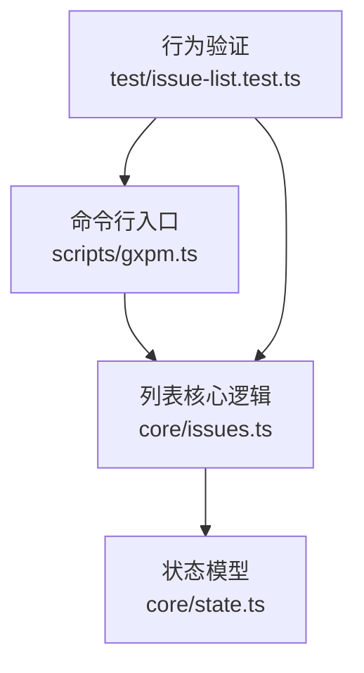
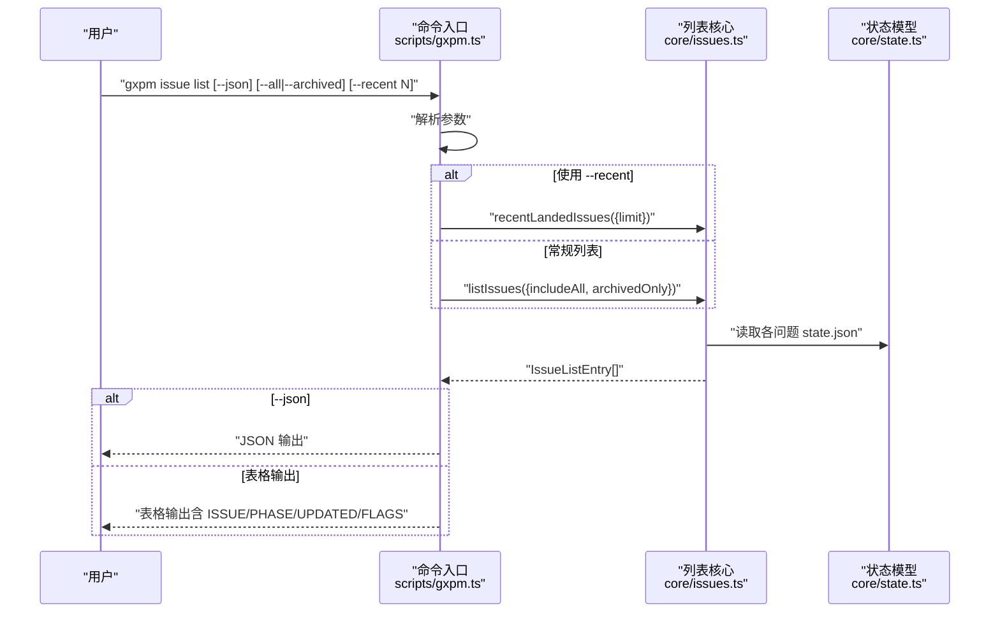
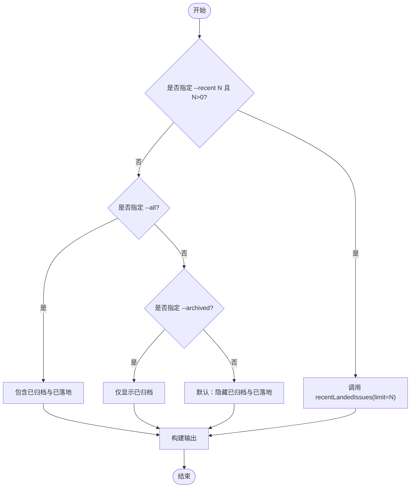
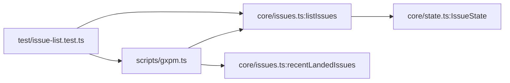

# 查询和列表

<cite>
**本文引用的文件**
- [scripts/gxpm.ts](file://scripts/gxpm.ts)
- [core/issues.ts](file://core/issues.ts)
- [core/state.ts](file://core/state.ts)
- [test/issue-list.test.ts](file://test/issue-list.test.ts)
</cite>

## 目录
1. [简介](#简介)
2. [项目结构](#项目结构)
3. [核心组件](#核心组件)
4. [架构总览](#架构总览)
5. [详细组件分析](#详细组件分析)
6. [依赖关系分析](#依赖关系分析)
7. [性能考量](#性能考量)
8. [故障排查指南](#故障排查指南)
9. [结论](#结论)
10. [附录：命令与输出示例](#附录命令与输出示例)

## 简介
本章节面向使用 gxpm 的用户，系统性说明 issue 列表查询功能，重点覆盖：
- issue list 命令的选项与行为：--all、--archived、--recent
- 如何过滤活跃问题、已归档问题与最近落地问题
- --json 输出格式与表格格式的差异与字段含义
- 实际命令行输出示例，帮助快速理解不同查询条件下的结果

## 项目结构
围绕 issue 查询与列表功能，涉及以下关键文件：
- 命令入口与解析：scripts/gxpm.ts（issue 子命令处理）
- 核心逻辑：core/issues.ts（列出问题、筛选、最近落地）
- 状态模型：core/state.ts（问题状态结构与阶段枚举）
- 行为验证：test/issue-list.test.ts（单元测试覆盖）

图表来源
- [scripts/gxpm.ts:108-141](file://scripts/gxpm.ts#L108-L141)
- [core/issues.ts:22-79](file://core/issues.ts#L22-L79)
- [core/state.ts:28-43](file://core/state.ts#L28-L43)
- [test/issue-list.test.ts:11-182](file://test/issue-list.test.ts#L11-L182)

章节来源
- [scripts/gxpm.ts:108-141](file://scripts/gxpm.ts#L108-L141)
- [core/issues.ts:22-79](file://core/issues.ts#L22-L79)
- [core/state.ts:28-43](file://core/state.ts#L28-L43)
- [test/issue-list.test.ts:11-182](file://test/issue-list.test.ts#L11-L182)

## 核心组件
- 列表函数 listIssues：扫描 .gxpm/issues 下的问题目录，读取每个问题的状态文件，按规则过滤并排序返回条目。
- 最近落地函数 recentLandedIssues：在所有问题中筛选指定阶段（默认 land）并限制数量。
- CLI 解析与输出：根据参数选择过滤策略或最近落地模式；支持表格输出与 JSON 输出。

章节来源
- [core/issues.ts:22-79](file://core/issues.ts#L22-L79)
- [core/issues.ts:112-119](file://core/issues.ts#L112-L119)
- [scripts/gxpm.ts:108-141](file://scripts/gxpm.ts#L108-L141)

## 架构总览
issue list 的执行路径如下：
- 命令解析：识别 --json、--all、--archived、--recent 及其参数
- 过滤策略：
  - 若 --recent 指定且大于 0，则走最近落地逻辑
  - 否则走常规列表逻辑：默认隐藏已归档与已落地；--all 打开包含已归档与已落地；--archived 仅显示已归档
- 输出：
  - --json：输出 JSON 数组
  - 非 --json：输出表格（含 ISSUE、PHASE、UPDATED、FLAGS 等列），空列表时给出提示

图表来源
- [scripts/gxpm.ts:108-141](file://scripts/gxpm.ts#L108-L141)
- [core/issues.ts:22-79](file://core/issues.ts#L22-L79)
- [core/issues.ts:112-119](file://core/issues.ts#L112-L119)
- [core/state.ts:28-43](file://core/state.ts#L28-L43)

## 详细组件分析

### 命令与选项
- 基本用法
  - gxpm issue list
  - gxpm issue list --json
  - gxpm issue list --all
  - gxpm issue list --archived
  - gxpm issue list --recent N
- 选项说明
  - --json：以机器可读的 JSON 数组输出
  - --all：包含已归档与已落地问题
  - --archived：仅显示已归档问题（忽略 --all）
  - --recent N：显示最近落地（默认阶段 land）的前 N 个问题，优先于其他过滤

章节来源
- [scripts/gxpm.ts:108-141](file://scripts/gxpm.ts#L108-L141)
- [test/issue-list.test.ts:149-182](file://test/issue-list.test.ts#L149-L182)

### 过滤逻辑与行为
- 默认行为
  - 隐藏已归档问题
  - 隐藏已落地（land）问题
- --all
  - 显示所有问题（包括已归档与已落地）
- --archived
  - 仅显示已归档问题（与 --all 冲突时，--all 优先）
- --recent N
  - 忽略默认过滤与 --archived，直接返回最近落地的 N 个问题（默认 N=5）

图表来源
- [scripts/gxpm.ts:108-141](file://scripts/gxpm.ts#L108-L141)
- [core/issues.ts:22-79](file://core/issues.ts#L22-L79)
- [core/issues.ts:112-119](file://core/issues.ts#L112-L119)

章节来源
- [core/issues.ts:22-79](file://core/issues.ts#L22-L79)
- [core/issues.ts:112-119](file://core/issues.ts#L112-L119)
- [test/issue-list.test.ts:62-109](file://test/issue-list.test.ts#L62-L109)

### 输出格式
- 表格格式（默认）
  - 列标题：ISSUE、PHASE、UPDATED、FLAGS
  - 当某问题已归档时，FLAGS 显示 archived
  - 无结果时提示“无活跃问题”或“无问题被跟踪”
- JSON 格式（--json）
  - 输出数组，元素为 IssueListEntry 结构

章节来源
- [scripts/gxpm.ts:120-141](file://scripts/gxpm.ts#L120-L141)
- [test/issue-list.test.ts:149-182](file://test/issue-list.test.ts#L149-L182)

### 数据模型与字段
IssueListEntry 字段
- issueId：问题标识
- currentPhase：当前阶段
- createdAt：创建时间
- updatedAt：更新时间
- stateRoot：问题根路径
- archived：是否已归档

章节来源
- [core/issues.ts:5-12](file://core/issues.ts#L5-L12)
- [core/state.ts:28-43](file://core/state.ts#L28-L43)

## 依赖关系分析
- 命令入口依赖核心列表函数与最近落地函数
- 核心列表函数依赖状态模型读取问题状态
- 测试覆盖了过滤、输出格式与 CLI 行为

图表来源
- [scripts/gxpm.ts:108-141](file://scripts/gxpm.ts#L108-L141)
- [core/issues.ts:22-79](file://core/issues.ts#L22-L79)
- [core/issues.ts:112-119](file://core/issues.ts#L112-L119)
- [core/state.ts:28-43](file://core/state.ts#L28-L43)
- [test/issue-list.test.ts:11-182](file://test/issue-list.test.ts#L11-L182)

章节来源
- [scripts/gxpm.ts:108-141](file://scripts/gxpm.ts#L108-L141)
- [core/issues.ts:22-79](file://core/issues.ts#L22-L79)
- [core/issues.ts:112-119](file://core/issues.ts#L112-L119)
- [core/state.ts:28-43](file://core/state.ts#L28-L43)
- [test/issue-list.test.ts:11-182](file://test/issue-list.test.ts#L11-L182)

## 性能考量
- 文件系统扫描：遍历 .gxpm/issues 目录并读取每个问题的 state.json，复杂度与问题数量线性相关
- 排序：按 updatedAt 降序，时间复杂度 O(n log n)
- 近期落地：先全量过滤再截断，复杂度 O(n)，N 较小时开销可控
- 建议：在大型仓库中，若列表频繁使用，可考虑缓存或增量刷新策略（当前实现未内置缓存）

## 故障排查指南
- 无活跃问题提示
  - 当前工作区没有活跃问题时，命令会提示“无活跃问题”，建议使用 --all 查看已归档/已落地
- 无任何问题被跟踪
  - 当 --all 时仍为空，表示 .gxpm/issues 目录不存在或为空
- JSON 输出校验
  - --json 输出应为数组，元素包含 issueId、currentPhase 等字段；如解析失败，请检查输出是否被其他日志干扰
- 归档与恢复
  - 使用 archive/unarchive 可改变问题可见性；确认归档状态后再运行 list

章节来源
- [scripts/gxpm.ts:124-129](file://scripts/gxpm.ts#L124-L129)
- [test/issue-list.test.ts:164-169](file://test/issue-list.test.ts#L164-L169)
- [test/issue-list.test.ts:111-147](file://test/issue-list.test.ts#L111-L147)

## 结论
- 默认仅展示活跃问题，便于聚焦当前工作
- --all 展示全部历史与归档，适合审计与回溯
- --archived 仅查看归档，避免干扰
- --recent 提供“最近落地”视角，适合新会话上下文
- --json 适配自动化与集成场景

## 附录：命令与输出示例
以下示例基于测试与实现行为整理，帮助快速理解不同查询条件下的输出形态与字段含义。

- 示例一：默认列表（表格）
  - 命令：gxpm issue list
  - 输出要点：
    - 表头：ISSUE、PHASE、UPDATED、FLAGS
    - 若问题已归档，FLAGS 显示 archived
    - 无活跃问题时提示“无活跃问题（可使用 --all 查看归档/落地）”

- 示例二：包含已归档与已落地（表格）
  - 命令：gxpm issue list --all
  - 输出要点：
    - 显示所有问题（包括已归档与已落地）
    - 无问题被跟踪时提示“无问题被跟踪 under .gxpm/issues/”

- 示例三：仅归档（表格）
  - 命令：gxpm issue list --archived
  - 输出要点：
    - 仅显示已归档问题，archived 标记出现在 FLAGS 列

- 示例四：最近落地（表格）
  - 命令：gxpm issue list --recent 5
  - 输出要点：
    - 仅显示最近落地（默认阶段 land）的前 5 个问题
    - 忽略默认隐藏与 --archived

- 示例五：JSON 输出（表格）
  - 命令：gxpm issue list --json
  - 输出要点：
    - 输出数组，元素为 IssueListEntry 对象
    - 字段：issueId、currentPhase、createdAt、updatedAt、stateRoot、archived

- 示例六：JSON 输出（包含已归档与已落地）
  - 命令：gxpm issue list --all --json
  - 输出要点：
    - 包含已归档与已落地问题的 JSON 数组

- 示例七：JSON 输出（最近落地）
  - 命令：gxpm issue list --recent 3 --json
  - 输出要点：
    - 返回最近落地的前 3 个问题的 JSON 数组

章节来源
- [scripts/gxpm.ts:120-141](file://scripts/gxpm.ts#L120-L141)
- [test/issue-list.test.ts:149-182](file://test/issue-list.test.ts#L149-L182)
- [test/issue-list.test.ts:62-109](file://test/issue-list.test.ts#L62-L109)