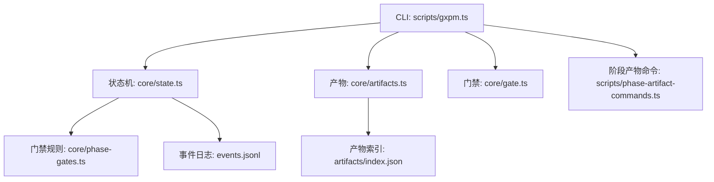
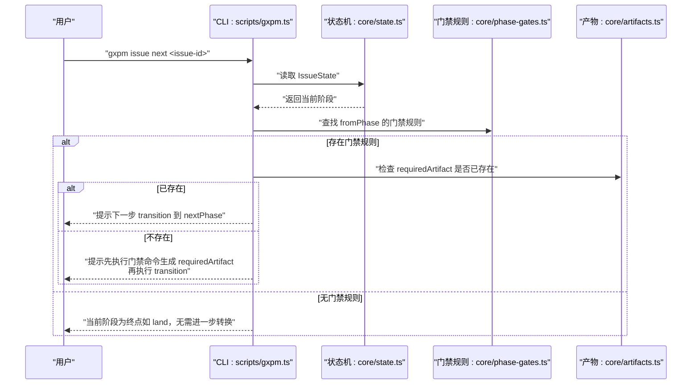
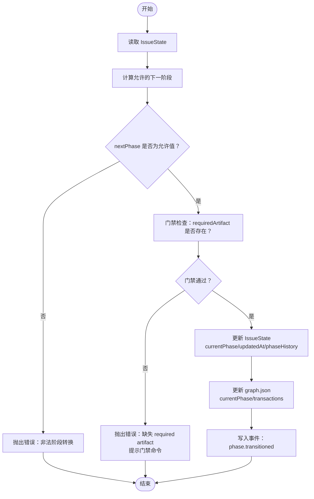
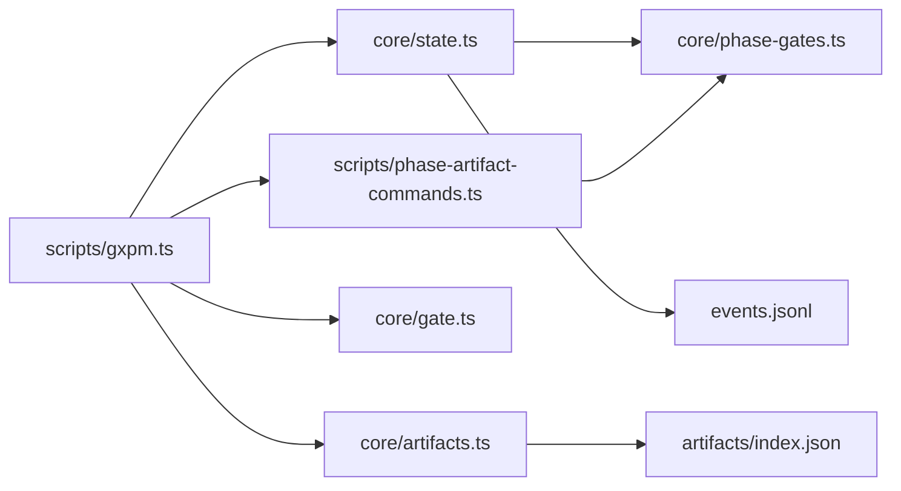

# 状态转换

<cite>
**本文引用的文件**
- [scripts/gxpm.ts](file://scripts/gxpm.ts)
- [core/state.ts](file://core/state.ts)
- [core/phase-gates.ts](file://core/phase-gates.ts)
- [core/artifacts.ts](file://core/artifacts.ts)
- [core/gate.ts](file://core/gate.ts)
- [test/state-graph.test.ts](file://test/state-graph.test.ts)
- [test/gxpm-cli.test.ts](file://test/gxpm-cli.test.ts)
- [test/phase-gates.test.ts](file://test/phase-gates.test.ts)
- [scripts/phase-artifact-commands.ts](file://scripts/phase-artifact-commands.ts)
</cite>

## 目录
1. [简介](#简介)
2. [项目结构](#项目结构)
3. [核心组件](#核心组件)
4. [架构总览](#架构总览)
5. [详细组件分析](#详细组件分析)
6. [依赖关系分析](#依赖关系分析)
7. [性能考量](#性能考量)
8. [故障排查指南](#故障排查指南)
9. [结论](#结论)
10. [附录](#附录)

## 简介
本文件系统性阐述 issue 状态转换功能，重点覆盖以下内容：
- 如何通过 issue next 命令显示“下一步可执行的操作”和“所需产物”
- 如何使用 issue transition 命令进行状态转换（语法、参数、行为）
- 状态转换的完整流程：阶段门禁检查、产物验证、事件记录
- 实际命令行示例：展示提示信息与下一步操作指引

## 项目结构
围绕状态转换的关键模块如下：
- CLI 入口：scripts/gxpm.ts 提供 issue 子命令族（create、status、list、archive、unarchive、next、transition、history、checkpoint、resume）以及 artifact、gate、phase-artifact 初始化命令
- 状态机与转换：core/state.ts 定义阶段序列、IssueState 结构、读写状态、转换逻辑与事件记录
- 阶段门禁规则：core/phase-gates.ts 定义每段到下一段的“必需产物类型”及对应初始化命令
- 产物存取：core/artifacts.ts 定义产物类型、索引与读写接口
- Git 钩子门禁：core/gate.ts 定义 pre-commit/commit-msg/pre-push/post-merge 的门禁判定
- 命令绑定：scripts/phase-artifact-commands.ts 将“阶段产物初始化命令”与“阶段门禁规则”对齐

图表来源
- [scripts/gxpm.ts: 161-201:161-201](file://scripts/gxpm.ts#L161-L201)
- [core/state.ts: 150-205:150-205](file://core/state.ts#L150-L205)
- [core/phase-gates.ts: 32-99:32-99](file://core/phase-gates.ts#L32-L99)
- [core/artifacts.ts: 57-91:57-91](file://core/artifacts.ts#L57-L91)
- [core/gate.ts: 48-143:48-143](file://core/gate.ts#L48-L143)
- [scripts/phase-artifact-commands.ts: 72-83:72-83](file://scripts/phase-artifact-commands.ts#L72-L83)

章节来源
- [scripts/gxpm.ts: 161-201:161-201](file://scripts/gxpm.ts#L161-L201)
- [core/state.ts: 11-303:11-303](file://core/state.ts#L11-L303)
- [core/phase-gates.ts: 1-118:1-118](file://core/phase-gates.ts#L1-L118)
- [core/artifacts.ts: 1-169:1-169](file://core/artifacts.ts#L1-L169)
- [core/gate.ts: 1-144:1-144](file://core/gate.ts#L1-L144)
- [scripts/phase-artifact-commands.ts: 1-84:1-84](file://scripts/phase-artifact-commands.ts#L1-L84)

## 核心组件
- Issue 状态机与转换
  - 阶段序列：triage → plan → dispatch → implement → local-verify → ac-check → self-review → ship → pr-check → verify → qa → land
  - 转换规则：仅允许按序前进；非法跳转会被拒绝
  - 门禁检查：在转换前校验是否具备“下一阶段所需产物”
  - 事件记录：转换、产物写入、门禁通过/阻断均写入事件日志
- 阶段门禁规则
  - 每个 fromPhase → nextPhase 对应一个 requiredArtifact 类型
  - 提供 getRequiredArtifactForTransition(from, next) 与 getGateCommand(issueId, artifactType)
- 产物系统
  - 产物类型集合与索引管理
  - 写入后更新索引并记录事件
- Git 钩子门禁
  - pre-commit：保护路径仅在特定阶段允许提交
  - pre-push：若存在出站门禁，则要求对应产物存在
  - post-merge：在特定合并后自动推进到 land 并补齐 land-findings

章节来源
- [core/state.ts: 11-43:11-43](file://core/state.ts#L11-L43)
- [core/state.ts: 150-205:150-205](file://core/state.ts#L150-L205)
- [core/phase-gates.ts: 32-99:32-99](file://core/phase-gates.ts#L32-L99)
- [core/artifacts.ts: 10-41:10-41](file://core/artifacts.ts#L10-L41)
- [core/gate.ts: 48-143:48-143](file://core/gate.ts#L48-L143)

## 架构总览
下面的序列图展示了 issue next 与 issue transition 的关键调用链路，以及门禁检查与事件记录的交互。

图表来源
- [scripts/gxpm.ts: 381-407:381-407](file://scripts/gxpm.ts#L381-L407)
- [core/state.ts: 150-205:150-205](file://core/state.ts#L150-L205)
- [core/phase-gates.ts: 107-117:107-117](file://core/phase-gates.ts#L107-L117)
- [core/artifacts.ts: 120-125:120-125](file://core/artifacts.ts#L120-L125)

## 详细组件分析

### issue next 命令：显示下一步与所需产物
- 功能要点
  - 读取当前 IssueState，打印当前阶段
  - 查找当前阶段的门禁规则（fromPhase → nextPhase）
  - 若存在门禁规则：
    - 检查 requiredArtifact 是否已存在
    - 若已存在：提示下一步 transition 到 nextPhase
    - 若不存在：提示先执行门禁命令生成 requiredArtifact，再执行 transition
  - 若不存在门禁规则：提示当前阶段为终点（如 land）

- 关键实现位置
  - CLI 解析与调用：scripts/gxpm.ts 的 runIssueNext
  - 门禁规则查询：core/phase-gates.ts 的 PHASE_GATE_RULES 与 getRequiredArtifactForTransition
  - 产物存在性检查：core/artifacts.ts 的 hasArtifact

- 示例输出（基于测试与实现）
  - 当前阶段为 triage，存在门禁规则 triage → plan，且 requiredArtifact 为 acceptance-contract：
    - 若尚未生成 acceptance-contract：提示先执行门禁命令生成该产物，再执行 transition plan
    - 若已存在：提示下一步 transition plan
  - 当到达 land：提示阶段为终点，建议在上游工单系统中标记完成

章节来源
- [scripts/gxpm.ts: 381-407:381-407](file://scripts/gxpm.ts#L381-L407)
- [core/phase-gates.ts: 32-99:32-99](file://core/phase-gates.ts#L32-L99)
- [core/artifacts.ts: 120-125:120-125](file://core/artifacts.ts#L120-L125)

### issue transition 命令：语法、参数与行为
- 语法
  - gxpm issue transition <issue-id> <phase>
- 参数
  - issue-id：目标 issue 的标识符
  - phase：期望转入的阶段名（必须为当前阶段的下一个阶段）
- 行为
  - 读取 IssueState
  - 计算允许的下一阶段（按阶段序列）
  - 若指定的 nextPhase 非允许值：抛出错误并提示“允许的下一阶段”
  - 执行门禁检查：若存在门禁规则，要求对应 requiredArtifact 存在；否则抛出错误并提示执行门禁命令
  - 更新 IssueState：currentPhase、updatedAt、phaseHistory
  - 更新图数据 graph.json：currentPhase 与 transitions
  - 写入事件：phase.transitioned
  - 返回新状态

- 错误处理
  - 非法阶段转换：提示“允许的下一阶段”
  - 缺失门禁产物：提示“缺失 required artifact，并给出门禁命令”

- 事件记录
  - 转换事件：phase.transitioned
  - 门禁事件：gate.passed 或 gate.blocked（由门禁规则触发）

章节来源
- [scripts/gxpm.ts: 193-201:193-201](file://scripts/gxpm.ts#L193-L201)
- [core/state.ts: 150-205:150-205](file://core/state.ts#L150-L205)
- [core/state.ts: 253-302:253-302](file://core/state.ts#L253-L302)

### 状态转换流程：阶段门禁、产物验证与事件记录
- 流程概览
  1) 输入校验：issue-id 与 nextPhase
  2) 计算允许的下一阶段
  3) 门禁检查：若存在门禁规则，检查 requiredArtifact 是否存在
  4) 通过门禁后，更新状态与历史
  5) 写入事件日志与图数据
- 产物验证
  - 使用 artifacts.hasArtifact 检查 requiredArtifact 是否存在
  - 若不存在，触发 gate.blocked 事件并抛出错误
  - 若存在，触发 gate.passed 事件
- 事件记录
  - 转换事件：phase.transitioned
  - 产物事件：artifact.written
  - 门禁事件：gate.passed / gate.blocked

图表来源
- [core/state.ts: 150-205:150-205](file://core/state.ts#L150-L205)
- [core/state.ts: 253-302:253-302](file://core/state.ts#L253-L302)
- [core/phase-gates.ts: 107-117:107-117](file://core/phase-gates.ts#L107-L117)
- [core/artifacts.ts: 120-125:120-125](file://core/artifacts.ts#L120-L125)

### 命令行示例与提示信息
- 创建 issue
  - gxpm issue create <issue-id>
  - 输出：创建成功与 statePath
- 查看状态
  - gxpm issue status <issue-id>
  - 输出：issueId、currentPhase、updatedAt、statePath
- 列表
  - gxpm issue list [--all | --archived | --recent N]
  - 输出：表格或 JSON
- 下一步
  - gxpm issue next <issue-id>
  - 输出：当前阶段、下一步门禁命令或下一步 transition 指令
- 转换
  - gxpm issue transition <issue-id> <phase>
  - 输出：转换前后阶段
- 产物
  - gxpm artifact list <issue-id>
  - gxpm artifact read <issue-id> <type>
  - gxpm artifact write <issue-id> <type> --json/--from/--stdin
  - gxpm artifact edit <issue-id> <type>
- Git 钩子门禁
  - gxpm gate pre-commit <issue-id> --staged <files...>
  - gxpm gate commit-msg <msg-file> [--issue <id>]
  - gxpm gate pre-push <issue-id>
  - gxpm gate post-merge <issue-id>

章节来源
- [scripts/gxpm.ts: 77-141:77-141](file://scripts/gxpm.ts#L77-L141)
- [scripts/gxpm.ts: 161-201:161-201](file://scripts/gxpm.ts#L161-L201)
- [scripts/gxpm.ts: 203-240:203-240](file://scripts/gxpm.ts#L203-L240)
- [scripts/gxpm.ts: 242-273:242-273](file://scripts/gxpm.ts#L242-L273)

## 依赖关系分析
- CLI 与核心模块
  - scripts/gxpm.ts 依赖 core/state.ts、core/artifacts.ts、core/gate.ts、core/phase-gates.ts
  - scripts/phase-artifact-commands.ts 依赖 core/phase-artifact.ts 与各阶段初始化器
- 状态机与门禁
  - core/state.ts 依赖 core/phase-gates.ts 获取门禁规则
  - core/phase-gates.ts 与 scripts/phase-artifact-commands.ts 协作，确保命令与门禁规则一致
- 产物与索引
  - core/artifacts.ts 与 core/state.ts 协同维护 artifacts/index.json 与 events.jsonl

图表来源
- [scripts/gxpm.ts: 1-32:1-32](file://scripts/gxpm.ts#L1-L32)
- [core/state.ts: 9,10,253-302](file://core/state.ts#L9,L10,L253-L302)
- [core/phase-gates.ts: 1-30:1-30](file://core/phase-gates.ts#L1-L30)
- [scripts/phase-artifact-commands.ts: 1-20:1-20](file://scripts/phase-artifact-commands.ts#L1-L20)

章节来源
- [scripts/gxpm.ts: 1-32:1-32](file://scripts/gxpm.ts#L1-L32)
- [core/state.ts: 9,10,253-302](file://core/state.ts#L9,L10,L253-L302)
- [core/phase-gates.ts: 1-30:1-30](file://core/phase-gates.ts#L1-L30)
- [scripts/phase-artifact-commands.ts: 1-20:1-20](file://scripts/phase-artifact-commands.ts#L1-L20)

## 性能考量
- 状态读写与事件追加均为本地文件操作，I/O 成本与 issue 数量、事件数量成正比
- 门禁检查仅做文件存在性判断，开销极低
- 建议
  - 控制事件日志大小，必要时定期清理历史
  - 在 CI 中避免频繁重复生成相同产物，减少不必要的写入

## 故障排查指南
- “非法阶段转换”
  - 现象：执行 issue transition 报错，提示“允许的下一阶段”
  - 排查：使用 issue next 确认当前阶段与允许的下一步
  - 参考：core/state.ts 的 getNextPhase 与 transitionIssuePhase
- “缺失 required artifact”
  - 现象：执行 issue transition 报错，提示“缺失 required artifact”，并给出门禁命令
  - 排查：确认 requiredArtifact 是否已存在；若不存在，先执行门禁命令初始化产物
  - 参考：core/state.ts 的 assertPhaseGate 与 core/phase-gates.ts 的 getGateCommand
- “门禁阻断/通过”
  - 现象：pre-push 或 post-merge 门禁判定
  - 排查：查看事件日志 events.jsonl 中 gate.blocked/gate.passed
  - 参考：core/gate.ts 的 evaluatePrePush、evaluatePostMerge 与 core/state.ts 的 appendIssueEvent
- “状态未找到”
  - 现象：issue status/transition 报错“状态未找到”
  - 排查：确认 .gxpm/issues/<issue-id>/state.json 是否存在
  - 参考：core/state.ts 的 readIssueState

章节来源
- [core/state.ts: 150-205:150-205](file://core/state.ts#L150-L205)
- [core/state.ts: 253-302:253-302](file://core/state.ts#L253-L302)
- [core/gate.ts: 102-143:102-143](file://core/gate.ts#L102-L143)
- [test/state-graph.test.ts: 38-77:38-77](file://test/state-graph.test.ts#L38-L77)
- [test/gxpm-cli.test.ts: 32-41:32-41](file://test/gxpm-cli.test.ts#L32-L41)

## 结论
- issue next 命令通过门禁规则与产物存在性检查，为用户提供“下一步做什么”的清晰指引
- issue transition 命令严格遵循阶段序列与门禁规则，保证工作流的合规推进
- 事件日志与图数据提供了完整的审计与回溯能力
- 建议在团队内统一使用门禁命令初始化产物，避免跳过门禁导致的转换失败

## 附录
- 阶段门禁规则与命令映射
  - triage → plan：requiredArtifact=acceptance-contract，命令=gxpm triage init <issue-id>
  - plan → dispatch：requiredArtifact=implementation-plan，命令=gxpm plan init <issue-id>
  - dispatch → implement：requiredArtifact=dispatch-handoff，命令=gxpm dispatch init <issue-id>
  - implement → local-verify：requiredArtifact=local-verify，命令=gxpm implement verify <issue-id>
  - local-verify → ac-check：requiredArtifact=acceptance-check，命令=gxpm local-verify ac-check <issue-id>
  - ac-check → self-review：requiredArtifact=self-review，命令=gxpm ac-check self-review <issue-id>
  - self-review → ship：requiredArtifact=ship-readiness，命令=gxpm self-review ship <issue-id>
  - ship → pr-check：requiredArtifact=pr-check，命令=gxpm ship pr-check <issue-id>
  - pr-check → verify：requiredArtifact=verify-findings，命令=gxpm pr-check verify <issue-id>
  - verify → qa：requiredArtifact=qa-findings，命令=gxpm verify qa <issue-id>
  - qa → land：requiredArtifact=land-findings，命令=gxpm qa land <issue-id>

章节来源
- [core/phase-gates.ts: 32-99:32-99](file://core/phase-gates.ts#L32-L99)
- [test/phase-gates.test.ts: 14-56:14-56](file://test/phase-gates.test.ts#L14-L56)
- [scripts/phase-artifact-commands.ts: 72-83:72-83](file://scripts/phase-artifact-commands.ts#L72-L83)