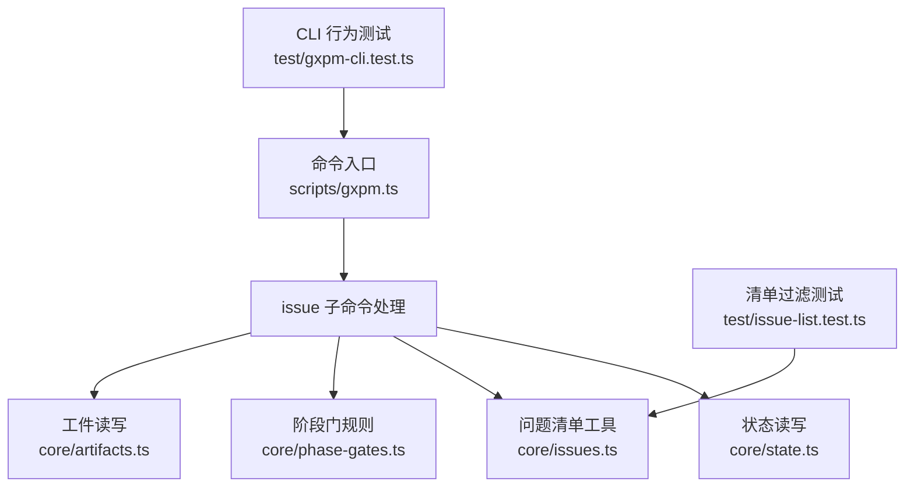
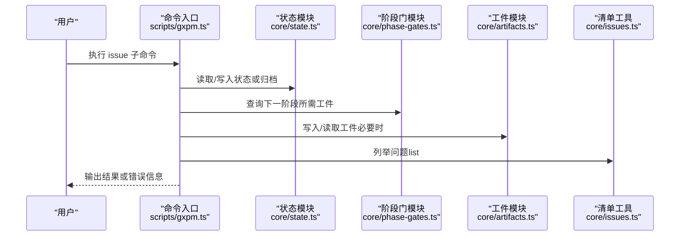
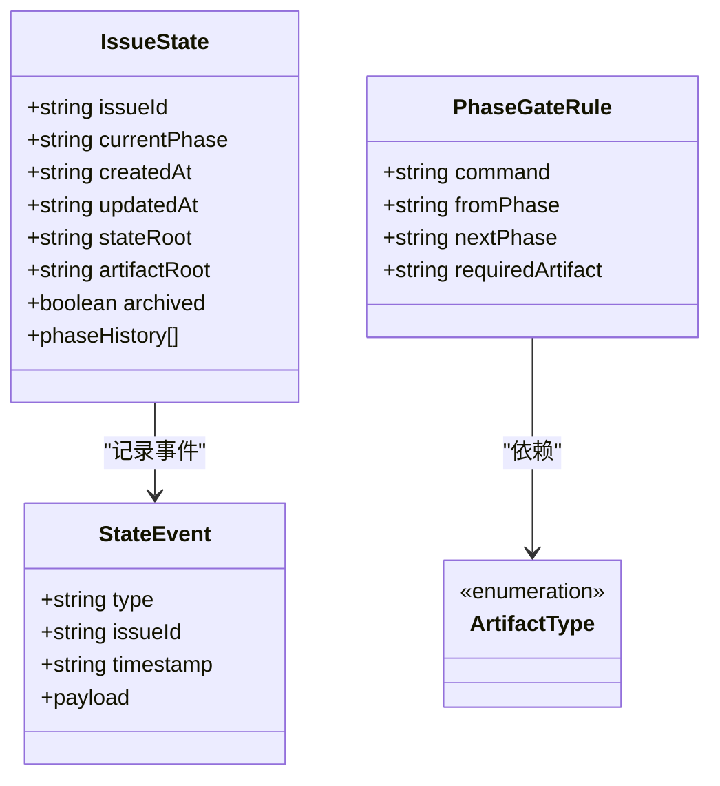

# 项目管理命令

<cite>
**本文引用的文件**
- [scripts/gxpm.ts](file://scripts/gxpm.ts)
- [core/state.ts](file://core/state.ts)
- [core/issues.ts](file://core/issues.ts)
- [core/phase-gates.ts](file://core/phase-gates.ts)
- [core/artifacts.ts](file://core/artifacts.ts)
- [test/gxpm-cli.test.ts](file://test/gxpm-cli.test.ts)
- [test/issue-list.test.ts](file://test/issue-list.test.ts)
</cite>

## 目录
1. [简介](#简介)
2. [项目结构](#项目结构)
3. [核心组件](#核心组件)
4. [架构总览](#架构总览)
5. [详细组件分析](#详细组件分析)
6. [依赖关系分析](#依赖关系分析)
7. [性能考量](#性能考量)
8. [故障排查指南](#故障排查指南)
9. [结论](#结论)
10. [附录](#附录)

## 简介
本文件系统性地记录了项目管理命令中 issue 子命令组的功能与用法，涵盖以下命令：
- issue create：创建新问题（Issue）并初始化状态
- issue status：查看指定问题的当前状态
- issue list：列出问题清单（支持过滤）
- issue archive：归档问题（隐藏于默认列表）
- issue unarchive：取消归档，恢复可见性
- issue next：给出下一步建议（基于阶段门规则）
- issue history：查看问题事件时间线
- issue transition：在阶段之间进行状态转换（受阶段门约束）

同时，文档解释了项目状态管理的工作流程与状态转换规则，并提供常见使用场景与命令行输出示例，帮助用户高效完成问题生命周期管理。

## 项目结构
issue 子命令由脚本入口统一解析与分发，核心状态与数据模型位于 core 模块，测试覆盖了命令行为与边界条件。

图表来源
- [scripts/gxpm.ts:32-256](file://scripts/gxpm.ts#L32-L256)
- [core/state.ts:69-224](file://core/state.ts#L69-L224)
- [core/issues.ts:22-79](file://core/issues.ts#L22-L79)
- [core/phase-gates.ts:25-99](file://core/phase-gates.ts#L25-L99)
- [core/artifacts.ts:57-104](file://core/artifacts.ts#L57-L104)
- [test/gxpm-cli.test.ts:7-42](file://test/gxpm-cli.test.ts#L7-L42)
- [test/issue-list.test.ts:62-109](file://test/issue-list.test.ts#L62-L109)

章节来源
- [scripts/gxpm.ts:32-256](file://scripts/gxpm.ts#L32-L256)

## 核心组件
- 命令入口与路由：负责解析命令行参数，分派到具体子命令实现
- 状态管理：提供问题状态的创建、读取、更新、归档与事件记录
- 阶段门规则：定义从一个阶段到下一个阶段所需的“工件”及命令提示
- 工件系统：提供工件的写入、读取、索引与存在性检查
- 清单工具：列举问题并支持多种过滤策略（默认隐藏归档与已落地）

章节来源
- [scripts/gxpm.ts:76-184](file://scripts/gxpm.ts#L76-L184)
- [core/state.ts:86-224](file://core/state.ts#L86-L224)
- [core/phase-gates.ts:25-99](file://core/phase-gates.ts#L25-L99)
- [core/artifacts.ts:57-104](file://core/artifacts.ts#L57-L104)
- [core/issues.ts:22-79](file://core/issues.ts#L22-L79)

## 架构总览
命令执行路径与数据流如下：

图表来源
- [scripts/gxpm.ts:76-184](file://scripts/gxpm.ts#L76-L184)
- [core/state.ts:138-224](file://core/state.ts#L138-L224)
- [core/phase-gates.ts:107-117](file://core/phase-gates.ts#L107-L117)
- [core/artifacts.ts:57-104](file://core/artifacts.ts#L57-L104)
- [core/issues.ts:22-79](file://core/issues.ts#L22-L79)

## 详细组件分析

### 命令：issue create
- 语法
  - gxpm issue create <issue-id>
  - gxpm issue create --auto-id
- 参数
  - <issue-id>：问题标识符（需满足格式要求）
  - --auto-id：自动生成可用的问题 ID
- 返回值
  - 成功：打印创建成功信息与状态文件路径
  - 失败：抛出错误（如缺少参数或 ID 格式不合法）
- 使用示例
  - 创建指定 ID 的问题
  - 使用自动 ID 创建问题
- 常见场景
  - 新建问题并进入 triage 阶段
- 注意事项
  - 若 ID 已存在，会报错
  - 自动 ID 生成遵循前缀与递增规则

章节来源
- [scripts/gxpm.ts:76-93](file://scripts/gxpm.ts#L76-L93)
- [core/state.ts:86-136](file://core/state.ts#L86-L136)

### 命令：issue status
- 语法
  - gxpm issue status <issue-id>
- 参数
  - <issue-id>：目标问题标识符
- 返回值
  - 输出问题 ID、当前阶段、最后更新时间与状态文件路径
- 使用示例
  - 查看某问题当前所处阶段
- 常见场景
  - 快速确认问题状态，定位问题文件位置

章节来源
- [scripts/gxpm.ts:95-105](file://scripts/gxpm.ts#L95-L105)
- [core/state.ts:138-147](file://core/state.ts#L138-L147)

### 命令：issue list
- 语法
  - gxpm issue list [--json] [--all] [--archived] [--recent N]
- 参数
  - --json：以 JSON 格式输出
  - --all：包含已归档与已落地问题
  - --archived：仅显示已归档问题
  - --recent N：显示最近 N 个落地问题（默认 5）
- 返回值
  - 默认：按 updatedAt 降序输出表格（含 ISSUE、PHASE、UPDATED、FLAGS）
  - --json：输出机器可读数组
- 使用示例
  - 列出所有活跃问题
  - 列出所有问题（含归档）
  - 仅列出归档问题
  - 查看最近落地的 3 个问题
- 常见场景
  - 日常巡检、批量查看、CI 导出

章节来源
- [scripts/gxpm.ts:107-140](file://scripts/gxpm.ts#L107-L140)
- [core/issues.ts:22-79](file://core/issues.ts#L22-L79)
- [test/issue-list.test.ts:149-182](file://test/issue-list.test.ts#L149-L182)

### 命令：issue archive
- 语法
  - gxpm issue archive <issue-id>
- 参数
  - <issue-id>：目标问题标识符
- 返回值
  - 成功：打印“archived <issue-id>”
- 使用示例
  - 将问题归档后，默认列表不再显示
- 常见场景
  - 归档已完成或暂停的问题

章节来源
- [scripts/gxpm.ts:142-149](file://scripts/gxpm.ts#L142-L149)
- [core/state.ts:210-224](file://core/state.ts#L210-L224)
- [test/issue-list.test.ts:111-133](file://test/issue-list.test.ts#L111-L133)

### 命令：issue unarchive
- 语法
  - gxpm issue unarchive <issue-id>
- 参数
  - <issue-id>：目标问题标识符
- 返回值
  - 成功：打印“unarchived <issue-id>”
- 使用示例
  - 取消归档后，问题重新出现在默认列表中
- 常见场景
  - 恢复被误归档的问题

章节来源
- [scripts/gxpm.ts:151-158](file://scripts/gxpm.ts#L151-L158)
- [core/state.ts:210-224](file://core/state.ts#L210-L224)
- [test/issue-list.test.ts:135-146](file://test/issue-list.test.ts#L135-L146)

### 命令：issue next
- 语法
  - gxpm issue next <issue-id>
- 参数
  - <issue-id>：目标问题标识符
- 返回值
  - 当前阶段与下一步建议；若无后续阶段，提示终端状态
- 使用示例
  - 在 triage 阶段：建议先生成 acceptance-contract，再过渡到 plan
  - 在 land 阶段：提示问题已落地，建议在上游跟踪器标记完成
- 常见场景
  - 快速了解下一步操作与所需工件

章节来源
- [scripts/gxpm.ts:160-166](file://scripts/gxpm.ts#L160-L166)
- [scripts/gxpm.ts:362-388](file://scripts/gxpm.ts#L362-L388)
- [core/phase-gates.ts:32-99](file://core/phase-gates.ts#L32-L99)
- [test/gxpm-cli.test.ts:91-148](file://test/gxpm-cli.test.ts#L91-L148)

### 命令：issue history
- 语法
  - gxpm issue history <issue-id> [--json]
- 参数
  - <issue-id>：目标问题标识符
  - --json：以 JSON 格式输出事件时间线
- 返回值
  - 默认：人类可读的时间线（包含事件类型、时间戳与详情）
  - --json：输出事件数组
- 使用示例
  - 查看问题从创建到当前的完整事件轨迹
- 常见场景
  - 审计追踪、问题回溯、自动化分析

章节来源
- [scripts/gxpm.ts:168-174](file://scripts/gxpm.ts#L168-L174)
- [scripts/gxpm.ts:314-340](file://scripts/gxpm.ts#L314-L340)
- [test/gxpm-cli.test.ts:44-89](file://test/gxpm-cli.test.ts#L44-L89)

### 命令：issue transition
- 语法
  - gxpm issue transition <issue-id> <phase>
- 参数
  - <issue-id>：目标问题标识符
  - <phase>：下一阶段名称（必须是允许的后续阶段）
- 返回值
  - 成功：打印“transitioned <issue-id>: <from> -> <to>”
  - 失败：抛出错误（如非法阶段转换或缺失所需工件）
- 使用示例
  - 从 triage 过渡到 plan
  - 从 qa 过渡到 land（需满足阶段门）
- 常见场景
  - 正式推进问题生命周期

章节来源
- [scripts/gxpm.ts:176-184](file://scripts/gxpm.ts#L176-L184)
- [core/state.ts:149-204](file://core/state.ts#L149-L204)
- [core/phase-gates.ts:107-117](file://core/phase-gates.ts#L107-L117)
- [test/gxpm-cli.test.ts:32-42](file://test/gxpm-cli.test.ts#L32-L42)

## 依赖关系分析

图表来源
- [core/state.ts:28-56](file://core/state.ts#L28-L56)
- [core/phase-gates.ts:25-30](file://core/phase-gates.ts#L25-L30)
- [core/artifacts.ts:10-26](file://core/artifacts.ts#L10-L26)

章节来源
- [core/state.ts:28-56](file://core/state.ts#L28-L56)
- [core/phase-gates.ts:25-30](file://core/phase-gates.ts#L25-L30)
- [core/artifacts.ts:10-26](file://core/artifacts.ts#L10-L26)

## 性能考量
- 列表查询：listIssues 对 .gxpm/issues 下的目录进行遍历与排序，复杂度近似 O(N log N)，其中 N 为问题数量
- 过滤策略：默认隐藏归档与 land 阶段问题，减少渲染与传输开销
- 事件读取：history 命令按行解析事件文件，适合小到中等规模事件集
- 建议
  - 大量问题时优先使用 --json 与 --all/--archived 精确过滤
  - 使用 --recent 仅关注近期落地问题，降低输出体积

[本节为通用性能讨论，无需特定文件来源]

## 故障排查指南
- “未知命令”错误
  - 现象：执行 issue 子命令时报错
  - 排查：确认命令拼写与子命令是否正确
  - 参考：命令入口对未知命令的错误处理
- “缺少参数”错误
  - 现象：未提供 issue-id 或 value
  - 排查：确保按语法提供必要参数
  - 参考：各子命令的参数校验逻辑
- “非法阶段转换”错误
  - 现象：transition 报错提示不允许的阶段
  - 排查：使用 issue next 获取正确下一阶段；或检查所需工件是否存在
  - 参考：状态转换与阶段门规则
- “问题未找到”错误
  - 现象：history/next/status 等命令找不到事件或状态
  - 排查：确认 issue-id 是否正确；检查 .gxpm/issues/<issue-id> 目录是否存在
  - 参考：状态读取与事件文件存在性检查
- “缺失所需工件”错误
  - 现象：transition 因缺少工件而阻断
  - 排查：根据 next 建议生成对应工件，再执行 transition
  - 参考：阶段门规则与工件写入

章节来源
- [scripts/gxpm.ts:255](file://scripts/gxpm.ts#L255)
- [scripts/gxpm.ts:96-98](file://scripts/gxpm.ts#L96-L98)
- [scripts/gxpm.ts:177-179](file://scripts/gxpm.ts#L177-L179)
- [scripts/gxpm.ts:316-318](file://scripts/gxpm.ts#L316-L318)
- [core/state.ts:298-301](file://core/state.ts#L298-L301)

## 结论
issue 子命令组提供了完整的项目问题生命周期管理能力：从创建、状态查看、清单管理、归档控制，到阶段推进与审计追踪。通过阶段门规则与工件系统，命令确保了流程的合规性与可追溯性。结合测试用例与常见使用场景，用户可以高效地组织与推进问题工作流。

[本节为总结性内容，无需特定文件来源]

## 附录

### 阶段与阶段门规则概览
- 支持的阶段顺序（从 triage 到 land）
- 每个阶段到下一阶段所需的工件类型与推荐命令
- 终端阶段（land）的特殊提示

章节来源
- [core/state.ts:11-24](file://core/state.ts#L11-L24)
- [core/phase-gates.ts:32-99](file://core/phase-gates.ts#L32-L99)

### 常见使用场景与命令行输出示例
- 创建并查看状态
  - 命令：gxpm issue create GXPM-10
  - 输出：创建成功与状态文件路径
  - 后续：gxpm issue status GXPM-10
- 推进阶段
  - 命令：gxpm triage init GXPM-10
  - 命令：gxpm issue transition GXPM-10 plan
  - 输出：transitioned GXPM-10: triage -> plan
- 查看历史
  - 命令：gxpm issue history GXPM-10
  - 输出：事件时间线（含 issue.created、phase.transitioned、artifact.written 等）
- 列表过滤
  - 命令：gxpm issue list --all
  - 输出：包含归档与落地问题的表格或 JSON
- 下一步建议
  - 命令：gxpm issue next GXPM-10
  - 输出：当前阶段与下一步所需工件与命令提示

章节来源
- [test/gxpm-cli.test.ts:7-42](file://test/gxpm-cli.test.ts#L7-L42)
- [test/gxpm-cli.test.ts:44-89](file://test/gxpm-cli.test.ts#L44-L89)
- [test/gxpm-cli.test.ts:91-148](file://test/gxpm-cli.test.ts#L91-L148)
- [test/issue-list.test.ts:149-182](file://test/issue-list.test.ts#L149-L182)