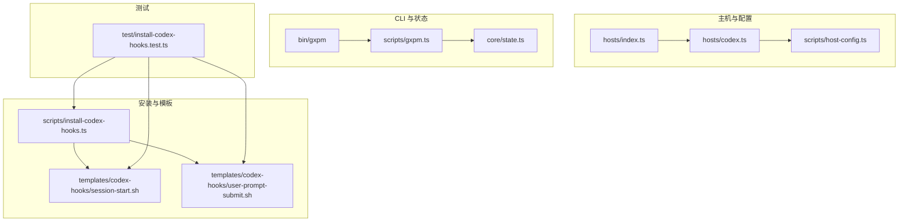
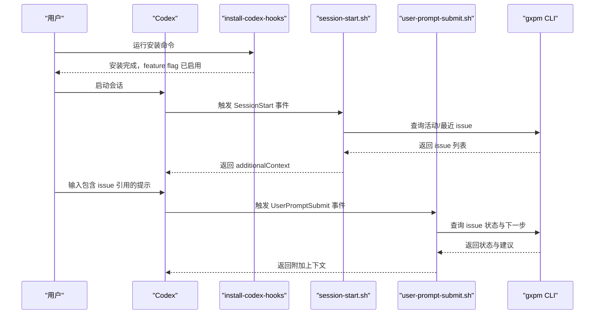
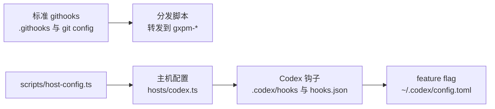
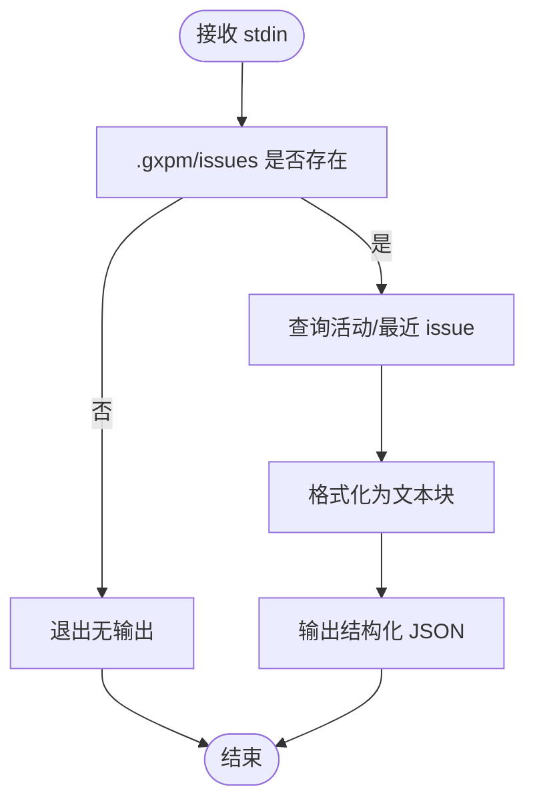
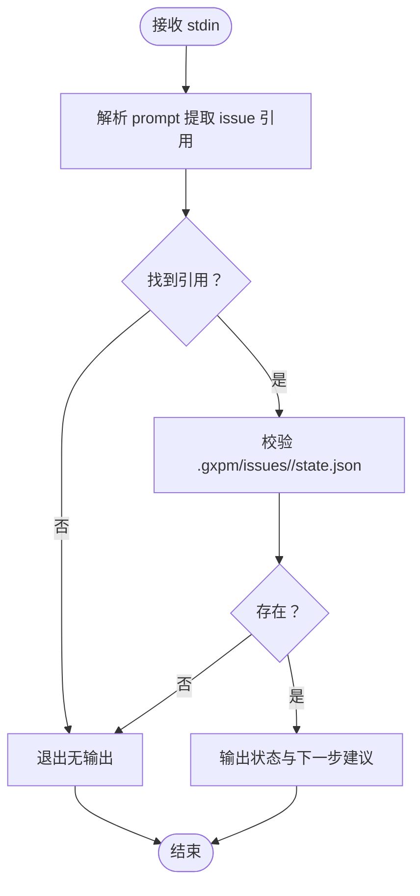
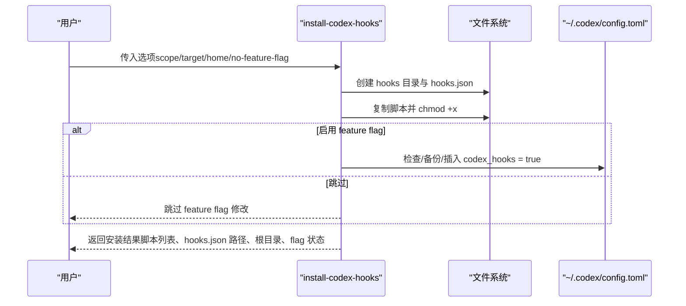
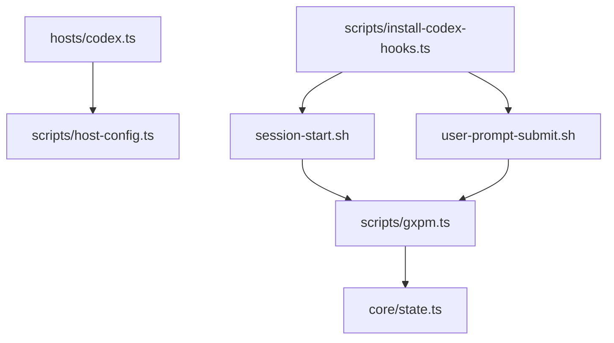

# Codex 钩子集成

<cite>
**本文引用的文件**
- [hosts/codex.ts](file://hosts/codex.ts)
- [scripts/install-codex-hooks.ts](file://scripts/install-codex-hooks.ts)
- [templates/codex-hooks/session-start.sh](file://templates/codex-hooks/session-start.sh)
- [templates/codex-hooks/user-prompt-submit.sh](file://templates/codex-hooks/user-prompt-submit.sh)
- [scripts/host-config.ts](file://scripts/host-config.ts)
- [hosts/index.ts](file://hosts/index.ts)
- [scripts/install-hooks.ts](file://scripts/install-hooks.ts)
- [bin/gxpm](file://bin/gxpm)
- [scripts/gxpm.ts](file://scripts/gxpm.ts)
- [core/state.ts](file://core/state.ts)
- [test/install-codex-hooks.test.ts](file://test/install-codex-hooks.test.ts)
- [package.json](file://package.json)
</cite>

## 目录
1. [简介](#简介)
2. [项目结构](#项目结构)
3. [核心组件](#核心组件)
4. [架构总览](#架构总览)
5. [详细组件分析](#详细组件分析)
6. [依赖关系分析](#依赖关系分析)
7. [性能考量](#性能考量)
8. [故障排除指南](#故障排除指南)
9. [结论](#结论)
10. [附录](#附录)

## 简介
本文件系统性阐述 gxpm 的 Codex 钩子集成方案，重点对比 Codex 钩子与标准 Git 钩子（githooks）的差异，详解会话启动与用户提示提交两个事件钩子的工作原理、配置项与扩展方式，并提供安装步骤、最佳实践与性能优化建议。Codex 钩子通过在用户会话中注入上下文信息，提升 AI 辅助开发的准确性与一致性。

## 项目结构
围绕 Codex 钩子的相关文件组织如下：
- 主机适配配置：hosts/codex.ts 定义 Codex 主机的安装与前端元数据策略
- 安装脚本：scripts/install-codex-hooks.ts 负责将钩子脚本复制到目标位置、生成 hooks.json 并确保 feature flag
- 钩子模板：templates/codex-hooks 下的 session-start.sh 与 user-prompt-submit.sh
- 标准 Git 钩子安装：scripts/install-hooks.ts 提供传统 githooks 的安装逻辑（与 Codex 钩子互补）
- CLI 入口与核心命令：bin/gxpm 与 scripts/gxpm.ts 提供 issue/artifact/state 等命令
- 测试：test/install-codex-hooks.test.ts 验证安装行为与脚本输出

图表来源
- [hosts/codex.ts:1-19](file://hosts/codex.ts#L1-L19)
- [scripts/host-config.ts:1-83](file://scripts/host-config.ts#L1-L83)
- [scripts/install-codex-hooks.ts:1-214](file://scripts/install-codex-hooks.ts#L1-L214)
- [templates/codex-hooks/session-start.sh:1-71](file://templates/codex-hooks/session-start.sh#L1-L71)
- [templates/codex-hooks/user-prompt-submit.sh:1-46](file://templates/codex-hooks/user-prompt-submit.sh#L1-L46)
- [scripts/install-hooks.ts:1-106](file://scripts/install-hooks.ts#L1-L106)
- [bin/gxpm:1-18](file://bin/gxpm#L1-L18)
- [scripts/gxpm.ts:1-699](file://scripts/gxpm.ts#L1-L699)
- [core/state.ts:1-303](file://core/state.ts#L1-L303)
- [test/install-codex-hooks.test.ts:1-212](file://test/install-codex-hooks.test.ts#L1-L212)

章节来源
- [hosts/codex.ts:1-19](file://hosts/codex.ts#L1-L19)
- [scripts/host-config.ts:1-83](file://scripts/host-config.ts#L1-L83)
- [scripts/install-codex-hooks.ts:1-214](file://scripts/install-codex-hooks.ts#L1-L214)
- [templates/codex-hooks/session-start.sh:1-71](file://templates/codex-hooks/session-start.sh#L1-L71)
- [templates/codex-hooks/user-prompt-submit.sh:1-46](file://templates/codex-hooks/user-prompt-submit.sh#L1-L46)
- [scripts/install-hooks.ts:1-106](file://scripts/install-hooks.ts#L1-L106)
- [bin/gxpm:1-18](file://bin/gxpm#L1-L18)
- [scripts/gxpm.ts:1-699](file://scripts/gxpm.ts#L1-L699)
- [core/state.ts:1-303](file://core/state.ts#L1-L303)
- [test/install-codex-hooks.test.ts:1-212](file://test/install-codex-hooks.test.ts#L1-L212)

## 核心组件
- Codex 主机配置：定义主机名称、显示名、CLI 命令、技能存储根路径、是否使用环境变量、frontmatter 策略与安装策略等
- 安装器：负责选择安装范围（用户级或仓库级）、复制钩子脚本、生成 hooks.json、合并现有钩子条目、确保 feature flag
- 钩子脚本：会话启动钩子在会话开始时注入活动 issue 的上下文；用户提示提交钩子在用户输入包含 issue 引用时注入该 issue 的状态与下一步建议
- CLI 与状态：bin/gxpm 与 scripts/gxpm.ts 提供 issue/artifact/state 等命令，供钩子脚本调用以生成上下文

章节来源
- [hosts/codex.ts:3-18](file://hosts/codex.ts#L3-L18)
- [scripts/install-codex-hooks.ts:30-95](file://scripts/install-codex-hooks.ts#L30-L95)
- [templates/codex-hooks/session-start.sh:10-71](file://templates/codex-hooks/session-start.sh#L10-L71)
- [templates/codex-hooks/user-prompt-submit.sh:11-46](file://templates/codex-hooks/user-prompt-submit.sh#L11-L46)
- [bin/gxpm:1-18](file://bin/gxpm#L1-L18)
- [scripts/gxpm.ts:96-201](file://scripts/gxpm.ts#L96-L201)

## 架构总览
Codex 钩子的运行链路分为“安装期”和“运行期”两部分：
- 安装期：install-codex-hooks 将脚本复制到 .codex/hooks，生成 hooks.json 并确保 feature flag
- 运行期：Codex 触发事件钩子，脚本读取 stdin 的上下文，调用 gxpm CLI 获取 issue 状态与建议，返回结构化输出供 Codex 使用

图表来源
- [scripts/install-codex-hooks.ts:30-95](file://scripts/install-codex-hooks.ts#L30-L95)
- [templates/codex-hooks/session-start.sh:10-71](file://templates/codex-hooks/session-start.sh#L10-L71)
- [templates/codex-hooks/user-prompt-submit.sh:11-46](file://templates/codex-hooks/user-prompt-submit.sh#L11-L46)
- [scripts/gxpm.ts:96-201](file://scripts/gxpm.ts#L96-L201)

## 详细组件分析

### Codex 主机配置与标准 githooks 的区别
- Codex 钩子安装在用户级或仓库级的 .codex 目录，而非 .git 钩子目录
- Codex 需要在配置中开启 feature flag（codex_hooks = true），否则钩子不会触发
- Codex 钩子通过 hooks.json 描述事件与命令，支持多条目合并，避免覆盖用户原有钩子
- 标准 githooks 通过 git config core.hooksPath 指向 .githooks，并由 gxpm- 前缀的分发脚本转发

图表来源
- [scripts/install-codex-hooks.ts:90-134](file://scripts/install-codex-hooks.ts#L90-L134)
- [scripts/install-hooks.ts:50-103](file://scripts/install-hooks.ts#L50-L103)
- [hosts/codex.ts:3-18](file://hosts/codex.ts#L3-L18)
- [scripts/host-config.ts:11-23](file://scripts/host-config.ts#L11-L23)

章节来源
- [scripts/install-codex-hooks.ts:90-134](file://scripts/install-codex-hooks.ts#L90-L134)
- [scripts/install-hooks.ts:50-103](file://scripts/install-hooks.ts#L50-L103)
- [hosts/codex.ts:3-18](file://hosts/codex.ts#L3-L18)
- [scripts/host-config.ts:11-23](file://scripts/host-config.ts#L11-L23)

### 会话启动钩子（SessionStart）
- 输入：Codex 通过 stdin 传递 session_id、transcript_path、cwd、hook_event_name、model、source 等
- 行为：若 cwd 下存在 .gxpm/issues，则列出活动 issue 或最近落地 issue，格式化为 additionalContext；否则静默退出
- 输出：返回结构化 JSON，包含 hookEventName 与 additionalContext 字段

图表来源
- [templates/codex-hooks/session-start.sh:13-71](file://templates/codex-hooks/session-start.sh#L13-L71)
- [scripts/gxpm.ts:108-141](file://scripts/gxpm.ts#L108-L141)

章节来源
- [templates/codex-hooks/session-start.sh:10-71](file://templates/codex-hooks/session-start.sh#L10-L71)
- [scripts/gxpm.ts:108-141](file://scripts/gxpm.ts#L108-L141)

### 用户提示提交钩子（UserPromptSubmit）
- 输入：Codex 通过 stdin 传递 session_id、transcript_path、cwd、hook_event_name、model、turn_id、prompt 等
- 行为：从 prompt 中提取首个 GXPM-/GXG- 数字引用，校验该 issue 的 state.json 是否存在，存在则输出状态与下一步建议
- 输出：附加上下文文本（供 Codex 在提示中使用）

图表来源
- [templates/codex-hooks/user-prompt-submit.sh:14-46](file://templates/codex-hooks/user-prompt-submit.sh#L14-L46)
- [scripts/gxpm.ts:96-106](file://scripts/gxpm.ts#L96-L106)
- [scripts/gxpm.ts:161-167](file://scripts/gxpm.ts#L161-L167)

章节来源
- [templates/codex-hooks/user-prompt-submit.sh:11-46](file://templates/codex-hooks/user-prompt-submit.sh#L11-L46)
- [scripts/gxpm.ts:96-106](file://scripts/gxpm.ts#L96-L106)
- [scripts/gxpm.ts:161-167](file://scripts/gxpm.ts#L161-L167)

### 安装器与 hooks.json 合并策略
- 支持两种安装范围：user（~/.codex）与 repo（仓库/.codex）
- 复制脚本并赋予执行权限，生成 hooks.json，保留用户已有的其他事件钩子
- feature flag 自动启用（可选跳过），并进行幂等处理与备份

图表来源
- [scripts/install-codex-hooks.ts:30-95](file://scripts/install-codex-hooks.ts#L30-L95)
- [scripts/install-codex-hooks.ts:102-134](file://scripts/install-codex-hooks.ts#L102-L134)
- [scripts/install-codex-hooks.ts:136-164](file://scripts/install-codex-hooks.ts#L136-L164)

章节来源
- [scripts/install-codex-hooks.ts:30-95](file://scripts/install-codex-hooks.ts#L30-L95)
- [scripts/install-codex-hooks.ts:102-134](file://scripts/install-codex-hooks.ts#L102-L134)
- [scripts/install-codex-hooks.ts:136-164](file://scripts/install-codex-hooks.ts#L136-L164)

### 与标准 githooks 的对比与互补
- 安装位置不同：Codex 钩子在 .codex；githooks 在 .githooks
- 触发机制不同：Codex 钩子由 Codex 事件触发；githooks 由 Git 事件触发
- 配置方式不同：Codex 需 feature flag；githooks 通过 git config core.hooksPath
- 互补关系：两者可并存，分别覆盖不同场景（AI 会话 vs. 本地 Git 流程）

章节来源
- [scripts/install-hooks.ts:50-103](file://scripts/install-hooks.ts#L50-L103)
- [scripts/install-codex-hooks.ts:30-95](file://scripts/install-codex-hooks.ts#L30-L95)

## 依赖关系分析
- 主机配置依赖 host-config.ts 的类型与校验规则
- 安装器依赖模板脚本与 hooks.json 结构
- 钩子脚本依赖 gxpm CLI 的 issue/list、issue/status、issue/next 等命令
- CLI 依赖 core/state.ts 的状态模型与转换逻辑

图表来源
- [hosts/codex.ts:3-18](file://hosts/codex.ts#L3-L18)
- [scripts/host-config.ts:11-23](file://scripts/host-config.ts#L11-L23)
- [scripts/install-codex-hooks.ts:41-88](file://scripts/install-codex-hooks.ts#L41-L88)
- [templates/codex-hooks/session-start.sh:27-28](file://templates/codex-hooks/session-start.sh#L27-L28)
- [templates/codex-hooks/user-prompt-submit.sh:42-45](file://templates/codex-hooks/user-prompt-submit.sh#L42-L45)
- [scripts/gxpm.ts:96-201](file://scripts/gxpm.ts#L96-L201)
- [core/state.ts:139-205](file://core/state.ts#L139-L205)

章节来源
- [hosts/codex.ts:3-18](file://hosts/codex.ts#L3-L18)
- [scripts/host-config.ts:11-23](file://scripts/host-config.ts#L11-L23)
- [scripts/install-codex-hooks.ts:41-88](file://scripts/install-codex-hooks.ts#L41-L88)
- [templates/codex-hooks/session-start.sh:27-28](file://templates/codex-hooks/session-start.sh#L27-L28)
- [templates/codex-hooks/user-prompt-submit.sh:42-45](file://templates/codex-hooks/user-prompt-submit.sh#L42-L45)
- [scripts/gxpm.ts:96-201](file://scripts/gxpm.ts#L96-L201)
- [core/state.ts:139-205](file://core/state.ts#L139-L205)

## 性能考量
- 钩子脚本尽量短小、快速：仅在必要时调用 gxpm CLI，避免复杂计算
- hooks.json 合并策略避免重复注册，减少 Codex 启动时的扫描开销
- feature flag 检查与写入仅在需要时进行，且幂等，降低重复安装成本
- 建议在大型仓库中限制会话启动钩子返回的 issue 数量，避免上下文过大影响响应速度

## 故障排除指南
- 安装后钩子未触发
  - 检查 feature flag 是否启用（~/.codex/config.toml 中 [features] 区段）
  - 确认 hooks.json 中 SessionStart/UserPromptSubmit 条目已正确写入
  - 重启 Codex 使配置生效
- 钩子脚本无输出
  - 确保当前工作目录下存在 .gxpm/issues
  - 确认 gxpm 与 python3 命令可用
  - 对于 UserPromptSubmit，确认提示中包含有效的 GXPM-/GXG- 引用
- 重复安装导致条目重复
  - 安装器具备幂等性，会合并现有 hooks.json，保留用户自有钩子
- 与其他钩子冲突
  - 安装器会保留用户原有的其他事件钩子，避免覆盖

章节来源
- [scripts/install-codex-hooks.ts:102-134](file://scripts/install-codex-hooks.ts#L102-L134)
- [scripts/install-codex-hooks.ts:136-164](file://scripts/install-codex-hooks.ts#L136-L164)
- [test/install-codex-hooks.test.ts:100-146](file://test/install-codex-hooks.test.ts#L100-L146)
- [templates/codex-hooks/session-start.sh:10-23](file://templates/codex-hooks/session-start.sh#L10-L23)
- [templates/codex-hooks/user-prompt-submit.sh:11-31](file://templates/codex-hooks/user-prompt-submit.sh#L11-L31)

## 结论
Codex 钩子通过在会话启动与用户提示提交时注入上下文，显著提升了 AI 辅助开发的一致性与准确性。其安装器具备幂等性与合并策略，确保与用户既有钩子共存。结合标准 githooks，可形成“本地 Git 流程 + AI 会话上下文”的双重保障体系。

## 附录

### 安装步骤
- 选择安装范围：user（~/.codex）或 repo（仓库/.codex）
- 运行安装器，按需传入 --scope、--target、--home、--no-feature-flag 等参数
- 安装器会复制脚本、生成 hooks.json、确保 feature flag，并打印安装结果

章节来源
- [scripts/install-codex-hooks.ts:30-95](file://scripts/install-codex-hooks.ts#L30-L95)
- [scripts/install-codex-hooks.ts:166-177](file://scripts/install-codex-hooks.ts#L166-L177)

### 配置参数
- scope：安装范围（user 或 repo）
- target：仓库路径（仅 repo 范围有效）
- home：用户主目录（测试用途）
- enableFeatureFlag：是否自动启用 feature flag（默认启用）

章节来源
- [scripts/install-codex-hooks.ts:6-17](file://scripts/install-codex-hooks.ts#L6-L17)

### 自定义扩展方法
- 在 hooks.json 中为同一事件添加额外钩子条目，安装器会保留用户自有条目
- 修改模板脚本以扩展上下文生成逻辑（需保持与 Codex 的输入/输出约定一致）
- 通过 gxpm CLI 的命令扩展 issue 状态与建议的生成规则

章节来源
- [scripts/install-codex-hooks.ts:136-164](file://scripts/install-codex-hooks.ts#L136-L164)
- [templates/codex-hooks/session-start.sh:30-71](file://templates/codex-hooks/session-start.sh#L30-L71)
- [templates/codex-hooks/user-prompt-submit.sh:17-46](file://templates/codex-hooks/user-prompt-submit.sh#L17-L46)
- [scripts/gxpm.ts:96-201](file://scripts/gxpm.ts#L96-L201)