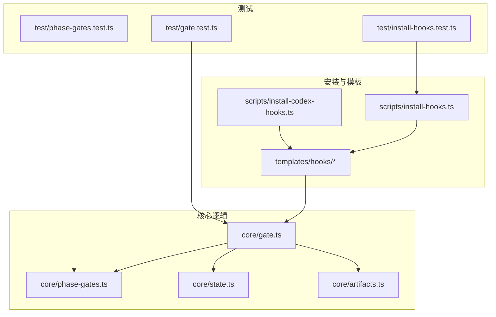
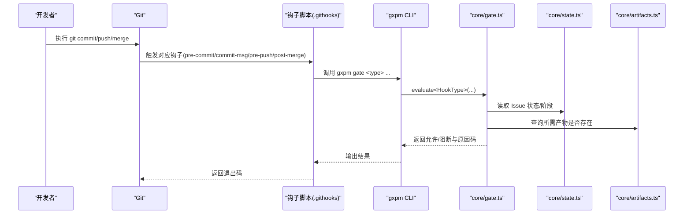
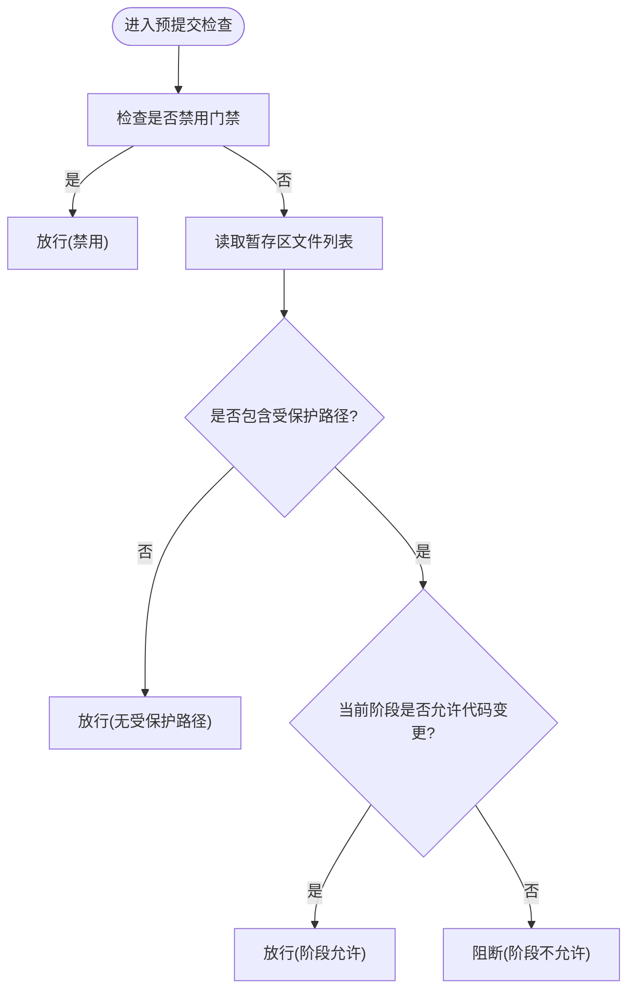
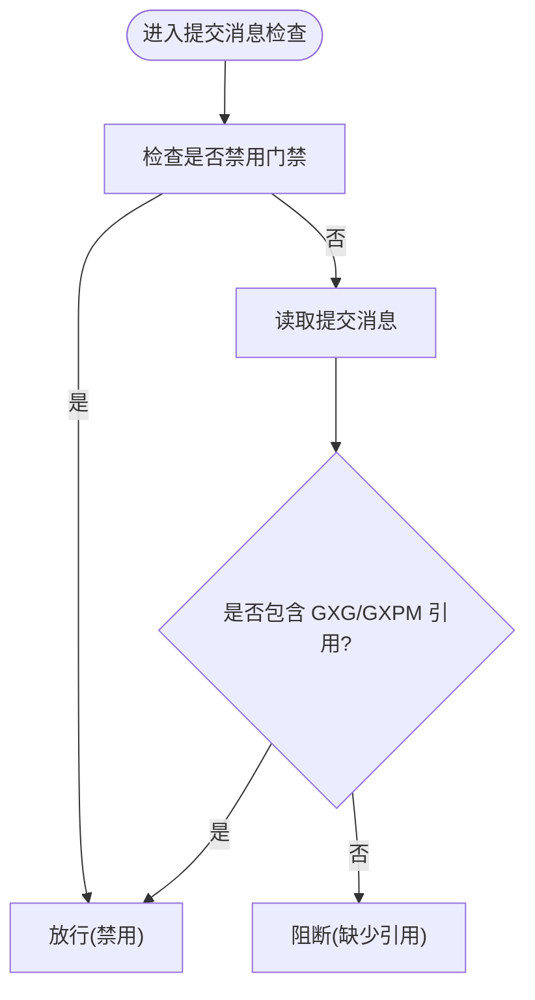
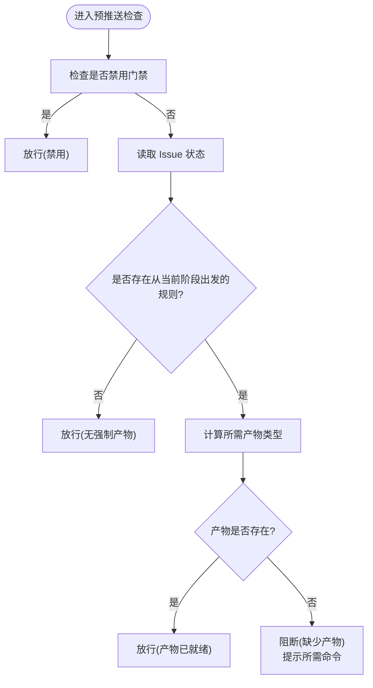
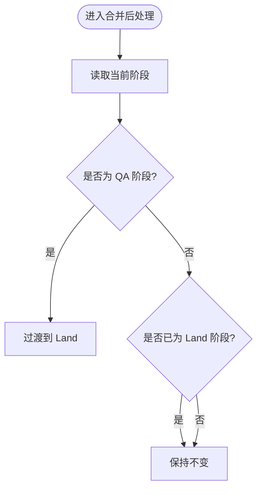
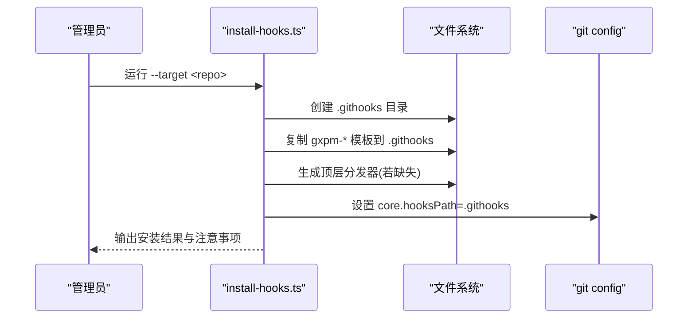
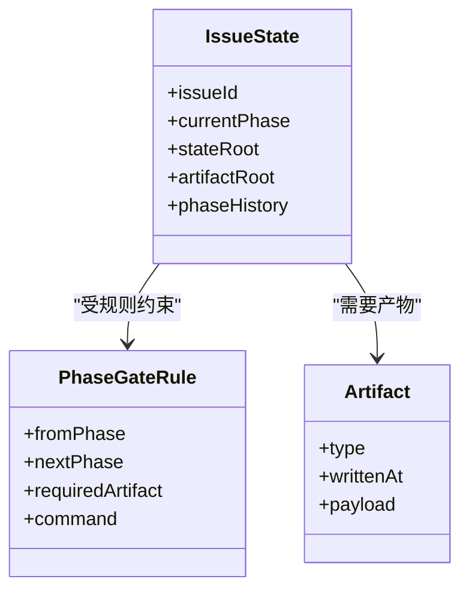
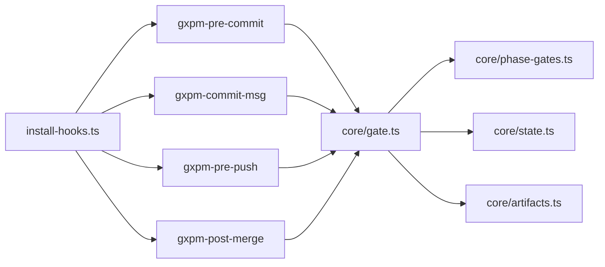

# Git hooks 集成

<cite>
**本文引用的文件**
- [scripts/install-hooks.ts](file://scripts/install-hooks.ts)
- [scripts/install-codex-hooks.ts](file://scripts/install-codex-hooks.ts)
- [core/gate.ts](file://core/gate.ts)
- [core/phase-gates.ts](file://core/phase-gates.ts)
- [core/state.ts](file://core/state.ts)
- [core/artifacts.ts](file://core/artifacts.ts)
- [templates/hooks/gxpm-pre-commit](file://templates/hooks/gxpm-pre-commit)
- [templates/hooks/gxpm-commit-msg](file://templates/hooks/gxpm-commit-msg)
- [templates/hooks/gxpm-pre-push](file://templates/hooks/gxpm-pre-push)
- [templates/hooks/gxpm-post-merge](file://templates/hooks/gxpm-post-merge)
- [test/gate.test.ts](file://test/gate.test.ts)
- [test/install-hooks.test.ts](file://test/install-hooks.test.ts)
- [test/phase-gates.test.ts](file://test/phase-gates.test.ts)
</cite>

## 目录
1. [简介](#简介)
2. [项目结构](#项目结构)
3. [核心组件](#核心组件)
4. [架构总览](#架构总览)
5. [详细组件分析](#详细组件分析)
6. [依赖关系分析](#依赖关系分析)
7. [性能考虑](#性能考虑)
8. [故障排除指南](#故障排除指南)
9. [结论](#结论)
10. [附录](#附录)

## 简介
本文件面向 gxpm 的 Git hooks 集成能力，系统性说明四类门禁检查的工作原理：预提交检查、提交消息检查、预推送检查与合并后检查；提供钩子安装与配置步骤；解释钩子如何与项目管理流程（Issue 状态与阶段）集成；给出可定制化与扩展方法；并附带常见问题排查与性能优化建议。

## 项目结构
与 Git hooks 集成直接相关的目录与文件包括：
- 安装脚本：scripts/install-hooks.ts、scripts/install-codex-hooks.ts
- 钩子模板：templates/hooks 下的 gxpm-pre-commit、gxpm-commit-msg、gxpm-pre-push、gxpm-post-merge
- 核心门禁逻辑：core/gate.ts
- 阶段与产物规则：core/phase-gates.ts
- Issue 状态与事件：core/state.ts
- 产物读写：core/artifacts.ts
- 测试用例：test/gate.test.ts、test/install-hooks.test.ts、test/phase-gates.test.ts

图表来源
- [scripts/install-hooks.ts:1-106](file://scripts/install-hooks.ts#L1-L106)
- [scripts/install-codex-hooks.ts:1-214](file://scripts/install-codex-hooks.ts#L1-L214)
- [core/gate.ts:1-144](file://core/gate.ts#L1-L144)
- [core/phase-gates.ts:1-118](file://core/phase-gates.ts#L1-L118)
- [core/state.ts:1-302](file://core/state.ts#L1-L302)
- [core/artifacts.ts:1-169](file://core/artifacts.ts#L1-L169)
- [test/gate.test.ts:1-128](file://test/gate.test.ts#L1-L128)
- [test/install-hooks.test.ts:1-77](file://test/install-hooks.test.ts#L1-L77)
- [test/phase-gates.test.ts:1-118](file://test/phase-gates.test.ts#L1-L118)

章节来源
- [scripts/install-hooks.ts:1-106](file://scripts/install-hooks.ts#L1-L106)
- [scripts/install-codex-hooks.ts:1-214](file://scripts/install-codex-hooks.ts#L1-L214)
- [core/gate.ts:1-144](file://core/gate.ts#L1-L144)
- [core/phase-gates.ts:1-118](file://core/phase-gates.ts#L1-L118)
- [core/state.ts:1-302](file://core/state.ts#L1-L302)
- [core/artifacts.ts:1-169](file://core/artifacts.ts#L1-L169)
- [test/gate.test.ts:1-128](file://test/gate.test.ts#L1-L128)
- [test/install-hooks.test.ts:1-77](file://test/install-hooks.test.ts#L1-L77)
- [test/phase-gates.test.ts:1-118](file://test/phase-gates.test.ts#L1-L118)

## 核心组件
- 四类门禁检查函数：预提交、提交消息、预推送、合并后
- 阶段与产物规则：受控的阶段流转与必需产物类型
- Issue 状态与事件：记录当前阶段、历史与事件流
- 产物读写：校验与索引产物，驱动门禁判断
- 安装器：自动在仓库中安装钩子与设置 core.hooksPath
- Codex 钩子：在 Codex 环境下启用会话与用户提示钩子

章节来源
- [core/gate.ts:48-144](file://core/gate.ts#L48-L144)
- [core/phase-gates.ts:25-118](file://core/phase-gates.ts#L25-L118)
- [core/state.ts:28-302](file://core/state.ts#L28-L302)
- [core/artifacts.ts:57-169](file://core/artifacts.ts#L57-L169)
- [scripts/install-hooks.ts:50-106](file://scripts/install-hooks.ts#L50-L106)
- [scripts/install-codex-hooks.ts:30-95](file://scripts/install-codex-hooks.ts#L30-L95)

## 架构总览
Git 钩子通过模板脚本在提交生命周期触发 gxpm 子命令，由核心门禁模块根据 Issue 状态与阶段规则进行判定，并结合产物存在性决定允许或阻断。Codex 钩子独立于上述流程，在 Codex 环境中执行扫描与问题解析。

图表来源
- [templates/hooks/gxpm-pre-commit:1-31](file://templates/hooks/gxpm-pre-commit#L1-L31)
- [templates/hooks/gxpm-commit-msg:1-17](file://templates/hooks/gxpm-commit-msg#L1-L17)
- [core/gate.ts:48-144](file://core/gate.ts#L48-L144)
- [core/state.ts:138-204](file://core/state.ts#L138-L204)
- [core/artifacts.ts:120-125](file://core/artifacts.ts#L120-L125)

## 详细组件分析

### 预提交检查（pre-commit）
- 触发时机：git commit 前，对暂存区文件生效
- 关键逻辑：
  - 若环境变量禁用门禁则放行
  - 若暂存区无受保护路径变更则放行
  - 否则仅允许处于“代码可提交”阶段的变更
- 受保护路径：如 apps/、server/、packages/、scripts/、tests/、supabase/、e2e/
- 与阶段规则联动：受 CODE_COMMIT_PHASES 控制

图表来源
- [core/gate.ts:48-80](file://core/gate.ts#L48-L80)
- [core/phase-gates.ts:4-23](file://core/phase-gates.ts#L4-L23)

章节来源
- [core/gate.ts:48-80](file://core/gate.ts#L48-L80)
- [core/phase-gates.ts:4-23](file://core/phase-gates.ts#L4-L23)
- [test/gate.test.ts:21-58](file://test/gate.test.ts#L21-L58)

### 提交消息检查（commit-msg）
- 触发时机：git commit-msg 阶段
- 关键逻辑：
  - 若禁用门禁则放行
  - 提交信息必须包含 Issue 引用（如 GXG-xxx 或 GXPM-xxx）
- 与阶段规则解耦，仅做文本匹配

图表来源
- [core/gate.ts:82-100](file://core/gate.ts#L82-L100)

章节来源
- [core/gate.ts:82-100](file://core/gate.ts#L82-L100)
- [test/gate.test.ts:60-81](file://test/gate.test.ts#L60-L81)

### 预推送检查（pre-push）
- 触发时机：git push 前
- 关键逻辑：
  - 若禁用门禁则放行
  - 查找当前阶段的出站规则，要求具备对应产物
  - 产物存在则放行，否则阻断并提示所需命令
- 产物类型来自阶段规则表，命令提示来自规则中的 command 字段

图表来源
- [core/gate.ts:102-130](file://core/gate.ts#L102-L130)
- [core/phase-gates.ts:32-99](file://core/phase-gates.ts#L32-L99)
- [core/artifacts.ts:120-125](file://core/artifacts.ts#L120-L125)

章节来源
- [core/gate.ts:102-130](file://core/gate.ts#L102-L130)
- [core/phase-gates.ts:32-99](file://core/phase-gates.ts#L32-L99)
- [test/gate.test.ts:83-110](file://test/gate.test.ts#L83-L110)

### 合并后检查（post-merge）
- 触发时机：git 本地合并完成
- 关键逻辑：
  - 若当前阶段为 QA，则自动过渡到 Land
  - 若已处于 Land，则不重复过渡
  - 其他阶段保持不变

图表来源
- [core/gate.ts:132-143](file://core/gate.ts#L132-L143)

章节来源
- [core/gate.ts:132-143](file://core/gate.ts#L132-L143)
- [test/gate.test.ts:112-127](file://test/gate.test.ts#L112-L127)

### 钩子安装与配置
- 安装器会：
  - 在目标仓库创建 .githooks 目录并复制四个钩子模板
  - 为每个顶层钩子生成分发器脚本（若不存在），转发参数
  - 设置 git config core.hooksPath=.githooks
  - 若已有顶层钩子则跳过覆盖，并提示追加调用 gxpm 钩子
- Codex 钩子安装器会：
  - 复制会话开始与用户提示两个脚本至 .codex/hooks
  - 写入 hooks.json 并合并现有条目
  - 确保 ~/.codex/config.toml 中 features.codex_hooks=true

图表来源
- [scripts/install-hooks.ts:50-106](file://scripts/install-hooks.ts#L50-L106)

章节来源
- [scripts/install-hooks.ts:50-106](file://scripts/install-hooks.ts#L50-L106)
- [test/install-hooks.test.ts:18-77](file://test/install-hooks.test.ts#L18-L77)
- [scripts/install-codex-hooks.ts:30-95](file://scripts/install-codex-hooks.ts#L30-L95)

### 与项目管理流程的集成
- Issue 状态与阶段：
  - Issue 状态文件位于 .gxpm/issues/<issue-id>/state.json
  - 阶段按顺序推进，受规则约束
- 产物与门禁：
  - 某些阶段转换需要特定产物存在
  - 产物以 artifacts/*.json 形式存储并维护索引
- 事件日志：
  - 门禁通过事件记录“通过/阻断”，便于审计与回溯

图表来源
- [core/state.ts:28-43](file://core/state.ts#L28-L43)
- [core/phase-gates.ts:25-30](file://core/phase-gates.ts#L25-L30)
- [core/artifacts.ts:28-41](file://core/artifacts.ts#L28-L41)

章节来源
- [core/state.ts:138-204](file://core/state.ts#L138-L204)
- [core/phase-gates.ts:32-99](file://core/phase-gates.ts#L32-L99)
- [core/artifacts.ts:57-125](file://core/artifacts.ts#L57-L125)

### 自定义与扩展
- 自定义门禁：
  - 通过环境变量 GXPM_GATE_DISABLE=1 临时禁用门禁
  - 在现有规则基础上扩展阶段与产物类型时，需同步更新阶段规则表与 CLI 命令提示
- 扩展钩子：
  - 如需在现有顶层钩子中接入 gxpm，可按安装器提示追加调用
  - Codex 钩子可通过安装器选择用户级或仓库级作用域

章节来源
- [core/gate.ts:40-42](file://core/gate.ts#L40-L42)
- [scripts/install-hooks.ts:94-102](file://scripts/install-hooks.ts#L94-L102)
- [scripts/install-codex-hooks.ts:30-95](file://scripts/install-codex-hooks.ts#L30-L95)

## 依赖关系分析
- 钩子模板依赖 gxpm CLI 子命令
- 门禁模块依赖阶段规则与 Issue 状态
- 预推送门禁依赖产物存在性查询
- 安装器依赖 Git 仓库与文件系统操作

图表来源
- [templates/hooks/gxpm-pre-commit:1-31](file://templates/hooks/gxpm-pre-commit#L1-L31)
- [templates/hooks/gxpm-commit-msg:1-17](file://templates/hooks/gxpm-commit-msg#L1-L17)
- [core/gate.ts:48-144](file://core/gate.ts#L48-L144)
- [core/phase-gates.ts:1-118](file://core/phase-gates.ts#L1-L118)
- [core/state.ts:1-302](file://core/state.ts#L1-L302)
- [core/artifacts.ts:1-169](file://core/artifacts.ts#L1-L169)
- [scripts/install-hooks.ts:50-106](file://scripts/install-hooks.ts#L50-L106)

章节来源
- [core/gate.ts:48-144](file://core/gate.ts#L48-L144)
- [core/phase-gates.ts:1-118](file://core/phase-gates.ts#L1-L118)
- [core/state.ts:1-302](file://core/state.ts#L1-L302)
- [core/artifacts.ts:1-169](file://core/artifacts.ts#L1-L169)
- [scripts/install-hooks.ts:50-106](file://scripts/install-hooks.ts#L50-L106)

## 性能考虑
- 预提交检查仅遍历暂存区文件，复杂度与变更量线性相关
- 提交消息检查为常量时间字符串匹配
- 预推送检查需查询产物存在性，I/O 成本取决于磁盘与索引大小
- 建议：
  - 将大型产物输出到独立目录，避免频繁扫描
  - 使用小步提交，减少单次门禁检查成本
  - 在 CI 中复用相同门禁逻辑，避免重复计算

## 故障排除指南
- 安装失败（非 Git 仓库）
  - 现象：提示“不是 Git 仓库”
  - 处理：确保 --target 指向有效仓库根目录
- 已存在顶层钩子被跳过
  - 现象：安装器提示不会覆盖现有钩子
  - 处理：按提示在现有钩子中追加调用 gxpm 钩子
- 预提交被错误阻断
  - 现象：在非代码阶段尝试修改受保护路径
  - 处理：确认当前阶段是否允许代码变更；必要时先推进到允许阶段
- 预推送被阻断
  - 现象：提示缺少产物或命令
  - 处理：先运行规则提示的命令生成所需产物
- 合并后未自动过渡
  - 现象：合并 QA 后未进入 Land
  - 处理：确认当前阶段确为 QA；若已 Land 则属预期

章节来源
- [test/install-hooks.test.ts:54-59](file://test/install-hooks.test.ts#L54-L59)
- [test/gate.test.ts:21-58](file://test/gate.test.ts#L21-L58)
- [test/gate.test.ts:83-110](file://test/gate.test.ts#L83-L110)
- [test/gate.test.ts:112-127](file://test/gate.test.ts#L112-L127)

## 结论
gxpm 的 Git hooks 将项目管理流程（阶段与产物）嵌入到标准的提交生命周期中，通过四类门禁检查实现质量与合规控制。安装器简化了集成过程，而阶段规则与产物机制提供了清晰的扩展点。配合 Codex 钩子，可在多种编辑环境中统一治理体验。

## 附录

### 钩子脚本示例与路径
- 预提交钩子：[templates/hooks/gxpm-pre-commit](file://templates/hooks/gxpm-pre-commit)
- 提交消息钩子：[templates/hooks/gxpm-commit-msg](file://templates/hooks/gxpm-commit-msg)
- 预推送钩子：[templates/hooks/gxpm-pre-push](file://templates/hooks/gxpm-pre-push)
- 合并后钩子：[templates/hooks/gxpm-post-merge](file://templates/hooks/gxpm-post-merge)

### 关键数据模型与规则
- 阶段集合与受保护路径：[core/state.ts:11-24](file://core/state.ts#L11-L24)、[core/phase-gates.ts:15-23](file://core/phase-gates.ts#L15-L23)
- 阶段门禁规则与产物类型：[core/phase-gates.ts:32-99](file://core/phase-gates.ts#L32-L99)
- 产物类型与读写接口：[core/artifacts.ts:10-26](file://core/artifacts.ts#L10-L26)、[core/artifacts.ts:57-125](file://core/artifacts.ts#L57-L125)