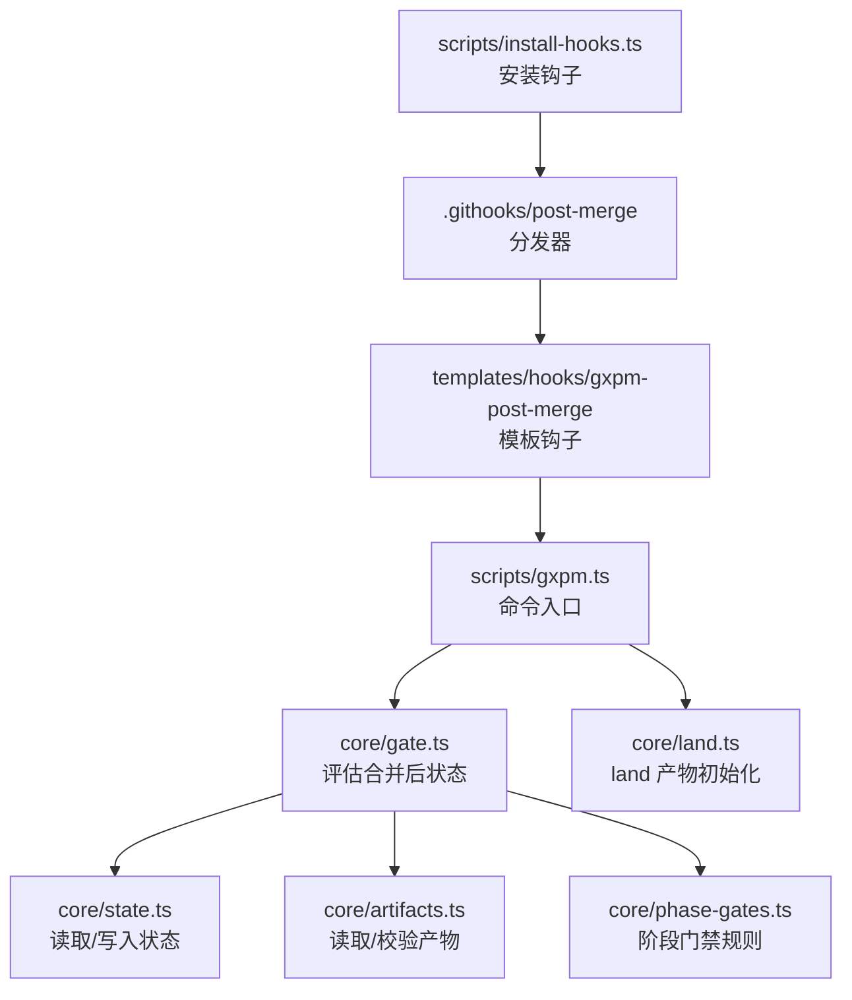
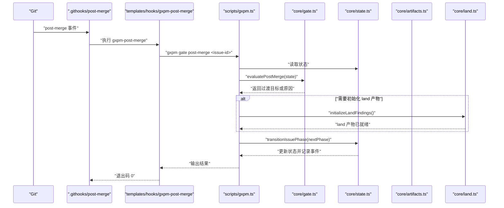
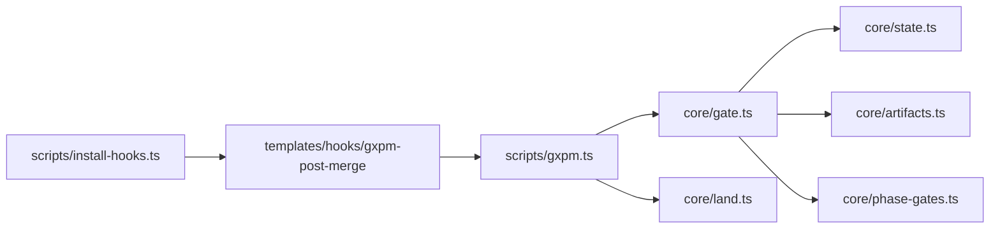
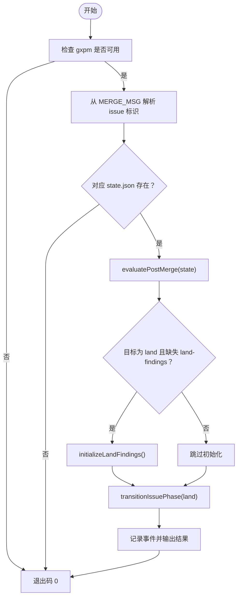

# 合并后检查

<cite>
**本文引用的文件**
- [.githooks/post-merge](file://.githooks/post-merge)
- [templates/hooks/gxpm-post-merge](file://templates/hooks/gxpm-post-merge)
- [scripts/install-hooks.ts](file://scripts/install-hooks.ts)
- [scripts/gxpm.ts](file://scripts/gxpm.ts)
- [core/gate.ts](file://core/gate.ts)
- [core/state.ts](file://core/state.ts)
- [core/artifacts.ts](file://core/artifacts.ts)
- [core/phase-gates.ts](file://core/phase-gates.ts)
- [core/land.ts](file://core/land.ts)
- [test/gate-cli.test.ts](file://test/gate-cli.test.ts)
</cite>

## 目录
1. [简介](#简介)
2. [项目结构](#项目结构)
3. [核心组件](#核心组件)
4. [架构总览](#架构总览)
5. [详细组件分析](#详细组件分析)
6. [依赖关系分析](#依赖关系分析)
7. [性能考量](#性能考量)
8. [故障排查指南](#故障排查指南)
9. [结论](#结论)
10. [附录](#附录)

## 简介
本文件围绕“合并后检查”主题，系统性阐述 Git post-merge 事件中 gxpm 后置钩子的作用与后续处理流程。重点包括：
- gxpm-post-merge 钩子如何在分支合并后进行状态同步、产物更新与清理工作；
- 合并冲突处理、状态恢复与数据一致性保障机制；
- 常见问题与修复方法；
- 自动化清理与通知的配置建议。

## 项目结构
与合并后检查直接相关的文件主要分布在以下位置：
- Git 钩子分发器与模板钩子：.githooks/post-merge、templates/hooks/gxpm-post-merge
- 安装脚本：scripts/install-hooks.ts（负责安装与启用 .githooks）
- 合并后执行入口：scripts/gxpm.ts（命令入口，包含 gate post-merge 子命令）
- 核心状态与规则：core/state.ts、core/artifacts.ts、core/phase-gates.ts、core/gate.ts
- 相关初始化工具：core/land.ts（用于 land 阶段产物初始化）

图表来源
- [.githooks/post-merge](file://.githooks/post-merge)
- [templates/hooks/gxpm-post-merge](file://templates/hooks/gxpm-post-merge)
- [scripts/install-hooks.ts](file://scripts/install-hooks.ts)
- [scripts/gxpm.ts](file://scripts/gxpm.ts)
- [core/gate.ts](file://core/gate.ts)
- [core/state.ts](file://core/state.ts)
- [core/artifacts.ts](file://core/artifacts.ts)
- [core/phase-gates.ts](file://core/phase-gates.ts)
- [core/land.ts](file://core/land.ts)

章节来源
- [.githooks/post-merge](file://.githooks/post-merge)
- [templates/hooks/gxpm-post-merge](file://templates/hooks/gxpm-post-merge)
- [scripts/install-hooks.ts](file://scripts/install-hooks.ts)

## 核心组件
- 合并后钩子模板：在 post-merge 事件触发后，尝试从合并信息中解析 issue 标识，并调用 gxpm 的 gate post-merge 子命令进行自动状态推进与产物补全。
- 合并后评估器：根据当前阶段决定是否需要自动推进到下一阶段（如 qa→land），并在必要时生成 land 产物。
- 状态与产物：通过 Issue 状态文件与产物索引文件记录阶段流转与产物存在性，确保门禁规则可被正确评估。
- 安装与启用：install-hooks 脚本负责将 gxpm 钩子复制到 .githooks，并设置 core.hooksPath，同时生成顶层分发器以转发参数。

章节来源
- [templates/hooks/gxpm-post-merge](file://templates/hooks/gxpm-post-merge)
- [scripts/gxpm.ts](file://scripts/gxpm.ts)
- [core/gate.ts](file://core/gate.ts)
- [core/state.ts](file://core/state.ts)
- [core/artifacts.ts](file://core/artifacts.ts)
- [core/phase-gates.ts](file://core/phase-gates.ts)
- [scripts/install-hooks.ts](file://scripts/install-hooks.ts)

## 架构总览
下图展示合并后检查的整体流程：Git 触发 post-merge → 分发器调用 gxpm-post-merge → 解析 issue 标识 → 执行 gxpm gate post-merge → 评估阶段门禁 → 必要时初始化 land 产物 → 自动推进阶段并记录事件。

图表来源
- [.githooks/post-merge](file://.githooks/post-merge)
- [templates/hooks/gxpm-post-merge](file://templates/hooks/gxpm-post-merge)
- [scripts/gxpm.ts](file://scripts/gxpm.ts)
- [core/gate.ts](file://core/gate.ts)
- [core/state.ts](file://core/state.ts)
- [core/artifacts.ts](file://core/artifacts.ts)
- [core/land.ts](file://core/land.ts)

## 详细组件分析

### 组件一：合并后钩子模板（templates/hooks/gxpm-post-merge）
- 功能要点
  - 在 post-merge 事件后运行，优先判断 gxpm 可执行文件是否存在；
  - 尝试从 .git/MERGE_MSG 中提取 issue 标识（如 GXPM-123）；
  - 若对应 issue 的状态文件存在，则调用 gxpm gate post-merge 进行自动推进；
  - 使用 || true 保证即使内部失败也不中断整体合并流程。
- 关键行为
  - 仅在接收合并的分支上生效（通常为 develop）；
  - 通过 issue 标识定位 .gxpm/issues/<issue>/state.json；
  - 严格按顺序执行：解析标识 → 校验状态文件 → 调用 CLI → 退出码 0。

章节来源
- [templates/hooks/gxpm-post-merge](file://templates/hooks/gxpm-post-merge)

### 组件二：合并后评估器（core/gate.ts）
- 功能要点
  - evaluatePostMerge：根据当前阶段返回是否需要自动推进及原因；
  - 当前阶段为 qa 时，返回 land 作为过渡目标；
  - 已经处于 land 或非合并触发阶段时，返回不推进。
- 与门禁规则的关系
  - 该评估器不直接读取产物，而是基于阶段规则进行决策；
  - 实际门禁检查由其他评估器（如 pre-push）在 push 时执行，post-merge 侧重“合并后自动推进”。

章节来源
- [core/gate.ts](file://core/gate.ts)

### 组件三：状态与产物（core/state.ts、core/artifacts.ts）
- 状态文件
  - 每个 issue 对应 state.json、graph.json、events.jsonl 等文件；
  - transitionIssuePhase 会更新当前阶段、写入图谱与事件日志。
- 产物文件
  - 产物类型由 ARTIFACT_TYPES 定义；
  - writeArtifact 会更新产物索引，appendIssueEvent 记录事件；
  - hasArtifact 用于判断特定产物是否存在。
- 一致性保障
  - 事件日志 appendIssueEvent 提供不可变审计轨迹；
  - 写入采用原子式 JSON 文件，避免部分写入导致的数据不一致。

章节来源
- [core/state.ts](file://core/state.ts)
- [core/artifacts.ts](file://core/artifacts.ts)

### 组件四：阶段门禁规则（core/phase-gates.ts）
- 功能要点
  - 定义各阶段之间的必需产物类型；
  - 提供 getRequiredArtifactForTransition 与 getGateCommand；
  - 为 transition 前的门禁检查提供依据。
- 与合并后流程的关系
  - 合并后推进 land 时，若缺少 land-findings，将由 land 初始化器自动补齐；
  - 该规则用于 transition 前的门禁，而非 post-merge 的推进逻辑。

章节来源
- [core/phase-gates.ts](file://core/phase-gates.ts)

### 组件五：CLI 入口与自动推进（scripts/gxpm.ts）
- 功能要点
  - 解析命令 gxpm gate post-merge <issue-id>；
  - 读取状态、调用 evaluatePostMerge；
  - 若目标为 land 且缺失 land-findings，则先初始化 land 产物；
  - 执行 transitionIssuePhase 并输出结果。
- 错误与边界
  - 未跟踪的 issue 输出提示并返回；
  - 无过渡目标时输出原因并返回。

章节来源
- [scripts/gxpm.ts](file://scripts/gxpm.ts)

### 组件六：安装与启用（scripts/install-hooks.ts）
- 功能要点
  - 复制 gxpm-post-merge 到 .githooks；
  - 若顶层 post-merge 不存在则生成分发器脚本；
  - 设置 core.hooksPath=.githooks，确保使用自定义钩子目录。
- 注意事项
  - 若已有顶层钩子，不会覆盖，需手动追加调用 gxpm-post-merge。

章节来源
- [scripts/install-hooks.ts](file://scripts/install-hooks.ts)

### 组件七：land 产物初始化（core/land.ts）
- 功能要点
  - 以 createPhaseArtifactInitializer 创建 land-findings 产物；
  - 仅在 qa 阶段完成后 land 时使用；
  - 写入后可满足 land 阶段门禁要求。

章节来源
- [core/land.ts](file://core/land.ts)

## 依赖关系分析
- 合并后钩子模板依赖 gxpm CLI 可用性与 issue 状态文件存在；
- CLI 入口依赖状态模块与评估器模块；
- 评估器依赖阶段门禁规则与产物存在性判断；
- 安装脚本负责将钩子部署到 .githooks 并设置 hooksPath。

图表来源
- [templates/hooks/gxpm-post-merge](file://templates/hooks/gxpm-post-merge)
- [scripts/gxpm.ts](file://scripts/gxpm.ts)
- [core/gate.ts](file://core/gate.ts)
- [core/state.ts](file://core/state.ts)
- [core/artifacts.ts](file://core/artifacts.ts)
- [core/phase-gates.ts](file://core/phase-gates.ts)
- [core/land.ts](file://core/land.ts)
- [scripts/install-hooks.ts](file://scripts/install-hooks.ts)

章节来源
- [scripts/gxpm.ts](file://scripts/gxpm.ts)
- [core/gate.ts](file://core/gate.ts)
- [core/state.ts](file://core/state.ts)
- [core/artifacts.ts](file://core/artifacts.ts)
- [core/phase-gates.ts](file://core/phase-gates.ts)
- [core/land.ts](file://core/land.ts)
- [scripts/install-hooks.ts](file://scripts/install-hooks.ts)

## 性能考量
- 合并后钩子为轻量级脚本，仅做条件判断与一次 CLI 调用，开销极低；
- 评估器与状态读写均为本地文件操作，复杂度与 IO 成正比；
- 建议在大型仓库中避免在 post-merge 中执行耗时任务，保持幂等与快速返回。

## 故障排查指南
- 症状：合并后未发生阶段推进
  - 排查步骤
    - 确认 .githooks/post-merge 是否存在且可执行；
    - 确认 gxpm-post-merge 是否存在且可执行；
    - 确认 .git/MERGE_MSG 中是否包含有效的 issue 标识；
    - 确认 .gxpm/issues/<issue>/state.json 是否存在；
    - 查看 gxpm gate post-merge 输出，确认是否返回“非合并触发阶段”或“已 landing”等提示。
  - 参考路径
    - [templates/hooks/gxpm-post-merge](file://templates/hooks/gxpm-post-merge)
    - [scripts/gxpm.ts](file://scripts/gxpm.ts)
    - [core/gate.ts](file://core/gate.ts)

- 症状：land 阶段仍被阻塞
  - 排查步骤
    - 检查是否已生成 land-findings 产物；
    - 如缺失，可在 qa 合并后由 post-merge 自动初始化 land 产物；
    - 确保阶段门禁规则中 land 需要的产物类型正确。
  - 参考路径
    - [core/land.ts](file://core/land.ts)
    - [core/phase-gates.ts](file://core/phase-gates.ts)

- 症状：合并后状态异常或事件缺失
  - 排查步骤
    - 检查 events.jsonl 是否正常追加；
    - 检查 graph.json 的 transitions 是否更新；
    - 确认 state.json 的 currentPhase 与 updatedAt 是否更新。
  - 参考路径
    - [core/state.ts](file://core/state.ts)

- 症状：安装后钩子未生效
  - 排查步骤
    - 确认 core.hooksPath 已设置为 .githooks；
    - 确认顶层 post-merge 是否存在；若存在，需手动追加分发器调用。
  - 参考路径
    - [scripts/install-hooks.ts](file://scripts/install-hooks.ts)

章节来源
- [templates/hooks/gxpm-post-merge](file://templates/hooks/gxpm-post-merge)
- [scripts/gxpm.ts](file://scripts/gxpm.ts)
- [core/gate.ts](file://core/gate.ts)
- [core/state.ts](file://core/state.ts)
- [core/phase-gates.ts](file://core/phase-gates.ts)
- [core/land.ts](file://core/land.ts)
- [scripts/install-hooks.ts](file://scripts/install-hooks.ts)

## 结论
合并后检查通过“post-merge 钩子模板 + CLI 评估 + 自动产物初始化”的组合，在合并完成后自动推进关键阶段（如 qa→land），并以状态文件与事件日志保障数据一致性。其设计强调幂等、轻量与可恢复，适合在多分支协作场景中稳定运行。

## 附录

### 合并后推进流程（算法）

图表来源
- [templates/hooks/gxpm-post-merge](file://templates/hooks/gxpm-post-merge)
- [scripts/gxpm.ts](file://scripts/gxpm.ts)
- [core/gate.ts](file://core/gate.ts)
- [core/land.ts](file://core/land.ts)
- [core/state.ts](file://core/state.ts)

### 测试用例参考（验证行为）
- 合并后自动推进 qa→land
  - 参考路径：[test/gate-cli.test.ts](file://test/gate-cli.test.ts)
- 非合并触发阶段不推进
  - 参考路径：[test/gate-cli.test.ts](file://test/gate-cli.test.ts)