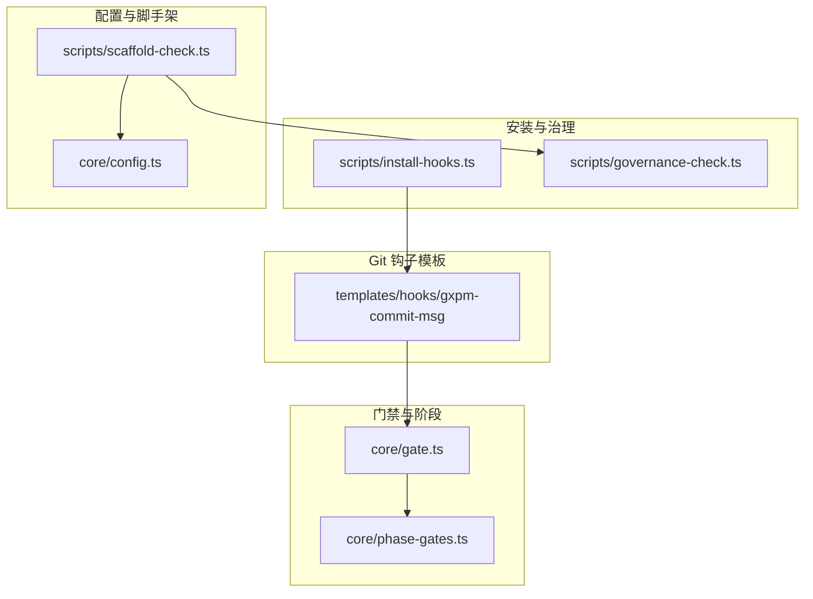
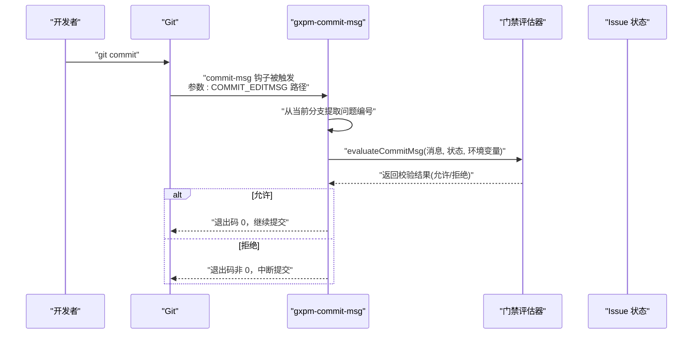
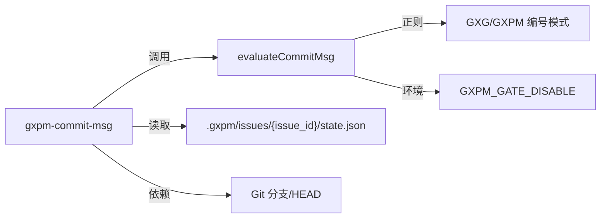

# 提交消息检查

<cite>
**本文引用的文件**
- [templates/hooks/gxpm-commit-msg](file://templates/hooks/gxpm-commit-msg)
- [core/gate.ts](file://core/gate.ts)
- [core/phase-gates.ts](file://core/phase-gates.ts)
- [scripts/install-hooks.ts](file://scripts/install-hooks.ts)
- [scripts/governance-check.ts](file://scripts/governance-check.ts)
- [core/config.ts](file://core/config.ts)
- [scripts/scaffold-check.ts](file://scripts/scaffold-check.ts)
</cite>

## 目录
1. [简介](#简介)
2. [项目结构](#项目结构)
3. [核心组件](#核心组件)
4. [架构总览](#架构总览)
5. [详细组件分析](#详细组件分析)
6. [依赖关系分析](#依赖关系分析)
7. [性能与可靠性考量](#性能与可靠性考量)
8. [故障排查指南](#故障排查指南)
9. [结论](#结论)
10. [附录：模板、命名约定与最佳实践](#附录模板命名约定与最佳实践)

## 简介
本文件面向使用 gxpm 的团队，系统化说明“提交消息检查”在 Git commit-msg 阶段的作用与实现机制。重点包括：
- gxpm-commit-msg 钩子如何在 commit-msg 事件中拦截并校验提交信息；
- 校验规则（必须包含问题编号）与合规性要求；
- 如何通过分支名识别问题编号并与 issue 状态联动；
- 常见失败原因与修复建议；
- 自定义与扩展校验规则的方法。

## 项目结构
与提交消息检查直接相关的文件分布如下：
- 模板钩子：templates/hooks/gxpm-commit-msg
- 门禁评估逻辑：core/gate.ts（含 commit-msg 规则）
- 阶段与受保护路径：core/phase-gates.ts
- 安装脚本：scripts/install-hooks.ts（将钩子安装到 .githooks 并设置 core.hooksPath）
- 治理文档检查：scripts/governance-check.ts（用于理解治理与合规背景）
- 配置解析：core/config.ts（工作树策略等配置解析）
- 脚手架检查：scripts/scaffold-check.ts（整体健康度检查）

图表来源
- [templates/hooks/gxpm-commit-msg:1-17](file://templates/hooks/gxpm-commit-msg#L1-L17)
- [core/gate.ts:82-100](file://core/gate.ts#L82-L100)
- [core/phase-gates.ts:15-23](file://core/phase-gates.ts#L15-L23)
- [scripts/install-hooks.ts:50-103](file://scripts/install-hooks.ts#L50-L103)
- [scripts/governance-check.ts:16-52](file://scripts/governance-check.ts#L16-L52)
- [core/config.ts:153-195](file://core/config.ts#L153-L195)
- [scripts/scaffold-check.ts:15-31](file://scripts/scaffold-check.ts#L15-L31)

章节来源
- [templates/hooks/gxpm-commit-msg:1-17](file://templates/hooks/gxpm-commit-msg#L1-L17)
- [core/gate.ts:82-100](file://core/gate.ts#L82-L100)
- [core/phase-gates.ts:15-23](file://core/phase-gates.ts#L15-L23)
- [scripts/install-hooks.ts:50-103](file://scripts/install-hooks.ts#L50-L103)
- [scripts/governance-check.ts:16-52](file://scripts/governance-check.ts#L16-L52)
- [core/config.ts:153-195](file://core/config.ts#L153-L195)
- [scripts/scaffold-check.ts:15-31](file://scripts/scaffold-check.ts#L15-L31)

## 核心组件
- 提交消息钩子（commit-msg）：从 COMMIT_EDITMSG 读取提交信息，提取分支中的问题编号，调用门禁评估器进行校验。
- 门禁评估器（evaluateCommitMsg）：确保提交信息包含有效的 GXG-NNN 或 GXPM-NNN 问题编号。
- 受保护路径与阶段规则：决定是否允许代码变更，但不直接影响 commit-msg 校验。
- 安装脚本：负责将 gxpm-* 钩子复制到 .githooks，并设置 core.hooksPath，保证 Git 使用统一钩子目录。

章节来源
- [templates/hooks/gxpm-commit-msg:1-17](file://templates/hooks/gxpm-commit-msg#L1-L17)
- [core/gate.ts:82-100](file://core/gate.ts#L82-L100)
- [core/phase-gates.ts:15-23](file://core/phase-gates.ts#L15-L23)
- [scripts/install-hooks.ts:50-103](file://scripts/install-hooks.ts#L50-L103)

## 架构总览
下图展示了 commit-msg 钩子在 Git 生命周期中的位置与调用链：

图表来源
- [templates/hooks/gxpm-commit-msg:1-17](file://templates/hooks/gxpm-commit-msg#L1-L17)
- [core/gate.ts:82-100](file://core/gate.ts#L82-L100)

## 详细组件分析

### 组件一：提交消息钩子（commit-msg）
- 触发时机：Git 在用户输入提交信息后、正式提交前执行。
- 行为要点：
  - 若未安装 gxpm 命令，则跳过校验（返回 0）。
  - 从当前分支名中提取首个匹配的 GXG/GXPM 编号（大小写不敏感），转换为大写。
  - 若对应 .gxpm/issues/{issue_id}/state.json 存在，则调用门禁命令 gxpm gate commit-msg 对提交信息进行校验。
  - 默认通过（返回 0）若未满足上述条件。
- 关键路径参考
  - [templates/hooks/gxpm-commit-msg:1-17](file://templates/hooks/gxpm-commit-msg#L1-L17)

章节来源
- [templates/hooks/gxpm-commit-msg:1-17](file://templates/hooks/gxpm-commit-msg#L1-L17)

### 组件二：门禁评估器（evaluateCommitMsg）
- 输入：提交信息字符串、issue 状态、环境变量。
- 校验规则：
  - 若设置了禁用标志（环境变量），直接放行。
  - 必须包含一个有效的问题编号（GXG-NNN 或 GXPM-NNN，大小写不敏感）。
- 输出：允许/拒绝、原因码与说明。
- 关键路径参考
  - [core/gate.ts:82-100](file://core/gate.ts#L82-L100)

章节来源
- [core/gate.ts:82-100](file://core/gate.ts#L82-L100)

### 组件三：阶段与受保护路径（对 commit-msg 的间接影响）
- 受保护路径与阶段规则主要用于 pre-commit 等场景，对 commit-msg 无直接影响。
- 关键路径参考
  - [core/phase-gates.ts:15-23](file://core/phase-gates.ts#L15-L23)

章节来源
- [core/phase-gates.ts:15-23](file://core/phase-gates.ts#L15-L23)

### 组件四：安装与运行时环境
- 安装脚本会：
  - 将 gxpm-* 钩子复制到 .githooks；
  - 设置 core.hooksPath=.githooks，使 Git 使用统一钩子目录；
  - 为每个顶层钩子生成分发器脚本（如 commit-msg），转发参数给 gxpm-*。
- 关键路径参考
  - [scripts/install-hooks.ts:50-103](file://scripts/install-hooks.ts#L50-L103)

章节来源
- [scripts/install-hooks.ts:50-103](file://scripts/install-hooks.ts#L50-L103)

## 依赖关系分析
- gxpm-commit-msg 依赖：
  - Git 分支名解析与问题编号提取；
  - gxpm 命令可用性；
  - 对应 issue 的状态文件存在性；
  - 门禁评估器 evaluateCommitMsg。
- 门禁评估器依赖：
  - 正则匹配问题编号；
  - 环境变量禁用标志；
  - 与 issue 状态解耦（commit-msg 不依赖具体阶段）。

图表来源
- [templates/hooks/gxpm-commit-msg:1-17](file://templates/hooks/gxpm-commit-msg#L1-L17)
- [core/gate.ts:82-100](file://core/gate.ts#L82-L100)

章节来源
- [templates/hooks/gxpm-commit-msg:1-17](file://templates/hooks/gxpm-commit-msg#L1-L17)
- [core/gate.ts:82-100](file://core/gate.ts#L82-L100)

## 性能与可靠性考量
- 钩子执行轻量：仅读取 COMMIT_EDITMSG、匹配分支名、调用一次门禁评估器，开销极低。
- 失败即中断：校验失败会阻止提交，避免错误信息进入历史。
- 可选禁用：通过环境变量可临时跳过门禁，便于紧急修复或调试。
- 依赖最小化：无需网络、无需外部服务，完全本地执行。

## 故障排查指南
- 症状：提交被拒绝，提示缺少问题编号
  - 原因：提交信息未包含 GXG-NNN 或 GXPM-NNN。
  - 修复：在提交信息中添加有效问题编号；或在分支名中包含该编号以便自动识别。
  - 参考
    - [core/gate.ts:91-97](file://core/gate.ts#L91-L97)
- 症状：未检测到问题编号，提交仍被允许
  - 原因：分支名不含匹配的编号，或对应 issue 的状态文件不存在。
  - 修复：确保分支名包含正确编号；或先初始化 issue 状态文件。
  - 参考
    - [templates/hooks/gxpm-commit-msg:10-14](file://templates/hooks/gxpm-commit-msg#L10-L14)
- 症状：已安装 gxpm，但钩子未生效
  - 原因：core.hooksPath 未指向 .githooks，或顶层钩子覆盖了分发器。
  - 修复：运行安装脚本；或手动在现有顶层钩子中追加调用 gxpm-*。
  - 参考
    - [scripts/install-hooks.ts:83-92](file://scripts/install-hooks.ts#L83-L92)
    - [scripts/install-hooks.ts:100-102](file://scripts/install-hooks.ts#L100-L102)
- 症状：需要临时跳过校验
  - 原因：紧急修复或 CI 场景。
  - 修复：设置禁用标志后执行提交。
  - 参考
    - [core/gate.ts:87-89](file://core/gate.ts#L87-L89)

章节来源
- [core/gate.ts:91-97](file://core/gate.ts#L91-L97)
- [templates/hooks/gxpm-commit-msg:10-14](file://templates/hooks/gxpm-commit-msg#L10-L14)
- [scripts/install-hooks.ts:83-92](file://scripts/install-hooks.ts#L83-L92)
- [scripts/install-hooks.ts:100-102](file://scripts/install-hooks.ts#L100-L102)
- [core/gate.ts:87-89](file://core/gate.ts#L87-L89)

## 结论
gxpm 的提交消息检查通过 commit-msg 钩子与门禁评估器协同工作，在本地提交阶段强制要求提交信息包含有效问题编号，从而提升变更可追溯性与合规性。其设计简洁、可配置、可禁用，适合在团队协作中作为基础质量门禁使用。

## 附录：模板、命名约定与最佳实践

### 提交消息模板与命名约定
- 必填项：提交信息中必须包含问题编号（GXG-NNN 或 GXPM-NNN，大小写不敏感）。
- 推荐格式（示例，不强制）：
  - 标题行：简要描述（不超过 50 字），以问题编号开头或结尾，例如 “GXPM-123: 修复登录流程”
  - 说明行：必要时补充上下文与动机
- 分支命名建议：feature/GXPM-123-fix-login、bugfix/GXG-456-db-error
- 状态文件：当分支名包含问题编号且存在对应 .gxpm/issues/{issue_id}/state.json 时，钩子会调用门禁进行校验。

章节来源
- [core/gate.ts:91-97](file://core/gate.ts#L91-L97)
- [templates/hooks/gxpm-commit-msg:10-14](file://templates/hooks/gxpm-commit-msg#L10-L14)

### 自定义与扩展校验规则
- 当前规则：仅要求提交信息包含问题编号。
- 扩展方式（建议）：
  - 在 gxpm 内部新增门禁类型或扩展 evaluateCommitMsg 的规则（例如长度限制、禁止词过滤、标题风格约束等）。
  - 通过环境变量或配置文件控制开关与阈值。
- 注意事项：
  - 新增规则需保持本地快速反馈，避免阻塞开发效率。
  - 保留禁用通道（环境变量）以应对例外情况。

章节来源
- [core/gate.ts:82-100](file://core/gate.ts#L82-L100)
- [core/config.ts:153-195](file://core/config.ts#L153-L195)

### 安装与运行环境
- 安装钩子：
  - 运行安装脚本，确保 core.hooksPath 指向 .githooks；
  - 顶层钩子（如 commit-msg）由分发器脚本转发到 gxpm-*。
- 参考
  - [scripts/install-hooks.ts:50-103](file://scripts/install-hooks.ts#L50-L103)

章节来源
- [scripts/install-hooks.ts:50-103](file://scripts/install-hooks.ts#L50-L103)

### 治理与脚手架检查（背景参考）
- 治理文档检查：确保关键治理文档齐全，有助于理解项目规范与合规要求。
- 脚手架检查：汇总主机配置、治理文档与技能文档生成的健康度检查。
- 参考
  - [scripts/governance-check.ts:16-52](file://scripts/governance-check.ts#L16-L52)
  - [scripts/scaffold-check.ts:15-31](file://scripts/scaffold-check.ts#L15-L31)

章节来源
- [scripts/governance-check.ts:16-52](file://scripts/governance-check.ts#L16-L52)
- [scripts/scaffold-check.ts:15-31](file://scripts/scaffold-check.ts#L15-L31)