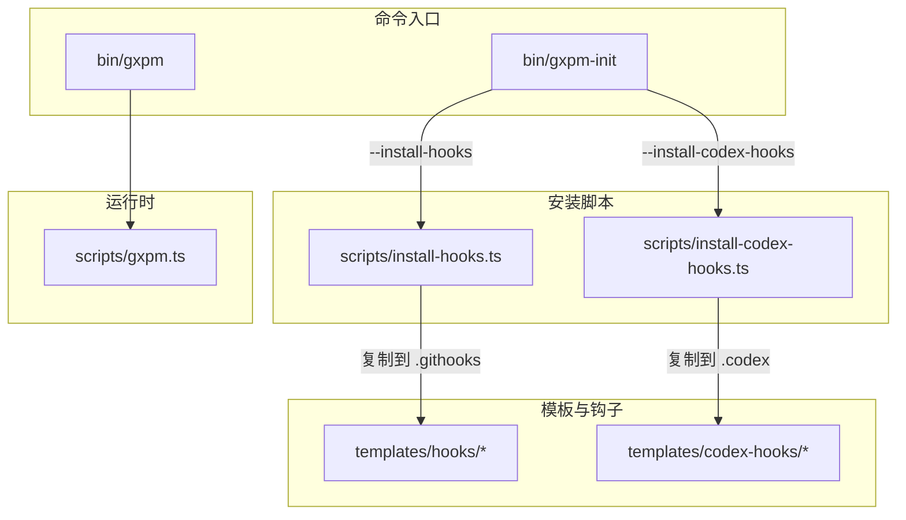
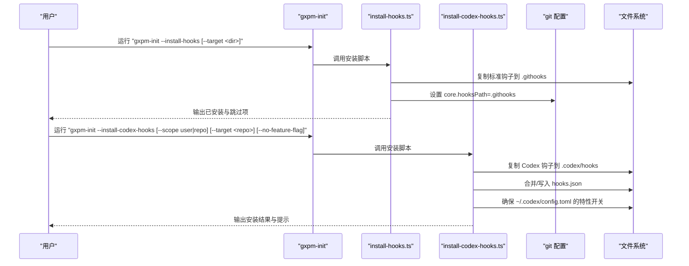
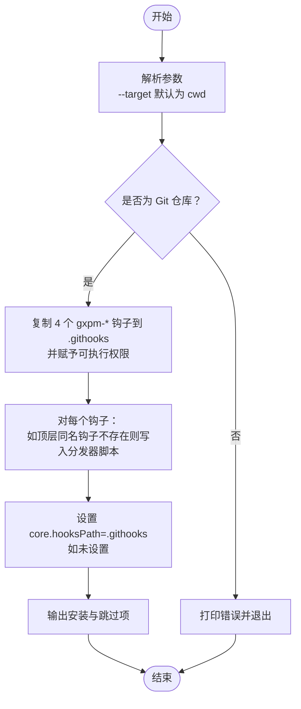
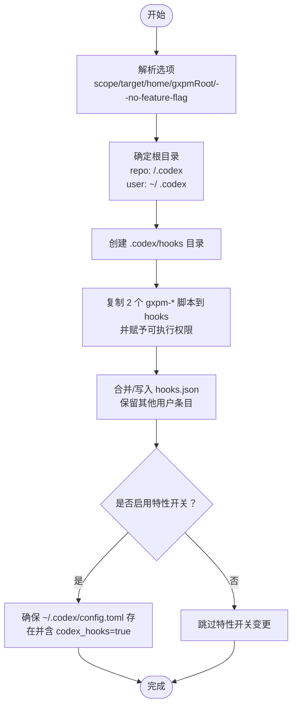
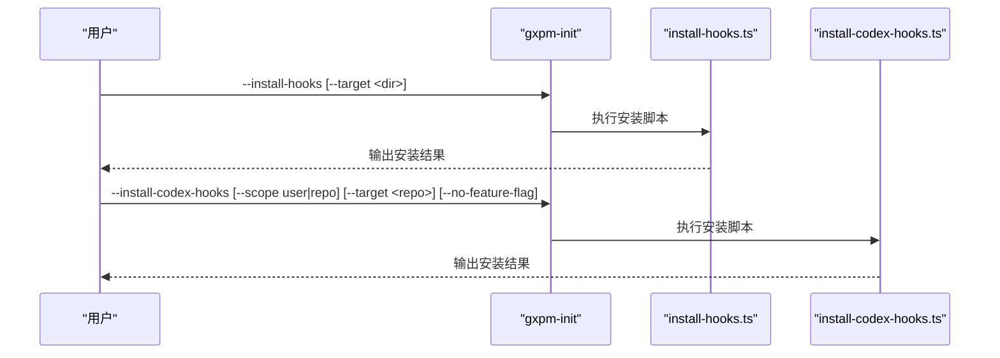
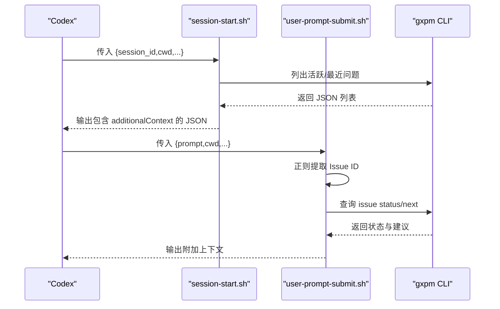
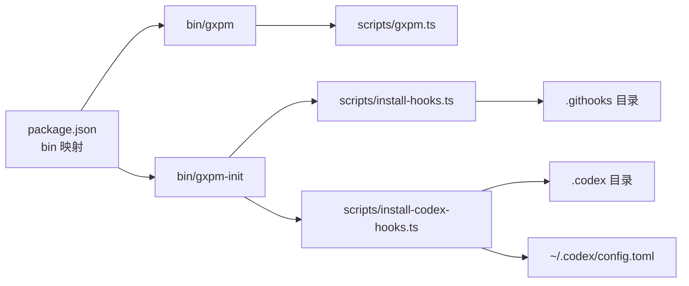

# 钩子安装和配置

<cite>
**本文引用的文件**
- [scripts/install-hooks.ts](file://scripts/install-hooks.ts)
- [scripts/install-codex-hooks.ts](file://scripts/install-codex-hooks.ts)
- [bin/gxpm-init](file://bin/gxpm-init)
- [bin/gxpm](file://bin/gxpm)
- [scripts/gxpm.ts](file://scripts/gxpm.ts)
- [templates/codex-hooks/session-start.sh](file://templates/codex-hooks/session-start.sh)
- [templates/codex-hooks/user-prompt-submit.sh](file://templates/codex-hooks/user-prompt-submit.sh)
- [package.json](file://package.json)
- [test/install-hooks.test.ts](file://test/install-hooks.test.ts)
- [test/install-codex-hooks.test.ts](file://test/install-codex-hooks.test.ts)
</cite>

## 目录
1. [简介](#简介)
2. [项目结构](#项目结构)
3. [核心组件](#核心组件)
4. [架构总览](#架构总览)
5. [详细组件分析](#详细组件分析)
6. [依赖关系分析](#依赖关系分析)
7. [性能考量](#性能考量)
8. [故障排除指南](#故障排除指南)
9. [结论](#结论)
10. [附录](#附录)

## 简介
本文件面向需要在本地或用户级安装和配置 Git 钩子与 Codex 钩子的用户与维护者，系统性说明以下内容：
- 使用 gxpm 安装标准 Git 钩子（pre-commit、commit-msg、pre-push、post-merge）的完整流程与行为。
- 使用 gxpm 安装 Codex 钩子（SessionStart、UserPromptSubmit）的流程、作用域与配置合并策略。
- 安装选项、目标目录选择、权限配置与覆盖保护机制。
- 手动配置方法与验证步骤。
- 常见问题排查与修复建议。

## 项目结构
本仓库围绕“钩子安装”与“钩子运行”两条主线组织：
- 安装入口：通过命令行工具 gxpm-init 提供统一入口，内部路由到具体安装脚本。
- 标准 Git 钩子：安装至仓库 .githooks 目录，并在需要时创建顶层分发器钩子。
- Codex 钩子：按“用户级”或“仓库级”写入 .codex 目录，自动合并 hooks.json 并确保 feature flag 开启。

图表来源
- [bin/gxpm-init](file://bin/gxpm-init)
- [scripts/install-hooks.ts](file://scripts/install-hooks.ts)
- [scripts/install-codex-hooks.ts](file://scripts/install-codex-hooks.ts)
- [templates/codex-hooks/session-start.sh](file://templates/codex-hooks/session-start.sh)
- [templates/codex-hooks/user-prompt-submit.sh](file://templates/codex-hooks/user-prompt-submit.sh)
- [bin/gxpm](file://bin/gxpm)
- [scripts/gxpm.ts](file://scripts/gxpm.ts)

章节来源
- [bin/gxpm-init](file://bin/gxpm-init)
- [bin/gxpm](file://bin/gxpm)
- [package.json](file://package.json)

## 核心组件
- 标准 Git 钩子安装器：负责将一组标准钩子复制到目标仓库的 .githooks 目录，必要时创建顶层分发器钩子，并设置 git config core.hooksPath 指向 .githooks。
- Codex 钩子安装器：负责将两个 Bash 钩子脚本复制到 .codex/hooks，生成/合并 hooks.json，必要时在 ~/.codex/config.toml 中开启 codex_hooks 特性开关。
- 命令行入口：gxpm 与 gxpm-init 提供统一 CLI 入口，前者用于运行 gxpm 功能，后者用于安装流程。

章节来源
- [scripts/install-hooks.ts](file://scripts/install-hooks.ts)
- [scripts/install-codex-hooks.ts](file://scripts/install-codex-hooks.ts)
- [bin/gxpm-init](file://bin/gxpm-init)
- [bin/gxpm](file://bin/gxpm)

## 架构总览
下图展示从命令调用到实际安装与配置的关键路径：

图表来源
- [bin/gxpm-init](file://bin/gxpm-init)
- [scripts/install-hooks.ts](file://scripts/install-hooks.ts)
- [scripts/install-codex-hooks.ts](file://scripts/install-codex-hooks.ts)

## 详细组件分析

### 标准 Git 钩子安装器（install-hooks）
- 支持的钩子清单与参数转发规则：
  - pre-commit → 不转发参数
  - commit-msg → 将第一个参数（提交信息文件路径）转发给 gxpm 对应门禁
  - pre-push → 转发所有参数
  - post-merge → 转发所有参数
- 安装流程要点：
  - 解析 --target 参数，默认为当前工作目录；解析后转为绝对路径。
  - 校验目标是否为 Git 仓库，否则退出并报错。
  - 创建 .githooks 目录，复制四个 gxpm- 前缀钩子文件并赋予可执行权限。
  - 若顶层同名钩子不存在，则写入一个 Bash 分发器脚本，使其在执行时调用对应的 gxpm- 钩子；若已存在则跳过并记录。
  - 设置 git config core.hooksPath 为 .githooks（若未设置为该值），以启用 .githooks 下的钩子。
- 覆盖保护与提示：
  - 若顶层钩子已存在，不会覆盖，仅输出被跳过的列表与手动接入建议（追加一行调用 gxpm 钩子的逻辑）。

图表来源
- [scripts/install-hooks.ts](file://scripts/install-hooks.ts)

章节来源
- [scripts/install-hooks.ts](file://scripts/install-hooks.ts)
- [test/install-hooks.test.ts](file://test/install-hooks.test.ts)

### Codex 钩子安装器（install-codex-hooks）
- 支持两种作用域：
  - repo：安装到 <target>/.codex/（默认），适合仓库内共享。
  - user：安装到 ~/.codex/，影响全局。
- 关键行为：
  - 复制两个 Bash 钩子脚本到 .codex/hooks，并赋予可执行权限。
  - 合并/写入 hooks.json，确保 SessionStart 与 UserPromptSubmit 事件下包含 gxpm 的命令条目；保留其他用户自定义条目。
  - 自动处理 ~/.codex/config.toml 的 codex_hooks 特性开关：若缺失则插入；若已为 true 则不重复修改；可通过 --no-feature-flag 跳过。
- 安装结果返回值包含：
  - 已安装脚本列表、hooks.json 路径、根目录、特性开关状态（已存在/刚启用/跳过/配置缺失）。

图表来源
- [scripts/install-codex-hooks.ts](file://scripts/install-codex-hooks.ts)

章节来源
- [scripts/install-codex-hooks.ts](file://scripts/install-codex-hooks.ts)
- [test/install-codex-hooks.test.ts](file://test/install-codex-hooks.test.ts)

### 命令行入口与路由
- gxpm-init：
  - --install-hooks：调用 install-hooks.ts。
  - --install-codex-hooks：调用 install-codex-hooks.ts。
  - --install：组合安装技能与标准钩子。
- gxpm：
  - 作为 CLI 主入口，内部解析命令并调用对应功能（例如 gate 子命令用于运行门禁评估）。

图表来源
- [bin/gxpm-init](file://bin/gxpm-init)
- [scripts/install-hooks.ts](file://scripts/install-hooks.ts)
- [scripts/install-codex-hooks.ts](file://scripts/install-codex-hooks.ts)

章节来源
- [bin/gxpm-init](file://bin/gxpm-init)
- [bin/gxpm](file://bin/gxpm)
- [scripts/gxpm.ts](file://scripts/gxpm.ts)

### Codex 钩子脚本行为
- session-start.sh：
  - 从 stdin 读取会话上下文，提取 cwd；若 cwd 下存在 .gxpm/issues，则列出活跃或最近落地的问题，生成附加上下文并输出 JSON。
- user-prompt-submit.sh：
  - 从 stdin 读取用户提示，提取首个 GXPM/GXG 引用；若该问题存在状态文件，则输出其状态与下一步建议。

图表来源
- [templates/codex-hooks/session-start.sh](file://templates/codex-hooks/session-start.sh)
- [templates/codex-hooks/user-prompt-submit.sh](file://templates/codex-hooks/user-prompt-submit.sh)
- [scripts/gxpm.ts](file://scripts/gxpm.ts)

章节来源
- [templates/codex-hooks/session-start.sh](file://templates/codex-hooks/session-start.sh)
- [templates/codex-hooks/user-prompt-submit.sh](file://templates/codex-hooks/user-prompt-submit.sh)
- [test/install-codex-hooks.test.ts](file://test/install-codex-hooks.test.ts)

## 依赖关系分析
- 命令映射与二进制：
  - package.json 中声明了 gxpm、gxpm-init 等二进制入口，分别指向 bin/gxpm 与 bin/gxpm-init。
  - bin/gxpm 通过 bun run 调用 scripts/gxpm.ts。
  - bin/gxpm-init 通过 bun run 调用 scripts/install-hooks.ts 或 scripts/install-codex-hooks.ts。
- 文件系统与外部工具：
  - 安装脚本依赖 Node.js 文件系统 API 与 child_process.execSync 执行 chmod 与 git config。
  - Codex 钩子脚本依赖 gxpm 与 python3 可用性。

图表来源
- [package.json](file://package.json)
- [bin/gxpm](file://bin/gxpm)
- [bin/gxpm-init](file://bin/gxpm-init)
- [scripts/install-hooks.ts](file://scripts/install-hooks.ts)
- [scripts/install-codex-hooks.ts](file://scripts/install-codex-hooks.ts)

章节来源
- [package.json](file://package.json)
- [bin/gxpm](file://bin/gxpm)
- [bin/gxpm-init](file://bin/gxpm-init)

## 性能考量
- 安装阶段：
  - 文件复制与权限设置为 O(n)（n 为钩子数量），开销极低。
  - hooks.json 合并采用集合去重与浅拷贝，复杂度与事件数线性相关。
- 运行阶段：
  - Codex 钩子脚本在会话开始与用户提交时触发，内部调用 gxpm CLI 与 Python，建议确保 gxpm 与 Python3 在 PATH 中以避免额外查找开销。
  - hooks.json 合并为幂等操作，多次运行不会重复添加。

## 故障排除指南
- “不是 Git 仓库”
  - 现象：安装失败并提示 Not a git repository。
  - 排查：确认 --target 指向的目录已初始化为 Git 仓库；或在正确的仓库根目录执行。
  - 参考
    - [scripts/install-hooks.ts](file://scripts/install-hooks.ts)
    - [test/install-hooks.test.ts](file://test/install-hooks.test.ts)
- “顶层钩子未被覆盖”
  - 现象：安装日志显示某些顶层钩子被跳过。
  - 原因：安装器不会覆盖已存在的顶层钩子，以保护用户自定义逻辑。
  - 处理：按提示在相应顶层钩子中追加调用 gxpm 钩子的逻辑。
  - 参考
    - [scripts/install-hooks.ts](file://scripts/install-hooks.ts)
    - [test/install-hooks.test.ts](file://test/install-hooks.test.ts)
- “core.hooksPath 未设置为 .githooks”
  - 现象：安装后未生效。
  - 处理：确认安装器已设置 core.hooksPath=.githooks；若被其他配置覆盖，需调整为 .githooks。
  - 参考
    - [scripts/install-hooks.ts](file://scripts/install-hooks.ts)
    - [test/install-hooks.test.ts](file://test/install-hooks.test.ts)
- “Codex 钩子未触发”
  - 现象：SessionStart/UserPromptSubmit 无输出或无效果。
  - 排查：
    - 确认 .codex/hooks 下已安装 gxpm-* 脚本且具备可执行权限。
    - 确认 ~/.codex/config.toml 中 features.codex_hooks = true 已存在；若缺失，安装器会自动添加并备份原配置。
    - 确认 gxpm 与 python3 在 PATH 中。
  - 参考
    - [scripts/install-codex-hooks.ts](file://scripts/install-codex-hooks.ts)
    - [test/install-codex-hooks.test.ts](file://test/install-codex-hooks.test.ts)
- “hooks.json 条目重复”
  - 现象：多次安装导致条目重复。
  - 处理：安装器已实现幂等合并，不会重复添加相同命令；若出现异常，请检查 hooks.json 结构与命令路径。
  - 参考
    - [scripts/install-codex-hooks.ts](file://scripts/install-codex-hooks.ts)
    - [test/install-codex-hooks.test.ts](file://test/install-codex-hooks.test.ts)

章节来源
- [scripts/install-hooks.ts](file://scripts/install-hooks.ts)
- [scripts/install-codex-hooks.ts](file://scripts/install-codex-hooks.ts)
- [test/install-hooks.test.ts](file://test/install-hooks.test.ts)
- [test/install-codex-hooks.test.ts](file://test/install-codex-hooks.test.ts)

## 结论
- 标准 Git 钩子安装器提供安全、可覆盖保护的安装流程，支持自定义顶层钩子并提示手动接入方式。
- Codex 钩子安装器提供用户级与仓库级两种作用域，自动合并 hooks.json 并确保特性开关可用，便于在 Codex 会话中注入上下文。
- 建议在安装后进行验证：检查 .githooks 与 .codex/hooks 是否存在、core.hooksPath 是否正确、hooks.json 条目是否幂等。

## 附录

### 安装选项与目标目录
- 标准 Git 钩子安装
  - 选项：--target <目录>（默认当前目录）
  - 目标：仓库根目录下的 .githooks
  - 行为：复制 gxpm-pre-commit、gxpm-commit-msg、gxpm-pre-push、gxpm-post-merge；如顶层同名钩子不存在则写入分发器脚本；设置 core.hooksPath
- Codex 钩子安装
  - 选项：
    - --scope user|repo（默认 repo）
    - --target <仓库路径>（当 scope 为 repo 时有效）
    - --home <用户主目录>（测试用途）
    - --no-feature-flag（跳过特性开关变更）
  - 目标：
    - repo：仓库根目录下的 .codex
    - user：用户主目录下的 .codex
  - 行为：复制脚本、合并 hooks.json、确保 features.codex_hooks=true

章节来源
- [scripts/install-hooks.ts](file://scripts/install-hooks.ts)
- [scripts/install-codex-hooks.ts](file://scripts/install-codex-hooks.ts)

### 验证步骤
- 标准 Git 钩子
  - 确认 .githooks 下存在 gxpm-* 钩子与顶层分发器（如不存在同名顶层钩子）。
  - 确认 git config core.hooksPath=.githooks。
  - 参考测试断言
    - [test/install-hooks.test.ts](file://test/install-hooks.test.ts)
- Codex 钩子
  - 确认 .codex/hooks 下存在 gxpm-session-start.sh 与 gxpm-user-prompt-submit.sh。
  - 确认 hooks.json 包含 SessionStart 与 UserPromptSubmit 条目，且幂等。
  - 确认 ~/.codex/config.toml 存在 features.codex_hooks=true。
  - 参考测试断言
    - [test/install-codex-hooks.test.ts](file://test/install-codex-hooks.test.ts)