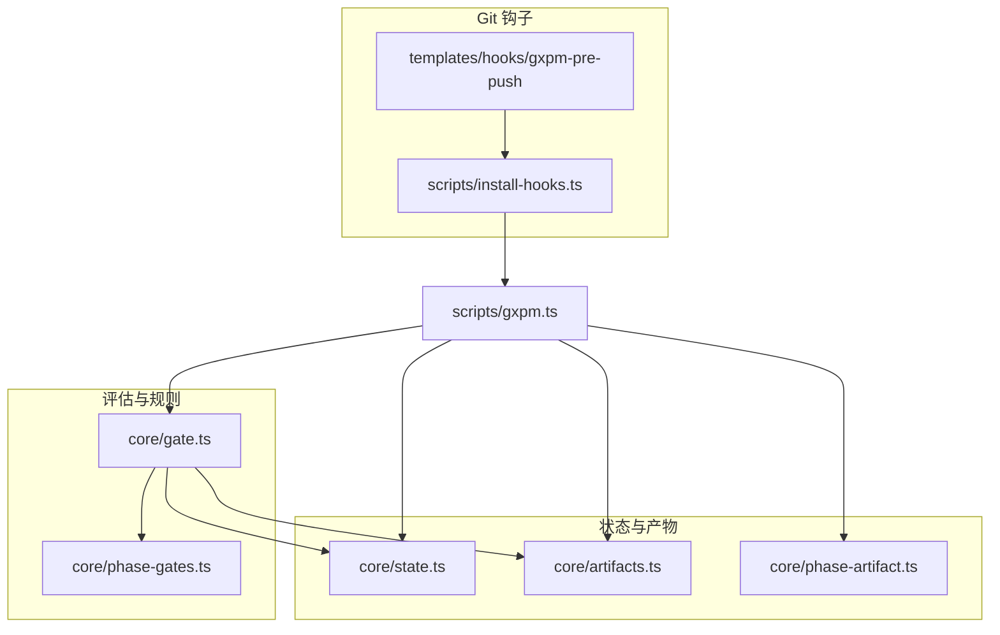
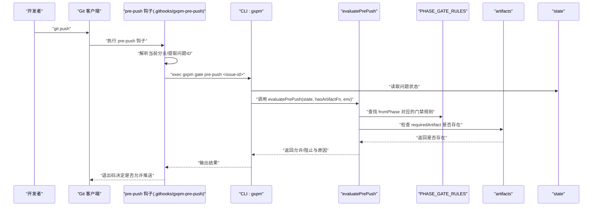
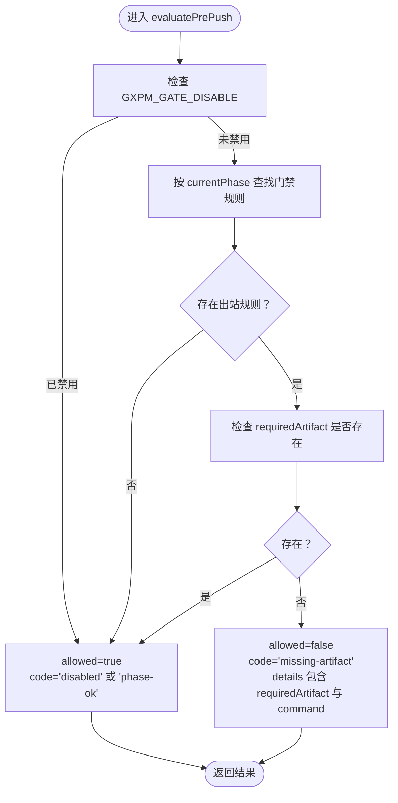
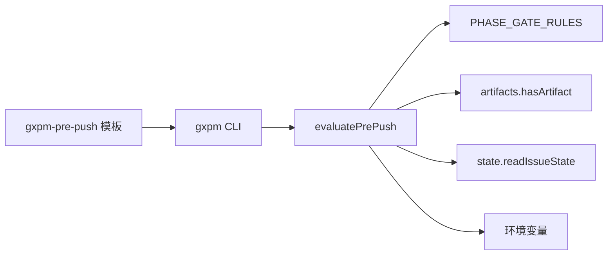

# 预推送检查

<cite>
**本文引用的文件**
- [gate.ts](file://core/gate.ts)
- [phase-gates.ts](file://core/phase-gates.ts)
- [artifacts.ts](file://core/artifacts.ts)
- [state.ts](file://core/state.ts)
- [phase-artifact.ts](file://core/phase-artifact.ts)
- [gxpm-pre-push（模板）](file://templates/hooks/gxpm-pre-push)
- [install-hooks.ts](file://scripts/install-hooks.ts)
- [gxpm.ts](file://scripts/gxpm.ts)
- [gate-cli.test.ts](file://test/gate-cli.test.ts)
</cite>

## 目录
1. [简介](#简介)
2. [项目结构](#项目结构)
3. [核心组件](#核心组件)
4. [架构总览](#架构总览)
5. [详细组件分析](#详细组件分析)
6. [依赖关系分析](#依赖关系分析)
7. [性能考量](#性能考量)
8. [故障排查指南](#故障排查指南)
9. [结论](#结论)
10. [附录](#附录)

## 简介
本文件面向使用 gxpm 的团队与个人，系统化阐述“预推送检查钩子”的工作机制与最佳实践。重点包括：
- 预推送钩子在 Git push 前的执行流程与触发条件
- gxpm-pre-push 如何基于问题状态与产物完成门禁校验
- 推送前的准备清单、网络与环境要求、超时处理建议
- 常见失败原因与解决方案
- 批量推送场景下的优化策略

## 项目结构
围绕“预推送检查”，本仓库的关键位置如下：
- Git 钩子模板：templates/hooks/gxpm-pre-push
- 钩子安装脚本：scripts/install-hooks.ts
- 预推送评估逻辑：core/gate.ts 中的 evaluatePrePush
- 阶段与门禁规则：core/phase-gates.ts
- 产物读写：core/artifacts.ts
- 问题状态与事件：core/state.ts
- 阶段产物初始化器：core/phase-artifact.ts
- CLI 入口与门禁命令：scripts/gxpm.ts
- 行为验证测试：test/gate-cli.test.ts

图表来源
- [gxpm-pre-push（模板）](file://templates/hooks/gxpm-pre-push)
- [install-hooks.ts](file://scripts/install-hooks.ts)
- [gate.ts](file://core/gate.ts)
- [phase-gates.ts](file://core/phase-gates.ts)
- [artifacts.ts](file://core/artifacts.ts)
- [state.ts](file://core/state.ts)
- [phase-artifact.ts](file://core/phase-artifact.ts)
- [gxpm.ts](file://scripts/gxpm.ts)

章节来源
- [gxpm-pre-push（模板）](file://templates/hooks/gxpm-pre-push)
- [install-hooks.ts](file://scripts/install-hooks.ts)
- [gate.ts](file://core/gate.ts)
- [phase-gates.ts](file://core/phase-gates.ts)
- [artifacts.ts](file://core/artifacts.ts)
- [state.ts](file://core/state.ts)
- [phase-artifact.ts](file://core/phase-artifact.ts)
- [gxpm.ts](file://scripts/gxpm.ts)

## 核心组件
- 预推送评估器 evaluatePrePush：根据当前问题状态与下一阶段门禁规则，判断是否具备推送所需的产物。
- 阶段门禁规则 PHASE_GATE_RULES：定义每个阶段到下一阶段需要的产物类型及触发命令。
- 产物系统 artifacts：提供写入、读取、索引与存在性检查能力。
- 状态系统 state：维护问题状态、事件日志与阶段转换。
- 钩子模板与安装：将 gxpm-pre-push 安装到 .githooks，并设置 core.hooksPath。

章节来源
- [gate.ts](file://core/gate.ts)
- [phase-gates.ts](file://core/phase-gates.ts)
- [artifacts.ts](file://core/artifacts.ts)
- [state.ts](file://core/state.ts)
- [gxpm-pre-push（模板）](file://templates/hooks/gxpm-pre-push)
- [install-hooks.ts](file://scripts/install-hooks.ts)

## 架构总览
下图展示一次 Git push 触发的预推送检查全链路：

图表来源
- [gxpm-pre-push（模板）](file://templates/hooks/gxpm-pre-push)
- [gxpm.ts](file://scripts/gxpm.ts)
- [gate.ts](file://core/gate.ts)
- [phase-gates.ts](file://core/phase-gates.ts)
- [artifacts.ts](file://core/artifacts.ts)
- [state.ts](file://core/state.ts)

## 详细组件分析

### 预推送钩子执行机制
- 触发时机：Git push 时自动执行 .githooks/pre-push（由 gxpm-pre-push 模板提供）。
- 自动发现：钩子会尝试从当前分支名中提取问题 ID，并检查该问题是否受 gxpm 管理（存在 .gxpm/issues/{issueId}/state.json）。
- 调用 CLI：若匹配到问题 ID 且状态文件存在，则调用 gxpm gate pre-push <issue-id> 进行评估。
- 退出码：CLI 返回非零表示阻止推送；零表示允许。

章节来源
- [gxpm-pre-push（模板）](file://templates/hooks/gxpm-pre-push)
- [gxpm.ts](file://scripts/gxpm.ts)

### 评估逻辑与门禁规则
- 评估入口：evaluatePrePush(state, hasArtifactFn, env)
- 关键步骤：
  1) 若环境变量禁用门禁（GXPM_GATE_DISABLE=1），直接放行。
  2) 查找当前阶段的门禁规则（PHASE_GATE_RULES）。
  3) 若无出站规则，视为放行。
  4) 使用 hasArtifactFn 检查 requiredArtifact 是否存在。
  5) 若缺失，返回阻止并给出所需命令提示；否则放行。

图表来源
- [gate.ts](file://core/gate.ts)
- [phase-gates.ts](file://core/phase-gates.ts)

章节来源
- [gate.ts](file://core/gate.ts)
- [phase-gates.ts](file://core/phase-gates.ts)

### 产物验证与门禁规则确认
- 产物类型：由 PHASE_GATE_RULES 定义，如 acceptance-contract、implementation-plan、dispatch-handoff、local-verify、acceptance-check、self-review、ship-readiness、pr-check、verify-findings、qa-findings、land-findings 等。
- 存在性检查：hasArtifactFn 通过 artifacts.hasArtifact 判断 artifacts/{type}.json 是否存在。
- 初始化命令：PHASE_GATE_RULES 提供每条规则对应的命令（例如 “gxpm triage init <issue-id>”），用于生成所需产物。

章节来源
- [phase-gates.ts](file://core/phase-gates.ts)
- [artifacts.ts](file://core/artifacts.ts)

### 钩子安装与分发
- 安装脚本 install-hooks.ts 会：
  - 复制 gxpm-pre-push 等四个钩子到 .githooks/
  - 在 .githooks/ 下创建顶层 Git 钩子分发器（若不存在）
  - 设置 git config core.hooksPath=.githooks
- 作用：确保 gxpm-pre-push 可被 Git 正常调用。

章节来源
- [install-hooks.ts](file://scripts/install-hooks.ts)

### CLI 与门禁命令
- CLI gxpm.ts 提供 gate 子命令，其中 gate pre-push 会：
  - 读取问题状态
  - 调用 evaluatePrePush
  - 输出 gate.passed 或 gate.blocked 事件
  - 根据结果打印提示或命令建议

章节来源
- [gxpm.ts](file://scripts/gxpm.ts)

### 测试验证
- 测试 gate-cli.test.ts 验证了：
  - 当缺少 requiredArtifact 时，pre-push 会被阻止
  - 写入对应产物后，pre-push 放行

章节来源
- [gate-cli.test.ts](file://test/gate-cli.test.ts)

## 依赖关系分析
- 预推送评估依赖：
  - 门禁规则：PHASE_GATE_RULES
  - 产物系统：artifacts.hasArtifact
  - 问题状态：state.readIssueState
  - 环境变量：GXPM_GATE_DISABLE
- 钩子到 CLI 的调用链：
  - gxpm-pre-push 模板 → gxpm CLI → evaluatePrePush → artifacts/state

图表来源
- [gxpm-pre-push（模板）](file://templates/hooks/gxpm-pre-push)
- [gxpm.ts](file://scripts/gxpm.ts)
- [gate.ts](file://core/gate.ts)
- [phase-gates.ts](file://core/phase-gates.ts)
- [artifacts.ts](file://core/artifacts.ts)
- [state.ts](file://core/state.ts)

章节来源
- [gate.ts](file://core/gate.ts)
- [phase-gates.ts](file://core/phase-gates.ts)
- [artifacts.ts](file://core/artifacts.ts)
- [state.ts](file://core/state.ts)
- [gxpm.ts](file://scripts/gxpm.ts)
- [gxpm-pre-push（模板）](file://templates/hooks/gxpm-pre-push)

## 性能考量
- 评估复杂度：evaluatePrePush 主要为线性扫描门禁规则与一次文件存在性检查，时间复杂度近似 O(R)，R 为门禁规则数量（常数级）。
- I/O 开销：主要来自读取问题状态与检查 artifacts 文件，建议保持 .gxpm 目录在本地磁盘，避免跨盘符或网络挂载导致延迟。
- 并发与批量：多分支推送时，建议先在本地逐一分支完成门禁检查，减少远端失败重试成本。

## 故障排查指南
- 症状：push 被阻止，提示缺少产物
  - 检查当前阶段是否需要产物：参考 PHASE_GATE_RULES 中 fromPhase 对应的 requiredArtifact
  - 生成产物：运行规则提供的命令（如 “gxpm triage init <issue-id>” 等）
  - 验证产物：使用 “gxpm artifact list <issue-id>” 查看产物列表
  - 重新推送
- 症状：提示未跟踪问题
  - 确认分支名包含问题 ID，且 .gxpm/issues/{issueId}/state.json 存在
  - 使用 “gxpm issue create <issue-id>” 创建状态文件
- 症状：误触发阻止
  - 临时禁用门禁：设置 GXPM_GATE_DISABLE=1 后再执行 git push；仅限临时绕过，建议尽快补齐产物
- 症状：钩子未执行
  - 确认 .githooks/pre-push 存在且可执行
  - 确认 git config core.hooksPath=.githooks 已设置
  - 使用 “gxpm-check” 检查脚手架完整性

章节来源
- [gate.ts](file://core/gate.ts)
- [phase-gates.ts](file://core/phase-gates.ts)
- [artifacts.ts](file://core/artifacts.ts)
- [state.ts](file://core/state.ts)
- [gxpm.ts](file://scripts/gxpm.ts)
- [gxpm-pre-push（模板）](file://templates/hooks/gxpm-pre-push)
- [install-hooks.ts](file://scripts/install-hooks.ts)

## 结论
gxpm 的预推送检查通过“阶段门禁规则 + 产物存在性检查”在 push 前强制执行质量门禁。其设计以规则驱动、产物可追踪为核心，既保证了流程合规，又提供了清晰的失败提示与修复路径。建议团队在日常开发中：
- 在每个阶段及时生成并提交所需产物
- 使用 CLI 辅助检查与初始化
- 将钩子安装与配置纳入团队规范

## 附录

### 推送前准备清单
- 分支命名包含问题 ID，且问题状态文件存在
- 当前阶段到下一阶段所需的产物已生成并提交
- 本地已通过 pre-commit/commit-msg 等前置门禁
- Git 钩子已安装并生效（core.hooksPath=.githooks）

### 网络与超时建议
- 本地生成产物与状态读写为主，通常无需网络访问
- 若涉及外部同步或报告生成，建议在本地完成后再推送，避免远端超时影响

### 批量推送优化策略
- 逐分支本地验证：先在本地执行 gxpm gate pre-push，确保产物齐全
- 合理组织提交：将阶段产物与功能变更分开提交，便于回溯
- 使用 CI 前置检查：在 CI 中复用相同门禁逻辑，降低远端失败概率