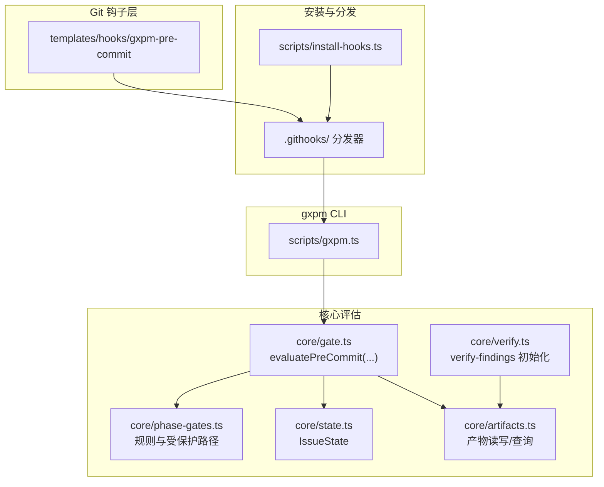
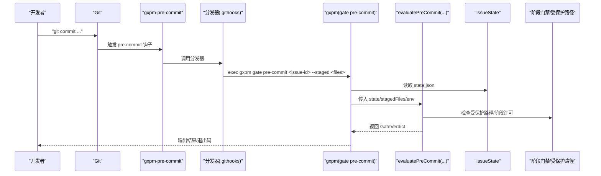
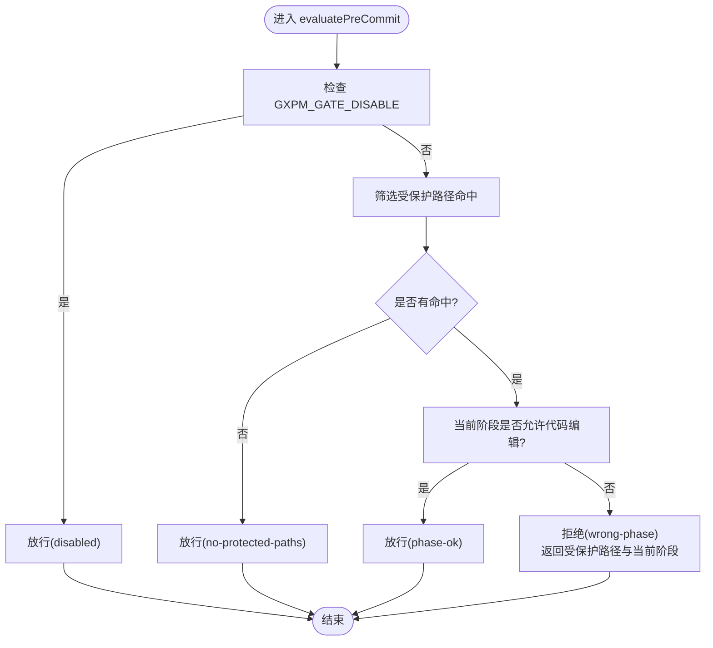
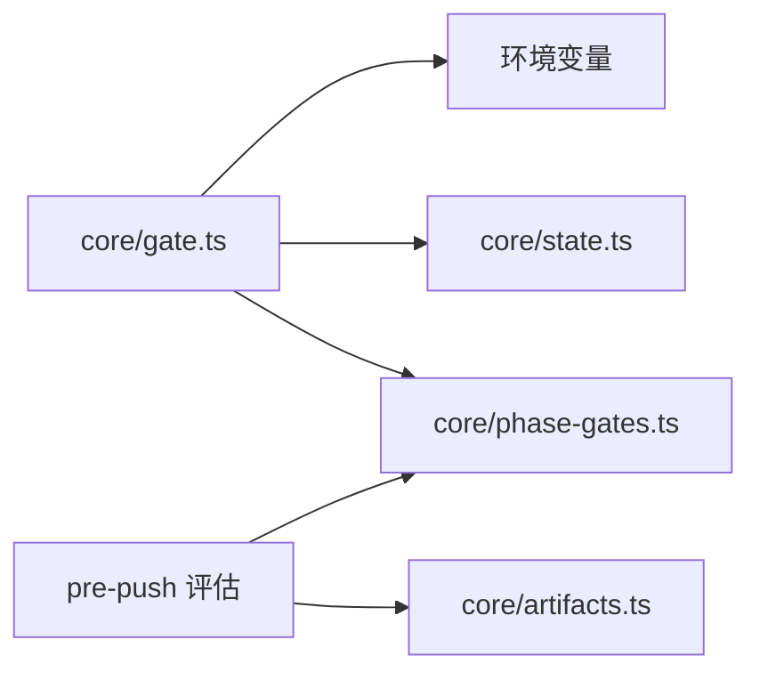

# 预提交检查

<cite>
**本文引用的文件**
- [gate.ts](file://core/gate.ts)
- [phase-gates.ts](file://core/phase-gates.ts)
- [state.ts](file://core/state.ts)
- [artifacts.ts](file://core/artifacts.ts)
- [verify.ts](file://core/verify.ts)
- [install-hooks.ts](file://scripts/install-hooks.ts)
- [gxpm-pre-commit](file://templates/hooks/gxpm-pre-commit)
- [gxpm.ts](file://scripts/gxpm.ts)
- [README.md](file://README.md)
- [package.json](file://package.json)
</cite>

## 目录
1. [简介](#简介)
2. [项目结构](#项目结构)
3. [核心组件](#核心组件)
4. [架构总览](#架构总览)
5. [详细组件分析](#详细组件分析)
6. [依赖关系分析](#依赖关系分析)
7. [性能考虑](#性能考虑)
8. [故障排查指南](#故障排查指南)
9. [结论](#结论)
10. [附录](#附录)

## 简介
本文件面向“预提交检查”（pre-commit）钩子，系统性阐述其在 Git commit 操作前的执行机制与验证逻辑，以及 gxpm-pre-commit 钩子如何与项目管理流程（issue 状态、阶段门禁、产物验证）集成。文档涵盖：
- 执行链路：Git 钩子 → gxpm 分发器 → 核心评估函数
- 验证规则：受保护路径过滤、阶段许可、提交信息引用校验
- 产物与门禁：基于阶段门禁规则的产物存在性检查
- 配置选项：环境变量开关、钩子安装与分发器行为
- 错误处理：失败原因码、提示信息与逃逸方案
- 常见失败场景与解决方案
- 性能优化建议

## 项目结构
与预提交检查直接相关的文件分布如下：
- 钩子模板：templates/hooks/gxpm-pre-commit
- 安装脚本：scripts/install-hooks.ts
- 核心评估：core/gate.ts、core/phase-gates.ts、core/state.ts、core/artifacts.ts
- CLI 入口：scripts/gxpm.ts
- 文档与元信息：README.md、package.json

图表来源
- [gxpm-pre-commit](file://templates/hooks/gxpm-pre-commit)
- [install-hooks.ts](file://scripts/install-hooks.ts)
- [gxpm.ts](file://scripts/gxpm.ts)
- [gate.ts](file://core/gate.ts)
- [phase-gates.ts](file://core/phase-gates.ts)
- [state.ts](file://core/state.ts)
- [artifacts.ts](file://core/artifacts.ts)
- [verify.ts](file://core/verify.ts)

章节来源
- [README.md:1-46](file://README.md#L1-L46)
- [package.json:1-25](file://package.json#L1-L25)

## 核心组件
- 预提交评估器：根据当前 issue 状态、受保护路径与阶段许可，判断是否允许提交。
- 阶段门禁规则：定义各阶段间转换所需的产物类型与命令提示。
- 受保护路径模式：限定哪些目录变更需要遵循阶段门禁。
- 产物存取：读写 artifacts 与索引，支持 hasArtifact 查询。
- 状态模型：IssueState 提供 currentPhase、事件日志等。
- 钩子安装与分发：自动创建 .githooks 目录、安装钩子与分发器。

章节来源
- [gate.ts:48-80](file://core/gate.ts#L48-L80)
- [phase-gates.ts:4-23](file://core/phase-gates.ts#L4-L23)
- [phase-gates.ts:32-99](file://core/phase-gates.ts#L32-L99)
- [artifacts.ts:106-125](file://core/artifacts.ts#L106-L125)
- [state.ts:28-43](file://core/state.ts#L28-L43)
- [install-hooks.ts:50-103](file://scripts/install-hooks.ts#L50-L103)

## 架构总览
下图展示一次预提交检查的端到端调用序列：

图表来源
- [gxpm-pre-commit](file://templates/hooks/gxpm-pre-commit)
- [install-hooks.ts:18-28](file://scripts/install-hooks.ts#L18-L28)
- [gxpm.ts:483-511](file://scripts/gxpm.ts#L483-L511)
- [gate.ts:48-80](file://core/gate.ts#L48-L80)
- [phase-gates.ts:4-23](file://core/phase-gates.ts#L4-L23)

## 详细组件分析

### 预提交评估器 evaluatePreCommit
- 输入：IssueState、已暂存文件列表、环境变量
- 关键逻辑：
  - 若环境变量开关开启，则直接放行
  - 若无任何受保护路径命中，则放行
  - 若当前阶段允许代码编辑，则放行
  - 否则拒绝，并返回受保护路径命中列表与当前阶段信息
- 输出：GateVerdict（allowed/code/reason/details）

图表来源
- [gate.ts:40-80](file://core/gate.ts#L40-L80)
- [phase-gates.ts:4-13](file://core/phase-gates.ts#L4-L13)

章节来源
- [gate.ts:48-80](file://core/gate.ts#L48-L80)
- [phase-gates.ts:4-13](file://core/phase-gates.ts#L4-L13)

### 阶段门禁与受保护路径
- 受保护路径模式：限制 apps/、server/、packages/、scripts/、tests/、supabase/、e2e/ 等目录
- 阶段许可集合：CODE_COMMIT_PHASES 定义允许代码编辑的阶段
- 阶段门禁规则：PHASE_GATE_RULES 定义阶段间转换所需产物类型与命令提示

章节来源
- [phase-gates.ts:15-23](file://core/phase-gates.ts#L15-L23)
- [phase-gates.ts:4-13](file://core/phase-gates.ts#L4-L13)
- [phase-gates.ts:32-99](file://core/phase-gates.ts#L32-L99)

### 产物验证与状态检查
- 产物查询：hasArtifact 用于 pre-push 阶段的门禁检查
- 产物读写：writeArtifact/readArtifact/listArtifacts 支持 artifacts 索引与事件记录
- 验证产物初始化：initializeVerifyFindings 为 verify 阶段准备 verify-findings 产物

章节来源
- [artifacts.ts:120-125](file://core/artifacts.ts#L120-L125)
- [artifacts.ts:57-91](file://core/artifacts.ts#L57-L91)
- [artifacts.ts:93-104](file://core/artifacts.ts#L93-L104)
- [verify.ts:3-15](file://core/verify.ts#L3-L15)

### 钩子安装与分发器
- 安装脚本会复制 gxpm-pre-commit、gxpm-commit-msg、gxpm-pre-push、gxpm-post-merge 到 .githooks
- 若顶层钩子不存在，安装脚本会写入 Bash 分发器；若已存在则跳过并提示手工接入
- 将 git config core.hooksPath 设为 .githooks，确保使用项目内钩子

章节来源
- [install-hooks.ts:11-16](file://scripts/install-hooks.ts#L11-L16)
- [install-hooks.ts:64-79](file://scripts/install-hooks.ts#L64-L79)
- [install-hooks.ts:81-92](file://scripts/install-hooks.ts#L81-L92)

### 预提交钩子模板
- 自动解析当前分支中的 issue id（GXG/GXPM-NNN）
- 若未找到或无状态文件，则跳过
- 调用 gxpm gate pre-commit 并传递已暂存文件列表

章节来源
- [gxpm-pre-commit:13-30](file://templates/hooks/gxpm-pre-commit#L13-L30)

### CLI 与门禁执行
- runPreCommitGate 读取 state.json，调用 evaluatePreCommit，记录门禁事件，按结果输出并设置退出码

章节来源
- [gxpm.ts:483-511](file://scripts/gxpm.ts#L483-L511)

## 依赖关系分析
- 预提交评估依赖：
  - 阶段门禁规则（受保护路径、阶段许可）
  - IssueState（currentPhase）
  - 环境变量（开关）
- 产物门禁依赖：
  - artifacts 存取接口
  - 阶段门禁规则中的 requiredArtifact

图表来源
- [gate.ts:48-130](file://core/gate.ts#L48-L130)
- [phase-gates.ts:32-99](file://core/phase-gates.ts#L32-L99)
- [artifacts.ts:120-125](file://core/artifacts.ts#L120-L125)

章节来源
- [gate.ts:48-130](file://core/gate.ts#L48-L130)
- [phase-gates.ts:32-99](file://core/phase-gates.ts#L32-L99)
- [artifacts.ts:120-125](file://core/artifacts.ts#L120-L125)

## 性能考虑
- 预提交钩子应尽量保持轻量：仅进行必要检查（受保护路径过滤、阶段许可），避免昂贵操作
- 使用 hasArtifact 进行快速存在性检查，避免不必要的 IO
- 将受保护路径正则匹配与阶段许可判断放在内存中完成，减少文件系统访问
- 若需扩展自定义规则，优先采用缓存策略与最小化扫描范围

## 故障排查指南
- 环境变量开关导致放行
  - 现象：无论规则如何都通过
  - 处理：移除或设为非 1 的值
  - 参考：[gate.ts:40-42](file://core/gate.ts#L40-L42)
- 未检测到受保护路径命中
  - 现象：直接放行
  - 处理：确认变更文件位于受保护路径
  - 参考：[phase-gates.ts:15-23](file://core/phase-gates.ts#L15-L23)
- 当前阶段不允许代码编辑
  - 现象：拒绝提交，返回 wrong-phase
  - 处理：在允许的阶段进行代码修改，或先生成所需产物并通过门禁
  - 参考：[phase-gates.ts:4-13](file://core/phase-gates.ts#L4-L13)
- 提交信息缺少问题引用
  - 现象：commit-msg 钩子拒绝
  - 处理：在提交信息中包含 GXG-NNN 或 GXPM-NNN
  - 参考：[gate.ts:82-100](file://core/gate.ts#L82-L100)
- 预推送阶段缺少产物
  - 现象：拒绝推送，返回 missing-artifact
  - 处理：先运行规则对应的命令生成所需产物
  - 参考：[phase-gates.ts:32-99](file://core/phase-gates.ts#L32-L99)
- 钩子未生效
  - 现象：未触发或报错
  - 处理：确认 .githooks 已正确安装且 core.hooksPath 指向 .githooks；检查分发器是否存在
  - 参考：[install-hooks.ts:81-92](file://scripts/install-hooks.ts#L81-L92)

章节来源
- [gate.ts:40-100](file://core/gate.ts#L40-L100)
- [phase-gates.ts:4-23](file://core/phase-gates.ts#L4-L23)
- [phase-gates.ts:32-99](file://core/phase-gates.ts#L32-L99)
- [install-hooks.ts:81-92](file://scripts/install-hooks.ts#L81-L92)

## 结论
gxpm-pre-commit 钩子通过“受保护路径 + 阶段许可”的双层校验，在不侵入业务代码的前提下，将项目管理流程的门禁规则嵌入到 Git 工作流中。结合产物门禁与状态驱动的阶段迁移，形成从 issue 状态到产物产出再到推送门禁的闭环。通过合理的配置与扩展，可在保证质量的同时提升团队协作效率。

## 附录

### 配置选项与环境变量
- GXPM_GATE_DISABLE=1：临时关闭门禁检查（逃逸开关）
  - 参考：[gate.ts:40-42](file://core/gate.ts#L40-L42)
- git config core.hooksPath：指向 .githooks，确保使用项目内钩子
  - 参考：[install-hooks.ts:81-92](file://scripts/install-hooks.ts#L81-L92)

### 自定义验证规则建议
- 新增受保护路径：在受保护路径模式数组中添加正则
  - 参考：[phase-gates.ts:15-23](file://core/phase-gates.ts#L15-L23)
- 新增阶段门禁：在 PHASE_GATE_RULES 中追加规则，明确 fromPhase、nextPhase、requiredArtifact 与命令提示
  - 参考：[phase-gates.ts:32-99](file://core/phase-gates.ts#L32-L99)
- 新增产物类型：在 ARTIFACT_TYPES 中声明，并在相应阶段初始化
  - 参考：[artifacts.ts:10-24](file://core/artifacts.ts#L10-L24)
  - 参考：[verify.ts:3-15](file://core/verify.ts#L3-L15)

### 常见验证失败场景与解决方案
- 场景：wrong-phase（当前阶段不允许代码编辑）
  - 解决：在允许的阶段进行代码修改，或先生成所需产物并通过门禁
  - 参考：[phase-gates.ts:4-13](file://core/phase-gates.ts#L4-L13)
- 场景：missing-artifact（预推送阶段缺少产物）
  - 解决：先运行规则命令生成 requiredArtifact
  - 参考：[phase-gates.ts:32-99](file://core/phase-gates.ts#L32-L99)
- 场景：missing-issue-ref（提交信息未包含问题引用）
  - 解决：在提交信息中加入 GXG-NNN 或 GXPM-NNN
  - 参考：[gate.ts:82-100](file://core/gate.ts#L82-L100)