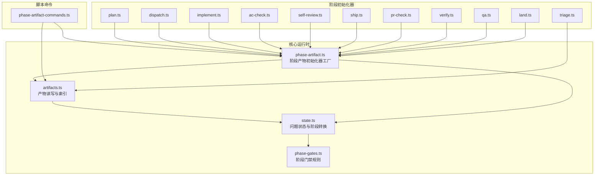
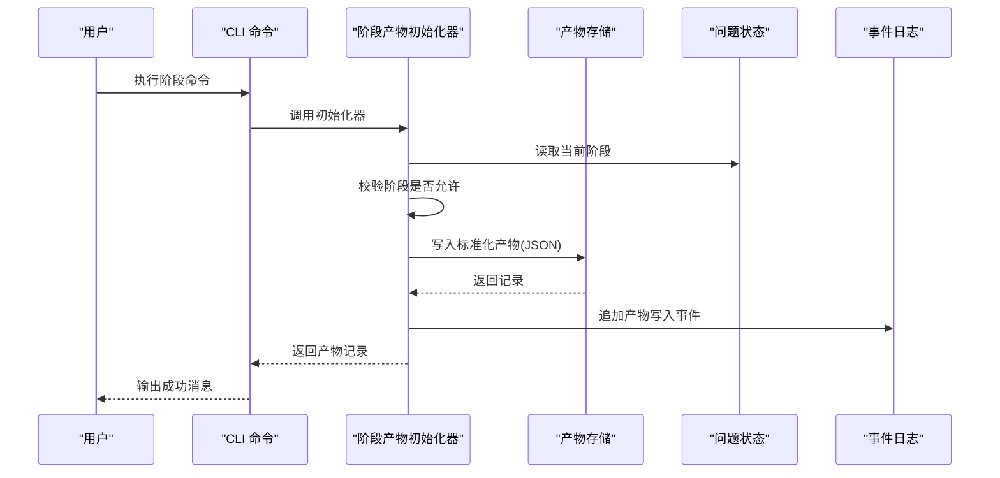
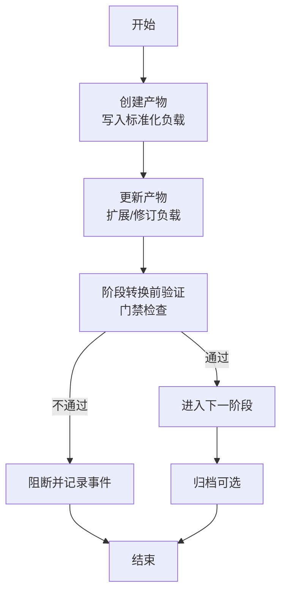
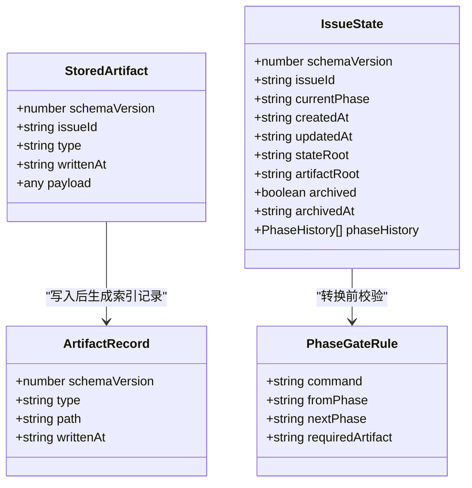
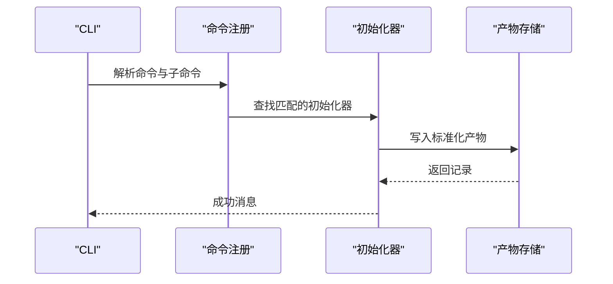
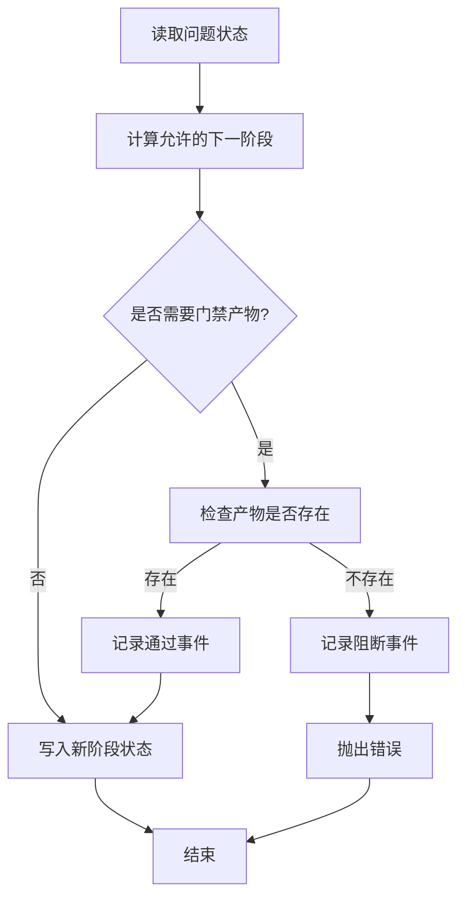

# 产物管理系统

<cite>
**本文引用的文件**
- [artifacts.ts](file://core/artifacts.ts)
- [phase-artifact.ts](file://core/phase-artifact.ts)
- [state.ts](file://core/state.ts)
- [phase-gates.ts](file://core/phase-gates.ts)
- [triage.ts](file://core/triage.ts)
- [plan.ts](file://core/plan.ts)
- [dispatch.ts](file://core/dispatch.ts)
- [implement.ts](file://core/implement.ts)
- [ac-check.ts](file://core/ac-check.ts)
- [self-review.ts](file://core/self-review.ts)
- [ship.ts](file://core/ship.ts)
- [pr-check.ts](file://core/pr-check.ts)
- [verify.ts](file://core/verify.ts)
- [qa.ts](file://core/qa.ts)
- [land.ts](file://core/land.ts)
- [phase-artifact-commands.ts](file://scripts/phase-artifact-commands.ts)
- [package.json](file://package.json)
- [artifacts.test.ts](file://test/artifacts.test.ts)
</cite>

## 目录
1. [简介](#简介)
2. [项目结构](#项目结构)
3. [核心组件](#核心组件)
4. [架构总览](#架构总览)
5. [详细组件分析](#详细组件分析)
6. [依赖关系分析](#依赖关系分析)
7. [性能考量与存储优化](#性能考量与存储优化)
8. [故障排查指南](#故障排查指南)
9. [结论](#结论)
10. [附录](#附录)

## 简介
本文件系统性阐述“产物管理系统”的设计与实现，涵盖产物的定义、类型与存储机制；产物生命周期（创建、更新、验证、归档）；产物格式规范与数据结构；产物编辑工具使用指南与最佳实践；产物在阶段转换中的作用与验证流程；以及性能与存储优化建议。该系统以“问题（Issue）”为单位进行状态与产物管理，通过阶段门禁规则确保跨阶段的强制性产物存在性，保障交付质量与可追溯性。

## 项目结构
系统采用按功能域分层的组织方式：
- 核心运行时：状态机与阶段门禁、产物读写、事件记录
- 阶段初始化器：各阶段的产物模板初始化函数
- 脚本命令：面向 CLI 的阶段产物命令注册与路由
- 测试：覆盖产物读写、索引与事件行为



图表来源
- [artifacts.ts:1-169](file://core/artifacts.ts#L1-L169)
- [state.ts:1-302](file://core/state.ts#L1-L302)
- [phase-gates.ts:1-118](file://core/phase-gates.ts#L1-L118)
- [phase-artifact.ts:1-33](file://core/phase-artifact.ts#L1-L33)
- [triage.ts:1-20](file://core/triage.ts#L1-L20)
- [plan.ts:1-15](file://core/plan.ts#L1-L15)
- [dispatch.ts:1-17](file://core/dispatch.ts#L1-L17)
- [implement.ts:1-16](file://core/implement.ts#L1-L16)
- [ac-check.ts:1-15](file://core/ac-check.ts#L1-L15)
- [self-review.ts:1-15](file://core/self-review.ts#L1-L15)
- [ship.ts:1-17](file://core/ship.ts#L1-L17)
- [pr-check.ts:1-16](file://core/pr-check.ts#L1-L16)
- [verify.ts:1-16](file://core/verify.ts#L1-L16)
- [qa.ts:1-16](file://core/qa.ts#L1-L16)
- [land.ts:1-16](file://core/land.ts#L1-L16)
- [phase-artifact-commands.ts:1-84](file://scripts/phase-artifact-commands.ts#L1-L84)

章节来源
- [package.json:1-25](file://package.json#L1-L25)

## 核心组件
- 产物类型与数据模型
  - 产物类型集合由系统预定义，涵盖从“接受合同”到“上线结果”的全链路产物。
  - 产物记录（ArtifactRecord）用于索引与元信息；存储体（StoredArtifact）包含版本、类型、时间戳与任意负载。
- 产物读写与索引
  - 写入：校验类型、生成时间戳、落盘 JSON、更新索引、追加事件。
  - 读取：按问题与类型定位文件路径，不存在则抛错。
  - 列表：读取索引文件，返回排序后的产物记录列表。
- 阶段状态与门禁
  - 问题状态包含当前阶段、历史轨迹、归档标记等。
  - 阶段转换前检查门禁所需产物是否存在，缺失则阻断并记录事件。
- 阶段产物初始化器
  - 每个阶段提供一个初始化器，限定仅能在目标阶段调用，并写入标准化的初始负载。

章节来源
- [artifacts.ts:10-169](file://core/artifacts.ts#L10-L169)
- [state.ts:28-204](file://core/state.ts#L28-L204)
- [phase-gates.ts:25-118](file://core/phase-gates.ts#L25-L118)
- [phase-artifact.ts:4-33](file://core/phase-artifact.ts#L4-L33)

## 架构总览
系统围绕“问题”构建状态机与产物索引，阶段门禁规则驱动跨阶段流转，CLI 命令将用户意图映射到阶段产物初始化器。



图表来源
- [phase-artifact-commands.ts:15-84](file://scripts/phase-artifact-commands.ts#L15-L84)
- [phase-artifact.ts:16-32](file://core/phase-artifact.ts#L16-L32)
- [artifacts.ts:57-91](file://core/artifacts.ts#L57-L91)
- [state.ts:149-204](file://core/state.ts#L149-L204)

## 详细组件分析

### 产物类型与生命周期
- 类型定义
  - 系统内置产物类型集合，覆盖从“接受合同”到“上线结果”的关键节点。
- 生命周期
  - 创建：阶段初始化器写入标准化初始负载。
  - 更新：后续阶段可基于已有产物扩展或修订。
  - 验证：阶段转换前通过门禁规则校验所需产物存在。
  - 归档：支持对问题状态进行归档标记与时间戳记录。



图表来源
- [phase-gates.ts:107-118](file://core/phase-gates.ts#L107-L118)
- [state.ts:252-301](file://core/state.ts#L252-L301)
- [artifacts.ts:57-91](file://core/artifacts.ts#L57-L91)

章节来源
- [artifacts.ts:10-24](file://core/artifacts.ts#L10-L24)
- [state.ts:28-43](file://core/state.ts#L28-L43)

### 数据模型与格式规范
- 产物记录（ArtifactRecord）
  - 字段：schemaVersion、type、path、writtenAt
  - 用途：索引与元信息
- 存储体（StoredArtifact）
  - 字段：schemaVersion、issueId、type、writtenAt、payload
  - 用途：持久化载体，payload 可为任意结构
- 问题状态（IssueState）
  - 字段：currentPhase、phaseHistory、archived、archivedAt 等
  - 用途：阶段流转与归档控制
- 阶段门禁（PhaseGateRule）
  - 字段：fromPhase、nextPhase、requiredArtifact、command
  - 用途：约束阶段间必须具备的产物



图表来源
- [artifacts.ts:28-41](file://core/artifacts.ts#L28-L41)
- [state.ts:28-43](file://core/state.ts#L28-L43)
- [phase-gates.ts:25-30](file://core/phase-gates.ts#L25-L30)

章节来源
- [artifacts.ts:28-41](file://core/artifacts.ts#L28-L41)
- [state.ts:28-43](file://core/state.ts#L28-L43)
- [phase-gates.ts:25-30](file://core/phase-gates.ts#L25-L30)

### 阶段产物初始化器与命令体系
- 初始化器工厂
  - createPhaseArtifactInitializer 提供统一的阶段产物写入入口，限制调用阶段与标准化 payload。
- 命令注册
  - phase-artifact-commands 将门禁规则映射为 CLI 命令，每个产物类型对应一条命令与初始化器。
- 典型阶段产物
  - triage：接受合同
  - plan：实施计划
  - dispatch：派发交接
  - implement：本地验证
  - ac-check：验收检查
  - self-review：自审
  - ship：上船准备
  - pr-check：PR 检查
  - verify：验证发现
  - qa：质量保证发现
  - land：上线发现



图表来源
- [phase-artifact-commands.ts:22-76](file://scripts/phase-artifact-commands.ts#L22-L76)
- [triage.ts:8-19](file://core/triage.ts#L8-L19)
- [plan.ts:3-14](file://core/plan.ts#L3-L14)
- [dispatch.ts:3-16](file://core/dispatch.ts#L3-L16)
- [implement.ts:3-15](file://core/implement.ts#L3-L15)
- [ac-check.ts:3-14](file://core/ac-check.ts#L3-L14)
- [self-review.ts:3-14](file://core/self-review.ts#L3-L14)
- [ship.ts:3-16](file://core/ship.ts#L3-L16)
- [pr-check.ts:3-15](file://core/pr-check.ts#L3-L15)
- [verify.ts:3-15](file://core/verify.ts#L3-L15)
- [qa.ts:3-15](file://core/qa.ts#L3-L15)
- [land.ts:3-15](file://core/land.ts#L3-L15)

章节来源
- [phase-artifact.ts:16-32](file://core/phase-artifact.ts#L16-L32)
- [phase-artifact-commands.ts:15-84](file://scripts/phase-artifact-commands.ts#L15-L84)

### 阶段转换与验证流程
- 转换流程
  - 读取当前状态，计算允许的下一阶段。
  - 校验门禁：若需前置产物，检查其是否存在；存在则记录“通过”，否则记录“阻断”并抛错。
- 事件记录
  - 产物写入与阶段转换均追加事件，便于审计与回溯。



图表来源
- [state.ts:149-204](file://core/state.ts#L149-L204)
- [state.ts:252-301](file://core/state.ts#L252-L301)
- [phase-gates.ts:107-118](file://core/phase-gates.ts#L107-L118)

章节来源
- [state.ts:149-204](file://core/state.ts#L149-L204)
- [state.ts:252-301](file://core/state.ts#L252-L301)
- [phase-gates.ts:107-118](file://core/phase-gates.ts#L107-L118)

### 产物编辑工具使用指南与最佳实践
- 使用 CLI 初始化阶段产物
  - 通过命令注册表查找对应命令，确保在正确的阶段执行初始化。
- 编辑与更新
  - 产物为 JSON 文件，可在落地后直接编辑；更新后重新写入会覆盖旧索引条目。
- 最佳实践
  - 严格遵循阶段门禁，先完成前置产物再推进阶段。
  - 保持 payload 结构清晰、字段语义明确，便于后续阶段消费。
  - 定期归档不再活跃的问题，减少目录膨胀。

章节来源
- [phase-artifact-commands.ts:78-84](file://scripts/phase-artifact-commands.ts#L78-L84)
- [artifacts.ts:57-91](file://core/artifacts.ts#L57-L91)
- [state.ts:210-224](file://core/state.ts#L210-L224)

## 依赖关系分析
- 组件耦合
  - artifacts.ts 与 state.ts 强耦合：写入产物需读取/更新状态与事件。
  - phase-artifact.ts 依赖 artifacts.ts 与 state.ts，提供阶段安全的写入入口。
  - phase-gates.ts 为阶段转换提供门禁约束，被 state.ts 在转换时调用。
  - phase-artifact-commands.ts 作为 CLI 层，依赖各阶段初始化器与门禁规则。
- 外部依赖
  - 无第三方运行时依赖，纯 Node 标准库文件系统与路径操作。

```mermaid
graph LR
ART["artifacts.ts"] <- --> ST["state.ts"]
PA["phase-artifact.ts"] --> ART
PA --> ST
PG["phase-gates.ts"] --> ST
CMD["phase-artifact-commands.ts"] --> PA
CMD --> PG
```

图表来源
- [artifacts.ts:1-169](file://core/artifacts.ts#L1-L169)
- [state.ts:1-302](file://core/state.ts#L1-L302)
- [phase-artifact.ts:1-33](file://core/phase-artifact.ts#L1-L33)
- [phase-gates.ts:1-118](file://core/phase-gates.ts#L1-L118)
- [phase-artifact-commands.ts:1-84](file://scripts/phase-artifact-commands.ts#L1-L84)

章节来源
- [artifacts.ts:1-169](file://core/artifacts.ts#L1-L169)
- [state.ts:1-302](file://core/state.ts#L1-L302)
- [phase-artifact.ts:1-33](file://core/phase-artifact.ts#L1-L33)
- [phase-gates.ts:1-118](file://core/phase-gates.ts#L1-L118)
- [phase-artifact-commands.ts:1-84](file://scripts/phase-artifact-commands.ts#L1-L84)

## 性能考量与存储优化
- 文件系统开销
  - 产物与索引均为小体积 JSON 文件，I/O 成本低；建议避免频繁重写同一产物导致的索引更新。
- 目录结构
  - 每个问题独立目录，便于清理与归档；建议定期扫描并归档长期未变更的问题。
- 并发与一致性
  - 当前实现为同步文件写入，多进程并发写入需外部协调，避免竞态。
- 建议
  - 对大负载 payload 建议拆分为多个小产物或外部存储引用，降低单文件体积。
  - 使用归档策略减少活动目录规模，提升遍历与备份效率。

[本节为通用性能建议，无需特定文件引用]

## 故障排查指南
- 常见错误与定位
  - 无效产物类型：写入时校验类型，抛错提示。
  - 产物不存在：读取时若文件不存在抛错。
  - 阶段转换被阻断：门禁产物缺失时抛错并记录事件。
  - 重复创建问题状态：已存在则抛错。
- 排查步骤
  - 检查产物文件是否存在与 JSON 是否有效。
  - 核对当前阶段与允许的下一阶段。
  - 查看事件日志确认最近事件类型与时间。
- 单元测试参考
  - 覆盖产物写入、索引更新、事件记录与类型校验。

章节来源
- [artifacts.ts:93-104](file://core/artifacts.ts#L93-L104)
- [artifacts.ts:163-169](file://core/artifacts.ts#L163-L169)
- [state.ts:149-204](file://core/state.ts#L149-L204)
- [state.ts:252-301](file://core/state.ts#L252-L301)
- [artifacts.test.ts:12-64](file://test/artifacts.test.ts#L12-L64)

## 结论
产物管理系统以“问题”为中心，通过标准化的产物类型、严格的阶段门禁与完善的事件记录，实现了端到端的可追溯交付。CLI 命令体系将用户意图与阶段产物初始化器绑定，确保流程可控。遵循本文的数据模型、使用指南与优化建议，可获得稳定、高效且易于维护的产物管理体验。

[本节为总结性内容，无需特定文件引用]

## 附录
- 关键接口与职责速览
  - artifacts.ts：产物读写、索引维护、类型校验
  - state.ts：问题状态、阶段转换、事件追加、归档
  - phase-gates.ts：阶段门禁规则、命令映射
  - phase-artifact.ts：阶段产物初始化器工厂
  - phase-artifact-commands.ts：CLI 命令注册与路由

[本节为概览性内容，无需特定文件引用]