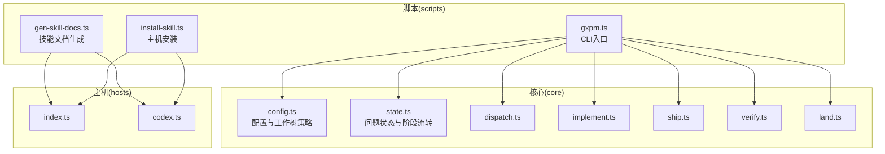
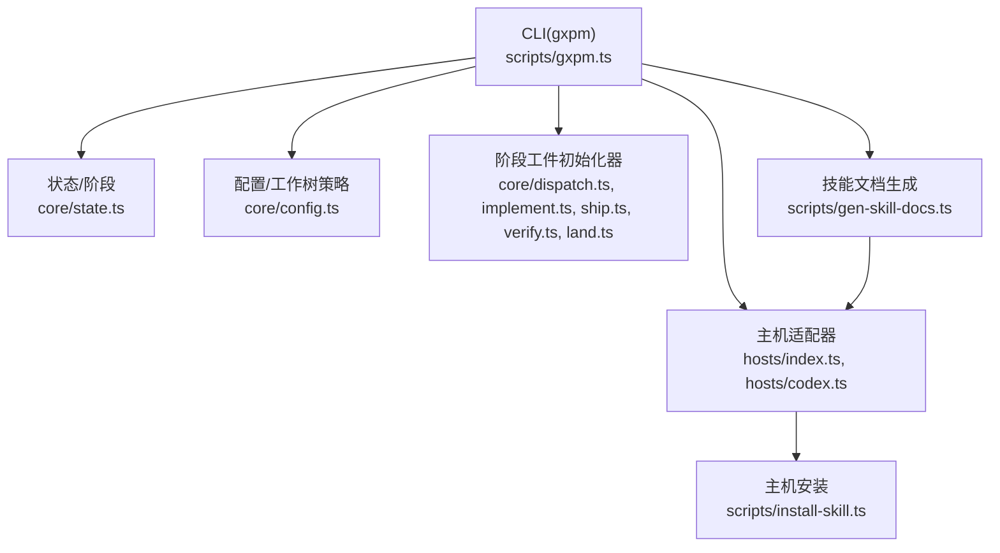
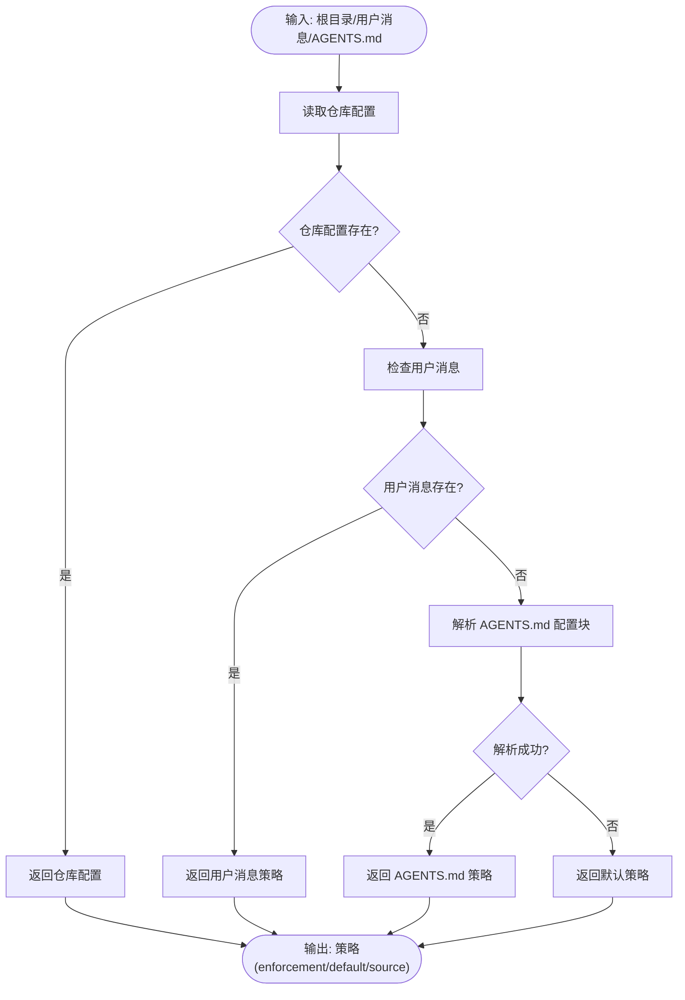
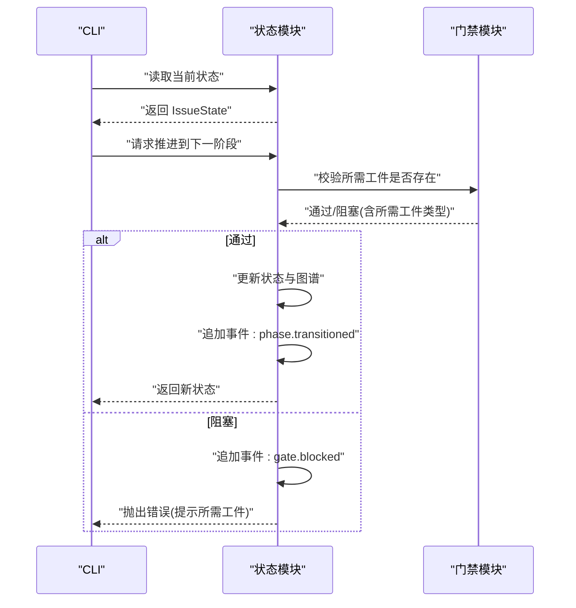
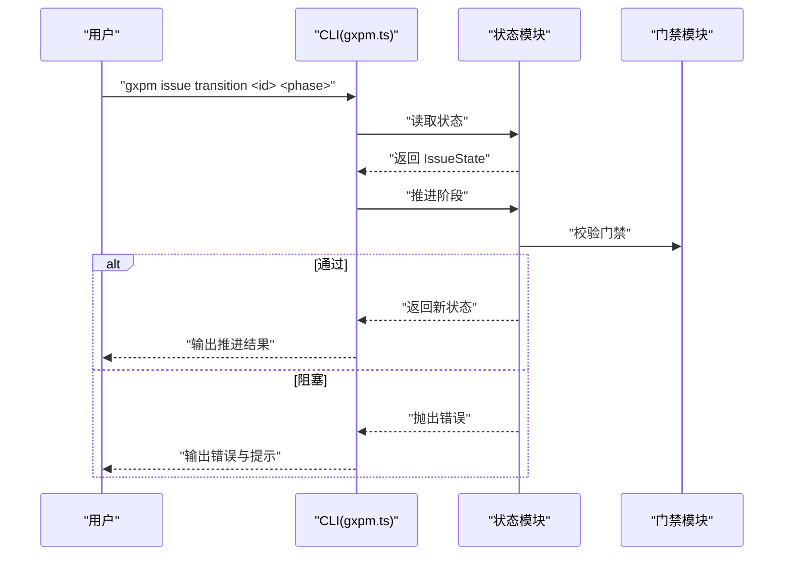
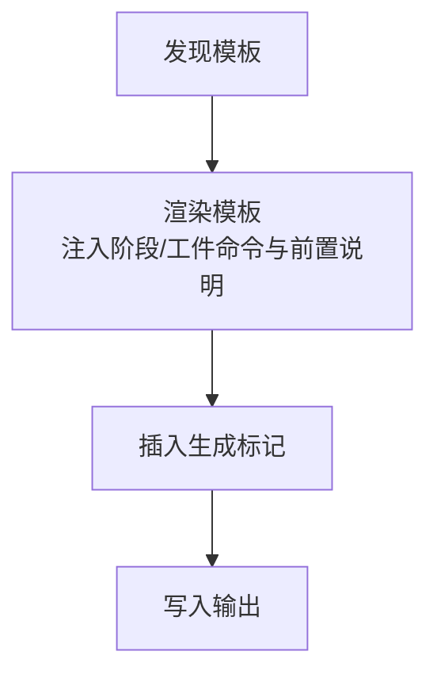
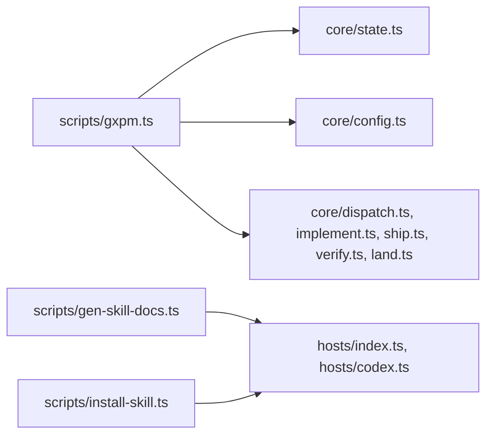

# 开发技能工具

<cite>
**本文引用的文件**
- [package.json](file://package.json)
- [AGENTS.md](file://AGENTS.md)
- [CLAUDE.md](file://CLAUDE.md)
- [core/config.ts](file://core/config.ts)
- [core/state.ts](file://core/state.ts)
- [core/dispatch.ts](file://core/dispatch.ts)
- [core/implement.ts](file://core/implement.ts)
- [core/ship.ts](file://core/ship.ts)
- [core/verify.ts](file://core/verify.ts)
- [core/land.ts](file://core/land.ts)
- [scripts/gxpm.ts](file://scripts/gxpm.ts)
- [scripts/install-skill.ts](file://scripts/install-skill.ts)
- [scripts/gen-skill-docs.ts](file://scripts/gen-skill-docs.ts)
- [hosts/index.ts](file://hosts/index.ts)
- [hosts/codex.ts](file://hosts/codex.ts)
</cite>

## 目录
1. [简介](#简介)
2. [项目结构](#项目结构)
3. [核心组件](#核心组件)
4. [架构总览](#架构总览)
5. [详细组件分析](#详细组件分析)
6. [依赖关系分析](#依赖关系分析)
7. [性能考虑](#性能考虑)
8. [故障排查指南](#故障排查指南)
9. [结论](#结论)
10. [附录](#附录)

## 简介
本项目是一个第二代项目管理运行时，旨在替代 PMC 与 gstack，提供统一的状态图、能力运行时、浏览器证据、评审/上岸治理以及代理执行循环。其核心围绕“问题（Issue）”展开，通过严格的阶段（Phase）流转与门禁（Gate）机制，确保每个变更都有可追溯的工件（Artifact）与证据链。

项目提供 CLI 工具 gxpm，支持问题创建、状态查询、阶段推进、工件读写、门禁评估、工作树策略解析、健康检查等能力，并通过主机适配器（Codex/Claude 等）生成技能文档，实现跨平台代理执行。

## 项目结构
- 核心运行时与领域逻辑位于 core 目录，包括状态管理、配置、阶段与门禁规则、各阶段工件初始化器等。
- 脚本工具位于 scripts 目录，提供 CLI 入口、技能文档生成、主机安装、健康检查等。
- 主机适配器位于 hosts 目录，定义不同代理平台的配置与安装策略。
- 文档位于 docs 目录，包含架构、治理、研究与路线图等说明。
- 测试位于 test 目录，覆盖各模块的行为与边界条件。

图表来源
- [core/config.ts:1-314](file://core/config.ts#L1-L314)
- [core/state.ts:1-305](file://core/state.ts#L1-L305)
- [core/dispatch.ts:1-17](file://core/dispatch.ts#L1-L17)
- [core/implement.ts:1-16](file://core/implement.ts#L1-L16)
- [core/ship.ts:1-17](file://core/ship.ts#L1-L17)
- [core/verify.ts:1-16](file://core/verify.ts#L1-L16)
- [core/land.ts:1-16](file://core/land.ts#L1-L16)
- [scripts/gxpm.ts:1-707](file://scripts/gxpm.ts#L1-L707)
- [scripts/gen-skill-docs.ts:1-165](file://scripts/gen-skill-docs.ts#L1-L165)
- [scripts/install-skill.ts:1-112](file://scripts/install-skill.ts#L1-L112)
- [hosts/index.ts:1-16](file://hosts/index.ts#L1-L16)
- [hosts/codex.ts:1-19](file://hosts/codex.ts#L1-L19)

章节来源
- [package.json:1-27](file://package.json#L1-L27)
- [AGENTS.md:1-87](file://AGENTS.md#L1-L87)

## 核心组件
- 配置与工作树策略：解析与持久化配置，支持仓库级与全局级配置，支持从 AGENTS.md 解析工作树策略，提供工作树启用/禁用/可选/默认策略解析。
- 问题状态与阶段：定义问题状态结构、事件流、阶段序列、阶段转换校验与门禁检查，保证阶段推进的合法性与完整性。
- 阶段工件初始化器：为每个阶段提供标准化的工件初始化器，确保阶段推进前具备必要的工件草稿。
- CLI 入口：提供问题生命周期管理、工件读写、门禁评估、工作树策略查询、健康检查、版本信息等命令。
- 技能文档生成：基于模板渲染技能文档，注入阶段命令、工件命令与前置说明，支持多主机适配。
- 主机适配器：定义不同代理平台的安装位置、环境变量、前言元数据过滤策略等。

章节来源
- [core/config.ts:1-314](file://core/config.ts#L1-L314)
- [core/state.ts:1-305](file://core/state.ts#L1-L305)
- [core/dispatch.ts:1-17](file://core/dispatch.ts#L1-L17)
- [core/implement.ts:1-16](file://core/implement.ts#L1-L16)
- [core/ship.ts:1-17](file://core/ship.ts#L1-L17)
- [core/verify.ts:1-16](file://core/verify.ts#L1-L16)
- [core/land.ts:1-16](file://core/land.ts#L1-L16)
- [scripts/gxpm.ts:1-707](file://scripts/gxpm.ts#L1-L707)
- [scripts/gen-skill-docs.ts:1-165](file://scripts/gen-skill-docs.ts#L1-L165)
- [scripts/install-skill.ts:1-112](file://scripts/install-skill.ts#L1-L112)
- [hosts/index.ts:1-16](file://hosts/index.ts#L1-L16)
- [hosts/codex.ts:1-19](file://hosts/codex.ts#L1-L19)

## 架构总览
系统采用“CLI + 核心运行时 + 主机适配器”的分层架构。CLI 作为入口协调状态、工件与门禁；核心运行时负责领域模型与规则；主机适配器负责跨平台技能文档生成与安装。

图表来源
- [scripts/gxpm.ts:1-707](file://scripts/gxpm.ts#L1-L707)
- [core/state.ts:1-305](file://core/state.ts#L1-L305)
- [core/config.ts:1-314](file://core/config.ts#L1-L314)
- [core/dispatch.ts:1-17](file://core/dispatch.ts#L1-L17)
- [core/implement.ts:1-16](file://core/implement.ts#L1-L16)
- [core/ship.ts:1-17](file://core/ship.ts#L1-L17)
- [core/verify.ts:1-16](file://core/verify.ts#L1-L16)
- [core/land.ts:1-16](file://core/land.ts#L1-L16)
- [scripts/gen-skill-docs.ts:1-165](file://scripts/gen-skill-docs.ts#L1-L165)
- [scripts/install-skill.ts:1-112](file://scripts/install-skill.ts#L1-L112)
- [hosts/index.ts:1-16](file://hosts/index.ts#L1-L16)
- [hosts/codex.ts:1-19](file://hosts/codex.ts#L1-L19)

## 详细组件分析

### 配置与工作树策略（core/config.ts）
- 功能要点
  - 支持仓库级与全局级配置文件，键值规范化与类型校验。
  - 解析 AGENTS.md 中的“## gxpm 配置”区块，提取工作树策略。
  - 提供工作树策略解析函数，按优先级返回策略来源与默认值。
  - 支持列出已知配置键、读取解析后的值、设置配置并写入文件。
- 关键接口
  - 解析 AGENTS.md 配置块：parseAgentsMdConfig
  - 解析工作树策略：resolveWorktreePolicy
  - 获取/设置配置值：getConfigValue、setConfigValue
  - 列出配置项：listConfig、listConfigEntries

图表来源
- [core/config.ts:171-252](file://core/config.ts#L171-L252)

章节来源
- [core/config.ts:1-314](file://core/config.ts#L1-L314)

### 问题状态与阶段流转（core/state.ts）
- 功能要点
  - 定义问题状态结构、阶段序列与事件格式。
  - 创建问题状态、读取状态、推进阶段、归档问题。
  - 在阶段推进前进行门禁校验，缺失必要工件时记录事件并抛出错误。
  - 提供阶段历史与事件日志，支持审计与回溯。
- 关键接口
  - 创建问题：createIssueState
  - 读取状态：readIssueState
  - 推进阶段：transitionIssuePhase
  - 归档问题：setIssueArchived
  - 门禁检查：assertPhaseGate
  - 事件追加：appendIssueEvent

图表来源
- [core/state.ts:152-304](file://core/state.ts#L152-L304)

章节来源
- [core/state.ts:1-305](file://core/state.ts#L1-L305)

### 阶段工件初始化器（core/dispatch.ts, core/implement.ts, core/ship.ts, core/verify.ts, core/land.ts）
- 功能要点
  - 为每个阶段提供标准化的工件初始化器，确保阶段推进前具备草稿工件。
  - 初始化器定义工件类型、标签、初始负载与所需阶段。
- 使用场景
  - 在阶段命令中调用初始化器，生成草稿工件，随后由用户编辑完善，再推进阶段。

章节来源
- [core/dispatch.ts:1-17](file://core/dispatch.ts#L1-L17)
- [core/implement.ts:1-16](file://core/implement.ts#L1-L16)
- [core/ship.ts:1-17](file://core/ship.ts#L1-L17)
- [core/verify.ts:1-16](file://core/verify.ts#L1-L16)
- [core/land.ts:1-16](file://core/land.ts#L1-L16)

### CLI 入口（scripts/gxpm.ts）
- 功能要点
  - 提供完整的命令集：问题创建/状态/列表/归档/历史、阶段推进、工件读写/编辑、门禁评估、工作树策略、健康检查、版本信息等。
  - 将命令映射到核心模块，统一错误处理与事件记录。
  - 支持从参数解析 JSON 负载、从文件或标准输入读取工件内容。
- 关键流程
  - 参数解析与路由：根据命令与子命令分派到具体处理函数。
  - 事件格式化：将门禁结果与阶段事件格式化输出，便于审计。
  - Git 集成：在门禁评估中读取当前分支，支持预提交/提交消息/预推送/后合并钩子。

图表来源
- [scripts/gxpm.ts:192-206](file://scripts/gxpm.ts#L192-L206)
- [core/state.ts:152-207](file://core/state.ts#L152-L207)

章节来源
- [scripts/gxpm.ts:1-707](file://scripts/gxpm.ts#L1-L707)

### 技能文档生成（scripts/gen-skill-docs.ts）
- 功能要点
  - 基于模板渲染技能文档，注入阶段命令、工件命令与前置说明。
  - 支持多主机适配，按主机前言元数据白名单过滤。
  - 生成标记插入，避免手改生成产物。
- 关键流程
  - 发现模板 → 渲染模板 → 插入生成标记 → 写入输出。

图表来源
- [scripts/gen-skill-docs.ts:28-56](file://scripts/gen-skill-docs.ts#L28-L56)

章节来源
- [scripts/gen-skill-docs.ts:1-165](file://scripts/gen-skill-docs.ts#L1-L165)

### 主机适配器（hosts/index.ts, hosts/codex.ts）
- 功能要点
  - 定义主机名称、显示名、CLI 命令、技能存储目录、是否使用环境变量、前言元数据过滤模式与安装策略。
  - 提供主机配置查询与全部主机枚举。
- 使用场景
  - 技能文档生成与安装脚本依据主机配置决定输出路径与内容。

章节来源
- [hosts/index.ts:1-16](file://hosts/index.ts#L1-L16)
- [hosts/codex.ts:1-19](file://hosts/codex.ts#L1-L19)

### 主机安装（scripts/install-skill.ts）
- 功能要点
  - 根据主机配置渲染技能内容，应用前言元数据过滤，写入全局技能目录。
  - 支持指定主机或全部主机安装。
- 关键流程
  - 解析目标主机 → 渲染内容 → 应用前言过滤 → 写入文件。

章节来源
- [scripts/install-skill.ts:1-112](file://scripts/install-skill.ts#L1-L112)

## 依赖关系分析
- CLI 依赖核心状态与配置模块，以及阶段工件初始化器。
- 技能文档生成依赖主机配置与阶段门禁规则。
- 主机安装依赖主机配置与技能模板渲染。

图表来源
- [scripts/gxpm.ts:1-34](file://scripts/gxpm.ts#L1-L34)
- [core/state.ts:1-11](file://core/state.ts#L1-L11)
- [core/config.ts:1-14](file://core/config.ts#L1-L14)
- [core/dispatch.ts:1-2](file://core/dispatch.ts#L1-L2)
- [core/implement.ts:1-2](file://core/implement.ts#L1-L2)
- [core/ship.ts:1-2](file://core/ship.ts#L1-L2)
- [core/verify.ts:1-2](file://core/verify.ts#L1-L2)
- [core/land.ts:1-2](file://core/land.ts#L1-L2)
- [scripts/gen-skill-docs.ts:1-8](file://scripts/gen-skill-docs.ts#L1-L8)
- [scripts/install-skill.ts:1-7](file://scripts/install-skill.ts#L1-L7)

章节来源
- [scripts/gxpm.ts:1-707](file://scripts/gxpm.ts#L1-L707)
- [scripts/gen-skill-docs.ts:1-165](file://scripts/gen-skill-docs.ts#L1-L165)
- [scripts/install-skill.ts:1-112](file://scripts/install-skill.ts#L1-L112)
- [hosts/index.ts:1-16](file://hosts/index.ts#L1-L16)
- [hosts/codex.ts:1-19](file://hosts/codex.ts#L1-L19)

## 性能考虑
- 文件系统访问：状态、工件与事件均以文件形式持久化，频繁小文件读写可能成为瓶颈。建议在批量操作时减少重复 IO。
- JSON 解析与序列化：事件日志与状态文件采用 JSON，注意避免过大的事件文件导致解析开销增加。
- 门禁校验：阶段推进前的门禁检查为 O(1) 文件存在性判断，性能开销较低。
- CLI 启动：Bun 作为运行时，启动与执行效率较高；建议在 CI 环境中缓存依赖与中间产物。

## 故障排查指南
- 阶段推进被阻塞
  - 现象：推进阶段时报错，提示缺少所需工件。
  - 排查：使用“下一阶段”命令查看所需工件与初始化命令；确认工件已存在且内容符合要求。
  - 参考：[core/state.ts:255-304](file://core/state.ts#L255-L304)
- 门禁拒绝提交
  - 现象：预提交/提交消息/预推送/后合并门禁拒绝。
  - 排查：检查门禁原因与保护命中文件列表；按提示修复或临时禁用门禁（不推荐）。
  - 参考：[scripts/gxpm.ts:573-665](file://scripts/gxpm.ts#L573-L665)
- 工件写入失败
  - 现象：工件写入报错，提示 JSON 无效或参数不合法。
  - 排查：确认 --json/--from/--stdin 三者仅选其一；检查 JSON 结构与字段。
  - 参考：[scripts/gxpm.ts:505-536](file://scripts/gxpm.ts#L505-L536)
- 工作树策略冲突
  - 现象：工作树启用/禁用策略与实际行为不符。
  - 排查：使用工作树策略命令查看解析来源；检查仓库配置、AGENTS.md 与用户消息优先级。
  - 参考：[core/config.ts:210-252](file://core/config.ts#L210-L252)
- 技能文档未更新
  - 现象：生成后与模板不一致。
  - 排查：使用干跑模式检查过期文档；重新生成并确认生成标记存在。
  - 参考：[scripts/gen-skill-docs.ts:38-56](file://scripts/gen-skill-docs.ts#L38-L56)

章节来源
- [core/state.ts:255-304](file://core/state.ts#L255-L304)
- [scripts/gxpm.ts:505-665](file://scripts/gxpm.ts#L505-L665)
- [core/config.ts:210-252](file://core/config.ts#L210-L252)
- [scripts/gen-skill-docs.ts:38-56](file://scripts/gen-skill-docs.ts#L38-L56)

## 结论
本项目通过严格的状态图与门禁机制，将项目管理过程标准化、可审计化与可自动化。CLI 提供了从问题创建到上岸落地的全生命周期管理能力，结合技能文档生成与主机适配器，实现了跨平台代理执行的一致体验。建议在团队内推广 AGENTS.md 中的执行契约与工作流约定，确保工具使用的稳定性与一致性。

## 附录
- AGENTS 执行契约与工作流说明参见 AGENTS.md。
- Claude 启动说明参见 CLAUDE.md。
- 包管理与引擎要求参见 package.json。

章节来源
- [AGENTS.md:1-87](file://AGENTS.md#L1-L87)
- [CLAUDE.md:1-17](file://CLAUDE.md#L1-L17)
- [package.json:1-27](file://package.json#L1-L27)