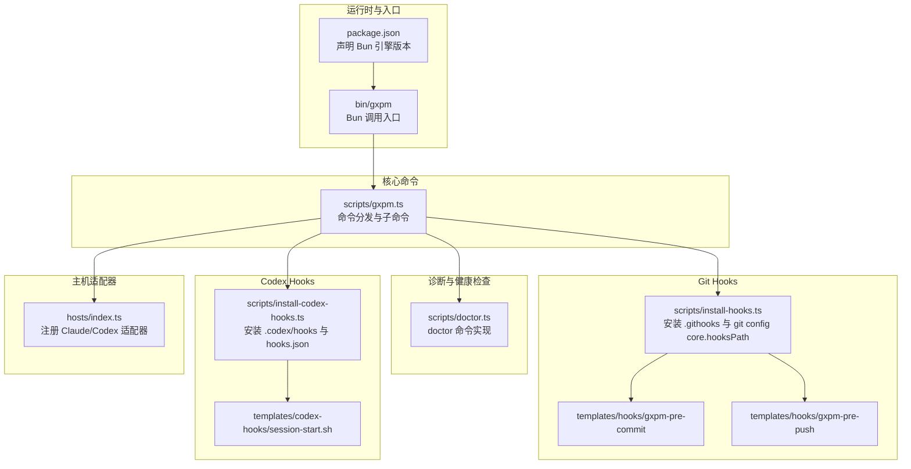
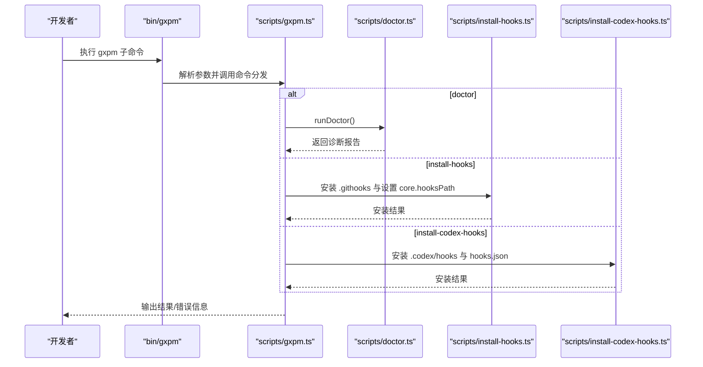
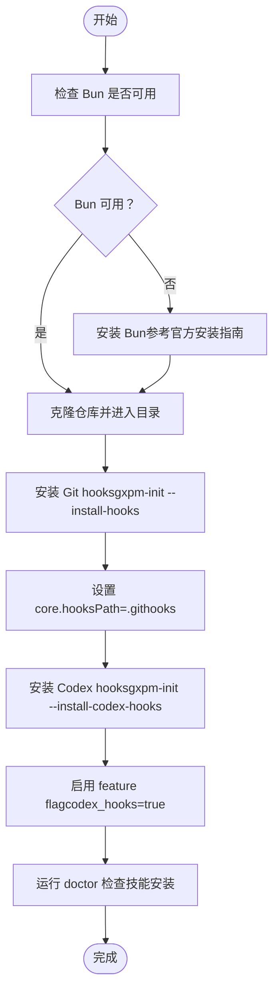
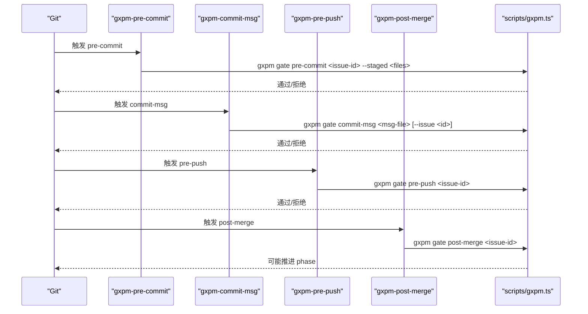
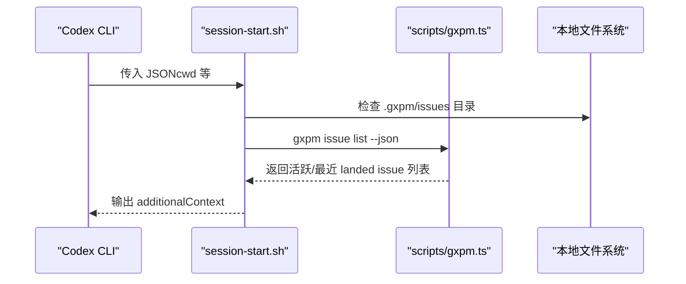
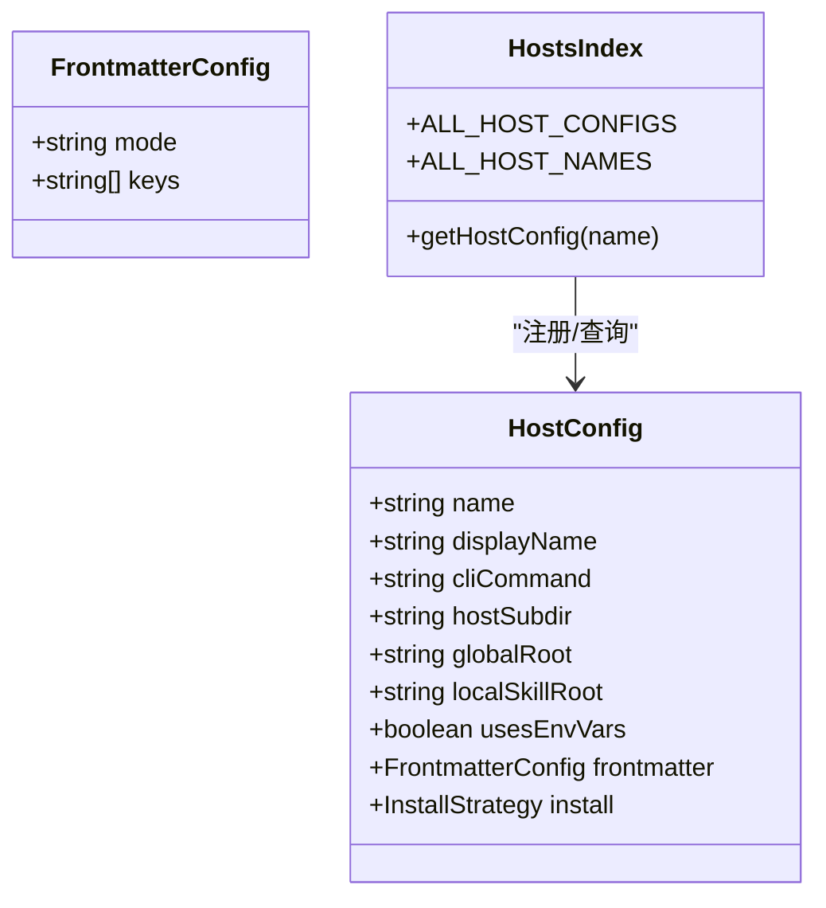
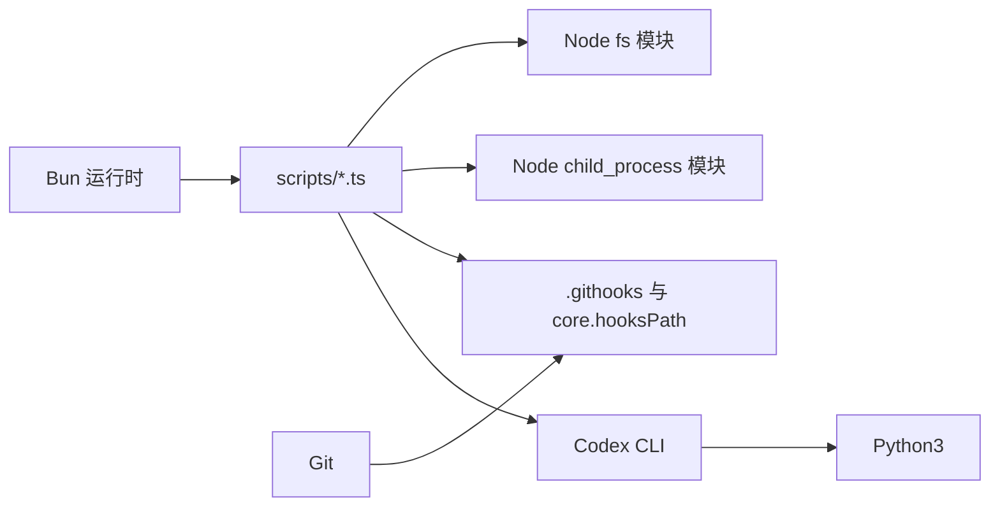

# 开发环境搭建

<cite>
**本文引用的文件**
- [package.json](file://package.json)
- [bin/gxpm](file://bin/gxpm)
- [scripts/gxpm.ts](file://scripts/gxpm.ts)
- [scripts/doctor.ts](file://scripts/doctor.ts)
- [scripts/install-hooks.ts](file://scripts/install-hooks.ts)
- [scripts/install-codex-hooks.ts](file://scripts/install-codex-hooks.ts)
- [scripts/host-config.ts](file://scripts/host-config.ts)
- [templates/hooks/gxpm-pre-commit](file://templates/hooks/gxpm-pre-commit)
- [templates/hooks/gxpm-pre-push](file://templates/hooks/gxpm-pre-push)
- [templates/codex-hooks/session-start.sh](file://templates/codex-hooks/session-start.sh)
- [AGENTS.md](file://AGENTS.md)
- [CLAUDE.md](file://CLAUDE.md)
- [README.md](file://README.md)
- [hosts/index.ts](file://hosts/index.ts)
</cite>

## 目录
1. [简介](#简介)
2. [项目结构](#项目结构)
3. [核心组件](#核心组件)
4. [架构总览](#架构总览)
5. [详细组件分析](#详细组件分析)
6. [依赖分析](#依赖分析)
7. [性能考虑](#性能考虑)
8. [故障排除指南](#故障排除指南)
9. [结论](#结论)
10. [附录](#附录)

## 简介
本指南面向希望在本地搭建 gxpm 开发环境的工程师与文档作者，目标是帮助你：
- 明确系统要求与依赖（尤其是 Bun 运行时）
- 完整安装与配置流程（含 Git hooks、Codex hooks、技能安装）
- 使用开发工具链进行调试、热重载与本地开发服务器配置
- 解决常见环境问题与故障排查
- 提供 IDE 配置建议与代码格式化设置

## 项目结构
该仓库采用“脚手架 + 核心逻辑 + 工具脚本”的分层组织方式：
- 根级入口与运行时声明：package.json、bin/gxpm
- 核心业务逻辑：scripts/gxpm.ts（命令分发与子命令执行）
- 健康检查与诊断：scripts/doctor.ts
- Git hooks 安装与配置：scripts/install-hooks.ts 与 templates/hooks/*
- Codex hooks 安装与配置：scripts/install-codex-hooks.ts 与 templates/codex-hooks/*
- 主机适配器注册：hosts/index.ts
- 开发规范与命令示例：AGENTS.md、CLAUDE.md、README.md

**图表来源**
- [package.json:1-25](file://package.json#L1-L25)
- [bin/gxpm:1-18](file://bin/gxpm#L1-L18)
- [scripts/gxpm.ts:1-611](file://scripts/gxpm.ts#L1-L611)
- [scripts/doctor.ts:1-216](file://scripts/doctor.ts#L1-L216)
- [scripts/install-hooks.ts:1-106](file://scripts/install-hooks.ts#L1-L106)
- [scripts/install-codex-hooks.ts:1-214](file://scripts/install-codex-hooks.ts#L1-L214)
- [templates/hooks/gxpm-pre-commit:1-31](file://templates/hooks/gxpm-pre-commit#L1-L31)
- [templates/hooks/gxpm-pre-push:1-17](file://templates/hooks/gxpm-pre-push#L1-L17)
- [templates/codex-hooks/session-start.sh:1-71](file://templates/codex-hooks/session-start.sh#L1-L71)
- [hosts/index.ts:1-16](file://hosts/index.ts#L1-L16)

**章节来源**
- [README.md:1-46](file://README.md#L1-L46)
- [package.json:1-25](file://package.json#L1-L25)
- [bin/gxpm:1-18](file://bin/gxpm#L1-L18)
- [scripts/gxpm.ts:1-611](file://scripts/gxpm.ts#L1-L611)

## 核心组件
- Bun 运行时与引擎版本：package.json 声明 engines.bun >= 1.0.0，确保使用 Bun 作为 TypeScript/JS 运行时与包管理器。
- gxpm CLI：bin/gxpm 作为 Bash 入口，解析符号链接后调用 scripts/gxpm.ts。
- 命令分发器：scripts/gxpm.ts 将命令路由到不同功能分支（config、issue、artifact、gate、worktree、doctor、check 等）。
- 诊断工具：scripts/doctor.ts 检查 Bun 可用性、技能安装、Git 仓库与 hooks 状态等。
- Git hooks 安装：scripts/install-hooks.ts 将 gxpm 钩子复制到 .githooks，并设置 git config core.hooksPath。
- Codex hooks 安装：scripts/install-codex-hooks.ts 安装 .codex/hooks 并更新 hooks.json，同时处理 feature flag。
- 主机适配器：hosts/index.ts 注册 Claude 与 Codex 的 host 配置。

**章节来源**
- [package.json:18-23](file://package.json#L18-L23)
- [bin/gxpm:15-17](file://bin/gxpm#L15-L17)
- [scripts/gxpm.ts:32-256](file://scripts/gxpm.ts#L32-L256)
- [scripts/doctor.ts:51-61](file://scripts/doctor.ts#L51-L61)
- [scripts/install-hooks.ts:50-103](file://scripts/install-hooks.ts#L50-L103)
- [scripts/install-codex-hooks.ts:30-95](file://scripts/install-codex-hooks.ts#L30-L95)
- [hosts/index.ts:1-16](file://hosts/index.ts#L1-L16)

## 架构总览
下图展示 gxpm CLI 在本地开发中的典型交互路径：从命令行入口到核心命令分发，再到 Git/Codex hooks 的联动。

**图表来源**
- [bin/gxpm:15-17](file://bin/gxpm#L15-L17)
- [scripts/gxpm.ts:32-305](file://scripts/gxpm.ts#L32-L305)
- [scripts/doctor.ts:51-61](file://scripts/doctor.ts#L51-L61)
- [scripts/install-hooks.ts:50-103](file://scripts/install-hooks.ts#L50-L103)
- [scripts/install-codex-hooks.ts:30-95](file://scripts/install-codex-hooks.ts#L30-L95)

## 详细组件分析

### 系统要求与依赖
- Bun 运行时：engines.bun >= 1.0.0，推荐使用最新稳定版以获得最佳兼容性。
- Node.js：项目以 ES Module 与 Bun 运行时为主，无需 Node.js 运行时依赖；但部分脚本使用 Node 内置模块（如 fs、child_process）。
- Git：用于 hooks 安装与状态门禁；.githooks 与 core.hooksPath 需正确配置。
- 可选：Codex CLI 与 Python3（用于 Codex hooks 的上下文注入脚本）。

**章节来源**
- [package.json:21-23](file://package.json#L21-L23)
- [scripts/doctor.ts:63-79](file://scripts/doctor.ts#L63-L79)
- [templates/codex-hooks/session-start.sh:10-11](file://templates/codex-hooks/session-start.sh#L10-L11)

### 安装与初始化流程
- 克隆仓库并安装依赖：使用 Bun 管理包与脚本，无需额外 Node.js 安装。
- 安装 Git hooks：
  - 使用 gxpm 命令安装 .githooks 下的 gxpm 钩子，并设置 git config core.hooksPath = .githooks。
  - 若存在现有顶级钩子，脚本会提示保留并给出接入建议。
- 安装 Codex hooks：
  - 安装 .codex/hooks 下的 gxpm-* 脚本，并更新 hooks.json。
  - 自动处理 feature flag（codex_hooks = true），必要时备份原配置。
- 技能安装：
  - 使用 doctor 命令检查技能安装情况，按提示执行安装命令。

**图表来源**
- [scripts/install-hooks.ts:50-103](file://scripts/install-hooks.ts#L50-L103)
- [scripts/install-codex-hooks.ts:30-95](file://scripts/install-codex-hooks.ts#L30-L95)
- [scripts/doctor.ts:51-61](file://scripts/doctor.ts#L51-L61)

**章节来源**
- [scripts/install-hooks.ts:50-103](file://scripts/install-hooks.ts#L50-L103)
- [scripts/install-codex-hooks.ts:30-95](file://scripts/install-codex-hooks.ts#L30-L95)
- [scripts/doctor.ts:51-61](file://scripts/doctor.ts#L51-L61)

### 开发工具链使用
- 调试：
  - 使用 Bun 直接运行脚本与命令，例如 bun run scripts/gxpm-check.ts、bun run scripts/doctor.ts。
  - 在 VS Code 中配置 launch.json，使用 Node 检测器附加到 Bun 进程进行断点调试。
- 热重载与开发服务器：
  - 本项目以命令行工具为主，未内置热重载服务。可在本地使用其他工具（如 nodemon、watchexec）监控文件变更并触发命令。
- 开发服务器配置：
  - 无专用开发服务器；如需本地预览或文档服务，可使用静态文件服务器或文档工具（如 docusaurus、vitepress）配合本地构建脚本。

**章节来源**
- [package.json:13-16](file://package.json#L13-L16)
- [scripts/gxpm.ts:605-610](file://scripts/gxpm.ts#L605-L610)

### Git hooks 与状态门禁
- 预提交钩子：在提交前根据 issue 状态与受保护文件策略进行门禁校验。
- 预推送钩子：在推送前校验是否满足下一阶段所需 artifact。
- 后合并钩子：在合并后自动推进 phase（如 qa→land）并写入 land-findings。

**图表来源**
- [templates/hooks/gxpm-pre-commit:1-31](file://templates/hooks/gxpm-pre-commit#L1-L31)
- [templates/hooks/gxpm-pre-push:1-17](file://templates/hooks/gxpm-pre-push#L1-L17)
- [scripts/gxpm.ts:483-603](file://scripts/gxpm.ts#L483-L603)

**章节来源**
- [templates/hooks/gxpm-pre-commit:1-31](file://templates/hooks/gxpm-pre-commit#L1-L31)
- [templates/hooks/gxpm-pre-push:1-17](file://templates/hooks/gxpm-pre-push#L1-L17)
- [scripts/gxpm.ts:225-243](file://scripts/gxpm.ts#L225-L243)

### Codex hooks 与上下文注入
- 安装 .codex/hooks 下的 gxpm-* 脚本，并在 hooks.json 中注册 SessionStart 与 UserPromptSubmit 事件。
- session-start.sh 从 stdin 读取 Codex 输入，查询本地活跃 issue 并输出附加上下文，便于 AI 辅助决策。

**图表来源**
- [scripts/install-codex-hooks.ts:30-95](file://scripts/install-codex-hooks.ts#L30-L95)
- [templates/codex-hooks/session-start.sh:14-70](file://templates/codex-hooks/session-start.sh#L14-L70)
- [scripts/gxpm.ts:107-140](file://scripts/gxpm.ts#L107-L140)

**章节来源**
- [scripts/install-codex-hooks.ts:30-95](file://scripts/install-codex-hooks.ts#L30-L95)
- [templates/codex-hooks/session-start.sh:14-70](file://templates/codex-hooks/session-start.sh#L14-L70)

### 主机适配器与技能配置
- hosts/index.ts 注册 Claude 与 Codex 的 host 配置，供 doctor 与安装脚本使用。
- scripts/host-config.ts 提供配置校验逻辑，确保 host 名称、路径与 frontmatter 策略合法。

**图表来源**
- [scripts/host-config.ts:1-83](file://scripts/host-config.ts#L1-L83)
- [hosts/index.ts:1-16](file://hosts/index.ts#L1-L16)

**章节来源**
- [hosts/index.ts:1-16](file://hosts/index.ts#L1-L16)
- [scripts/host-config.ts:29-82](file://scripts/host-config.ts#L29-L82)

## 依赖分析
- 运行时依赖：Bun（engines.bun >= 1.0.0），Node 内置模块（fs、child_process、path、os 等）。
- Git 与 hooks：.githooks 与 core.hooksPath 配置，确保 Git 钩子生效。
- 可选依赖：Codex CLI 与 Python3（用于 Codex hooks 的上下文注入）。

**图表来源**
- [package.json:21-23](file://package.json#L21-L23)
- [scripts/gxpm.ts:1-11](file://scripts/gxpm.ts#L1-L11)
- [scripts/install-hooks.ts:1-4](file://scripts/install-hooks.ts#L1-L4)
- [scripts/install-codex-hooks.ts:1-4](file://scripts/install-codex-hooks.ts#L1-L4)

**章节来源**
- [package.json:21-23](file://package.json#L21-L23)
- [scripts/gxpm.ts:1-11](file://scripts/gxpm.ts#L1-L11)
- [scripts/install-hooks.ts:1-4](file://scripts/install-hooks.ts#L1-L4)
- [scripts/install-codex-hooks.ts:1-4](file://scripts/install-codex-hooks.ts#L1-L4)

## 性能考虑
- 使用 Bun 运行时可获得更快的冷启动与执行速度，适合频繁调用的 CLI 场景。
- hooks 脚本尽量保持轻量，避免在 pre-commit/pre-push 中执行耗时操作。
- Codex hooks 通过 gxpm issue list 获取上下文，建议限制返回数量以减少 IO。

## 故障排除指南
- Bun 未安装或版本过低
  - 现象：命令无法执行或报错。
  - 处理：安装 Bun（版本满足 engines.bun 要求），确认 bun --version 正常。
- Git 仓库未初始化或 core.hooksPath 未设置
  - 现象：hooks 未生效。
  - 处理：执行 gxpm-init --install-hooks，确保 core.hooksPath 指向 .githooks。
- 缺少 Codex hooks 或 feature flag 未启用
  - 现象：Codex 未注入上下文。
  - 处理：执行 gxpm-init --install-codex-hooks，确认 ~/.codex/config.toml 中 codex_hooks = true。
- 技能未安装
  - 现象：doctor 报告技能缺失。
  - 处理：按 doctor 提示执行安装命令，或使用 gxpm-init --install-skill --host all。
- 权限问题
  - 现象：hooks 无法执行。
  - 处理：确保 .githooks/* 与 .codex/hooks/* 文件具有可执行权限（chmod +x）。

**章节来源**
- [scripts/doctor.ts:51-61](file://scripts/doctor.ts#L51-L61)
- [scripts/install-hooks.ts:81-92](file://scripts/install-hooks.ts#L81-L92)
- [scripts/install-codex-hooks.ts:102-134](file://scripts/install-codex-hooks.ts#L102-L134)

## 结论
通过以上步骤，你可以完成 gxpm 的本地开发环境搭建：安装 Bun、配置 Git hooks、安装 Codex hooks、校验技能安装，并使用 doctor 命令进行健康检查。在此基础上，结合 AGENTS.md 的开发规范与 CLAUDE.md 的引导，即可开展高质量的代理项目管理工作流开发。

## 附录

### IDE 配置建议
- VS Code
  - 插件：TypeScript Importer、ES7+ React/Redux/React-Native snippets、EditorConfig、Prettier。
  - launch.json：配置 Node 检测器附加到 Bun 进程，以便断点调试。
  - settings.json：启用 editor.formatOnSave、editor.codeActionsOnSave，选择 Prettier 作为默认格式化器。
- 其他编辑器
  - 确保启用 TypeScript/JavaScript 支持与 ESLint/Prettier 集成。
  - 为 hooks 脚本设置可执行权限（chmod +x）。

### 代码格式化与风格
- 使用 Prettier 作为统一格式化工具，配合 .prettierrc 或 package.json 中的 prettier 字段。
- 保持文件命名与导出一致（如 scripts/*.ts 与 templates/* 对齐）。
- hooks 脚本遵循 Bash 最佳实践：设置 -e、使用双引号包裹变量、避免相对路径风险。