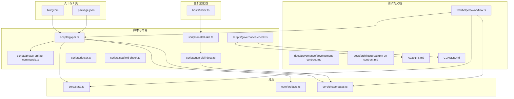
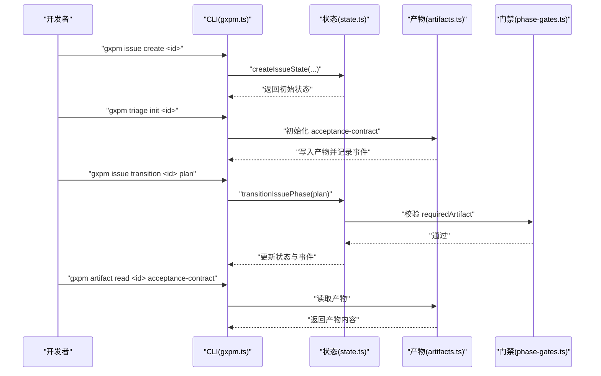
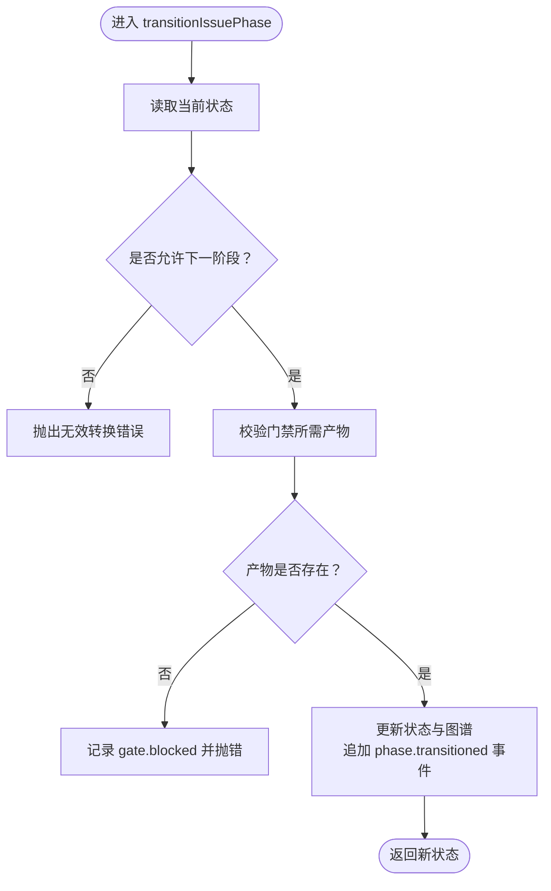
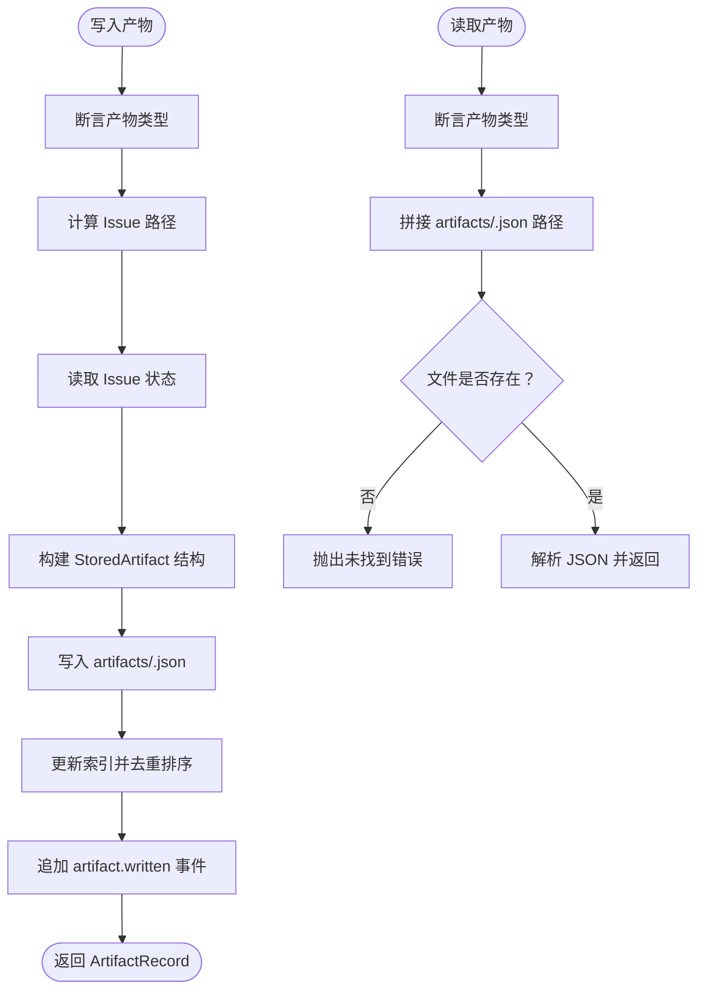
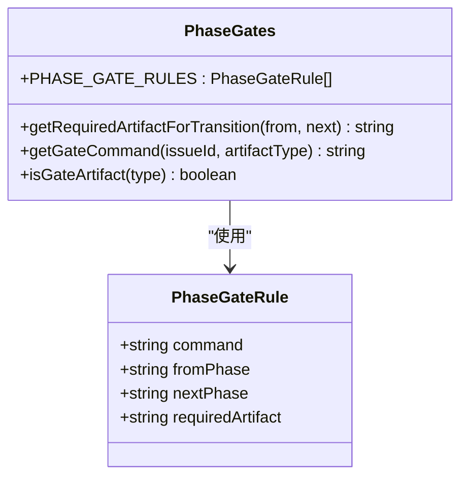
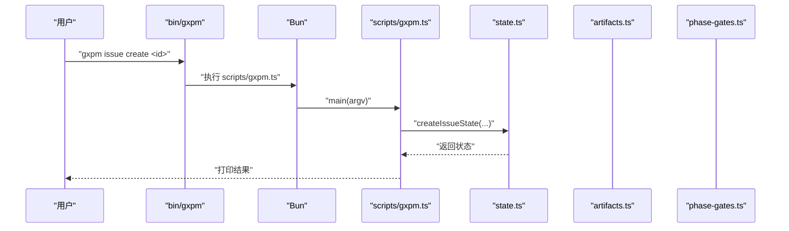
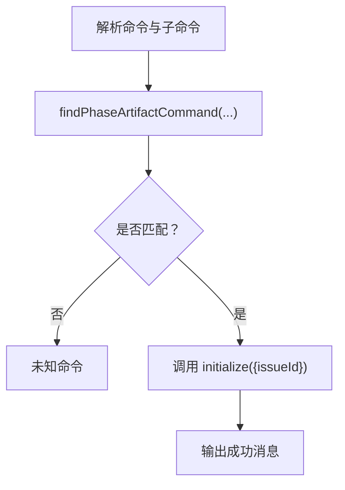
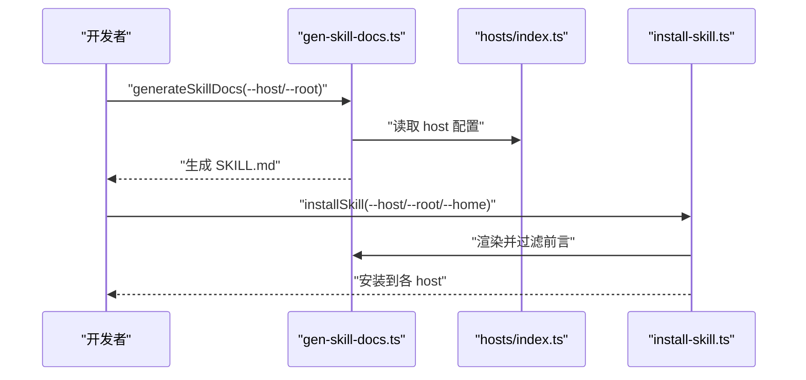
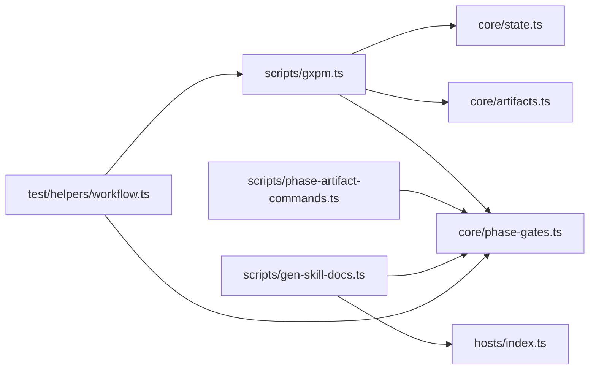

# 开发者指南

<cite>
**本文引用的文件**
- [package.json](file://package.json)
- [README.md](file://README.md)
- [AGENTS.md](file://AGENTS.md)
- [CLAUDE.md](file://CLAUDE.md)
- [docs/governance/development-contract.md](file://docs/governance/development-contract.md)
- [docs/architecture/gxpm-v0-contract.md](file://docs/architecture/gxpm-v0-contract.md)
- [core/state.ts](file://core/state.ts)
- [core/artifacts.ts](file://core/artifacts.ts)
- [core/phase-gates.ts](file://core/phase-gates.ts)
- [scripts/gxpm.ts](file://scripts/gxpm.ts)
- [scripts/phase-artifact-commands.ts](file://scripts/phase-artifact-commands.ts)
- [scripts/gen-skill-docs.ts](file://scripts/gen-skill-docs.ts)
- [scripts/install-skill.ts](file://scripts/install-skill.ts)
- [scripts/governance-check.ts](file://scripts/governance-check.ts)
- [scripts/doctor.ts](file://scripts/doctor.ts)
- [scripts/scaffold-check.ts](file://scripts/scaffold-check.ts)
- [hosts/index.ts](file://hosts/index.ts)
- [bin/gxpm](file://bin/gxpm)
- [test/helpers/workflow.ts](file://test/helpers/workflow.ts)
</cite>

## 目录
1. [简介](#简介)
2. [项目结构](#项目结构)
3. [核心组件](#核心组件)
4. [架构总览](#架构总览)
5. [详细组件分析](#详细组件分析)
6. [依赖分析](#依赖分析)
7. [性能考量](#性能考量)
8. [故障排查指南](#故障排查指南)
9. [结论](#结论)
10. [附录](#附录)

## 简介
本指南面向 gxpm 项目的开发者，帮助你理解项目结构、代码组织原则、开发环境搭建、测试策略、贡献流程、扩展最佳实践、治理协议与开发契约、性能优化与安全考虑。项目以 TypeScript/Bun 为基础，采用模块化核心（state、artifacts、phase-gates）、可扩展的 host 适配器、基于模板的技能文档生成与校验机制，以及严格的门禁与状态机驱动的工作流。

## 项目结构
- 根目录提供包元信息与入口脚本，核心逻辑集中在 core/，命令行入口在 scripts/，主机适配器在 hosts/，治理与架构文档在 docs/，测试在 test/，模板与脚手架在 templates/ 与 skills/，二进制入口在 bin/。
- 关键模块职责：
  - core/state.ts：Issue 状态与事件、阶段转换、图谱与事件日志。
  - core/artifacts.ts：产物读写、索引与一致性保证。
  - core/phase-gates.ts：阶段门禁规则与命令映射。
  - scripts/gxpm.ts：CLI 主入口，解析命令、路由到各子功能。
  - scripts/phase-artifact-commands.ts：阶段产物初始化命令绑定。
  - scripts/gen-skill-docs.ts：根据模板与规则生成技能文档。
  - scripts/install-skill.ts：将生成的技能文档安装到各 host。
  - scripts/governance-check.ts：治理文档完整性与边界检查。
  - hosts/index.ts：host 配置注册与选择。
  - bin/gxpm：Bash 入口，转发到 Bun 脚本。
  - test/helpers/workflow.ts：测试工作流辅助，确保测试与阶段规则一致。

图表来源
- [bin/gxpm](file://bin/gxpm)
- [package.json](file://package.json)
- [scripts/gxpm.ts](file://scripts/gxpm.ts)
- [core/state.ts](file://core/state.ts)
- [core/artifacts.ts](file://core/artifacts.ts)
- [core/phase-gates.ts](file://core/phase-gates.ts)
- [scripts/phase-artifact-commands.ts](file://scripts/phase-artifact-commands.ts)
- [scripts/gen-skill-docs.ts](file://scripts/gen-skill-docs.ts)
- [scripts/install-skill.ts](file://scripts/install-skill.ts)
- [scripts/governance-check.ts](file://scripts/governance-check.ts)
- [test/helpers/workflow.ts](file://test/helpers/workflow.ts)
- [hosts/index.ts](file://hosts/index.ts)
- [AGENTS.md](file://AGENTS.md)
- [CLAUDE.md](file://CLAUDE.md)
- [docs/governance/development-contract.md](file://docs/governance/development-contract.md)
- [docs/architecture/gxpm-v0-contract.md](file://docs/architecture/gxpm-v0-contract.md)

章节来源
- [README.md](file://README.md)
- [package.json](file://package.json)

## 核心组件
- 状态与事件
  - Issue 状态模型、阶段序列、事件日志与图谱持久化，提供创建、读取、阶段转换、归档等能力。
  - 阶段转换受门禁约束，缺失必要产物时抛出错误并记录事件。
- 产物系统
  - 统一的 JSON 产物读写、索引更新与一致性保证，写入时追加事件日志。
- 阶段门禁
  - 严格顺序的阶段链路与所需产物类型，命令行命令与产物类型一一对应。
- CLI 主入口
  - 解析命令、路由到 issue/artifact/gate/doctor/config 等子功能，支持工作树策略查询与医生报告。
- 阶段产物命令绑定
  - 将阶段门禁规则映射到具体初始化命令，简化用户操作。
- 治理与文档
  - 治理文档完整性检查、技能文档生成与安装、脚手架检查。

章节来源
- [core/state.ts](file://core/state.ts)
- [core/artifacts.ts](file://core/artifacts.ts)
- [core/phase-gates.ts](file://core/phase-gates.ts)
- [scripts/gxpm.ts](file://scripts/gxpm.ts)
- [scripts/phase-artifact-commands.ts](file://scripts/phase-artifact-commands.ts)
- [scripts/governance-check.ts](file://scripts/governance-check.ts)

## 架构总览
gxpm 采用“状态机 + 产物 + 门禁 + CLI + 治理”的架构：
- 状态机驱动 Issue 生命周期，阶段间严格顺序。
- 每个阶段转换前必须具备对应产物，否则阻塞。
- CLI 提供状态查询、阶段推进、产物读写、门禁评估与医生报告。
- 治理与文档生成确保模板与生成物一致性，防止漂移。

图表来源
- [scripts/gxpm.ts](file://scripts/gxpm.ts)
- [core/state.ts](file://core/state.ts)
- [core/artifacts.ts](file://core/artifacts.ts)
- [core/phase-gates.ts](file://core/phase-gates.ts)

## 详细组件分析

### 组件 A：状态与事件（state.ts）
- 数据结构
  - IssueState：包含当前阶段、创建/更新时间、归档状态、阶段历史等。
  - StateEvent：事件类型包括 issue.created、phase.transitioned、artifact.written、gate.passed/blocked。
- 处理逻辑
  - 创建 Issue 时初始化目录结构与基础文件。
  - 阶段转换前调用门禁校验，成功写入状态与事件日志，失败记录 gate.blocked 并抛错。
  - 归档与更新时间戳维护。
- 错误处理
  - 非法阶段、非法 Issue ID、缺少必要产物均抛错并记录事件。
- 性能与复杂度
  - 文件读写为 O(1) 次操作，事件日志为追加写，整体开销低。

图表来源
- [core/state.ts](file://core/state.ts)
- [core/phase-gates.ts](file://core/phase-gates.ts)

章节来源
- [core/state.ts](file://core/state.ts)

### 组件 B：产物系统（artifacts.ts）
- 数据结构
  - StoredArtifact：包含 schemaVersion、issueId、type、writtenAt、payload。
  - ArtifactRecord：索引项，包含 type、path、writtenAt。
- 处理逻辑
  - 写入：校验类型、读取状态、生成存储结构、写入文件、更新索引、追加事件。
  - 读取：按类型查找文件，不存在则报错。
  - 列表：读取索引文件，返回记录数组。
  - 校验：hasArtifact 检查文件是否存在。
- 错误处理
  - 非法类型、产物不存在、索引缺失均抛错。
- 性能与复杂度
  - 写入为单文件写入与一次索引更新，读取为单文件读取，复杂度低。

图表来源
- [core/artifacts.ts](file://core/artifacts.ts)

章节来源
- [core/artifacts.ts](file://core/artifacts.ts)

### 组件 C：阶段门禁（phase-gates.ts）
- 数据结构
  - PhaseGateRule：包含命令、起止阶段、所需产物类型。
  - PHASE_GATE_RULES：阶段门禁规则集合。
- 处理逻辑
  - 通过 fromPhase/nextPhase 查找 requiredArtifact。
  - 通过 requiredArtifact 反查命令。
  - 提供集合与判定函数，供 CLI 与状态转换使用。
- 错误处理
  - 无匹配规则时返回空或默认命令，避免硬编码。

图表来源
- [core/phase-gates.ts](file://core/phase-gates.ts)

章节来源
- [core/phase-gates.ts](file://core/phase-gates.ts)

### 组件 D：CLI 主入口（scripts/gxpm.ts）
- 功能概览
  - 版本、配置、医生报告、问题管理、产物读写、门禁评估、阶段推进、阶段历史与下一步提示。
- 控制流
  - 解析参数，分派到对应子命令；对阶段产物命令进行动态绑定与初始化。
- 错误处理
  - 参数缺失、未知命令、状态不存在、门禁失败等均输出清晰错误并退出非零码。
- 性能与复杂度
  - 大多为文件系统操作，复杂度低；编辑器交互为外部进程调用。

图表来源
- [bin/gxpm](file://bin/gxpm)
- [scripts/gxpm.ts](file://scripts/gxpm.ts)
- [core/state.ts](file://core/state.ts)

章节来源
- [scripts/gxpm.ts](file://scripts/gxpm.ts)
- [bin/gxpm](file://bin/gxpm)

### 组件 E：阶段产物命令绑定（scripts/phase-artifact-commands.ts）
- 功能概览
  - 将 PHASE_GATE_RULES 映射到具体初始化函数与成功消息。
  - 提供 findPhaseArtifactCommand 以解析命令行输入。
- 设计要点
  - 与 phase-gates.ts 保持强一致，避免手写第二份规则。

图表来源
- [scripts/phase-artifact-commands.ts](file://scripts/phase-artifact-commands.ts)
- [core/phase-gates.ts](file://core/phase-gates.ts)

章节来源
- [scripts/phase-artifact-commands.ts](file://scripts/phase-artifact-commands.ts)

### 组件 F：技能文档生成与安装（scripts/gen-skill-docs.ts、scripts/install-skill.ts）
- 功能概览
  - 从模板渲染技能文档，注入阶段门禁命令、产物读取命令与过渡摘要。
  - 将生成文档安装到各 host 的全局根目录，按 host 前言过滤。
- 设计要点
  - 生成物与模板强绑定，治理检查确保一致性。

图表来源
- [scripts/gen-skill-docs.ts](file://scripts/gen-skill-docs.ts)
- [scripts/install-skill.ts](file://scripts/install-skill.ts)
- [hosts/index.ts](file://hosts/index.ts)

章节来源
- [scripts/gen-skill-docs.ts](file://scripts/gen-skill-docs.ts)
- [scripts/install-skill.ts](file://scripts/install-skill.ts)
- [hosts/index.ts](file://hosts/index.ts)

### 组件 G：治理与脚手架检查（scripts/governance-check.ts、scripts/scaffold-check.ts）
- 功能概览
  - 治理文档完整性检查：必需文档、长度限制、标题存在性、指向关系。
  - 脚手架检查：作为 check 命令的真值来源，禁止在 gxpm-check.ts 中重复实现。
- 设计要点
  - 通过测试验证 CLI 命令顺序与门禁规则一致，避免手写工作流。

章节来源
- [scripts/governance-check.ts](file://scripts/governance-check.ts)
- [test/helpers/workflow.ts](file://test/helpers/workflow.ts)

## 依赖分析
- 模块耦合
  - CLI 依赖 state、artifacts、phase-gates、gate 评估与配置模块。
  - 阶段产物命令绑定依赖 phase-gates 与各阶段初始化模块。
  - 文档生成依赖 hosts 与 phase-gates。
  - 测试工作流依赖 phase-gates 与 CLI，确保测试与规则一致。
- 外部依赖
  - Bun 作为运行时与包管理器，Node 标准库用于文件系统与路径。
- 潜在环依赖
  - 未见直接环依赖；各模块职责清晰，通过接口与常量传递数据。

图表来源
- [scripts/gxpm.ts](file://scripts/gxpm.ts)
- [core/state.ts](file://core/state.ts)
- [core/artifacts.ts](file://core/artifacts.ts)
- [core/phase-gates.ts](file://core/phase-gates.ts)
- [scripts/phase-artifact-commands.ts](file://scripts/phase-artifact-commands.ts)
- [scripts/gen-skill-docs.ts](file://scripts/gen-skill-docs.ts)
- [hosts/index.ts](file://hosts/index.ts)
- [test/helpers/workflow.ts](file://test/helpers/workflow.ts)

章节来源
- [scripts/gxpm.ts](file://scripts/gxpm.ts)
- [core/phase-gates.ts](file://core/phase-gates.ts)
- [scripts/phase-artifact-commands.ts](file://scripts/phase-artifact-commands.ts)
- [scripts/gen-skill-docs.ts](file://scripts/gen-skill-docs.ts)
- [hosts/index.ts](file://hosts/index.ts)
- [test/helpers/workflow.ts](file://test/helpers/workflow.ts)

## 性能考量
- 文件系统访问
  - 状态与产物均为 JSON 文件，读写简单高效；建议批量操作时减少多次 IO。
- 事件日志
  - 事件为 JSONL 追加写，注意磁盘空间与日志滚动策略。
- CLI 与外部进程
  - 编辑器调用与 Git 钩子评估为外部进程，避免在热路径频繁触发。
- 生成与校验
  - 文档生成与治理检查在 CI 中执行，本地开发可通过快速测试先行验证。

## 故障排查指南
- 常见问题与定位
  - 阶段转换失败：检查 requiredArtifact 是否存在，查看事件日志与 gate.blocked 记录。
  - 产物读取失败：确认类型与路径，检查索引是否存在。
  - 门禁失败：根据提示运行相应初始化命令，确保产物存在后再推进。
  - 治理检查失败：对照治理文档清单，修正长度或标题缺失。
- 建议流程
  - 使用医生报告诊断当前工作区状态。
  - 通过脚手架检查与治理检查快速定位问题。
  - 使用测试工作流辅助验证阶段推进顺序与产物生成。

章节来源
- [scripts/gxpm.ts](file://scripts/gxpm.ts)
- [scripts/governance-check.ts](file://scripts/governance-check.ts)
- [scripts/doctor.ts](file://scripts/doctor.ts)
- [scripts/scaffold-check.ts](file://scripts/scaffold-check.ts)
- [test/helpers/workflow.ts](file://test/helpers/workflow.ts)

## 结论
gxpm 通过状态机、产物与门禁的组合，提供了可验证、可恢复、可扩展的代理项目管理控制面。开发者应遵循治理契约与开发合同，使用模板与生成器确保一致性，借助测试与医生报告保障质量，逐步完善从脚手架到原生能力的演进路径。

## 附录

### 开发环境搭建
- 环境要求
  - 运行时：Bun（版本要求见 engines 字段）。
  - 语言：TypeScript 模块（type: module）。
- 安装与验证
  - 使用包管理器安装依赖后，运行测试与检查命令验证环境。
- 常用命令
  - 运行测试、生成技能文档、治理检查、版本查询等。

章节来源
- [package.json](file://package.json)
- [README.md](file://README.md)

### 测试策略与用例编写
- 测试分层
  - 单元测试：覆盖核心模块（state、artifacts、phase-gates）。
  - 集成测试：覆盖 CLI 命令链路与阶段推进。
  - 治理与脚手架：通过治理检查与 scaffold-check 验证生成物一致性。
- 编写方法
  - 使用测试工作流辅助，确保测试与阶段规则一致。
  - 避免在测试中手写阶段链，统一通过 helper 生成。
  - 对 gate 命令顺序与产物类型进行断言。

章节来源
- [test/helpers/workflow.ts](file://test/helpers/workflow.ts)
- [docs/governance/development-contract.md](file://docs/governance/development-contract.md)

### 贡献指南与代码审查流程
- 提交流程
  - 每个提交聚焦单一逻辑变化；模板与生成物可在同一提交中刷新。
  - 提交前运行测试、治理检查与 diff 校验。
- 代码审查
  - 依据治理契约与开发合同进行审查，关注生成物一致性、阶段规则与事件日志。
  - 对破坏性变更、依赖引入与长耗时验证需“先问后做”。

章节来源
- [docs/governance/development-contract.md](file://docs/governance/development-contract.md)
- [AGENTS.md](file://AGENTS.md)

### 扩展开发最佳实践与设计模式
- 模块化与职责分离
  - 核心逻辑集中在 core，命令行与工具在 scripts，治理与文档在 docs。
- 一致性与可验证性
  - 通过模板与生成器确保技能文档与阶段规则一致。
  - 使用测试工作流与门禁规则驱动测试。
- 可恢复与可观测
  - 事件日志与状态文件作为真值，支持上下文恢复与审计。

章节来源
- [scripts/gen-skill-docs.ts](file://scripts/gen-skill-docs.ts)
- [test/helpers/workflow.ts](file://test/helpers/workflow.ts)
- [docs/architecture/gxpm-v0-contract.md](file://docs/architecture/gxpm-v0-contract.md)

### 治理协议与开发契约
- 命令分层与执行节奏
  - fast、gate、generated、state、artifact 等层级命令与验证节奏。
- 生成物规则
  - 模板与生成物一致性、冲突解决与检查入口。
- 失败归因与提交规则
  - 明确失败归因证据与提交粒度。
- 文档边界
  - AGENTS.md 与 CLAUDE.md 的边界与职责分离。

章节来源
- [docs/governance/development-contract.md](file://docs/governance/development-contract.md)
- [AGENTS.md](file://AGENTS.md)
- [CLAUDE.md](file://CLAUDE.md)

### 性能优化与安全考虑
- 性能优化
  - 减少不必要的文件系统访问，合并写入操作；事件日志定期清理。
  - 避免在热路径调用外部进程，必要时异步执行。
- 安全考虑
  - 严格校验输入（Issue ID、阶段、产物类型），防止路径穿越。
  - 门禁与事件日志确保不可逆操作的可追溯性。
  - 治理检查与生成物一致性降低配置漂移带来的风险。

章节来源
- [core/state.ts](file://core/state.ts)
- [core/artifacts.ts](file://core/artifacts.ts)
- [scripts/governance-check.ts](file://scripts/governance-check.ts)