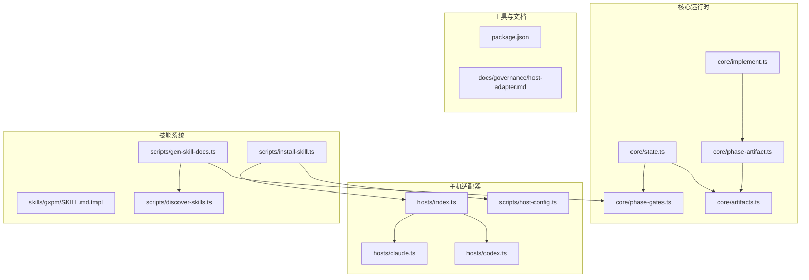
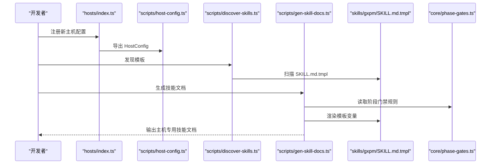
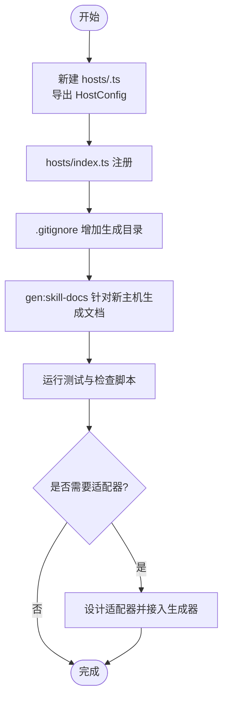
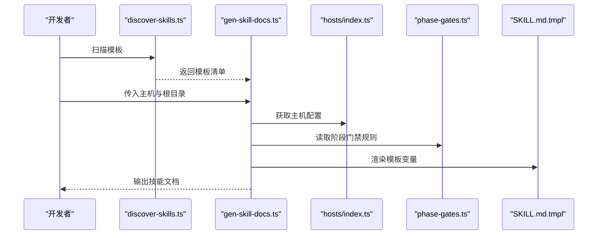
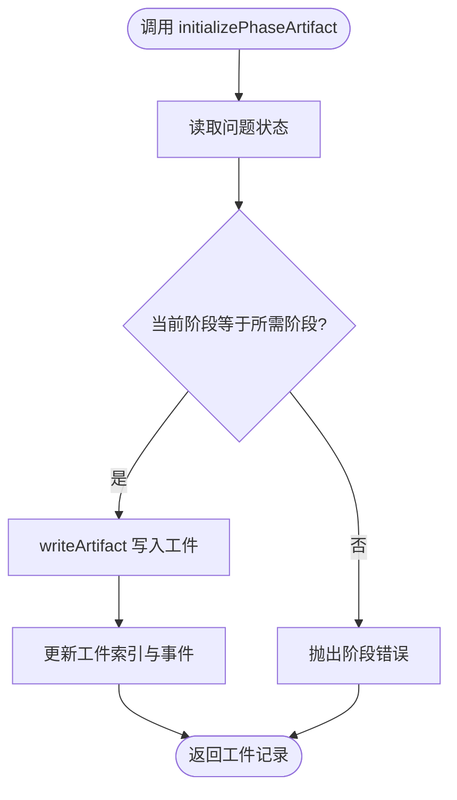
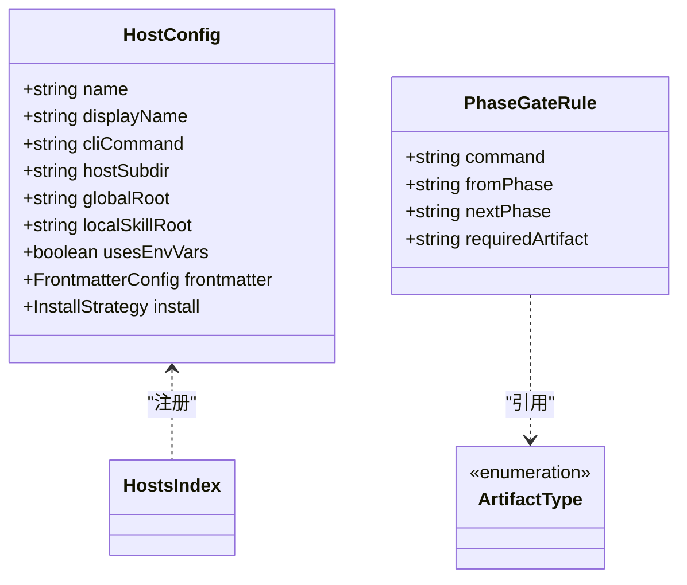
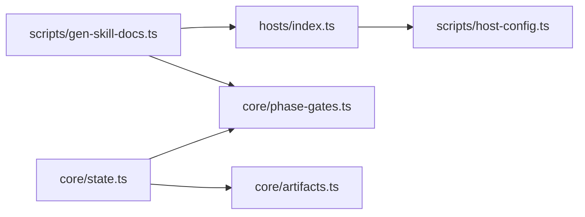

# 扩展开发指南

<cite>
**本文档引用的文件**
- [package.json](file://package.json)
- [hosts/index.ts](file://hosts/index.ts)
- [hosts/claude.ts](file://hosts/claude.ts)
- [hosts/codex.ts](file://hosts/codex.ts)
- [scripts/host-config.ts](file://scripts/host-config.ts)
- [scripts/discover-skills.ts](file://scripts/discover-skills.ts)
- [scripts/gen-skill-docs.ts](file://scripts/gen-skill-docs.ts)
- [scripts/install-skill.ts](file://scripts/install-skill.ts)
- [core/artifacts.ts](file://core/artifacts.ts)
- [core/phase-artifact.ts](file://core/phase-artifact.ts)
- [core/implement.ts](file://core/implement.ts)
- [core/state.ts](file://core/state.ts)
- [core/phase-gates.ts](file://core/phase-gates.ts)
- [docs/governance/host-adapter.md](file://docs/governance/host-adapter.md)
- [skills/gxpm/SKILL.md.tmpl](file://skills/gxpm/SKILL.md.tmpl)
</cite>

## 目录
1. [简介](#简介)
2. [项目结构](#项目结构)
3. [核心组件](#核心组件)
4. [架构总览](#架构总览)
5. [详细组件分析](#详细组件分析)
6. [依赖关系分析](#依赖关系分析)
7. [性能考虑](#性能考虑)
8. [故障排查指南](#故障排查指南)
9. [结论](#结论)
10. [附录](#附录)

## 简介
本指南面向希望为 gxpm 开发扩展的工程师，涵盖以下主题：
- 如何开发新的主机适配器（Host Adapter）
- 如何开发技能扩展（Skill Extension）
- 技能模板系统的设计原理与使用方法
- 自定义 phase artifact initializer 的开发指导
- 插件系统的架构与扩展点
- 最佳实践与设计模式建议
- 性能优化与安全考虑
- 调试与测试扩展功能的方法
- 向后兼容性与版本管理策略

## 项目结构
gxpm 采用模块化分层组织：
- hosts：主机适配器配置与注册
- core：状态机、工件存储、阶段门禁等核心运行时
- scripts：安装、文档生成、发现等工具脚本
- skills：技能模板与生成产物
- test：端到端与单元测试
- docs：治理与架构文档

图表来源
- [hosts/index.ts:1-16](file://hosts/index.ts#L1-L16)
- [hosts/claude.ts:1-18](file://hosts/claude.ts#L1-L18)
- [hosts/codex.ts:1-19](file://hosts/codex.ts#L1-L19)
- [scripts/host-config.ts:1-83](file://scripts/host-config.ts#L1-L83)
- [scripts/discover-skills.ts:1-58](file://scripts/discover-skills.ts#L1-L58)
- [scripts/gen-skill-docs.ts:1-165](file://scripts/gen-skill-docs.ts#L1-L165)
- [scripts/install-skill.ts:1-112](file://scripts/install-skill.ts#L1-L112)
- [core/artifacts.ts:1-169](file://core/artifacts.ts#L1-L169)
- [core/phase-artifact.ts:1-33](file://core/phase-artifact.ts#L1-L33)
- [core/implement.ts:1-16](file://core/implement.ts#L1-L16)
- [core/state.ts:1-303](file://core/state.ts#L1-L303)
- [core/phase-gates.ts:1-118](file://core/phase-gates.ts#L1-L118)
- [skills/gxpm/SKILL.md.tmpl:1-334](file://skills/gxpm/SKILL.md.tmpl#L1-L334)
- [package.json:1-25](file://package.json#L1-L25)
- [docs/governance/host-adapter.md:1-57](file://docs/governance/host-adapter.md#L1-L57)

章节来源
- [package.json:1-25](file://package.json#L1-L25)
- [hosts/index.ts:1-16](file://hosts/index.ts#L1-L16)
- [scripts/discover-skills.ts:1-58](file://scripts/discover-skills.ts#L1-L58)
- [scripts/gen-skill-docs.ts:1-165](file://scripts/gen-skill-docs.ts#L1-L165)
- [scripts/install-skill.ts:1-112](file://scripts/install-skill.ts#L1-L112)
- [core/state.ts:1-303](file://core/state.ts#L1-L303)
- [core/phase-gates.ts:1-118](file://core/phase-gates.ts#L1-L118)
- [core/artifacts.ts:1-169](file://core/artifacts.ts#L1-L169)
- [core/phase-artifact.ts:1-33](file://core/phase-artifact.ts#L1-L33)
- [core/implement.ts:1-16](file://core/implement.ts#L1-L16)
- [skills/gxpm/SKILL.md.tmpl:1-334](file://skills/gxpm/SKILL.md.tmpl#L1-L334)
- [docs/governance/host-adapter.md:1-57](file://docs/governance/host-adapter.md#L1-L57)

## 核心组件
- 主机适配器（Host Adapter）：通过配置描述主机行为，包括命令、路径、环境变量、前端元数据处理策略与安装策略。
- 技能模板系统：以模板文件为输入，结合主机配置与阶段门禁规则，生成各主机可用的技能文档。
- 工件系统（Artifacts）：统一的工件类型、读写与索引机制，支撑阶段门禁与审计。
- 阶段门禁（Phase Gates）：定义阶段间迁移所需的“必需工件”，并提供阻塞/放行逻辑。
- 状态机（State）：维护问题状态、阶段历史、事件流与阶段迁移。
- 扩展初始化器（Phase Artifact Initializer）：在指定阶段按约定初始化特定工件。

章节来源
- [scripts/host-config.ts:11-23](file://scripts/host-config.ts#L11-L23)
- [scripts/gen-skill-docs.ts:17-26](file://scripts/gen-skill-docs.ts#L17-L26)
- [core/artifacts.ts:10-41](file://core/artifacts.ts#L10-L41)
- [core/phase-gates.ts:25-30](file://core/phase-gates.ts#L25-L30)
- [core/state.ts:28-57](file://core/state.ts#L28-L57)
- [core/phase-artifact.ts:9-14](file://core/phase-artifact.ts#L9-L14)

## 架构总览
下图展示从“主机适配器配置”到“技能文档生成”的端到端流程，以及“阶段门禁”对“工件”的约束关系。

图表来源
- [hosts/index.ts:1-16](file://hosts/index.ts#L1-L16)
- [scripts/host-config.ts:11-23](file://scripts/host-config.ts#L11-L23)
- [scripts/discover-skills.ts:23-53](file://scripts/discover-skills.ts#L23-L53)
- [scripts/gen-skill-docs.ts:17-26](file://scripts/gen-skill-docs.ts#L17-L26)
- [skills/gxpm/SKILL.md.tmpl:1-334](file://skills/gxpm/SKILL.md.tmpl#L1-L334)
- [core/phase-gates.ts:32-99](file://core/phase-gates.ts#L32-L99)

## 详细组件分析

### 主机适配器开发指南
- 目标：为新主机新增适配器，使其可被安装与文档生成系统识别。
- 关键步骤
  1) 新建主机配置文件，导出 HostConfig，并在 hosts/index.ts 中注册。
  2) 在 .gitignore 中增加该主机的生成目录，避免误提交。
  3) 使用文档生成脚本针对新主机生成技能文档。
  4) 运行测试与检查脚本，确保新增适配器符合规范。
- 设计原则
  - 配置驱动：所有路径、前端元数据处理策略、工具重写与抑制段落均来自配置。
  - 无散落分支：生成器不应包含分散的主机分支判断；复杂差异通过适配器抽象。
  - 隔离性：避免主机输出泄漏到其他主机路径（如 Codex 输出不应残留 Claude 路径）。
  - 可测试性：新增主机后，参数化测试应自动覆盖；若无法覆盖，先补齐测试基础设施。
- 配置校验
  - validateAllConfigs() 检查主机名格式、CLI 命令格式、路径安全性、前端元数据模式合法性、名称与关键字段不重复。

图表来源
- [hosts/index.ts:1-16](file://hosts/index.ts#L1-L16)
- [hosts/claude.ts:1-18](file://hosts/claude.ts#L1-L18)
- [hosts/codex.ts:1-19](file://hosts/codex.ts#L1-L19)
- [scripts/host-config.ts:29-82](file://scripts/host-config.ts#L29-L82)
- [docs/governance/host-adapter.md:18-26](file://docs/governance/host-adapter.md#L18-L26)

章节来源
- [hosts/index.ts:1-16](file://hosts/index.ts#L1-L16)
- [hosts/claude.ts:1-18](file://hosts/claude.ts#L1-L18)
- [hosts/codex.ts:1-19](file://hosts/codex.ts#L1-L19)
- [scripts/host-config.ts:29-82](file://scripts/host-config.ts#L29-L82)
- [docs/governance/host-adapter.md:18-26](file://docs/governance/host-adapter.md#L18-L26)

### 技能模板系统设计与使用
- 设计原理
  - 模板驱动：以 SKILL.md.tmpl 为单一真相源，结合主机配置与阶段门禁规则渲染。
  - 参数化：通过模板变量注入“前置说明”“工件读取命令”“阶段门禁命令”“阶段迁移摘要”等。
  - 一致性：同一模板在不同主机上生成一致的结构与约束，仅在路径与前端元数据处理策略上差异化。
- 使用方法
  - 发现模板：扫描仓库中所有 SKILL.md.tmpl 文件，生成输出映射。
  - 渲染：根据主机配置构建模板变量，插入“自动生成标记”。
  - 生成：写入目标路径，或在干跑模式下检测过期文档。
- 与阶段门禁的关系
  - 生成内容包含阶段迁移摘要与每步门禁命令，确保用户在阶段迁移前完成必要的工件初始化。

图表来源
- [scripts/discover-skills.ts:23-53](file://scripts/discover-skills.ts#L23-L53)
- [scripts/gen-skill-docs.ts:17-26](file://scripts/gen-skill-docs.ts#L17-L26)
- [scripts/gen-skill-docs.ts:104-133](file://scripts/gen-skill-docs.ts#L104-L133)
- [hosts/index.ts:1-16](file://hosts/index.ts#L1-L16)
- [core/phase-gates.ts:32-99](file://core/phase-gates.ts#L32-L99)
- [skills/gxpm/SKILL.md.tmpl:1-334](file://skills/gxpm/SKILL.md.tmpl#L1-L334)

章节来源
- [scripts/discover-skills.ts:1-58](file://scripts/discover-skills.ts#L1-L58)
- [scripts/gen-skill-docs.ts:1-165](file://scripts/gen-skill-docs.ts#L1-L165)
- [core/phase-gates.ts:1-118](file://core/phase-gates.ts#L1-L118)
- [skills/gxpm/SKILL.md.tmpl:1-334](file://skills/gxpm/SKILL.md.tmpl#L1-L334)

### 自定义 Phase Artifact Initializer 开发指导
- 目标：在指定阶段按约定初始化特定工件，确保阶段迁移前具备必需证据。
- 设计要点
  - 初始化器工厂：createPhaseArtifactInitializer(config) 返回一个函数，接收 issue 输入并执行初始化。
  - 阶段校验：初始化器会读取当前阶段，若不在要求阶段则抛出错误。
  - 工件写入：调用 writeArtifact 写入预设 payload，并更新索引与事件流。
- 典型用法
  - 在实现阶段初始化本地验证工件，确保后续阶段迁移前具备证据。
- 扩展建议
  - 为新阶段定义新的初始化器，复用现有工厂函数，保持一致的错误与日志行为。

图表来源
- [core/phase-artifact.ts:16-32](file://core/phase-artifact.ts#L16-L32)
- [core/artifacts.ts:57-91](file://core/artifacts.ts#L57-L91)
- [core/state.ts:139-148](file://core/state.ts#L139-L148)

章节来源
- [core/phase-artifact.ts:1-33](file://core/phase-artifact.ts#L1-L33)
- [core/implement.ts:1-16](file://core/implement.ts#L1-L16)
- [core/artifacts.ts:1-169](file://core/artifacts.ts#L1-L169)
- [core/state.ts:1-303](file://core/state.ts#L1-L303)

### 插件系统架构与扩展点
- 架构要点
  - 配置即插件：主机适配器通过 HostConfig 配置化，无需修改生成器内部分支。
  - 文档生成即插件：discover-skills 与 gen-skill-docs 作为通用扩展点，支持任意数量的模板与主机。
  - 工件即契约：artifacts 提供统一的数据契约，所有阶段门禁与审计基于此。
  - 阶段即约束：phase-gates 将阶段迁移与工件需求绑定，形成不可逆的门禁链。
- 扩展点
  - 新主机：hosts/<name>.ts + hosts/index.ts 注册 + .gitignore 更新
  - 新模板：在任意目录放置 SKILL.md.tmpl，discover 会自动发现
  - 新阶段工件：通过 createPhaseArtifactInitializer 定义初始化器
  - 新门禁规则：在 phase-gates 中追加规则，影响迁移与审计

图表来源
- [scripts/host-config.ts:11-23](file://scripts/host-config.ts#L11-L23)
- [hosts/index.ts:1-16](file://hosts/index.ts#L1-L16)
- [core/phase-gates.ts:25-30](file://core/phase-gates.ts#L25-L30)
- [core/artifacts.ts:10-26](file://core/artifacts.ts#L10-L26)

章节来源
- [scripts/host-config.ts:1-83](file://scripts/host-config.ts#L1-L83)
- [hosts/index.ts:1-16](file://hosts/index.ts#L1-L16)
- [core/phase-gates.ts:1-118](file://core/phase-gates.ts#L1-L118)
- [core/artifacts.ts:1-169](file://core/artifacts.ts#L1-L169)

### 最佳实践与设计模式
- 配置优先：所有主机差异通过 HostConfig 驱动，避免在生成器中散落分支。
- 单一真相源：模板文件为技能文档的唯一来源，生成器只负责渲染。
- 一致性约束：阶段门禁与工件类型统一，保证跨主机一致性。
- 可测试性：新增主机需通过 validateAllConfigs 与测试套件，确保配置与行为正确。
- 可演进性：阶段门禁与工件类型扩展遵循向后兼容策略，避免破坏既有流程。

章节来源
- [scripts/host-config.ts:29-82](file://scripts/host-config.ts#L29-L82)
- [docs/governance/host-adapter.md:41-47](file://docs/governance/host-adapter.md#L41-L47)
- [core/phase-gates.ts:107-117](file://core/phase-gates.ts#L107-L117)
- [core/artifacts.ts:163-168](file://core/artifacts.ts#L163-L168)

## 依赖关系分析
- 组件耦合
  - hosts/index.ts 与 hosts/<name>.ts 强耦合，但与生成器弱耦合，体现“配置即插件”的思想。
  - scripts/gen-skill-docs.ts 依赖 hosts/index.ts 与 core/phase-gates.ts，形成“主机配置 + 阶段规则”的渲染依赖。
  - core/state.ts 依赖 core/phase-gates.ts 与 core/artifacts.ts，形成“状态 + 门禁 + 工件”的闭环。
- 外部依赖
  - Bun 运行时与 Node 生态（fs、path、os），用于文件系统操作与路径解析。
- 循环依赖
  - 未见循环导入；各模块职责清晰，接口边界明确。

图表来源
- [hosts/index.ts:1-16](file://hosts/index.ts#L1-L16)
- [scripts/gen-skill-docs.ts:1-165](file://scripts/gen-skill-docs.ts#L1-L165)
- [core/phase-gates.ts:1-118](file://core/phase-gates.ts#L1-L118)
- [core/state.ts:1-303](file://core/state.ts#L1-L303)
- [core/artifacts.ts:1-169](file://core/artifacts.ts#L1-L169)

章节来源
- [hosts/index.ts:1-16](file://hosts/index.ts#L1-L16)
- [scripts/gen-skill-docs.ts:1-165](file://scripts/gen-skill-docs.ts#L1-L165)
- [core/state.ts:1-303](file://core/state.ts#L1-L303)
- [core/phase-gates.ts:1-118](file://core/phase-gates.ts#L1-L118)
- [core/artifacts.ts:1-169](file://core/artifacts.ts#L1-L169)

## 性能考虑
- I/O 优化
  - 批量写入：工件写入与索引更新合并为一次写入，减少磁盘往返。
  - 增量更新：upsertRecord 仅替换同类型工件，避免全量重建索引。
- 计算优化
  - 阶段门禁查询：PHASE_GATE_RULES 为常量数组，查找复杂度 O(n)，n 为阶段数（较小）。
  - 路径解析：使用相对路径与缓存常见路径，减少字符串拼接与正则匹配。
- 内存与并发
  - 模板渲染为纯函数式操作，适合在单线程环境中顺序执行。
  - 若扩展多模板并行生成，注意文件系统锁与竞争条件，建议串行或加锁。

## 故障排查指南
- 主机配置错误
  - 症状：gen:skill-docs 或安装脚本报错。
  - 排查：使用 validateAllConfigs 检查主机名、CLI 命令、路径安全性、前端元数据模式与重复项。
- 阶段迁移失败
  - 症状：transition 抛出“缺少必需工件”错误。
  - 排查：确认 requiredArtifact 是否存在；使用 gxpm artifact list 检查工件；执行门禁命令初始化工件。
- 工件读写异常
  - 症状：readArtifact 抛出“未找到工件”。
  - 排查：确认工件类型有效；检查 issue 目录结构；核对 artifacts 索引是否存在。
- 安装与文档生成
  - 症状：install-skill 未生成预期文件。
  - 排查：确认主机名与 frontmatter 策略；检查模板中的 frontmatter 是否被过滤；确认输出路径权限。

章节来源
- [scripts/host-config.ts:29-82](file://scripts/host-config.ts#L29-L82)
- [core/state.ts:253-302](file://core/state.ts#L253-L302)
- [core/artifacts.ts:93-104](file://core/artifacts.ts#L93-L104)
- [scripts/install-skill.ts:47-71](file://scripts/install-skill.ts#L47-L71)

## 结论
gxpm 通过“配置驱动的主机适配器”“模板驱动的技能系统”“阶段门禁约束的工件契约”三大支柱，实现了可扩展、可测试、可演进的第二代项目管理运行时。开发者可通过标准化的扩展点快速接入新主机、新模板与新阶段工件，同时借助统一的工件与门禁体系保障流程一致性与可审计性。

## 附录

### 版本与兼容性策略
- 向后兼容
  - 阶段门禁与工件类型扩展遵循“新增不破坏既有规则”的原则，避免强制迁移。
  - 工件类型枚举与索引结构保持稳定，确保历史数据可读。
- 版本管理
  - 使用包管理器进行版本控制，变更发布遵循语义化版本。
  - 文档生成脚本提供“干跑”能力，便于在 CI 中检测过期文档并触发更新。

章节来源
- [package.json:1-25](file://package.json#L1-L25)
- [scripts/gen-skill-docs.ts:38-56](file://scripts/gen-skill-docs.ts#L38-L56)