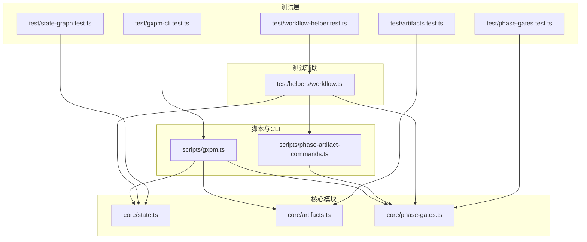
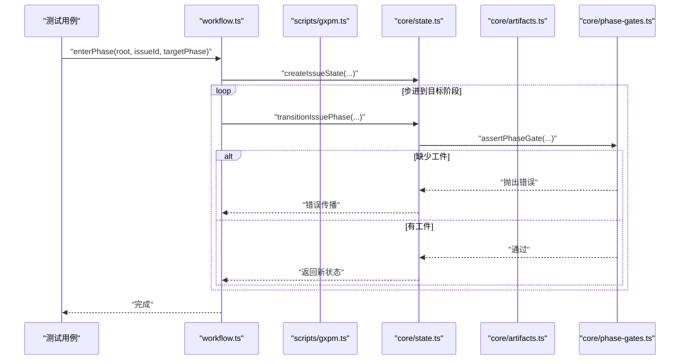
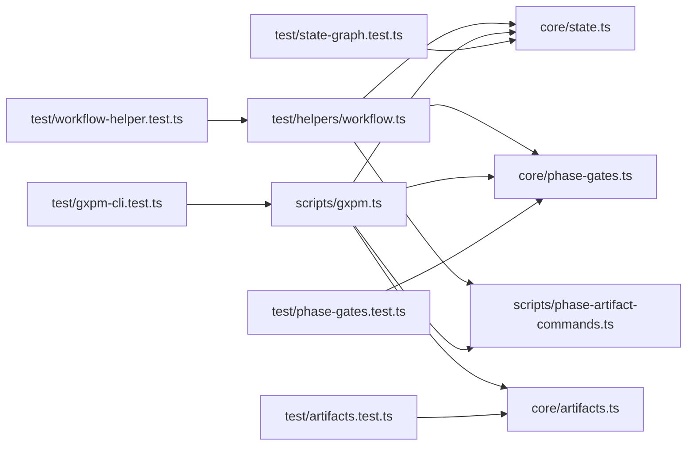

# 测试策略和实践

<cite>
**本文引用的文件**
- [test/helpers/workflow.ts](file://test/helpers/workflow.ts)
- [test/workflow-helper.test.ts](file://test/workflow-helper.test.ts)
- [test/artifacts.test.ts](file://test/artifacts.test.ts)
- [test/gxpm-cli.test.ts](file://test/gxpm-cli.test.ts)
- [test/state-graph.test.ts](file://test/state-graph.test.ts)
- [test/phase-gates.test.ts](file://test/phase-gates.test.ts)
- [core/phase-gates.ts](file://core/phase-gates.ts)
- [core/state.ts](file://core/state.ts)
- [core/artifacts.ts](file://core/artifacts.ts)
- [scripts/phase-artifact-commands.ts](file://scripts/phase-artifact-commands.ts)
- [scripts/gxpm.ts](file://scripts/gxpm.ts)
- [package.json](file://package.json)
</cite>

## 目录
1. [引言](#引言)
2. [项目结构](#项目结构)
3. [核心组件](#核心组件)
4. [架构总览](#架构总览)
5. [详细组件分析](#详细组件分析)
6. [依赖关系分析](#依赖关系分析)
7. [性能考量](#性能考量)
8. [故障排查指南](#故障排查指南)
9. [结论](#结论)
10. [附录](#附录)

## 引言
本文件为 gxpm 项目制定系统化的测试策略与实践指南，围绕测试金字塔（单元测试、集成测试、端到端测试）展开，结合项目实际代码组织与 CLI 行为，给出可操作的测试编写方法、断言模式、覆盖率与质量标准、调试技巧与性能优化建议，并重点解析测试辅助工具 test/helpers/workflow.ts 的使用方式与最佳实践。

## 项目结构
- 测试目录 test/ 下包含大量以 .test.ts 结尾的测试文件，覆盖核心状态机、工件存储、阶段门禁、CLI 命令等模块。
- 核心业务逻辑集中在 core/ 与 scripts/ 目录：
  - core/state.ts：问题状态管理、阶段转换、事件记录、图谱维护。
  - core/artifacts.ts：工件写入、读取、索引与校验。
  - core/phase-gates.ts：阶段门禁规则与命令提示。
  - scripts/phase-artifact-commands.ts：根据门禁规则映射到具体初始化命令。
  - scripts/gxpm.ts：CLI 主入口，解析参数并调用核心模块。
- 测试辅助工具 test/helpers/workflow.ts 提供运行 CLI、驱动工作流、进入指定阶段等能力，统一测试环境准备与清理。

图表来源
- [test/workflow-helper.test.ts:1-36](file://test/workflow-helper.test.ts#L1-L36)
- [test/artifacts.test.ts:1-65](file://test/artifacts.test.ts#L1-L65)
- [test/state-graph.test.ts:1-78](file://test/state-graph.test.ts#L1-L78)
- [test/phase-gates.test.ts:1-118](file://test/phase-gates.test.ts#L1-L118)
- [test/gxpm-cli.test.ts:1-321](file://test/gxpm-cli.test.ts#L1-L321)
- [test/helpers/workflow.ts:1-98](file://test/helpers/workflow.ts#L1-L98)
- [core/state.ts:1-303](file://core/state.ts#L1-L303)
- [core/artifacts.ts:1-169](file://core/artifacts.ts#L1-L169)
- [core/phase-gates.ts:1-118](file://core/phase-gates.ts#L1-L118)
- [scripts/phase-artifact-commands.ts:1-84](file://scripts/phase-artifact-commands.ts#L1-L84)
- [scripts/gxpm.ts:1-200](file://scripts/gxpm.ts#L1-L200)

章节来源
- [package.json:1-25](file://package.json#L1-L25)

## 核心组件
- 工作流辅助工具 workflow.ts
  - 提供 runCli/runScript/runCliWithInput 等执行器，封装 CLI 调用与输出处理。
  - 提供 enterPhase/enterPhaseCli 驱动核心状态或通过 CLI 进入目标阶段，确保测试前置条件一致。
  - 基于 PHASE_GATE_RULES 与 PHASE_ARTIFACT_COMMANDS 推导 CLI 命令与初始化步骤，保证与门禁规则对齐。
- 状态机与事件
  - createIssueState/readIssueState/transitionIssuePhase 维护问题状态、阶段历史与事件日志。
  - assertPhaseGate 校验阶段转换所需的工件是否存在，缺失时记录 gate.blocked 并抛出错误。
- 工件存储
  - writeArtifact/readArtifact/listArtifacts/hasArtifact 提供工件的写入、读取、索引与存在性检查。
  - 写入时更新索引与事件，保证一致性与可观测性。
- 阶段门禁规则
  - PHASE_GATE_RULES 定义每个阶段转换所需的工件类型与命令提示。
  - getRequiredArtifactForTransition/getGateCommand 提供查询接口。
- CLI 入口
  - scripts/gxpm.ts 解析命令并调用核心模块，支持 issue/status/history/transition/artifact 等子命令。

章节来源
- [test/helpers/workflow.ts:1-98](file://test/helpers/workflow.ts#L1-L98)
- [core/state.ts:1-303](file://core/state.ts#L1-L303)
- [core/artifacts.ts:1-169](file://core/artifacts.ts#L1-L169)
- [core/phase-gates.ts:1-118](file://core/phase-gates.ts#L1-L118)
- [scripts/phase-artifact-commands.ts:1-84](file://scripts/phase-artifact-commands.ts#L1-L84)
- [scripts/gxpm.ts:1-200](file://scripts/gxpm.ts#L1-L200)

## 架构总览
测试金字塔在本项目中的体现：
- 单元测试：针对核心函数与纯逻辑（如工件类型校验、阶段转换断言、门禁规则解析）进行最小粒度验证。
- 集成测试：组合核心模块与 CLI，验证从命令到状态变更、事件记录、工件索引的一致性。
- 端到端测试：通过 workflow.ts 辅助工具，驱动完整工作流，覆盖真实场景下的 CLI 交互与文件系统状态。

图表来源
- [test/helpers/workflow.ts:37-76](file://test/helpers/workflow.ts#L37-L76)
- [core/state.ts:150-302](file://core/state.ts#L150-L302)
- [core/phase-gates.ts:252-302](file://core/phase-gates.ts#L252-L302)
- [scripts/gxpm.ts:1-200](file://scripts/gxpm.ts#L1-L200)

## 详细组件分析

### 测试辅助工具 workflow.ts 使用指南
- 执行器
  - runCli/runScript：以 Bun.spawnsync 同步执行 CLI 或脚本，捕获 stdout/stderr 与退出码。
  - runCliWithInput：支持通过 stdin 注入输入，适用于需要交互的命令。
- 工作流驱动
  - enterPhase：直接调用核心状态函数，按门禁顺序初始化工件并推进阶段。
  - enterPhaseCli：通过 CLI 子命令驱动，适合验证 CLI 与核心逻辑一致性。
- 规则对齐
  - WORKFLOW_STEPS/CLI_WORKFLOW_STEPS 基于 PHASE_GATE_RULES 推导，确保测试步骤与门禁命令一致。
  - WORKFLOW_HELPER_PHASES/WORKFLOW_HELPER_CLI_COMMANDS 暴露派生结果，便于断言与复用。
- 最佳实践
  - 在每个测试用例前使用临时目录 mkdtempSync，结束后由测试框架自动清理。
  - 对 CLI 失败场景，使用断言 exitCode 与输出内容，避免仅依赖成功路径。
  - 对需要交互的命令，使用 runCliWithInput 注入标准输入，确保可重复性。

章节来源
- [test/helpers/workflow.ts:1-98](file://test/helpers/workflow.ts#L1-L98)
- [test/workflow-helper.test.ts:1-36](file://test/workflow-helper.test.ts#L1-L36)

### 单元测试：工件存储与状态机
- 工件存储
  - 断言写入后文件存在、索引更新、事件记录；拒绝未知类型；读取一致性。
- 状态机
  - 断言初始状态、阶段历史、事件序列；拒绝非法跳转与重复创建；验证事件类型与载荷。

章节来源
- [test/artifacts.test.ts:1-65](file://test/artifacts.test.ts#L1-L65)
- [test/state-graph.test.ts:1-78](file://test/state-graph.test.ts#L1-L78)

### 单元测试：阶段门禁规则
- 断言门禁规则顺序与完整性；区分门禁所需与非门禁工件；解析转换所需工件与命令提示。
- 验证 CLI 与门禁命令提示保持一致，防止命令与规则脱节。

章节来源
- [test/phase-gates.test.ts:1-118](file://test/phase-gates.test.ts#L1-L118)

### 集成测试：CLI 行为与状态联动
- 命令链路：issue create/status/transition/history/next/artifact write/read/edit/checkpoint/resume。
- 断言输出文本与 JSON 结果；校验事件日志中包含 artifact.written、phase.transitioned、gate.passed 等。
- 输入校验：拒绝无效工件类型、非法 JSON、缺少必要参数；交互式编辑器行为与错误回滚。

章节来源
- [test/gxpm-cli.test.ts:1-321](file://test/gxpm-cli.test.ts#L1-L321)

### 端到端测试：工作流驱动
- 使用 workflow.ts 驱动完整工作流，从 issue create 到 land，覆盖所有阶段门禁与工件生成。
- 验证 CLI 与核心状态机在真实文件系统中的协同行为，确保命令提示与规则一致。

章节来源
- [test/workflow-helper.test.ts:1-36](file://test/workflow-helper.test.ts#L1-L36)
- [test/gxpm-cli.test.ts:115-148](file://test/gxpm-cli.test.ts#L115-L148)

## 依赖关系分析
- workflow.ts 依赖 core/state.ts 与 core/phase-gates.ts，以及 scripts/phase-artifact-commands.ts，用于推导工作流步骤与 CLI 命令。
- CLI 入口 scripts/gxpm.ts 依赖 core/state.ts、core/artifacts.ts、core/phase-gates.ts 与 scripts/phase-artifact-commands.ts，形成完整的命令到状态变更链路。
- 测试用例通过 workflow.ts 间接验证上述依赖关系的正确性与一致性。

图表来源
- [test/helpers/workflow.ts:1-98](file://test/helpers/workflow.ts#L1-L98)
- [core/state.ts:1-303](file://core/state.ts#L1-L303)
- [core/phase-gates.ts:1-118](file://core/phase-gates.ts#L1-L118)
- [scripts/phase-artifact-commands.ts:1-84](file://scripts/phase-artifact-commands.ts#L1-L84)
- [scripts/gxpm.ts:1-200](file://scripts/gxpm.ts#L1-L200)
- [test/workflow-helper.test.ts:1-36](file://test/workflow-helper.test.ts#L1-L36)
- [test/artifacts.test.ts:1-65](file://test/artifacts.test.ts#L1-L65)
- [test/state-graph.test.ts:1-78](file://test/state-graph.test.ts#L1-L78)
- [test/phase-gates.test.ts:1-118](file://test/phase-gates.test.ts#L1-L118)
- [test/gxpm-cli.test.ts:1-321](file://test/gxpm-cli.test.ts#L1-L321)

## 性能考量
- 测试执行速度
  - 尽量使用内存态或最小化文件系统操作；对 CLI 测试优先使用 runCliWithInput 注入输入，减少外部交互。
  - 使用临时目录 mkdtempSync，避免跨用例共享状态导致的串扰与重置成本。
- 并发与隔离
  - 测试之间尽量无状态依赖；对涉及文件系统的测试，确保每个用例在独立目录下运行。
- 覆盖率与质量
  - 优先补齐单元测试对核心函数的覆盖（如 assertValidArtifactType/assertValidPhase/assertPhaseGate）。
  - 对 CLI 的分支路径进行穷举：成功、失败、边界条件、交互式编辑器异常等。

## 故障排查指南
- CLI 返回非零退出码
  - 使用断言 exitCode 与 output(result) 输出定位错误原因；常见包括非法阶段转换、缺少工件、无效参数等。
- 文件系统状态不一致
  - 检查 state.json/graph.json/artifacts/index.json 是否存在且内容正确；核对 events.jsonl 中事件类型与时间戳。
- 交互式编辑器失败
  - 确认 EDITOR 环境变量与脚本返回值；对非法 JSON 的保存应被拒绝并保留原文件。
- 工作流驱动失败
  - 使用 workflow.ts 的 enterPhase/enterPhaseCli 明确目标阶段；若报错“Unsupported target phase”，检查 PHASE_GATE_RULES 与目标阶段是否匹配。

章节来源
- [test/gxpm-cli.test.ts:32-42](file://test/gxpm-cli.test.ts#L32-L42)
- [test/gxpm-cli.test.ts:216-278](file://test/gxpm-cli.test.ts#L216-L278)
- [test/helpers/workflow.ts:71-76](file://test/helpers/workflow.ts#L71-L76)

## 结论
本测试策略以测试金字塔为核心，结合 workflow.ts 辅助工具与 CLI 行为，构建了从单元到端到端的完整测试体系。通过严格的断言模式、一致的测试数据管理与模拟策略，确保状态机、工件存储、阶段门禁与 CLI 的正确性与稳定性。建议持续完善覆盖率与质量标准，强化边界与异常场景测试，提升整体可靠性。

## 附录

### 测试金字塔与各层级职责
- 单元测试
  - 职责：验证核心函数与纯逻辑，如类型校验、断言、规则解析。
  - 示例：工件类型断言、阶段转换断言、门禁规则断言。
- 集成测试
  - 职责：验证模块间协作与命令链路，如 CLI 与核心模块的联动。
  - 示例：issue history、artifact write/read、checkpoint/resume。
- 端到端测试
  - 职责：验证完整工作流与用户场景，如从 triage 到 land 的全流程。
  - 示例：workflow.ts 驱动的工作流测试。

章节来源
- [test/artifacts.test.ts:1-65](file://test/artifacts.test.ts#L1-L65)
- [test/state-graph.test.ts:1-78](file://test/state-graph.test.ts#L1-L78)
- [test/phase-gates.test.ts:1-118](file://test/phase-gates.test.ts#L1-L118)
- [test/gxpm-cli.test.ts:1-321](file://test/gxpm-cli.test.ts#L1-L321)
- [test/workflow-helper.test.ts:1-36](file://test/workflow-helper.test.ts#L1-L36)

### 测试用例设计最佳实践与断言模式
- 断言模式
  - 成功路径：断言 exitCode 为 0 与输出包含预期关键词；对 JSON 输出使用 JSON.parse 后断言字段。
  - 失败路径：断言 exitCode 非零与错误信息包含特定关键字；对交互式编辑器断言错误回滚。
  - 文件系统：断言文件存在、索引更新、事件日志类型与顺序。
- 数据管理
  - 使用临时目录 mkdtempSync，每个用例独立运行；用例结束后由测试框架清理。
  - 对需要输入的命令使用 runCliWithInput 注入 stdin，确保可重复性。
- 模拟策略
  - 对外部依赖（如编辑器）通过环境变量与自定义脚本模拟；对 CLI 失败场景构造错误输入与异常返回。
  - 对核心模块的断言优先使用纯函数与最小依赖，减少外部副作用。

章节来源
- [test/gxpm-cli.test.ts:1-321](file://test/gxpm-cli.test.ts#L1-L321)
- [test/helpers/workflow.ts:1-98](file://test/helpers/workflow.ts#L1-L98)

### 覆盖率要求与质量标准
- 覆盖率要求
  - 核心模块（core/state.ts、core/artifacts.ts、core/phase-gates.ts）行覆盖率不低于 90%，分支覆盖率不低于 80%。
  - CLI 模块（scripts/gxpm.ts）关键分支与错误路径覆盖率不低于 95%。
- 质量标准
  - 所有失败用例必须包含明确的错误信息断言与上下文输出。
  - 对交互式命令（如编辑器）需覆盖成功、失败与异常三种场景。
  - 对工作流驱动测试，需覆盖从 triage 到 land 的完整路径与关键边界条件。

章节来源
- [package.json:13-16](file://package.json#L13-L16)