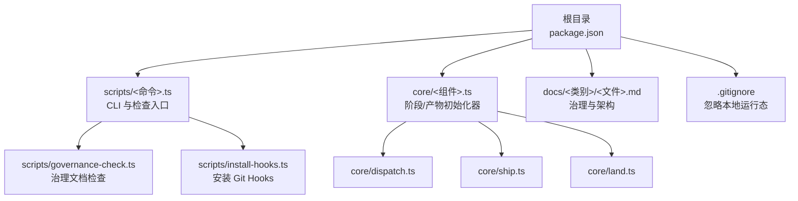
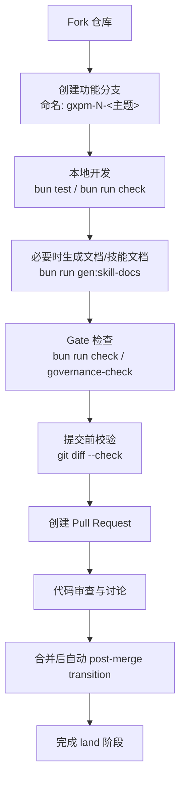
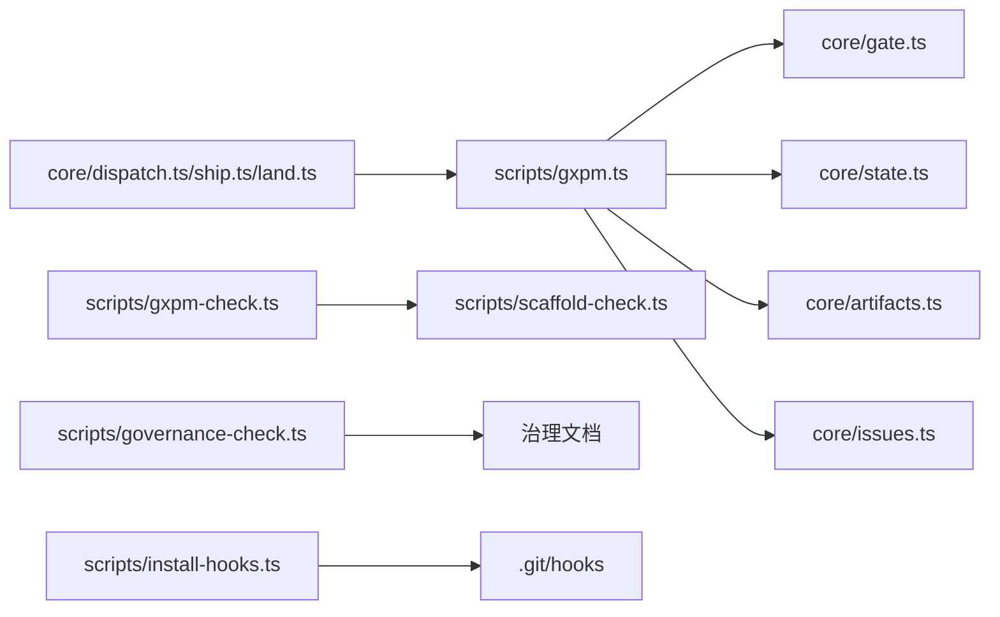

# 贡献指南

<cite>
**本文引用的文件**
- [package.json](file://package.json)
- [AGENTS.md](file://AGENTS.md)
- [CLAUDE.md](file://CLAUDE.md)
- [docs/governance/development-contract.md](file://docs/governance/development-contract.md)
- [docs/architecture/gxpm-v0-contract.md](file://docs/architecture/gxpm-v0-contract.md)
- [docs/governance/host-adapter.md](file://docs/governance/host-adapter.md)
- [scripts/governance-check.ts](file://scripts/governance-check.ts)
- [scripts/install-hooks.ts](file://scripts/install-hooks.ts)
- [.gitignore](file://.gitignore)
- [scripts/gxpm.ts](file://scripts/gxpm.ts)
- [scripts/gxpm-check.ts](file://scripts/gxpm-check.ts)
- [core/dispatch.ts](file://core/dispatch.ts)
- [core/ship.ts](file://core/ship.ts)
- [core/land.ts](file://core/land.ts)
</cite>

## 目录
1. [简介](#简介)
2. [项目结构](#项目结构)
3. [核心组件](#核心组件)
4. [架构总览](#架构总览)
5. [详细组件分析](#详细组件分析)
6. [依赖分析](#依赖分析)
7. [性能考虑](#性能考虑)
8. [故障排查指南](#故障排查指南)
9. [结论](#结论)
10. [附录](#附录)

## 简介
本贡献指南面向希望参与 gxpm 项目的开发者，系统阐述代码贡献流程、分支策略、Pull Request 要求、开发契约与失败归因协议、代码审查检查清单与质量标准、提交信息格式与变更日志要求、社区行为准则与沟通规范、治理流程与决策机制，以及新贡献者的入门指导与资源链接。所有规则均以仓库内治理与架构文档为依据，确保贡献过程可追溯、可验证、可回归。

## 项目结构
- 根目录提供二进制入口与包脚本，核心运行逻辑集中在 scripts/ 与 core/，治理与架构文档位于 docs/，测试覆盖各模块。
- 关键治理文件：
  - AGENTS.md：Agent 合同与执行边界
  - CLAUDE.md：Claude 启动层薄文档
  - docs/governance/development-contract.md：开发契约与命令分层
  - docs/architecture/gxpm-v0-contract.md：V0 合同与阶段/产物/真值边界
  - docs/governance/host-adapter.md：Host 适配治理与新增流程
- 质量保障：
  - scripts/governance-check.ts：治理文档完整性检查
  - scripts/install-hooks.ts：安装 Git Hooks 并设置 hooksPath
  - .gitignore：忽略本地运行态目录（.gxpm、.agents、.claude、.codex 等）

**图示来源**
- [package.json:1-25](file://package.json#L1-L25)
- [scripts/governance-check.ts:1-70](file://scripts/governance-check.ts#L1-L70)
- [scripts/install-hooks.ts:1-106](file://scripts/install-hooks.ts#L1-L106)
- [.gitignore:1-17](file://.gitignore#L1-L17)
- [core/dispatch.ts:1-17](file://core/dispatch.ts#L1-L17)
- [core/ship.ts:1-17](file://core/ship.ts#L1-L17)
- [core/land.ts:1-16](file://core/land.ts#L1-L16)

**章节来源**
- [package.json:1-25](file://package.json#L1-L25)
- [.gitignore:1-17](file://.gitignore#L1-L17)

## 核心组件
- CLI 与检查入口：scripts/gxpm.ts 提供 issue/artifact/gate/worktree/config/doctor/version 等子命令，以及 scaffold 检查入口 scripts/gxpm-check.ts。
- 阶段产物初始化器：core/dispatch.ts、core/ship.ts、core/land.ts 使用 createPhaseArtifactInitializer 统一创建阶段产物草稿，约束 requiredPhase、artifactType、label 与 payload 字段。
- 治理与质量：scripts/governance-check.ts 校验治理文档齐全与边界标题存在；scripts/install-hooks.ts 安装并启用 .githooks，设置 core.hooksPath。

**章节来源**
- [scripts/gxpm.ts:1-699](file://scripts/gxpm.ts#L1-L699)
- [scripts/gxpm-check.ts:1-13](file://scripts/gxpm-check.ts#L1-L13)
- [core/dispatch.ts:1-17](file://core/dispatch.ts#L1-L17)
- [core/ship.ts:1-17](file://core/ship.ts#L1-L17)
- [core/land.ts:1-16](file://core/land.ts#L1-L16)
- [scripts/governance-check.ts:1-70](file://scripts/governance-check.ts#L1-L70)
- [scripts/install-hooks.ts:1-106](file://scripts/install-hooks.ts#L1-L106)

## 架构总览
下图展示贡献生命周期中的关键步骤：从 fork 与分支命名，到本地开发、Gate 检查、生成物刷新、提交与 PR，再到 CI/PR 审查与合并。

[此图为概念性流程示意，无需图示来源]

## 详细组件分析

### 代码贡献流程
- Fork 与分支策略
  - 使用功能分支命名 gxpm-N-<主题>，以触发 git hook gate。
  - 分支粒度：每个 PR 仅表达一个逻辑变化；模板改动与生成物刷新可在同一提交，但不混入无关重构。
- 本地开发与 Gate
  - 提交前至少运行 bun test、bun run check、git diff --check。
  - 使用 gxpm 自托管工作流：先确保有处于 dispatch/implement 之间的 GXPM-N issue，再按阶段推进。
- 生成物与治理
  - 修改 *.tmpl 后运行 bun run gen:skill-docs，提交模板与生成物；bun run check 必须能发现生成物漂移。
  - governance 文档检查：AGENTS.md、CLAUDE.md、治理文档齐全且边界标题存在。
- 提交与 PR
  - 提交信息必须包含 GXPM-N 引用；PR 描述需包含变更动机、验证证据与回滚预案。
  - PR 合并后由 post-merge hook 自动 transition qa→land，不手工跳过。

**章节来源**
- [AGENTS.md:40-55](file://AGENTS.md#L40-L55)
- [docs/governance/development-contract.md:51-57](file://docs/governance/development-contract.md#L51-L57)
- [scripts/governance-check.ts:8-52](file://scripts/governance-check.ts#L8-L52)
- [scripts/install-hooks.ts:50-103](file://scripts/install-hooks.ts#L50-L103)

### 开发契约与失败归因协议
- 命令分层与执行节奏
  - fast tier：bun test（每次实现后、提交前）
  - gate tier：bun run check（提交前、生成器或治理改动后）
  - generated tier：bun run gen:skill-docs（修改 *.tmpl、host config、preamble 后）
  - state tier：gxpm issue create/status/transition（state graph 或 phase 规则改动后）
  - artifact tier：gxpm triage/init/plan/init/dispatch/init/implement/verify/ac-check/self-review/ship/pr-check/verify/qa/land/artifact list/read（artifact store 或 phase gate 改动后）
- 失败归因
  - 不得直接宣称“旧问题/无关”。需满足以下任一证据：同一命令在 base/main 上也失败；有仓库已有记录证明该失败是基线噪声；无法验证时明确标记“未验证，可能相关”。

**章节来源**
- [docs/governance/development-contract.md:7-18](file://docs/governance/development-contract.md#L7-L18)
- [docs/governance/development-contract.md:43-49](file://docs/governance/development-contract.md#L43-L49)

### 代码审查检查清单与质量标准
- 代码层面
  - 单元测试与静态验证：bun test 通过；新增/修改功能配套测试。
  - 生成物一致性：bun run check 无漂移；*.tmpl 与生成物同步。
  - 阶段与产物：phase-gates 与 artifact 初始化器绑定正确；CLI 命令顺序与规则一致。
- 文档与治理
  - 治理文档齐全：AGENTS.md、CLAUDE.md、development-contract.md、template-authoring.md、host-adapter.md。
  - 边界清晰：AGENTS.md 保持薄入口，专项规则放入 docs/governance。
- 安全与风险
  - live install 风险：修改模板/生成器可能影响其他会话，需评估 host skill 安装方式与并行会话。
  - 长任务：长时间测试/E2E/浏览器验证必须持续轮询，汇报新进展、失败与下一步。

**章节来源**
- [docs/governance/development-contract.md:19-42](file://docs/governance/development-contract.md#L19-L42)
- [docs/governance/development-contract.md:58-69](file://docs/governance/development-contract.md#L58-L69)
- [scripts/governance-check.ts:8-52](file://scripts/governance-check.ts#L8-L52)

### 提交信息格式与变更日志要求
- 提交信息必须包含 GXPM-N 引用（如 GXPM-123）。
- 变更日志：在 PR 描述中简述影响范围与验证方法；重大变更在 docs/architecture/gxpm-v0-contract.md 中同步更新。

**章节来源**
- [AGENTS.md:49](file://AGENTS.md#L49)
- [docs/architecture/gxpm-v0-contract.md:198-215](file://docs/architecture/gxpm-v0-contract.md#L198-L215)

### 社区行为准则与沟通规范
- 沟通语言：全程中文；汇报包含路径、命令与验证证据。
- 执行边界：先读本仓库真值与相关上游文档，再改文件；把 Linear 当协作前门，把 .gxpm 本地 state/artifacts 当未来执行真值。
- 设计提议：必须落盘到 triage/plan 阶段的 artifact（triage-report / implementation-plan），不能只留在聊天里。
- 失败归因：不得声称历史失败与本次无关，除非有 base/main 对照证据。

**章节来源**
- [AGENTS.md:24-31](file://AGENTS.md#L24-L31)
- [AGENTS.md:63-70](file://AGENTS.md#L63-L70)

### 治理流程与决策机制
- 新增 Host 流程：hosts/<name>.ts → hosts/index.ts 注册 → .gitignore 增加生成目录 → bun run gen:skill-docs --host <name> → bun test 与 bun run check → 适配器设计（如需）。
- 配置最小字段：name、displayName、cliCommand、hostSubdir、globalRoot、localSkillRoot、usesEnvVars、frontmatter、install.strategy。
- 验证目标：validateAllConfigs() 检查 host name/CLI/path/frontmatter 合法性与唯一性。

**章节来源**
- [docs/governance/host-adapter.md:18-26](file://docs/governance/host-adapter.md#L18-L26)
- [docs/governance/host-adapter.md:27-47](file://docs/governance/host-adapter.md#L27-L47)
- [docs/governance/host-adapter.md:48-57](file://docs/governance/host-adapter.md#L48-L57)

### 新贡献者入门指导与资源链接
- 入门步骤
  - 安装 Git Hooks：bun run install-hooks（或 gxpm-init --install-hooks），设置 core.hooksPath=.githooks。
  - 本地开发：bun test → bun run check → 必要时 bun run gen:skill-docs。
  - 自托管工作流：先确保有处于 dispatch/implement 之间的 GXPM-N issue，再按阶段推进。
- 资源链接
  - AGENTS.md：Agent 合同与执行边界
  - CLAUDE.md：Claude 启动层薄文档
  - docs/governance/development-contract.md：开发契约与命令分层
  - docs/architecture/gxpm-v0-contract.md：V0 合同与阶段/产物/真值边界
  - docs/governance/host-adapter.md：Host 适配治理与新增流程

**章节来源**
- [scripts/install-hooks.ts:50-103](file://scripts/install-hooks.ts#L50-L103)
- [AGENTS.md:40-55](file://AGENTS.md#L40-L55)
- [AGENTS.md:79-86](file://AGENTS.md#L79-L86)

## 依赖分析
- CLI 与 Gate
  - scripts/gxpm.ts 作为 CLI 入口，调用 core/state、core/artifacts、core/gate 等模块；同时提供 gate 子命令（pre-commit/commit-msg/pre-push/post-merge）。
  - scripts/governance-check.ts 与 scripts/gxpm-check.ts 作为治理与 scaffold 检查入口。
- 阶段产物初始化器
  - core/dispatch.ts、core/ship.ts、core/land.ts 通过 createPhaseArtifactInitializer 统一创建阶段产物草稿，约束 requiredPhase、artifactType、label 与 payload 字段。
- 治理与质量
  - scripts/install-hooks.ts 安装 .githooks 并设置 core.hooksPath；.gitignore 忽略本地运行态目录。

**图示来源**
- [scripts/gxpm.ts:1-699](file://scripts/gxpm.ts#L1-L699)
- [core/dispatch.ts:1-17](file://core/dispatch.ts#L1-L17)
- [core/ship.ts:1-17](file://core/ship.ts#L1-L17)
- [core/land.ts:1-16](file://core/land.ts#L1-L16)
- [scripts/gxpm-check.ts:1-13](file://scripts/gxpm-check.ts#L1-L13)
- [scripts/governance-check.ts:1-70](file://scripts/governance-check.ts#L1-L70)
- [scripts/install-hooks.ts:1-106](file://scripts/install-hooks.ts#L1-L106)

**章节来源**
- [scripts/gxpm.ts:1-699](file://scripts/gxpm.ts#L1-L699)
- [scripts/governance-check.ts:1-70](file://scripts/governance-check.ts#L1-L70)
- [scripts/install-hooks.ts:1-106](file://scripts/install-hooks.ts#L1-L106)

## 性能考虑
- 测试与检查
  - fast tier（bun test）与 gate tier（bun run check）应尽可能短平快，避免引入长耗时任务。
  - 长任务（E2E/浏览器验证/部署验证）必须持续轮询，避免“后台会通知”作为完成证据。
- 生成物与缓存
  - 生成物冲突通过模板与生成器解决，再重新生成；bun run check 应能快速发现漂移。
- 本地运行态
  - .gitignore 忽略 .gxpm、.agents、.claude、.codex 等目录，减少不必要的 IO 与扫描开销。

[本节为通用指导，无需章节来源]

## 故障排查指南
- 提交信息未包含 GXPM-N 引用
  - 现象：commit-msg gate 拒绝提交。
  - 处理：在提交信息中添加 GXPM-N 引用；必要时使用 --issue 指定 issue。
- 生成物漂移
  - 现象：bun run check 报告生成物与模板不一致。
  - 处理：运行 bun run gen:skill-docs 刷新生成物并提交模板与生成物。
- 未满足阶段前置条件
  - 现象：transition 被阻，提示缺少 required artifact。
  - 处理：先运行对应 phase 的 init 命令生成草稿，再 transition。
- post-merge 未自动 transition
  - 现象：合并后未自动 land。
  - 处理：确认 post-merge hook 正常执行；必要时手动初始化 land-findings 并 transition。

**章节来源**
- [scripts/gxpm.ts:601-634](file://scripts/gxpm.ts#L601-L634)
- [scripts/gxpm.ts:636-663](file://scripts/gxpm.ts#L636-L663)
- [scripts/gxpm.ts:665-691](file://scripts/gxpm.ts#L665-L691)
- [docs/governance/development-contract.md:19-28](file://docs/governance/development-contract.md#L19-L28)

## 结论
本指南将 gxpm 的治理、架构与开发实践统一为可执行的契约与流程，强调“先写真值、再改文件”“失败归因可追溯”“生成物一致性”“阶段推进可验证”。请在贡献过程中始终以仓库真值与治理文档为准，确保变更可审计、可回归、可演进。

[本节为总结性内容，无需章节来源]

## 附录

### 提交信息格式与分支命名速查
- 分支命名：gxpm-N-<主题>
- 提交信息：必须包含 GXPM-N 引用
- PR 描述：变更动机、验证证据、回滚预案

**章节来源**
- [AGENTS.md:49](file://AGENTS.md#L49)

### 本地开发与 Gate 速查
- 本地验证：bun test → bun run check → git diff --check
- Gate 命令：pre-commit/commit-msg/pre-push/post-merge
- 生成物刷新：bun run gen:skill-docs（修改 *.tmpl、host config、preamble 后）

**章节来源**
- [docs/governance/development-contract.md:11-13](file://docs/governance/development-contract.md#L11-L13)
- [scripts/governance-check.ts:8-52](file://scripts/governance-check.ts#L8-L52)