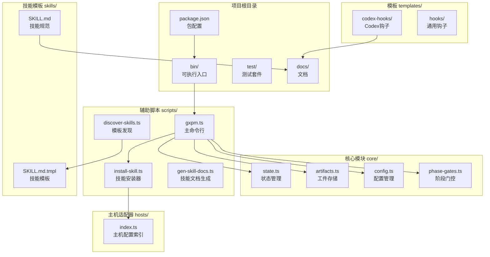
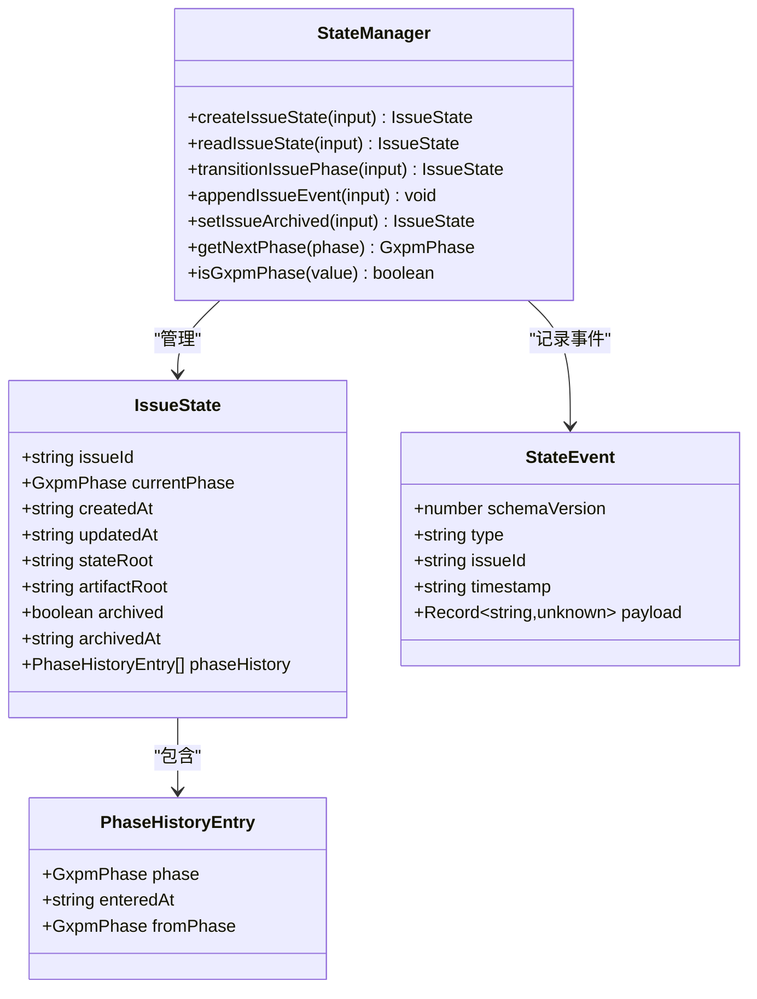
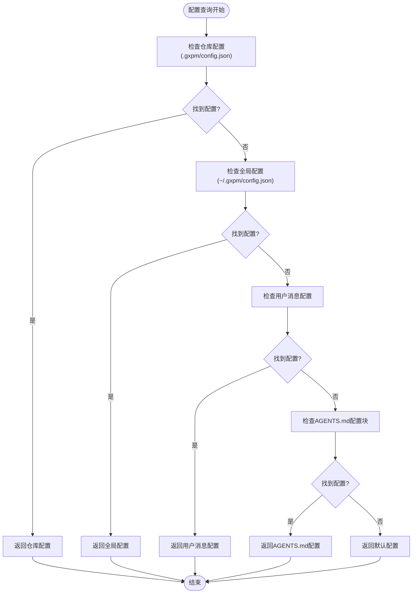
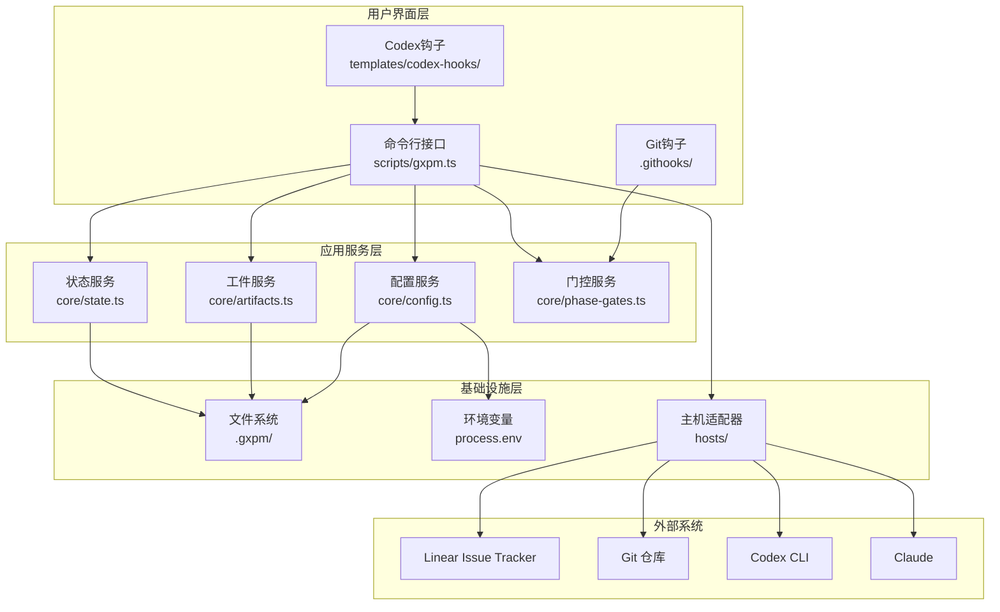
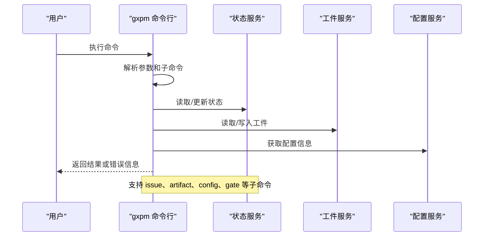
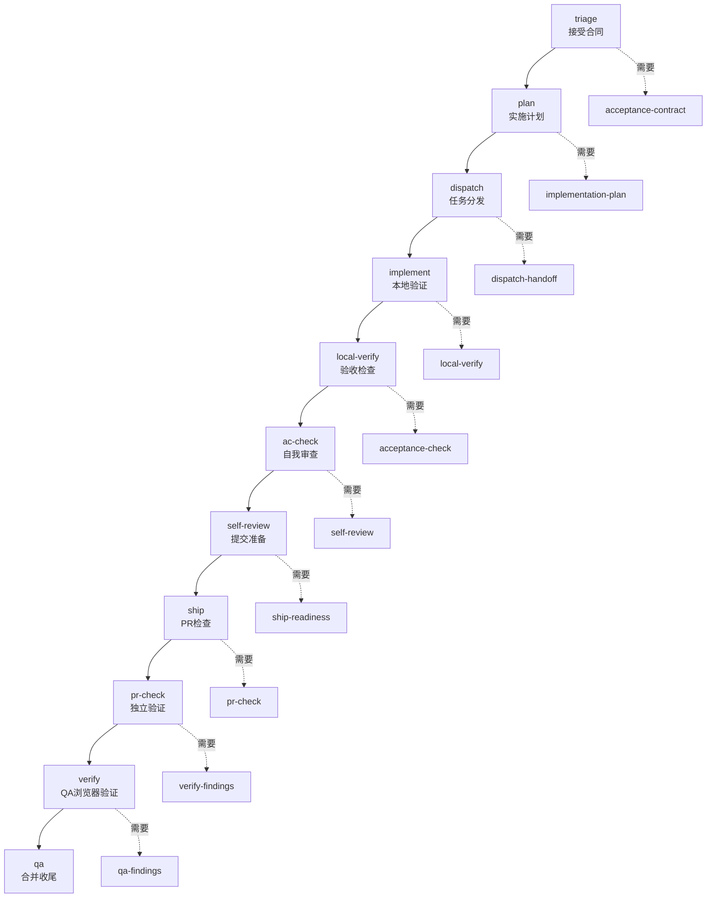
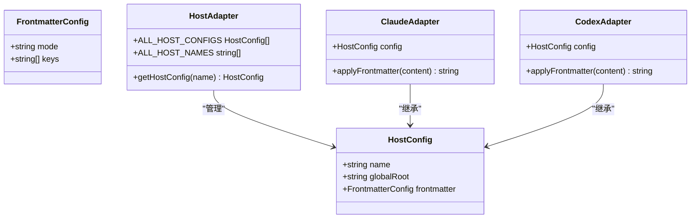
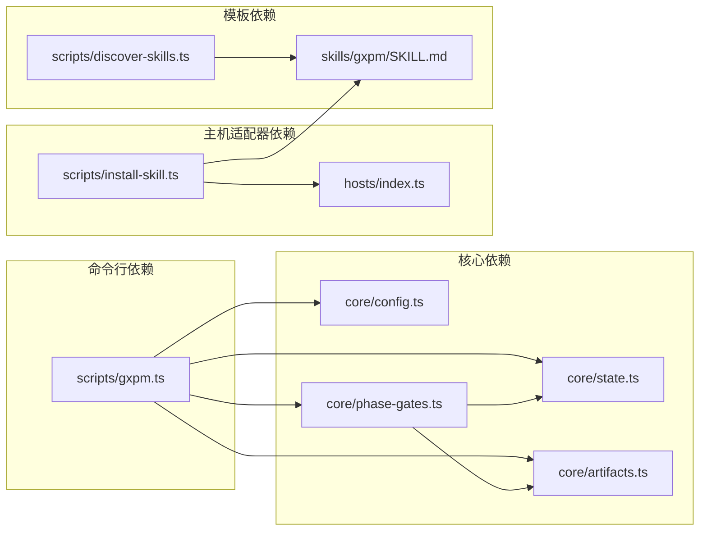

# 项目结构说明

<cite>
**本文引用的文件**
- [package.json](file://package.json)
- [bin/gxpm](file://bin/gxpm)
- [scripts/gxpm.ts](file://scripts/gxpm.ts)
- [core/state.ts](file://core/state.ts)
- [core/artifacts.ts](file://core/artifacts.ts)
- [core/config.ts](file://core/config.ts)
- [core/phase-gates.ts](file://core/phase-gates.ts)
- [hosts/index.ts](file://hosts/index.ts)
- [scripts/install-skill.ts](file://scripts/install-skill.ts)
- [scripts/discover-skills.ts](file://scripts/discover-skills.ts)
- [skills/gxpm/SKILL.md](file://skills/gxpm/SKILL.md)
- [templates/codex-hooks/session-start.sh](file://templates/codex-hooks/session-start.sh)
- [docs/architecture/gxpm-v0-contract.md](file://docs/architecture/gxpm-v0-contract.md)
</cite>

## 目录
1. [简介](#简介)
2. [项目结构总览](#项目结构总览)
3. [核心组件](#核心组件)
4. [架构概览](#架构概览)
5. [详细组件分析](#详细组件分析)
6. [依赖关系分析](#依赖关系分析)
7. [性能考虑](#性能考虑)
8. [故障排除指南](#故障排除指南)
9. [结论](#结论)
10. [附录](#附录)

## 简介
gxpm 是第二代项目管理运行时，旨在替代 PMC 和 gstack，通过统一的状态图、能力运行时、浏览器证据层和代理交付工作流，构建一个原生的项目管理控制面。项目采用模块化设计，围绕核心状态管理、工件存储、配置管理和主机适配器展开，同时提供丰富的辅助脚本、技能模板和文档体系。

## 项目结构总览
项目采用按功能域划分的目录结构，主要包含以下核心目录：
- core/: 核心业务逻辑，包括状态管理、工件存储、配置管理、阶段门控等
- scripts/: 辅助脚本，提供命令行工具、安装器、检查器等
- hosts/: 主机适配器，支持不同 AI 主机（如 Claude、Codex）的配置
- skills/: 技能模板，定义代理技能的规范和生成规则
- templates/: 模板文件，包括钩子模板和 Codex 钩子脚本
- test/: 测试套件，覆盖核心功能和集成场景
- docs/: 文档目录，包含架构、治理、研究和路线图文档



**图表来源**
- [package.json:1-25](file://package.json#L1-L25)
- [bin/gxpm:1-18](file://bin/gxpm#L1-L18)
- [scripts/gxpm.ts:1-611](file://scripts/gxpm.ts#L1-L611)
- [core/state.ts:1-302](file://core/state.ts#L1-L302)
- [core/artifacts.ts:1-169](file://core/artifacts.ts#L1-L169)
- [core/config.ts:1-229](file://core/config.ts#L1-L229)
- [core/phase-gates.ts:1-118](file://core/phase-gates.ts#L1-L118)
- [hosts/index.ts:1-16](file://hosts/index.ts#L1-L16)
- [scripts/install-skill.ts:1-112](file://scripts/install-skill.ts#L1-L112)
- [scripts/discover-skills.ts:1-58](file://scripts/discover-skills.ts#L1-L58)
- [skills/gxpm/SKILL.md:1-403](file://skills/gxpm/SKILL.md#L1-L403)
- [templates/codex-hooks/session-start.sh:1-71](file://templates/codex-hooks/session-start.sh#L1-L71)

**章节来源**
- [package.json:1-25](file://package.json#L1-L25)
- [bin/gxpm:1-18](file://bin/gxpm#L1-L18)

## 核心组件
核心组件围绕状态机、工件存储和配置管理构建，形成完整的项目管理闭环。

### 状态管理系统
状态管理系统负责维护每个问题的生命周期状态，确保阶段转换的有序性和完整性。



**图表来源**
- [core/state.ts:28-56](file://core/state.ts#L28-L56)
- [core/state.ts:149-204](file://core/state.ts#L149-L204)

### 工件存储系统
工件存储系统提供标准化的数据持久化机制，确保每个阶段的输出都能被可靠地保存和检索。

```mermaid
classDiagram
class ArtifactRecord {
+number schemaVersion
+ArtifactType type
+string path
+string writtenAt
}
class StoredArtifact {
+number schemaVersion
+string issueId
+ArtifactType type
+string writtenAt
+unknown payload
}
class ArtifactManager {
+writeArtifact(input) ArtifactRecord
+readArtifact(input) StoredArtifact
+listArtifacts(input) ArtifactRecord[]
+hasArtifact(input) boolean
}
class ArtifactType {
<<enumeration>>
"issue-intake"
"triage-report"
"acceptance-contract"
"implementation-plan"
"dispatch-handoff"
"local-verify"
"acceptance-check"
"self-review"
"ship-readiness"
"pr-check"
"verify-findings"
"qa-findings"
"land-findings"
}
ArtifactManager --> ArtifactRecord : "返回"
ArtifactManager --> StoredArtifact : "读取"
ArtifactRecord --> ArtifactType : "使用"
StoredArtifact --> ArtifactType : "使用"
```

**图表来源**
- [core/artifacts.ts:28-41](file://core/artifacts.ts#L28-L41)
- [core/artifacts.ts:57-91](file://core/artifacts.ts#L57-L91)

### 配置管理系统
配置管理系统提供多层级的配置解析能力，支持仓库级、全局级和用户消息级的配置优先级。



**图表来源**
- [core/config.ts:66-79](file://core/config.ts#L66-L79)
- [core/config.ts:153-195](file://core/config.ts#L153-L195)

**章节来源**
- [core/state.ts:1-302](file://core/state.ts#L1-L302)
- [core/artifacts.ts:1-169](file://core/artifacts.ts#L1-L169)
- [core/config.ts:1-229](file://core/config.ts#L1-L229)

## 架构概览
项目采用分层架构设计，从底层的文件系统抽象到上层的命令行接口，形成了清晰的职责分离。



**图表来源**
- [scripts/gxpm.ts:1-611](file://scripts/gxpm.ts#L1-L611)
- [core/state.ts:1-302](file://core/state.ts#L1-L302)
- [core/artifacts.ts:1-169](file://core/artifacts.ts#L1-L169)
- [core/config.ts:1-229](file://core/config.ts#L1-L229)
- [core/phase-gates.ts:1-118](file://core/phase-gates.ts#L1-L118)
- [hosts/index.ts:1-16](file://hosts/index.ts#L1-L16)

## 详细组件分析

### 命令行接口组件
命令行接口是用户与 gxpm 系统交互的主要入口，提供了完整的生命周期管理能力。



**图表来源**
- [scripts/gxpm.ts:32-256](file://scripts/gxpm.ts#L32-L256)
- [scripts/gxpm.ts:258-305](file://scripts/gxpm.ts#L258-L305)

### 阶段门控机制
阶段门控机制确保了严格的阶段转换顺序，每个阶段转换都需要相应的工件作为前置条件。



**图表来源**
- [core/phase-gates.ts:32-99](file://core/phase-gates.ts#L32-L99)
- [core/state.ts:149-204](file://core/state.ts#L149-L204)

### 主机适配器系统
主机适配器系统支持不同的 AI 主机，通过统一的接口适配不同的主机特性。



**图表来源**
- [hosts/index.ts:1-16](file://hosts/index.ts#L1-L16)
- [scripts/install-skill.ts:47-71](file://scripts/install-skill.ts#L47-L71)

**章节来源**
- [scripts/gxpm.ts:1-611](file://scripts/gxpm.ts#L1-L611)
- [core/phase-gates.ts:1-118](file://core/phase-gates.ts#L1-L118)
- [hosts/index.ts:1-16](file://hosts/index.ts#L1-L16)

## 依赖关系分析
项目采用松耦合的设计，核心模块之间通过明确定义的接口进行交互。



**图表来源**
- [scripts/gxpm.ts:1-31](file://scripts/gxpm.ts#L1-L31)
- [scripts/install-skill.ts:4-6](file://scripts/install-skill.ts#L4-L6)
- [scripts/discover-skills.ts:1-7](file://scripts/discover-skills.ts#L1-L7)

**章节来源**
- [scripts/gxpm.ts:1-31](file://scripts/gxpm.ts#L1-L31)
- [scripts/install-skill.ts:4-6](file://scripts/install-skill.ts#L4-L6)
- [scripts/discover-skills.ts:1-7](file://scripts/discover-skills.ts#L1-L7)

## 性能考虑
- 文件系统访问优化：状态和工件数据采用 JSON 文件存储，建议合理组织文件结构以减少磁盘 I/O
- 缓存策略：对于频繁查询的配置信息，可以在内存中缓存以提高响应速度
- 并发处理：命令行工具应避免不必要的并发操作，确保状态一致性
- 内存管理：大型工件数据应采用流式处理，避免内存溢出

## 故障排除指南
常见问题及解决方案：

### 状态文件损坏
当状态文件损坏时，可以通过以下方式修复：
1. 检查 `.gxpm/issues/<issue-id>/state.json` 文件格式
2. 使用 `gxpm issue history <issue-id>` 查看事件日志
3. 重新创建状态文件并重建阶段历史

### 工件缺失
当工件缺失导致阶段转换失败时：
1. 使用 `gxpm artifact list <issue-id>` 检查可用工件
2. 根据阶段门控规则创建缺失的工件
3. 重新执行阶段转换命令

### 配置冲突
当配置冲突时：
1. 使用 `gxpm config list` 查看当前配置
2. 检查仓库级和全局级配置的优先级
3. 清除冲突的配置项或调整优先级

**章节来源**
- [core/state.ts:149-204](file://core/state.ts#L149-L204)
- [core/artifacts.ts:93-104](file://core/artifacts.ts#L93-L104)
- [core/config.ts:98-106](file://core/config.ts#L98-L106)

## 结论
gxpm 项目通过模块化的架构设计，成功地将状态管理、工件存储、配置管理和主机适配器等功能有机地结合在一起。其严格的阶段门控机制和标准化的工件契约确保了项目管理过程的可控性和可追溯性。项目结构清晰，职责分离明确，为后续的功能扩展和维护奠定了良好的基础。

## 附录

### 文件命名约定和组织原则
- 核心模块文件采用小驼峰命名法，如 `state.ts`、`artifacts.ts`
- 类型定义文件使用 `_types.ts` 后缀，如 `state_types.ts`
- 测试文件使用 `_test.ts` 后缀，如 `state.test.ts`
- 模板文件使用 `.tmpl` 后缀，如 `SKILL.md.tmpl`
- 配置文件使用 `config.json` 格式

### 目录结构最佳实践
- 将相关功能的文件放在同一目录下，保持高内聚低耦合
- 使用清晰的命名空间避免文件名冲突
- 为每个模块提供明确的导出接口
- 在公共接口处添加类型定义和文档注释
- 定期清理未使用的文件和过时的代码

### 扩展指导
- 新增功能时，遵循现有的模块化设计模式
- 为新功能创建专门的目录和文件组织结构
- 确保新功能与现有接口的兼容性
- 提供相应的测试用例和文档
- 考虑性能影响和资源消耗