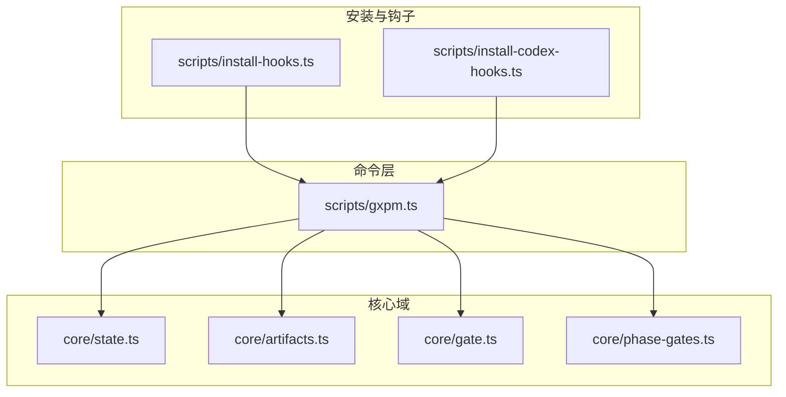
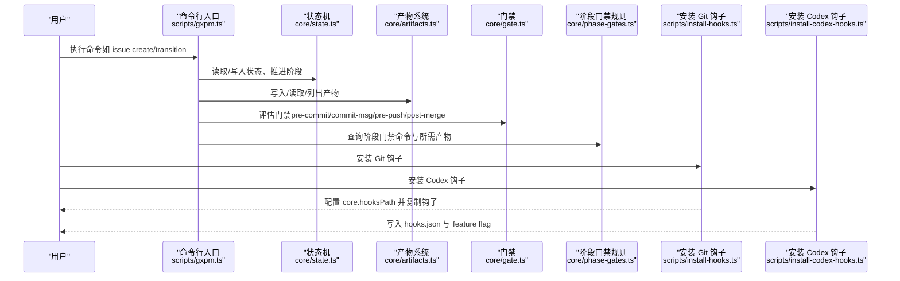
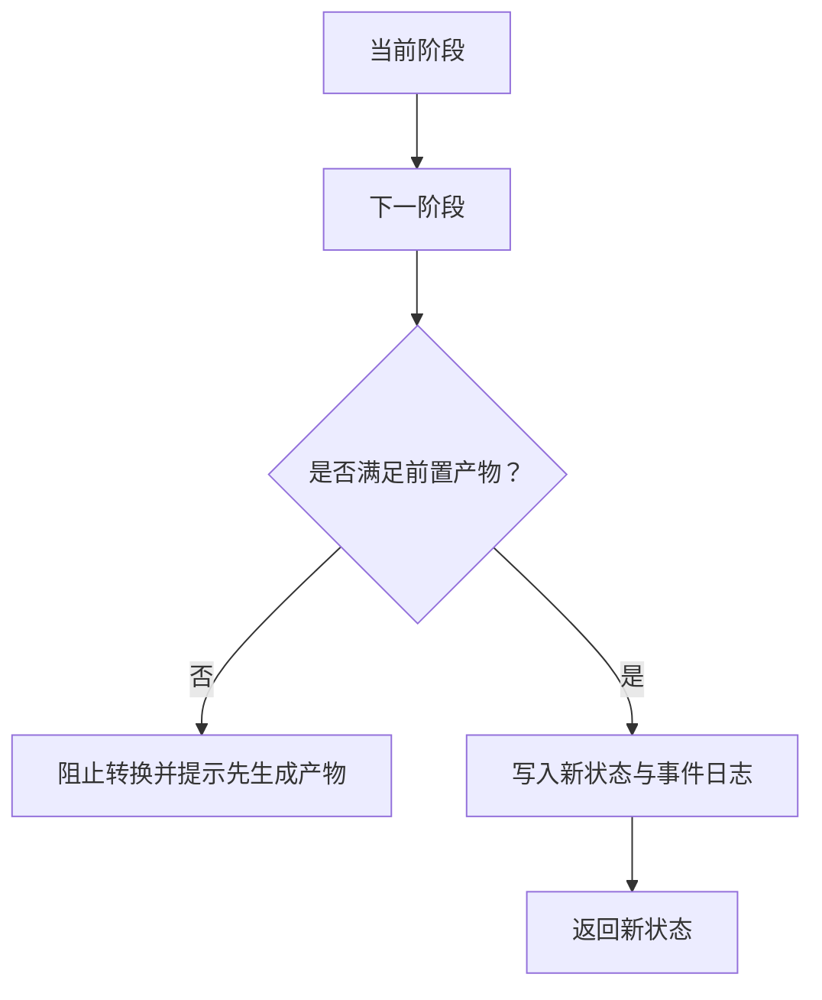
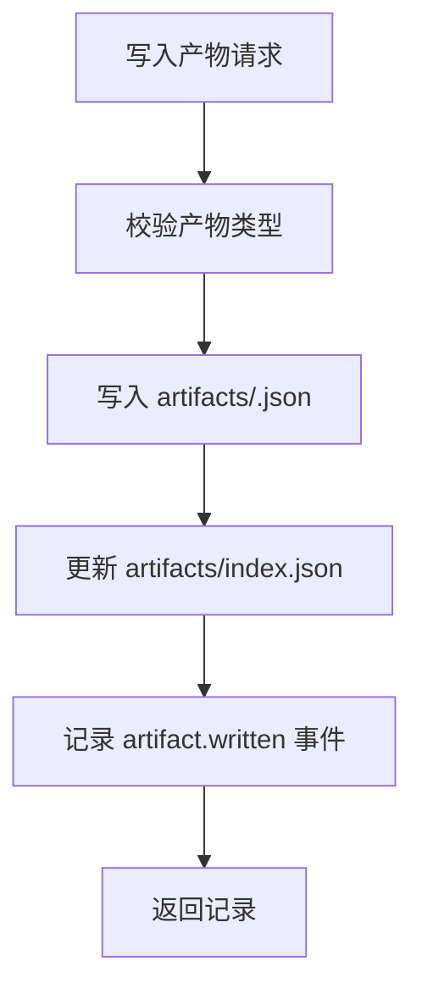
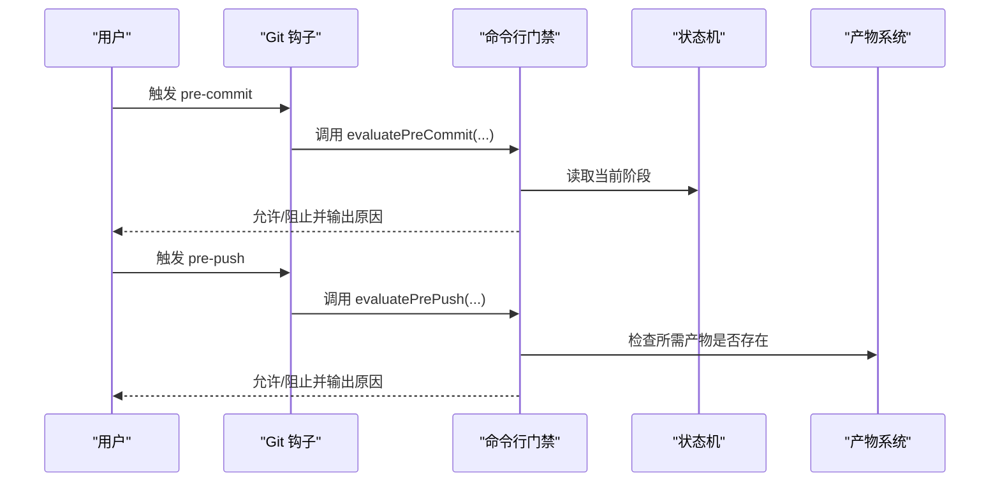
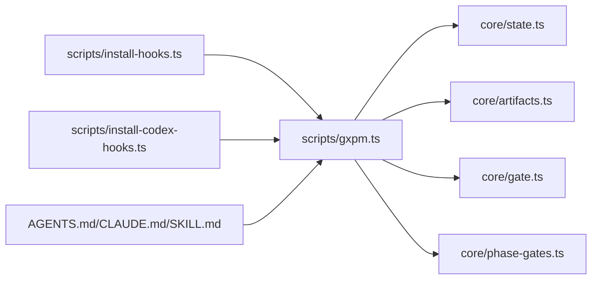

# 快速开始

<cite>
**本文引用的文件**
- [package.json](file://package.json)
- [scripts/gxpm.ts](file://scripts/gxpm.ts)
- [core/state.ts](file://core/state.ts)
- [core/gate.ts](file://core/gate.ts)
- [core/artifacts.ts](file://core/artifacts.ts)
- [core/phase-gates.ts](file://core/phase-gates.ts)
- [scripts/install-hooks.ts](file://scripts/install-hooks.ts)
- [scripts/install-codex-hooks.ts](file://scripts/install-codex-hooks.ts)
- [AGENTS.md](file://AGENTS.md)
- [CLAUDE.md](file://CLAUDE.md)
- [skills/gxpm/SKILL.md](file://skills/gxpm/SKILL.md)
- [docs/architecture/gxpm-v0-contract.md](file://docs/architecture/gxpm-v0-contract.md)
- [README.md](file://README.md)
</cite>

## 目录
1. [简介](#简介)
2. [项目结构](#项目结构)
3. [核心组件](#核心组件)
4. [架构总览](#架构总览)
5. [详细组件解析](#详细组件解析)
6. [依赖关系分析](#依赖关系分析)
7. [性能与实践建议](#性能与实践建议)
8. [故障排除指南](#故障排除指南)
9. [结语](#结语)
10. [附录](#附录)

## 简介
本指南面向首次使用 gxpm 的用户，帮助你在最短时间内完成安装、环境准备、初始配置与第一个项目示例，掌握常用命令与基本项目管理流程。你将了解状态机、门禁机制与产物系统的运作方式，并能在常见使用场景中快速落地。

## 项目结构
- 核心运行时与命令入口位于 scripts/gxpm.ts，负责解析命令、路由到各子系统（状态、产物、门禁、配置等）。
- 核心领域模型与规则集中在 core/*：状态机、门禁规则、产物类型与索引、阶段门禁映射。
- 脚手架与安装工具位于 scripts/*：安装 Git hooks、安装 Codex hooks、生成技能文档、健康检查等。
- 文档与治理说明位于 docs/* 与 AGENTS.md/CLAUDE.md，定义了代理契约、工作流与最佳实践。
- 技能入口 SKILL.md 提供了面向 Codex/Claude 的使用说明与命令清单。

图表来源
- [scripts/gxpm.ts:1-611](file://scripts/gxpm.ts#L1-L611)
- [core/state.ts:1-302](file://core/state.ts#L1-L302)
- [core/artifacts.ts:1-169](file://core/artifacts.ts#L1-L169)
- [core/gate.ts:1-144](file://core/gate.ts#L1-L144)
- [core/phase-gates.ts:1-118](file://core/phase-gates.ts#L1-L118)
- [scripts/install-hooks.ts:1-106](file://scripts/install-hooks.ts#L1-L106)
- [scripts/install-codex-hooks.ts:1-214](file://scripts/install-codex-hooks.ts#L1-L214)

章节来源
- [README.md:1-46](file://README.md#L1-L46)
- [package.json:1-25](file://package.json#L1-L25)

## 核心组件
- 状态机与阶段：定义了从 triage 到 land 的严格阶段序列，每个阶段的推进需要满足前置产物条件。
- 产物系统：以 JSON 文件形式存储阶段产物，支持写入、读取、列出与索引更新。
- 门禁机制：在 Git 钩子与命令行层面进行阶段推进的强制校验，保护受保护路径、要求必需产物存在、校验提交信息格式等。
- 配置与策略：支持仓库级与全局级配置，包含工作树策略等。

章节来源
- [core/state.ts:11-302](file://core/state.ts#L11-L302)
- [core/artifacts.ts:10-169](file://core/artifacts.ts#L10-L169)
- [core/gate.ts:8-144](file://core/gate.ts#L8-L144)
- [core/phase-gates.ts:25-118](file://core/phase-gates.ts#L25-L118)

## 架构总览
下图展示了命令层如何调用核心域，以及安装脚本如何将门禁与钩子注入到仓库与 Codex 环境中。

图表来源
- [scripts/gxpm.ts:32-256](file://scripts/gxpm.ts#L32-L256)
- [core/state.ts:86-204](file://core/state.ts#L86-L204)
- [core/artifacts.ts:57-91](file://core/artifacts.ts#L57-L91)
- [core/gate.ts:48-143](file://core/gate.ts#L48-L143)
- [core/phase-gates.ts:32-99](file://core/phase-gates.ts#L32-L99)
- [scripts/install-hooks.ts:50-103](file://scripts/install-hooks.ts#L50-L103)
- [scripts/install-codex-hooks.ts:30-95](file://scripts/install-codex-hooks.ts#L30-L95)

## 详细组件解析

### 状态机与阶段转换
- 阶段序列：triage → plan → dispatch → implement → local-verify → ac-check → self-review → ship → pr-check → verify → qa → land。
- 转换规则：每次只能向前推进到下一个阶段；若缺少前置产物，转换会被阻止并提示先生成对应产物。
- 事件记录：每次阶段转换与产物写入都会追加事件日志，便于审计与回溯。

图表来源
- [core/state.ts:149-204](file://core/state.ts#L149-L204)
- [core/phase-gates.ts:107-112](file://core/phase-gates.ts#L107-L112)

章节来源
- [core/state.ts:11-43](file://core/state.ts#L11-L43)
- [core/state.ts:226-229](file://core/state.ts#L226-L229)
- [core/state.ts:252-301](file://core/state.ts#L252-L301)
- [docs/architecture/gxpm-v0-contract.md:75-117](file://docs/architecture/gxpm-v0-contract.md#L75-L117)

### 产物系统
- 产物类型：涵盖从 triage 到 land 的关键产物，如 acceptance-contract、implementation-plan、dispatch-handoff、local-verify、acceptance-check、self-review、ship-readiness、pr-check、verify-findings、qa-findings、land-findings 等。
- 存储与索引：每个产物以 JSON 文件保存，并维护 artifacts/index.json 以便快速列出。
- 写入流程：先写入产物 JSON，再更新索引，最后记录事件。

图表来源
- [core/artifacts.ts:57-91](file://core/artifacts.ts#L57-L91)
- [core/artifacts.ts:127-146](file://core/artifacts.ts#L127-L146)

章节来源
- [core/artifacts.ts:10-41](file://core/artifacts.ts#L10-L41)
- [core/artifacts.ts:106-125](file://core/artifacts.ts#L106-L125)

### 门禁机制
- Git 钩子门禁：pre-commit（禁止对受保护路径进行变更）、commit-msg（要求提交信息包含 issue 引用）、pre-push（要求当前阶段所需的产物存在）、post-merge（在特定阶段合并后自动推进）。
- 命令行门禁：提供与钩子一致的评估接口，便于手动检查与调试。
- 环境变量豁免：GXPM_GATE_DISABLE=1 可临时关闭门禁，仅在特殊情况下使用。

图表来源
- [scripts/gxpm.ts:483-575](file://scripts/gxpm.ts#L483-L575)
- [core/gate.ts:48-130](file://core/gate.ts#L48-L130)
- [core/phase-gates.ts:32-99](file://core/phase-gates.ts#L32-L99)

章节来源
- [core/gate.ts:8-32](file://core/gate.ts#L8-L32)
- [core/gate.ts:40-42](file://core/gate.ts#L40-L42)
- [scripts/gxpm.ts:483-603](file://scripts/gxpm.ts#L483-L603)

### 安装与钩子
- 安装 Git 钩子：将 gxpm-pre-commit、gxpm-commit-msg、gxpm-pre-push、gxpm-post-merge 模板复制到 .githooks，并设置 core.hooksPath 指向 .githooks。
- 安装 Codex 钩子：在仓库或用户范围安装 SessionStart 与 UserPromptSubmit 钩子，并确保 feature flag 已启用。

章节来源
- [scripts/install-hooks.ts:50-103](file://scripts/install-hooks.ts#L50-L103)
- [scripts/install-codex-hooks.ts:30-95](file://scripts/install-codex-hooks.ts#L30-L95)

## 依赖关系分析
- 命令入口 scripts/gxpm.ts 依赖状态机、产物系统、门禁与阶段规则。
- 安装脚本与命令入口相互独立，但共同保障门禁与钩子的正确部署。
- 文档与治理文件（AGENTS.md、CLAUDE.md、SKILL.md）为使用提供契约与最佳实践。

图表来源
- [scripts/gxpm.ts:1-31](file://scripts/gxpm.ts#L1-L31)
- [scripts/install-hooks.ts:1-16](file://scripts/install-hooks.ts#L1-L16)
- [scripts/install-codex-hooks.ts:1-28](file://scripts/install-codex-hooks.ts#L1-L28)
- [AGENTS.md:1-85](file://AGENTS.md#L1-L85)
- [CLAUDE.md:1-17](file://CLAUDE.md#L1-L17)
- [skills/gxpm/SKILL.md:1-357](file://skills/gxpm/SKILL.md#L1-L357)

章节来源
- [scripts/gxpm.ts:1-611](file://scripts/gxpm.ts#L1-L611)
- [core/state.ts:1-302](file://core/state.ts#L1-L302)
- [core/artifacts.ts:1-169](file://core/artifacts.ts#L1-L169)
- [core/gate.ts:1-144](file://core/gate.ts#L1-L144)
- [core/phase-gates.ts:1-118](file://core/phase-gates.ts#L1-L118)

## 性能与实践建议
- 使用自动化钩子减少人工干预，降低错误率。
- 将阶段产物以 JSON 形式持久化，避免仅依赖聊天记忆。
- 在进入 implement 前检查未追踪文件数量，必要时使用独立 worktree 隔离。
- 使用 gxpm issue next <id> 获取下一步推荐命令，避免猜测。

章节来源
- [AGENTS.md:40-54](file://AGENTS.md#L40-L54)
- [skills/gxpm/SKILL.md:228-262](file://skills/gxpm/SKILL.md#L228-L262)

## 故障排除指南
- 门禁阻止提交/推送
  - 检查当前阶段是否允许对受保护路径进行变更；若不允许，请先完成当前阶段的产物。
  - 使用 gxpm gate pre-commit/commit-msg/pre-push/post-merge 手动评估。
  - 如确需临时豁免，使用 GXPM_GATE_DISABLE=1，但需记录原因。
- 缺少前置产物导致阶段转换失败
  - 使用 gxpm issue next <id> 查看下一步命令与所需产物。
  - 先运行对应 phase 的 init 命令生成 draft 产物，再进行转换。
- 提交信息未包含 issue 引用
  - 确保提交信息包含 GXG-NNN 或 GXPM-NNN 格式的引用。
- 仓库未正确安装钩子
  - 使用 gxpm-init --install --target /path/to/repo 安装钩子与技能。
  - 确认 core.hooksPath 指向 .githooks。
- Codex 钩子未生效
  - 确认 feature flag 已启用；安装脚本会自动处理，也可手动设置。
  - 重启 Codex 以激活钩子。

章节来源
- [scripts/gxpm.ts:483-603](file://scripts/gxpm.ts#L483-L603)
- [core/gate.ts:48-130](file://core/gate.ts#L48-L130)
- [scripts/install-hooks.ts:81-92](file://scripts/install-hooks.ts#L81-L92)
- [scripts/install-codex-hooks.ts:102-134](file://scripts/install-codex-hooks.ts#L102-L134)

## 结语
通过本指南，你已了解 gxpm 的安装、配置与基本使用流程。建议在实际项目中坚持“先写产物、再推进阶段”的原则，并充分利用门禁与钩子保障交付质量。随着实践深入，可进一步探索配置策略、工作流优化与团队协作规范。

## 附录

### 环境要求与安装步骤
- 环境要求
  - 运行时：Bun（版本要求见 engines 字段）
  - Git 仓库：用于安装 Git 钩子
  - 可选：Codex（用于安装 Codex 钩子）
- 安装步骤
  - 克隆仓库并在根目录执行安装脚本，将 gxpm 与技能安装到目标仓库。
  - 安装 Git 钩子：确保 core.hooksPath 指向 .githooks。
  - 安装 Codex 钩子（可选）：按需选择仓库范围或用户范围安装，并启用 feature flag。
  - 运行 gxpm doctor 检查安装状态与建议修复项。

章节来源
- [package.json:21-23](file://package.json#L21-L23)
- [scripts/install-hooks.ts:50-103](file://scripts/install-hooks.ts#L50-L103)
- [scripts/install-codex-hooks.ts:30-95](file://scripts/install-codex-hooks.ts#L30-L95)
- [skills/gxpm/SKILL.md:53-59](file://skills/gxpm/SKILL.md#L53-L59)

### 初始配置
- 工作树策略
  - 通过 gxpm config get/set/list 查询与设置工作树策略。
  - 策略解析链：仓库配置 > 用户消息 > AGENTS.md 配置 > 默认值。
- 版本与诊断
  - 使用 gxpm version 或 --version/-v 查看版本。
  - 使用 gxpm doctor 生成人类可读或机器可读的诊断报告。

章节来源
- [skills/gxpm/SKILL.md:256-262](file://skills/gxpm/SKILL.md#L256-L262)
- [AGENTS.md:33-38](file://AGENTS.md#L33-L38)
- [scripts/gxpm.ts:40-46](file://scripts/gxpm.ts#L40-L46)
- [scripts/gxpm.ts:65-74](file://scripts/gxpm.ts#L65-L74)

### 第一个项目示例（从零到 land）
- 创建 issue
  - 使用 gxpm issue create --auto-id 自动生成下一个可用 ID。
- 查看状态与历史
  - 使用 gxpm issue status <id> 与 gxpm issue history <id> 获取当前阶段与事件时间线。
- 逐步推进阶段
  - triage → plan → dispatch → implement → local-verify → ac-check → self-review → ship → pr-check → verify → qa → land
  - 每次推进前先生成对应阶段的 draft 产物，再执行转换。
- 常用命令清单
  - 查看与审计：gxpm issue status/list/history
  - 产物管理：gxpm artifact list/read/write/edit
  - 阶段推进：gxpm issue transition <id> <phase>
  - 门禁检查：gxpm gate pre-commit/commit-msg/pre-push/post-merge
  - 诊断与版本：gxpm doctor/version

章节来源
- [skills/gxpm/SKILL.md:74-162](file://skills/gxpm/SKILL.md#L74-L162)
- [scripts/gxpm.ts:76-184](file://scripts/gxpm.ts#L76-L184)
- [scripts/gxpm.ts:186-223](file://scripts/gxpm.ts#L186-L223)
- [scripts/gxpm.ts:225-243](file://scripts/gxpm.ts#L225-L243)
- [scripts/gxpm.ts:65-74](file://scripts/gxpm.ts#L65-L74)

### 常用命令速查
- 项目管理
  - gxpm issue create <issue-id>
  - gxpm issue status <issue-id>
  - gxpm issue list [--all|--archived|--recent N|--json]
  - gxpm issue archive/unarchive <issue-id>
  - gxpm issue next <issue-id>
  - gxpm issue history <issue-id> [--json]
  - gxpm issue transition <issue-id> <phase>
- 产物管理
  - gxpm artifact list <issue-id>
  - gxpm artifact read <issue-id> <type>
  - gxpm artifact write <issue-id> <type> (--json|--from|--stdin)
  - gxpm artifact edit <issue-id> <type>
- 门禁与钩子
  - gxpm gate pre-commit <issue-id> --staged "<files...>"
  - gxpm gate commit-msg <msg-file> [--issue <id>]
  - gxpm gate pre-push <issue-id>
  - gxpm gate post-merge <issue-id>
- 配置与诊断
  - gxpm config get/set/list [--global]
  - gxpm doctor [--json]
  - gxpm version/--version/-v
  - gxpm worktree policy

章节来源
- [scripts/gxpm.ts:32-256](file://scripts/gxpm.ts#L32-L256)
- [scripts/gxpm.ts:258-305](file://scripts/gxpm.ts#L258-L305)
- [scripts/gxpm.ts:483-603](file://scripts/gxpm.ts#L483-L603)

### 基本概念解释
- 状态机：严格的阶段序列，每次只能前进到下一个阶段。
- 门禁机制：在 Git 钩子与命令行层面强制执行阶段推进规则，保护受保护路径、要求必需产物存在、校验提交信息格式。
- 产物系统：以 JSON 文件形式存储阶段产物，支持写入、读取、列出与索引更新，作为阶段推进的凭证。

章节来源
- [core/state.ts:11-43](file://core/state.ts#L11-L43)
- [core/gate.ts:8-32](file://core/gate.ts#L8-L32)
- [core/artifacts.ts:10-41](file://core/artifacts.ts#L10-L41)