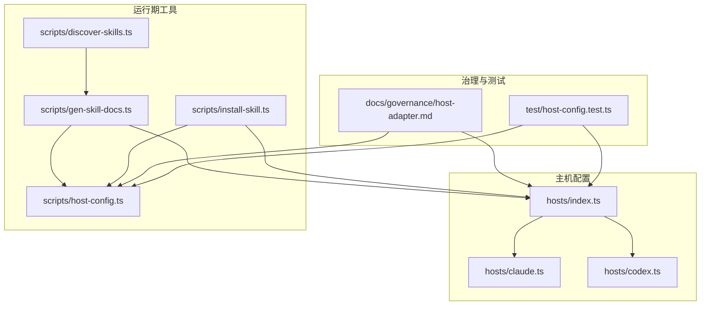
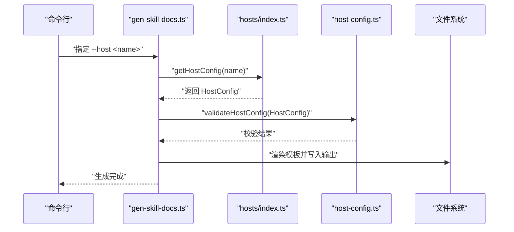
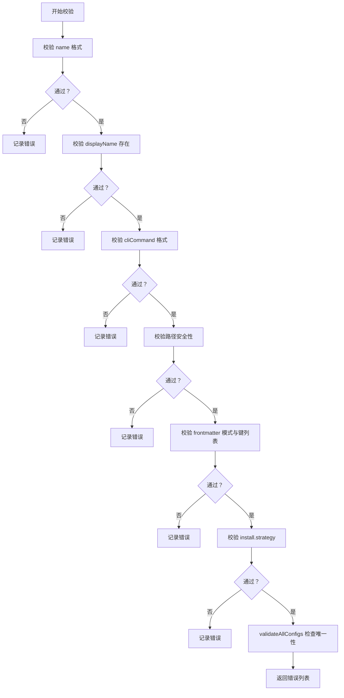
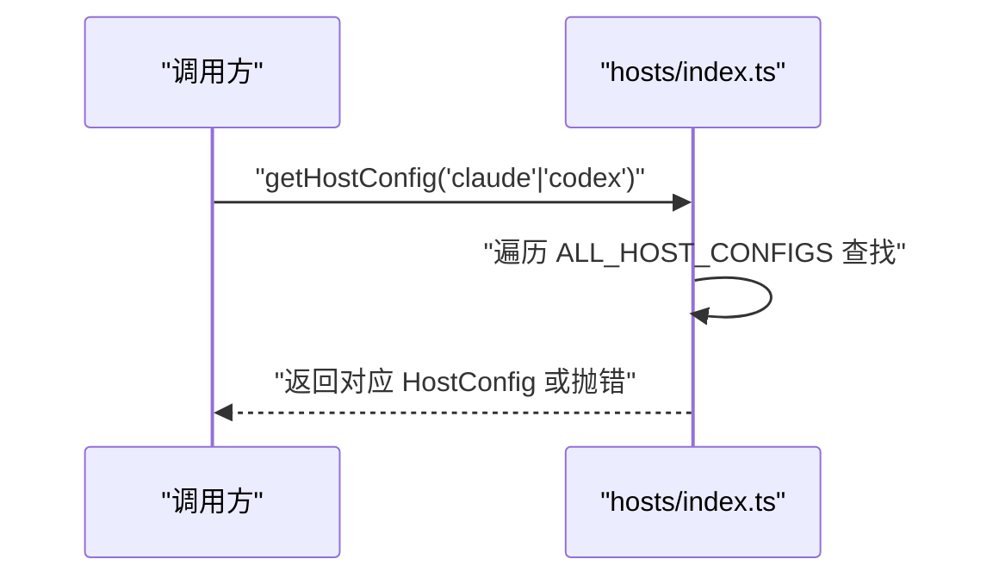
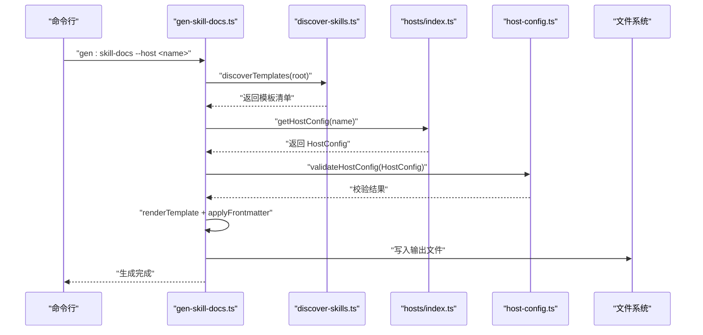
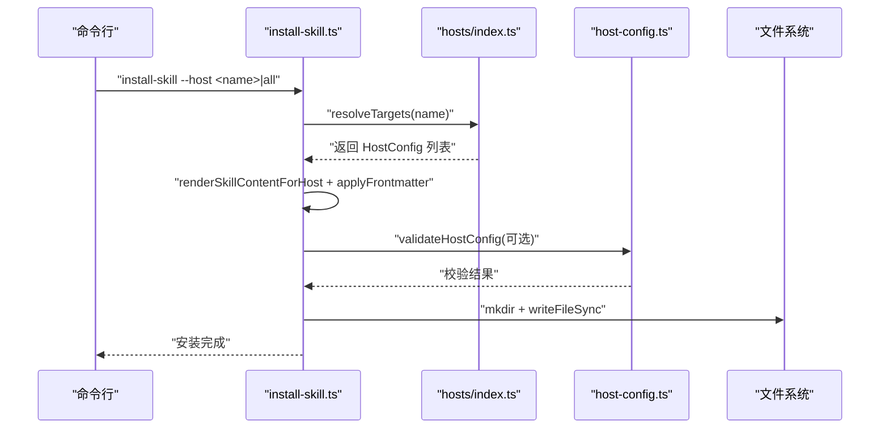
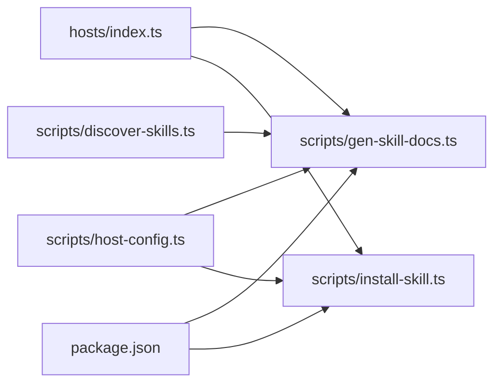

# 主机适配器

<cite>
**本文引用的文件**
- [hosts/index.ts](file://hosts/index.ts)
- [hosts/claude.ts](file://hosts/claude.ts)
- [hosts/codex.ts](file://hosts/codex.ts)
- [scripts/host-config.ts](file://scripts/host-config.ts)
- [scripts/gen-skill-docs.ts](file://scripts/gen-skill-docs.ts)
- [scripts/install-skill.ts](file://scripts/install-skill.ts)
- [scripts/discover-skills.ts](file://scripts/discover-skills.ts)
- [docs/governance/host-adapter.md](file://docs/governance/host-adapter.md)
- [test/host-config.test.ts](file://test/host-config.test.ts)
- [package.json](file://package.json)
</cite>

## 目录
1. [简介](#简介)
2. [项目结构](#项目结构)
3. [核心组件](#核心组件)
4. [架构总览](#架构总览)
5. [详细组件分析](#详细组件分析)
6. [依赖关系分析](#依赖关系分析)
7. [性能考虑](#性能考虑)
8. [故障排除指南](#故障排除指南)
9. [结论](#结论)
10. [附录](#附录)

## 简介
本文件系统性阐述 gxpm 的“主机适配器”体系：其设计原则、架构模式、具体适配器（Claude 与 Codex）的实现细节、注册与动态加载机制、扩展与自定义主机的开发指南、最佳实践与性能优化建议，并提供可操作的使用示例与故障排除方法。  
该系统通过声明式的 HostConfig 将“路径、前端元数据处理策略、安装策略、环境变量使用偏好”等与具体 AI 工具解耦，使生成器与工作流逻辑无需感知工具差异，从而实现对多主机的统一支持。

## 项目结构
主机适配器相关的核心位置如下：
- hosts：存放各主机的配置导出与集中注册
- scripts：运行期工具，负责技能文档生成、安装、校验与模板发现
- docs/governance：治理文档，定义新增主机流程与最小配置字段
- test：参数化测试，覆盖主机配置与验证逻辑

图表来源
- [hosts/index.ts:1-16](file://hosts/index.ts#L1-L16)
- [hosts/claude.ts:1-18](file://hosts/claude.ts#L1-L18)
- [hosts/codex.ts:1-19](file://hosts/codex.ts#L1-L19)
- [scripts/host-config.ts:1-83](file://scripts/host-config.ts#L1-L83)
- [scripts/gen-skill-docs.ts:1-165](file://scripts/gen-skill-docs.ts#L1-L165)
- [scripts/install-skill.ts:1-112](file://scripts/install-skill.ts#L1-L112)
- [scripts/discover-skills.ts:1-58](file://scripts/discover-skills.ts#L1-L58)
- [docs/governance/host-adapter.md:1-57](file://docs/governance/host-adapter.md#L1-L57)
- [test/host-config.test.ts:1-16](file://test/host-config.test.ts#L1-L16)

章节来源
- [hosts/index.ts:1-16](file://hosts/index.ts#L1-L16)
- [scripts/host-config.ts:1-83](file://scripts/host-config.ts#L1-L83)
- [docs/governance/host-adapter.md:1-57](file://docs/governance/host-adapter.md#L1-L57)

## 核心组件
- HostConfig 类型与校验
  - HostConfig 描述主机的名称、显示名、CLI 命令、主机子目录、全局与本地技能根目录、是否使用环境变量、前端元数据处理策略、安装策略等。
  - 提供 validateHostConfig 与 validateAllConfigs，用于格式、路径安全性、frontmatter 模式合法性与字段重复性校验。
- 主机注册与动态加载
  - hosts/index.ts 导出 ALL_HOST_CONFIGS、ALL_HOST_NAMES，并提供 getHostConfig(name) 动态查找。
  - 通过静态导入各主机配置并在数组中注册，形成可枚举的主机集合。
- 技能文档生成与安装
  - scripts/gen-skill-docs.ts 使用 getHostConfig 选择目标主机，渲染模板并注入前置信息与阶段门命令摘要。
  - scripts/install-skill.ts 读取模板、应用 frontmatter 过滤、写入到用户主目录下的主机全局根路径。
- 治理与测试
  - docs/governance/host-adapter.md 规定新增主机流程、最小字段与设计规则。
  - test/host-config.test.ts 参数化验证主机注册与校验结果。

章节来源
- [scripts/host-config.ts:1-83](file://scripts/host-config.ts#L1-L83)
- [hosts/index.ts:1-16](file://hosts/index.ts#L1-L16)
- [scripts/gen-skill-docs.ts:1-165](file://scripts/gen-skill-docs.ts#L1-L165)
- [scripts/install-skill.ts:1-112](file://scripts/install-skill.ts#L1-L112)
- [docs/governance/host-adapter.md:1-57](file://docs/governance/host-adapter.md#L1-L57)
- [test/host-config.test.ts:1-16](file://test/host-config.test.ts#L1-L16)

## 架构总览
主机适配器采用“声明式配置 + 运行期工具”的分层架构：
- 声明层：hosts/*.ts 定义 HostConfig，集中于 hosts/index.ts 注册。
- 校验层：scripts/host-config.ts 对单个与全部配置进行严格校验。
- 工具层：scripts/gen-skill-docs.ts 与 scripts/install-skill.ts 基于 HostConfig 执行模板渲染与安装。
- 治理层：docs/governance/host-adapter.md 规范新增主机流程与设计约束。
- 测试层：test/host-config.test.ts 参数化覆盖注册与校验。

图表来源
- [scripts/gen-skill-docs.ts:28-56](file://scripts/gen-skill-docs.ts#L28-L56)
- [hosts/index.ts:9-15](file://hosts/index.ts#L9-L15)
- [scripts/host-config.ts:29-63](file://scripts/host-config.ts#L29-L63)

## 详细组件分析

### Claude 适配器
- 配置要点
  - 名称与显示名：用于在 CLI 与文档中标识主机。
  - CLI 命令：作为外部工具调用入口。
  - 主机子目录与技能根：决定生成物的相对路径布局。
  - 是否使用环境变量：影响生成的前置信息与环境导出。
  - frontmatter 策略：preserve 表示保留原始元数据。
  - 安装策略：copy 表示复制而非符号链接。
- 通信与协议
  - 通过 CLI 命令与外部工具交互；具体协议由工具自身定义。
  - 生成物写入到主机全局根目录，避免路径泄漏至其他主机。
- 典型用途
  - 作为默认或通用主机，适合需要简单复制策略与保留元数据的场景。

章节来源
- [hosts/claude.ts:1-18](file://hosts/claude.ts#L1-L18)

### Codex 适配器
- 配置要点
  - 名称与显示名：明确工具身份。
  - CLI 命令：外部可执行名称。
  - 主机子目录与技能根：隔离生成物路径。
  - 使用环境变量：启用环境变量导出，便于工具解析。
  - frontmatter 策略：allowlist 指定允许的键列表，过滤元数据。
  - 安装策略：copy。
- 通信与协议
  - 通过 CLI 命令与 OpenAI Codex CLI 交互。
  - 生成物写入 Codex 专属路径，避免残留 Claude 路径。
- 典型用途
  - 需要受控元数据与环境变量注入的工具集成场景。

章节来源
- [hosts/codex.ts:1-19](file://hosts/codex.ts#L1-L19)

### HostConfig 类型与校验
- 类型定义
  - 包含 name、displayName、cliCommand、hostSubdir、globalRoot、localSkillRoot、usesEnvVars、frontmatter、install。
  - frontmatter 支持 preserve 与 allowlist 两种模式。
  - install.strategy 仅支持 copy 与 symlink。
- 校验规则
  - name、cliCommand 必须满足正则格式。
  - hostSubdir、globalRoot、localSkillRoot 必须为安全的相对路径。
  - allowlist 模式需至少包含一个键。
  - install.strategy 必须为受支持值。
  - validateAllConfigs 进一步检查 name、hostSubdir、globalRoot 的唯一性。

图表来源
- [scripts/host-config.ts:29-82](file://scripts/host-config.ts#L29-L82)

章节来源
- [scripts/host-config.ts:1-83](file://scripts/host-config.ts#L1-L83)

### 注册机制与动态加载
- 注册入口
  - hosts/claude.ts 与 hosts/codex.ts 各自导出 HostConfig。
  - hosts/index.ts 统一导入并导出 ALL_HOST_CONFIGS、ALL_HOST_NAMES 以及 getHostConfig(name)。
- 动态加载
  - getHostConfig(name) 在 ALL_HOST_CONFIGS 中按 name 查找，未找到时抛出错误。
  - 该机制确保运行期仅依赖已注册主机，避免硬编码分支。

图表来源
- [hosts/index.ts:9-15](file://hosts/index.ts#L9-L15)

章节来源
- [hosts/index.ts:1-16](file://hosts/index.ts#L1-L16)

### 技能文档生成流程
- 输入
  - 模板：skills/gxpm/SKILL.md.tmpl（通过 discover-skills.ts 发现）。
  - 主机：通过 getHostConfig 选择。
- 处理
  - 渲染模板，注入前置信息（根据 usesEnvVars 决定导出哪些变量）、阶段门命令与过渡摘要。
  - 应用 frontmatter 过滤（preserve 或 allowlist）。
- 输出
  - 写入到目标路径（由主机 globalRoot 决定），生成最终技能文档。

图表来源
- [scripts/gen-skill-docs.ts:17-56](file://scripts/gen-skill-docs.ts#L17-L56)
- [scripts/discover-skills.ts:23-53](file://scripts/discover-skills.ts#L23-L53)
- [hosts/index.ts:9-15](file://hosts/index.ts#L9-L15)
- [scripts/host-config.ts:29-63](file://scripts/host-config.ts#L29-L63)

章节来源
- [scripts/gen-skill-docs.ts:1-165](file://scripts/gen-skill-docs.ts#L1-L165)
- [scripts/discover-skills.ts:1-58](file://scripts/discover-skills.ts#L1-L58)

### 技能安装流程
- 输入
  - 模板内容：从 gxpm 根读取。
  - 目标主机：ALL_HOST_CONFIGS 或指定 name。
- 处理
  - 渲染模板并应用 frontmatter 过滤。
  - 计算安装路径：join(home, host.globalRoot, "SKILL.md")。
- 输出
  - 写入到用户主目录下主机的全局根目录。

图表来源
- [scripts/install-skill.ts:20-38](file://scripts/install-skill.ts#L20-L38)
- [scripts/install-skill.ts:40-45](file://scripts/install-skill.ts#L40-L45)
- [scripts/install-skill.ts:47-71](file://scripts/install-skill.ts#L47-L71)
- [hosts/index.ts:40-45](file://hosts/index.ts#L40-L45)
- [scripts/host-config.ts:29-63](file://scripts/host-config.ts#L29-L63)

章节来源
- [scripts/install-skill.ts:1-112](file://scripts/install-skill.ts#L1-L112)

### 治理与测试
- 新增主机流程
  - 创建 hosts/<name>.ts 并导出 HostConfig。
  - 在 hosts/index.ts 注册。
  - 在 .gitignore 增加生成目录。
  - 运行生成文档与测试。
- 最小字段与设计规则
  - 必须字段：name、displayName、cliCommand、hostSubdir、globalRoot、localSkillRoot、usesEnvVars、frontmatter、install.strategy。
  - 设计规则：路径、frontmatter、工具重写、被抑制段落均来自 HostConfig；避免在生成器中散落 host 分支；输出不得泄漏其他主机路径。
- 测试覆盖
  - 参数化测试验证注册项与校验结果。

章节来源
- [docs/governance/host-adapter.md:18-47](file://docs/governance/host-adapter.md#L18-L47)
- [test/host-config.test.ts:5-15](file://test/host-config.test.ts#L5-L15)

## 依赖关系分析
- 组件耦合
  - hosts/index.ts 是所有主机配置的唯一入口，其他模块通过它获取 HostConfig。
  - scripts/gen-skill-docs.ts 与 scripts/install-skill.ts 依赖 hosts/index.ts 与 scripts/host-config.ts。
  - scripts/discover-skills.ts 为 gen-skill-docs.ts 提供模板发现能力。
- 外部依赖
  - Bun 生态（Bun 文件系统 API、路径处理、进程参数解析）。
  - package.json 定义了二进制入口与脚本命令，驱动 CLI 使用。

图表来源
- [hosts/index.ts:1-16](file://hosts/index.ts#L1-L16)
- [scripts/gen-skill-docs.ts:1-165](file://scripts/gen-skill-docs.ts#L1-L165)
- [scripts/install-skill.ts:1-112](file://scripts/install-skill.ts#L1-L112)
- [scripts/discover-skills.ts:1-58](file://scripts/discover-skills.ts#L1-L58)
- [package.json:1-25](file://package.json#L1-L25)

章节来源
- [hosts/index.ts:1-16](file://hosts/index.ts#L1-L16)
- [scripts/host-config.ts:1-83](file://scripts/host-config.ts#L1-L83)
- [scripts/gen-skill-docs.ts:1-165](file://scripts/gen-skill-docs.ts#L1-L165)
- [scripts/install-skill.ts:1-112](file://scripts/install-skill.ts#L1-L112)
- [scripts/discover-skills.ts:1-58](file://scripts/discover-skills.ts#L1-L58)
- [package.json:1-25](file://package.json#L1-L25)

## 性能考虑
- 模板扫描与渲染
  - discover-skills.ts 递归扫描模板，建议将模板数量控制在合理范围，避免在大型仓库中产生过多 IO。
- 文件写入
  - install-skill.ts 与 gen-skill-docs.ts 在安装与生成时进行多次 mkdir 与写入，建议在 CI 中缓存主目录以减少磁盘写入开销。
- 校验成本
  - validateAllConfigs 会对所有配置进行重复性检查，建议在变更主机配置后批量运行校验，避免频繁触发。
- 路径与正则
  - 校验使用正则与安全路径判断，性能开销极低；保持配置简洁可减少错误提示与回退成本。

## 故障排除指南
- 未知主机名
  - 现象：调用 getHostConfig(name) 抛出错误。
  - 排查：确认 name 是否存在于 hosts/index.ts 的 ALL_HOST_NAMES；检查大小写与拼写。
  - 参考
    - [hosts/index.ts:9-15](file://hosts/index.ts#L9-L15)
- 校验失败
  - 现象：validateHostConfig 返回错误列表。
  - 排查：逐条核对 name、displayName、cliCommand、路径、frontmatter 模式与 install.strategy；确保 name、hostSubdir、globalRoot 唯一。
  - 参考
    - [scripts/host-config.ts:29-82](file://scripts/host-config.ts#L29-L82)
- 生成物路径泄漏
  - 现象：Codex 输出残留 Claude 路径或反之。
  - 排查：确认各主机的 globalRoot、localSkillRoot 与 hostSubdir 不同且不交叉；frontmatter 策略正确。
  - 参考
    - [hosts/claude.ts:3-18](file://hosts/claude.ts#L3-L18)
    - [hosts/codex.ts:3-19](file://hosts/codex.ts#L3-L19)
- 安装失败或权限问题
  - 现象：无法写入用户主目录。
  - 排查：确认 home 目录可写；检查 globalRoot 路径是否存在非法字符。
  - 参考
    - [scripts/install-skill.ts:31](file://scripts/install-skill.ts#L31)
- 文档过期
  - 现象：gen-skill-docs --dry-run 报告过期。
  - 排查：重新运行生成命令；确认模板未被手动修改。
  - 参考
    - [scripts/gen-skill-docs.ts:38-55](file://scripts/gen-skill-docs.ts#L38-L55)

## 结论
gxpm 的主机适配器通过声明式 HostConfig 将工具差异抽象为可配置参数，配合统一的注册、校验与工具链，实现了对多主机的可扩展支持。Claude 与 Codex 的实现展示了“保留元数据”与“受控元数据”的两种典型策略。遵循治理文档与测试覆盖，可安全地扩展新主机并保证生成物的一致性与隔离性。

## 附录

### 适配器扩展与自定义主机开发指南
- 步骤
  - 在 hosts/<name>.ts 导出 HostConfig。
  - 在 hosts/index.ts 注册。
  - 在 .gitignore 增加生成目录。
  - 运行生成文档与测试。
- 最小字段
  - name、displayName、cliCommand、hostSubdir、globalRoot、localSkillRoot、usesEnvVars、frontmatter、install.strategy。
- 设计约束
  - 路径、frontmatter、工具重写、被抑制段落均来自 HostConfig。
  - 避免在生成器中散落 host 分支；复杂差异用适配器。
  - 输出不得泄漏其他主机路径。
- 参考
  - [docs/governance/host-adapter.md:18-47](file://docs/governance/host-adapter.md#L18-L47)

### 实际使用示例
- 生成技能文档（指定主机）
  - 使用命令：bun run scripts/gen-skill-docs.ts --host <name>
  - 参考
    - [scripts/gen-skill-docs.ts:152-165](file://scripts/gen-skill-docs.ts#L152-L165)
- 安装技能文档（指定主机或全部）
  - 使用命令：bun run scripts/install-skill.ts --host <name>|all
  - 参考
    - [scripts/install-skill.ts:96-111](file://scripts/install-skill.ts#L96-L111)
- 校验所有主机配置
  - 使用命令：bun run scripts/gxpm-check.ts（内部会调用校验）
  - 参考
    - [scripts/host-config.ts:65-82](file://scripts/host-config.ts#L65-L82)