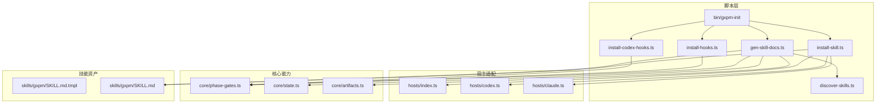
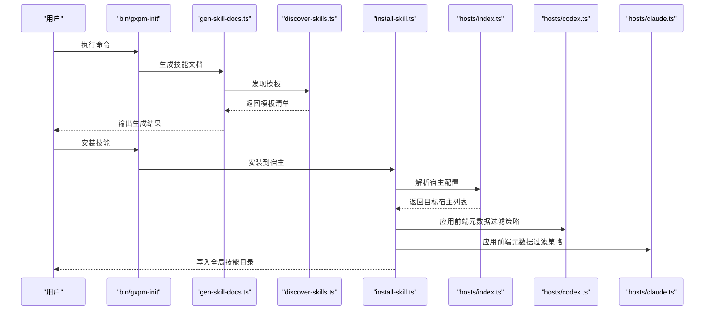
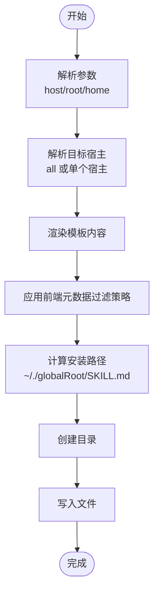
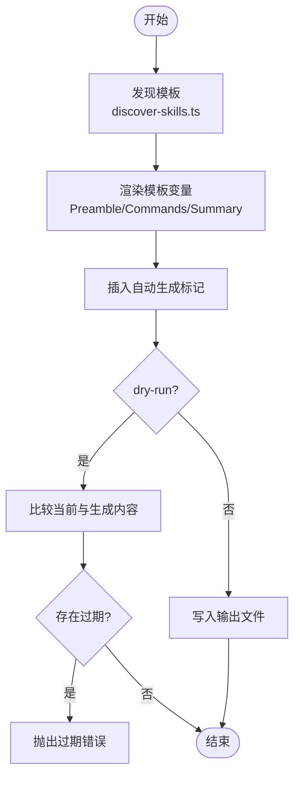
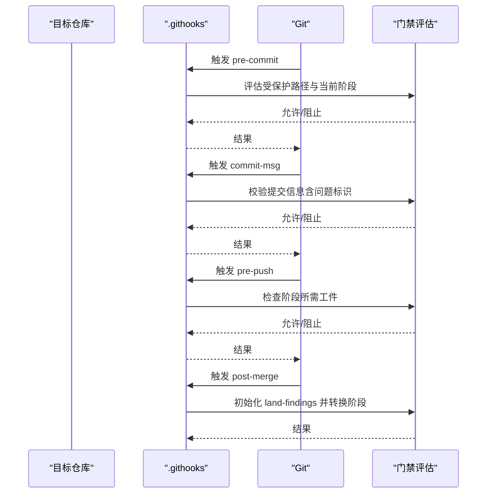
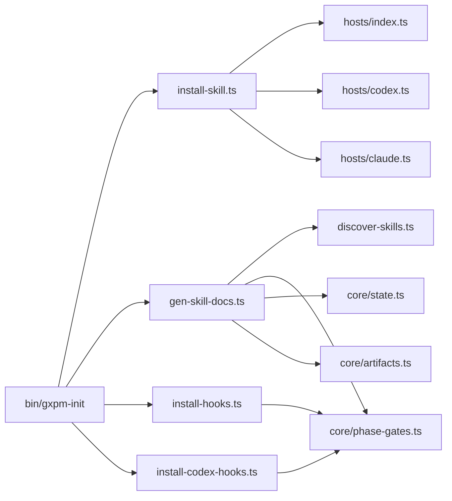

# 技能安装管理

<cite>
**本文引用的文件**
- [scripts/install-skill.ts](file://scripts/install-skill.ts)
- [scripts/gen-skill-docs.ts](file://scripts/gen-skill-docs.ts)
- [scripts/discover-skills.ts](file://scripts/discover-skills.ts)
- [scripts/install-hooks.ts](file://scripts/install-hooks.ts)
- [scripts/install-codex-hooks.ts](file://scripts/install-codex-hooks.ts)
- [bin/gxpm-init](file://bin/gxpm-init)
- [hosts/index.ts](file://hosts/index.ts)
- [hosts/codex.ts](file://hosts/codex.ts)
- [hosts/claude.ts](file://hosts/claude.ts)
- [core/phase-gates.ts](file://core/phase-gates.ts)
- [core/state.ts](file://core/state.ts)
- [core/artifacts.ts](file://core/artifacts.ts)
- [package.json](file://package.json)
- [skills/gxpm/SKILL.md](file://skills/gxpm/SKILL.md)
</cite>

## 目录
1. [简介](#简介)
2. [项目结构](#项目结构)
3. [核心组件](#核心组件)
4. [架构总览](#架构总览)
5. [详细组件分析](#详细组件分析)
6. [依赖关系分析](#依赖关系分析)
7. [性能考量](#性能考量)
8. [故障排查指南](#故障排查指南)
9. [结论](#结论)
10. [附录](#附录)

## 简介
本文件面向 gxpm 的“技能安装管理”子系统，系统性阐述技能安装的完整流程与自动化机制，覆盖以下主题：
- install-skill 脚本的功能、参数与使用方法
- 技能文档生成工具（gen-skill-docs）的配置与定制选项
- 技能包的模板发现、渲染与输出机制
- 技能安装的依赖检查与冲突处理策略
- 技能管理的命令行接口与批量操作方法
- 技能卸载与更新的完整流程
- 技能包的打包、分发与版本管理建议

本说明以仓库中的实际实现为依据，避免臆测，所有技术细节均通过源码路径标注定位。

## 项目结构
该子系统围绕“技能模板 → 文档生成 → 安装到宿主”的流水线组织，关键目录与文件如下：
- scripts：安装与生成脚本集合，包括 install-skill、gen-skill-docs、install-hooks、install-codex-hooks、discover-skills 等
- hosts：宿主适配配置（Codex、Claude），定义全局/本地技能根目录、前端元数据过滤策略等
- skills/gxpm：默认技能模板与最终生成的技能文档
- core：状态机、门禁规则、工件类型等核心能力，为安装后的技能提供运行期支撑
- bin：命令入口（gxpm-init），统一调度各子功能

图表来源
- [scripts/install-skill.ts:1-112](file://scripts/install-skill.ts#L1-L112)
- [scripts/gen-skill-docs.ts:1-165](file://scripts/gen-skill-docs.ts#L1-L165)
- [scripts/discover-skills.ts:1-58](file://scripts/discover-skills.ts#L1-L58)
- [scripts/install-hooks.ts:1-106](file://scripts/install-hooks.ts#L1-L106)
- [scripts/install-codex-hooks.ts:1-214](file://scripts/install-codex-hooks.ts#L1-L214)
- [bin/gxpm-init](file://bin/gxpm-init)
- [hosts/index.ts:1-16](file://hosts/index.ts#L1-L16)
- [hosts/codex.ts:1-19](file://hosts/codex.ts#L1-L19)
- [hosts/claude.ts:1-18](file://hosts/claude.ts#L1-L18)
- [core/phase-gates.ts:1-118](file://core/phase-gates.ts#L1-L118)
- [core/state.ts:1-302](file://core/state.ts#L1-L302)
- [core/artifacts.ts:1-169](file://core/artifacts.ts#L1-L169)
- [skills/gxpm/SKILL.md.tmpl](file://skills/gxpm/SKILL.md.tmpl)
- [skills/gxpm/SKILL.md](file://skills/gxpm/SKILL.md)

章节来源
- [package.json:1-25](file://package.json#L1-L25)

## 核心组件
- 安装器 install-skill.ts：负责将技能模板渲染后写入宿主的全局技能目录；支持按宿主或全部宿主安装；支持自定义 gxpm 根目录与用户主目录
- 文档生成器 gen-skill-docs.ts：扫描模板、渲染变量、生成技能文档；支持干跑检测过期
- 模板发现 discover-skills.ts：递归遍历仓库，收集所有 SKILL.md.tmpl 模板及其输出路径
- 宿主适配 hosts/*：定义不同宿主的安装根目录、前端元数据过滤策略、是否使用环境变量等
- Git 钩子安装器 install-hooks.ts：在目标仓库安装 gxpm 钩子与分发脚本，确保门禁生效
- Codex 钩子安装器 install-codex-hooks.ts：安装 Codex 生命周期钩子，注入 feature flag 与 hooks.json
- 命令入口 bin/gxpm-init：统一入口，根据参数分派到具体脚本

章节来源
- [scripts/install-skill.ts:20-38](file://scripts/install-skill.ts#L20-L38)
- [scripts/gen-skill-docs.ts:28-56](file://scripts/gen-skill-docs.ts#L28-L56)
- [scripts/discover-skills.ts:23-53](file://scripts/discover-skills.ts#L23-L53)
- [bin/gxpm-init:15-38](file://bin/gxpm-init#L15-L38)

## 架构总览
技能安装管理的端到端流程由“模板发现 → 文档生成 → 宿主安装 → 钩子绑定”构成，核心约束来自门禁规则与工件契约，确保阶段推进的强制一致性。

图表来源
- [bin/gxpm-init:15-38](file://bin/gxpm-init#L15-L38)
- [scripts/gen-skill-docs.ts:28-56](file://scripts/gen-skill-docs.ts#L28-L56)
- [scripts/discover-skills.ts:23-53](file://scripts/discover-skills.ts#L23-L53)
- [scripts/install-skill.ts:20-38](file://scripts/install-skill.ts#L20-L38)
- [hosts/index.ts:9-15](file://hosts/index.ts#L9-L15)
- [hosts/codex.ts:3-18](file://hosts/codex.ts#L3-L18)
- [hosts/claude.ts:3-18](file://hosts/claude.ts#L3-L18)

## 详细组件分析

### install-skill 脚本：功能与使用
- 功能概述
  - 将技能模板渲染为宿主可识别的技能文档，写入宿主的全局技能根目录
  - 支持按宿主安装（codex/claude/all），支持自定义 gxpm 根目录与用户主目录
  - 对不同宿主应用不同的前端元数据过滤策略（allowlist 或 preserve）
- 关键流程
  - 解析参数：hostName/root/home
  - 解析目标宿主：all 时返回全部宿主配置
  - 渲染内容：调用文档生成器的渲染函数
  - 应用前端元数据：根据宿主 frontmatter 策略过滤或保留
  - 写入目标：mkdir → 写文件 → 返回安装路径列表
- 参数说明
  - --host：指定宿主名称（codex/claude/all）
  - --root：指定 gxpm 仓库根目录（默认使用脚本所在目录的父目录）
  - --home：覆盖用户主目录（用于测试）
- 使用示例
  - 安装到全部宿主：gxpm-init --install-skill --host all
  - 指定宿主：gxpm-init --install-skill --host codex
  - 自定义根目录：gxpm-init --install-skill --root /path/to/gxpm
  - 自定义主目录：gxpm-init --install-skill --home /tmp/test-home

图表来源
- [scripts/install-skill.ts:79-111](file://scripts/install-skill.ts#L79-L111)
- [scripts/install-skill.ts:40-71](file://scripts/install-skill.ts#L40-L71)

章节来源
- [scripts/install-skill.ts:8-111](file://scripts/install-skill.ts#L8-L111)

### 技能文档生成工具：配置与定制
- 功能概述
  - 扫描仓库中所有 SKILL.md.tmpl 模板，渲染变量并生成对应技能文档
  - 支持干跑模式检测过期文档并报错
  - 在文档头部插入“自动生成”标记，便于后续覆盖控制
- 变量注入
  - 预言（Preamble）：包含宿主信息与环境变量导出
  - 工件读取命令：基于门禁规则生成 artifact read 命令清单
  - 阶段门禁命令：为每个阶段生成初始化命令说明
  - 阶段转换摘要：强调严格阶段推进与所需工件
- 参数说明
  - --host：目标宿主（默认 codex）
  - --root：仓库根目录（默认当前工作目录）
  - --dry-run：仅检测过期模板，不写入
- 定制选项
  - 前端元数据：根据宿主 frontmatter 策略决定保留或过滤
  - 环境变量：部分宿主需要导出 GXPM_ROOT/GXPM_STATE_DIR

图表来源
- [scripts/gen-skill-docs.ts:28-56](file://scripts/gen-skill-docs.ts#L28-L56)
- [scripts/gen-skill-docs.ts:17-82](file://scripts/gen-skill-docs.ts#L17-L82)
- [scripts/discover-skills.ts:23-53](file://scripts/discover-skills.ts#L23-L53)

章节来源
- [scripts/gen-skill-docs.ts:9-165](file://scripts/gen-skill-docs.ts#L9-L165)

### 模板发现与输出映射
- 发现策略
  - 递归遍历仓库，跳过隐藏目录与特定目录集合
  - 匹配文件名为 SKILL.md.tmpl 的条目
  - 输出映射：将 .tmpl 替换为 .md 得到最终输出路径
- 复杂度
  - 时间复杂度：O(N)，N 为文件/目录总数
  - 空间复杂度：O(T)，T 为匹配到的模板数量

章节来源
- [scripts/discover-skills.ts:23-58](file://scripts/discover-skills.ts#L23-L58)

### 宿主适配与前端元数据策略
- 宿主配置
  - codex：usesEnvVars=true，frontmatter.mode=allowlist，keys=["name","description"]
  - claude：usesEnvVars=false，frontmatter.mode=preserve
- 影响
  - allowlist：仅保留允许的前端元数据键，其余过滤
  - preserve：保持原始前端元数据不变

章节来源
- [hosts/codex.ts:3-18](file://hosts/codex.ts#L3-L18)
- [hosts/claude.ts:3-18](file://hosts/claude.ts#L3-L18)
- [hosts/index.ts:1-16](file://hosts/index.ts#L1-L16)

### Git 钩子安装与门禁机制
- 安装范围
  - 在目标仓库 .githooks 下安装四个钩子：pre-commit、commit-msg、pre-push、post-merge
  - 若顶层同名钩子不存在，则写入分发脚本以转发到 gxpm-* 钩子
  - 设置 git config core.hooksPath=.githooks
- 门禁约束
  - pre-commit：阻止对受保护路径的提交（如 apps/、server/、packages/ 等），除非处于允许的阶段
  - commit-msg：要求提交信息包含问题标识（GXG-NNN 或 GXPM-NNN）
  - pre-push：拒绝推送缺少当前阶段所需工件的分支
  - post-merge：自动初始化 land-findings 并触发阶段转换

图表来源
- [scripts/install-hooks.ts:50-103](file://scripts/install-hooks.ts#L50-L103)
- [core/phase-gates.ts:15-23](file://core/phase-gates.ts#L15-L23)

章节来源
- [scripts/install-hooks.ts:1-106](file://scripts/install-hooks.ts#L1-L106)

### Codex 钩子安装与特性开关
- 功能
  - 安装两个生命周期钩子脚本至 .codex/hooks/gxpm-*
  - 合并 hooks.json，确保 SessionStart 与 UserPromptSubmit 注入
  - 自动设置 ~/.codex/config.toml 中的 codex_hooks = true（带时间戳备份）
- 参数
  - --scope：repo 或 user（默认 repo）
  - --target：目标仓库路径（仅 repo 作用域有效）
  - --home：覆盖用户主目录（测试）
  - --no-feature-flag：跳过特性开关设置
- 注意
  - repo 作用域需信任 .codex/ 层并重启 Codex 生效

章节来源
- [scripts/install-codex-hooks.ts:30-95](file://scripts/install-codex-hooks.ts#L30-L95)
- [scripts/install-codex-hooks.ts:166-177](file://scripts/install-codex-hooks.ts#L166-L177)

### 命令行接口与批量操作
- 统一入口
  - bin/gxpm-init：根据参数分派到 install-skill、install-hooks、install-codex-hooks 或 gen-skill-docs
- 常用命令
  - 生成技能文档：gxpm-init
  - 安装技能：gxpm-init --install-skill [--host <codex|claude|all>] [--root <path>] [--home <path>]
  - 安装钩子：gxpm-init --install-hooks --target <repo>
  - 安装 Codex 钩子：gxpm-init --install-codex-hooks [--scope repo|user] [--target <repo>] [--no-feature-flag]
  - 组合安装：gxpm-init --install [--target <repo>]
- 批量操作
  - 宿主批量：--host all
  - 模板批量：gen-skill-docs 会扫描所有模板并生成对应文档

章节来源
- [bin/gxpm-init:15-38](file://bin/gxpm-init#L15-L38)
- [package.json:7-12](file://package.json#L7-L12)

### 卸载与更新流程
- 卸载
  - 删除宿主全局技能目录下的对应技能文件（例如 ~/.codex/skills/gxpm/SKILL.md 或 ~/.claude/skills/gxpm/SKILL.md）
  - 如需清理 Codex 钩子，删除 ~/.codex/hooks/gxpm-* 并从 hooks.json 移除对应条目
- 更新
  - 重新生成技能文档：gxpm-init
  - 重新安装技能：gxpm-init --install-skill --host all
  - 重新安装钩子：gxpm-init --install-hooks --target <repo>
  - 重新安装 Codex 钩子：gxpm-init --install-codex-hooks [--scope repo|user] [--target <repo>]

章节来源
- [scripts/install-skill.ts:20-38](file://scripts/install-skill.ts#L20-L38)
- [scripts/install-hooks.ts:50-103](file://scripts/install-hooks.ts#L50-L103)
- [scripts/install-codex-hooks.ts:30-95](file://scripts/install-codex-hooks.ts#L30-L95)

### 依赖检查与冲突解决
- 依赖检查
  - 宿主配置：install-skill 依赖 hosts/* 提供的 frontmatter 策略与安装根目录
  - 模板发现：gen-skill-docs 依赖 discover-skills.ts 的模板扫描结果
  - 门禁规则：install-hooks.ts 依赖 core/phase-gates.ts 的受保护路径与阶段规则
- 冲突解决
  - 前端元数据冲突：allowlist 模式下仅保留允许键，避免宿主不兼容字段
  - 钩子覆盖：install-hooks.ts 仅在顶层钩子不存在时写入分发脚本，避免覆盖用户自定义钩子
  - 特性开关：install-codex-hooks.ts 仅在缺失时写入 feature flag，并创建备份

章节来源
- [scripts/install-skill.ts:47-71](file://scripts/install-skill.ts#L47-L71)
- [scripts/install-hooks.ts:72-102](file://scripts/install-hooks.ts#L72-L102)
- [scripts/install-codex-hooks.ts:102-134](file://scripts/install-codex-hooks.ts#L102-L134)

### 技能包的打包、分发与版本管理
- 打包
  - 以 skills/*/ 目录为单位进行打包，包含模板与生成后的文档
- 分发
  - 通过 install-skill 将文档复制到各宿主的全局技能目录
  - 通过 install-hooks 将门禁钩子分发到目标仓库
  - 通过 install-codex-hooks 将 Codex 钩子分发到用户或仓库范围
- 版本管理
  - 仓库版本由 package.json 的 version 字段标识
  - 建议在发布前执行 gen-skill-docs 干跑，确保所有文档最新
  - 通过 gxpm-init --install 一键安装新版本的技能与钩子

章节来源
- [package.json:3](file://package.json#L3)
- [scripts/gen-skill-docs.ts:38-56](file://scripts/gen-skill-docs.ts#L38-L56)
- [bin/gxpm-init:28-34](file://bin/gxpm-init#L28-L34)

## 依赖关系分析

图表来源
- [scripts/install-skill.ts:4-6](file://scripts/install-skill.ts#L4-L6)
- [scripts/gen-skill-docs.ts:4-7](file://scripts/gen-skill-docs.ts#L4-L7)
- [scripts/install-hooks.ts:1-3](file://scripts/install-hooks.ts#L1-L3)
- [scripts/install-codex-hooks.ts:1-4](file://scripts/install-codex-hooks.ts#L1-L4)
- [bin/gxpm-init:15-38](file://bin/gxpm-init#L15-L38)

章节来源
- [core/phase-gates.ts:1-118](file://core/phase-gates.ts#L1-L118)
- [core/state.ts:1-302](file://core/state.ts#L1-L302)
- [core/artifacts.ts:1-169](file://core/artifacts.ts#L1-L169)

## 性能考量
- 模板扫描：discover-skills.ts 采用一次遍历，时间复杂度 O(N)，对大型仓库应避免频繁全量扫描
- 文档生成：gen-skill-docs.ts 在 dry-run 模式下仅比较内容，避免不必要的写入
- 文件写入：install-skill.ts 与 install-hooks.ts 在写入前进行目录创建，减少失败重试
- 建议
  - 在 CI 中使用 --dry-run 预检技能文档一致性
  - 对于多宿主安装，优先使用 --host all 一次性完成，减少重复渲染

## 故障排查指南
- 未知宿主
  - 现象：安装时报 Unknown gxpm host
  - 处理：确认 --host 参数为 codex/claude/all 之一
- 模板过期
  - 现象：gen-skill-docs 报错提示过期文档
  - 处理：执行 gxpm-init 重新生成技能文档
- 钩子未生效
  - 现象：git 操作未触发门禁
  - 处理：确认 core.hooksPath 已设置为 .githooks；检查顶层钩子是否被用户自定义覆盖
- Codex 钩子未触发
  - 现象：会话或提示提交未注入信息
  - 处理：确认 ~/.codex/config.toml 存在且包含 codex_hooks = true；repo 作用域需信任 .codex/ 层并重启 Codex

章节来源
- [hosts/index.ts:9-15](file://hosts/index.ts#L9-L15)
- [scripts/gen-skill-docs.ts:51-53](file://scripts/gen-skill-docs.ts#L51-L53)
- [scripts/install-hooks.ts:81-92](file://scripts/install-hooks.ts#L81-L92)
- [scripts/install-codex-hooks.ts:102-134](file://scripts/install-codex-hooks.ts#L102-L134)

## 结论
gxpm 的技能安装管理以“模板 → 文档 → 安装 → 钩子”为主线，结合宿主适配与门禁规则，形成可复用、可审计、可扩展的技能交付体系。通过统一入口与批量操作，团队可以高效地在多宿主环境中部署技能，并借助钩子与工件契约保障阶段推进的强制一致性。

## 附录
- 默认技能文档位置
  - 生成后位于 skills/gxpm/SKILL.md
- 常用命令速查
  - 生成技能文档：gxpm-init
  - 安装技能：gxpm-init --install-skill --host all
  - 安装钩子：gxpm-init --install-hooks --target <repo>
  - 安装 Codex 钩子：gxpm-init --install-codex-hooks
  - 组合安装：gxpm-init --install --target <repo>