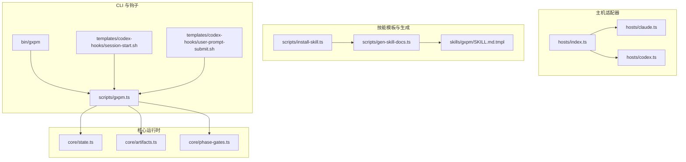
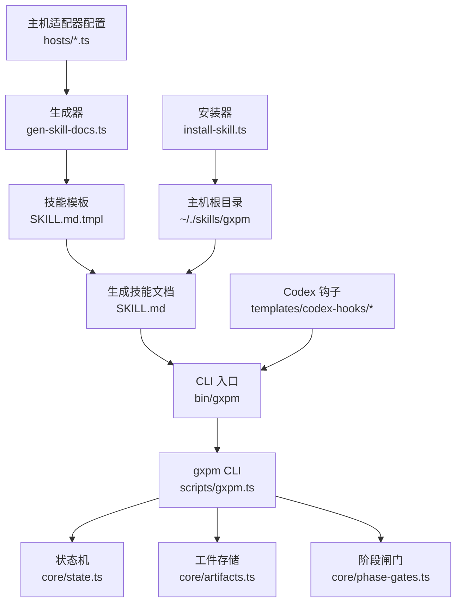
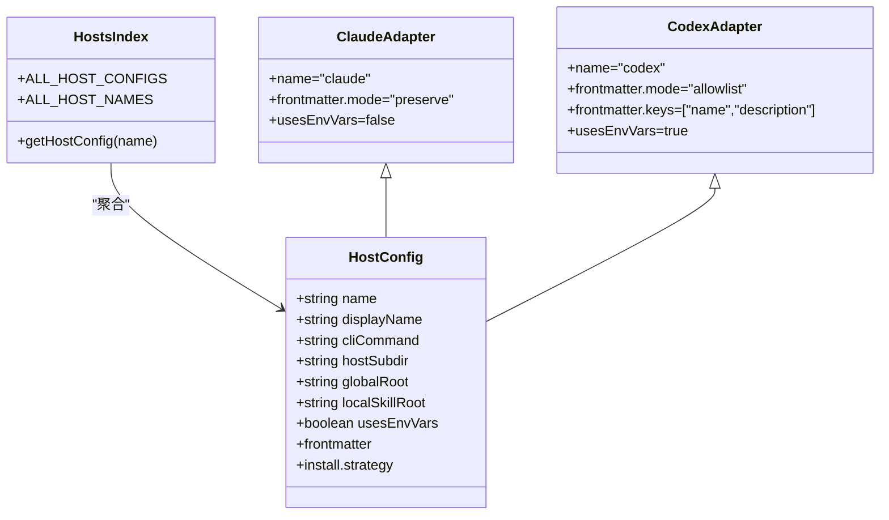
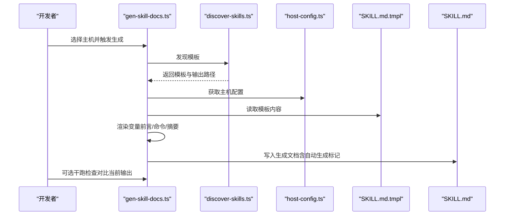
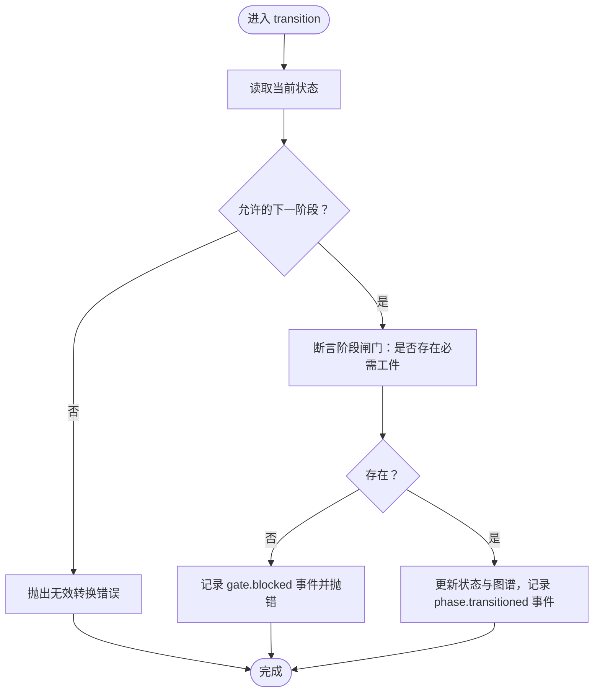
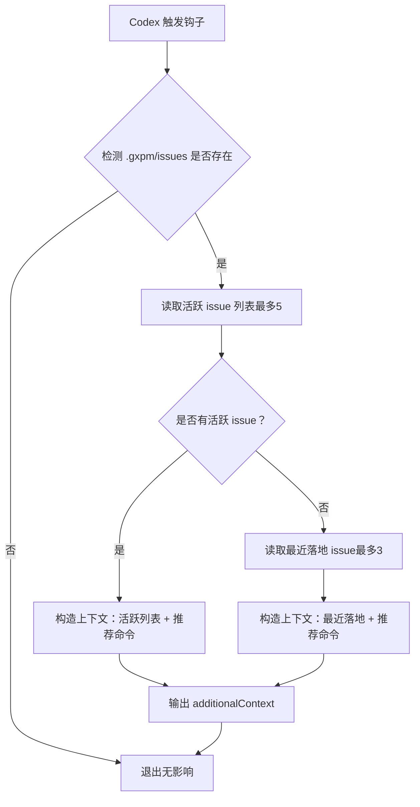
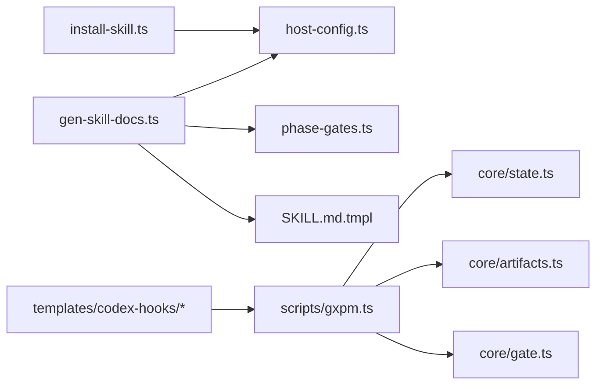

# 技能框架

<cite>
**本文引用的文件**
- [package.json](file://package.json)
- [hosts/index.ts](file://hosts/index.ts)
- [hosts/claude.ts](file://hosts/claude.ts)
- [hosts/codex.ts](file://hosts/codex.ts)
- [scripts/host-config.ts](file://scripts/host-config.ts)
- [scripts/discover-skills.ts](file://scripts/discover-skills.ts)
- [scripts/gen-skill-docs.ts](file://scripts/gen-skill-docs.ts)
- [scripts/install-skill.ts](file://scripts/install-skill.ts)
- [scripts/gxpm.ts](file://scripts/gxpm.ts)
- [core/state.ts](file://core/state.ts)
- [core/artifacts.ts](file://core/artifacts.ts)
- [core/phase-gates.ts](file://core/phase-gates.ts)
- [templates/codex-hooks/session-start.sh](file://templates/codex-hooks/session-start.sh)
- [templates/codex-hooks/user-prompt-submit.sh](file://templates/codex-hooks/user-prompt-submit.sh)
- [skills/gxpm/SKILL.md](file://skills/gxpm/SKILL.md)
- [skills/gxpm/SKILL.md.tmpl](file://skills/gxpm/SKILL.md.tmpl)
- [bin/gxpm](file://bin/gxpm)
- [docs/governance/host-adapter.md](file://docs/governance/host-adapter.md)
- [docs/research/pmc-gstack-skill-study.md](file://docs/research/pmc-gstack-skill-study.md)
</cite>

## 目录
1. [简介](#简介)
2. [项目结构](#项目结构)
3. [核心组件](#核心组件)
4. [架构总览](#架构总览)
5. [详细组件分析](#详细组件分析)
6. [依赖关系分析](#依赖关系分析)
7. [性能考虑](#性能考虑)
8. [故障排查指南](#故障排查指南)
9. [结论](#结论)
10. [附录](#附录)

## 简介
本文件系统化阐述 gxpm 的技能框架设计与实现，重点包括：
- 技能系统的设计理念与架构原则
- 主机适配器（Claude 与 Codex）的工作机制与差异
- 技能模板系统（SKILL.md.tmpl）的使用与扩展方法
- 技能安装、管理和文档生成的完整流程
- 技能开发最佳实践与性能优化建议
- 实际技能示例与集成案例

## 项目结构
仓库采用“功能域 + 层次化组织”的方式：
- hosts：主机适配器配置与注册
- scripts：CLI 与工具脚本（生成技能文档、安装技能、治理检查等）
- core：状态机、工件存储、阶段闸门等核心运行时
- skills：技能模板与已生成的技能文档
- templates：主机侧钩子模板（如 Codex 生命周期钩子）
- docs：治理与研究文档
- bin：可执行入口

图表来源
- [hosts/index.ts:1-16](file://hosts/index.ts#L1-L16)
- [hosts/claude.ts:1-18](file://hosts/claude.ts#L1-L18)
- [hosts/codex.ts:1-19](file://hosts/codex.ts#L1-L19)
- [scripts/gen-skill-docs.ts:1-165](file://scripts/gen-skill-docs.ts#L1-L165)
- [scripts/install-skill.ts:1-112](file://scripts/install-skill.ts#L1-L112)
- [scripts/gxpm.ts:1-630](file://scripts/gxpm.ts#L1-L630)
- [core/state.ts:1-303](file://core/state.ts#L1-L303)
- [core/artifacts.ts:1-169](file://core/artifacts.ts#L1-L169)
- [core/phase-gates.ts:1-118](file://core/phase-gates.ts#L1-L118)
- [bin/gxpm](file://bin/gxpm:1-18)
- [templates/codex-hooks/session-start.sh:1-71](file://templates/codex-hooks/session-start.sh#L1-L71)
- [templates/codex-hooks/user-prompt-submit.sh:1-46](file://templates/codex-hooks/user-prompt-submit.sh#L1-L46)

章节来源
- [package.json:1-25](file://package.json#L1-L25)
- [bin/gxpm](file://bin/gxpm:1-18)

## 核心组件
- 主机适配器配置：定义主机名称、显示名、CLI 命令、全局/本地技能根路径、是否使用环境变量、frontmatter 策略、安装策略等。
- 技能模板系统：通过 SKILL.md.tmpl 与生成器，结合主机配置动态渲染 SKILL.md。
- 核心运行时：状态机（issue 状态与阶段）、工件存储（artifact）、阶段闸门（phase gates）。
- CLI 与钩子：gxpm CLI 提供 issue/artifact/gate 等命令；Codex 钩子提供会话与提示注入。

章节来源
- [scripts/host-config.ts:1-83](file://scripts/host-config.ts#L1-L83)
- [scripts/discover-skills.ts:1-58](file://scripts/discover-skills.ts#L1-L58)
- [scripts/gen-skill-docs.ts:17-133](file://scripts/gen-skill-docs.ts#L17-L133)
- [scripts/install-skill.ts:20-71](file://scripts/install-skill.ts#L20-L71)
- [core/state.ts:28-57](file://core/state.ts#L28-L57)
- [core/artifacts.ts:28-41](file://core/artifacts.ts#L28-L41)
- [core/phase-gates.ts:25-30](file://core/phase-gates.ts#L25-L30)

## 架构总览
gxpm 将“项目管理状态机 + 能力运行时 + 证据存储 + 闸门控制”整合为统一技能表面，通过主机适配器屏蔽底层差异，使技能内容可按主机参数化生成与安装。

图表来源
- [hosts/index.ts:1-16](file://hosts/index.ts#L1-L16)
- [scripts/gen-skill-docs.ts:17-56](file://scripts/gen-skill-docs.ts#L17-L56)
- [scripts/install-skill.ts:20-38](file://scripts/install-skill.ts#L20-L38)
- [scripts/gxpm.ts:1-630](file://scripts/gxpm.ts#L1-L630)
- [core/state.ts:1-303](file://core/state.ts#L1-L303)
- [core/artifacts.ts:1-169](file://core/artifacts.ts#L1-L169)
- [core/phase-gates.ts:1-118](file://core/phase-gates.ts#L1-L118)
- [templates/codex-hooks/session-start.sh:1-71](file://templates/codex-hooks/session-start.sh#L1-L71)
- [templates/codex-hooks/user-prompt-submit.sh:1-46](file://templates/codex-hooks/user-prompt-submit.sh#L1-L46)

## 详细组件分析

### 主机适配器工作机制（Claude 与 Codex）
- 配置字段与约束：主机配置包含名称、显示名、CLI 命令、主机子目录、全局/本地技能根、是否使用环境变量、frontmatter 策略（保留/白名单）、安装策略（拷贝/符号链接），并通过校验函数确保字段格式与唯一性。
- Claude 适配器：使用保留 frontmatter 策略，不强制过滤元数据；安装策略为拷贝。
- Codex 适配器：使用白名单 frontmatter 策略，仅允许指定键；安装策略为拷贝；支持环境变量注入。
- 注册与查询：通过 hosts/index.ts 汇总所有主机配置，提供按名称查找与未知主机错误处理。

图表来源
- [scripts/host-config.ts:11-23](file://scripts/host-config.ts#L11-L23)
- [hosts/index.ts:1-16](file://hosts/index.ts#L1-L16)
- [hosts/claude.ts:3-17](file://hosts/claude.ts#L3-L17)
- [hosts/codex.ts:3-18](file://hosts/codex.ts#L3-L18)

章节来源
- [scripts/host-config.ts:29-82](file://scripts/host-config.ts#L29-L82)
- [hosts/index.ts:9-15](file://hosts/index.ts#L9-L15)
- [hosts/claude.ts:3-17](file://hosts/claude.ts#L3-L17)
- [hosts/codex.ts:3-18](file://hosts/codex.ts#L3-L18)
- [docs/governance/host-adapter.md:18-26](file://docs/governance/host-adapter.md#L18-L26)

### 技能模板系统与生成流程
- 模板发现：遍历仓库，跳过隐藏目录与常见忽略目录，收集所有 SKILL.md.tmpl 文件，输出模板与目标路径映射。
- 渲染变量：
  - 前言（Host Preamble）：根据主机是否使用环境变量决定注入内容。
  - 工件读取命令：基于阶段闸门规则生成。
  - 阶段闸门命令：为每个阶段生成初始化命令与说明。
  - 阶段转换摘要：汇总严格转换规则。
- 生成与安装：
  - 生成：将渲染结果写入 SKILL.md，并在存在 frontmatter 时插入自动生成标记。
  - 安装：按主机配置计算全局安装路径，写入 SKILL.md；支持对 frontmatter 的白名单过滤（保留模式则不做处理）。

图表来源
- [scripts/gen-skill-docs.ts:28-56](file://scripts/gen-skill-docs.ts#L28-L56)
- [scripts/discover-skills.ts:23-53](file://scripts/discover-skills.ts#L23-L53)
- [scripts/gen-skill-docs.ts:84-102](file://scripts/gen-skill-docs.ts#L84-L102)
- [scripts/gen-skill-docs.ts:104-133](file://scripts/gen-skill-docs.ts#L104-L133)
- [scripts/install-skill.ts:20-38](file://scripts/install-skill.ts#L20-L38)

章节来源
- [scripts/discover-skills.ts:23-53](file://scripts/discover-skills.ts#L23-L53)
- [scripts/gen-skill-docs.ts:17-82](file://scripts/gen-skill-docs.ts#L17-L82)
- [scripts/gen-skill-docs.ts:84-133](file://scripts/gen-skill-docs.ts#L84-L133)
- [scripts/install-skill.ts:20-71](file://scripts/install-skill.ts#L20-L71)

### 核心运行时：状态机、工件与闸门
- 状态机：定义阶段集合、issue 状态结构、事件记录、路径解析、创建/读取/过渡、归档、下一阶段推导与闸门断言。
- 工件：定义工种类别、写入/读取/列表/存在性检查、索引维护与事件记录。
- 阶段闸门：定义阶段间转换所需工件、命令占位符、缺失工件时的阻断与事件记录。

图表来源
- [core/state.ts:150-205](file://core/state.ts#L150-L205)
- [core/state.ts:253-302](file://core/state.ts#L253-L302)
- [core/phase-gates.ts:25-30](file://core/phase-gates.ts#L25-L30)
- [core/phase-gates.ts:107-117](file://core/phase-gates.ts#L107-L117)

章节来源
- [core/state.ts:28-57](file://core/state.ts#L28-L57)
- [core/artifacts.ts:28-41](file://core/artifacts.ts#L28-L41)
- [core/phase-gates.ts:32-99](file://core/phase-gates.ts#L32-L99)

### CLI 与闸门执行流程
- CLI 解析：bin/gxpm 解析为 scripts/gxpm.ts，按命令分派到各子系统。
- 闸门评估：pre-commit/commit-msg/pre-push/post-merge 评估当前 issue 状态与工件，记录事件并返回允许/阻止结果。
- 交互编辑：artifact edit 使用临时文件与编辑器，校验 JSON 后写回工件。

```mermaid
sequenceDiagram
participant User as "用户"
participant Bin as "bin/gxpm"
participant CLI as "scripts/gxpm.ts"
participant State as "core/state.ts"
participant Gate as "core/gate.ts"
participant Art as "core/artifacts.ts"
User->>Bin : 执行命令
Bin->>CLI : 调用入口
CLI->>CLI : 解析参数与子命令
CLI->>State : 读取/更新状态
CLI->>Art : 读取/写入工件
CLI->>Gate : 评估闸门
Gate-->>CLI : 允许/阻止 + 原因
CLI-->>User : 输出结果/错误
```

图表来源
- [bin/gxpm](file://bin/gxpm:1-18)
- [scripts/gxpm.ts:33-265](file://scripts/gxpm.ts#L33-L265)
- [scripts/gxpm.ts:502-622](file://scripts/gxpm.ts#L502-L622)

章节来源
- [bin/gxpm](file://bin/gxpm:1-18)
- [scripts/gxpm.ts:33-265](file://scripts/gxpm.ts#L33-L265)

### Codex 生命周期钩子（可选层）
- SessionStart：当 Codex 打开会话且检测到 .gxpm/issues 存在时，注入当前活跃 issue 列表与最近落地 issue 的简要信息，以及推荐命令。
- UserPromptSubmit：当用户提示中包含跟踪中的 issue 编号时，注入该 issue 的状态与下一步建议。

图表来源
- [templates/codex-hooks/session-start.sh:21-70](file://templates/codex-hooks/session-start.sh#L21-L70)

章节来源
- [templates/codex-hooks/session-start.sh:1-71](file://templates/codex-hooks/session-start.sh#L1-L71)
- [templates/codex-hooks/user-prompt-submit.sh:1-46](file://templates/codex-hooks/user-prompt-submit.sh#L1-L46)

## 依赖关系分析
- 组件耦合：
  - 生成器依赖主机配置与阶段闸门规则，以保证生成内容与运行时一致。
  - CLI 依赖状态机、工件与闸门模块，形成闭环的执行与审计。
  - 钩子与 CLI 通过 gxpm 命令交互，形成“会话增强 + 物理闸门”的双层防御。
- 外部依赖：
  - Bun 运行时与 Node 生态（fs/path 等）。
  - Codex CLI（可选）用于生命周期钩子。

图表来源
- [scripts/gen-skill-docs.ts:5-7](file://scripts/gen-skill-docs.ts#L5-L7)
- [scripts/gxpm.ts:1-31](file://scripts/gxpm.ts#L1-L31)
- [scripts/install-skill.ts:4-6](file://scripts/install-skill.ts#L4-L6)
- [templates/codex-hooks/session-start.sh:1-71](file://templates/codex-hooks/session-start.sh#L1-L71)

章节来源
- [scripts/gen-skill-docs.ts:5-7](file://scripts/gen-skill-docs.ts#L5-L7)
- [scripts/gxpm.ts:1-31](file://scripts/gxpm.ts#L1-L31)
- [scripts/install-skill.ts:4-6](file://scripts/install-skill.ts#L4-L6)

## 性能考虑
- 生成阶段：
  - 模板发现递归遍历，建议在大型仓库中保持合理的目录结构，避免不必要的子目录。
  - 渲染与写入为顺序操作，批量生成时注意磁盘 IO。
- 运行时：
  - 工件读写与事件追加为小文件操作，通常开销较小。
  - 闸门断言通过文件存在性判断，建议在 CI 中预置必要工件以避免失败重试。
- 钩子：
  - Shell 钩子依赖 gxpm 与 python3，若缺失会静默退出，不影响工作流但会损失上下文增强。

## 故障排查指南
- 未知命令/参数错误：CLI 会在命令解析失败时抛出错误，请检查命令拼写与参数顺序。
- 无效阶段转换：当下一阶段与允许阶段不一致或缺少必需工件时会抛错，按提示先初始化相应工件再过渡。
- 闸门阻止：pre-commit/pre-push 等会根据受保护路径与工件存在性进行拦截，查看详细原因与建议命令。
- 医学检查（doctor）：提供机器与人类可读的诊断报告，定位安装与配置问题。
- 干跑生成：gen-skill-docs 支持干跑模式，列出与当前内容不一致的生成文档，便于审阅与回归。

章节来源
- [scripts/gxpm.ts:264](file://scripts/gxpm.ts#L264)
- [core/state.ts:157-163](file://core/state.ts#L157-L163)
- [core/state.ts:299-301](file://core/state.ts#L299-L301)
- [scripts/gxpm.ts:502-530](file://scripts/gxpm.ts#L502-L530)
- [scripts/gxpm.ts:567-594](file://scripts/gxpm.ts#L567-L594)
- [scripts/gxpm.ts:65-75](file://scripts/gxpm.ts#L65-L75)

## 结论
gxpm 通过“主机适配器 + 模板生成 + 核心运行时 + CLI/钩子”的组合，实现了可移植、可审计、可扩展的技能框架。Claude 与 Codex 适配器分别满足“保留元数据”与“白名单元数据”的差异化需求；阶段闸门与工件契约确保了交付质量与可追溯性；模板系统与安装器降低了技能分发与维护成本。建议在新主机接入时遵循治理文档，优先通过适配器参数化差异，而非在生成器或脚本中散落分支逻辑。

## 附录

### 技能安装与管理流程
- 生成技能文档：针对选定主机，扫描模板并渲染输出。
- 安装技能：将生成的 SKILL.md 写入主机全局技能根目录。
- 验证与回归：使用干跑模式检查生成一致性；运行测试与检查脚本。

章节来源
- [scripts/gen-skill-docs.ts:28-56](file://scripts/gen-skill-docs.ts#L28-L56)
- [scripts/install-skill.ts:20-38](file://scripts/install-skill.ts#L20-L38)
- [docs/governance/host-adapter.md:18-26](file://docs/governance/host-adapter.md#L18-L26)

### 技能开发最佳实践
- 使用阶段闸门规则驱动阶段推进，避免绕过工件写入。
- 将复杂差异抽象为适配器，保持生成器与脚本的通用性。
- 通过钩子增强用户体验，但不依赖钩子作为唯一保障。
- 保持 frontmatter 的最小必要集，避免主机间泄露路径与敏感信息。

章节来源
- [docs/governance/host-adapter.md:41-47](file://docs/governance/host-adapter.md#L41-L47)
- [hosts/codex.ts:11-18](file://hosts/codex.ts#L11-L18)
- [hosts/claude.ts:11-17](file://hosts/claude.ts#L11-L17)

### 实际技能示例与集成案例
- 示例技能：skills/gxpm/SKILL.md 展示了完整的命令、阶段、工件与钩子集成说明。
- 案例参考：PMC 与 gstack 的研究文档总结了能力边界与迁移方向，有助于设计新的技能模块。

章节来源
- [skills/gxpm/SKILL.md:1-357](file://skills/gxpm/SKILL.md#L1-L357)
- [docs/research/pmc-gstack-skill-study.md:73-123](file://docs/research/pmc-gstack-skill-study.md#L73-L123)