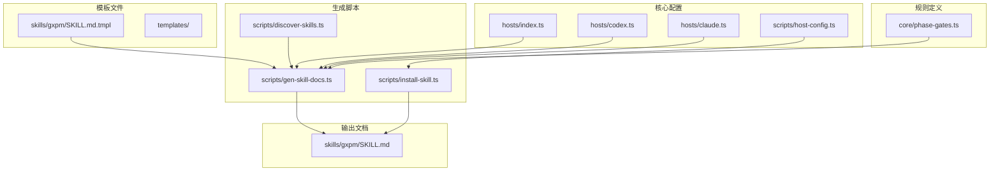
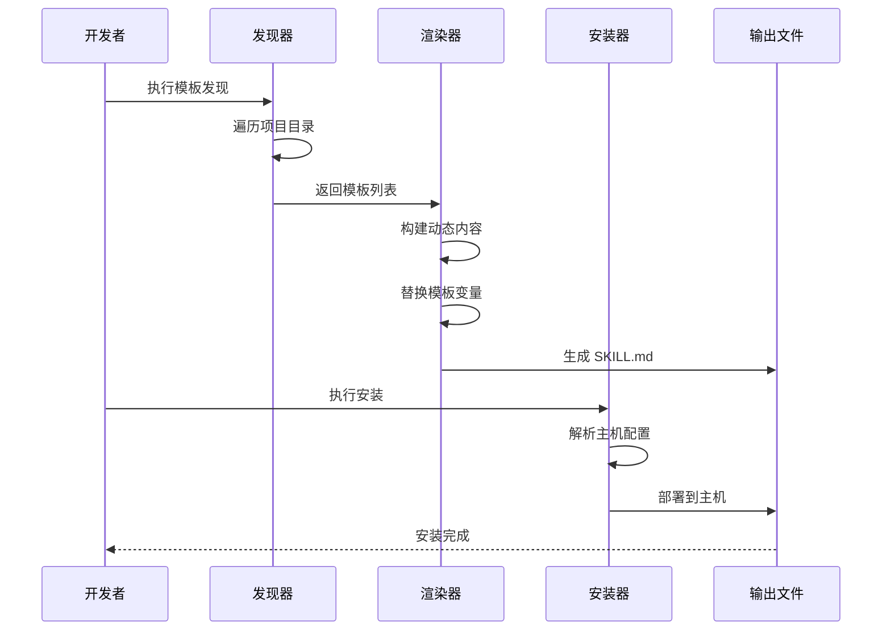
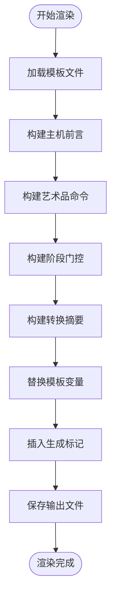
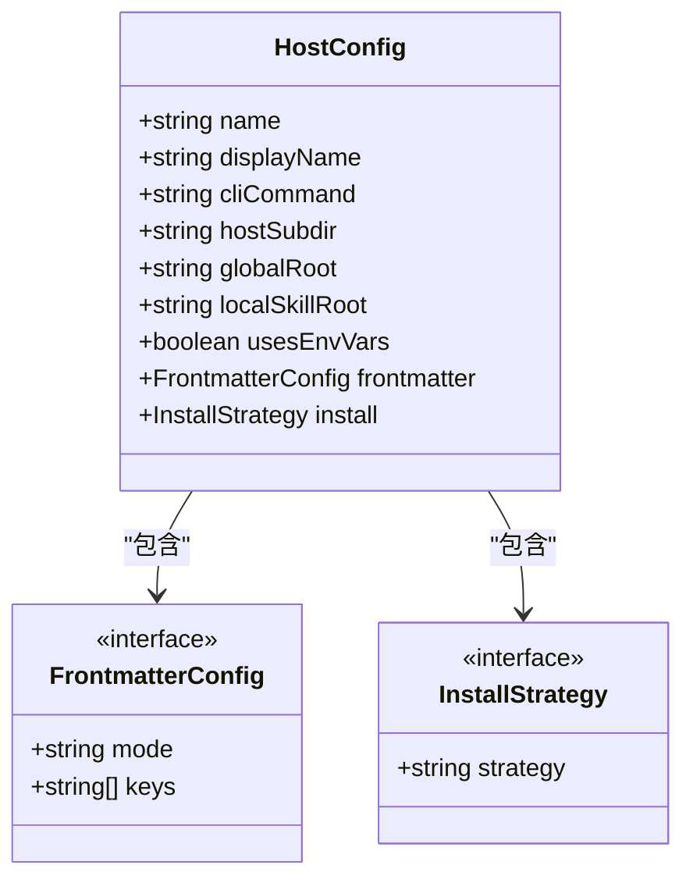
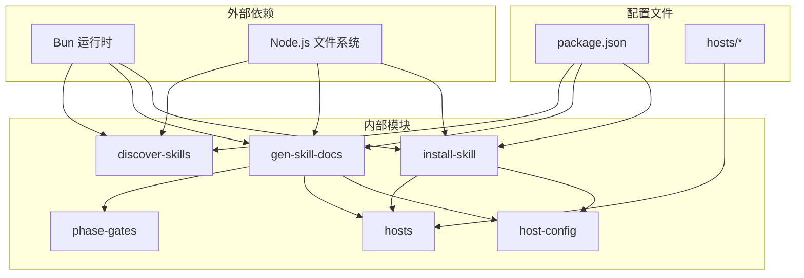

# 技能模板系统

<cite>
**本文档引用的文件**
- [SKILL.md](file://skills/gxpm/SKILL.md)
- [SKILL.md.tmpl](file://skills/gxpm/SKILL.md.tmpl)
- [gen-skill-docs.ts](file://scripts/gen-skill-docs.ts)
- [discover-skills.ts](file://scripts/discover-skills.ts)
- [install-skill.ts](file://scripts/install-skill.ts)
- [phase-gates.ts](file://core/phase-gates.ts)
- [index.ts](file://hosts/index.ts)
- [codex.ts](file://hosts/codex.ts)
- [claude.ts](file://hosts/claude.ts)
- [host-config.ts](file://scripts/host-config.ts)
- [package.json](file://package.json)
</cite>

## 目录
1. [简介](#简介)
2. [项目结构](#项目结构)
3. [核心组件](#核心组件)
4. [架构概览](#架构概览)
5. [详细组件分析](#详细组件分析)
6. [依赖关系分析](#依赖关系分析)
7. [性能考虑](#性能考虑)
8. [故障排除指南](#故障排除指南)
9. [结论](#结论)
10. [附录](#附录)

## 简介

技能模板系统是 gxpm 项目管理框架中的核心组成部分，负责生成标准化的技能文档（SKILL.md）。该系统通过模板渲染机制，将动态生成的内容注入到统一的文档结构中，确保不同主机环境下的技能文档保持一致性和可维护性。

系统采用"模板 + 动态内容"的混合模式，既保证了文档的标准化格式，又提供了足够的灵活性来适配不同的主机环境和配置需求。

## 项目结构

技能模板系统主要分布在以下目录和文件中：



**图表来源**
- [SKILL.md.tmpl:1-320](file://skills/gxpm/SKILL.md.tmpl#L1-L320)
- [gen-skill-docs.ts:1-165](file://scripts/gen-skill-docs.ts#L1-L165)
- [discover-skills.ts:1-58](file://scripts/discover-skills.ts#L1-L58)
- [install-skill.ts:1-112](file://scripts/install-skill.ts#L1-L112)

**章节来源**
- [package.json:1-25](file://package.json#L1-L25)
- [SKILL.md.tmpl:1-320](file://skills/gxpm/SKILL.md.tmpl#L1-L320)

## 核心组件

### 模板引擎组件

技能模板系统的核心是一个轻量级的模板渲染引擎，负责将动态内容注入到静态模板中。

#### 模板变量系统
系统支持以下模板变量：
- `{{PREAMBLE}}`: 主机前言信息
- `{{ARTIFACT_READ_COMMANDS}}`: 艺术品读取命令列表
- `{{PHASE_GATE_COMMANDS}}`: 阶段门控命令说明
- `{{PHASE_TRANSITION_SUMMARY}}`: 阶段转换摘要

#### 渲染流程
1. **模板加载**: 从 SKILL.md.tmpl 文件读取模板内容
2. **变量构建**: 生成动态内容的各个部分
3. **内容替换**: 使用字符串替换机制注入变量
4. **标记插入**: 添加自动生成标记
5. **输出生成**: 写入最终的 SKILL.md 文件

**章节来源**
- [gen-skill-docs.ts:17-82](file://scripts/gen-skill-docs.ts#L17-L82)

### 发现器组件

发现器负责扫描整个代码库，自动识别所有技能模板文件。

#### 扫描策略
- **递归遍历**: 遍历整个项目目录结构
- **过滤规则**: 跳过隐藏目录和构建产物目录
- **文件匹配**: 仅识别名为 SKILL.md.tmpl 的文件
- **路径规范化**: 统一处理不同操作系统的路径分隔符

#### 路径过滤规则
系统会跳过以下目录：
- 版本控制相关目录：`.git`, `.gstack`, `.omc`
- 主机特定目录：`.agents`, `.claude`, `.codex`
- 构建产物目录：`build`, `coverage`, `dist`, `node_modules`

**章节来源**
- [discover-skills.ts:9-21](file://scripts/discover-skills.ts#L9-L21)
- [discover-skills.ts:23-53](file://scripts/discover-skills.ts#L23-L53)

### 安装器组件

安装器负责将生成的技能文档部署到目标主机环境中。

#### 安装策略
- **多主机支持**: 支持同时安装到多个主机环境
- **路径解析**: 自动计算目标安装路径
- **前置创建**: 确保安装目录存在
- **文件写入**: 将最终文档写入目标位置

#### 主机配置
系统支持两种主机配置模式：
- **允许清单模式**: 仅保留指定的元数据字段
- **保留模式**: 完全保留原始元数据

**章节来源**
- [install-skill.ts:20-38](file://scripts/install-skill.ts#L20-L38)
- [host-config.ts:1-23](file://scripts/host-config.ts#L1-L23)

## 架构概览

技能模板系统采用模块化设计，各组件职责明确，耦合度低。



**图表来源**
- [discover-skills.ts:23-53](file://scripts/discover-skills.ts#L23-L53)
- [gen-skill-docs.ts:28-56](file://scripts/gen-skill-docs.ts#L28-L56)
- [install-skill.ts:20-38](file://scripts/install-skill.ts#L20-L38)

## 详细组件分析

### SKILL.md 模板结构分析

#### 元数据规范
SKILL.md 模板遵循标准的 YAML 元数据格式：

```yaml
---
name: gxpm
description: Second-generation project management product designed to replace PMC and gstack with one native state graph, capability runtime, browser evidence layer, and agent delivery workflow.
---
```

#### 标准化字段定义
- **name**: 技能名称，用于标识和分类
- **description**: 技能描述，提供功能概述
- **其他字段**: 可根据需要扩展

#### 内容结构
模板采用 Markdown 格式，包含以下标准章节：
1. **主机前言**: 主机特定的环境配置说明
2. **角色说明**: 技能在项目管理中的职责
3. **状态优先**: 状态驱动的工作流程
4. **阶段映射**: 完整的阶段转换图
5. **必需习惯**: 最佳实践和行为准则
6. **工件管理**: 艺术品的创建和验证
7. **钩子集成**: Git 钩子和运行时钩子

**章节来源**
- [SKILL.md.tmpl:1-4](file://skills/gxpm/SKILL.md.tmpl#L1-L4)
- [SKILL.md.tmpl:8-96](file://skills/gxpm/SKILL.md.tmpl#L8-L96)

### 模板变量替换机制

#### 动态内容生成
系统通过以下函数生成动态内容：



**图表来源**
- [gen-skill-docs.ts:65-82](file://scripts/gen-skill-docs.ts#L65-L82)
- [gen-skill-docs.ts:84-133](file://scripts/gen-skill-docs.ts#L84-L133)

#### 变量替换规则
- **PREAMBLE**: 包含主机特定的环境变量设置
- **ARTIFACT_READ_COMMANDS**: 自动生成所有必需的艺术品读取命令
- **PHASE_GATE_COMMANDS**: 为每个阶段转换生成具体的命令说明
- **PHASE_TRANSITION_SUMMARY**: 提供阶段转换的约束条件摘要

**章节来源**
- [gen-skill-docs.ts:104-133](file://scripts/gen-skill-docs.ts#L104-L133)
- [phase-gates.ts:32-99](file://core/phase-gates.ts#L32-L99)

### 阶段门控规则系统

#### 规则定义
阶段门控规则定义了严格的阶段转换约束：


**图表来源**
- [phase-gates.ts:32-99](file://core/phase-gates.ts#L32-L99)

#### 艺术品约束
每个阶段转换都要求特定的艺术品存在：
- triage → plan: 需要 acceptance-contract
- plan → dispatch: 需要 implementation-plan
- dispatch → implement: 需要 dispatch-handoff
- implement → local-verify: 需要 local-verify
- local-verify → ac-check: 需要 acceptance-check
- ac-check → self-review: 需要 self-review
- self-review → ship: 需要 ship-readiness
- ship → pr-check: 需要 pr-check
- pr-check → verify: 需要 verify-findings
- verify → qa: 需要 qa-findings
- qa → land: 需要 land-findings

**章节来源**
- [phase-gates.ts:25-30](file://core/phase-gates.ts#L25-L30)
- [phase-gates.ts:32-99](file://core/phase-gates.ts#L32-L99)

### 主机配置系统

#### 配置接口
主机配置定义了不同主机环境的特定属性：



**图表来源**
- [host-config.ts:11-23](file://scripts/host-config.ts#L11-L23)

#### 主机配置示例
系统内置两种主机配置：

1. **Codex 主机配置**:
   - 使用环境变量
   - 允许清单模式的元数据处理
   - 复制安装策略

2. **Claude 主机配置**:
   - 不使用环境变量
   - 保留原始元数据
   - 复制安装策略

**章节来源**
- [codex.ts:3-18](file://hosts/codex.ts#L3-L18)
- [claude.ts:3-17](file://hosts/claude.ts#L3-L17)

## 依赖关系分析

技能模板系统的依赖关系相对简单，主要依赖于核心规则定义和主机配置。



**图表来源**
- [package.json:13-16](file://package.json#L13-L16)
- [gen-skill-docs.ts:1-7](file://scripts/gen-skill-docs.ts#L1-L7)
- [discover-skills.ts:1-2](file://scripts/discover-skills.ts#L1-L2)
- [install-skill.ts:1-6](file://scripts/install-skill.ts#L1-L6)

**章节来源**
- [package.json:13-16](file://package.json#L13-L16)

## 性能考虑

技能模板系统在设计时充分考虑了性能优化：

### 时间复杂度分析
- **模板发现**: O(n)，其中 n 是项目中的文件数量
- **模板渲染**: O(m)，其中 m 是模板变量的数量
- **文件写入**: O(k)，其中 k 是输出文件的大小

### 内存使用优化
- **流式处理**: 模板文件以流式方式读取和处理
- **增量生成**: 仅在必要时重新生成文件
- **缓存机制**: 利用 Bun 的内置缓存提高执行效率

### I/O 优化
- **批量操作**: 同时处理多个模板文件
- **目录预创建**: 在写入前确保目标目录存在
- **原子写入**: 使用一次性写入避免部分写入

## 故障排除指南

### 常见问题及解决方案

#### 模板未找到
**症状**: 模板发现器无法找到 SKILL.md.tmpl 文件
**原因**: 
- 模板文件位于被跳过的目录中
- 文件名不正确
- 权限问题

**解决方案**:
1. 确认模板文件位于正确的路径
2. 检查文件名是否为 SKILL.md.tmpl
3. 验证文件权限

#### 渲染错误
**症状**: 模板渲染失败或输出为空
**原因**:
- 模板变量未正确替换
- 动态内容生成失败
- 文件写入权限不足

**解决方案**:
1. 检查模板中的变量占位符
2. 验证动态内容生成逻辑
3. 确认输出目录权限

#### 主机配置错误
**症状**: 安装过程失败或配置不正确
**原因**:
- 主机配置验证失败
- 安装路径不存在
- 元数据处理错误

**解决方案**:
1. 使用 `validateHostConfig` 函数检查配置
2. 确认安装目标路径有效
3. 验证元数据字段的合法性

**章节来源**
- [host-config.ts:29-63](file://scripts/host-config.ts#L29-L63)
- [gen-skill-docs.ts:135-150](file://scripts/gen-skill-docs.ts#L135-L150)

## 结论

技能模板系统通过精心设计的架构和标准化的流程，成功实现了技能文档的自动化生成和部署。系统的主要优势包括：

1. **标准化**: 统一的文档格式和结构
2. **可扩展性**: 支持多种主机环境和配置
3. **自动化**: 减少手动维护工作量
4. **一致性**: 确保不同环境下的文档一致性

该系统为 gxpm 项目管理框架提供了坚实的基础，使得技能文档能够随着项目的发展而动态演进，同时保持高质量和可维护性。

## 附录

### 最佳实践建议

#### 模板设计
- 使用清晰的语义化命名
- 保持模板结构的一致性
- 提供充足的注释和说明
- 定期审查和更新模板内容

#### 模板定制方法
1. **字段扩展**: 在元数据中添加自定义字段
2. **内容调整**: 修改现有章节的内容结构
3. **新章节添加**: 根据需要添加新的内容章节
4. **样式定制**: 调整文档的视觉呈现

#### 扩展字段添加指南
1. **定义字段**: 在元数据中添加新的字段定义
2. **模板集成**: 在模板中添加相应的占位符
3. **渲染逻辑**: 更新渲染器以处理新字段
4. **验证测试**: 添加单元测试验证新功能

#### 实际使用示例
- **开发环境**: 使用 `bun run scripts/gen-skill-docs.ts --host codex`
- **生产环境**: 使用 `bun run scripts/install-skill.ts --host all`
- **调试模式**: 使用 `bun run scripts/gen-skill-docs.ts --dry-run`