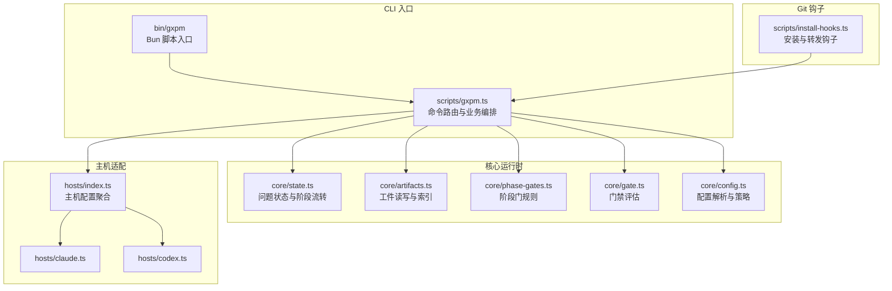
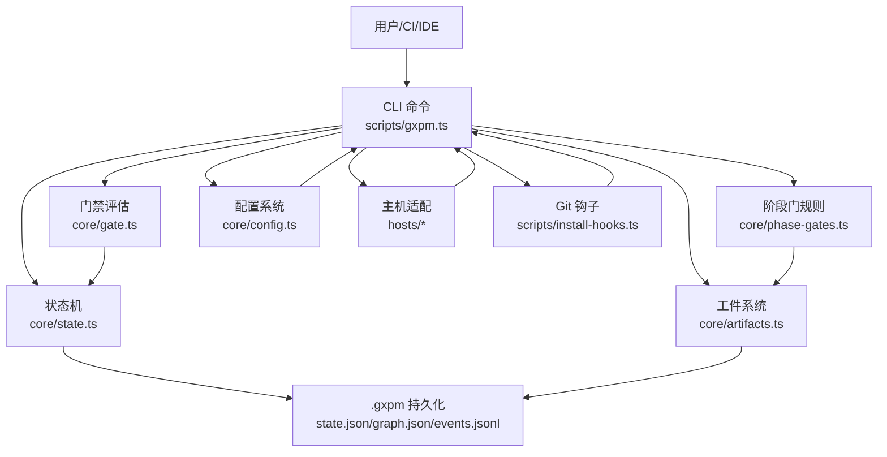
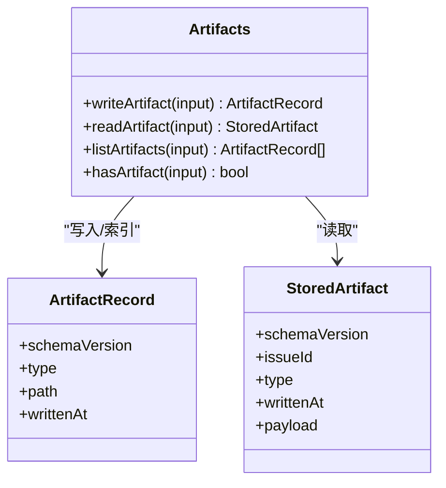
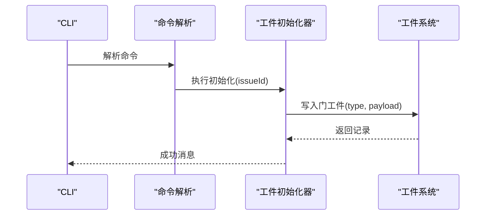
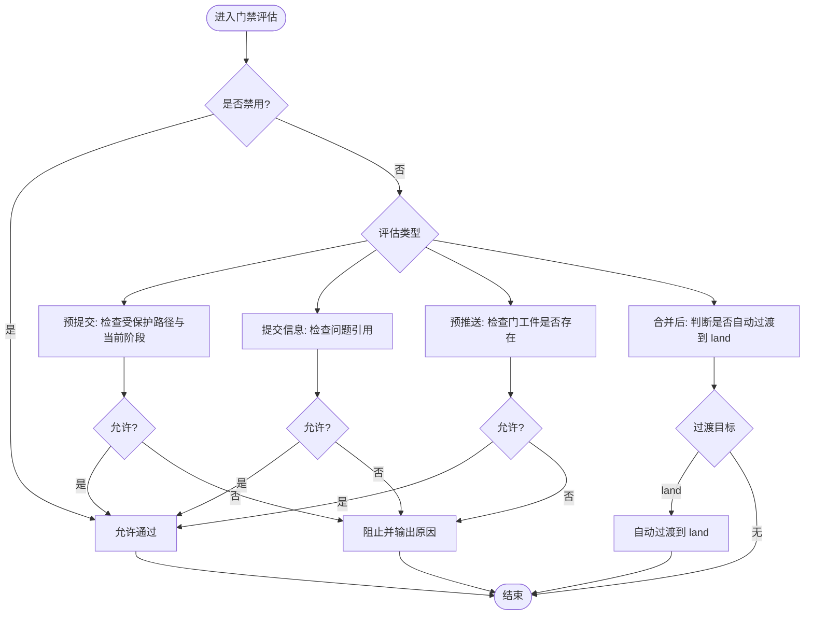
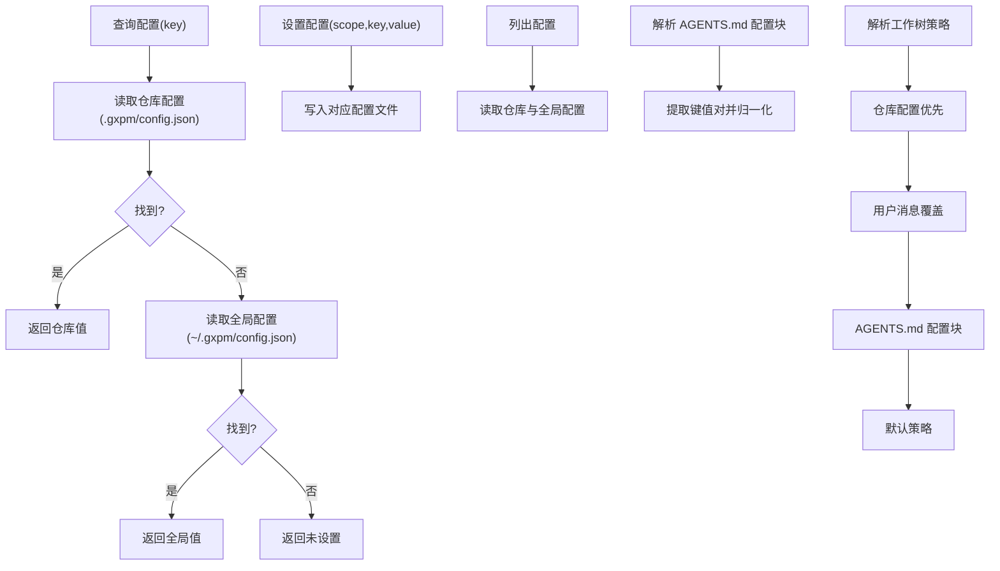
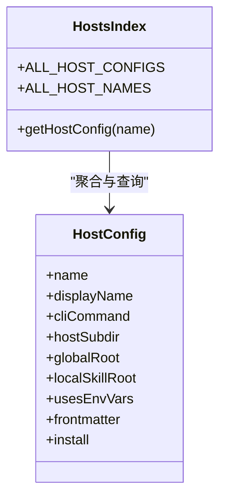
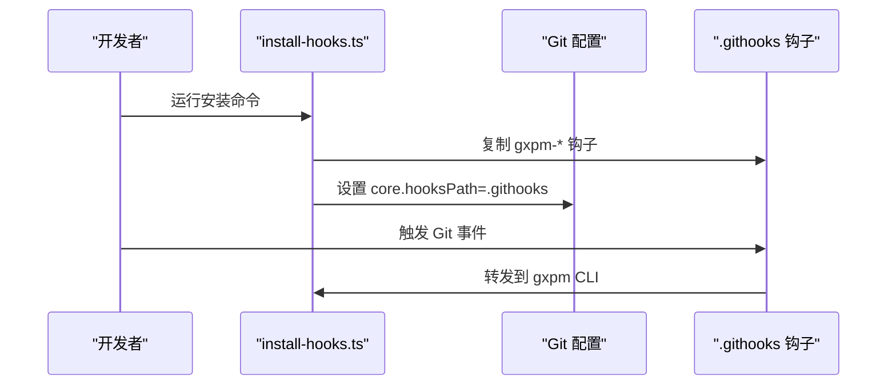
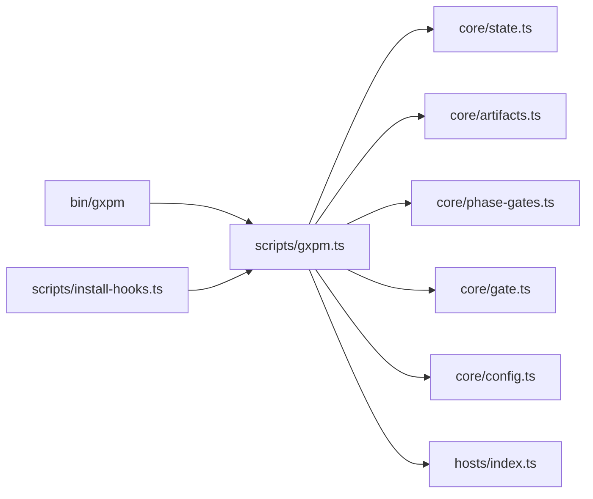
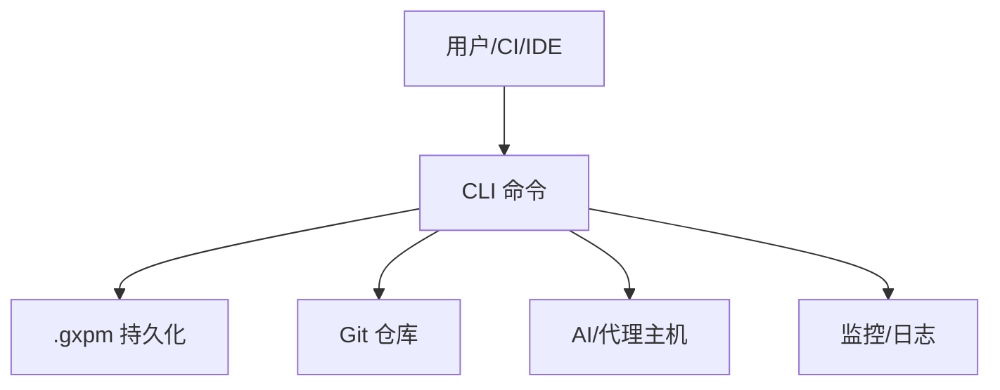

# 架构文档

<cite>
**本文档引用的文件**
- [package.json](file://package.json)
- [bin/gxpm](file://bin/gxpm)
- [scripts/gxpm.ts](file://scripts/gxpm.ts)
- [core/state.ts](file://core/state.ts)
- [core/artifacts.ts](file://core/artifacts.ts)
- [core/phase-gates.ts](file://core/phase-gates.ts)
- [core/gate.ts](file://core/gate.ts)
- [core/config.ts](file://core/config.ts)
- [core/dispatch.ts](file://core/dispatch.ts)
- [scripts/phase-artifact-commands.ts](file://scripts/phase-artifact-commands.ts)
- [scripts/install-hooks.ts](file://scripts/install-hooks.ts)
- [hosts/index.ts](file://hosts/index.ts)
- [hosts/claude.ts](file://hosts/claude.ts)
- [hosts/codex.ts](file://hosts/codex.ts)
</cite>

## 目录
1. [引言](#引言)
2. [项目结构](#项目结构)
3. [核心组件](#核心组件)
4. [架构总览](#架构总览)
5. [详细组件分析](#详细组件分析)
6. [依赖关系分析](#依赖关系分析)
7. [性能考虑](#性能考虑)
8. [故障排除指南](#故障排除指南)
9. [结论](#结论)
10. [附录](#附录)

## 引言
本架构文档面向 gxpm（第二代项目管理运行时），旨在系统化描述其整体架构设计与系统边界，解释高层设计模式与架构决策的技术考量，阐明组件间交互关系与数据流，说明技术栈选择与第三方依赖的影响，并给出基础设施要求、部署拓扑、可扩展性与性能约束，以及安全性、监控与灾难恢复等跨领域关注点。

## 项目结构
gxpm 采用按职责分层与功能模块化的组织方式：
- 核心运行时：状态机与工件管理、阶段门禁、配置解析、主机适配器
- 命令行入口：Bun 脚本封装与命令路由
- 主机适配：支持不同 AI/代理平台的安装与技能目录策略
- Git 钩子：在本地仓库中安装与转发 Git 钩子到 gxpm 命令
- 文档与治理：架构说明、开发契约、主机适配规范等



**图表来源**
- [bin/gxpm](file://bin/gxpm)
- [scripts/gxpm.ts](file://scripts/gxpm.ts)
- [core/state.ts](file://core/state.ts)
- [core/artifacts.ts](file://core/artifacts.ts)
- [core/phase-gates.ts](file://core/phase-gates.ts)
- [core/gate.ts](file://core/gate.ts)
- [core/config.ts](file://core/config.ts)
- [hosts/index.ts](file://hosts/index.ts)
- [hosts/claude.ts](file://hosts/claude.ts)
- [hosts/codex.ts](file://hosts/codex.ts)
- [scripts/install-hooks.ts](file://scripts/install-hooks.ts)

**章节来源**
- [package.json](file://package.json)
- [bin/gxpm](file://bin/gxpm)
- [scripts/gxpm.ts](file://scripts/gxpm.ts)

## 核心组件
- 状态与阶段：定义问题生命周期的阶段序列、状态持久化、事件日志与阶段转换校验
- 工件系统：统一的工件类型、读写接口、索引维护与事件记录
- 阶段门规则：每个阶段到下一阶段所需的“门”工件及其初始化命令
- 门禁评估：对 Git 提交、提交信息、推送、合并后行为进行策略校验
- 配置系统：仓库级与全局级配置解析、AGENTS.md 解析、工作树策略解析
- 主机适配：不同 AI 平台的技能目录与安装策略
- Git 钩子：在本地仓库安装 gxpm 钩子并转发到 CLI

**章节来源**
- [core/state.ts](file://core/state.ts)
- [core/artifacts.ts](file://core/artifacts.ts)
- [core/phase-gates.ts](file://core/phase-gates.ts)
- [core/gate.ts](file://core/gate.ts)
- [core/config.ts](file://core/config.ts)
- [hosts/index.ts](file://hosts/index.ts)
- [scripts/install-hooks.ts](file://scripts/install-hooks.ts)

## 架构总览
gxpm 的架构围绕“问题状态机 + 工件驱动 + 门禁控制”的核心范式构建。CLI 作为统一入口，将用户操作映射为状态转换与工件生成；门禁模块确保在正确的阶段、正确的时机执行必要的工件；配置模块提供策略解析与覆盖；主机适配器抽象不同 AI 平台的技能安装与使用。



**图表来源**
- [scripts/gxpm.ts](file://scripts/gxpm.ts)
- [core/state.ts](file://core/state.ts)
- [core/artifacts.ts](file://core/artifacts.ts)
- [core/phase-gates.ts](file://core/phase-gates.ts)
- [core/gate.ts](file://core/gate.ts)
- [core/config.ts](file://core/config.ts)
- [hosts/index.ts](file://hosts/index.ts)
- [scripts/install-hooks.ts](file://scripts/install-hooks.ts)

## 详细组件分析

### 状态机与阶段流转
- 设计要点：线性阶段序列、严格顺序约束、阶段历史记录、事件日志、归档能力
- 数据模型：问题状态、阶段历史、事件流（JSON Lines）
- 关键流程：创建问题、读取状态、阶段转换、归档切换
- 错误处理：非法阶段、缺失门工件、状态不存在

```mermaid
stateDiagram-v2
[*] --> triage
triage --> plan
plan --> dispatch
dispatch --> implement
implement --> local-verify
local-verify --> ac-check
ac-check --> self-review
self-review --> ship
ship --> pr-check
pr-check --> verify
verify --> qa
qa --> land
land --> [*]
```

**图表来源**
- [core/state.ts](file://core/state.ts)

**章节来源**
- [core/state.ts](file://core/state.ts)

### 工件系统
- 设计要点：统一工件类型枚举、读写接口、索引维护、事件记录
- 数据模型：工件记录（类型、路径、时间）、存储工件（带负载）
- 关键流程：写入工件、读取工件、列出工件、存在性检查
- 复杂度：索引更新为 O(n log n)，读取为 O(1)



**图表来源**
- [core/artifacts.ts](file://core/artifacts.ts)

**章节来源**
- [core/artifacts.ts](file://core/artifacts.ts)

### 阶段门规则与工件初始化
- 设计要点：每个阶段到下一阶段需要特定“门”工件，通过命令初始化
- 关键流程：根据当前阶段查找规则、生成初始化命令、调用对应初始化器
- 初始化器：如 dispatch 初始化器创建“dispatch-handoff”工件



**图表来源**
- [scripts/phase-artifact-commands.ts](file://scripts/phase-artifact-commands.ts)
- [core/dispatch.ts](file://core/dispatch.ts)
- [core/artifacts.ts](file://core/artifacts.ts)

**章节来源**
- [core/phase-gates.ts](file://core/phase-gates.ts)
- [scripts/phase-artifact-commands.ts](file://scripts/phase-artifact-commands.ts)
- [core/dispatch.ts](file://core/dispatch.ts)

### 门禁评估（Git 钩子集成）
- 设计要点：预提交、提交信息、预推送、合并后自动过渡
- 策略：受保护路径匹配、阶段允许范围、门工件存在性检查
- 可绕过：环境变量开关



**图表来源**
- [core/gate.ts](file://core/gate.ts)
- [core/phase-gates.ts](file://core/phase-gates.ts)
- [core/state.ts](file://core/state.ts)

**章节来源**
- [core/gate.ts](file://core/gate.ts)
- [core/phase-gates.ts](file://core/phase-gates.ts)

### 配置系统与工作树策略
- 设计要点：仓库级优先于全局级；支持从 AGENTS.md 解析配置块；用户消息可覆盖策略
- 关键流程：查询配置值、设置配置、列出配置、解析 AGENTS.md、解析工作树策略



**图表来源**
- [core/config.ts](file://core/config.ts)

**章节来源**
- [core/config.ts](file://core/config.ts)

### 主机适配器
- 设计要点：抽象不同 AI 平台的 CLI 命令、技能目录位置、环境变量使用、安装策略
- 当前实现：Claude 与 Codex 两种主机配置



**图表来源**
- [hosts/index.ts](file://hosts/index.ts)
- [hosts/claude.ts](file://hosts/claude.ts)
- [hosts/codex.ts](file://hosts/codex.ts)

**章节来源**
- [hosts/index.ts](file://hosts/index.ts)
- [hosts/claude.ts](file://hosts/claude.ts)
- [hosts/codex.ts](file://hosts/codex.ts)

### Git 钩子安装与转发
- 设计要点：在 .githooks 目录安装 gxpm 钩子脚本，设置 core.hooksPath，转发到 gxpm CLI
- 安全性：仅在 .githooks 下执行 gxpm 钩子，避免覆盖已有顶级钩子



**图表来源**
- [scripts/install-hooks.ts](file://scripts/install-hooks.ts)

**章节来源**
- [scripts/install-hooks.ts](file://scripts/install-hooks.ts)

## 依赖关系分析
- 技术栈：Bun（运行时与包管理）、Node 标准库（文件系统、路径、进程）
- 第三方依赖：无外部 npm 包，依赖 Bun 生态与 Git 钩子机制
- 组件耦合：CLI 对核心模块强依赖；门禁与阶段规则解耦；主机适配器与配置系统低耦合



**图表来源**
- [bin/gxpm](file://bin/gxpm)
- [scripts/gxpm.ts](file://scripts/gxpm.ts)
- [core/state.ts](file://core/state.ts)
- [core/artifacts.ts](file://core/artifacts.ts)
- [core/phase-gates.ts](file://core/phase-gates.ts)
- [core/gate.ts](file://core/gate.ts)
- [core/config.ts](file://core/config.ts)
- [hosts/index.ts](file://hosts/index.ts)
- [scripts/install-hooks.ts](file://scripts/install-hooks.ts)

**章节来源**
- [package.json](file://package.json)

## 性能考虑
- I/O 模型：大量基于文件系统的读写，建议在本地 SSD 上运行以降低延迟
- 索引更新：工件索引每次写入都会重写索引文件，建议批量操作或减少频繁写入
- 事件日志：事件以 JSON Lines 追加，长期运行可能产生大文件，建议定期归档或轮转
- 门禁评估：正则匹配与文件存在性检查开销较小，但受磁盘性能影响
- 并发：当前实现为单进程 CLI，不涉及并发锁；多用户共享同一 .gxpm 目录需注意竞态

## 故障排除指南
- 未知命令：检查命令拼写与参数，参考 CLI 输出提示
- 阶段转换失败：确认所需门工件已存在，或先执行对应的初始化命令
- 门禁阻止：查看具体错误码与原因，必要时临时禁用门禁（不推荐）
- 配置未生效：确认配置作用域（仓库 vs 全局），检查 AGENTS.md 解析块
- Git 钩子未触发：确认 core.hooksPath 已设置为 .githooks，且钩子脚本可执行

**章节来源**
- [scripts/gxpm.ts](file://scripts/gxpm.ts)
- [core/gate.ts](file://core/gate.ts)
- [core/phase-gates.ts](file://core/phase-gates.ts)
- [core/config.ts](file://core/config.ts)
- [scripts/install-hooks.ts](file://scripts/install-hooks.ts)

## 结论
gxpm 通过“状态机 + 工件 + 门禁”的设计，实现了可追踪、可审计、可自动化的问题管理流程。其架构强调本地持久化、Git 集成与主机适配器抽象，适合在团队内推广一致的工程实践。未来可在以下方面演进：引入轻量数据库替代纯文件系统、增强并发安全与分布式协作、扩展监控与告警能力、完善灾难恢复与备份策略。

## 附录

### 系统上下文图


[此图为概念性上下文图，无需图表来源]

### 部署拓扑与基础设施要求
- 运行时：Bun ≥ 1.0.0
- 文件系统：.gxpm 目录用于状态与工件持久化，建议本地 SSD
- Git：启用 core.hooksPath=.githooks，安装 gxpm 钩子
- 主机适配：根据所选主机（Claude/Codex）准备 CLI 与技能目录
- 安全：限制 .gxpm 目录权限，避免敏感信息泄露；门禁可通过环境变量临时禁用，仅限调试场景

[本节为通用指导，无需章节来源]