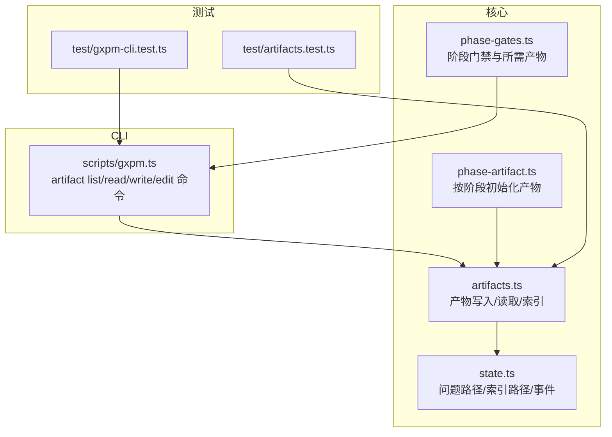
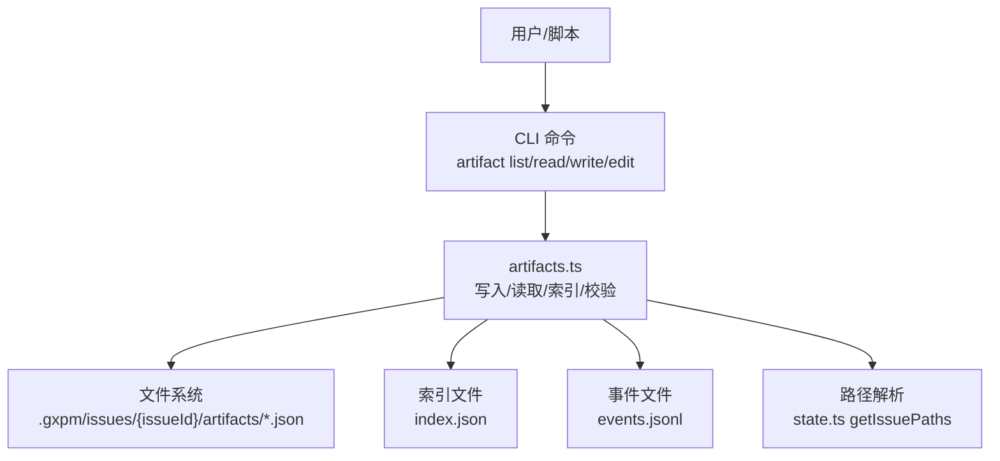
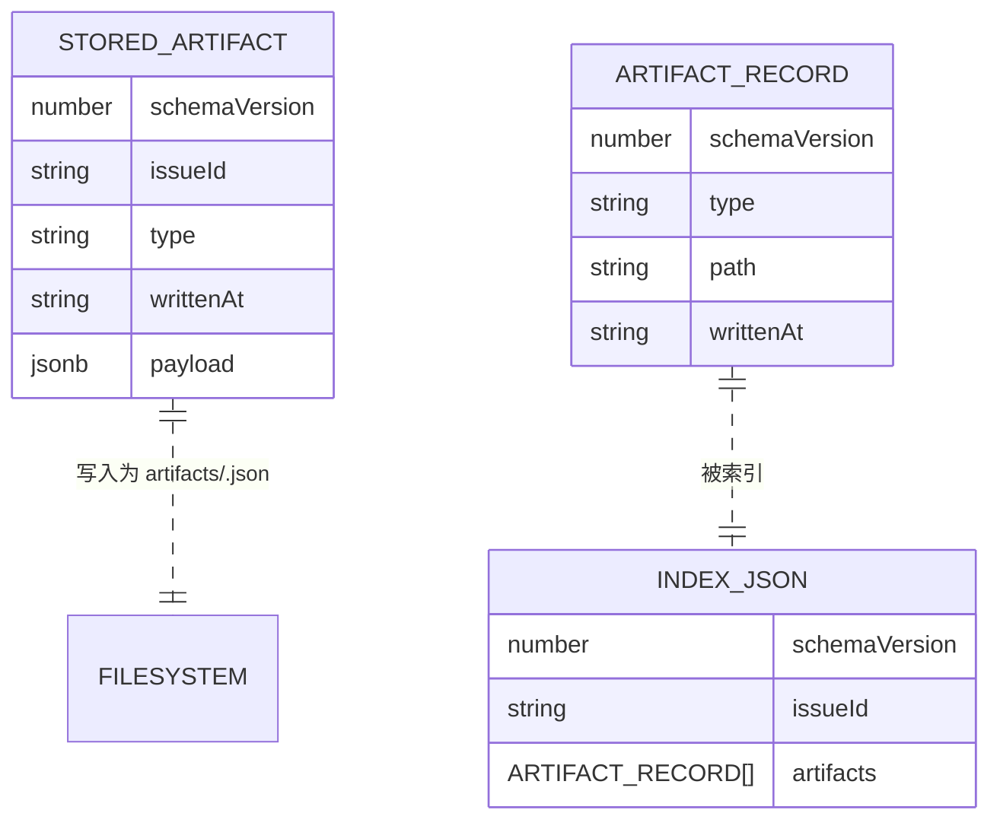
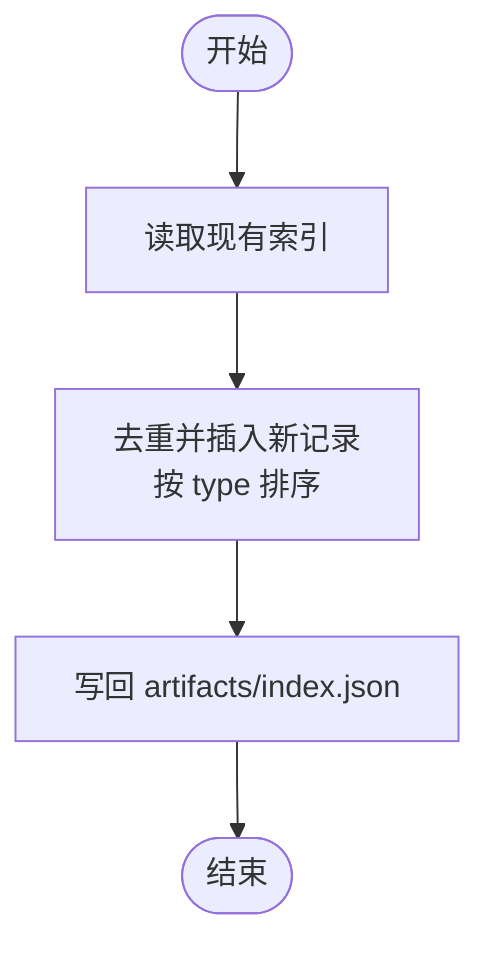
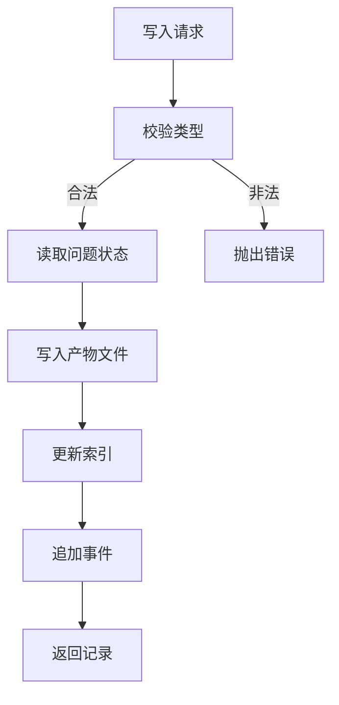
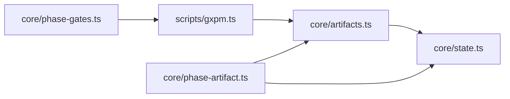

# 产物系统

<cite>
**本文引用的文件**   
- [core/artifacts.ts](file://core/artifacts.ts)
- [core/state.ts](file://core/state.ts)
- [core/phase-artifact.ts](file://core/phase-artifact.ts)
- [core/phase-gates.ts](file://core/phase-gates.ts)
- [scripts/gxpm.ts](file://scripts/gxpm.ts)
- [test/artifacts.test.ts](file://test/artifacts.test.ts)
- [test/gxpm-cli.test.ts](file://test/gxpm-cli.test.ts)
</cite>

## 目录
1. [简介](#简介)
2. [项目结构](#项目结构)
3. [核心组件](#核心组件)
4. [架构总览](#架构总览)
5. [详细组件分析](#详细组件分析)
6. [依赖关系分析](#依赖关系分析)
7. [性能考量](#性能考量)
8. [故障排查指南](#故障排查指南)
9. [结论](#结论)
10. [附录](#附录)

## 简介
本文件系统性地阐述 gxpm 的产物（Artifact）系统：包括产物的 JSON 存储格式与命名规范、产物索引管理（artifacts/index.json）、产物验证规则（类型校验与存在性检查）、产物生命周期（创建、更新、事件记录），以及通过 CLI 与核心 API 进行读取、写入与验证的操作方式。文档同时给出数据模型与存储结构说明，并以图示呈现关键流程。

## 项目结构
产物系统主要由以下模块组成：
- 核心 API：在 core/artifacts.ts 中定义产物的写入、读取、列出、存在性检查与索引维护。
- 状态与路径：在 core/state.ts 中定义问题目录结构、产物根路径与索引文件路径等。
- 阶段化产物初始化器：在 core/phase-artifact.ts 中按阶段创建默认产物草稿。
- 门禁与产物关联：在 core/phase-gates.ts 中定义各阶段之间的“门”及所需产物类型。
- CLI：在 scripts/gxpm.ts 中提供 artifact list/read/write/edit 命令与门禁检查。
- 测试：在 test/artifacts.test.ts 与 test/gxpm-cli.test.ts 中覆盖产物写入、索引与 CLI 行为。

图表来源
- [core/artifacts.ts:1-169](file://core/artifacts.ts#L1-L169)
- [core/state.ts:69-136](file://core/state.ts#L69-L136)
- [core/phase-artifact.ts:1-33](file://core/phase-artifact.ts#L1-L33)
- [core/phase-gates.ts:25-99](file://core/phase-gates.ts#L25-L99)
- [scripts/gxpm.ts:186-223](file://scripts/gxpm.ts#L186-L223)
- [test/artifacts.test.ts:12-49](file://test/artifacts.test.ts#L12-L49)
- [test/gxpm-cli.test.ts:150-184](file://test/gxpm-cli.test.ts#L150-L184)

章节来源
- [core/artifacts.ts:1-169](file://core/artifacts.ts#L1-L169)
- [core/state.ts:69-136](file://core/state.ts#L69-L136)
- [core/phase-artifact.ts:1-33](file://core/phase-artifact.ts#L1-L33)
- [core/phase-gates.ts:25-99](file://core/phase-gates.ts#L25-L99)
- [scripts/gxpm.ts:186-223](file://scripts/gxpm.ts#L186-L223)
- [test/artifacts.test.ts:12-49](file://test/artifacts.test.ts#L12-L49)
- [test/gxpm-cli.test.ts:150-184](file://test/gxpm-cli.test.ts#L150-L184)

## 核心组件
- 产物类型与数据模型
  - 产物类型集合：在 artifacts.ts 中定义了受支持的产物类型数组，如 issue-intake、triage-report、acceptance-contract、implementation-plan、dispatch-handoff、local-verify、acceptance-check、self-review、ship-readiness、pr-check、verify-findings、qa-findings、land-findings。
  - 已存储产物 StoredArtifact：包含 schemaVersion、issueId、type、writtenAt、payload。
  - 索引条目 ArtifactRecord：包含 schemaVersion、type、path、writtenAt。
- 路径与索引
  - 问题目录结构：state.ts 提供 getIssuePaths，返回 issueDir、artifactRoot、artifactIndexPath、statePath、graphPath、eventsPath。
  - 产物索引 artifacts/index.json：用于记录该问题下所有产物的类型与相对路径列表。
- 关键 API
  - 写入产物 writeArtifact：生成 StoredArtifact JSON 文件并更新索引；记录 artifact.written 事件。
  - 读取产物 readArtifact：按类型读取 artifacts/<type>.json。
  - 列出产物 listArtifacts：读取 artifacts/index.json 的 artifacts 数组。
  - 存在性检查 hasArtifact：判断 artifacts/<type>.json 是否存在。
  - 类型校验 assertValidArtifactType：仅允许受支持的类型。

章节来源
- [core/artifacts.ts:10-41](file://core/artifacts.ts#L10-L41)
- [core/artifacts.ts:57-91](file://core/artifacts.ts#L57-L91)
- [core/artifacts.ts:93-104](file://core/artifacts.ts#L93-L104)
- [core/artifacts.ts:106-118](file://core/artifacts.ts#L106-L118)
- [core/artifacts.ts:120-125](file://core/artifacts.ts#L120-L125)
- [core/artifacts.ts:163-168](file://core/artifacts.ts#L163-L168)
- [core/state.ts:69-84](file://core/state.ts#L69-L84)
- [core/state.ts:119-123](file://core/state.ts#L119-L123)

## 架构总览
产物系统围绕“问题（Issue）”组织，每个问题拥有独立的目录树，产物以 JSON 文件形式存放在 artifacts/<type>.json，索引文件 artifacts/index.json 记录产物清单。写入时会同步更新索引并追加事件，读取时通过索引或直接定位文件。

图表来源
- [scripts/gxpm.ts:186-223](file://scripts/gxpm.ts#L186-L223)
- [core/artifacts.ts:57-91](file://core/artifacts.ts#L57-L91)
- [core/artifacts.ts:106-118](file://core/artifacts.ts#L106-L118)
- [core/state.ts:69-84](file://core/state.ts#L69-L84)

## 详细组件分析

### 数据模型与存储结构
- 已存储产物 StoredArtifact
  - 字段：schemaVersion、issueId、type、writtenAt、payload。
  - 写入时写入 artifacts/<type>.json。
- 索引条目 ArtifactRecord
  - 字段：schemaVersion、type、path、writtenAt。
  - 写入时更新 artifacts/index.json 的 artifacts 数组。
- 产物索引 artifacts/index.json
  - 结构：包含 schemaVersion、issueId、artifacts 数组。
  - 维护：每次写入后通过 upsertRecord 去重并排序，保证同一类型只保留最新记录。

图表来源
- [core/artifacts.ts:28-41](file://core/artifacts.ts#L28-L41)
- [core/artifacts.ts:28-33](file://core/artifacts.ts#L28-L33)
- [core/artifacts.ts:114-117](file://core/artifacts.ts#L114-L117)

章节来源
- [core/artifacts.ts:28-41](file://core/artifacts.ts#L28-L41)
- [core/artifacts.ts:114-117](file://core/artifacts.ts#L114-L117)

### 产物命名规范与存储位置
- 命名规范
  - 每个产物对应一个 JSON 文件，文件名为 artifacts/<type>.json。
  - type 必须属于受支持的类型集合，否则写入将失败。
- 存储位置
  - 产物文件与索引文件位于问题根目录下的 artifacts 子目录。
  - 路径由 state.ts 的 getIssuePaths 解析，索引文件路径为 artifacts/index.json。

章节来源
- [core/artifacts.ts:64](file://core/artifacts.ts#L64)
- [core/artifacts.ts:97](file://core/artifacts.ts#L97)
- [core/state.ts:69-84](file://core/state.ts#L69-L84)

### 产物索引管理（artifacts/index.json）
- 结构
  - schemaVersion、issueId、artifacts（数组）。
- 维护策略
  - 写入时先读取现有索引，使用 upsertRecord 去除旧同类型记录并插入新记录，最后按类型排序写回。
  - 列表读取时若索引不存在则抛错，确保一致性。

图表来源
- [core/artifacts.ts:80-84](file://core/artifacts.ts#L80-L84)
- [core/artifacts.ts:127-140](file://core/artifacts.ts#L127-L140)
- [core/artifacts.ts:142-146](file://core/artifacts.ts#L142-L146)

章节来源
- [core/artifacts.ts:106-118](file://core/artifacts.ts#L106-L118)
- [core/artifacts.ts:127-140](file://core/artifacts.ts#L127-L140)
- [core/artifacts.ts:142-146](file://core/artifacts.ts#L142-L146)

### 产物验证规则
- 类型校验
  - 写入前通过 assertValidArtifactType 校验类型是否在受支持集合内，否则抛错。
- 存在性检查
  - 读取时若文件不存在抛错；hasArtifact 返回布尔值用于条件判断。
- 门禁与阶段约束
  - 某些产物需在特定阶段初始化（例如 local-verify 对应的 local-verify 产物），由 createPhaseArtifactInitializer 在当前阶段不匹配时拒绝初始化。
  - 门禁检查（如 pre-push）可基于 hasArtifact 判断是否满足过渡条件。

图表来源
- [core/artifacts.ts:57-91](file://core/artifacts.ts#L57-L91)
- [core/artifacts.ts:163-168](file://core/artifacts.ts#L163-L168)
- [core/phase-artifact.ts:17-31](file://core/phase-artifact.ts#L17-L31)

章节来源
- [core/artifacts.ts:57-91](file://core/artifacts.ts#L57-L91)
- [core/artifacts.ts:163-168](file://core/artifacts.ts#L163-L168)
- [core/phase-artifact.ts:17-31](file://core/phase-artifact.ts#L17-L31)

### 产物生命周期管理
- 创建
  - 通过 CLI 或直接调用 writeArtifact 写入产物，生成 artifacts/<type>.json 并更新索引。
- 更新
  - 同一类型再次写入会覆盖旧文件，索引中同类型记录被替换，事件记录新增一条 artifact.written。
- 删除
  - 当前未提供专用删除 API；可通过手动删除 artifacts/<type>.json 并更新索引实现，但建议通过覆盖写入保持索引一致。
- 事件记录
  - 写入成功后追加 artifact.written 事件到 events.jsonl，便于审计与回溯。

章节来源
- [core/artifacts.ts:57-91](file://core/artifacts.ts#L57-L91)
- [core/artifacts.ts:148-161](file://core/artifacts.ts#L148-L161)
- [core/state.ts:119-123](file://core/state.ts#L119-L123)

### 典型操作示例（路径指引）
- 通过 CLI 写入产物
  - 使用 --json、--from 或 --stdin 提供 JSON 负载，命令为 artifact write。
  - 示例路径：[scripts/gxpm.ts:209-215](file://scripts/gxpm.ts#L209-L215)
- 通过 CLI 读取产物
  - 命令为 artifact read。
  - 示例路径：[scripts/gxpm.ts:201-207](file://scripts/gxpm.ts#L201-L207)
- 通过 CLI 编辑产物
  - 命令为 artifact edit，内部以临时文件打开编辑器，保存后写回。
  - 示例路径：[scripts/gxpm.ts:390-432](file://scripts/gxpm.ts#L390-L432)
- 通过核心 API 写入/读取/列出
  - 写入：[core/artifacts.ts:57-91](file://core/artifacts.ts#L57-L91)
  - 读取：[core/artifacts.ts:93-104](file://core/artifacts.ts#L93-L104)
  - 列表：[core/artifacts.ts:106-118](file://core/artifacts.ts#L106-L118)
- 阶段化初始化产物
  - 例如 local-verify 初始化：[core/phase-artifact.ts:16-31](file://core/phase-artifact.ts#L16-L31)
- 门禁与所需产物
  - 门禁规则与所需产物映射：[core/phase-gates.ts:32-99](file://core/phase-gates.ts#L32-L99)

章节来源
- [scripts/gxpm.ts:201-215](file://scripts/gxpm.ts#L201-L215)
- [scripts/gxpm.ts:390-432](file://scripts/gxpm.ts#L390-L432)
- [core/artifacts.ts:57-118](file://core/artifacts.ts#L57-L118)
- [core/phase-artifact.ts:16-31](file://core/phase-artifact.ts#L16-L31)
- [core/phase-gates.ts:32-99](file://core/phase-gates.ts#L32-L99)

## 依赖关系分析
- artifacts.ts 依赖 state.ts 的路径解析与事件追加。
- phase-artifact.ts 依赖 artifacts.ts 的写入能力与 state.ts 的阶段读取。
- CLI scripts/gxpm.ts 直接依赖 artifacts.ts 的读写与列出接口。
- 门禁模块 core/phase-gates.ts 依赖 artifacts.ts 的类型集合与 CLI 的命令提示。

图表来源
- [scripts/gxpm.ts:12](file://scripts/gxpm.ts#L12)
- [core/artifacts.ts:1-8](file://core/artifacts.ts#L1-L8)
- [core/phase-artifact.ts:1-2](file://core/phase-artifact.ts#L1-L2)
- [core/phase-gates.ts:1-2](file://core/phase-gates.ts#L1-L2)

章节来源
- [scripts/gxpm.ts:12](file://scripts/gxpm.ts#L12)
- [core/artifacts.ts:1-8](file://core/artifacts.ts#L1-L8)
- [core/phase-artifact.ts:1-2](file://core/phase-artifact.ts#L1-L2)
- [core/phase-gates.ts:1-2](file://core/phase-gates.ts#L1-L2)

## 性能考量
- 文件 I/O
  - 写入与读取均为单文件操作，复杂度 O(1)，索引更新为数组去重与排序，复杂度 O(n log n)，其中 n 为当前产物数量。
- 磁盘占用
  - 产物以 JSON 文件存储，体积随 payload 增长；建议控制 payload 大小并仅保留必要字段。
- 并发安全
  - 当前未见锁机制；在多进程并发写入同一类型产物时可能出现竞态，建议外部串行或引入文件锁策略。

## 故障排查指南
- “产物类型无效”
  - 现象：写入时报错“Invalid artifact type”。
  - 排查：确认 type 是否在受支持集合中；参考类型集合定义。
  - 参考路径：[core/artifacts.ts:163-168](file://core/artifacts.ts#L163-L168)
- “产物索引不存在”
  - 现象：列出产物时报错“Artifact index not found”。
  - 排查：确认问题状态已创建且索引文件存在；参考索引初始化逻辑。
  - 参考路径：[core/artifacts.ts:110-112](file://core/artifacts.ts#L110-L112), [core/state.ts:119-123](file://core/state.ts#L119-L123)
- “产物文件不存在”
  - 现象：读取时报错“Artifact not found”。
  - 排查：确认 artifacts/<type>.json 是否存在；检查类型是否正确。
  - 参考路径：[core/artifacts.ts:99-101](file://core/artifacts.ts#L99-L101)
- “阶段初始化被拒绝”
  - 现象：初始化阶段产物时报错“只能从某阶段初始化”。
  - 排查：确认当前阶段与 requiredPhase 是否一致。
  - 参考路径：[core/phase-artifact.ts:18-23](file://core/phase-artifact.ts#L18-L23)
- “门禁阻塞”
  - 现象：预推/合并后门禁检查失败，提示缺少所需产物。
  - 排查：根据提示命令初始化相应产物；或使用 hasArtifact 检查是否存在。
  - 参考路径：[scripts/gxpm.ts:548-575](file://scripts/gxpm.ts#L548-L575)

章节来源
- [core/artifacts.ts:99-101](file://core/artifacts.ts#L99-L101)
- [core/artifacts.ts:110-112](file://core/artifacts.ts#L110-L112)
- [core/artifacts.ts:163-168](file://core/artifacts.ts#L163-L168)
- [core/phase-artifact.ts:18-23](file://core/phase-artifact.ts#L18-L23)
- [scripts/gxpm.ts:548-575](file://scripts/gxpm.ts#L548-L575)

## 结论
产物系统以 JSON 文件为核心载体，结合索引与事件记录形成完整的生命周期管理。通过严格的类型校验、阶段化初始化与门禁联动，确保产物在流程中的完整性与可追溯性。建议在团队协作中统一产物命名与 payload 规范，避免冗余数据，并在高并发场景下考虑写入串行化或锁机制。

## 附录

### 产物类型清单（受支持）
- issue-intake
- triage-report
- acceptance-contract
- implementation-plan
- dispatch-handoff
- local-verify
- acceptance-check
- self-review
- ship-readiness
- pr-check
- verify-findings
- qa-findings
- land-findings

章节来源
- [core/artifacts.ts:10-24](file://core/artifacts.ts#L10-L24)