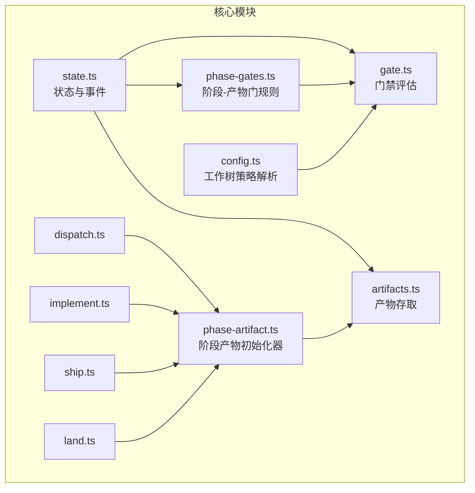
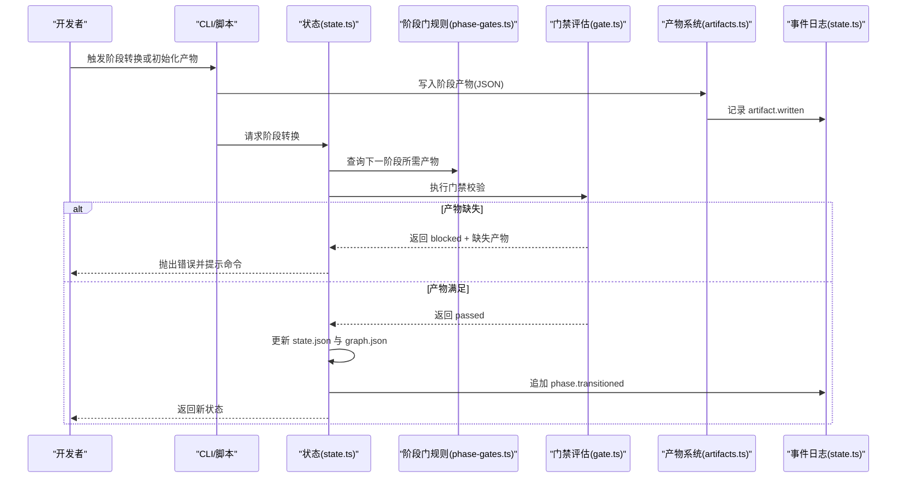
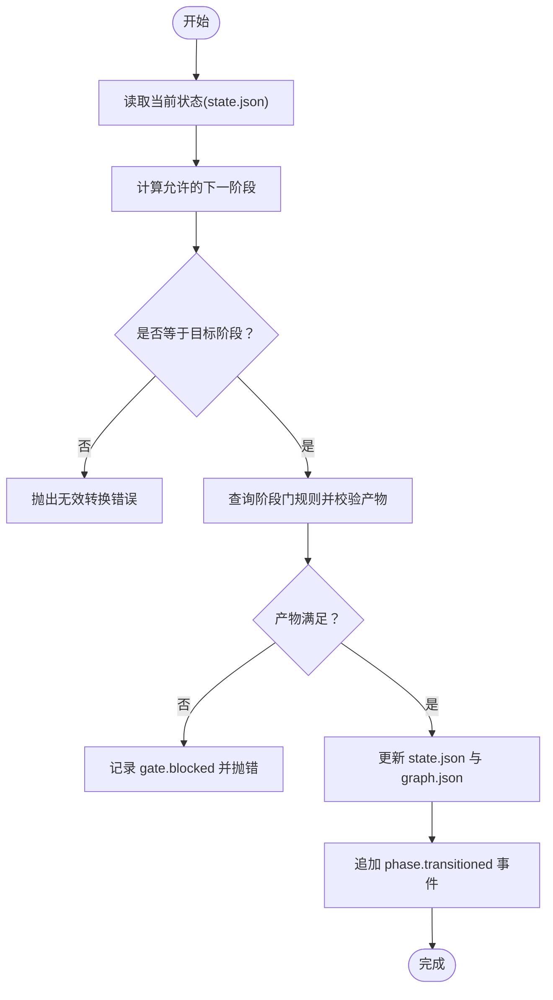
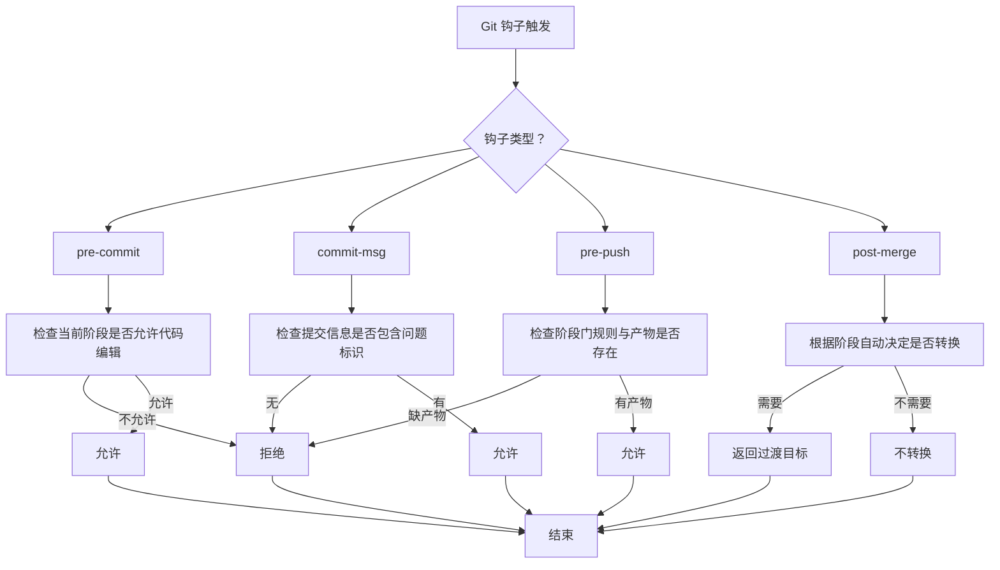
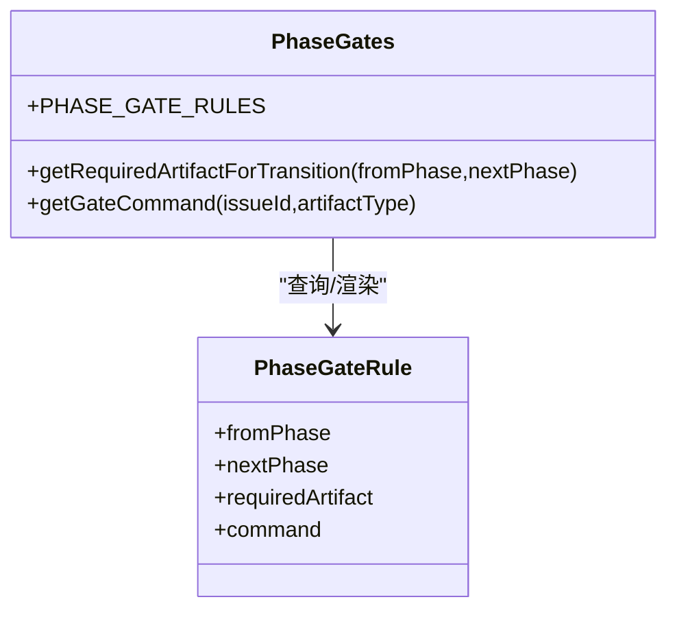
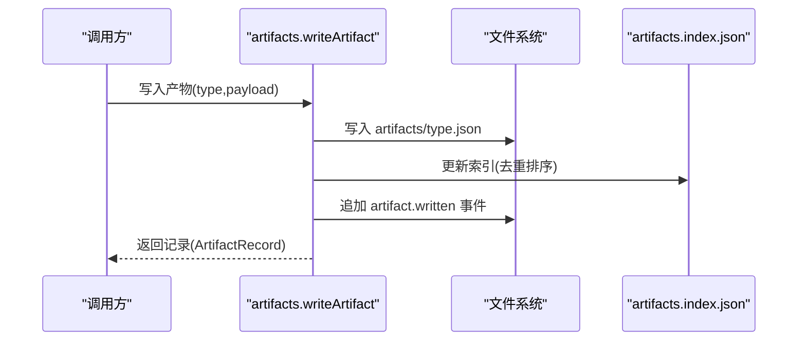
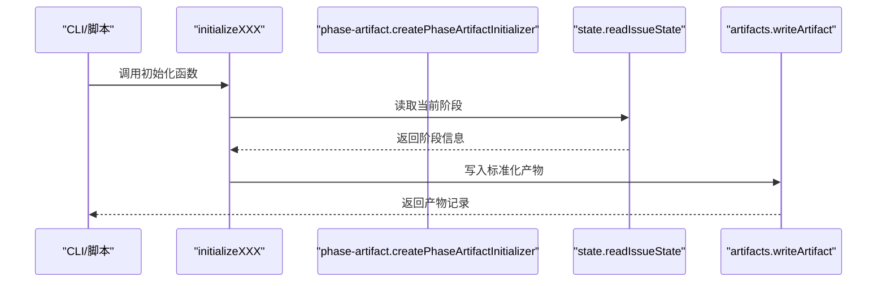
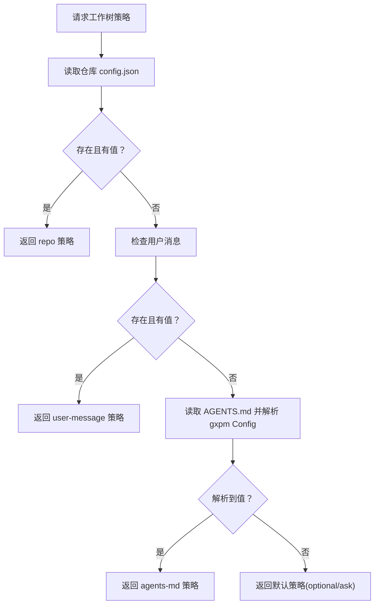
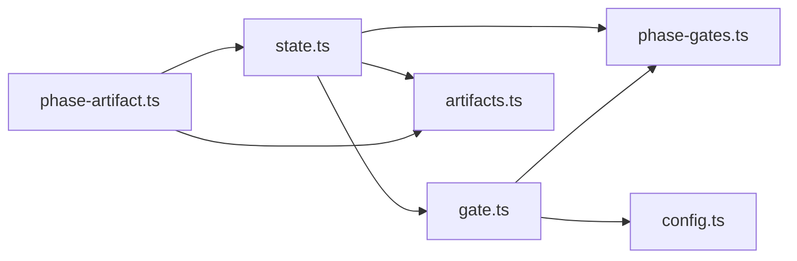

# 核心概念

<cite>
**本文引用的文件**
- [core/state.ts](file://core/state.ts)
- [core/phase-gates.ts](file://core/phase-gates.ts)
- [core/gate.ts](file://core/gate.ts)
- [core/artifacts.ts](file://core/artifacts.ts)
- [core/phase-artifact.ts](file://core/phase-artifact.ts)
- [core/dispatch.ts](file://core/dispatch.ts)
- [core/implement.ts](file://core/implement.ts)
- [core/ship.ts](file://core/ship.ts)
- [core/land.ts](file://core/land.ts)
- [core/config.ts](file://core/config.ts)
- [test/state-graph.test.ts](file://test/state-graph.test.ts)
- [test/gate.test.ts](file://test/gate.test.ts)
- [test/artifacts.test.ts](file://test/artifacts.test.ts)
- [test/config.test.ts](file://test/config.test.ts)
- [test/phase-gates.test.ts](file://test/phase-gates.test.ts)
</cite>

## 目录
1. [引言](#引言)
2. [项目结构](#项目结构)
3. [核心组件](#核心组件)
4. [架构总览](#架构总览)
5. [详细组件分析](#详细组件分析)
6. [依赖关系分析](#依赖关系分析)
7. [性能考量](#性能考量)
8. [故障排查指南](#故障排查指南)
9. [结论](#结论)
10. [附录](#附录)

## 引言
本文件面向开发者与治理者，系统化阐述 gxpm 的核心概念：状态机原理与线性状态转换、事件日志管理、门禁机制（含阶段转换规则与强制性验证）、产物系统（JSON 产物存储与验证）、工作树策略解析与多层配置结构。文档通过代码级图示与测试用例路径，帮助读者建立从概念到实践的完整认知。

## 项目结构
- 核心逻辑集中在 core 目录，围绕“状态”“产物”“门禁”“阶段-产物映射”“配置”等模块组织。
- 测试覆盖状态图、门禁评估、产物读写、配置解析与优先级、阶段门规则一致性等关键行为。
- 脚本目录提供与阶段相关的命令提示与初始化器，用于生成门禁所需的产物。

**图示来源**
- [core/state.ts:1-302](file://core/state.ts#L1-L302)
- [core/phase-gates.ts:1-118](file://core/phase-gates.ts#L1-L118)
- [core/gate.ts:1-144](file://core/gate.ts#L1-L144)
- [core/artifacts.ts:1-169](file://core/artifacts.ts#L1-L169)
- [core/phase-artifact.ts:1-33](file://core/phase-artifact.ts#L1-L33)
- [core/dispatch.ts:1-17](file://core/dispatch.ts#L1-L17)
- [core/implement.ts:1-16](file://core/implement.ts#L1-L16)
- [core/ship.ts:1-17](file://core/ship.ts#L1-L17)
- [core/land.ts:1-16](file://core/land.ts#L1-L16)
- [core/config.ts:1-229](file://core/config.ts#L1-L229)

**章节来源**
- [core/state.ts:1-302](file://core/state.ts#L1-L302)
- [core/phase-gates.ts:1-118](file://core/phase-gates.ts#L1-L118)
- [core/gate.ts:1-144](file://core/gate.ts#L1-L144)
- [core/artifacts.ts:1-169](file://core/artifacts.ts#L1-L169)
- [core/phase-artifact.ts:1-33](file://core/phase-artifact.ts#L1-L33)
- [core/dispatch.ts:1-17](file://core/dispatch.ts#L1-L17)
- [core/implement.ts:1-16](file://core/implement.ts#L1-L16)
- [core/ship.ts:1-17](file://core/ship.ts#L1-L17)
- [core/land.ts:1-16](file://core/land.ts#L1-L16)
- [core/config.ts:1-229](file://core/config.ts#L1-L229)

## 核心组件
- 状态机与事件日志：以线性阶段序列推进，记录状态变更与事件日志，确保可审计与可回溯。
- 阶段-产物门：每个阶段到下一阶段均绑定一个“必需产物”，未满足则阻断转换。
- 门禁评估：在提交前/提交信息/推送前/合并后四个钩子上执行策略校验。
- 产物系统：统一以 JSON 文件存储，带索引与事件记录，支持读写与存在性检查。
- 工作树策略：多层配置解析（仓库 > 全局 > 用户消息 > AGENTS.md > 默认），形成最终策略。

**章节来源**
- [core/state.ts:11-25](file://core/state.ts#L11-L25)
- [core/phase-gates.ts:25-30](file://core/phase-gates.ts#L25-L30)
- [core/gate.ts:22-27](file://core/gate.ts#L22-L27)
- [core/artifacts.ts:10-26](file://core/artifacts.ts#L10-L26)
- [core/config.ts:5-19](file://core/config.ts#L5-L19)

## 架构总览
下图展示从“阶段转换触发”到“产物生成与门禁校验”的端到端流程，以及事件日志与状态持久化的交互。

**图示来源**
- [core/state.ts:149-204](file://core/state.ts#L149-L204)
- [core/phase-gates.ts:107-117](file://core/phase-gates.ts#L107-L117)
- [core/gate.ts:102-130](file://core/gate.ts#L102-L130)
- [core/artifacts.ts:57-91](file://core/artifacts.ts#L57-L91)

## 详细组件分析

### 状态机与线性状态转换
- 阶段序列：定义了严格的线性顺序，转换仅允许向前推进，且必须满足下一阶段的“必需产物”。
- 状态持久化：每次转换更新 state.json 与 graph.json，并追加事件日志。
- 事件类型：包含“issue.created”“phase.transitioned”“artifact.written”“gate.blocked/ passed”。

**图示来源**
- [core/state.ts:149-204](file://core/state.ts#L149-L204)
- [core/phase-gates.ts:107-117](file://core/phase-gates.ts#L107-L117)

**章节来源**
- [core/state.ts:11-25](file://core/state.ts#L11-L25)
- [core/state.ts:149-204](file://core/state.ts#L149-L204)
- [test/state-graph.test.ts:38-65](file://test/state-graph.test.ts#L38-L65)

### 事件日志管理
- 日志格式：每条事件为独立 JSON 行，按时间顺序追加至 events.jsonl。
- 事件类型与载荷：
  - issue.created：初始阶段与时间戳
  - artifact.written：产物类型与相对路径
  - gate.passed/blocked：记录门禁通过/阻断及缺失产物
  - phase.transitioned：fromPhase/toPhase
- 读取方式：逐行解析，便于审计与回放。

**章节来源**
- [core/state.ts:45-56](file://core/state.ts#L45-L56)
- [core/state.ts:124-133](file://core/state.ts#L124-L133)
- [core/state.ts:206-208](file://core/state.ts#L206-L208)
- [core/artifacts.ts:85-88](file://core/artifacts.ts#L85-L88)
- [core/state.ts:266-297](file://core/state.ts#L266-L297)
- [test/state-graph.test.ts:30-35](file://test/state-graph.test.ts#L30-L35)
- [test/artifacts.test.ts:41-48](file://test/artifacts.test.ts#L41-L48)

### 门禁机制设计与强制性验证
- 钩子类型：pre-commit、commit-msg、pre-push、post-merge。
- 校验规则：
  - pre-commit：若当前阶段不允许代码提交，则阻止对受保护路径的修改；否则放行。
  - commit-msg：要求提交信息包含问题标识（如 GXG-/GXPM-）。
  - pre-push：若当前阶段有“出站门”，则要求对应产物存在，否则阻断推送。
  - post-merge：在特定阶段（如 qa）自动触发向下一阶段的转换。
- 强制性：可通过环境变量临时禁用，但默认严格生效。

**图示来源**
- [core/gate.ts:48-80](file://core/gate.ts#L48-L80)
- [core/gate.ts:82-100](file://core/gate.ts#L82-L100)
- [core/gate.ts:102-130](file://core/gate.ts#L102-L130)
- [core/gate.ts:132-143](file://core/gate.ts#L132-L143)
- [core/phase-gates.ts:4-13](file://core/phase-gates.ts#L4-L13)
- [core/phase-gates.ts:15-23](file://core/phase-gates.ts#L15-L23)

**章节来源**
- [core/gate.ts:8-27](file://core/gate.ts#L8-L27)
- [core/gate.ts:48-130](file://core/gate.ts#L48-L130)
- [core/gate.ts:132-143](file://core/gate.ts#L132-L143)
- [test/gate.test.ts:21-58](file://test/gate.test.ts#L21-L58)
- [test/gate.test.ts:83-110](file://test/gate.test.ts#L83-L110)
- [test/gate.test.ts:112-127](file://test/gate.test.ts#L112-L127)

### 阶段-产物门规则与强制性验证
- 规则集：明确每一阶段到下一阶段所需的“必需产物”与对应的 CLI 命令提示。
- 查询接口：根据 fromPhase/nextPhase 返回 requiredArtifact；根据 artifactType 返回命令模板。
- 强制性：状态转换前会调用门禁校验，若产物缺失则阻断并提示具体命令。

**图示来源**
- [core/phase-gates.ts:25-30](file://core/phase-gates.ts#L25-L30)
- [core/phase-gates.ts:32-99](file://core/phase-gates.ts#L32-L99)
- [core/phase-gates.ts:107-117](file://core/phase-gates.ts#L107-L117)

**章节来源**
- [core/phase-gates.ts:107-117](file://core/phase-gates.ts#L107-L117)
- [test/phase-gates.test.ts:12-82](file://test/phase-gates.test.ts#L12-L82)
- [test/phase-gates.test.ts:95-99](file://test/phase-gates.test.ts#L95-L99)

### 产物系统：JSON 存储与验证
- 类型与结构：产物以 JSON 文件存储，包含 schemaVersion、issueId、type、writtenAt、payload；并维护 artifacts/index.json 索引。
- 操作接口：写入、读取、列出、存在性检查；写入时更新索引并记录事件。
- 验证：写入前校验产物类型合法性；读取前检查文件存在。

**图示来源**
- [core/artifacts.ts:57-91](file://core/artifacts.ts#L57-L91)
- [core/artifacts.ts:127-146](file://core/artifacts.ts#L127-L146)

**章节来源**
- [core/artifacts.ts:10-26](file://core/artifacts.ts#L10-L26)
- [core/artifacts.ts:57-104](file://core/artifacts.ts#L57-L104)
- [test/artifacts.test.ts:12-49](file://test/artifacts.test.ts#L12-L49)

### 阶段产物初始化器与使用模式
- 初始化器：为特定阶段提供标准化的产物模板与默认字段，确保产物结构一致。
- 使用模式：在 CLI 或脚本中调用对应初始化函数，先校验当前阶段，再写入产物。

**图示来源**
- [core/phase-artifact.ts:16-32](file://core/phase-artifact.ts#L16-L32)
- [core/dispatch.ts:3-16](file://core/dispatch.ts#L3-L16)
- [core/implement.ts:3-15](file://core/implement.ts#L3-L15)
- [core/ship.ts:3-16](file://core/ship.ts#L3-L16)
- [core/land.ts:3-15](file://core/land.ts#L3-L15)

**章节来源**
- [core/phase-artifact.ts:9-14](file://core/phase-artifact.ts#L9-L14)
- [core/dispatch.ts:3-16](file://core/dispatch.ts#L3-L16)
- [core/implement.ts:3-15](file://core/implement.ts#L3-L15)
- [core/ship.ts:3-16](file://core/ship.ts#L3-L16)
- [core/land.ts:3-15](file://core/land.ts#L3-L15)

### 工作树策略解析与多层配置结构
- 策略项：enforcement（required/forbidden/optional/unset）与 default（use/skip/ask）。
- 解析优先级：
  1) 仓库 config.json（repo）> 全局 config.json（global）
  2) 用户消息（user-message）
  3) AGENTS.md 中的 gxpm Config 区块
  4) 默认值（optional/ask）
- 支持键路径访问与设置，解析 AGENTS.md 中的键值对。

**图示来源**
- [core/config.ts:153-195](file://core/config.ts#L153-L195)
- [core/config.ts:114-144](file://core/config.ts#L114-L144)

**章节来源**
- [core/config.ts:5-19](file://core/config.ts#L5-L19)
- [core/config.ts:66-106](file://core/config.ts#L66-L106)
- [core/config.ts:153-195](file://core/config.ts#L153-L195)
- [test/config.test.ts:87-139](file://test/config.test.ts#L87-L139)

## 依赖关系分析
- 组件耦合：
  - state.ts 依赖 phase-gates.ts（查询下一阶段所需产物）与 gate.ts（门禁评估入口）。
  - artifacts.ts 与 state.ts 协作记录事件与索引。
  - phase-artifact.ts 依赖 artifacts.ts 与 state.ts，为阶段初始化提供统一入口。
  - gate.ts 依赖 phase-gates.ts（规则）与 config.ts（策略）。
- 外部依赖：Node.js fs/path 模块；测试使用 Bun 测试框架。

**图示来源**
- [core/state.ts:1-10](file://core/state.ts#L1-L10)
- [core/gate.ts:1-6](file://core/gate.ts#L1-L6)
- [core/phase-artifact.ts:1-3](file://core/phase-artifact.ts#L1-L3)
- [core/config.ts:1-4](file://core/config.ts#L1-L4)

**章节来源**
- [core/state.ts:1-10](file://core/state.ts#L1-L10)
- [core/gate.ts:1-6](file://core/gate.ts#L1-L6)
- [core/phase-artifact.ts:1-3](file://core/phase-artifact.ts#L1-L3)
- [core/config.ts:1-4](file://core/config.ts#L1-L4)

## 性能考量
- 文件 I/O：状态、图谱、事件与产物均为本地 JSON 文件，建议在单次操作中批量读写，避免频繁小文件 I/O。
- 事件日志：采用 JSONL 追加写入，读取时逐行解析，适合顺序扫描与增量处理。
- 规则查询：阶段门规则为静态数组，查询复杂度 O(n)，n 为规则数量，当前规模较小，无需索引优化。
- 配置解析：键路径访问与赋值为对象遍历，复杂度与层级深度相关，建议保持扁平化键名以降低开销。

## 故障排查指南
- 无法推进阶段：
  - 检查当前阶段是否允许下一步转换；确认下一阶段所需产物已生成。
  - 参考错误提示中的命令，先运行相应初始化命令生成产物。
  - 参考：[core/state.ts:156-162](file://core/state.ts#L156-L162)、[core/phase-gates.ts:107-117](file://core/phase-gates.ts#L107-L117)
- 产物缺失导致阻断：
  - 确认产物文件存在且类型正确；查看事件日志确认是否已记录 artifact.written。
  - 参考：[core/state.ts:263-281](file://core/state.ts#L263-L281)、[core/artifacts.ts:120-125](file://core/artifacts.ts#L120-L125)
- 提交被拒绝：
  - pre-commit：当前阶段不允许代码编辑或对受保护路径进行了修改。
  - commit-msg：缺少问题标识；或启用禁用开关 GXPM_GATE_DISABLE=1。
  - pre-push：当前阶段需要产物但缺失；或启用禁用开关。
  - post-merge：合并后可能触发自动转换（如 qa→land）。
  - 参考：[core/gate.ts:48-80](file://core/gate.ts#L48-L80)、[core/gate.ts:82-100](file://core/gate.ts#L82-L100)、[core/gate.ts:102-130](file://core/gate.ts#L102-L130)、[core/gate.ts:132-143](file://core/gate.ts#L132-L143)
- 配置未生效：
  - 检查优先级：仓库配置 > 全局配置 > 用户消息 > AGENTS.md > 默认。
  - 使用 listConfig 查看实际生效配置。
  - 参考：[core/config.ts:66-106](file://core/config.ts#L66-L106)、[core/config.ts:153-195](file://core/config.ts#L153-L195)、[test/config.test.ts:13-51](file://test/config.test.ts#L13-L51)

**章节来源**
- [core/state.ts:156-162](file://core/state.ts#L156-L162)
- [core/state.ts:263-281](file://core/state.ts#L263-L281)
- [core/gate.ts:48-130](file://core/gate.ts#L48-L130)
- [core/gate.ts:132-143](file://core/gate.ts#L132-L143)
- [core/config.ts:66-106](file://core/config.ts#L66-L106)
- [core/config.ts:153-195](file://core/config.ts#L153-L195)

## 结论
gxpm 通过“线性阶段 + 阶段-产物门 + 门禁评估 + 事件日志 + 多层配置”的组合，构建了可审计、可治理、可扩展的协作流水线。开发者只需遵循阶段顺序与产物模板，即可在不同 Git 钩子与 CLI 场景中安全推进工作流。

## 附录
- 关键实现路径参考：
  - 状态与事件：[core/state.ts:86-136](file://core/state.ts#L86-L136)、[core/state.ts:149-204](file://core/state.ts#L149-L204)
  - 阶段门规则：[core/phase-gates.ts:32-99](file://core/phase-gates.ts#L32-L99)
  - 门禁评估：[core/gate.ts:48-130](file://core/gate.ts#L48-L130)
  - 产物系统：[core/artifacts.ts:57-104](file://core/artifacts.ts#L57-L104)
  - 阶段初始化器：[core/dispatch.ts:3-16](file://core/dispatch.ts#L3-L16)、[core/implement.ts:3-15](file://core/implement.ts#L3-L15)、[core/ship.ts:3-16](file://core/ship.ts#L3-L16)、[core/land.ts:3-15](file://core/land.ts#L3-L15)
  - 工作树策略：[core/config.ts:153-195](file://core/config.ts#L153-L195)
- 测试用例参考：
  - 状态图与事件：[test/state-graph.test.ts:12-77](file://test/state-graph.test.ts#L12-L77)
  - 门禁评估：[test/gate.test.ts:21-127](file://test/gate.test.ts#L21-L127)
  - 产物读写与索引：[test/artifacts.test.ts:12-64](file://test/artifacts.test.ts#L12-L64)
  - 配置解析与优先级：[test/config.test.ts:87-159](file://test/config.test.ts#L87-L159)
  - 阶段门规则一致性：[test/phase-gates.test.ts:12-117](file://test/phase-gates.test.ts#L12-L117)