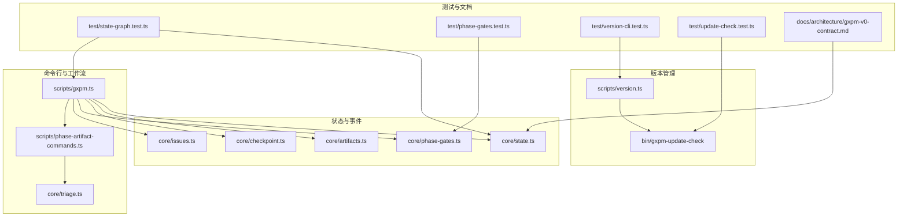
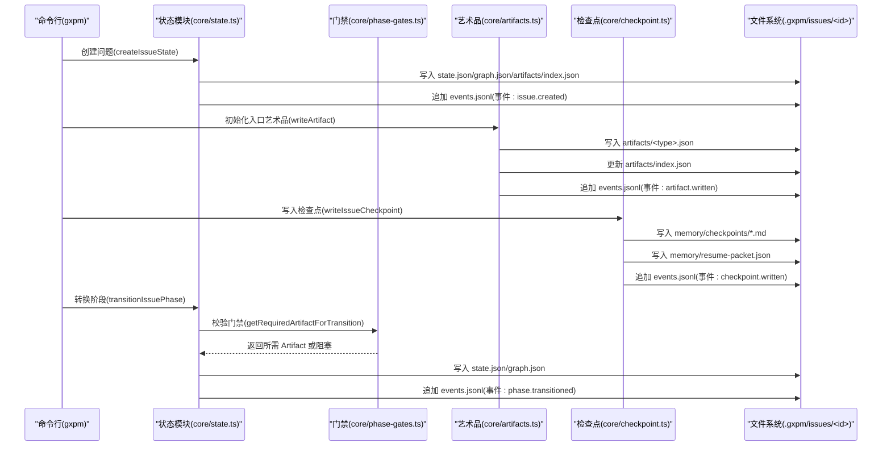
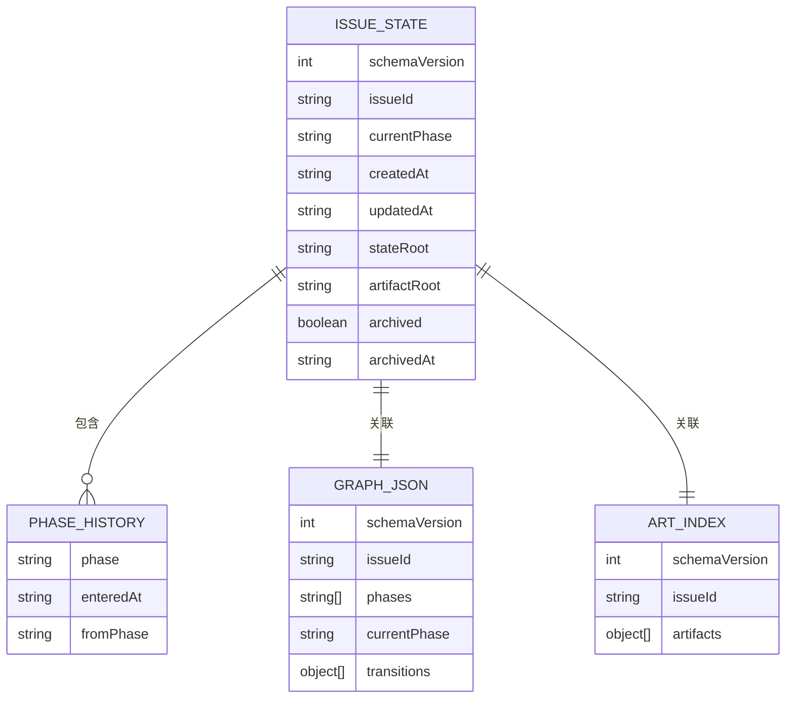
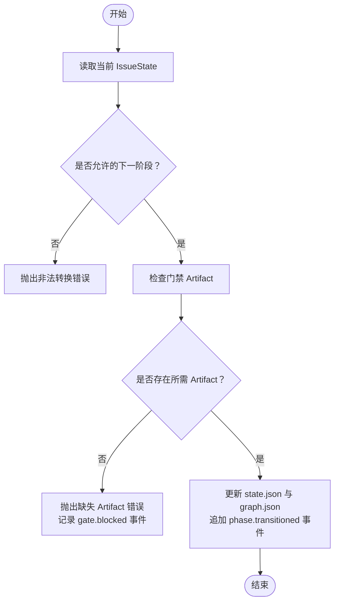
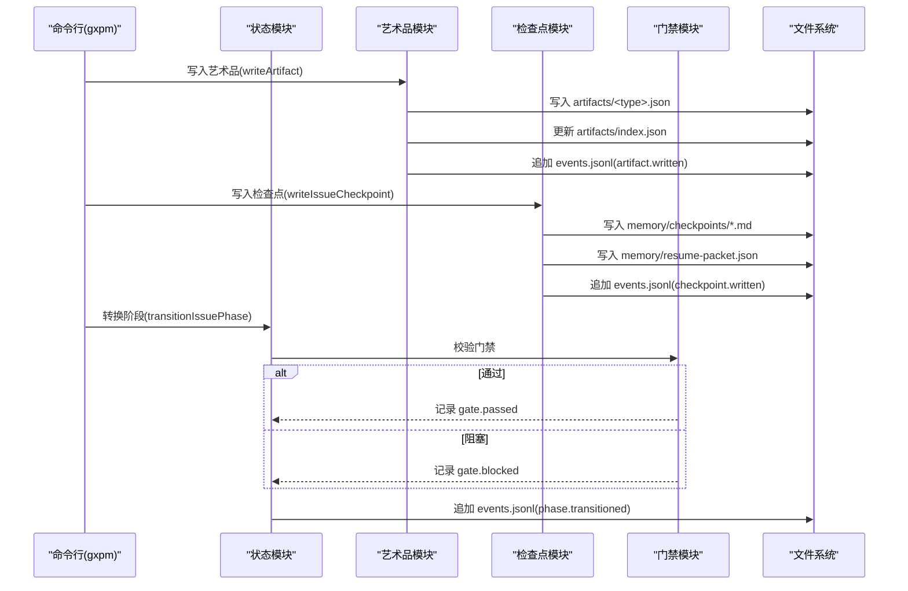
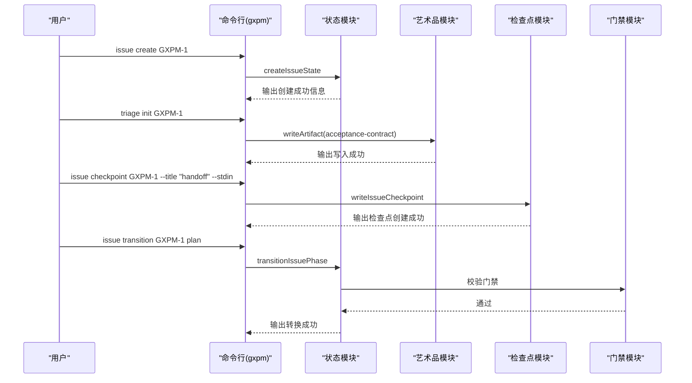
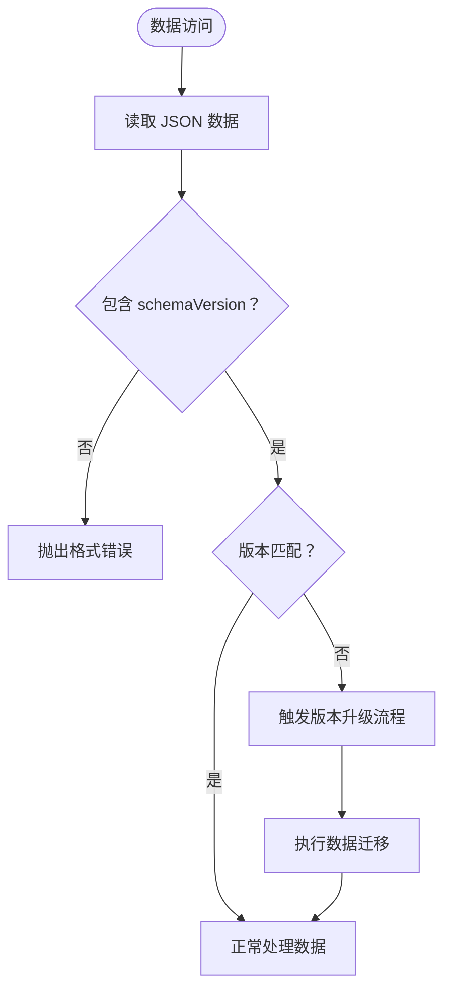
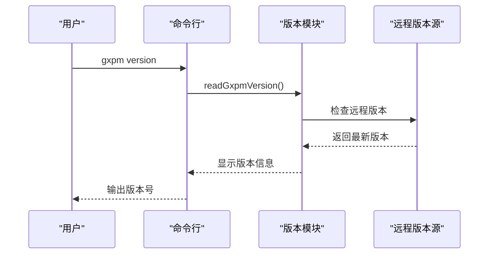
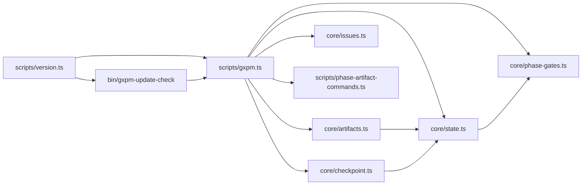

# 状态机系统

<cite>
**本文引用的文件列表**
- [core/state.ts](file://core/state.ts)
- [core/artifacts.ts](file://core/artifacts.ts)
- [core/checkpoint.ts](file://core/checkpoint.ts)
- [core/phase-gates.ts](file://core/phase-gates.ts)
- [core/issues.ts](file://core/issues.ts)
- [core/triage.ts](file://core/triage.ts)
- [scripts/gxpm.ts](file://scripts/gxpm.ts)
- [scripts/phase-artifact-commands.ts](file://scripts/phase-artifact-commands.ts)
- [scripts/version.ts](file://scripts/version.ts)
- [bin/gxpm-update-check](file://bin/gxpm-update-check)
- [test/state-graph.test.ts](file://test/state-graph.test.ts)
- [test/phase-gates.test.ts](file://test/phase-gates.test.ts)
- [test/version-cli.test.ts](file://test/version-cli.test.ts)
- [test/update-check.test.ts](file://test/update-check.test.ts)
- [docs/architecture/gxpm-v0-contract.md](file://docs/architecture/gxpm-v0-contract.md)
</cite>

## 更新摘要
**所做更改**
- 新增架构版本跟踪机制章节，详细说明 schemaVersion 字段的作用和向后兼容性
- 更新 IssueState 数据结构说明，强调版本控制的重要性
- 新增版本管理与迁移支持章节，涵盖版本验证、迁移策略和兼容性保障
- 扩展事件系统，新增 checkpoint.written 事件类型
- 更新状态持久化机制，包含新的架构版本字段

## 目录
1. [简介](#简介)
2. [项目结构](#项目结构)
3. [核心组件](#核心组件)
4. [架构总览](#架构总览)
5. [详细组件分析](#详细组件分析)
6. [架构版本跟踪机制](#架构版本跟踪机制)
7. [版本管理与迁移支持](#版本管理与迁移支持)
8. [依赖关系分析](#依赖关系分析)
9. [性能考量](#性能考量)
10. [故障排查指南](#故障排查指南)
11. [结论](#结论)
12. [附录](#附录)

## 简介
本文件系统性地解析 gxpm 的状态机系统，重点覆盖以下方面：
- 线性状态转换机制：12 个阶段的严格顺序与转换规则
- IssueState 数据结构：当前阶段、创建时间、更新时间、阶段历史等字段
- 状态持久化机制：state.json、graph.json、artifacts/index.json、events.jsonl 的文件格式与职责
- 事件系统设计：issue.created、phase.transitioned、artifact.written、checkpoint.written、gate.passed、gate.blocked 等事件类型
- 架构版本跟踪机制：schemaVersion 字段确保向后兼容性和迁移支持
- 版本管理与迁移策略：提供完整的版本升级和数据迁移方案
- 典型用法示例：创建新问题、进行阶段转换、记录事件
- 状态机图表与转换流程说明

## 项目结构
围绕状态机系统的关键文件组织如下：
- 状态与事件：core/state.ts
- 艺术品（Artifact）与索引：core/artifacts.ts
- 检查点与恢复包：core/checkpoint.ts
- 阶段门禁规则：core/phase-gates.ts
- 问题清单与自动 ID：core/issues.ts
- 初始阶段入口（triage）：core/triage.ts
- 版本管理：scripts/version.ts
- 命令行入口与工作流编排：scripts/gxpm.ts
- 阶段-艺术品命令映射：scripts/phase-artifact-commands.ts
- 更新检查：bin/gxpm-update-check
- 行为验证测试：test/state-graph.test.ts、test/phase-gates.test.ts、test/version-cli.test.ts、test/update-check.test.ts
- 架构契约文档：docs/architecture/gxpm-v0-contract.md



**图表来源**
- [core/state.ts:1-305](file://core/state.ts#L1-L305)
- [core/artifacts.ts:1-169](file://core/artifacts.ts#L1-L169)
- [core/checkpoint.ts:1-279](file://core/checkpoint.ts#L1-L279)
- [core/phase-gates.ts:1-118](file://core/phase-gates.ts#L1-L118)
- [core/issues.ts:1-120](file://core/issues.ts#L1-L120)
- [core/triage.ts:1-20](file://core/triage.ts#L1-L20)
- [scripts/gxpm.ts:1-611](file://scripts/gxpm.ts#L1-L611)
- [scripts/phase-artifact-commands.ts:1-84](file://scripts/phase-artifact-commands.ts#L1-L84)
- [scripts/version.ts:1-48](file://scripts/version.ts#L1-L48)
- [bin/gxpm-update-check:1-166](file://bin/gxpm-update-check#L1-L166)
- [test/state-graph.test.ts:1-78](file://test/state-graph.test.ts#L1-L78)
- [test/phase-gates.test.ts:1-117](file://test/phase-gates.test.ts#L1-L117)
- [test/version-cli.test.ts:1-48](file://test/version-cli.test.ts#L1-L48)
- [test/update-check.test.ts:1-136](file://test/update-check.test.ts#L1-L136)
- [docs/architecture/gxpm-v0-contract.md:60-108](file://docs/architecture/gxpm-v0-contract.md#L60-L108)

**章节来源**
- [core/state.ts:1-305](file://core/state.ts#L1-L305)
- [scripts/gxpm.ts:1-611](file://scripts/gxpm.ts#L1-L611)

## 核心组件
- IssueState：描述单个问题的状态快照，包含 schemaVersion、issueId、currentPhase、createdAt、updatedAt、stateRoot、artifactRoot、archived、archivedAt、phaseHistory 等字段
- StateEvent：事件记录，包含 schemaVersion、type（如 issue.created、phase.transitioned、artifact.written、checkpoint.written、gate.passed、gate.blocked）、issueId、timestamp、payload
- 阶段常量与顺序：GXPM_PHASES 定义了 12 个阶段的严格线性序列
- 阶段门禁：PHASE_GATE_RULES 将"从某阶段到下一阶段"的转换与所需 Artifact 关联起来
- 艺术品：ARTIFACT_TYPES 定义可写入的产物类型，并通过 artifacts/index.json 维护索引
- 架构版本：CURRENT_SCHEMA_VERSION 用于标识当前状态机架构版本，确保向后兼容性

**章节来源**
- [core/state.ts:11-45](file://core/state.ts#L11-L45)
- [core/artifacts.ts:10-41](file://core/artifacts.ts#L10-L41)
- [core/phase-gates.ts:25-99](file://core/phase-gates.ts#L25-L99)

## 架构总览
状态机由"状态文件 + 事件日志 + 阶段门禁 + 艺术品索引 + 架构版本跟踪"构成，命令行工具统一编排创建、转换、读取与审计，同时提供版本管理和迁移支持。



**图表来源**
- [core/state.ts:89-207](file://core/state.ts#L89-L207)
- [core/artifacts.ts:57-91](file://core/artifacts.ts#L57-L91)
- [core/checkpoint.ts:58-119](file://core/checkpoint.ts#L58-L119)
- [core/phase-gates.ts:107-117](file://core/phase-gates.ts#L107-L117)
- [scripts/gxpm.ts:76-184](file://scripts/gxpm.ts#L76-L184)

## 详细组件分析

### IssueState 数据结构与持久化
- 字段说明
  - schemaVersion：版本号，当前为 1，用于未来兼容
  - issueId：问题标识符，受正则约束
  - currentPhase：当前阶段，取值来自 GXPM_PHASES
  - createdAt/updatedAt：ISO 时间戳
  - stateRoot/artifactRoot：相对路径根，指向 .gxpm/issues/<id>
  - archived/archivedAt：归档标记与时间
  - phaseHistory：阶段历史数组，每项含 phase、enteredAt、fromPhase
- 文件布局
  - state.json：IssueState 的 JSON
  - graph.json：包含 phases、currentPhase、transitions 数组
  - artifacts/index.json：按 type 排序的已写入艺术品类别与路径索引
  - events.jsonl：事件日志，每行一条 JSON



**图表来源**
- [core/state.ts:30-45](file://core/state.ts#L30-L45)
- [core/state.ts:115-127](file://core/state.ts#L115-L127)

**章节来源**
- [core/state.ts:30-45](file://core/state.ts#L30-L45)
- [core/state.ts:115-127](file://core/state.ts#L115-L127)

### 线性状态转换机制与规则
- 阶段顺序：triage → plan → dispatch → implement → local-verify → ac-check → self-review → ship → pr-check → verify → qa → land
- 转换规则
  - 仅允许按顺序推进，不允许跳过阶段
  - 转换前检查门禁：若下一阶段需要特定 Artifact，则必须存在对应 artifacts/<type>.json
  - 成功转换后更新 state.json、graph.json，并追加 phase.transitioned 事件
- 错误处理
  - 非法阶段转换会抛出错误
  - 缺少门禁 Artifact 会抛出错误并记录 gate.blocked 事件



**图表来源**
- [core/state.ts:152-207](file://core/state.ts#L152-L207)
- [core/state.ts:255-304](file://core/state.ts#L255-L304)

**章节来源**
- [core/state.ts:13-26](file://core/state.ts#L13-L26)
- [core/state.ts:229-232](file://core/state.ts#L229-L232)
- [core/state.ts:152-207](file://core/state.ts#L152-L207)
- [core/state.ts:255-304](file://core/state.ts#L255-L304)

### 事件系统设计
- 事件类型
  - issue.created：创建问题时记录，payload 包含 initialPhase
  - artifact.written：写入艺术品时记录，payload 包含 artifactType 与 path
  - checkpoint.written：写入检查点时记录，payload 包含 checkpointPath 与 resumePacketPath
  - phase.transitioned：阶段转换时记录，payload 包含 fromPhase 与 toPhase
  - gate.passed/gate.blocked：门禁校验结果，分别记录通过与阻塞详情
- 事件存储
  - events.jsonl：每行一条事件 JSON，便于增量读取与审计
- 命令行查看
  - gxpm issue history 可输出事件时间线



**图表来源**
- [core/artifacts.ts:57-91](file://core/artifacts.ts#L57-L91)
- [core/checkpoint.ts:58-119](file://core/checkpoint.ts#L58-L119)
- [core/state.ts:174-207](file://core/state.ts#L174-L207)
- [scripts/gxpm.ts:314-360](file://scripts/gxpm.ts#L314-L360)

**章节来源**
- [core/state.ts:47-59](file://core/state.ts#L47-L59)
- [core/artifacts.ts:148-161](file://core/artifacts.ts#L148-L161)
- [core/checkpoint.ts:101-110](file://core/checkpoint.ts#L101-L110)
- [scripts/gxpm.ts:314-360](file://scripts/gxpm.ts#L314-L360)

### 艺术品与门禁
- 艺术品类型：定义于 ARTIFACT_TYPES，部分类型与阶段门禁绑定
- 门禁规则：PHASE_GATE_RULES 明确"从某阶段到下一阶段"所需的 Artifact 类型，并提供对应的 CLI 命令提示
- 命令映射：scripts/phase-artifact-commands.ts 将规则与初始化函数绑定，支持一键生成草稿

```mermaid
classDiagram
class PhaseGateRule {
+string command
+string fromPhase
+string nextPhase
+string requiredArtifact
}
class ArtifactType {
<<enumeration>>
"issue-intake","triage-report","acceptance-contract","implementation-plan","dispatch-handoff","local-verify","acceptance-check","self-review","ship-readiness","pr-check","verify-findings","qa-findings","land-findings"
}
class PHASE_GATE_RULES {
+PhaseGateRule[]
}
PHASE_GATE_RULES --> PhaseGateRule : "包含"
PhaseGateRule --> ArtifactType : "requiredArtifact"
```

**图表来源**
- [core/phase-gates.ts:25-99](file://core/phase-gates.ts#L25-L99)
- [core/artifacts.ts:10-26](file://core/artifacts.ts#L10-L26)

**章节来源**
- [core/phase-gates.ts:25-99](file://core/phase-gates.ts#L25-L99)
- [scripts/phase-artifact-commands.ts:22-76](file://scripts/phase-artifact-commands.ts#L22-L76)

### 命令行工作流与示例
- 创建问题
  - gxpm issue create <issue-id> 或 --auto-id
  - 自动创建目录与 state.json、graph.json、artifacts/index.json、events.jsonl
- 初始化入口艺术品
  - triage：gxpm triage init <issue-id>（内部调用 writeArtifact）
- 写入检查点
  - gxpm issue checkpoint <issue-id> --title <title> --stdin
  - 生成人类可读的检查点文档和机器可读的恢复包
- 转换阶段
  - gxpm issue transition <issue-id> <phase>
  - 会触发门禁校验与事件记录
- 查看历史
  - gxpm issue history <issue-id> [--json]



**图表来源**
- [scripts/gxpm.ts:76-93](file://scripts/gxpm.ts#L76-L93)
- [core/triage.ts:8-19](file://core/triage.ts#L8-L19)
- [core/checkpoint.ts:58-119](file://core/checkpoint.ts#L58-L119)
- [scripts/gxpm.ts:176-184](file://scripts/gxpm.ts#L176-L184)
- [test/state-graph.test.ts:16-65](file://test/state-graph.test.ts#L16-L65)

**章节来源**
- [scripts/gxpm.ts:76-184](file://scripts/gxpm.ts#L76-L184)
- [core/triage.ts:8-19](file://core/triage.ts#L8-L19)
- [core/checkpoint.ts:58-119](file://core/checkpoint.ts#L58-L119)
- [test/state-graph.test.ts:16-65](file://test/state-graph.test.ts#L16-L65)

## 架构版本跟踪机制

### schemaVersion 字段设计
- 版本标识：所有核心数据结构（IssueState、StateEvent、StoredArtifact、ResumePacket 等）均包含 schemaVersion 字段
- 当前版本：CURRENT_SCHEMA_VERSION = 1，表示当前使用的第一版架构
- 向后兼容：通过 schemaVersion 字段识别不同版本的数据格式，确保新旧版本共存
- 迁移路径：为未来版本升级预留空间，支持渐进式迁移

### 版本控制策略
- 强制版本匹配：读取数据时验证 schemaVersion 与当前版本一致
- 渐进式升级：支持跨多版本的连续升级，无需一次性迁移
- 兼容性保障：旧版本数据在新版本环境中仍可读取，但可能无法写入新字段
- 错误处理：版本不匹配时抛出明确的错误信息，指导用户进行版本升级



**图表来源**
- [core/state.ts:30-45](file://core/state.ts#L30-L45)
- [core/artifacts.ts:28-41](file://core/artifacts.ts#L28-L41)
- [core/checkpoint.ts:24-39](file://core/checkpoint.ts#L24-L39)

**章节来源**
- [core/state.ts:11](file://core/state.ts#L11)
- [core/state.ts:30-45](file://core/state.ts#L30-L45)
- [core/artifacts.ts:28-41](file://core/artifacts.ts#L28-L41)
- [core/checkpoint.ts:24-39](file://core/checkpoint.ts#L24-L39)

## 版本管理与迁移支持

### 版本文件管理
- VERSION 文件：位于仓库根目录，使用四段数字格式（主版本.次版本.修订号.构建号）
- 版本验证：scripts/version.ts 提供版本一致性检查，确保 VERSION 文件与 package.json 中的版本保持同步
- CLI 支持：gxpm version 和 gxpm --version 命令显示当前版本信息
- 版本格式：必须符合 /^\d+\.\d+\.\d+\.\d+$/ 正则表达式

### 更新检查机制
- 自动检查：bin/gxpm-update-check 脚本定期检查远程版本更新
- 缓存策略：使用 last-update-check 文件缓存检查结果，避免频繁网络请求
- 静默升级：支持 snooze 功能，允许用户延迟接收特定版本的升级通知
- 标记机制：just-upgraded-from 文件标记最近一次升级的版本

### 迁移支持策略
- 数据迁移：当架构版本升级时，提供自动迁移脚本处理数据格式转换
- 兼容性层：旧版本数据在新版本环境中可读取，但写入操作会自动升级格式
- 回滚能力：支持降级到之前的版本，数据格式会相应调整
- 测试保障：通过单元测试验证版本迁移的正确性和完整性



**图表来源**
- [scripts/version.ts:7-18](file://scripts/version.ts#L7-L18)
- [bin/gxpm-update-check:84-96](file://bin/gxpm-update-check#L84-L96)

**章节来源**
- [scripts/version.ts:1-48](file://scripts/version.ts#L1-L48)
- [bin/gxpm-update-check:1-166](file://bin/gxpm-update-check#L1-L166)
- [test/version-cli.test.ts:1-48](file://test/version-cli.test.ts#L1-L48)
- [test/update-check.test.ts:1-136](file://test/update-check.test.ts#L1-L136)

## 依赖关系分析
- 模块耦合
  - state.ts 依赖 phase-gates.ts（门禁规则），依赖 artifacts.ts（事件中记录 artifact.written）
  - artifacts.ts 依赖 state.ts（读取 IssueState、事件写入）
  - checkpoint.ts 依赖 state.ts（读取 IssueState、事件写入）
  - scripts/gxpm.ts 依赖 state.ts、artifacts.ts、phase-gates.ts、issues.ts
  - scripts/version.ts 依赖 fs 模块进行版本文件读取
  - bin/gxpm-update-check 依赖 gxpm 命令进行配置查询
  - phase-artifact-commands.ts 依赖 phase-gates.ts 与各阶段初始化器
- 关键依赖链
  - 转换阶段 → 门禁校验 → 更新状态与图谱 → 追加事件
  - 写入艺术品 → 更新索引 → 追加事件
  - 写入检查点 → 生成恢复包 → 追加事件
  - 版本检查 → 缓存管理 → 升级通知



**图表来源**
- [scripts/gxpm.ts:1-31](file://scripts/gxpm.ts#L1-L31)
- [core/state.ts:1-10](file://core/state.ts#L1-L10)
- [core/artifacts.ts:1-8](file://core/artifacts.ts#L1-L8)
- [core/checkpoint.ts:1-12](file://core/checkpoint.ts#L1-L12)
- [core/phase-gates.ts:1-3](file://core/phase-gates.ts#L1-L3)
- [scripts/phase-artifact-commands.ts:1-14](file://scripts/phase-artifact-commands.ts#L1-L14)
- [scripts/version.ts:1-5](file://scripts/version.ts#L1-L5)
- [bin/gxpm-update-check:1-13](file://bin/gxpm-update-check#L1-L13)

**章节来源**
- [scripts/gxpm.ts:1-31](file://scripts/gxpm.ts#L1-L31)
- [core/state.ts:1-10](file://core/state.ts#L1-L10)
- [core/artifacts.ts:1-8](file://core/artifacts.ts#L1-L8)
- [core/checkpoint.ts:1-12](file://core/checkpoint.ts#L1-L12)
- [core/phase-gates.ts:1-3](file://core/phase-gates.ts#L1-L3)
- [scripts/phase-artifact-commands.ts:1-14](file://scripts/phase-artifact-commands.ts#L1-L14)
- [scripts/version.ts:1-5](file://scripts/version.ts#L1-L5)
- [bin/gxpm-update-check:1-13](file://bin/gxpm-update-check#L1-L13)

## 性能考量
- 文件 I/O
  - state.json、graph.json、artifacts/index.json、events.jsonl 均为小文件，频繁读写成本低
  - 事件采用 JSONL 追加写入，避免大文件重写
  - 检查点文件采用唯一命名策略，避免文件冲突
- 索引维护
  - artifacts/index.json 通过 upsertRecord 保证有序且去重，排序复杂度 O(n log n)，n 为已写入艺术品类别数
  - 恢复包文件结构简单，读取速度快
- 门禁校验
  - 仅检查 artifacts/<type>.json 是否存在，O(1) 成本
- 版本管理
  - 版本检查使用缓存机制，减少网络请求频率
  - 更新检查脚本支持强制刷新，确保版本信息准确性
- 建议
  - 在批量操作时合并多次写入，减少磁盘往返
  - 使用原子写入策略（先写临时文件再 rename）可进一步提升一致性
  - 合理设置版本检查间隔，平衡更新及时性与性能开销

## 故障排查指南
- 常见错误与定位
  - "非法阶段转换"：检查当前阶段与目标阶段是否相邻；可通过 gxpm issue next 获取下一步建议
  - "缺少门禁 Artifact"：根据提示运行对应 phase-artifact 命令生成草稿，再执行转换
  - "问题不存在"：确认 .gxpm/issues/<id>/state.json 存在
  - "事件历史为空"：确认 events.jsonl 存在且未被删除
  - "版本不匹配"：运行 gxpm version 检查当前版本，必要时执行版本升级
  - "检查点创建失败"：确认内存目录权限，检查 payload 格式是否正确
- 命令辅助
  - gxpm issue next：显示当前阶段的门禁 Artifact 与下一步命令
  - gxpm issue history：查看事件时间线，定位 gate.blocked/gate.passed 的触发点
  - gxpm artifact list/read：核对艺术品类别与内容
  - gxpm version：显示当前版本信息，检查版本一致性
  - gxpm update-check：手动检查版本更新

**章节来源**
- [scripts/gxpm.ts:362-388](file://scripts/gxpm.ts#L362-L388)
- [scripts/gxpm.ts:314-360](file://scripts/gxpm.ts#L314-L360)
- [test/state-graph.test.ts:67-76](file://test/state-graph.test.ts#L67-L76)
- [test/version-cli.test.ts:12-48](file://test/version-cli.test.ts#L12-L48)
- [test/update-check.test.ts:43-136](file://test/update-check.test.ts#L43-L136)

## 结论
gxpm 的状态机系统以线性阶段为核心，通过严格的门禁规则与事件日志确保流程可审计、可回溯。新增的架构版本跟踪机制提供了强大的向后兼容性和迁移支持，确保系统能够平滑演进。IssueState 与 graph.json 提供状态与历史视图，artifacts/index.json 与 events.jsonl 提供产物与行为审计，checkpoint 系统增强了上下文恢复能力。命令行工具将这些能力整合为清晰的工作流，配合版本管理系统，便于团队协作与治理。

## 附录

### 阶段顺序与门禁映射
- triage → plan：需要 acceptance-contract
- plan → dispatch：需要 implementation-plan
- dispatch → implement：需要 dispatch-handoff
- implement → local-verify：需要 local-verify
- local-verify → ac-check：需要 acceptance-check
- ac-check → self-review：需要 self-review
- self-review → ship：需要 ship-readiness
- ship → pr-check：需要 pr-check
- pr-check → verify：需要 verify-findings
- verify → qa：需要 qa-findings
- qa → land：无门禁 Artifact（post-merge 自动 land）

**章节来源**
- [core/phase-gates.ts:32-99](file://core/phase-gates.ts#L32-L99)

### 文件格式与字段参考
- state.json
  - schemaVersion、issueId、currentPhase、createdAt、updatedAt、stateRoot、artifactRoot、archived、archivedAt、phaseHistory
- graph.json
  - schemaVersion、issueId、phases（顺序数组）、currentPhase、transitions（数组）
- artifacts/index.json
  - schemaVersion、issueId、artifacts（数组，按 type 排序）
- events.jsonl
  - 每行一条 StateEvent，包含 type、issueId、timestamp、payload
- memory/resume-packet.json
  - schemaVersion、issueId、phase、title、status、branch、writtenAt、checkpointPath、summary、decisions、remainingWork、notes、filesModified、sessionDurationSeconds
- memory/checkpoints/*.md
  - YAML 头部包含 schemaVersion、issueId、status、phase、branch、timestamp、checkpointPath、files_modified
  - Markdown 内容包含工作摘要、决策、待办事项、备注等

**章节来源**
- [core/state.ts:115-127](file://core/state.ts#L115-L127)
- [core/artifacts.ts:114-140](file://core/artifacts.ts#L114-L140)
- [core/state.ts:47-59](file://core/state.ts#L47-L59)
- [core/checkpoint.ts:24-39](file://core/checkpoint.ts#L24-L39)
- [core/checkpoint.ts:50-56](file://core/checkpoint.ts#L50-L56)
- [core/checkpoint.ts:221-250](file://core/checkpoint.ts#L221-L250)

### 版本管理配置
- VERSION 文件：四段数字格式，位于仓库根目录
- package.json：与 VERSION 文件保持同步
- 更新检查：支持强制刷新、静默升级、版本缓存
- CLI 命令：version、--version、-v 别名

**章节来源**
- [scripts/version.ts:1-48](file://scripts/version.ts#L1-L48)
- [bin/gxpm-update-check:1-166](file://bin/gxpm-update-check#L1-L166)
- [test/version-cli.test.ts:12-48](file://test/version-cli.test.ts#L12-L48)
- [test/update-check.test.ts:43-136](file://test/update-check.test.ts#L43-L136)