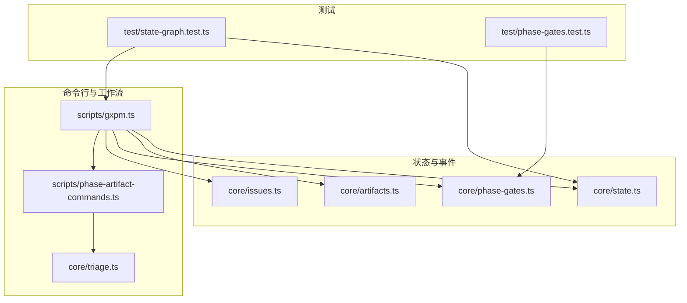
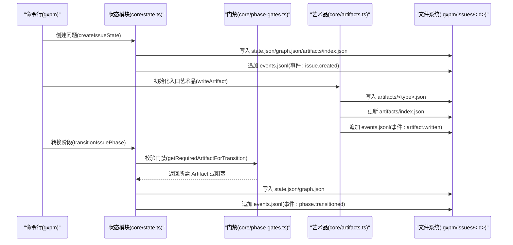
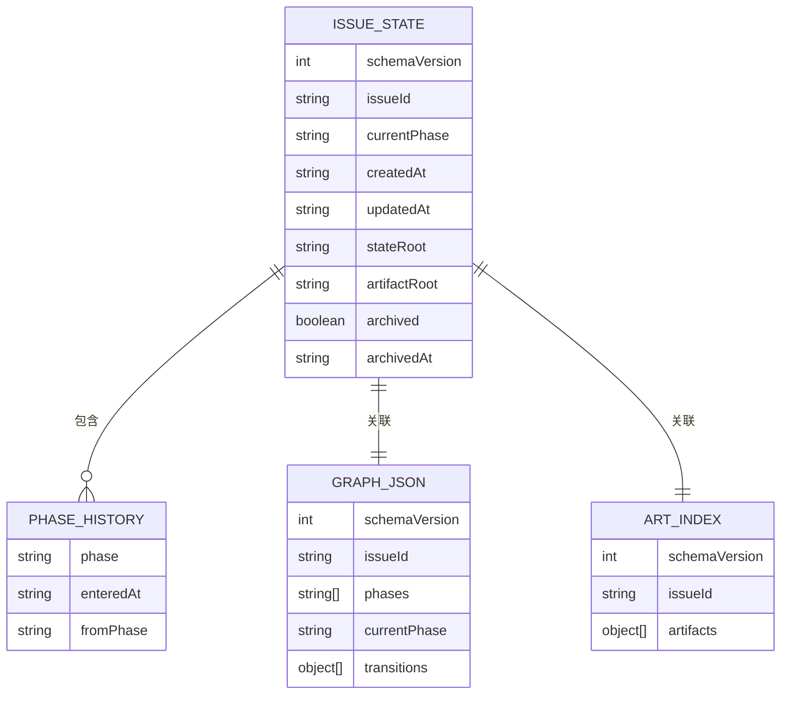
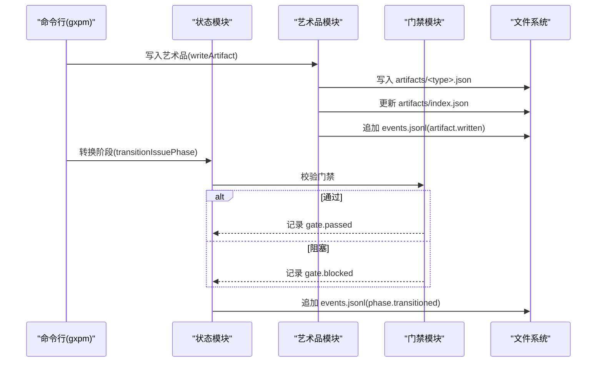
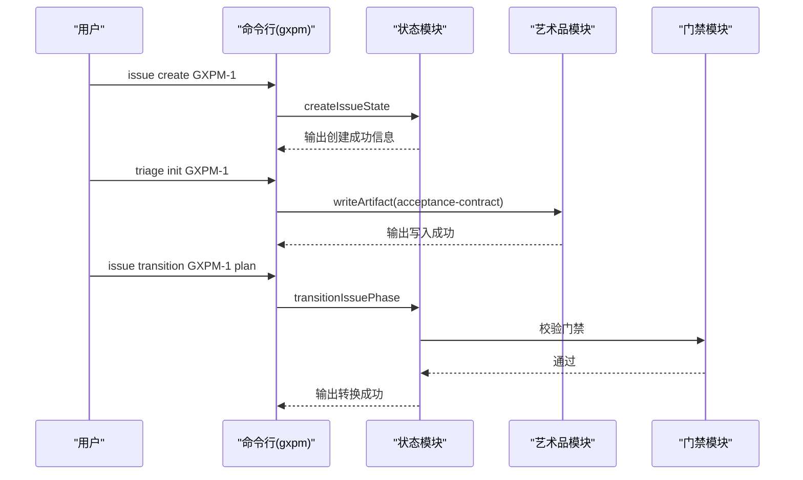
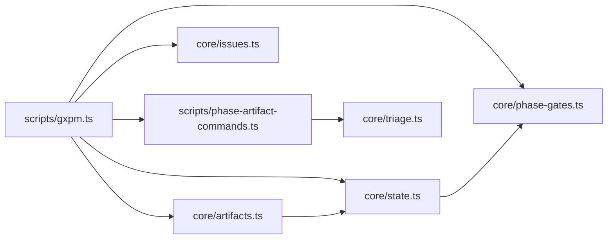

# 状态机系统

<cite>
**本文引用的文件列表**
- [core/state.ts](file://core/state.ts)
- [core/artifacts.ts](file://core/artifacts.ts)
- [core/phase-gates.ts](file://core/phase-gates.ts)
- [core/issues.ts](file://core/issues.ts)
- [core/triage.ts](file://core/triage.ts)
- [scripts/gxpm.ts](file://scripts/gxpm.ts)
- [scripts/phase-artifact-commands.ts](file://scripts/phase-artifact-commands.ts)
- [test/state-graph.test.ts](file://test/state-graph.test.ts)
- [test/phase-gates.test.ts](file://test/phase-gates.test.ts)
</cite>

## 目录
1. [简介](#简介)
2. [项目结构](#项目结构)
3. [核心组件](#核心组件)
4. [架构总览](#架构总览)
5. [详细组件分析](#详细组件分析)
6. [依赖关系分析](#依赖关系分析)
7. [性能考量](#性能考量)
8. [故障排查指南](#故障排查指南)
9. [结论](#结论)
10. [附录](#附录)

## 简介
本文件系统性地解析 gxpm 的状态机系统，重点覆盖以下方面：
- 线性状态转换机制：12 个阶段的严格顺序与转换规则
- IssueState 数据结构：当前阶段、创建时间、更新时间、阶段历史等字段
- 状态持久化机制：state.json、graph.json、artifacts/index.json、events.jsonl 的文件格式与职责
- 事件系统设计：issue.created、phase.transitioned、artifact.written、gate.passed、gate.blocked 等事件类型
- 典型用法示例：创建新问题、进行阶段转换、记录事件
- 状态机图表与转换流程说明

## 项目结构
围绕状态机系统的关键文件组织如下：
- 状态与事件：core/state.ts
- 艺术品（Artifact）与索引：core/artifacts.ts
- 阶段门禁规则：core/phase-gates.ts
- 问题清单与自动 ID：core/issues.ts
- 初始阶段入口（triage）：core/triage.ts
- 命令行入口与工作流编排：scripts/gxpm.ts
- 阶段-艺术品命令映射：scripts/phase-artifact-commands.ts
- 行为验证测试：test/state-graph.test.ts、test/phase-gates.test.ts



**图表来源**
- [core/state.ts:1-302](file://core/state.ts#L1-L302)
- [core/artifacts.ts:1-169](file://core/artifacts.ts#L1-L169)
- [core/phase-gates.ts:1-118](file://core/phase-gates.ts#L1-L118)
- [core/issues.ts:1-120](file://core/issues.ts#L1-L120)
- [core/triage.ts:1-20](file://core/triage.ts#L1-L20)
- [scripts/gxpm.ts:1-611](file://scripts/gxpm.ts#L1-L611)
- [scripts/phase-artifact-commands.ts:1-84](file://scripts/phase-artifact-commands.ts#L1-L84)
- [test/state-graph.test.ts:1-78](file://test/state-graph.test.ts#L1-L78)
- [test/phase-gates.test.ts:1-117](file://test/phase-gates.test.ts#L1-L117)

**章节来源**
- [core/state.ts:1-302](file://core/state.ts#L1-L302)
- [scripts/gxpm.ts:1-611](file://scripts/gxpm.ts#L1-L611)

## 核心组件
- IssueState：描述单个问题的状态快照，包含 schemaVersion、issueId、currentPhase、createdAt、updatedAt、stateRoot、artifactRoot、archived、archivedAt、phaseHistory 等字段
- StateEvent：事件记录，包含 schemaVersion、type（如 issue.created、phase.transitioned、artifact.written、gate.passed、gate.blocked）、issueId、timestamp、payload
- 阶段常量与顺序：GXPM_PHASES 定义了 12 个阶段的严格线性序列
- 阶段门禁：PHASE_GATE_RULES 将“从某阶段到下一阶段”的转换与所需 Artifact 关联起来
- 艺术品：ARTIFACT_TYPES 定义可写入的产物类型，并通过 artifacts/index.json 维护索引

**章节来源**
- [core/state.ts:11-43](file://core/state.ts#L11-L43)
- [core/artifacts.ts:10-41](file://core/artifacts.ts#L10-L41)
- [core/phase-gates.ts:25-99](file://core/phase-gates.ts#L25-L99)

## 架构总览
状态机由“状态文件 + 事件日志 + 阶段门禁 + 艺术品索引”构成，命令行工具统一编排创建、转换、读取与审计。



**图表来源**
- [core/state.ts:86-204](file://core/state.ts#L86-L204)
- [core/artifacts.ts:57-91](file://core/artifacts.ts#L57-L91)
- [core/phase-gates.ts:107-117](file://core/phase-gates.ts#L107-L117)
- [scripts/gxpm.ts:76-184](file://scripts/gxpm.ts#L76-L184)

## 详细组件分析

### IssueState 数据结构与持久化
- 字段说明
  - schemaVersion：版本号，用于未来兼容
  - issueId：问题标识符，受正则约束
  - currentPhase：当前阶段，取值来自 GXPM_PHASES
  - createdAt/updatedAt：ISO 时间戳
  - stateRoot/artifactRoot：相对路径根，指向 .gxpm/issues/<id>
  - archived/archivedAt：归档标记与时间
  - phaseHistory：阶段历史数组，每项含 phase、enteredAt、fromPhase
- 文件布局
  - state.json：IssueState 的 JSON
  - graph.json：包含 phases、currentPhase、transitions 数组
  - artifacts/index.json：按 type 排序的已写入艺术品类别与路径索引
  - events.jsonl：事件日志，每行一条 JSON



**图表来源**
- [core/state.ts:28-43](file://core/state.ts#L28-L43)
- [core/state.ts:112-123](file://core/state.ts#L112-L123)

**章节来源**
- [core/state.ts:28-43](file://core/state.ts#L28-L43)
- [core/state.ts:112-123](file://core/state.ts#L112-L123)

### 线性状态转换机制与规则
- 阶段顺序：triage → plan → dispatch → implement → local-verify → ac-check → self-review → ship → pr-check → verify → qa → land
- 转换规则
  - 仅允许按顺序推进，不允许跳过阶段
  - 转换前检查门禁：若下一阶段需要特定 Artifact，则必须存在对应 artifacts/<type>.json
  - 成功转换后更新 state.json、graph.json，并追加 phase.transitioned 事件
- 错误处理
  - 非法阶段转换会抛出错误
  - 缺少门禁 Artifact 会抛出错误并记录 gate.blocked 事件


**图表来源**
- [core/state.ts:149-204](file://core/state.ts#L149-L204)
- [core/state.ts:252-301](file://core/state.ts#L252-L301)

**章节来源**
- [core/state.ts:11-24](file://core/state.ts#L11-L24)
- [core/state.ts:226-229](file://core/state.ts#L226-L229)
- [core/state.ts:149-204](file://core/state.ts#L149-L204)
- [core/state.ts:252-301](file://core/state.ts#L252-L301)

### 事件系统设计
- 事件类型
  - issue.created：创建问题时记录，payload 包含 initialPhase
  - artifact.written：写入艺术品时记录，payload 包含 artifactType 与 path
  - phase.transitioned：阶段转换时记录，payload 包含 fromPhase 与 toPhase
  - gate.passed/gate.blocked：门禁校验结果，分别记录通过与阻塞详情
- 事件存储
  - events.jsonl：每行一条事件 JSON，便于增量读取与审计
- 命令行查看
  - gxpm issue history 可输出事件时间线



**图表来源**
- [core/artifacts.ts:57-91](file://core/artifacts.ts#L57-L91)
- [core/artifacts.ts:148-161](file://core/artifacts.ts#L148-L161)
- [core/state.ts:164-201](file://core/state.ts#L164-L201)
- [scripts/gxpm.ts:314-360](file://scripts/gxpm.ts#L314-L360)

**章节来源**
- [core/state.ts:45-56](file://core/state.ts#L45-L56)
- [core/artifacts.ts:148-161](file://core/artifacts.ts#L148-L161)
- [scripts/gxpm.ts:314-360](file://scripts/gxpm.ts#L314-L360)

### 艺术品与门禁
- 艺术品类型：定义于 ARTIFACT_TYPES，部分类型与阶段门禁绑定
- 门禁规则：PHASE_GATE_RULES 明确“从某阶段到下一阶段”所需的 Artifact 类型，并提供对应的 CLI 命令提示
- 命令映射：scripts/phase-artifact-commands.ts 将规则与初始化函数绑定，支持一键生成草稿

```mermaid
classDiagram
class PhaseGateRule {
+string command
+string fromPhase
+string nextPhase
+string requiredArtifact
}
class ArtifactType {
<<enumeration>>
"issue-intake","triage-report","acceptance-contract","implementation-plan","dispatch-handoff","local-verify","acceptance-check","self-review","ship-readiness","pr-check","verify-findings","qa-findings","land-findings"
}
class PHASE_GATE_RULES {
+PhaseGateRule[]
}
PHASE_GATE_RULES --> PhaseGateRule : "包含"
PhaseGateRule --> ArtifactType : "requiredArtifact"
```

**图表来源**
- [core/phase-gates.ts:25-99](file://core/phase-gates.ts#L25-L99)
- [core/artifacts.ts:10-26](file://core/artifacts.ts#L10-L26)

**章节来源**
- [core/phase-gates.ts:25-99](file://core/phase-gates.ts#L25-L99)
- [scripts/phase-artifact-commands.ts:22-76](file://scripts/phase-artifact-commands.ts#L22-L76)

### 命令行工作流与示例
- 创建问题
  - gxpm issue create <issue-id> 或 --auto-id
  - 自动创建目录与 state.json、graph.json、artifacts/index.json、events.jsonl
- 初始化入口艺术品
  - triage：gxpm triage init <issue-id>（内部调用 writeArtifact）
- 转换阶段
  - gxpm issue transition <issue-id> <phase>
  - 会触发门禁校验与事件记录
- 查看历史
  - gxpm issue history <issue-id> [--json]



**图表来源**
- [scripts/gxpm.ts:76-93](file://scripts/gxpm.ts#L76-L93)
- [core/triage.ts:8-19](file://core/triage.ts#L8-L19)
- [scripts/gxpm.ts:176-184](file://scripts/gxpm.ts#L176-L184)
- [test/state-graph.test.ts:16-65](file://test/state-graph.test.ts#L16-L65)

**章节来源**
- [scripts/gxpm.ts:76-184](file://scripts/gxpm.ts#L76-L184)
- [core/triage.ts:8-19](file://core/triage.ts#L8-L19)
- [test/state-graph.test.ts:16-65](file://test/state-graph.test.ts#L16-L65)

## 依赖关系分析
- 模块耦合
  - state.ts 依赖 phase-gates.ts（门禁规则），依赖 artifacts.ts（事件中记录 artifact.written）
  - artifacts.ts 依赖 state.ts（读取 IssueState、事件写入）
  - scripts/gxpm.ts 依赖 state.ts、artifacts.ts、phase-gates.ts、issues.ts
  - phase-artifact-commands.ts 依赖 phase-gates.ts 与各阶段初始化器
- 关键依赖链
  - 转换阶段 → 门禁校验 → 更新状态与图谱 → 追加事件
  - 写入艺术品 → 更新索引 → 追加事件



**图表来源**
- [scripts/gxpm.ts:1-31](file://scripts/gxpm.ts#L1-L31)
- [core/state.ts:1-10](file://core/state.ts#L1-L10)
- [core/artifacts.ts:1-8](file://core/artifacts.ts#L1-L8)
- [core/phase-gates.ts:1-3](file://core/phase-gates.ts#L1-L3)
- [scripts/phase-artifact-commands.ts:1-14](file://scripts/phase-artifact-commands.ts#L1-L14)

**章节来源**
- [scripts/gxpm.ts:1-31](file://scripts/gxpm.ts#L1-L31)
- [core/state.ts:1-10](file://core/state.ts#L1-L10)
- [core/artifacts.ts:1-8](file://core/artifacts.ts#L1-L8)
- [core/phase-gates.ts:1-3](file://core/phase-gates.ts#L1-L3)
- [scripts/phase-artifact-commands.ts:1-14](file://scripts/phase-artifact-commands.ts#L1-L14)

## 性能考量
- 文件 I/O
  - state.json、graph.json、artifacts/index.json、events.jsonl 均为小文件，频繁读写成本低
  - 事件采用 JSONL 追加写入，避免大文件重写
- 索引维护
  - artifacts/index.json 通过 upsertRecord 保证有序且去重，排序复杂度 O(n log n)，n 为已写入艺术品类别数
- 门禁校验
  - 仅检查 artifacts/<type>.json 是否存在，O(1) 成本
- 建议
  - 在批量操作时合并多次写入，减少磁盘往返
  - 使用原子写入策略（先写临时文件再 rename）可进一步提升一致性

## 故障排查指南
- 常见错误与定位
  - “非法阶段转换”：检查当前阶段与目标阶段是否相邻；可通过 gxpm issue next 获取下一步建议
  - “缺少门禁 Artifact”：根据提示运行对应 phase-artifact 命令生成草稿，再执行转换
  - “问题不存在”：确认 .gxpm/issues/<id>/state.json 存在
  - “事件历史为空”：确认 events.jsonl 存在且未被删除
- 命令辅助
  - gxpm issue next：显示当前阶段的门禁 Artifact 与下一步命令
  - gxpm issue history：查看事件时间线，定位 gate.blocked/gate.passed 的触发点
  - gxpm artifact list/read：核对艺术品类别与内容

**章节来源**
- [scripts/gxpm.ts:362-388](file://scripts/gxpm.ts#L362-L388)
- [scripts/gxpm.ts:314-360](file://scripts/gxpm.ts#L314-L360)
- [test/state-graph.test.ts:67-76](file://test/state-graph.test.ts#L67-L76)

## 结论
gxpm 的状态机系统以线性阶段为核心，通过严格的门禁规则与事件日志确保流程可审计、可回溯。IssueState 与 graph.json 提供状态与历史视图，artifacts/index.json 与 events.jsonl 提供产物与行为审计。命令行工具将这些能力整合为清晰的工作流，便于团队协作与治理。

## 附录

### 阶段顺序与门禁映射
- triage → plan：需要 acceptance-contract
- plan → dispatch：需要 implementation-plan
- dispatch → implement：需要 dispatch-handoff
- implement → local-verify：需要 local-verify
- local-verify → ac-check：需要 acceptance-check
- ac-check → self-review：需要 self-review
- self-review → ship：需要 ship-readiness
- ship → pr-check：需要 pr-check
- pr-check → verify：需要 verify-findings
- verify → qa：需要 qa-findings
- qa → land：无门禁 Artifact（post-merge 自动 land）

**章节来源**
- [core/phase-gates.ts:32-99](file://core/phase-gates.ts#L32-L99)
- [core/gate.ts:132-143](file://core/gate.ts#L132-L143)

### 文件格式与字段参考
- state.json
  - schemaVersion、issueId、currentPhase、createdAt、updatedAt、stateRoot、artifactRoot、archived、archivedAt、phaseHistory
- graph.json
  - schemaVersion、issueId、phases（顺序数组）、currentPhase、transitions（数组）
- artifacts/index.json
  - schemaVersion、issueId、artifacts（数组，按 type 排序）
- events.jsonl
  - 每行一条 StateEvent，包含 type、issueId、timestamp、payload

**章节来源**
- [core/state.ts:112-123](file://core/state.ts#L112-L123)
- [core/artifacts.ts:114-140](file://core/artifacts.ts#L114-L140)
- [core/state.ts:45-56](file://core/state.ts#L45-L56)